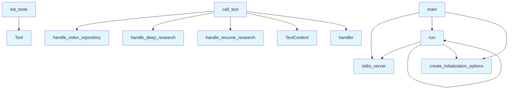

# File Overview

This file implements the main entry point for the `local-deepwiki` MCP (Model Control Protocol) server. It sets up the server with available tools and handles tool execution. The server communicates via stdio using the MCP protocol and integrates with various handlers from the `local_deepwiki.handlers` module to perform tasks such as indexing repositories, conducting deep research, and exporting wiki documentation.

## Dependencies

This file imports:
- `asyncio`
- `typing.Any`
- `mcp.server.Server`
- `mcp.server.stdio.stdio_server`
- `mcp.types.TextContent`, `mcp.types.Tool`
- `local_deepwiki.handlers` module containing:
  - `ToolHandler`
  - [`handle_ask_question`](handlers.md)
  - [`handle_cancel_research`](handlers.md)
  - [`handle_deep_research`](handlers.md)
  - [`handle_detect_secrets`](handlers.md)
  - [`handle_detect_stale_docs`](handlers.md)
  - [`handle_export_wiki_html`](handlers.md)
  - [`handle_export_wiki_pdf`](handlers.md)
  - [`handle_get_api_docs`](handlers.md)
  - [`handle_get_call_graph`](handlers.md)
  - [`handle_get_changelog`](handlers.md)
  - [`handle_get_coverage`](handlers.md)
  - [`handle_get_diagrams`](handlers.md)
  - [`handle_get_glossary`](handlers.md)
  - [`handle_get_index_status`](handlers.md)
  - [`handle_get_inheritance`](handlers.md)
  - `handle_get_project_structure`
  - `handle_get_readme`
  - `handle_get_source_refs`
  - `handle_get_test_coverage`
  - `handle_get_wiki_docs`
  - [`handle_index_repository`](handlers.md)
  - [`handle_resume_research`](handlers.md)
  - `handle_search_docs`
  - `handle_search_source`
  - `handle_summarize_code`
  - `handle_summarize_docs`
  - `handle_summarize_repo`

## Related Files

This file is related to:
- `src/local_deepwiki/core/__init__.py`
- `src/local_deepwiki/generators/source_refs.py`
- `src/local_deepwiki/plugins/base.py`
- `tests/__init__.py`
- `tests/test_plugins.py`

## Integration

This file is called by:
- `list_tools`: used by `test_server`

## Functions

### `list_tools`

```python
async def list_tools() -> list[Tool]:
```

List available tools.

**Returns**
- `list[Tool]`: A list of `Tool` objects representing available tools.


<details>
<summary>View Source (lines 47-558) | <a href="https://github.com/UrbanDiver/local-deepwiki-mcp/blob/main/src/local_deepwiki/server.py#L47-L558">GitHub</a></summary>

```python
async def list_tools() -> list[Tool]:
    """List available tools."""
    return [
        Tool(
            name="index_repository",
            description="Index a repository and generate wiki documentation. This parses all source files, extracts semantic code chunks, generates embeddings, and creates wiki markdown files.",
            inputSchema={
                "type": "object",
                "properties": {
                    "repo_path": {
                        "type": "string",
                        "description": "Absolute path to the repository to index",
                    },
                    "output_dir": {
                        "type": "string",
                        "description": "Optional output directory for wiki (default: {repo}/.deepwiki)",
                    },
                    "languages": {
                        "type": "array",
                        "items": {"type": "string"},
                        "description": "Optional list of languages to include (default: all supported)",
                    },
                    "full_rebuild": {
                        "type": "boolean",
                        "description": "Force full rebuild instead of incremental update (default: false)",
                    },
                    "llm_provider": {
                        "type": "string",
                        "enum": ["ollama", "anthropic", "openai"],
                        "description": "LLM provider for wiki generation (default: from config)",
                    },
                    "embedding_provider": {
                        "type": "string",
                        "enum": ["local", "openai"],
                        "description": "Embedding provider for semantic search (default: from config)",
                    },
                    "use_cloud_for_github": {
                        "type": "boolean",
                        "description": "Use cloud LLM (Anthropic Claude) for GitHub repos. Faster and higher quality but requires API key. (default: from config)",
                    },
                },
                "required": ["repo_path"],
            },
        ),
        Tool(
            name="ask_question",
            description="Ask a question about an indexed repository using RAG. Returns an answer based on relevant code context.",
            inputSchema={
                "type": "object",
                "properties": {
                    "repo_path": {
                        "type": "string",
                        "description": "Path to the indexed repository",
                    },
                    "question": {
                        "type": "string",
                        "description": "Natural language question about the codebase",
                    },
                    "max_context": {
                        "type": "integer",
                        "description": "Maximum number of code chunks for context (default: 10)",
                    },
                },
                "required": ["repo_path", "question"],
            },
        ),
        Tool(
            name="deep_research",
            description="Perform deep research on a codebase question using multi-step reasoning. Unlike ask_question (single retrieval), this performs query decomposition, parallel retrieval, gap analysis, and comprehensive synthesis. Best for complex architectural questions. Supports checkpointing for long-running research that can be resumed if interrupted.",
            inputSchema={
                "type": "object",
                "properties": {
                    "repo_path": {
                        "type": "string",
                        "description": "Path to the indexed repository",
                    },
                    "question": {
                        "type": "string",
                        "description": "Complex architectural question about the codebase",
                    },
                    "max_chunks": {
                        "type": "integer",
                        "description": "Maximum total code chunks to analyze (default: 30)",
                    },
                    "preset": {
                        "type": "string",
                        "enum": ["quick", "default", "thorough"],
                        "description": "Research mode preset: 'quick' (fast, fewer sub-questions), 'default' (balanced), 'thorough' (comprehensive, more analysis)",
                    },
                    "resume_research_id": {
                        "type": "string",
                        "description": "Optional checkpoint ID to resume an interrupted research session. Use list_research_checkpoints to see available checkpoints.",
                    },
                },
                "required": ["repo_path", "question"],
            },
        ),
        Tool(
            name="read_wiki_structure",
            description="Get the table of contents and structure of a generated wiki.",
            inputSchema={
                "type": "object",
                "properties": {
                    "wiki_path": {
                        "type": "string",
                        "description": "Path to the wiki directory (typically {repo}/.deepwiki)",
                    },
                },
                "required": ["wiki_path"],
            },
        ),
        Tool(
            name="read_wiki_page",
            description="Read a specific wiki page content.",
            inputSchema={
                "type": "object",
                "properties": {
                    "wiki_path": {
                        "type": "string",
                        "description": "Path to the wiki directory",
                    },
                    "page": {
                        "type": "string",
                        "description": "Page path relative to wiki root (e.g., 'index.md', 'modules/auth.md')",
                    },
                },
                "required": ["wiki_path", "page"],
            },
        ),
        Tool(
            name="search_code",
            description="Semantic search across the indexed codebase with optional fuzzy matching and filters. Returns relevant code chunks with similarity scores.",
            inputSchema={
                "type": "object",
                "properties": {
                    "repo_path": {
                        "type": "string",
                        "description": "Path to the indexed repository",
                    },
                    "query": {
                        "type": "string",
                        "description": "Semantic search query",
                    },
                    "limit": {
                        "type": "integer",
                        "description": "Maximum number of results (default: 10)",
                    },
                    "language": {
                        "type": "string",
                        "enum": [
                            "python",
                            "javascript",
                            "typescript",
                            "tsx",
                            "go",
                            "rust",
                            "java",
                            "c",
                            "cpp",
                            "swift",
                            "ruby",
                            "php",
                            "kotlin",
                            "csharp",
                        ],
                        "description": "Filter by programming language",
                    },
                    "type": {
                        "type": "string",
                        "enum": [
                            "function",
                            "class",
                            "method",
                            "module",
                            "import",
                            "comment",
                            "other",
                        ],
                        "description": "Filter by chunk type (e.g., function, class, method)",
                    },
                    "path": {
                        "type": "string",
                        "description": "Filter by file path pattern (e.g., 'src/**/*.py', 'tests/*')",
                    },
                    "fuzzy": {
                        "type": "boolean",
                        "description": "Enable fuzzy matching to improve results for exact name matches (default: false)",
                    },
                    "fuzzy_weight": {
                        "type": "number",
                        "description": "Weight for fuzzy matching score (0.0-1.0, default: 0.3). Higher values favor exact text matches over semantic similarity.",
                    },
                },
                "required": ["repo_path", "query"],
            },
        ),
        Tool(
            name="export_wiki_html",
            description="Export wiki documentation to static HTML files. Creates a self-contained website that can be viewed without a server.",
            inputSchema={
                "type": "object",
                "properties": {
                    "wiki_path": {
                        "type": "string",
                        "description": "Path to the wiki directory (typically {repo}/.deepwiki)",
                    },
                    "output_path": {
                        "type": "string",
                        "description": "Output directory for HTML files (default: {wiki_path}_html)",
                    },
                },
                "required": ["wiki_path"],
            },
        ),
        Tool(
            name="export_wiki_pdf",
            description="Export wiki documentation to PDF format. Creates a printable PDF document with proper formatting, page numbers, and table of contents.",
            inputSchema={
                "type": "object",
                "properties": {
                    "wiki_path": {
                        "type": "string",
                        "description": "Path to the wiki directory (typically {repo}/.deepwiki)",
                    },
                    "output_path": {
                        "type": "string",
                        "description": "Output path for PDF file (default: {wiki_path}.pdf)",
                    },
                    "single_file": {
                        "type": "boolean",
                        "description": "If true, combine all pages into one PDF. If false, create separate PDFs for each page. Default: true",
                    },
                },
                "required": ["wiki_path"],
            },
        ),
        Tool(
            name="list_research_checkpoints",
            description="List all research checkpoints for a repository. Shows incomplete and cancelled research sessions that can be resumed using the deep_research tool with resume_research_id.",
            inputSchema={
                "type": "object",
                "properties": {
                    "repo_path": {
                        "type": "string",
                        "description": "Path to the repository to list checkpoints for",
                    },
                },
                "required": ["repo_path"],
            },
        ),
        Tool(
            name="cancel_research",
            description="Cancel an active deep research session and save its checkpoint. The research can be resumed later using the deep_research tool with resume_research_id.",
            inputSchema={
                "type": "object",
                "properties": {
                    "repo_path": {
                        "type": "string",
                        "description": "Path to the repository",
                    },
                    "research_id": {
                        "type": "string",
                        "description": "ID of the research session to cancel (from list_research_checkpoints)",
                    },
                },
                "required": ["repo_path", "research_id"],
            },
        ),
        Tool(
            name="resume_research",
            description="Resume a previously interrupted deep research session from its checkpoint. This is a convenience wrapper - you can also use deep_research with resume_research_id directly.",
            inputSchema={
                "type": "object",
                "properties": {
                    "repo_path": {
                        "type": "string",
                        "description": "Path to the repository",
                    },
                    "research_id": {
                        "type": "string",
                        "description": "ID of the research checkpoint to resume (from list_research_checkpoints)",
                    },
                },
                "required": ["repo_path", "research_id"],
            },
        ),
        Tool(
            name="get_operation_progress",
            description="Get progress for active long-running operations. Supports polling-based progress tracking for clients that cannot receive push notifications. Returns current progress, ETA, and phase information.",
            inputSchema={
                "type": "object",
                "properties": {
                    "operation_id": {
                        "type": "string",
                        "description": "Specific operation ID to get progress for. If not provided, returns all active operations.",
                    },
                },
                "required": [],
            },
        ),
        Tool(
            name="get_glossary",
            description="Get a searchable glossary of all code entities (classes, functions, methods) in an indexed repository. Useful for discovering what's in the codebase.",
            inputSchema={
                "type": "object",
                "properties": {
                    "repo_path": {
                        "type": "string",
                        "description": "Path to the indexed repository",
                    },
                    "search": {
                        "type": "string",
                        "description": "Optional search term to filter entities by name or docstring",
                    },
                },
                "required": ["repo_path"],
            },
        ),
        Tool(
            name="get_diagrams",
            description="Generate Mermaid diagrams for an indexed repository. Supports class diagrams, dependency graphs, module overviews, language distribution pie charts, and sequence diagrams.",
            inputSchema={
                "type": "object",
                "properties": {
                    "repo_path": {
                        "type": "string",
                        "description": "Path to the indexed repository",
                    },
                    "diagram_type": {
                        "type": "string",
                        "enum": [
                            "class",
                            "dependency",
                            "module",
                            "sequence",
                            "language_pie",
                        ],
                        "description": "Type of diagram to generate (default: class)",
                    },
                    "entry_point": {
                        "type": "string",
                        "description": "Entry point function name (required for sequence diagrams)",
                    },
                },
                "required": ["repo_path"],
            },
        ),
        Tool(
            name="get_inheritance",
            description="Get class inheritance hierarchy trees for an indexed repository. Shows parent-child relationships, abstract classes, and generates a Mermaid inheritance diagram.",
            inputSchema={
                "type": "object",
                "properties": {
                    "repo_path": {
                        "type": "string",
                        "description": "Path to the indexed repository",
                    },
                },
                "required": ["repo_path"],
            },
        ),
        Tool(
            name="get_call_graph",
            description="Get function call graphs showing which functions call which. Can analyze a specific file or the entire repository. Returns a Mermaid flowchart.",
            inputSchema={
                "type": "object",
                "properties": {
                    "repo_path": {
                        "type": "string",
                        "description": "Path to the indexed repository",
                    },
                    "file_path": {
                        "type": "string",
                        "description": "Specific file to analyze (relative to repo root). If omitted, analyzes entire repo.",
                    },
                },
                "required": ["repo_path"],
            },
        ),
        Tool(
            name="get_coverage",
            description="Get documentation coverage report for an indexed repository. Shows which classes, functions, and methods have docstrings and which don't.",
            inputSchema={
                "type": "object",
                "properties": {
                    "repo_path": {
                        "type": "string",
                        "description": "Path to the indexed repository",
                    },
                },
                "required": ["repo_path"],
            },
        ),
        Tool(
            name="detect_stale_docs",
            description="Find wiki pages that may be outdated because their source files have been modified since the documentation was generated.",
            inputSchema={
                "type": "object",
                "properties": {
                    "repo_path": {
                        "type": "string",
                        "description": "Path to the indexed repository",
                    },
                    "threshold_days": {
                        "type": "integer",
                        "description": "Minimum days since source changed to consider stale (default: 0)",
                    },
                },
                "required": ["repo_path"],
            },
        ),
        Tool(
            name="get_changelog",
            description="Extract recent git commit history as a formatted changelog. Groups commits by date and includes file change information.",
            inputSchema={
                "type": "object",
                "properties": {
                    "repo_path": {
                        "type": "string",
                        "description": "Path to the repository (must be a git repo)",
                    },
                    "max_commits": {
                        "type": "integer",
                        "description": "Maximum number of commits to include (default: 30, max: 200)",
                    },
                },
                "required": ["repo_path"],
            },
        ),
        Tool(
            name="detect_secrets",
            description="Scan a repository for hardcoded credentials and secrets (API keys, tokens, passwords, private keys). Returns findings with type, location, confidence, and remediation advice.",
            inputSchema={
                "type": "object",
                "properties": {
                    "repo_path": {
                        "type": "string",
                        "description": "Path to the repository to scan",
                    },
                },
                "required": ["repo_path"],
            },
        ),
        Tool(
            name="get_test_examples",
            description="Find usage examples for a function or class by searching test files in the indexed repository. Returns code snippets showing how the entity is used in tests.",
            inputSchema={
                "type": "object",
                "properties": {
                    "repo_path": {
                        "type": "string",
                        "description": "Path to the indexed repository",
                    },
                    "entity_name": {
                        "type": "string",
                        "description": "Name of the function or class to find examples for",
                    },
                    "max_examples": {
                        "type": "integer",
                        "description": "Maximum number of examples to return (default: 5)",
                    },
                },
                "required": ["repo_path", "entity_name"],
            },
        ),
        Tool(
            name="get_api_docs",
            description="Get API documentation with function signatures, parameters, return types, and docstrings for a specific file. Uses tree-sitter AST parsing for accuracy.",
            inputSchema={
                "type": "object",
                "properties": {
                    "repo_path": {
                        "type": "string",
                        "description": "Path to the repository",
                    },
                    "file_path": {
                        "type": "string",
                        "description": "File path relative to repo root to get API docs for",
                    },
                },
                "required": ["repo_path", "file_path"],
            },
        ),
        Tool(
            name="list_indexed_repos",
            description="Discover all indexed repositories under a given directory. Searches for .deepwiki directories and returns index metadata for each.",
            inputSchema={
                "type": "object",
                "properties": {
                    "base_path": {
                        "type": "string",
                        "description": "Base directory to search for indexed repos (default: current directory)",
                    },
                },
                "required": [],
            },
        ),
        Tool(
            name="get_index_status",
            description="Get index statistics for a repository without re-indexing. Shows file count, chunk count, languages, and when it was last indexed.",
            inputSchema={
                "type": "object",
                "properties": {
                    "repo_path": {
                        "type": "string",
                        "description": "Path to the indexed repository",
                    },
                },
                "required": ["repo_path"],
            },
        ),
    ]
```

</details>

### `call_tool`

```python
async def call_tool(name: str, arguments: dict[str, Any]) -> list[TextContent]:
```

Handle tool calls.

**Parameters**
- `name`: The name of the tool to call.
- `arguments`: A dictionary of arguments to pass to the tool.

**Returns**
- `list[TextContent]`: A list of `TextContent` objects representing the results of the tool call.


<details>
<summary>View Source (lines 593-613) | <a href="https://github.com/UrbanDiver/local-deepwiki-mcp/blob/main/src/local_deepwiki/server.py#L593-L613">GitHub</a></summary>

```python
async def call_tool(name: str, arguments: dict[str, Any]) -> list[TextContent]:
    """Handle tool calls."""
    logger.info(f"Tool call received: {name}")
    logger.debug(f"Tool arguments: {arguments}")

    # Special handling for tools that need server context for progress streaming
    if name == "index_repository":
        return await handle_index_repository(arguments, server=server)

    if name == "deep_research":
        return await handle_deep_research(arguments, server=server)

    if name == "resume_research":
        return await handle_resume_research(arguments, server=server)

    handler = TOOL_HANDLERS.get(name)
    if handler is None:
        logger.warning(f"Unknown tool requested: {name}")
        return [TextContent(type="text", text=f"Unknown tool: {name}")]

    return await handler(arguments)
```

</details>

### `main`

```python
def main():
```

Main entry point for the MCP server.

**Returns**
- None


<details>
<summary>View Source (lines 616-628) | <a href="https://github.com/UrbanDiver/local-deepwiki-mcp/blob/main/src/local_deepwiki/server.py#L616-L628">GitHub</a></summary>

```python
def main():
    """Main entry point for the MCP server."""
    logger.info("Starting local-deepwiki MCP server")

    async def run():
        async with stdio_server() as (read_stream, write_stream):
            await server.run(
                read_stream,
                write_stream,
                server.create_initialization_options(),
            )

    asyncio.run(run())
```

</details>

### `run`

```python
async def run():
```

Asynchronously run the server.

**Returns**
- None


<details>
<summary>View Source (lines 620-626) | <a href="https://github.com/UrbanDiver/local-deepwiki-mcp/blob/main/src/local_deepwiki/server.py#L620-L626">GitHub</a></summary>

```python
async def run():
        async with stdio_server() as (read_stream, write_stream):
            await server.run(
                read_stream,
                write_stream,
                server.create_initialization_options(),
            )
```

</details>

## Usage Examples

To start the server, run:

```bash
python src/local_deepwiki/server.py
```

This will initialize the MCP server and listen for incoming tool requests via stdio. The server provides tools for indexing repositories, conducting research, and exporting documentation.

## API Reference

### Functions

#### `list_tools`

`@server.list_tools()`

```python
async def list_tools() -> list[Tool]
```

List available tools.

**Returns:** `list[Tool]`


<details>
<summary>View Source (lines 47-558) | <a href="https://github.com/UrbanDiver/local-deepwiki-mcp/blob/main/src/local_deepwiki/server.py#L47-L558">GitHub</a></summary>

```python
async def list_tools() -> list[Tool]:
    """List available tools."""
    return [
        Tool(
            name="index_repository",
            description="Index a repository and generate wiki documentation. This parses all source files, extracts semantic code chunks, generates embeddings, and creates wiki markdown files.",
            inputSchema={
                "type": "object",
                "properties": {
                    "repo_path": {
                        "type": "string",
                        "description": "Absolute path to the repository to index",
                    },
                    "output_dir": {
                        "type": "string",
                        "description": "Optional output directory for wiki (default: {repo}/.deepwiki)",
                    },
                    "languages": {
                        "type": "array",
                        "items": {"type": "string"},
                        "description": "Optional list of languages to include (default: all supported)",
                    },
                    "full_rebuild": {
                        "type": "boolean",
                        "description": "Force full rebuild instead of incremental update (default: false)",
                    },
                    "llm_provider": {
                        "type": "string",
                        "enum": ["ollama", "anthropic", "openai"],
                        "description": "LLM provider for wiki generation (default: from config)",
                    },
                    "embedding_provider": {
                        "type": "string",
                        "enum": ["local", "openai"],
                        "description": "Embedding provider for semantic search (default: from config)",
                    },
                    "use_cloud_for_github": {
                        "type": "boolean",
                        "description": "Use cloud LLM (Anthropic Claude) for GitHub repos. Faster and higher quality but requires API key. (default: from config)",
                    },
                },
                "required": ["repo_path"],
            },
        ),
        Tool(
            name="ask_question",
            description="Ask a question about an indexed repository using RAG. Returns an answer based on relevant code context.",
            inputSchema={
                "type": "object",
                "properties": {
                    "repo_path": {
                        "type": "string",
                        "description": "Path to the indexed repository",
                    },
                    "question": {
                        "type": "string",
                        "description": "Natural language question about the codebase",
                    },
                    "max_context": {
                        "type": "integer",
                        "description": "Maximum number of code chunks for context (default: 10)",
                    },
                },
                "required": ["repo_path", "question"],
            },
        ),
        Tool(
            name="deep_research",
            description="Perform deep research on a codebase question using multi-step reasoning. Unlike ask_question (single retrieval), this performs query decomposition, parallel retrieval, gap analysis, and comprehensive synthesis. Best for complex architectural questions. Supports checkpointing for long-running research that can be resumed if interrupted.",
            inputSchema={
                "type": "object",
                "properties": {
                    "repo_path": {
                        "type": "string",
                        "description": "Path to the indexed repository",
                    },
                    "question": {
                        "type": "string",
                        "description": "Complex architectural question about the codebase",
                    },
                    "max_chunks": {
                        "type": "integer",
                        "description": "Maximum total code chunks to analyze (default: 30)",
                    },
                    "preset": {
                        "type": "string",
                        "enum": ["quick", "default", "thorough"],
                        "description": "Research mode preset: 'quick' (fast, fewer sub-questions), 'default' (balanced), 'thorough' (comprehensive, more analysis)",
                    },
                    "resume_research_id": {
                        "type": "string",
                        "description": "Optional checkpoint ID to resume an interrupted research session. Use list_research_checkpoints to see available checkpoints.",
                    },
                },
                "required": ["repo_path", "question"],
            },
        ),
        Tool(
            name="read_wiki_structure",
            description="Get the table of contents and structure of a generated wiki.",
            inputSchema={
                "type": "object",
                "properties": {
                    "wiki_path": {
                        "type": "string",
                        "description": "Path to the wiki directory (typically {repo}/.deepwiki)",
                    },
                },
                "required": ["wiki_path"],
            },
        ),
        Tool(
            name="read_wiki_page",
            description="Read a specific wiki page content.",
            inputSchema={
                "type": "object",
                "properties": {
                    "wiki_path": {
                        "type": "string",
                        "description": "Path to the wiki directory",
                    },
                    "page": {
                        "type": "string",
                        "description": "Page path relative to wiki root (e.g., 'index.md', 'modules/auth.md')",
                    },
                },
                "required": ["wiki_path", "page"],
            },
        ),
        Tool(
            name="search_code",
            description="Semantic search across the indexed codebase with optional fuzzy matching and filters. Returns relevant code chunks with similarity scores.",
            inputSchema={
                "type": "object",
                "properties": {
                    "repo_path": {
                        "type": "string",
                        "description": "Path to the indexed repository",
                    },
                    "query": {
                        "type": "string",
                        "description": "Semantic search query",
                    },
                    "limit": {
                        "type": "integer",
                        "description": "Maximum number of results (default: 10)",
                    },
                    "language": {
                        "type": "string",
                        "enum": [
                            "python",
                            "javascript",
                            "typescript",
                            "tsx",
                            "go",
                            "rust",
                            "java",
                            "c",
                            "cpp",
                            "swift",
                            "ruby",
                            "php",
                            "kotlin",
                            "csharp",
                        ],
                        "description": "Filter by programming language",
                    },
                    "type": {
                        "type": "string",
                        "enum": [
                            "function",
                            "class",
                            "method",
                            "module",
                            "import",
                            "comment",
                            "other",
                        ],
                        "description": "Filter by chunk type (e.g., function, class, method)",
                    },
                    "path": {
                        "type": "string",
                        "description": "Filter by file path pattern (e.g., 'src/**/*.py', 'tests/*')",
                    },
                    "fuzzy": {
                        "type": "boolean",
                        "description": "Enable fuzzy matching to improve results for exact name matches (default: false)",
                    },
                    "fuzzy_weight": {
                        "type": "number",
                        "description": "Weight for fuzzy matching score (0.0-1.0, default: 0.3). Higher values favor exact text matches over semantic similarity.",
                    },
                },
                "required": ["repo_path", "query"],
            },
        ),
        Tool(
            name="export_wiki_html",
            description="Export wiki documentation to static HTML files. Creates a self-contained website that can be viewed without a server.",
            inputSchema={
                "type": "object",
                "properties": {
                    "wiki_path": {
                        "type": "string",
                        "description": "Path to the wiki directory (typically {repo}/.deepwiki)",
                    },
                    "output_path": {
                        "type": "string",
                        "description": "Output directory for HTML files (default: {wiki_path}_html)",
                    },
                },
                "required": ["wiki_path"],
            },
        ),
        Tool(
            name="export_wiki_pdf",
            description="Export wiki documentation to PDF format. Creates a printable PDF document with proper formatting, page numbers, and table of contents.",
            inputSchema={
                "type": "object",
                "properties": {
                    "wiki_path": {
                        "type": "string",
                        "description": "Path to the wiki directory (typically {repo}/.deepwiki)",
                    },
                    "output_path": {
                        "type": "string",
                        "description": "Output path for PDF file (default: {wiki_path}.pdf)",
                    },
                    "single_file": {
                        "type": "boolean",
                        "description": "If true, combine all pages into one PDF. If false, create separate PDFs for each page. Default: true",
                    },
                },
                "required": ["wiki_path"],
            },
        ),
        Tool(
            name="list_research_checkpoints",
            description="List all research checkpoints for a repository. Shows incomplete and cancelled research sessions that can be resumed using the deep_research tool with resume_research_id.",
            inputSchema={
                "type": "object",
                "properties": {
                    "repo_path": {
                        "type": "string",
                        "description": "Path to the repository to list checkpoints for",
                    },
                },
                "required": ["repo_path"],
            },
        ),
        Tool(
            name="cancel_research",
            description="Cancel an active deep research session and save its checkpoint. The research can be resumed later using the deep_research tool with resume_research_id.",
            inputSchema={
                "type": "object",
                "properties": {
                    "repo_path": {
                        "type": "string",
                        "description": "Path to the repository",
                    },
                    "research_id": {
                        "type": "string",
                        "description": "ID of the research session to cancel (from list_research_checkpoints)",
                    },
                },
                "required": ["repo_path", "research_id"],
            },
        ),
        Tool(
            name="resume_research",
            description="Resume a previously interrupted deep research session from its checkpoint. This is a convenience wrapper - you can also use deep_research with resume_research_id directly.",
            inputSchema={
                "type": "object",
                "properties": {
                    "repo_path": {
                        "type": "string",
                        "description": "Path to the repository",
                    },
                    "research_id": {
                        "type": "string",
                        "description": "ID of the research checkpoint to resume (from list_research_checkpoints)",
                    },
                },
                "required": ["repo_path", "research_id"],
            },
        ),
        Tool(
            name="get_operation_progress",
            description="Get progress for active long-running operations. Supports polling-based progress tracking for clients that cannot receive push notifications. Returns current progress, ETA, and phase information.",
            inputSchema={
                "type": "object",
                "properties": {
                    "operation_id": {
                        "type": "string",
                        "description": "Specific operation ID to get progress for. If not provided, returns all active operations.",
                    },
                },
                "required": [],
            },
        ),
        Tool(
            name="get_glossary",
            description="Get a searchable glossary of all code entities (classes, functions, methods) in an indexed repository. Useful for discovering what's in the codebase.",
            inputSchema={
                "type": "object",
                "properties": {
                    "repo_path": {
                        "type": "string",
                        "description": "Path to the indexed repository",
                    },
                    "search": {
                        "type": "string",
                        "description": "Optional search term to filter entities by name or docstring",
                    },
                },
                "required": ["repo_path"],
            },
        ),
        Tool(
            name="get_diagrams",
            description="Generate Mermaid diagrams for an indexed repository. Supports class diagrams, dependency graphs, module overviews, language distribution pie charts, and sequence diagrams.",
            inputSchema={
                "type": "object",
                "properties": {
                    "repo_path": {
                        "type": "string",
                        "description": "Path to the indexed repository",
                    },
                    "diagram_type": {
                        "type": "string",
                        "enum": [
                            "class",
                            "dependency",
                            "module",
                            "sequence",
                            "language_pie",
                        ],
                        "description": "Type of diagram to generate (default: class)",
                    },
                    "entry_point": {
                        "type": "string",
                        "description": "Entry point function name (required for sequence diagrams)",
                    },
                },
                "required": ["repo_path"],
            },
        ),
        Tool(
            name="get_inheritance",
            description="Get class inheritance hierarchy trees for an indexed repository. Shows parent-child relationships, abstract classes, and generates a Mermaid inheritance diagram.",
            inputSchema={
                "type": "object",
                "properties": {
                    "repo_path": {
                        "type": "string",
                        "description": "Path to the indexed repository",
                    },
                },
                "required": ["repo_path"],
            },
        ),
        Tool(
            name="get_call_graph",
            description="Get function call graphs showing which functions call which. Can analyze a specific file or the entire repository. Returns a Mermaid flowchart.",
            inputSchema={
                "type": "object",
                "properties": {
                    "repo_path": {
                        "type": "string",
                        "description": "Path to the indexed repository",
                    },
                    "file_path": {
                        "type": "string",
                        "description": "Specific file to analyze (relative to repo root). If omitted, analyzes entire repo.",
                    },
                },
                "required": ["repo_path"],
            },
        ),
        Tool(
            name="get_coverage",
            description="Get documentation coverage report for an indexed repository. Shows which classes, functions, and methods have docstrings and which don't.",
            inputSchema={
                "type": "object",
                "properties": {
                    "repo_path": {
                        "type": "string",
                        "description": "Path to the indexed repository",
                    },
                },
                "required": ["repo_path"],
            },
        ),
        Tool(
            name="detect_stale_docs",
            description="Find wiki pages that may be outdated because their source files have been modified since the documentation was generated.",
            inputSchema={
                "type": "object",
                "properties": {
                    "repo_path": {
                        "type": "string",
                        "description": "Path to the indexed repository",
                    },
                    "threshold_days": {
                        "type": "integer",
                        "description": "Minimum days since source changed to consider stale (default: 0)",
                    },
                },
                "required": ["repo_path"],
            },
        ),
        Tool(
            name="get_changelog",
            description="Extract recent git commit history as a formatted changelog. Groups commits by date and includes file change information.",
            inputSchema={
                "type": "object",
                "properties": {
                    "repo_path": {
                        "type": "string",
                        "description": "Path to the repository (must be a git repo)",
                    },
                    "max_commits": {
                        "type": "integer",
                        "description": "Maximum number of commits to include (default: 30, max: 200)",
                    },
                },
                "required": ["repo_path"],
            },
        ),
        Tool(
            name="detect_secrets",
            description="Scan a repository for hardcoded credentials and secrets (API keys, tokens, passwords, private keys). Returns findings with type, location, confidence, and remediation advice.",
            inputSchema={
                "type": "object",
                "properties": {
                    "repo_path": {
                        "type": "string",
                        "description": "Path to the repository to scan",
                    },
                },
                "required": ["repo_path"],
            },
        ),
        Tool(
            name="get_test_examples",
            description="Find usage examples for a function or class by searching test files in the indexed repository. Returns code snippets showing how the entity is used in tests.",
            inputSchema={
                "type": "object",
                "properties": {
                    "repo_path": {
                        "type": "string",
                        "description": "Path to the indexed repository",
                    },
                    "entity_name": {
                        "type": "string",
                        "description": "Name of the function or class to find examples for",
                    },
                    "max_examples": {
                        "type": "integer",
                        "description": "Maximum number of examples to return (default: 5)",
                    },
                },
                "required": ["repo_path", "entity_name"],
            },
        ),
        Tool(
            name="get_api_docs",
            description="Get API documentation with function signatures, parameters, return types, and docstrings for a specific file. Uses tree-sitter AST parsing for accuracy.",
            inputSchema={
                "type": "object",
                "properties": {
                    "repo_path": {
                        "type": "string",
                        "description": "Path to the repository",
                    },
                    "file_path": {
                        "type": "string",
                        "description": "File path relative to repo root to get API docs for",
                    },
                },
                "required": ["repo_path", "file_path"],
            },
        ),
        Tool(
            name="list_indexed_repos",
            description="Discover all indexed repositories under a given directory. Searches for .deepwiki directories and returns index metadata for each.",
            inputSchema={
                "type": "object",
                "properties": {
                    "base_path": {
                        "type": "string",
                        "description": "Base directory to search for indexed repos (default: current directory)",
                    },
                },
                "required": [],
            },
        ),
        Tool(
            name="get_index_status",
            description="Get index statistics for a repository without re-indexing. Shows file count, chunk count, languages, and when it was last indexed.",
            inputSchema={
                "type": "object",
                "properties": {
                    "repo_path": {
                        "type": "string",
                        "description": "Path to the indexed repository",
                    },
                },
                "required": ["repo_path"],
            },
        ),
    ]
```

</details>

#### `call_tool`

`@server.call_tool()`

```python
async def call_tool(name: str, arguments: dict[str, Any]) -> list[TextContent]
```

Handle tool calls.


| [Parameter](generators/api_docs.md) | Type | Default | Description |
|-----------|------|---------|-------------|
| `name` | `str` | - | - |
| `arguments` | `dict[str, Any]` | - | - |

**Returns:** `list[TextContent]`


<details>
<summary>View Source (lines 593-613) | <a href="https://github.com/UrbanDiver/local-deepwiki-mcp/blob/main/src/local_deepwiki/server.py#L593-L613">GitHub</a></summary>

```python
async def call_tool(name: str, arguments: dict[str, Any]) -> list[TextContent]:
    """Handle tool calls."""
    logger.info(f"Tool call received: {name}")
    logger.debug(f"Tool arguments: {arguments}")

    # Special handling for tools that need server context for progress streaming
    if name == "index_repository":
        return await handle_index_repository(arguments, server=server)

    if name == "deep_research":
        return await handle_deep_research(arguments, server=server)

    if name == "resume_research":
        return await handle_resume_research(arguments, server=server)

    handler = TOOL_HANDLERS.get(name)
    if handler is None:
        logger.warning(f"Unknown tool requested: {name}")
        return [TextContent(type="text", text=f"Unknown tool: {name}")]

    return await handler(arguments)
```

</details>

#### `main`

```python
def main()
```

Main entry point for the MCP server.


<details>
<summary>View Source (lines 616-628) | <a href="https://github.com/UrbanDiver/local-deepwiki-mcp/blob/main/src/local_deepwiki/server.py#L616-L628">GitHub</a></summary>

```python
def main():
    """Main entry point for the MCP server."""
    logger.info("Starting local-deepwiki MCP server")

    async def run():
        async with stdio_server() as (read_stream, write_stream):
            await server.run(
                read_stream,
                write_stream,
                server.create_initialization_options(),
            )

    asyncio.run(run())
```

</details>

#### `run`

```python
async def run()
```


<details>
<summary>View Source (lines 620-626) | <a href="https://github.com/UrbanDiver/local-deepwiki-mcp/blob/main/src/local_deepwiki/server.py#L620-L626">GitHub</a></summary>

```python
async def run():
        async with stdio_server() as (read_stream, write_stream):
            await server.run(
                read_stream,
                write_stream,
                server.create_initialization_options(),
            )
```

</details>

## Call Graph


```mermaid
flowchart TD
    N0[TextContent]
    N1[Tool]
    N2[call_tool]
    N3[create_initialization_options]
    N4[handle_deep_research]
    N5[handle_index_repository]
    N6[handle_resume_research]
    N7[handler]
    N8[list_tools]
    N9[main]
    N10[run]
    N11[stdio_server]
    N8 --> N1
    N2 --> N5
    N2 --> N4
    N2 --> N6
    N2 --> N0
    N2 --> N7
    N9 --> N11
    N9 --> N10
    N9 --> N3
    N10 --> N11
    N10 --> N10
    N10 --> N3
    classDef func fill:#e1f5fe
    class N0,N1,N2,N3,N4,N5,N6,N7,N8,N9,N10,N11 func
```

## Used By

Functions and methods in this file and their callers:

- **`TextContent`**: called by `call_tool`
- **`Tool`**: called by `list_tools`
- **`create_initialization_options`**: called by `main`, `run`
- **[`handle_deep_research`](handlers.md)**: called by `call_tool`
- **[`handle_index_repository`](handlers.md)**: called by `call_tool`
- **[`handle_resume_research`](handlers.md)**: called by `call_tool`
- **`handler`**: called by `call_tool`
- **`run`**: called by `main`, `run`
- **`stdio_server`**: called by `main`, `run`

## Usage Examples

*Examples extracted from test files*

### Test that the server is properly initialized

From `test_server.py::TestServer::test_server_is_initialized`:

```python
assert server is not None
assert server.name == "local-deepwiki"
```

### Test that list_tools returns a list of Tool objects

From `test_server.py::TestListTools::test_list_tools_returns_list`:

```python
tools = await list_tools()
assert isinstance(tools, list)
assert len(tools) > 0
```

### Test that all expected tools are returned

From `test_server.py::TestListTools::test_list_tools_returns_all_expected_tools`:

```python
tools = await list_tools()
tool_names = [t.name for t in tools]

expected_tools = [
    "index_repository",
    "ask_question",
    "deep_research",
    "read_wiki_structure",
    "read_wiki_page",
    "search_code",
    "export_wiki_html",
    "export_wiki_pdf",
]

for expected in expected_tools:
    assert expected in tool_names, f"Missing tool: {expected}"
```

### Test that unknown tools return an error message

From `test_server.py::TestCallTool::test_unknown_tool_returns_error`:

```python
result = await call_tool("nonexistent_tool", {})

assert len(result) == 1
assert isinstance(result[0], TextContent)
assert "Unknown tool" in result[0].text
assert "nonexistent_tool" in result[0].text
```

### Test that real handler validates inputs (no mocking)

From `test_server.py::TestToolHandlersIntegration::test_index_repository_real_handler_validation`:

```python
nonexistent = tmp_path / "nonexistent"
result = await call_tool("index_repository", {"repo_path": str(nonexistent)})

assert len(result) == 1
assert "Error" in result[0].text
assert "does not exist" in result[0].text
```


## Last Modified

| Entity | Type | Author | Date | Commit |
|--------|------|--------|------|--------|
| `list_tools` | function | Brian Breidenbach | today | `4dbba1e` fix: Improve wiki accuracy,... |
| `call_tool` | function | Brian Breidenbach | 1 week ago | `e899c6c` Add three high-value enhanc... |
| `main` | function | Brian Breidenbach | 3 weeks ago | `c568951` Add input validation, type ... |
| `run` | function | Brian Breidenbach | 3 weeks ago | `cdae76f` Initial commit: Local DeepW... |

## Relevant Source Files

- `src/local_deepwiki/server.py:47-558`
