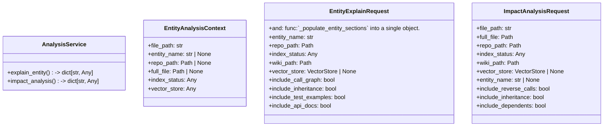

# File: `src/local_deepwiki/services/analysis_service.py`

## File Overview

This file implements the core business logic for entity explanation and impact analysis in the local_deepwiki system. It encapsulates the composite analysis patterns used to understand the effects of code changes, including call graphs, inheritance hierarchies, test examples, and API documentation. The module is designed to be used by handler layers that provide request validation, authentication, and response formatting.

The service is responsible for collecting and aggregating information from various code analysis generators and vector stores, then packaging it into structured results suitable for JSON serialization. It separates the analysis logic from the protocol handling, making it reusable and testable.

## Key Concepts

### Composite Analysis Pattern
The service implements a composite analysis pattern where multiple sub-analyses (call graph, inheritance, test examples, API docs) are collected in parallel and combined into a single result. This approach allows for rich, multi-dimensional understanding of code entities and their potential impact.

### Entity Analysis Context
The `EntityAnalysisContext` class serves as a shared parameter container for analysis functions, reducing parameter counts and promoting consistency. This design choice improves maintainability and reduces coupling between analysis components.

### Risk Level Computation
The `_compute_risk_level` function provides a simple but effective heuristic for assessing the impact of changes based on the number of affected files. This allows for quick triage of potential issues without requiring complex analysis.

### Error Handling and Graceful Degradation
The service handles errors gracefully by using `_set_section_error` to record non-fatal failures in analysis sections. This allows the system to return partial results rather than failing completely, which is important for user experience in a development tool.

## Integration

This file is called from the protocol handler layer, specifically by the `AnalysisService` class methods `explain_entity` and `impact_analysis`. It relies on several core components:

- **[VectorStore](../core/vectorstore/store.md)**: Used for semantic search and retrieving code examples
- **[CallGraphExtractor](../generators/analysis/callgraph.md)**: For extracting call relationships from source code
- **[APIDocExtractor](../generators/analysis/api_docs.md)**: For parsing and extracting API signatures from source files
- **[CodeExampleExtractor](../generators/examples/extractor.md)**: For finding test examples that reference entities
- **[build_file_context](../generators/context_builder.md)**: For determining file dependencies and imports

The service integrates with the broader system by consuming pre-built search indexes (`search.json`) and wiki table of contents (`toc.json`) to enrich analysis results with contextual information.

## Design Notes

### Parallel Analysis Execution
The service is designed to execute multiple analysis components in a structured, parallelizable way. This is achieved through careful separation of concerns where each analysis function is responsible for a single type of information.

### File System Safety
The code includes multiple checks for file system access, including verifying that files are within the repository bounds (`is_relative_to`) and using `resolve()` to ensure paths are valid. This prevents accidental or malicious access to system files.

### Flexible Entity Resolution
The service supports both file-level and entity-level analysis through the `entity_name` parameter. When `entity_name` is provided, the analysis focuses on that specific entity within the file; otherwise, it analyzes the entire file.

### Dependency Management
The service uses `asyncio.to_thread` for file I/O operations to avoid blocking the event loop, which is crucial for performance in a web service context.

### Error Boundaries
Error handling is implemented at the analysis section level, meaning that if one analysis fails (e.g., API docs extraction), other analyses can still complete and return partial results. This robustness is important for a development tool that should not crash on malformed code or missing dependencies.

### Performance Considerations
The service uses caching and pre-computed indexes (like `search.json`) to minimize runtime computation. It also carefully manages which analysis components are run based on request parameters to avoid unnecessary work.

### Extensibility
The modular design allows for easy addition of new analysis components. Each new type of analysis can be added as a separate function that follows the same pattern of collecting data and adding it to the result dictionary.

## API Reference

### class `EntityAnalysisContext`

Immutable context for entity-level impact collection.  Bundles the parameters shared by _collect_reverse_calls and _collect_inheritance_dependents to reduce their parameter counts.


<details>
<summary>View Source (lines 25-37) | <a href="https://github.com/UrbanDiver/local-deepwiki-mcp/blob/main/src/local_deepwiki/services/analysis_service.py#L25-L37">GitHub</a></summary>

```python
class EntityAnalysisContext:
    """Immutable context for entity-level impact collection.

    Bundles the parameters shared by _collect_reverse_calls and
    _collect_inheritance_dependents to reduce their parameter counts.
    """

    file_path: str
    entity_name: str | None
    repo_path: Path | None = None
    full_file: Path | None = None
    index_status: Any = None
    vector_store: Any = None
```

</details>

### class `ImpactAnalysisRequest`

Immutable parameters for impact analysis.  Consolidates the positional and keyword arguments of :meth:`AnalysisService.impact_analysis` into a single object.


<details>
<summary>View Source (lines 41-58) | <a href="https://github.com/UrbanDiver/local-deepwiki-mcp/blob/main/src/local_deepwiki/services/analysis_service.py#L41-L58">GitHub</a></summary>

```python
class ImpactAnalysisRequest:
    """Immutable parameters for impact analysis.

    Consolidates the positional and keyword arguments of
    :meth:`AnalysisService.impact_analysis` into a single object.
    """

    file_path: str
    full_file: Path
    repo_path: Path
    index_status: Any
    wiki_path: Path
    vector_store: VectorStore | None
    entity_name: str | None = None
    include_reverse_calls: bool = True
    include_inheritance: bool = True
    include_dependents: bool = True
    include_wiki_pages: bool = True
```

</details>

### class `EntityExplainRequest`

Immutable parameters for entity explanation.  Consolidates the arguments of :meth:`AnalysisService.explain_entity` and :func:`_populate_entity_sections` into a single object.


<details>
<summary>View Source (lines 62-78) | <a href="https://github.com/UrbanDiver/local-deepwiki-mcp/blob/main/src/local_deepwiki/services/analysis_service.py#L62-L78">GitHub</a></summary>

```python
class EntityExplainRequest:
    """Immutable parameters for entity explanation.

    Consolidates the arguments of :meth:`AnalysisService.explain_entity`
    and :func:`_populate_entity_sections` into a single object.
    """

    entity_name: str
    repo_path: Path
    index_status: Any
    wiki_path: Path
    vector_store: VectorStore | None
    include_call_graph: bool = True
    include_inheritance: bool = True
    include_test_examples: bool = True
    include_api_docs: bool = True
    max_test_examples: int = 3
```

</details>

### class `AnalysisService`

Encapsulates entity explanation and impact analysis business logic.  Methods return plain dicts suitable for JSON serialization. The handler layer is responsible for RBAC, arg validation, and MCP response formatting.

**Methods:**


<details>
<summary>View Source (lines 149-229) | <a href="https://github.com/UrbanDiver/local-deepwiki-mcp/blob/main/src/local_deepwiki/services/analysis_service.py#L149-L229">GitHub</a></summary>

```python
class AnalysisService:
    """Encapsulates entity explanation and impact analysis business logic.

    Methods return plain dicts suitable for JSON serialization.
    The handler layer is responsible for RBAC, arg validation,
    and MCP response formatting.
    """

    __slots__ = ()

    async def explain_entity(
        self,
        request: EntityExplainRequest,
    ) -> dict[str, Any]:
        """Composite explanation of a code entity.

        Combines glossary lookup, call graph, inheritance, test examples,
        and API docs for a single named entity.

        Args:
            request: Immutable request containing entity name, repo path,
                index status, wiki path, vector store, and section toggles.

        Returns:
            Dict with entity info and analysis sections.
        """
        entity_info = await _lookup_entity_in_search_index(
            request.wiki_path, request.entity_name
        )
        if entity_info is None:
            return {
                "status": "success",
                "entity_name": request.entity_name,
                "entity_found": False,
                "message": (
                    f"Entity '{request.entity_name}' not found in the search index. "
                    "Try using fuzzy_search or search_wiki to find the correct name."
                ),
            }

        entity_type = entity_info.get("entity_type", "unknown")
        entity_file = entity_info.get("file", "")

        result: dict[str, Any] = {
            "status": "success",
            "entity_name": request.entity_name,
            "entity_found": True,
            "entity_info": {
                "type": entity_type,
                "file": entity_file,
                "signature": entity_info.get("signature", ""),
                "description": entity_info.get("description", ""),
            },
        }

        await _populate_entity_sections(
            result,
            request=request,
            entity_type=entity_type,
            entity_file=entity_file,
        )

        return result

    async def impact_analysis(
        self,
        request: ImpactAnalysisRequest,
    ) -> dict[str, Any]:
        """Analyze the blast radius of changes to a file or entity.

        Examines reverse call graph, inheritance dependents, file imports,
        and wiki pages to determine impact.

        Args:
            request: Immutable request containing file path, repo path,
                index status, wiki path, vector store, and section toggles.

        Returns:
            Dict with impact analysis results and risk level.
        """
        return await _run_impact_collection(request)
```

</details>

#### `explain_entity`

```python
async def explain_entity(request: EntityExplainRequest) -> dict[str, Any]
```

Composite explanation of a code entity.  Combines glossary lookup, call graph, inheritance, test examples, and API docs for a single named entity.


| Parameter | Type | Default | Description |
|-----------|------|---------|-------------|
| `request` | `EntityExplainRequest` | - | Immutable request containing entity name, repo path, index status, wiki path, vector store, and section toggles. |


<details>
<summary>View Source (lines 149-229) | <a href="https://github.com/UrbanDiver/local-deepwiki-mcp/blob/main/src/local_deepwiki/services/analysis_service.py#L149-L229">GitHub</a></summary>

```python
class AnalysisService:
    """Encapsulates entity explanation and impact analysis business logic.

    Methods return plain dicts suitable for JSON serialization.
    The handler layer is responsible for RBAC, arg validation,
    and MCP response formatting.
    """

    __slots__ = ()

    async def explain_entity(
        self,
        request: EntityExplainRequest,
    ) -> dict[str, Any]:
        """Composite explanation of a code entity.

        Combines glossary lookup, call graph, inheritance, test examples,
        and API docs for a single named entity.

        Args:
            request: Immutable request containing entity name, repo path,
                index status, wiki path, vector store, and section toggles.

        Returns:
            Dict with entity info and analysis sections.
        """
        entity_info = await _lookup_entity_in_search_index(
            request.wiki_path, request.entity_name
        )
        if entity_info is None:
            return {
                "status": "success",
                "entity_name": request.entity_name,
                "entity_found": False,
                "message": (
                    f"Entity '{request.entity_name}' not found in the search index. "
                    "Try using fuzzy_search or search_wiki to find the correct name."
                ),
            }

        entity_type = entity_info.get("entity_type", "unknown")
        entity_file = entity_info.get("file", "")

        result: dict[str, Any] = {
            "status": "success",
            "entity_name": request.entity_name,
            "entity_found": True,
            "entity_info": {
                "type": entity_type,
                "file": entity_file,
                "signature": entity_info.get("signature", ""),
                "description": entity_info.get("description", ""),
            },
        }

        await _populate_entity_sections(
            result,
            request=request,
            entity_type=entity_type,
            entity_file=entity_file,
        )

        return result

    async def impact_analysis(
        self,
        request: ImpactAnalysisRequest,
    ) -> dict[str, Any]:
        """Analyze the blast radius of changes to a file or entity.

        Examines reverse call graph, inheritance dependents, file imports,
        and wiki pages to determine impact.

        Args:
            request: Immutable request containing file path, repo path,
                index status, wiki path, vector store, and section toggles.

        Returns:
            Dict with impact analysis results and risk level.
        """
        return await _run_impact_collection(request)
```

</details>

#### `impact_analysis`

```python
async def impact_analysis(request: ImpactAnalysisRequest) -> dict[str, Any]
```

Analyze the blast radius of changes to a file or entity.  Examines reverse call graph, inheritance dependents, file imports, and wiki pages to determine impact.


| Parameter | Type | Default | Description |
|-----------|------|---------|-------------|
| `request` | `ImpactAnalysisRequest` | - | Immutable request containing file path, repo path, index status, wiki path, vector store, and section toggles. |


<details>
<summary>View Source (lines 149-229) | <a href="https://github.com/UrbanDiver/local-deepwiki-mcp/blob/main/src/local_deepwiki/services/analysis_service.py#L149-L229">GitHub</a></summary>

```python
class AnalysisService:
    """Encapsulates entity explanation and impact analysis business logic.

    Methods return plain dicts suitable for JSON serialization.
    The handler layer is responsible for RBAC, arg validation,
    and MCP response formatting.
    """

    __slots__ = ()

    async def explain_entity(
        self,
        request: EntityExplainRequest,
    ) -> dict[str, Any]:
        """Composite explanation of a code entity.

        Combines glossary lookup, call graph, inheritance, test examples,
        and API docs for a single named entity.

        Args:
            request: Immutable request containing entity name, repo path,
                index status, wiki path, vector store, and section toggles.

        Returns:
            Dict with entity info and analysis sections.
        """
        entity_info = await _lookup_entity_in_search_index(
            request.wiki_path, request.entity_name
        )
        if entity_info is None:
            return {
                "status": "success",
                "entity_name": request.entity_name,
                "entity_found": False,
                "message": (
                    f"Entity '{request.entity_name}' not found in the search index. "
                    "Try using fuzzy_search or search_wiki to find the correct name."
                ),
            }

        entity_type = entity_info.get("entity_type", "unknown")
        entity_file = entity_info.get("file", "")

        result: dict[str, Any] = {
            "status": "success",
            "entity_name": request.entity_name,
            "entity_found": True,
            "entity_info": {
                "type": entity_type,
                "file": entity_file,
                "signature": entity_info.get("signature", ""),
                "description": entity_info.get("description", ""),
            },
        }

        await _populate_entity_sections(
            result,
            request=request,
            entity_type=entity_type,
            entity_file=entity_file,
        )

        return result

    async def impact_analysis(
        self,
        request: ImpactAnalysisRequest,
    ) -> dict[str, Any]:
        """Analyze the blast radius of changes to a file or entity.

        Examines reverse call graph, inheritance dependents, file imports,
        and wiki pages to determine impact.

        Args:
            request: Immutable request containing file path, repo path,
                index status, wiki path, vector store, and section toggles.

        Returns:
            Dict with impact analysis results and risk level.
        """
        return await _run_impact_collection(request)
```

</details>

## Class Diagram



## Call Graph

```mermaid
flowchart TD
    N0[AnalysisService.explain_entity]
    N1[CallGraphExtractor]
    N2[EntityAnalysisContext]
    N3[ValueError]
    N4[_collect_affected_wiki_pages]
    N5[_collect_api_docs]
    N6[_collect_call_graph]
    N7[_collect_file_dependents]
    N8[_collect_inheritance]
    N9[_collect_inheritance_depend...]
    N10[_collect_reverse_calls]
    N11[_collect_test_examples]
    N12[_find_cross_file_callers]
    N13[_has_import_of_module]
    N14[_is_source_candidate]
    N15[_lookup_entity_in_search_index]
    N16[_populate_entity_sections]
    N17[_run_impact_collection]
    N18[_set_section_error]
    N19[add]
    N20[build_reverse_call_graph]
    N21[collect_class_hierarchy]
    N22[exists]
    N23[extract_from_file]
    N24[is_relative_to]
    N25[loads]
    N26[relative_to]
    N27[resolve]
    N28[sanitize_error_message]
    N29[to_thread]
    N18 --> N28
    N17 --> N2
    N17 --> N10
    N17 --> N9
    N17 --> N7
    N17 --> N4
    N16 --> N6
    N16 --> N8
    N16 --> N11
    N16 --> N5
    N15 --> N22
    N15 --> N29
    N15 --> N25
    N6 --> N27
    N6 --> N22
    N6 --> N24
    N6 --> N1
    N6 --> N23
    N6 --> N20
    N6 --> N18
    N8 --> N21
    N8 --> N18
    N11 --> N18
    N5 --> N27
    N5 --> N22
    N5 --> N24
    N5 --> N23
    N5 --> N18
    N14 --> N27
    N14 --> N26
    N12 --> N27
    N12 --> N14
    N12 --> N13
    N12 --> N23
    N12 --> N26
    N10 --> N1
    N10 --> N23
    N10 --> N27
    N10 --> N20
    N10 --> N19
    N10 --> N12
    N10 --> N18
    N9 --> N3
    N9 --> N21
    N9 --> N19
    N9 --> N18
    N7 --> N3
    N7 --> N19
    N7 --> N18
    N4 --> N22
    N4 --> N29
    N4 --> N25
    N4 --> N18
    N0 --> N15
    N0 --> N16
    classDef func fill:#e1f5fe
    class N1,N2,N3,N4,N5,N6,N7,N8,N9,N10,N11,N12,N13,N14,N15,N16,N17,N18,N19,N20,N21,N22,N23,N24,N25,N26,N27,N28,N29 func
    classDef method fill:#fff3e0
    class N0 method
```



## Used By

Functions and methods in this file and their callers:

- **[`APIDocExtractor`](../generators/analysis/api_docs.md)**: called by `_collect_api_docs`
- **[`CallGraphExtractor`](../generators/analysis/callgraph.md)**: called by `_collect_call_graph`, `_collect_reverse_calls`
- **[`CodeExampleExtractor`](../generators/examples/extractor.md)**: called by `_collect_test_examples`
- **`EntityAnalysisContext`**: called by `_run_impact_collection`
- **`Path`**: called by `_collect_reverse_calls`
- **`ValueError`**: called by `_collect_file_dependents`, `_collect_inheritance_dependents`
- **`_collect_affected_wiki_pages`**: called by `_run_impact_collection`
- **`_collect_api_docs`**: called by `_populate_entity_sections`
- **`_collect_call_graph`**: called by `_populate_entity_sections`
- **`_collect_callers_from_graph`**: called by `_find_cross_file_callers`
- **`_collect_file_dependents`**: called by `_run_impact_collection`
- **`_collect_inheritance`**: called by `_populate_entity_sections`
- **`_collect_inheritance_dependents`**: called by `_run_impact_collection`
- **`_collect_reverse_calls`**: called by `_run_impact_collection`
- **`_collect_test_examples`**: called by `_populate_entity_sections`
- **`_compute_risk_level`**: called by `_run_impact_collection`
- **`_find_class_api_entry`**: called by `_collect_api_docs`
- **`_find_cross_file_callers`**: called by `_collect_reverse_calls`
- **`_find_function_api_entry`**: called by `_collect_api_docs`
- **`_has_import_of_module`**: called by `_find_cross_file_callers`
- **`_is_source_candidate`**: called by `_find_cross_file_callers`
- **`_lookup_entity_in_search_index`**: called by `AnalysisService.explain_entity`
- **`_populate_entity_sections`**: called by `AnalysisService.explain_entity`
- **`_run_impact_collection`**: called by `AnalysisService.impact_analysis`
- **`_set_section_error`**: called by `_collect_affected_wiki_pages`, `_collect_api_docs`, `_collect_call_graph`, `_collect_file_dependents`, `_collect_inheritance`, `_collect_inheritance_dependents`, `_collect_reverse_calls`, `_collect_test_examples`
- **`add`**: called by `_collect_file_dependents`, `_collect_inheritance_dependents`, `_collect_reverse_calls`
- **[`build_file_context`](../generators/context_builder.md)**: called by `_collect_file_dependents`
- **[`build_reverse_call_graph`](../generators/analysis/callgraph.md)**: called by `_collect_call_graph`, `_collect_reverse_calls`
- **[`collect_class_hierarchy`](../generators/analysis/inheritance.md)**: called by `_collect_inheritance`, `_collect_inheritance_dependents`
- **`escape`**: called by `_has_import_of_module`
- **`exists`**: called by `_collect_affected_wiki_pages`, `_collect_api_docs`, `_collect_call_graph`, `_lookup_entity_in_search_index`
- **`extract_examples_for_class`**: called by `_collect_test_examples`
- **`extract_examples_for_function`**: called by `_collect_test_examples`
- **`extract_from_file`**: called by `_collect_api_docs`, `_collect_call_graph`, `_collect_reverse_calls`, `_find_cross_file_callers`
- **`get_chunks_by_file`**: called by `_collect_file_dependents`
- **`is_file`**: called by `_is_source_candidate`
- **`is_relative_to`**: called by `_collect_api_docs`, `_collect_call_graph`
- **`loads`**: called by `_collect_affected_wiki_pages`, `_lookup_entity_in_search_index`
- **`read_text`**: called by `_find_cross_file_callers`
- **`relative_to`**: called by `_find_cross_file_callers`, `_is_source_candidate`
- **`resolve`**: called by `_collect_api_docs`, `_collect_call_graph`, `_collect_reverse_calls`, `_find_cross_file_callers`, `_is_source_candidate`
- **`rglob`**: called by `_find_cross_file_callers`
- **`rsplit`**: called by `_collect_reverse_calls`
- **[`sanitize_error_message`](../error_factories.md)**: called by `_set_section_error`
- **`search`**: called by `_has_import_of_module`
- **`to_thread`**: called by `_collect_affected_wiki_pages`, `_lookup_entity_in_search_index`

## Last Modified

| Entity | Type | Author | Date | Commit |
|--------|------|--------|------|--------|
| `_collect_test_examples` | function | Brian Breidenbach | today | `1276e81` refactor: remove backward-c... |
| `EntityAnalysisContext` | class | Brian Breidenbach | yesterday | `1eef062` refactor: complete Grade A ... |
| `EntityExplainRequest` | class | Brian Breidenbach | yesterday | `1eef062` refactor: complete Grade A ... |
| `AnalysisService` | class | Brian Breidenbach | yesterday | `1eef062` refactor: complete Grade A ... |
| `_run_impact_collection` | function | Brian Breidenbach | yesterday | `1eef062` refactor: complete Grade A ... |
| `_populate_entity_sections` | function | Brian Breidenbach | yesterday | `1eef062` refactor: complete Grade A ... |
| `_collect_reverse_calls` | function | Brian Breidenbach | yesterday | `1eef062` refactor: complete Grade A ... |
| `_collect_inheritance_dependents` | function | Brian Breidenbach | yesterday | `1eef062` refactor: complete Grade A ... |
| `_is_source_candidate` | function | Brian Breidenbach | 2 days ago | `a3c09df` refactor: decompose CC > 15... |
| `_collect_callers_from_graph` | function | Brian Breidenbach | 2 days ago | `a3c09df` refactor: decompose CC > 15... |
| `_find_cross_file_callers` | function | Brian Breidenbach | 2 days ago | `a3c09df` refactor: decompose CC > 15... |
| `ImpactAnalysisRequest` | class | Brian Breidenbach | 2 days ago | `c091977` refactor: introduce Researc... |
| `_set_section_error` | function | Brian Breidenbach | 1 week ago | `0f86cb5` refactor: extract services,... |
| `_lookup_entity_in_search_index` | function | Brian Breidenbach | 1 week ago | `0f86cb5` refactor: extract services,... |
| `_collect_call_graph` | function | Brian Breidenbach | 1 week ago | `0f86cb5` refactor: extract services,... |
| `_collect_inheritance` | function | Brian Breidenbach | 1 week ago | `0f86cb5` refactor: extract services,... |
| `_find_function_api_entry` | function | Brian Breidenbach | 1 week ago | `0f86cb5` refactor: extract services,... |
| `_find_class_api_entry` | function | Brian Breidenbach | 1 week ago | `0f86cb5` refactor: extract services,... |
| `_collect_api_docs` | function | Brian Breidenbach | 1 week ago | `0f86cb5` refactor: extract services,... |
| `_has_import_of_module` | function | Brian Breidenbach | 1 week ago | `0f86cb5` refactor: extract services,... |
| `_collect_file_dependents` | function | Brian Breidenbach | 1 week ago | `0f86cb5` refactor: extract services,... |
| `_collect_affected_wiki_pages` | function | Brian Breidenbach | 1 week ago | `0f86cb5` refactor: extract services,... |
| `_compute_risk_level` | function | Brian Breidenbach | 1 week ago | `0f86cb5` refactor: extract services,... |

## Additional Source Code

Source code for functions and methods not listed in the API Reference above.

#### `_set_section_error`

<details>
<summary>View Source (lines 81-90) | <a href="https://github.com/UrbanDiver/local-deepwiki-mcp/blob/main/src/local_deepwiki/services/analysis_service.py#L81-L90">GitHub</a></summary>

```python
def _set_section_error(
    result: dict[str, Any],
    field: str,
    operation: str,
    detail: str,
    exc: Exception,
) -> None:
    """Record a non-fatal section error in an explain/impact result dict."""
    logger.warning("%s failed for '%s': %s", operation, detail, exc)
    result[field] = {"error": sanitize_error_message(str(exc))}
```

</details>


#### `_run_impact_collection`

<details>
<summary>View Source (lines 93-146) | <a href="https://github.com/UrbanDiver/local-deepwiki-mcp/blob/main/src/local_deepwiki/services/analysis_service.py#L93-L146">GitHub</a></summary>

```python
async def _run_impact_collection(request: ImpactAnalysisRequest) -> dict[str, Any]:
    """Run all enabled impact collection phases and return the result dict."""
    result: dict[str, Any] = {
        "status": "success",
        "file_path": request.file_path,
        "entity_name": request.entity_name,
    }
    affected_files: set[str] = set()
    affected_entities: set[str] = set()

    entity_ctx = EntityAnalysisContext(
        file_path=request.file_path,
        entity_name=request.entity_name,
        repo_path=request.repo_path,
        full_file=request.full_file,
        index_status=request.index_status,
        vector_store=request.vector_store,
    )

    if request.include_reverse_calls:
        _collect_reverse_calls(
            result,
            entity_ctx,
            affected_files,
            affected_entities,
        )

    if request.include_inheritance:
        await _collect_inheritance_dependents(
            result,
            entity_ctx,
            affected_files,
            affected_entities,
        )

    if request.include_dependents:
        await _collect_file_dependents(
            result,
            request.file_path,
            request.repo_path,
            request.vector_store,
            affected_files,
        )

    if request.include_wiki_pages:
        await _collect_affected_wiki_pages(result, request.wiki_path, request.file_path)

    risk_level = _compute_risk_level(len(affected_files))
    result["impact_summary"] = {
        "total_affected_files": len(affected_files),
        "total_affected_entities": len(affected_entities),
        "risk_level": risk_level,
    }
    return result
```

</details>


#### `_populate_entity_sections`

<details>
<summary>View Source (lines 237-280) | <a href="https://github.com/UrbanDiver/local-deepwiki-mcp/blob/main/src/local_deepwiki/services/analysis_service.py#L237-L280">GitHub</a></summary>

```python
async def _populate_entity_sections(
    result: dict[str, Any],
    *,
    request: EntityExplainRequest,
    entity_type: str,
    entity_file: str,
) -> None:
    """Populate optional analysis sections in an explain_entity result dict."""
    if request.include_call_graph:
        if entity_file:
            _collect_call_graph(
                result, request.repo_path, request.entity_name, entity_file
            )

    if request.include_inheritance:
        if entity_type == "class":
            if request.vector_store is not None:
                await _collect_inheritance(
                    result,
                    request.entity_name,
                    request.index_status,
                    request.vector_store,
                )

    if request.include_test_examples:
        if request.vector_store is not None:
            await _collect_test_examples(
                result,
                request.entity_name,
                entity_type,
                request.max_test_examples,
                request.repo_path,
                request.vector_store,
            )

    if request.include_api_docs:
        if entity_file:
            _collect_api_docs(
                result,
                request.repo_path,
                request.entity_name,
                entity_type,
                entity_file,
            )
```

</details>


#### `_lookup_entity_in_search_index`

<details>
<summary>View Source (lines 283-301) | <a href="https://github.com/UrbanDiver/local-deepwiki-mcp/blob/main/src/local_deepwiki/services/analysis_service.py#L283-L301">GitHub</a></summary>

```python
async def _lookup_entity_in_search_index(
    wiki_path: Path,
    entity_name: str,
) -> dict[str, Any] | None:
    """Look up *entity_name* in the pre-built ``search.json`` index."""
    search_json_path = wiki_path / "search.json"
    if not search_json_path.exists():
        return None
    try:
        search_content = await asyncio.to_thread(search_json_path.read_text)
        search_data = json.loads(search_content)
        for entry in search_data.get("entities", []):
            if entry.get("name") == entity_name:
                return entry
    except (json.JSONDecodeError, OSError) as e:
        logger.debug(
            "search.json exists but could not be read for entity lookup: %s", e
        )
    return None
```

</details>


#### `_collect_call_graph`

<details>
<summary>View Source (lines 304-335) | <a href="https://github.com/UrbanDiver/local-deepwiki-mcp/blob/main/src/local_deepwiki/services/analysis_service.py#L304-L335">GitHub</a></summary>

```python
def _collect_call_graph(
    result: dict[str, Any],
    repo_path: Path,
    entity_name: str,
    entity_file: str,
) -> None:
    """Extract call graph for *entity_name* and store in *result*."""
    try:
        from local_deepwiki.generators.analysis.callgraph import (
            CallGraphExtractor,
            build_reverse_call_graph,
        )

        full_file_path = (repo_path / entity_file).resolve()
        if full_file_path.exists() and full_file_path.is_relative_to(repo_path):
            extractor = CallGraphExtractor()
            call_graph = extractor.extract_from_file(full_file_path, repo_path)
            reverse_graph = build_reverse_call_graph(call_graph)
            result["call_graph"] = {
                "calls": call_graph.get(entity_name, []),
                "called_by": reverse_graph.get(entity_name, []),
            }
        else:
            result["call_graph"] = {
                "calls": [],
                "called_by": [],
                "note": "Source file not found",
            }
    except (OSError, ValueError, RuntimeError) as exc:
        _set_section_error(
            result, "call_graph", "Call graph extraction", entity_name, exc
        )
```

</details>


#### `_collect_inheritance`

<details>
<summary>View Source (lines 338-368) | <a href="https://github.com/UrbanDiver/local-deepwiki-mcp/blob/main/src/local_deepwiki/services/analysis_service.py#L338-L368">GitHub</a></summary>

```python
async def _collect_inheritance(
    result: dict[str, Any],
    entity_name: str,
    index_status: Any,
    vector_store: Any,
) -> None:
    """Collect inheritance hierarchy for a class entity."""
    try:
        from local_deepwiki.generators.analysis.inheritance import (
            collect_class_hierarchy,
        )

        classes = await collect_class_hierarchy(index_status, vector_store)
        class_node = classes.get(entity_name)
        if class_node is not None:
            result["inheritance"] = {
                "parents": class_node.parents,
                "children": class_node.children,
                "is_abstract": class_node.is_abstract,
            }
        else:
            result["inheritance"] = {
                "parents": [],
                "children": [],
                "is_abstract": False,
                "note": "Class not found in inheritance hierarchy",
            }
    except (OSError, ValueError, RuntimeError) as exc:
        _set_section_error(
            result, "inheritance", "Inheritance lookup", entity_name, exc
        )
```

</details>


#### `_collect_test_examples`

<details>
<summary>View Source (lines 371-407) | <a href="https://github.com/UrbanDiver/local-deepwiki-mcp/blob/main/src/local_deepwiki/services/analysis_service.py#L371-L407">GitHub</a></summary>

```python
async def _collect_test_examples(
    result: dict[str, Any],
    entity_name: str,
    entity_type: str,
    max_examples: int,
    repo_path: Path,
    vector_store: Any,
) -> None:
    """Extract test examples for *entity_name* from test files."""
    try:
        from local_deepwiki.generators.examples.extractor import CodeExampleExtractor

        extractor = CodeExampleExtractor(vector_store, repo_path=repo_path)
        if entity_type == "class":
            examples = await extractor.extract_examples_for_class(
                entity_name, max_examples=max_examples
            )
        else:
            examples = await extractor.extract_examples_for_function(
                entity_name, max_examples=max_examples
            )
            if not examples:
                examples = await extractor.extract_examples_for_class(
                    entity_name, max_examples=max_examples
                )
        result["test_examples"] = [
            {
                "code": ex.code,
                "source_file": ex.test_file,
                "description": ex.description,
            }
            for ex in examples
        ]
    except (OSError, ValueError, RuntimeError, TypeError) as exc:
        _set_section_error(
            result, "test_examples", "Test example extraction", entity_name, exc
        )
```

</details>


#### `_find_function_api_entry`

<details>
<summary>View Source (lines 410-451) | <a href="https://github.com/UrbanDiver/local-deepwiki-mcp/blob/main/src/local_deepwiki/services/analysis_service.py#L410-L451">GitHub</a></summary>

```python
def _find_function_api_entry(
    functions: list[Any],
    classes_sigs: list[Any],
    entity_name: str,
) -> dict[str, Any] | None:
    """Find API doc entry for a function/method entity."""
    for func_sig in functions:
        if func_sig.name == entity_name:
            return {
                "parameters": [
                    {
                        "name": p.name,
                        "type": p.type_hint,
                        "default": p.default_value,
                    }
                    for p in func_sig.parameters
                ],
                "return_type": func_sig.return_type,
                "docstring": func_sig.docstring,
                "is_async": func_sig.is_async,
                "decorators": func_sig.decorators,
            }

    for cls_sig in classes_sigs:
        for m in cls_sig.methods:
            if m.name == entity_name:
                return {
                    "parameters": [
                        {
                            "name": p.name,
                            "type": p.type_hint,
                            "default": p.default_value,
                        }
                        for p in m.parameters
                    ],
                    "return_type": m.return_type,
                    "docstring": m.docstring,
                    "is_async": m.is_async,
                    "decorators": m.decorators,
                    "class_name": cls_sig.name,
                }
    return None
```

</details>


#### `_find_class_api_entry`

<details>
<summary>View Source (lines 454-487) | <a href="https://github.com/UrbanDiver/local-deepwiki-mcp/blob/main/src/local_deepwiki/services/analysis_service.py#L454-L487">GitHub</a></summary>

```python
def _find_class_api_entry(
    classes_sigs: list[Any],
    entity_name: str,
) -> dict[str, Any] | None:
    """Find API doc entry for a class entity."""
    for cls_sig in classes_sigs:
        if cls_sig.name == entity_name:
            return {
                "bases": cls_sig.bases,
                "docstring": cls_sig.docstring,
                "description": cls_sig.description,
                "methods": [
                    {
                        "name": m.name,
                        "parameters": [
                            {
                                "name": p.name,
                                "type": p.type_hint,
                                "default": p.default_value,
                            }
                            for p in m.parameters
                        ],
                        "return_type": m.return_type,
                        "is_async": m.is_async,
                        "docstring": m.docstring,
                    }
                    for m in cls_sig.methods
                ],
                "class_variables": [
                    {"name": cv[0], "type": cv[1], "value": cv[2]}
                    for cv in cls_sig.class_variables
                ],
            }
    return None
```

</details>


#### `_collect_api_docs`

<details>
<summary>View Source (lines 490-521) | <a href="https://github.com/UrbanDiver/local-deepwiki-mcp/blob/main/src/local_deepwiki/services/analysis_service.py#L490-L521">GitHub</a></summary>

```python
def _collect_api_docs(
    result: dict[str, Any],
    repo_path: Path,
    entity_name: str,
    entity_type: str,
    entity_file: str,
) -> None:
    """Extract API docs for *entity_name* and store in *result*."""
    try:
        from local_deepwiki.generators.analysis.api_docs import APIDocExtractor

        full_file_path = (repo_path / entity_file).resolve()
        if not (full_file_path.exists() and full_file_path.is_relative_to(repo_path)):
            result["api_docs"] = {"note": "Source file not found"}
            return

        api_extractor = APIDocExtractor()
        functions, classes_sigs = api_extractor.extract_from_file(full_file_path)

        if entity_type == "class":
            api_entry = _find_class_api_entry(classes_sigs, entity_name)
        else:
            api_entry = _find_function_api_entry(functions, classes_sigs, entity_name)

        if api_entry is not None:
            result["api_docs"] = api_entry
        else:
            result["api_docs"] = {
                "note": f"No API signature found for '{entity_name}' in {entity_file}"
            }
    except (OSError, ValueError, RuntimeError) as exc:
        _set_section_error(result, "api_docs", "API doc extraction", entity_name, exc)
```

</details>


#### `_has_import_of_module`

<details>
<summary>View Source (lines 529-535) | <a href="https://github.com/UrbanDiver/local-deepwiki-mcp/blob/main/src/local_deepwiki/services/analysis_service.py#L529-L535">GitHub</a></summary>

```python
def _has_import_of_module(content: str, module_stem: str) -> bool:
    """Check whether *content* contains an import line referencing *module_stem*."""
    pattern = (
        rf"(?:^|\n)\s*(?:from\s+\S*\.?{re.escape(module_stem)}\s+import"
        rf"|import\s+\S*\.?{re.escape(module_stem)})\b"
    )
    return re.search(pattern, content) is not None
```

</details>


#### `_is_source_candidate`

<details>
<summary>View Source (lines 538-552) | <a href="https://github.com/UrbanDiver/local-deepwiki-mcp/blob/main/src/local_deepwiki/services/analysis_service.py#L538-L552">GitHub</a></summary>

```python
def _is_source_candidate(
    candidate: Path,
    repo_path: Path,
    resolved_target: Path,
    supported_suffixes: set[str],
) -> bool:
    """Return True if *candidate* should be scanned for callers."""
    if not candidate.is_file():
        return False
    if candidate.suffix.lower() not in supported_suffixes:
        return False
    if candidate.resolve() == resolved_target:
        return False
    rel_parts = candidate.relative_to(repo_path).parts
    return not any(part.startswith(".") or part == "node_modules" for part in rel_parts)
```

</details>


#### `_collect_callers_from_graph`

<details>
<summary>View Source (lines 555-569) | <a href="https://github.com/UrbanDiver/local-deepwiki-mcp/blob/main/src/local_deepwiki/services/analysis_service.py#L555-L569">GitHub</a></summary>

```python
def _collect_callers_from_graph(
    cand_call_graph: dict[str, Any],
    rel_path: str,
    target_entities: set[str],
    cross_callers: dict[str, list[str]],
) -> None:
    """Merge callers from *cand_call_graph* into *cross_callers* in place."""
    for caller_func, callees in cand_call_graph.items():
        for callee in callees:
            if callee in target_entities:
                qualified = f"{rel_path}:{caller_func}"
                if callee not in cross_callers:
                    cross_callers[callee] = []
                if qualified not in cross_callers[callee]:
                    cross_callers[callee].append(qualified)
```

</details>


#### `_find_cross_file_callers`

<details>
<summary>View Source (lines 572-612) | <a href="https://github.com/UrbanDiver/local-deepwiki-mcp/blob/main/src/local_deepwiki/services/analysis_service.py#L572-L612">GitHub</a></summary>

```python
def _find_cross_file_callers(
    extractor: Any,
    repo_path: Path,
    target_file: Path,
    module_stem: str,
    target_entities: set[str],
) -> dict[str, list[str]]:
    """Scan other source files for callers of *target_entities*."""
    from local_deepwiki.core.parser.languages import EXTENSION_MAP

    cross_callers: dict[str, list[str]] = {}
    resolved_target = target_file.resolve()
    supported_suffixes = set(EXTENSION_MAP.keys())

    for candidate in repo_path.rglob("*"):
        if not _is_source_candidate(
            candidate, repo_path, resolved_target, supported_suffixes
        ):
            continue

        try:
            content = candidate.read_text(errors="ignore")
        except OSError:
            continue

        if not _has_import_of_module(content, module_stem):
            continue

        try:
            cand_call_graph = extractor.extract_from_file(
                candidate.resolve(), repo_path
            )
        except (OSError, ValueError, RuntimeError):
            continue

        rel_path = str(candidate.relative_to(repo_path))
        _collect_callers_from_graph(
            cand_call_graph, rel_path, target_entities, cross_callers
        )

    return cross_callers
```

</details>


#### `_collect_reverse_calls`

<details>
<summary>View Source (lines 615-678) | <a href="https://github.com/UrbanDiver/local-deepwiki-mcp/blob/main/src/local_deepwiki/services/analysis_service.py#L615-L678">GitHub</a></summary>

```python
def _collect_reverse_calls(
    result: dict[str, Any],
    ctx: EntityAnalysisContext,
    affected_files: set[str],
    affected_entities: set[str],
) -> None:
    """Extract reverse call graph and update affected sets."""
    try:
        from local_deepwiki.generators.analysis.callgraph import (
            CallGraphExtractor,
            build_reverse_call_graph,
        )

        assert ctx.full_file is not None  # noqa: S101
        assert ctx.repo_path is not None  # noqa: S101

        extractor = CallGraphExtractor()
        call_graph = extractor.extract_from_file(ctx.full_file.resolve(), ctx.repo_path)
        reverse_graph = build_reverse_call_graph(call_graph)

        target_module_stem = Path(ctx.file_path).stem
        all_target_entities = set(call_graph.keys()) | set(reverse_graph.keys())
        if ctx.entity_name:
            all_target_entities.add(ctx.entity_name)

        cross_callers = _find_cross_file_callers(
            extractor,
            ctx.repo_path,
            ctx.full_file,
            target_module_stem,
            all_target_entities,
        )

        for callee, callers in cross_callers.items():
            if callee not in reverse_graph:
                reverse_graph[callee] = []
            for caller in callers:
                if caller not in reverse_graph[callee]:
                    reverse_graph[callee].append(caller)

        if ctx.entity_name:
            reverse_graph = {
                k: v for k, v in reverse_graph.items() if k == ctx.entity_name
            }

        result["reverse_call_graph"] = reverse_graph

        for callee, callers in reverse_graph.items():
            affected_entities.add(callee)
            for caller in callers:
                affected_entities.add(caller)
                if ":" in caller:
                    rel_file = caller.split(":")[0]
                    affected_files.add(rel_file)
                elif "." in caller:
                    affected_files.add(caller.rsplit(".", 1)[0])
    except (OSError, ValueError, RuntimeError) as exc:
        _set_section_error(
            result,
            "reverse_call_graph",
            "Reverse call graph extraction",
            ctx.file_path,
            exc,
        )
```

</details>


#### `_collect_inheritance_dependents`

<details>
<summary>View Source (lines 681-721) | <a href="https://github.com/UrbanDiver/local-deepwiki-mcp/blob/main/src/local_deepwiki/services/analysis_service.py#L681-L721">GitHub</a></summary>

```python
async def _collect_inheritance_dependents(
    result: dict[str, Any],
    ctx: EntityAnalysisContext,
    affected_files: set[str],
    affected_entities: set[str],
) -> None:
    """Collect classes that inherit from classes in *ctx.file_path*."""
    try:
        from local_deepwiki.generators.analysis.inheritance import (
            collect_class_hierarchy,
        )

        if ctx.vector_store is None:
            raise ValueError("Vector store required for inheritance analysis")
        classes = await collect_class_hierarchy(ctx.index_status, ctx.vector_store)

        inheritance_dependents: dict[str, list[str]] = {}
        for class_name, node in classes.items():
            if node.file_path != ctx.file_path:
                continue
            if ctx.entity_name and class_name != ctx.entity_name:
                continue
            children_with_files: list[str] = []
            for child_name in node.children:
                child_node = classes.get(child_name)
                if child_node and child_node.file_path != ctx.file_path:
                    children_with_files.append(f"{child_node.file_path}:{child_name}")
                    affected_files.add(child_node.file_path)
                    affected_entities.add(child_name)
                elif child_node:
                    children_with_files.append(child_name)
                    affected_entities.add(child_name)
            if children_with_files:
                inheritance_dependents[class_name] = children_with_files
                affected_entities.add(class_name)

        result["inheritance_dependents"] = inheritance_dependents
    except (OSError, ValueError, RuntimeError) as exc:
        _set_section_error(
            result, "inheritance_dependents", "Inheritance analysis", ctx.file_path, exc
        )
```

</details>


#### `_collect_file_dependents`

<details>
<summary>View Source (lines 724-767) | <a href="https://github.com/UrbanDiver/local-deepwiki-mcp/blob/main/src/local_deepwiki/services/analysis_service.py#L724-L767">GitHub</a></summary>

```python
async def _collect_file_dependents(
    result: dict[str, Any],
    file_path: str,
    repo_path: Path,
    vector_store: Any,
    affected_files: set[str],
) -> None:
    """Find files that import or depend on *file_path*."""
    try:
        from local_deepwiki.generators.context_builder import build_file_context

        if vector_store is None:
            raise ValueError("Vector store required for file dependents analysis")
        chunks = await vector_store.get_chunks_by_file(file_path)

        if not chunks:
            result["file_dependents"] = {
                "importing_files": [],
                "related_files": [],
            }
            return

        context = await build_file_context(
            file_path=file_path,
            chunks=chunks,
            repo_path=repo_path,
            vector_store=vector_store,
        )

        importing_files: list[str] = []
        for _entity, caller_files in context.callers.items():
            for cf in caller_files:
                if cf != file_path and cf not in importing_files:
                    importing_files.append(cf)
                    affected_files.add(cf)

        result["file_dependents"] = {
            "importing_files": importing_files,
            "related_files": [rf for rf in context.related_files if rf != file_path],
        }
    except (OSError, ValueError, RuntimeError) as exc:
        _set_section_error(
            result, "file_dependents", "File dependents analysis", file_path, exc
        )
```

</details>


#### `_collect_affected_wiki_pages`

<details>
<summary>View Source (lines 770-797) | <a href="https://github.com/UrbanDiver/local-deepwiki-mcp/blob/main/src/local_deepwiki/services/analysis_service.py#L770-L797">GitHub</a></summary>

```python
async def _collect_affected_wiki_pages(
    result: dict[str, Any],
    wiki_path: Path,
    file_path: str,
) -> None:
    """Find wiki pages that document *file_path*."""
    try:
        toc_path = wiki_path / "toc.json"
        matched_pages: list[dict[str, str]] = []
        if toc_path.exists():
            toc_content = await asyncio.to_thread(toc_path.read_text)
            toc_data = json.loads(toc_content)
            pages = (
                toc_data if isinstance(toc_data, list) else toc_data.get("pages", [])
            )
            for page in pages:
                if page.get("source_file", "") == file_path:
                    matched_pages.append(
                        {
                            "title": page.get("title", ""),
                            "path": page.get("path", ""),
                        }
                    )
        result["affected_wiki_pages"] = matched_pages
    except (OSError, json.JSONDecodeError, KeyError) as exc:
        _set_section_error(
            result, "affected_wiki_pages", "Wiki page lookup", file_path, exc
        )
```

</details>


#### `_compute_risk_level`

<details>
<summary>View Source (lines 800-806) | <a href="https://github.com/UrbanDiver/local-deepwiki-mcp/blob/main/src/local_deepwiki/services/analysis_service.py#L800-L806">GitHub</a></summary>

```python
def _compute_risk_level(affected_file_count: int) -> str:
    """Return ``low``, ``medium``, or ``high`` based on affected file count."""
    if affected_file_count <= 2:
        return "low"
    if affected_file_count <= 10:
        return "medium"
    return "high"
```

</details>

## Relevant Source Files

- `src/local_deepwiki/services/analysis_service.py:25-37`
