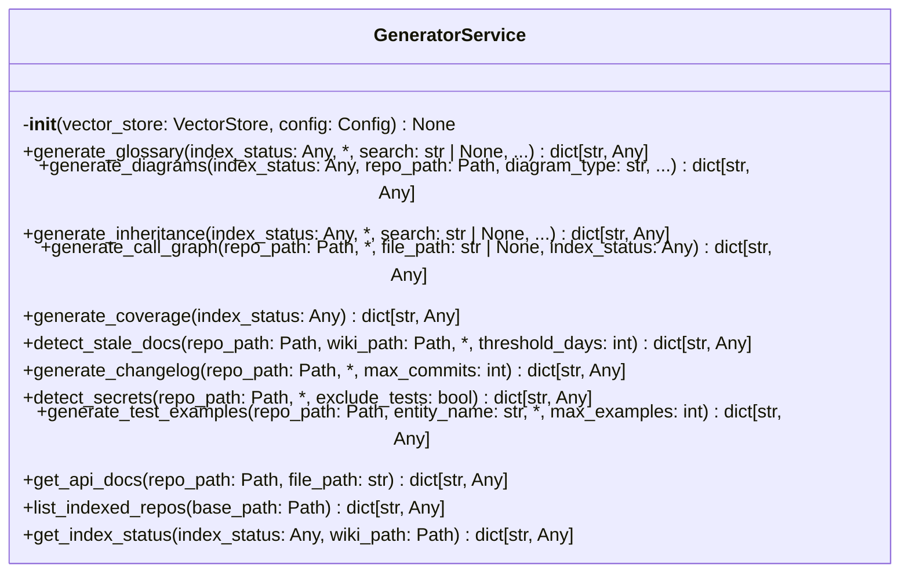

# File: `src/local_deepwiki/services/generator_service.py`

## File Overview

This file implements the `GeneratorService` class, which encapsulates the core business logic for generating various documentation and analysis artifacts from a codebase. It serves as a central service layer that abstracts away the complexity of interacting with the vector store, index status, and specific generator functions.

The service is designed to be used by handler layers (e.g., in `handlers/generators.py`) to perform operations like generating diagrams, glossaries, coverage reports, and more. It maintains separation of concerns by delegating specific generation tasks to dedicated modules while providing a consistent interface for result formatting and error handling.

## Key Concepts

### Generator Abstraction Pattern

The `GeneratorService` implements a consistent abstraction pattern for generating different types of documentation and analysis artifacts:

1. **Chunk-based Processing**: All methods rely on retrieving chunks from the [`VectorStore`](../core/vectorstore/store.md) to provide context for analysis.
2. **Result Normalization**: Each method returns a standardized dictionary structure, including metadata like status, pagination info, and the generated content.
3. **Asynchronous Execution**: The service leverages `asyncio` for I/O-bound operations, particularly when interacting with file systems or external libraries.

### Modular Design with Lazy Imports

To optimize startup time and reduce memory usage, many generator functions are imported lazily within method bodies. This approach ensures that only the necessary dependencies are loaded when a specific method is called, which is particularly useful in a service that supports multiple generator types.

### Validation and Error Handling

The service uses [`ValidationError`](../errors.md) for cases where required arguments are missing or invalid, such as when `entry_point` is required for sequence diagrams. This allows the handler layer to properly format these errors for API responses.

## Integration

### With Core Components

- **[VectorStore](../core/vectorstore/store.md)**: The service depends on a [`VectorStore`](../core/vectorstore/store.md) instance to retrieve indexed chunks of code for analysis.
- **[Config](../config/models.md)**: The configuration object is passed during initialization but not directly used in this file; it's likely consumed by the [`VectorStore`](../core/vectorstore/store.md) or other components.

### With Generator Modules

This service integrates with a wide range of generator modules:
- Diagram generation (class, dependency, module, language pie, sequence)
- Inheritance analysis
- Call graph extraction
- Coverage analysis
- Stale documentation detection
- Secret scanning
- API documentation extraction
- Changelog generation
- Test example extraction

These modules are imported from `local_deepwiki.generators.*` and are used to perform the actual generation logic.

### With CLI and Handlers

The `GeneratorService` is called by handlers (e.g., in `handlers/generators.py`) which provide:
- Authentication and authorization (RBAC)
- Request argument validation
- Response formatting for MCP (Message Control Protocol)

The service itself is agnostic to these concerns and focuses purely on business logic.

## Design Notes

### Why Standardized Return Format?

Each method returns a dictionary with a consistent structure:
```python
{
    "status": "success",
    "total_entities": ...,
    "returned": ...,
    "entities": [...]
}
```

This design allows handler layers to uniformly process responses, regardless of the generator type. It also supports pagination and metadata display.

### Asynchronous I/O and Threading

Some operations (like secret scanning or API documentation extraction) are CPU-bound or involve file I/O and are wrapped in `asyncio.to_thread()` to prevent blocking the event loop. This ensures that the service remains responsive under load.

### Lazy Imports for Performance

Generator functions like [`generate_class_diagram`](../generators/diagrams/class_diagram.md) or [`collect_all_entities`](../generators/analysis/glossary.md) are imported inside methods rather than at the top of the file. This reduces the initial import overhead and keeps memory usage low.

### Handling Empty Results Gracefully

When a generator cannot produce content (e.g., no classes for an inheritance diagram, no secrets found), the service returns a `message` key with a descriptive string instead of failing. This makes it easier for the calling layer to present user-friendly feedback.

### Pagination Support

Methods like `generate_glossary` and `generate_inheritance` support pagination via `offset` and `limit` parameters, enabling efficient handling of large datasets without overwhelming the client or the system.

## API Reference

### class `GeneratorService`

Encapsulates generator tool business logic.  Depends on a [VectorStore](../core/vectorstore/store.md) and [Config](../config/models.md); does not interact with MCP types or RBAC. Each method returns a plain dict suitable for JSON serialization by the handler layer.

**Methods:**


<details>
<summary>View Source (lines 23-602) | <a href="https://github.com/UrbanDiver/local-deepwiki-mcp/blob/main/src/local_deepwiki/services/generator_service.py#L23-L602">GitHub</a></summary>

```python
class GeneratorService:
    # Methods: __init__, generate_glossary, generate_diagrams, generate_inheritance, generate_call_graph, generate_coverage, detect_stale_docs, generate_changelog, detect_secrets, generate_test_examples, get_api_docs, list_indexed_repos, get_index_status
```

</details>

#### `__init__`

```python
def __init__(vector_store: VectorStore, config: Config) -> None
```


| Parameter | Type | Default | Description |
|-----------|------|---------|-------------|
| `vector_store` | `VectorStore` | - | - |
| `config` | `Config` | - | - |


<details>
<summary>View Source (lines 33-35) | <a href="https://github.com/UrbanDiver/local-deepwiki-mcp/blob/main/src/local_deepwiki/services/generator_service.py#L33-L35">GitHub</a></summary>

```python
def __init__(self, vector_store: VectorStore, config: Config) -> None:
        self._vector_store = vector_store
        self._config = config
```

</details>

#### `generate_glossary`

```python
async def generate_glossary(index_status: Any, search: str | None = None, file_path: str | None = None, offset: int = 0, limit: int = 50) -> dict[str, Any]
```

Collect code entity glossary with optional filtering.


| Parameter | Type | Default | Description |
|-----------|------|---------|-------------|
| `index_status` | `Any` | - | Loaded IndexStatus for the repository. |
| `search` | `str | None` | `None` | Optional text filter on entity name/docstring. |
| `file_path` | `str | None` | `None` | Optional file path suffix filter. |
| `offset` | `int` | `0` | Pagination offset. |
| `limit` | `int` | `50` | Maximum entities to return. |


<details>
<summary>View Source (lines 37-93) | <a href="https://github.com/UrbanDiver/local-deepwiki-mcp/blob/main/src/local_deepwiki/services/generator_service.py#L37-L93">GitHub</a></summary>

```python
async def generate_glossary(
        self,
        index_status: Any,
        *,
        search: str | None = None,
        file_path: str | None = None,
        offset: int = 0,
        limit: int = 50,
    ) -> dict[str, Any]:
        """Collect code entity glossary with optional filtering.

        Args:
            index_status: Loaded IndexStatus for the repository.
            search: Optional text filter on entity name/docstring.
            file_path: Optional file path suffix filter.
            offset: Pagination offset.
            limit: Maximum entities to return.

        Returns:
            Dict with entities list and pagination metadata.
        """
        from local_deepwiki.generators.analysis.glossary import collect_all_entities

        entities = await collect_all_entities(index_status, self._vector_store)

        if search:
            search_lower = search.lower()
            entities = [
                e
                for e in entities
                if search_lower in e.name.lower()
                or (e.docstring and search_lower in e.docstring.lower())
            ]

        if file_path:
            entities = [e for e in entities if e.file_path.endswith(file_path)]

        total_entities = len(entities)
        entities = entities[offset : offset + limit]

        return {
            "status": "success",
            "total_entities": total_entities,
            "returned": len(entities),
            "offset": offset,
            "limit": limit,
            "has_more": offset + limit < total_entities,
            "entities": [
                {
                    "name": e.name,
                    "type": e.entity_type,
                    "file_path": e.file_path,
                    "docstring": e.docstring,
                }
                for e in entities
            ],
        }
```

</details>

#### `generate_diagrams`

```python
async def generate_diagrams(index_status: Any, repo_path: Path, diagram_type: str, entry_point: str | None = None) -> dict[str, Any]
```

Generate a Mermaid diagram of the requested type.


| Parameter | Type | Default | Description |
|-----------|------|---------|-------------|
| `index_status` | `Any` | - | Loaded IndexStatus for the repository. |
| `repo_path` | `Path` | - | Resolved repository path. |
| `diagram_type` | `str` | - | One of class, dependency, module, language_pie, sequence. |
| `entry_point` | `str | None` | `None` | Required for sequence diagrams. |


<details>
<summary>View Source (lines 95-172) | <a href="https://github.com/UrbanDiver/local-deepwiki-mcp/blob/main/src/local_deepwiki/services/generator_service.py#L95-L172">GitHub</a></summary>

```python
async def generate_diagrams(
        self,
        index_status: Any,
        repo_path: Path,
        diagram_type: str,
        *,
        entry_point: str | None = None,
    ) -> dict[str, Any]:
        """Generate a Mermaid diagram of the requested type.

        Args:
            index_status: Loaded IndexStatus for the repository.
            repo_path: Resolved repository path.
            diagram_type: One of class, dependency, module, language_pie, sequence.
            entry_point: Required for sequence diagrams.

        Returns:
            Dict with diagram_type and mermaid string, or a message if empty.

        Raises:
            ValidationError: If entry_point is missing for sequence diagrams.
        """
        from local_deepwiki.generators.analysis.callgraph import CallGraphExtractor
        from local_deepwiki.generators.diagrams import (
            generate_class_diagram,
            generate_dependency_graph,
            generate_language_pie_chart,
            generate_module_overview,
            generate_sequence_diagram,
        )

        all_chunks = list(self._vector_store.get_all_chunks())
        project_name = repo_path.name.lower().replace("-", "_")

        simple_generators: dict[str, Callable[[], str | None]] = {
            "class": lambda: generate_class_diagram(all_chunks),
            "dependency": lambda: generate_dependency_graph(
                all_chunks,
                project_name=project_name,
                detect_circular=True,
                exclude_tests=True,
            ),
            "module": lambda: generate_module_overview(index_status),
            "language_pie": lambda: generate_language_pie_chart(index_status),
        }

        generator = simple_generators.get(diagram_type)
        if generator is not None:
            diagram = generator()
        elif diagram_type == "sequence":
            if not entry_point:
                raise ValidationError(
                    message="entry_point is required for sequence diagrams",
                    hint="Provide the name of the function to use as the sequence diagram entry point.",
                    field="entry_point",
                )
            extractor = CallGraphExtractor()
            combined_graph: dict[str, list[str]] = {}
            for file_info in index_status.files:
                fp = repo_path / file_info.path
                if fp.exists():
                    graph = extractor.extract_from_file(fp, repo_path)
                    for k, v in graph.items():
                        combined_graph.setdefault(k, []).extend(v)
            diagram = generate_sequence_diagram(combined_graph, entry_point=entry_point)
        else:
            diagram = None

        if diagram is None:
            return {
                "message": f"No {diagram_type} diagram could be generated (no relevant data found)",
            }

        return {
            "status": "success",
            "diagram_type": diagram_type,
            "mermaid": diagram,
        }
```

</details>

#### `generate_inheritance`

```python
async def generate_inheritance(index_status: Any, search: str | None = None, offset: int = 0, limit: int = 50) -> dict[str, Any]
```

Collect class inheritance hierarchy.


| Parameter | Type | Default | Description |
|-----------|------|---------|-------------|
| `index_status` | `Any` | - | Loaded IndexStatus for the repository. |
| `search` | `str | None` | `None` | Optional text filter on class name. |
| `offset` | `int` | `0` | Pagination offset. |
| `limit` | `int` | `50` | Maximum classes to return. |


<details>
<summary>View Source (lines 174-235) | <a href="https://github.com/UrbanDiver/local-deepwiki-mcp/blob/main/src/local_deepwiki/services/generator_service.py#L174-L235">GitHub</a></summary>

```python
async def generate_inheritance(
        self,
        index_status: Any,
        *,
        search: str | None = None,
        offset: int = 0,
        limit: int = 50,
    ) -> dict[str, Any]:
        """Collect class inheritance hierarchy.

        Args:
            index_status: Loaded IndexStatus for the repository.
            search: Optional text filter on class name.
            offset: Pagination offset.
            limit: Maximum classes to return.

        Returns:
            Dict with classes list, pagination metadata, and mermaid diagram.
        """
        from local_deepwiki.generators.analysis.inheritance import (
            collect_class_hierarchy,
            generate_inheritance_diagram,
        )

        classes = await collect_class_hierarchy(index_status, self._vector_store)

        if not classes:
            return {
                "message": "No class hierarchies found in the codebase",
                "classes": [],
            }

        diagram = generate_inheritance_diagram(classes)
        class_list = list(classes.values())

        if search:
            search_lower = search.lower()
            class_list = [c for c in class_list if search_lower in c.name.lower()]

        total_classes = len(class_list)
        class_list = class_list[offset : offset + limit]

        return {
            "status": "success",
            "total_classes": total_classes,
            "returned": len(class_list),
            "offset": offset,
            "limit": limit,
            "has_more": offset + limit < total_classes,
            "classes": [
                {
                    "name": node.name,
                    "file_path": node.file_path,
                    "parents": node.parents,
                    "children": node.children,
                    "is_abstract": node.is_abstract,
                    "docstring": node.docstring,
                }
                for node in class_list
            ],
            "mermaid_diagram": diagram,
        }
```

</details>

#### `generate_call_graph`

```python
async def generate_call_graph(repo_path: Path, file_path: str | None = None, index_status: Any = None) -> dict[str, Any]
```

Generate a call graph diagram.


| Parameter | Type | Default | Description |
|-----------|------|---------|-------------|
| `repo_path` | `Path` | - | Resolved repository path. |
| `file_path` | `str | None` | `None` | Optional file to scope the call graph to. |
| `index_status` | `Any` | `None` | Required when file_path is None (full repo scan). |


<details>
<summary>View Source (lines 237-284) | <a href="https://github.com/UrbanDiver/local-deepwiki-mcp/blob/main/src/local_deepwiki/services/generator_service.py#L237-L284">GitHub</a></summary>

```python
async def generate_call_graph(
        self,
        repo_path: Path,
        *,
        file_path: str | None = None,
        index_status: Any = None,
    ) -> dict[str, Any]:
        """Generate a call graph diagram.

        Args:
            repo_path: Resolved repository path.
            file_path: Optional file to scope the call graph to.
            index_status: Required when file_path is None (full repo scan).

        Returns:
            Dict with mermaid diagram and scope.
        """
        from local_deepwiki.core.path_utils import validate_file_in_repo
        from local_deepwiki.generators.analysis.callgraph import (
            CallGraphExtractor,
            generate_call_graph_diagram,
        )

        extractor = CallGraphExtractor()

        if file_path:
            target = validate_file_in_repo(repo_path, file_path)
            graph = extractor.extract_from_file(target, repo_path)
            diagram = generate_call_graph_diagram(graph, title=file_path)
        else:
            combined_graph: dict[str, list[str]] = {}
            if index_status is not None:
                for file_info in index_status.files:
                    fp = repo_path / file_info.path
                    if fp.exists():
                        graph = extractor.extract_from_file(fp, repo_path)
                        for k, v in graph.items():
                            combined_graph.setdefault(k, []).extend(v)
            diagram = generate_call_graph_diagram(combined_graph)

        if diagram is None:
            return {"message": "No call relationships found"}

        return {
            "status": "success",
            "mermaid": diagram,
            "scope": file_path or "full_repository",
        }
```

</details>

#### `generate_coverage`

```python
async def generate_coverage(index_status: Any) -> dict[str, Any]
```

Analyze documentation coverage.


| Parameter | Type | Default | Description |
|-----------|------|---------|-------------|
| `index_status` | `Any` | - | Loaded IndexStatus for the repository. |


<details>
<summary>View Source (lines 286-321) | <a href="https://github.com/UrbanDiver/local-deepwiki-mcp/blob/main/src/local_deepwiki/services/generator_service.py#L286-L321">GitHub</a></summary>

```python
async def generate_coverage(
        self,
        index_status: Any,
    ) -> dict[str, Any]:
        """Analyze documentation coverage.

        Args:
            index_status: Loaded IndexStatus for the repository.

        Returns:
            Dict with overall coverage stats and per-file gaps.
        """
        from local_deepwiki.generators.analysis.coverage import analyze_project_coverage

        stats, file_coverages = await analyze_project_coverage(
            index_status, self._vector_store
        )

        return {
            "status": "success",
            "overall": {
                "total_entities": stats.total_entities,
                "documented": stats.documented_entities,
                "undocumented": stats.total_entities - stats.documented_entities,
                "coverage_percent": round(stats.coverage_percent, 1),
            },
            "files": [
                {
                    "file_path": fc.file_path,
                    "coverage_percent": round(fc.stats.coverage_percent, 1),
                    "undocumented": fc.undocumented,
                }
                for fc in file_coverages
                if fc.undocumented  # Only include files with gaps
            ],
        }
```

</details>

#### `detect_stale_docs`

```python
async def detect_stale_docs(repo_path: Path, wiki_path: Path, threshold_days: int = 30) -> dict[str, Any]
```

Detect wiki pages that are stale relative to source files.


| Parameter | Type | Default | Description |
|-----------|------|---------|-------------|
| `repo_path` | `Path` | - | Resolved repository path. |
| `wiki_path` | `Path` | - | Path to the wiki directory. |
| `threshold_days` | `int` | `30` | Number of days before a page is considered stale. |


<details>
<summary>View Source (lines 323-368) | <a href="https://github.com/UrbanDiver/local-deepwiki-mcp/blob/main/src/local_deepwiki/services/generator_service.py#L323-L368">GitHub</a></summary>

```python
async def detect_stale_docs(
        self,
        repo_path: Path,
        wiki_path: Path,
        *,
        threshold_days: int = 30,
    ) -> dict[str, Any]:
        """Detect wiki pages that are stale relative to source files.

        Args:
            repo_path: Resolved repository path.
            wiki_path: Path to the wiki directory.
            threshold_days: Number of days before a page is considered stale.

        Returns:
            Dict with stale page list and counts.
        """
        from local_deepwiki.generators.analysis.stale_detection import analyze_staleness
        from local_deepwiki.generators.wiki.status import WikiStatusManager

        manager = WikiStatusManager(wiki_path)
        wiki_status = await manager.load_status()

        if wiki_status is None:
            return {
                "message": "No wiki generation status found. Run index_repository first.",
                "stale_pages": [],
            }

        report = analyze_staleness(repo_path, wiki_status, threshold_days)

        return {
            "status": "success",
            "total_pages": report.total_pages,
            "stale_count": report.stale_pages,
            "stale_pages": [
                {
                    "page_path": info.page_path,
                    "days_stale": info.days_stale,
                    "source_files": info.source_files,
                    "newest_source_date": info.newest_source_date.isoformat(),
                    "generated_at": info.generated_at.isoformat(),
                }
                for info in report.stale_info
            ],
        }
```

</details>

#### `generate_changelog`

```python
async def generate_changelog(repo_path: Path, max_commits: int = 50) -> dict[str, Any]
```

Generate a git changelog.


| Parameter | Type | Default | Description |
|-----------|------|---------|-------------|
| `repo_path` | `Path` | - | Resolved repository path. |
| `max_commits` | `int` | `50` | Maximum number of commits to include. |


<details>
<summary>View Source (lines 370-397) | <a href="https://github.com/UrbanDiver/local-deepwiki-mcp/blob/main/src/local_deepwiki/services/generator_service.py#L370-L397">GitHub</a></summary>

```python
async def generate_changelog(
        self,
        repo_path: Path,
        *,
        max_commits: int = 50,
    ) -> dict[str, Any]:
        """Generate a git changelog.

        Args:
            repo_path: Resolved repository path.
            max_commits: Maximum number of commits to include.

        Returns:
            Dict with changelog content or a message if no history.
        """
        from local_deepwiki.generators.changelog import generate_changelog_content

        content = await asyncio.to_thread(
            generate_changelog_content, repo_path, max_commits
        )

        if content is None:
            return {"message": "No git history found. Is this a git repository?"}

        return {
            "status": "success",
            "changelog": content,
        }
```

</details>

#### `detect_secrets`

```python
async def detect_secrets(repo_path: Path, exclude_tests: bool = True) -> dict[str, Any]
```

Scan repository for hardcoded secrets.


| Parameter | Type | Default | Description |
|-----------|------|---------|-------------|
| `repo_path` | `Path` | - | Resolved repository path. |
| `exclude_tests` | `bool` | `True` | Whether to exclude test files from results. |


<details>
<summary>View Source (lines 399-451) | <a href="https://github.com/UrbanDiver/local-deepwiki-mcp/blob/main/src/local_deepwiki/services/generator_service.py#L399-L451">GitHub</a></summary>

```python
async def detect_secrets(
        self,
        repo_path: Path,
        *,
        exclude_tests: bool = True,
    ) -> dict[str, Any]:
        """Scan repository for hardcoded secrets.

        Args:
            repo_path: Resolved repository path.
            exclude_tests: Whether to exclude test files from results.

        Returns:
            Dict with findings list and counts.
        """
        from local_deepwiki.core.path_utils import is_test_file
        from local_deepwiki.core.secret_detector import scan_repository_for_secrets

        findings_by_file = await asyncio.to_thread(
            scan_repository_for_secrets, repo_path
        )

        if exclude_tests:
            findings_by_file = {
                path: findings
                for path, findings in findings_by_file.items()
                if not is_test_file(path, check_filename=True)
            }

        total_findings = sum(len(findings) for findings in findings_by_file.values())

        return {
            "status": "success",
            "files_with_secrets": len(findings_by_file),
            "total_findings": total_findings,
            "exclude_tests": exclude_tests,
            "findings": [
                {
                    "file_path": file_path,
                    "is_test_file": is_test_file(file_path, check_filename=True),
                    "secrets": [
                        {
                            "type": f.secret_type.value,
                            "line": f.line_number,
                            "confidence": round(f.confidence, 2),
                            "recommendation": f.recommendation,
                        }
                        for f in findings
                    ],
                }
                for file_path, findings in findings_by_file.items()
            ],
        }
```

</details>

#### `generate_test_examples`

```python
async def generate_test_examples(repo_path: Path, entity_name: str, max_examples: int = 5) -> dict[str, Any]
```

Extract test examples for a named entity.


| Parameter | Type | Default | Description |
|-----------|------|---------|-------------|
| `repo_path` | `Path` | - | Resolved repository path. |
| `entity_name` | `str` | - | Name of the function/class to find examples for. |
| `max_examples` | `int` | `5` | Maximum number of examples to return. |


<details>
<summary>View Source (lines 453-503) | <a href="https://github.com/UrbanDiver/local-deepwiki-mcp/blob/main/src/local_deepwiki/services/generator_service.py#L453-L503">GitHub</a></summary>

```python
async def generate_test_examples(
        self,
        repo_path: Path,
        entity_name: str,
        *,
        max_examples: int = 5,
    ) -> dict[str, Any]:
        """Extract test examples for a named entity.

        Args:
            repo_path: Resolved repository path.
            entity_name: Name of the function/class to find examples for.
            max_examples: Maximum number of examples to return.

        Returns:
            Dict with examples list.
        """
        from local_deepwiki.generators.examples.extractor import CodeExampleExtractor

        extractor = CodeExampleExtractor(self._vector_store, repo_path=repo_path)

        # Try function first, then class
        examples = await extractor.extract_examples_for_function(
            entity_name, max_examples=max_examples
        )
        if not examples:
            examples = await extractor.extract_examples_for_class(
                entity_name, max_examples=max_examples
            )

        if not examples:
            return {
                "message": f"No test examples found for '{entity_name}'",
                "examples": [],
            }

        return {
            "status": "success",
            "entity_name": entity_name,
            "total_examples": len(examples),
            "examples": [
                {
                    "source": e.source,
                    "code": e.code,
                    "description": e.description,
                    "test_file": e.test_file,
                    "language": e.language,
                }
                for e in examples
            ],
        }
```

</details>

#### `get_api_docs`

```python
async def get_api_docs(repo_path: Path, file_path: str) -> dict[str, Any]
```

Extract API documentation for a file.


| Parameter | Type | Default | Description |
|-----------|------|---------|-------------|
| `repo_path` | `Path` | - | Resolved repository path. |
| `file_path` | `str` | - | Relative path to the source file. |


<details>
<summary>View Source (lines 505-534) | <a href="https://github.com/UrbanDiver/local-deepwiki-mcp/blob/main/src/local_deepwiki/services/generator_service.py#L505-L534">GitHub</a></summary>

```python
async def get_api_docs(
        self,
        repo_path: Path,
        file_path: str,
    ) -> dict[str, Any]:
        """Extract API documentation for a file.

        Args:
            repo_path: Resolved repository path.
            file_path: Relative path to the source file.

        Returns:
            Dict with API documentation or a message if none found.
        """
        from local_deepwiki.core.path_utils import validate_file_in_repo
        from local_deepwiki.generators.analysis.api_docs import get_file_api_docs

        target = validate_file_in_repo(repo_path, file_path)
        api_docs = await asyncio.to_thread(get_file_api_docs, target)

        if api_docs is None:
            return {
                "message": f"No API documentation could be extracted from '{file_path}'",
            }

        return {
            "status": "success",
            "file_path": file_path,
            "api_docs": api_docs,
        }
```

</details>

#### `list_indexed_repos`

```python
async def list_indexed_repos(base_path: Path) -> dict[str, Any]
```

List all indexed repositories under a base path.


| Parameter | Type | Default | Description |
|-----------|------|---------|-------------|
| `base_path` | `Path` | - | Resolved base directory to scan. |


<details>
<summary>View Source (lines 536-572) | <a href="https://github.com/UrbanDiver/local-deepwiki-mcp/blob/main/src/local_deepwiki/services/generator_service.py#L536-L572">GitHub</a></summary>

```python
async def list_indexed_repos(
        self,
        base_path: Path,
    ) -> dict[str, Any]:
        """List all indexed repositories under a base path.

        Args:
            base_path: Resolved base directory to scan.

        Returns:
            Dict with repos list.
        """
        from local_deepwiki.core.index_manager import IndexStatusManager
        from local_deepwiki.core.path_utils import find_deepwiki_dirs

        manager = IndexStatusManager()
        repos: list[dict[str, Any]] = []

        for deepwiki_dir in find_deepwiki_dirs(base_path):
            status = manager.load(deepwiki_dir)
            if status is not None:
                repos.append(
                    {
                        "repo_path": status.repo_path,
                        "wiki_path": str(deepwiki_dir),
                        "total_files": status.total_files,
                        "total_chunks": status.total_chunks,
                        "languages": status.languages,
                        "indexed_at": status.indexed_at,
                    }
                )

        return {
            "status": "success",
            "total_repos": len(repos),
            "repos": repos,
        }
```

</details>

#### `get_index_status`

```python
async def get_index_status(index_status: Any, wiki_path: Path) -> dict[str, Any]
```

Get index status information.


| Parameter | Type | Default | Description |
|-----------|------|---------|-------------|
| `index_status` | `Any` | - | Loaded IndexStatus for the repository. |
| `wiki_path` | `Path` | - | Path to the wiki directory. |


<details>
<summary>View Source (lines 574-602) | <a href="https://github.com/UrbanDiver/local-deepwiki-mcp/blob/main/src/local_deepwiki/services/generator_service.py#L574-L602">GitHub</a></summary>

```python
async def get_index_status(
        self,
        index_status: Any,
        wiki_path: Path,
    ) -> dict[str, Any]:
        """Get index status information.

        Args:
            index_status: Loaded IndexStatus for the repository.
            wiki_path: Path to the wiki directory.

        Returns:
            Dict with index metadata.
        """
        from datetime import datetime, timezone

        return {
            "status": "success",
            "repo_path": index_status.repo_path,
            "wiki_path": str(wiki_path),
            "indexed_at": index_status.indexed_at,
            "indexed_at_human": datetime.fromtimestamp(
                index_status.indexed_at, tz=timezone.utc
            ).isoformat(),
            "total_files": index_status.total_files,
            "total_chunks": index_status.total_chunks,
            "languages": index_status.languages,
            "schema_version": index_status.schema_version,
        }
```

</details>

## Class Diagram



## Call Graph

```mermaid
flowchart TD
    N0[CallGraphExtractor]
    N1[GeneratorService.detect_sec...]
    N2[GeneratorService.detect_sta...]
    N3[GeneratorService.generate_c...]
    N4[GeneratorService.generate_c...]
    N5[GeneratorService.generate_d...]
    N6[GeneratorService.generate_g...]
    N7[GeneratorService.generate_i...]
    N8[GeneratorService.generate_t...]
    N9[GeneratorService.get_api_docs]
    N10[GeneratorService.get_index_...]
    N11[GeneratorService.list_index...]
    N12[ValidationError]
    N13[collect_all_entities]
    N14[collect_class_hierarchy]
    N15[exists]
    N16[extract_from_file]
    N17[generate_call_graph_diagram]
    N18[generate_class_diagram]
    N19[generate_dependency_graph]
    N20[generate_inheritance_diagram]
    N21[generate_language_pie_chart]
    N22[generate_module_overview]
    N23[generate_sequence_diagram]
    N24[generator]
    N25[get_all_chunks]
    N26[isoformat]
    N27[setdefault]
    N28[to_thread]
    N29[validate_file_in_repo]
    N6 --> N13
    N5 --> N25
    N5 --> N18
    N5 --> N19
    N5 --> N22
    N5 --> N21
    N5 --> N24
    N5 --> N12
    N5 --> N0
    N5 --> N15
    N5 --> N16
    N5 --> N27
    N5 --> N23
    N7 --> N14
    N7 --> N20
    N3 --> N0
    N3 --> N29
    N3 --> N16
    N3 --> N17
    N3 --> N15
    N3 --> N27
    N2 --> N26
    N1 --> N28
    N9 --> N29
    N9 --> N28
    N10 --> N26
    classDef func fill:#e1f5fe
    class N0,N12,N13,N14,N15,N16,N17,N18,N19,N20,N21,N22,N23,N24,N25,N26,N27,N28,N29 func
    classDef method fill:#fff3e0
    class N1,N2,N3,N4,N5,N6,N7,N8,N9,N10,N11 method
```



## Used By

Functions and methods in this file and their callers:

- **[`CallGraphExtractor`](../generators/analysis/callgraph.md)**: called by `GeneratorService.generate_call_graph`, `GeneratorService.generate_diagrams`
- **[`CodeExampleExtractor`](../generators/examples/extractor.md)**: called by `GeneratorService.generate_test_examples`
- **[`IndexStatusManager`](../core/index_manager.md)**: called by `GeneratorService.list_indexed_repos`
- **[`ValidationError`](../errors.md)**: called by `GeneratorService.generate_diagrams`
- **[`WikiStatusManager`](../generators/wiki/status.md)**: called by `GeneratorService.detect_stale_docs`
- **[`analyze_project_coverage`](../generators/analysis/coverage.md)**: called by `GeneratorService.generate_coverage`
- **[`analyze_staleness`](../generators/analysis/stale_detection.md)**: called by `GeneratorService.detect_stale_docs`
- **[`collect_all_entities`](../generators/analysis/glossary.md)**: called by `GeneratorService.generate_glossary`
- **[`collect_class_hierarchy`](../generators/analysis/inheritance.md)**: called by `GeneratorService.generate_inheritance`
- **`exists`**: called by `GeneratorService.generate_call_graph`, `GeneratorService.generate_diagrams`
- **`extract_examples_for_class`**: called by `GeneratorService.generate_test_examples`
- **`extract_examples_for_function`**: called by `GeneratorService.generate_test_examples`
- **`extract_from_file`**: called by `GeneratorService.generate_call_graph`, `GeneratorService.generate_diagrams`
- **[`find_deepwiki_dirs`](../core/path_utils.md)**: called by `GeneratorService.list_indexed_repos`
- **`fromtimestamp`**: called by `GeneratorService.get_index_status`
- **[`generate_call_graph_diagram`](../generators/analysis/callgraph.md)**: called by `GeneratorService.generate_call_graph`
- **[`generate_class_diagram`](../generators/diagrams/class_diagram.md)**: called by `GeneratorService.generate_diagrams`
- **[`generate_dependency_graph`](../generators/diagrams/dependency_diagram.md)**: called by `GeneratorService.generate_diagrams`
- **[`generate_inheritance_diagram`](../generators/analysis/inheritance.md)**: called by `GeneratorService.generate_inheritance`
- **[`generate_language_pie_chart`](../generators/diagrams/language_pie.md)**: called by `GeneratorService.generate_diagrams`
- **[`generate_module_overview`](../generators/diagrams/module_diagram.md)**: called by `GeneratorService.generate_diagrams`
- **[`generate_sequence_diagram`](../generators/diagrams/sequence_diagram.md)**: called by `GeneratorService.generate_diagrams`
- **`generator`**: called by `GeneratorService.generate_diagrams`
- **`get_all_chunks`**: called by `GeneratorService.generate_diagrams`
- **[`is_test_file`](../generators/analysis/source_filter.md)**: called by `GeneratorService.detect_secrets`
- **`isoformat`**: called by `GeneratorService.detect_stale_docs`, `GeneratorService.get_index_status`
- **`load`**: called by `GeneratorService.list_indexed_repos`
- **`load_status`**: called by `GeneratorService.detect_stale_docs`
- **`setdefault`**: called by `GeneratorService.generate_call_graph`, `GeneratorService.generate_diagrams`
- **`to_thread`**: called by `GeneratorService.detect_secrets`, `GeneratorService.generate_changelog`, `GeneratorService.get_api_docs`
- **[`validate_file_in_repo`](../core/path_utils.md)**: called by `GeneratorService.generate_call_graph`, `GeneratorService.get_api_docs`

## Last Modified

| Entity | Type | Author | Date | Commit |
|--------|------|--------|------|--------|
| `GeneratorService` | class | Brian Breidenbach | today | `1276e81` refactor: remove backward-c... |
| `generate_test_examples` | method | Brian Breidenbach | today | `1276e81` refactor: remove backward-c... |
| `__init__` | method | Brian Breidenbach | 1 week ago | `0f86cb5` refactor: extract services,... |
| `generate_glossary` | method | Brian Breidenbach | 1 week ago | `0f86cb5` refactor: extract services,... |
| `generate_diagrams` | method | Brian Breidenbach | 1 week ago | `0f86cb5` refactor: extract services,... |
| `generate_inheritance` | method | Brian Breidenbach | 1 week ago | `0f86cb5` refactor: extract services,... |
| `generate_call_graph` | method | Brian Breidenbach | 1 week ago | `0f86cb5` refactor: extract services,... |
| `generate_coverage` | method | Brian Breidenbach | 1 week ago | `0f86cb5` refactor: extract services,... |
| `detect_stale_docs` | method | Brian Breidenbach | 1 week ago | `0f86cb5` refactor: extract services,... |
| `generate_changelog` | method | Brian Breidenbach | 1 week ago | `0f86cb5` refactor: extract services,... |
| `detect_secrets` | method | Brian Breidenbach | 1 week ago | `0f86cb5` refactor: extract services,... |
| `get_api_docs` | method | Brian Breidenbach | 1 week ago | `0f86cb5` refactor: extract services,... |
| `list_indexed_repos` | method | Brian Breidenbach | 1 week ago | `0f86cb5` refactor: extract services,... |
| `get_index_status` | method | Brian Breidenbach | 1 week ago | `0f86cb5` refactor: extract services,... |

## Relevant Source Files

- `src/local_deepwiki/services/generator_service.py:23-602`
