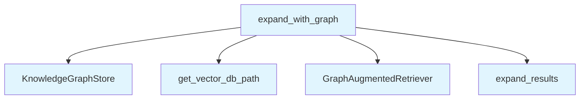

# File: `src/local_deepwiki/services/graph_expansion.py`

## File Overview

This module provides a single asynchronous function, `expand_with_graph`, responsible for optionally enriching vector search results with graph-related chunks. It is designed to be a reusable service that integrates graph-augmented retrieval into any vector search pipeline.

The function respects the application's configuration (`config.graph_rag.enabled`) and gracefully handles failures during graph expansion by returning the original results, ensuring no interruption to the query pipeline.

## Key Concepts

### Graph-Augmented Retrieval
The core idea is to enhance vector search results with semantically or structurally related content from a knowledge graph. This is implemented using a [`GraphAugmentedRetriever`](../core/graph_rag/retriever.md), which traverses the graph to discover related chunks (e.g., function calls, imports, inheritance) and appends them to the original results.

### Non-blocking Design
The function is intentionally non-blocking. If graph expansion fails for any reason, a warning is logged, and the original search results are returned. This ensures robustness in the face of transient or unexpected errors in the graph store or retrieval process.

### Configuration-Driven Behavior
The behavior of graph expansion is controlled by a configuration flag (`config.graph_rag.enabled`). This allows the feature to be toggled on or off without code changes, supporting both development and production environments.

## Integration

This module is used by the `query_service` and is tested via `test_graph_rag_query_integration`. It integrates with:

- [`VectorStore`](../core/vectorstore/store.md): Required to fetch chunks by ID during graph expansion.
- [`KnowledgeGraphStore`](../core/graph_rag/store.md): Used to access the knowledge graph for traversal.
- [`GraphAugmentedRetriever`](../core/graph_rag/retriever.md): The core component that performs the graph expansion logic.
- [`Config`](../config/models.md): Provides settings to control graph expansion behavior.
- [`SearchResult`](../handlers/types.md): The data structure representing search results that are expanded.

The module is designed to be a lightweight, centralized service that can be reused across different query handlers or pipelines without duplicating the logic for graph expansion.

## Design Notes

### Why Asynchronous?
The `expand_with_graph` function is asynchronous because graph operations (e.g., traversal, database queries) can be I/O-bound and benefit from non-blocking execution. This is especially important in a web or API context where concurrent requests are common.

### Graceful Degradation
When `config.graph_rag.enabled` is `False`, the function returns the original search results immediately, avoiding unnecessary overhead. This is a pragmatic design choice that allows for easy feature toggling without performance penalties.

### Exception Handling
If an exception occurs during graph expansion, it is caught and logged as a warning. The original results are returned to prevent the failure of one component from breaking the entire search pipeline. This is a key design choice for resilience in distributed or complex systems.

### Empty Input Handling
The function checks for empty `search_results` and returns them unchanged. This avoids unnecessary computation or potential errors when no results are present.

## API Reference

### Functions

#### `expand_with_graph`

```python
async def expand_with_graph(search_results: list[SearchResult], vector_store: VectorStore, config: Config, repo_path: Path) -> list[SearchResult]
```

Optionally expand *search_results* with graph-related chunks.  When ``config.graph_rag.enabled`` is *False* (the default), the original results are returned unchanged with no extra work.  When enabled, a :class:`~local_deepwiki.core.graph_rag.retriever.[GraphAugmentedRetriever](../core/graph_rag/retriever.md)` traverses the knowledge graph and appends structurally related chunks (calls, imports, inheritance, etc.) scored below the vector results.  The function is intentionally **non-blocking**: if graph expansion raises an exception, a warning is logged and the original results are returned so that the query pipeline continues without interruption.


| Parameter | Type | Default | Description |
|-----------|------|---------|-------------|
| `search_results` | `list[SearchResult]` | - | Vector search results to expand. |
| `vector_store` | `VectorStore` | - | The vector store used for the original search (needed by the retriever to fetch chunks by ID). |
| `config` | `Config` | - | Application configuration containing ``graph_rag`` settings. |
| `repo_path` | `Path` | - | Resolved path to the indexed repository (used to locate the LanceDB directory). |

**Returns:** `list[[SearchResult](../handlers/types.md)]`


<details>
<summary>View Source (lines 27-84) | <a href="https://github.com/UrbanDiver/local-deepwiki-mcp/blob/main/src/local_deepwiki/services/graph_expansion.py#L27-L84">GitHub</a></summary>

```python
async def expand_with_graph(
    search_results: list[SearchResult],
    vector_store: VectorStore,
    config: Config,
    repo_path: Path,
) -> list[SearchResult]:
    """Optionally expand *search_results* with graph-related chunks.

    When ``config.graph_rag.enabled`` is *False* (the default), the original
    results are returned unchanged with no extra work.

    When enabled, a :class:`~local_deepwiki.core.graph_rag.retriever.GraphAugmentedRetriever`
    traverses the knowledge graph and appends structurally related chunks
    (calls, imports, inheritance, etc.) scored below the vector results.

    The function is intentionally **non-blocking**: if graph expansion raises
    an exception, a warning is logged and the original results are returned
    so that the query pipeline continues without interruption.

    Args:
        search_results: Vector search results to expand.
        vector_store: The vector store used for the original search
            (needed by the retriever to fetch chunks by ID).
        config: Application configuration containing ``graph_rag`` settings.
        repo_path: Resolved path to the indexed repository (used to locate
            the LanceDB directory).

    Returns:
        The original results plus any graph-discovered results, or just the
        originals if graph expansion is disabled or fails.
    """
    if not config.graph_rag.enabled:
        return search_results

    if not search_results:
        return search_results

    try:
        graph_store = KnowledgeGraphStore(config.get_vector_db_path(repo_path))
        retriever = GraphAugmentedRetriever(
            graph_store=graph_store,
            vector_store=vector_store,
            config=config.graph_rag,
        )

        expanded = await retriever.expand_results(search_results)
        logger.debug(
            "Graph expansion: %d -> %d results",
            len(search_results),
            len(expanded),
        )
        return expanded
    except Exception:
        logger.warning(
            "Graph expansion failed, returning original results",
            exc_info=True,
        )
        return search_results
```

</details>

## Call Graph



## Used By

Functions and methods in this file and their callers:

- **[`GraphAugmentedRetriever`](../core/graph_rag/retriever.md)**: called by `expand_with_graph`
- **[`KnowledgeGraphStore`](../core/graph_rag/store.md)**: called by `expand_with_graph`
- **`expand_results`**: called by `expand_with_graph`
- **`get_vector_db_path`**: called by `expand_with_graph`

## Last Modified

| Entity | Type | Author | Date | Commit |
|--------|------|--------|------|--------|
| `expand_with_graph` | function | Brian Breidenbach | 2 weeks ago | `ee9eebf` feat: add GraphRAG knowledg... |

## Relevant Source Files

- `src/local_deepwiki/services/graph_expansion.py:27-84`
