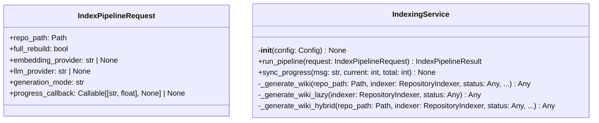

# File: `src/local_deepwiki/services/indexing_service.py`

## File Overview

This file implements the core business logic for the repository indexing pipeline. It orchestrates the process of parsing, chunking, embedding, storing, and generating a wiki from a codebase. The `IndexingService` class encapsulates this pipeline, handling different generation modes (eager, lazy, hybrid) and managing progress callbacks for UI updates or logging.

The service is designed to be called from higher-level handlers (like in `handlers/indexing.py`) which manage authentication, RBAC, audit logging, and MCP progress notifications, while this module focuses purely on the indexing and wiki generation logic.

## Key Concepts

### Pipeline Orchestration
The `run_pipeline` method orchestrates a multi-step process:
1. **Indexing**: Uses [`RepositoryIndexer`](../core/indexer.md) to parse, chunk, embed, and store codebase data.
2. **Progress Tracking**: Integrates a `sync_progress` callback to provide real-time updates.
3. **Wiki Generation**: Delegates to different generation strategies based on [`GenerationMode`](../config/models_wiki.md).

### Generation Modes
The system supports three wiki generation modes:
- **Eager**: Generates all wiki pages immediately using the [`generate_wiki`](../generators/wiki/generator.md) function.
- **Lazy**: Builds only an entity registry, deferring page generation to a later step.
- **Hybrid**: Generates a limited number of pages eagerly, then builds an entity registry for remaining files.

This design allows users to choose performance trade-offs between immediate results and full coverage.

### Progress Synchronization
The `sync_progress` helper function ensures that progress updates from the indexing process are properly formatted and forwarded to a user-provided callback. It maintains a list of messages for internal reporting.

### Lazy and Hybrid Mode Handling
In `lazy` mode, the system builds an `entity_registry.json` file for cross-linking without generating wiki pages. In `hybrid` mode, it first generates a subset of pages eagerly and then builds the entity registry for the rest. The `prefetch_drain` option in hybrid mode allows for background processing of remaining pages.

## Integration

This file integrates deeply with:
- [`RepositoryIndexer`](../core/indexer.md) for core indexing and vector store operations.
- [`generate_wiki`](../generators/wiki/generator.md) and related generator functions for wiki content creation.
- [`Config`](../config/models.md) for determining generation mode and other settings.
- [`IndexPipelineResult`](models.md) for returning structured results.

It is called by:
- `IndexPipelineRequest` which provides immutable parameters to the pipeline.
- The `IndexingService` class itself, which is instantiated by handlers.

External files like `cli/main.py` and `cli/config_validator.py` may indirectly influence behavior through [`Config`](../config/models.md), but this module does not directly depend on them.

## Design Notes

### Separation of Concerns
The `IndexingService` focuses exclusively on the indexing pipeline logic, leaving handler-level concerns such as access control, logging, and progress notifications to other components. This separation ensures clean modularity and testability.

### Generation Mode Flexibility
The choice of generation mode (`GenerationMode.LAZY`, `GenerationMode.HYBRID`, etc.) allows for performance tuning based on user needs. The use of `match` ensures type-safe dispatch to appropriate generation strategies.

### Deferred Page Generation
In lazy and hybrid modes, the system defers page generation to reduce upfront compute cost. This is particularly useful for large repositories where immediate full generation may be infeasible.

### Error Handling and Stability
The `vector_store.stabilize()` call ensures that all indexing operations are complete before proceeding to wiki generation, which is crucial for consistency.

### Extensibility
The design allows for future expansion by adding new [`GenerationMode`](../config/models_wiki.md) variants or by introducing additional strategies for wiki generation without modifying core indexing logic.

## API Reference

### class `IndexPipelineRequest`

Immutable parameters for the indexing pipeline.


<details>
<summary>View Source (lines 24-32) | <a href="https://github.com/UrbanDiver/local-deepwiki-mcp/blob/main/src/local_deepwiki/services/indexing_service.py#L24-L32">GitHub</a></summary>

```python
class IndexPipelineRequest:
    """Immutable parameters for the indexing pipeline."""

    repo_path: Path
    full_rebuild: bool = False
    embedding_provider: str | None = None
    llm_provider: str | None = None
    generation_mode: str = "eager"
    progress_callback: Callable[[str, float], None] | None = None
```

</details>

### class `IndexingService`

Encapsulates the repository indexing pipeline.  Depends only on [Config](../config/models.md); constructs [RepositoryIndexer](../core/indexer.md) internally since the indexer manages its own embedding provider and vector store.

**Methods:**


<details>
<summary>View Source (lines 35-219) | <a href="https://github.com/UrbanDiver/local-deepwiki-mcp/blob/main/src/local_deepwiki/services/indexing_service.py#L35-L219">GitHub</a></summary>

```python
class IndexingService:
    # Methods: __init__, run_pipeline, sync_progress, _generate_wiki, _generate_wiki_lazy, _generate_wiki_hybrid
```

</details>

#### `__init__`

```python
def __init__(config: Config) -> None
```


| Parameter | Type | Default | Description |
|-----------|------|---------|-------------|
| `config` | `Config` | - | - |


<details>
<summary>View Source (lines 44-45) | <a href="https://github.com/UrbanDiver/local-deepwiki-mcp/blob/main/src/local_deepwiki/services/indexing_service.py#L44-L45">GitHub</a></summary>

```python
def __init__(self, config: Config) -> None:
        self._config = config
```

</details>

#### `run_pipeline`

```python
async def run_pipeline(request: IndexPipelineRequest) -> IndexPipelineResult
```

Execute the full indexing pipeline.  Orchestrates: parse -> chunk -> embed -> store -> generate wiki.


| Parameter | Type | Default | Description |
|-----------|------|---------|-------------|
| `request` | `IndexPipelineRequest` | - | Immutable request containing repo path, rebuild flag, provider overrides, generation mode, and progress callback. |


<details>
<summary>View Source (lines 47-101) | <a href="https://github.com/UrbanDiver/local-deepwiki-mcp/blob/main/src/local_deepwiki/services/indexing_service.py#L47-L101">GitHub</a></summary>

```python
async def run_pipeline(
        self,
        request: IndexPipelineRequest,
    ) -> IndexPipelineResult:
        """Execute the full indexing pipeline.

        Orchestrates: parse -> chunk -> embed -> store -> generate wiki.

        Args:
            request: Immutable request containing repo path, rebuild flag,
                provider overrides, generation mode, and progress callback.

        Returns:
            IndexPipelineResult with indexing statistics.
        """
        indexer = RepositoryIndexer(
            repo_path=request.repo_path,
            config=self._config,
            embedding_provider_name=request.embedding_provider,
        )

        progress_messages: list[str] = []
        cb = request.progress_callback

        def sync_progress(msg: str, current: int, total: int) -> None:
            progress_messages.append(f"[{current}/{total}] {msg}")
            if cb is not None:
                fraction = current / total if total > 0 else 0.0
                cb(msg, fraction)

        status = await indexer.index(
            full_rebuild=request.full_rebuild,
            progress_callback=sync_progress,
        )

        indexer.vector_store.stabilize()

        wiki_structure = await self._generate_wiki(
            repo_path=request.repo_path,
            indexer=indexer,
            status=status,
            llm_provider=request.llm_provider,
            sync_progress_callback=sync_progress,
            full_rebuild=request.full_rebuild,
        )

        return IndexPipelineResult(
            files_indexed=status.total_files,
            chunks_created=status.total_chunks,
            wiki_pages_generated=len(wiki_structure.pages),
            generation_mode=self._config.wiki.generation_mode.value,
            wiki_path=str(indexer.wiki_path),
            languages=dict(status.languages),
            messages=tuple(progress_messages),
        )
```

</details>

#### `sync_progress`

```python
def sync_progress(msg: str, current: int, total: int) -> None
```


| Parameter | Type | Default | Description |
|-----------|------|---------|-------------|
| `msg` | `str` | - | - |
| `current` | `int` | - | - |
| `total` | `int` | - | - |


<details>
<summary>View Source (lines 71-75) | <a href="https://github.com/UrbanDiver/local-deepwiki-mcp/blob/main/src/local_deepwiki/services/indexing_service.py#L71-L75">GitHub</a></summary>

```python
def sync_progress(msg: str, current: int, total: int) -> None:
            progress_messages.append(f"[{current}/{total}] {msg}")
            if cb is not None:
                fraction = current / total if total > 0 else 0.0
                cb(msg, fraction)
```

</details>

## Class Diagram



## Call Graph

```mermaid
flowchart TD
    N0[IndexPipelineResult]
    N1[IndexingService._generate_wiki]
    N2[IndexingService._generate_w...]
    N3[IndexingService._generate_w...]
    N4[IndexingService.run_pipeline]
    N5[IndexingService.sync_progress]
    N6[RepositoryIndexer]
    N7[WikiStructure]
    N8[_generate_wiki]
    N9[_generate_wiki_hybrid]
    N10[_generate_wiki_lazy]
    N11[build_entity_registry_from_...]
    N12[cb]
    N13[filter_significant_files]
    N14[generate_wiki]
    N15[get_all_chunks]
    N16[get_lazy_generator]
    N17[kickstart_drain]
    N18[save]
    N19[stabilize]
    N4 --> N6
    N4 --> N12
    N4 --> N19
    N4 --> N8
    N4 --> N0
    N5 --> N12
    N1 --> N10
    N1 --> N9
    N1 --> N14
    N3 --> N13
    N3 --> N11
    N3 --> N15
    N3 --> N18
    N3 --> N7
    N2 --> N14
    N2 --> N13
    N2 --> N11
    N2 --> N15
    N2 --> N18
    N2 --> N16
    N2 --> N17
    classDef func fill:#e1f5fe
    class N0,N6,N7,N8,N9,N10,N11,N12,N13,N14,N15,N16,N17,N18,N19 func
    classDef method fill:#fff3e0
    class N1,N2,N3,N4,N5 method
```



## Used By

Functions and methods in this file and their callers:

- **[`IndexPipelineResult`](models.md)**: called by `IndexingService.run_pipeline`
- **[`RepositoryIndexer`](../core/indexer.md)**: called by `IndexingService.run_pipeline`
- **[`WikiStructure`](../models/wiki.md)**: called by `IndexingService._generate_wiki_lazy`
- **`_generate_wiki`**: called by `IndexingService.run_pipeline`
- **`_generate_wiki_hybrid`**: called by `IndexingService._generate_wiki`
- **`_generate_wiki_lazy`**: called by `IndexingService._generate_wiki`
- **[`build_entity_registry_from_store`](../generators/crosslinks.md)**: called by `IndexingService._generate_wiki_hybrid`, `IndexingService._generate_wiki_lazy`
- **`cb`**: called by `IndexingService.run_pipeline`, `IndexingService.sync_progress`
- **[`filter_significant_files`](../generators/wiki/files.md)**: called by `IndexingService._generate_wiki_hybrid`, `IndexingService._generate_wiki_lazy`
- **[`generate_wiki`](../generators/wiki/generator.md)**: called by `IndexingService._generate_wiki`, `IndexingService._generate_wiki_hybrid`
- **`get_all_chunks`**: called by `IndexingService._generate_wiki_hybrid`, `IndexingService._generate_wiki_lazy`
- **[`get_lazy_generator`](../generators/lazy_generator.md)**: called by `IndexingService._generate_wiki_hybrid`
- **`kickstart_drain`**: called by `IndexingService._generate_wiki_hybrid`
- **`save`**: called by `IndexingService._generate_wiki_hybrid`, `IndexingService._generate_wiki_lazy`
- **`stabilize`**: called by `IndexingService.run_pipeline`

## Last Modified

| Entity | Type | Author | Date | Commit |
|--------|------|--------|------|--------|
| `IndexPipelineRequest` | class | Brian Breidenbach | yesterday | `1eef062` refactor: complete Grade A ... |
| `IndexingService` | class | Brian Breidenbach | yesterday | `1eef062` refactor: complete Grade A ... |
| `run_pipeline` | method | Brian Breidenbach | yesterday | `1eef062` refactor: complete Grade A ... |
| `sync_progress` | method | Brian Breidenbach | yesterday | `1eef062` refactor: complete Grade A ... |
| `__init__` | method | Brian Breidenbach | 2 weeks ago | `8203fe8` feat: add service layer, hy... |
| `_generate_wiki` | method | Brian Breidenbach | 2 weeks ago | `8203fe8` feat: add service layer, hy... |
| `_generate_wiki_lazy` | method | Brian Breidenbach | 2 weeks ago | `8203fe8` feat: add service layer, hy... |
| `_generate_wiki_hybrid` | method | Brian Breidenbach | 2 weeks ago | `8203fe8` feat: add service layer, hy... |

## Additional Source Code

Source code for functions and methods not listed in the API Reference above.

#### `_generate_wiki`

<details>
<summary>View Source (lines 103-142) | <a href="https://github.com/UrbanDiver/local-deepwiki-mcp/blob/main/src/local_deepwiki/services/indexing_service.py#L103-L142">GitHub</a></summary>

```python
async def _generate_wiki(
        self,
        repo_path: Path,
        indexer: RepositoryIndexer,
        status: Any,
        llm_provider: str | None,
        sync_progress_callback: Callable[[str, int, int], None],
        full_rebuild: bool,
    ) -> Any:
        """Dispatch wiki generation based on configured mode."""
        from local_deepwiki.config import GenerationMode
        from local_deepwiki.generators.wiki import generate_wiki

        gen_mode = self._config.wiki.generation_mode

        match gen_mode:
            case GenerationMode.LAZY:
                return self._generate_wiki_lazy(indexer, status)

            case GenerationMode.HYBRID:
                return await self._generate_wiki_hybrid(
                    repo_path,
                    indexer,
                    status,
                    llm_provider,
                    sync_progress_callback,
                    full_rebuild,
                )

            case _:
                return await generate_wiki(
                    repo_path=repo_path,
                    wiki_path=indexer.wiki_path,
                    vector_store=indexer.vector_store,
                    index_status=status,
                    config=self._config,
                    llm_provider=llm_provider,
                    progress_callback=sync_progress_callback,
                    full_rebuild=full_rebuild,
                )
```

</details>


#### `_generate_wiki_lazy`

<details>
<summary>View Source (lines 145-164) | <a href="https://github.com/UrbanDiver/local-deepwiki-mcp/blob/main/src/local_deepwiki/services/indexing_service.py#L145-L164">GitHub</a></summary>

```python
def _generate_wiki_lazy(
        indexer: RepositoryIndexer,
        status: Any,
    ) -> Any:
        """Lazy mode: build entity registry only, defer page generation."""
        from local_deepwiki.generators.crosslinks import (
            build_entity_registry_from_store,
        )
        from local_deepwiki.generators.wiki.files import filter_significant_files
        from local_deepwiki.models import WikiStructure

        config = indexer.config
        significant = filter_significant_files(status.files, config.wiki.max_file_docs)
        sig_paths = {f.path for f in significant}
        entity_reg = build_entity_registry_from_store(
            indexer.vector_store.get_all_chunks(), sig_paths
        )
        entity_reg.save(indexer.wiki_path / "entity_registry.json")

        return WikiStructure(root=str(indexer.wiki_path), pages=[])
```

</details>


#### `_generate_wiki_hybrid`

<details>
<summary>View Source (lines 166-219) | <a href="https://github.com/UrbanDiver/local-deepwiki-mcp/blob/main/src/local_deepwiki/services/indexing_service.py#L166-L219">GitHub</a></summary>

```python
async def _generate_wiki_hybrid(
        self,
        repo_path: Path,
        indexer: RepositoryIndexer,
        status: Any,
        llm_provider: str | None,
        sync_progress_callback: Callable[[str, int, int], None],
        full_rebuild: bool,
    ) -> Any:
        """Hybrid mode: generate eager pages, then build entity registry."""
        from local_deepwiki.generators.crosslinks import (
            build_entity_registry_from_store,
        )
        from local_deepwiki.generators.wiki import generate_wiki
        from local_deepwiki.generators.wiki.files import filter_significant_files

        eager_limit = self._config.wiki.hybrid_eager_pages
        wiki_structure = await generate_wiki(
            repo_path=repo_path,
            wiki_path=indexer.wiki_path,
            vector_store=indexer.vector_store,
            index_status=status,
            config=self._config,
            llm_provider=llm_provider,
            progress_callback=sync_progress_callback,
            full_rebuild=full_rebuild,
            max_file_pages=eager_limit,
        )

        significant = filter_significant_files(
            status.files, self._config.wiki.max_file_docs
        )
        sig_paths = {f.path for f in significant}
        entity_reg = build_entity_registry_from_store(
            indexer.vector_store.get_all_chunks(), sig_paths
        )
        entity_reg.save(indexer.wiki_path / "entity_registry.json")

        remaining = len(significant) - eager_limit
        if remaining > 0:
            logger.info(
                "Hybrid mode: %d pages generated eagerly, %d deferred",
                eager_limit,
                remaining,
            )
            if self._config.wiki.prefetch_drain:
                from local_deepwiki.generators.lazy_generator import (
                    get_lazy_generator,
                )

                lazy_gen = get_lazy_generator(indexer.wiki_path, self._config)
                lazy_gen.kickstart_drain()

        return wiki_structure
```

</details>

## Relevant Source Files

- `src/local_deepwiki/services/indexing_service.py:24-32`
