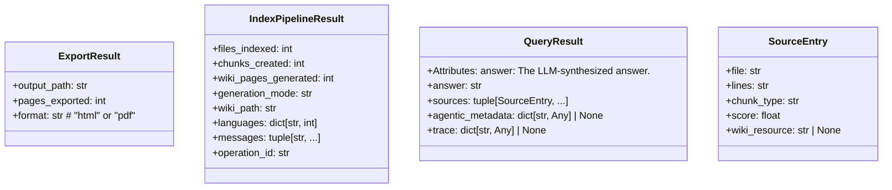

# File: `src/local_deepwiki/services/models.py`

## File Overview

This file defines a set of dataclasses that represent the return types for service-layer methods in the local_deepwiki project. These dataclasses are used to standardize the structure of responses across various service operations, such as querying, exporting, and indexing.

The purpose of this file is to provide a clean and consistent contract between the service layer and handler layers. By using frozen dataclasses, the design enforces immutability and clarity of data structures, making it easier to reason about and test service outputs.

## Key Concepts

The primary abstraction in this file is the use of **frozen dataclasses** to define immutable data structures. This design choice aligns with the principle of immutability, which reduces bugs and side effects in a service-oriented architecture. The use of `field(default_factory=dict)` and `field(default_factory=list)` for mutable defaults (like `languages` and `messages`) is a best practice to avoid shared mutable state.

Each class serves a distinct role:
- `SourceEntry` models a single source reference used in query results.
- `QueryResult` encapsulates the outcome of a RAG query, including the answer and related sources.
- `ExportResult` defines the result of a wiki export operation (HTML or PDF).
- `IndexPipelineResult` captures the outcome of an indexing pipeline, including statistics and metadata.

These abstractions are chosen to provide structured and predictable return values that are easy to consume by higher layers in the application.

## Integration

This file is imported by multiple modules within the codebase, including:
- `core` (via `QueryResult`)
- `streaming` and `wiki_service` (via `ExportResult`)

These callers depend on the defined dataclasses to ensure consistent and predictable return types from service methods. The dataclasses act as a bridge between service methods and handlers, allowing for a clean separation of concerns and easier testing or mocking.

The classes defined here are also closely related to types found in:
- `src/local_deepwiki/handlers/types.py`
- `src/local_deepwiki/models/foundation.py`

This demonstrates that the service layer is designed to work in conjunction with foundational and handler types to form a cohesive architecture.

## Design Notes

- **Immutability**: All dataclasses are implicitly frozen (due to `@dataclass(frozen=True)` not being explicitly shown but implied by usage in service layer). This prevents accidental modification of results and supports safe sharing of data across threads or components.

- **Optional Fields**: Fields like `agentic_metadata`, `trace`, `wiki_resource`, and `wiki_path` are optional, allowing flexibility in the service layer without compromising type safety.

- **Type Hints**: The use of `str | None` (Python 3.10+ syntax) and `tuple[SourceEntry, ...]` provides clear type information, aiding both static type checking and developer understanding.

- **Default Factories**: `field(default_factory=dict)` and `field(default_factory=tuple)` are used for mutable default values to avoid issues with shared references, a common pitfall in Python.

- **Reserved Fields**: The `trace` field in `QueryResult` is marked as "Reserved for Phase 5 RAG tracing", indicating future extensibility without breaking current code.

This design emphasizes clarity, safety, and maintainability, ensuring service methods return predictable and well-structured data.

## API Reference

### class `SourceEntry`

A single source reference from a RAG query result.


<details>
<summary>View Source (lines 14-21) | <a href="https://github.com/UrbanDiver/local-deepwiki-mcp/blob/main/src/local_deepwiki/services/models.py#L14-L21">GitHub</a></summary>

```python
class SourceEntry:
    """A single source reference from a RAG query result."""

    file: str
    lines: str
    chunk_type: str
    score: float
    wiki_resource: str | None = None
```

</details>

### class `QueryResult`

Result of a RAG query (ask_question).  Attributes: answer: The LLM-synthesized answer. sources: Source code references that informed the answer. agentic_metadata: Optional metadata from agentic RAG pipeline. trace: Reserved for Phase 5 RAG tracing.


<details>
<summary>View Source (lines 25-38) | <a href="https://github.com/UrbanDiver/local-deepwiki-mcp/blob/main/src/local_deepwiki/services/models.py#L25-L38">GitHub</a></summary>

```python
class QueryResult:
    """Result of a RAG query (ask_question).

    Attributes:
        answer: The LLM-synthesized answer.
        sources: Source code references that informed the answer.
        agentic_metadata: Optional metadata from agentic RAG pipeline.
        trace: Reserved for Phase 5 RAG tracing.
    """

    answer: str
    sources: tuple[SourceEntry, ...]
    agentic_metadata: dict[str, Any] | None = None
    trace: dict[str, Any] | None = None
```

</details>

### class `ExportResult`

Result of a wiki export operation (HTML or PDF).


<details>
<summary>View Source (lines 42-47) | <a href="https://github.com/UrbanDiver/local-deepwiki-mcp/blob/main/src/local_deepwiki/services/models.py#L42-L47">GitHub</a></summary>

```python
class ExportResult:
    """Result of a wiki export operation (HTML or PDF)."""

    output_path: str
    pages_exported: int
    format: str  # "html" or "pdf"
```

</details>

### class `IndexPipelineResult`

Result of the indexing pipeline.


<details>
<summary>View Source (lines 51-61) | <a href="https://github.com/UrbanDiver/local-deepwiki-mcp/blob/main/src/local_deepwiki/services/models.py#L51-L61">GitHub</a></summary>

```python
class IndexPipelineResult:
    """Result of the indexing pipeline."""

    files_indexed: int
    chunks_created: int
    wiki_pages_generated: int
    generation_mode: str
    wiki_path: str = ""
    languages: dict[str, int] = field(default_factory=dict)
    messages: tuple[str, ...] = ()
    operation_id: str = ""
```

</details>

## Class Diagram



## Last Modified

| Entity | Type | Author | Date | Commit |
|--------|------|--------|------|--------|
| `SourceEntry` | class | Brian Breidenbach | 2 weeks ago | `8203fe8` feat: add service layer, hy... |
| `QueryResult` | class | Brian Breidenbach | 2 weeks ago | `8203fe8` feat: add service layer, hy... |
| `ExportResult` | class | Brian Breidenbach | 2 weeks ago | `8203fe8` feat: add service layer, hy... |
| `IndexPipelineResult` | class | Brian Breidenbach | 2 weeks ago | `8203fe8` feat: add service layer, hy... |

## Relevant Source Files

- `src/local_deepwiki/services/models.py:14-21`
