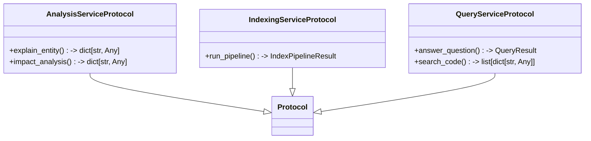

# File: `src/local_deepwiki/services/protocols.py`

## File Overview

This file defines structural typing contracts using `typing.Protocol` for the service-layer components in the `local_deepwiki` project. These protocols provide a way to define interfaces that classes must adhere to, enabling dependency injection and facilitating testing with mock objects. The use of protocols allows handlers and other consumers to depend on abstract interfaces rather than concrete implementations, which improves modularity and reduces coupling.

The protocols defined in this file are:
- `QueryServiceProtocol`
- `AnalysisServiceProtocol`
- `IndexingServiceProtocol`

All protocols are marked as `@runtime_checkable`, which means they can be used with `isinstance` checks at runtime — a feature that is crucial for testing and diagnostic code.

## Key Concepts

### Structural Typing with Protocols

The core abstraction in this file is the use of `typing.Protocol`. This choice was made to enforce structural typing instead of nominal typing, allowing for more flexible and testable code. Instead of requiring classes to inherit from a base class, protocols define what methods and properties a class must have, enabling loose coupling and easier mocking.

### Interface Segregation Principle

Each protocol defines a distinct set of responsibilities:
- `QueryServiceProtocol`: Encapsulates the logic for answering questions and searching code.
- `AnalysisServiceProtocol`: Defines the interface for entity explanation and impact analysis.
- `IndexingServiceProtocol`: Specifies the behavior of the indexing pipeline.

This segregation ensures that each service layer can be developed, tested, and replaced independently.

### Runtime Checkability

The `@runtime_checkable` [decorator](../providers/retry.md) allows for runtime validation of protocol compliance. This is particularly useful in tests and diagnostic tools where it's important to verify that a given object adheres to a protocol before using it, without relying on static type checkers alone.

## Integration

This file integrates with the broader codebase by providing interfaces that are consumed by various components such as:
- Handlers that execute RAG queries or code searches
- Test doubles used in unit tests (e.g., in `test_protocols`)
- CLI entrypoints and plugin systems that may require substitutable services

The imports from:
- `local_deepwiki.services.analysis_service`
- `local_deepwiki.services.indexing_service`
- `local_deepwiki.services.models`
- `local_deepwiki.services.query_service`

indicate that these protocols are meant to be implemented by concrete services within these modules, and that they expect specific request/response types to be passed in and out.

For example:
- `QueryServiceProtocol` is used by handlers that perform RAG queries or code searches.
- `AnalysisServiceProtocol` is used by handlers performing entity explanation or impact analysis.
- `IndexingServiceProtocol` is used by components driving the indexing pipeline.

This design enables a clear separation between service layer logic and handler logic, supporting a more modular architecture.

## Design Notes

### Why Protocols Over Abstract Base Classes

Using `Protocol` over an `ABC` (Abstract Base Class) was chosen because:
- It allows for more flexible implementation, especially when working with existing classes that cannot be modified to inherit from a base class.
- It supports structural typing, which aligns with Python's duck typing philosophy.
- It works seamlessly with type checkers like `mypy` while also being usable at runtime.

### Why `runtime_checkable`

The `@runtime_checkable` [decorator](../providers/retry.md) was included to allow for:
- Runtime verification of protocol compliance, which is essential for testing and debugging.
- Compatibility with runtime introspection and diagnostic tools.

### Minimal Interface Definition

Each protocol is intentionally minimal, focusing only on the essential methods and parameters required by consumers. This keeps the interfaces clean and avoids over-engineering, making it easier to implement and maintain.

### Request/Result Types

The protocols use specific request and result types ([`QuestionRequest`](query_service.md), [`CodeSearchRequest`](query_service.md), [`IndexPipelineRequest`](indexing_service.md), etc.) that are defined in other service modules. This design promotes reuse and consistency across the service layer, ensuring that all services interact with the same data structures, while still allowing for flexibility in implementation.

## API Reference

### class `QueryServiceProtocol`

**Inherits from:** `Protocol`

Protocol defining the interface for the RAG query service.  Handlers that execute RAG queries or code searches should accept this Protocol so that test doubles can be substituted without subclassing the concrete `[`QueryService`](query_service.md)`.

**Methods:**


<details>
<summary>View Source (lines 27-64) | <a href="https://github.com/UrbanDiver/local-deepwiki-mcp/blob/main/src/local_deepwiki/services/protocols.py#L27-L64">GitHub</a></summary>

```python
class QueryServiceProtocol(Protocol):
    """Protocol defining the interface for the RAG query service.

    Handlers that execute RAG queries or code searches should accept
    this Protocol so that test doubles can be substituted without
    subclassing the concrete ``QueryService``.
    """

    async def answer_question(
        self,
        request: QuestionRequest,
    ) -> QueryResult:
        """Execute the full RAG pipeline: search -> [rerank] -> synthesize.

        Args:
            request: Immutable request containing repo path, question,
                max context, agentic RAG toggle, wiki path, and debug flag.

        Returns:
            QueryResult with the synthesized answer and source references.
        """
        ...

    async def search_code(
        self,
        request: CodeSearchRequest,
    ) -> list[dict[str, Any]]:
        """Search code with optional filters.

        Args:
            request: Immutable request containing repo path, query,
                limit, language, chunk type, path filter, fuzzy settings.

        Returns:
            List of result dicts with file_path, name, type, language,
            lines, score, preview, docstring, and optional highlights.
        """
        ...
```

</details>

#### `answer_question`

```python
async def answer_question(request: QuestionRequest) -> QueryResult
```

Execute the full RAG pipeline: search -> [rerank] -> synthesize.


| Parameter | Type | Default | Description |
|-----------|------|---------|-------------|
| `request` | `QuestionRequest` | - | Immutable request containing repo path, question, max context, agentic RAG toggle, wiki path, and debug flag. |


<details>
<summary>View Source (lines 27-64) | <a href="https://github.com/UrbanDiver/local-deepwiki-mcp/blob/main/src/local_deepwiki/services/protocols.py#L27-L64">GitHub</a></summary>

```python
class QueryServiceProtocol(Protocol):
    """Protocol defining the interface for the RAG query service.

    Handlers that execute RAG queries or code searches should accept
    this Protocol so that test doubles can be substituted without
    subclassing the concrete ``QueryService``.
    """

    async def answer_question(
        self,
        request: QuestionRequest,
    ) -> QueryResult:
        """Execute the full RAG pipeline: search -> [rerank] -> synthesize.

        Args:
            request: Immutable request containing repo path, question,
                max context, agentic RAG toggle, wiki path, and debug flag.

        Returns:
            QueryResult with the synthesized answer and source references.
        """
        ...

    async def search_code(
        self,
        request: CodeSearchRequest,
    ) -> list[dict[str, Any]]:
        """Search code with optional filters.

        Args:
            request: Immutable request containing repo path, query,
                limit, language, chunk type, path filter, fuzzy settings.

        Returns:
            List of result dicts with file_path, name, type, language,
            lines, score, preview, docstring, and optional highlights.
        """
        ...
```

</details>

#### `search_code`

```python
async def search_code(request: CodeSearchRequest) -> list[dict[str, Any]]
```

Search code with optional filters.


| Parameter | Type | Default | Description |
|-----------|------|---------|-------------|
| `request` | `CodeSearchRequest` | - | Immutable request containing repo path, query, limit, language, chunk type, path filter, fuzzy settings. |


<details>
<summary>View Source (lines 27-64) | <a href="https://github.com/UrbanDiver/local-deepwiki-mcp/blob/main/src/local_deepwiki/services/protocols.py#L27-L64">GitHub</a></summary>

```python
class QueryServiceProtocol(Protocol):
    """Protocol defining the interface for the RAG query service.

    Handlers that execute RAG queries or code searches should accept
    this Protocol so that test doubles can be substituted without
    subclassing the concrete ``QueryService``.
    """

    async def answer_question(
        self,
        request: QuestionRequest,
    ) -> QueryResult:
        """Execute the full RAG pipeline: search -> [rerank] -> synthesize.

        Args:
            request: Immutable request containing repo path, question,
                max context, agentic RAG toggle, wiki path, and debug flag.

        Returns:
            QueryResult with the synthesized answer and source references.
        """
        ...

    async def search_code(
        self,
        request: CodeSearchRequest,
    ) -> list[dict[str, Any]]:
        """Search code with optional filters.

        Args:
            request: Immutable request containing repo path, query,
                limit, language, chunk type, path filter, fuzzy settings.

        Returns:
            List of result dicts with file_path, name, type, language,
            lines, score, preview, docstring, and optional highlights.
        """
        ...
```

</details>

### class `AnalysisServiceProtocol`

**Inherits from:** `Protocol`

Protocol defining the interface for the entity analysis service.  Handlers that perform entity explanation or impact analysis should accept this Protocol so that lightweight stubs can stand in for the concrete `[`AnalysisService`](analysis_service.md)`.

**Methods:**


<details>
<summary>View Source (lines 68-104) | <a href="https://github.com/UrbanDiver/local-deepwiki-mcp/blob/main/src/local_deepwiki/services/protocols.py#L68-L104">GitHub</a></summary>

```python
class AnalysisServiceProtocol(Protocol):
    """Protocol defining the interface for the entity analysis service.

    Handlers that perform entity explanation or impact analysis should
    accept this Protocol so that lightweight stubs can stand in for the
    concrete ``AnalysisService``.
    """

    async def explain_entity(
        self,
        request: EntityExplainRequest,
    ) -> dict[str, Any]:
        """Composite explanation of a code entity.

        Args:
            request: Immutable request with entity name, repo path,
                index status, wiki path, vector store, and section toggles.

        Returns:
            Dict with entity info and analysis sections.
        """
        ...

    async def impact_analysis(
        self,
        request: ImpactAnalysisRequest,
    ) -> dict[str, Any]:
        """Analyze the blast radius of changes to a file or entity.

        Args:
            request: Immutable request with file path, repo path,
                index status, wiki path, vector store, and section toggles.

        Returns:
            Dict with impact analysis results and risk level.
        """
        ...
```

</details>

#### `explain_entity`

```python
async def explain_entity(request: EntityExplainRequest) -> dict[str, Any]
```

Composite explanation of a code entity.


| Parameter | Type | Default | Description |
|-----------|------|---------|-------------|
| `request` | `EntityExplainRequest` | - | Immutable request with entity name, repo path, index status, wiki path, vector store, and section toggles. |


<details>
<summary>View Source (lines 68-104) | <a href="https://github.com/UrbanDiver/local-deepwiki-mcp/blob/main/src/local_deepwiki/services/protocols.py#L68-L104">GitHub</a></summary>

```python
class AnalysisServiceProtocol(Protocol):
    """Protocol defining the interface for the entity analysis service.

    Handlers that perform entity explanation or impact analysis should
    accept this Protocol so that lightweight stubs can stand in for the
    concrete ``AnalysisService``.
    """

    async def explain_entity(
        self,
        request: EntityExplainRequest,
    ) -> dict[str, Any]:
        """Composite explanation of a code entity.

        Args:
            request: Immutable request with entity name, repo path,
                index status, wiki path, vector store, and section toggles.

        Returns:
            Dict with entity info and analysis sections.
        """
        ...

    async def impact_analysis(
        self,
        request: ImpactAnalysisRequest,
    ) -> dict[str, Any]:
        """Analyze the blast radius of changes to a file or entity.

        Args:
            request: Immutable request with file path, repo path,
                index status, wiki path, vector store, and section toggles.

        Returns:
            Dict with impact analysis results and risk level.
        """
        ...
```

</details>

#### `impact_analysis`

```python
async def impact_analysis(request: ImpactAnalysisRequest) -> dict[str, Any]
```

Analyze the blast radius of changes to a file or entity.


| Parameter | Type | Default | Description |
|-----------|------|---------|-------------|
| `request` | `ImpactAnalysisRequest` | - | Immutable request with file path, repo path, index status, wiki path, vector store, and section toggles. |


<details>
<summary>View Source (lines 68-104) | <a href="https://github.com/UrbanDiver/local-deepwiki-mcp/blob/main/src/local_deepwiki/services/protocols.py#L68-L104">GitHub</a></summary>

```python
class AnalysisServiceProtocol(Protocol):
    """Protocol defining the interface for the entity analysis service.

    Handlers that perform entity explanation or impact analysis should
    accept this Protocol so that lightweight stubs can stand in for the
    concrete ``AnalysisService``.
    """

    async def explain_entity(
        self,
        request: EntityExplainRequest,
    ) -> dict[str, Any]:
        """Composite explanation of a code entity.

        Args:
            request: Immutable request with entity name, repo path,
                index status, wiki path, vector store, and section toggles.

        Returns:
            Dict with entity info and analysis sections.
        """
        ...

    async def impact_analysis(
        self,
        request: ImpactAnalysisRequest,
    ) -> dict[str, Any]:
        """Analyze the blast radius of changes to a file or entity.

        Args:
            request: Immutable request with file path, repo path,
                index status, wiki path, vector store, and section toggles.

        Returns:
            Dict with impact analysis results and risk level.
        """
        ...
```

</details>

### class `IndexingServiceProtocol`

**Inherits from:** `Protocol`

Protocol defining the interface for the indexing service.  Handlers that drive the indexing pipeline should accept this Protocol so that tests can provide a stub that returns canned results.

**Methods:**


<details>
<summary>View Source (lines 108-128) | <a href="https://github.com/UrbanDiver/local-deepwiki-mcp/blob/main/src/local_deepwiki/services/protocols.py#L108-L128">GitHub</a></summary>

```python
class IndexingServiceProtocol(Protocol):
    """Protocol defining the interface for the indexing service.

    Handlers that drive the indexing pipeline should accept this Protocol
    so that tests can provide a stub that returns canned results.
    """

    async def run_pipeline(
        self,
        request: IndexPipelineRequest,
    ) -> IndexPipelineResult:
        """Execute the full indexing pipeline.

        Args:
            request: Immutable request containing repo path, rebuild flag,
                provider overrides, generation mode, and progress callback.

        Returns:
            IndexPipelineResult with indexing statistics.
        """
        ...
```

</details>

#### `run_pipeline`

```python
async def run_pipeline(request: IndexPipelineRequest) -> IndexPipelineResult
```

Execute the full indexing pipeline.


| Parameter | Type | Default | Description |
|-----------|------|---------|-------------|
| `request` | `IndexPipelineRequest` | - | Immutable request containing repo path, rebuild flag, provider overrides, generation mode, and progress callback. |


<details>
<summary>View Source (lines 108-128) | <a href="https://github.com/UrbanDiver/local-deepwiki-mcp/blob/main/src/local_deepwiki/services/protocols.py#L108-L128">GitHub</a></summary>

```python
class IndexingServiceProtocol(Protocol):
    """Protocol defining the interface for the indexing service.

    Handlers that drive the indexing pipeline should accept this Protocol
    so that tests can provide a stub that returns canned results.
    """

    async def run_pipeline(
        self,
        request: IndexPipelineRequest,
    ) -> IndexPipelineResult:
        """Execute the full indexing pipeline.

        Args:
            request: Immutable request containing repo path, rebuild flag,
                provider overrides, generation mode, and progress callback.

        Returns:
            IndexPipelineResult with indexing statistics.
        """
        ...
```

</details>

## Class Diagram



## Usage Examples

*Examples extracted from test files*

### Example: `protocols`

From `test_protocols.py::TestChunkerProtocol::test_runtime_checkable`:

```python
assert hasattr(ChunkerProtocol, "__protocol_attrs__") or hasattr(
            ChunkerProtocol, "__abstractmethods__"
        )
        # runtime_checkable protocols support isinstance
        assert isinstance(ChunkerProtocol, type)
```

### Example: `QueryServiceProtocol`

From `test_protocols.py::TestQueryServiceProtocol::test_runtime_checkable`:

```python
assert isinstance(QueryServiceProtocol, type)
```

### Example: `QueryServiceProtocol`

From `test_protocols.py::TestQueryServiceProtocol::test_minimal_stub_satisfies_protocol`:

```python
class _StubQueryService:
            async def answer_question(self, request: Any) -> Any:
                return None

            async def search_code(self, request: Any) -> list[dict[str, Any]]:
                return []

        assert isinstance(_StubQueryService(), QueryServiceProtocol)
```

### Example: `AnalysisServiceProtocol`

From `test_protocols.py::TestAnalysisServiceProtocol::test_runtime_checkable`:

```python
assert isinstance(AnalysisServiceProtocol, type)
```

### Example: `AnalysisServiceProtocol`

From `test_protocols.py::TestAnalysisServiceProtocol::test_concrete_class_satisfies_protocol`:

```python
from local_deepwiki.services.analysis_service import AnalysisService

        service = AnalysisService()
        assert isinstance(service, AnalysisServiceProtocol)
```


## Last Modified

| Entity | Type | Author | Date | Commit |
|--------|------|--------|------|--------|
| `QueryServiceProtocol` | class | Brian Breidenbach | yesterday | `1eef062` refactor: complete Grade A ... |
| `AnalysisServiceProtocol` | class | Brian Breidenbach | yesterday | `1eef062` refactor: complete Grade A ... |
| `IndexingServiceProtocol` | class | Brian Breidenbach | yesterday | `1eef062` refactor: complete Grade A ... |

## Relevant Source Files

- `src/local_deepwiki/services/protocols.py:27-64`
