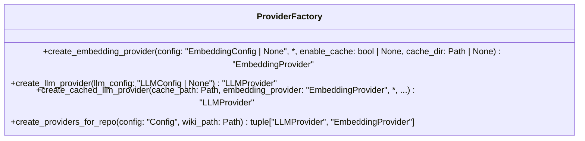
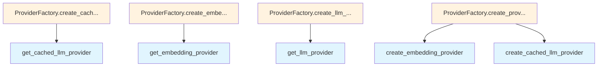

# File: `src/local_deepwiki/services/provider_factory.py`

## File Overview

This file defines the `ProviderFactory` class, which centralizes the construction of LLM and embedding providers used throughout the application. It encapsulates the logic for creating and configuring various provider instances, ensuring consistent setup and reducing duplication across handler modules.

The factory pattern used here promotes maintainability by consolidating provider creation logic in one place. Instead of each handler directly instantiating providers, they delegate to this centralized factory, improving modularity and testability.

## Key Concepts

### Provider Factory Pattern
The `ProviderFactory` class implements a factory pattern for LLM and embedding providers. This pattern is chosen to:
- Encapsulate complex instantiation logic
- Promote reuse of provider configurations
- Allow easy switching or extension of provider types without modifying handler code

### Caching Strategy
The factory supports both direct and cached LLM providers. The `create_cached_llm_provider` method demonstrates a semantic caching strategy where LLM responses are cached based on prompt embeddings, enabling efficient reuse of previous answers when prompts are semantically similar.

### Configuration-Driven Construction
All provider creation methods accept optional configuration parameters, defaulting to global settings when not provided. This allows flexibility in how providers are used while maintaining a consistent default behavior.

## Integration

This file is part of the core service layer and integrates closely with:
- **Configuration system**: Uses [`Config`](../config/models.md), [`EmbeddingConfig`](../config/provider_models.md), [`LLMConfig`](../config/provider_models.md), and [`LLMCacheConfig`](../config/models_llm.md) for provider setup
- **Provider modules**: Delegates to `get_embedding_provider`, `get_llm_provider`, and `get_cached_llm_provider` from respective provider modules
- **CLI and handlers**: Likely consumed by CLI entrypoints and various generator modules (e.g., `pages.py`, `tours.py`) that require configured providers

The factory is designed to be imported and used by handler modules and CLI tools, removing the need for inline provider construction and reducing boilerplate code.

## Design Notes

### Centralized Configuration Handling
By accepting optional configuration objects, the factory allows for flexible provider creation:
- If no config is passed, it defaults to global configuration values
- This enables both default behavior and override scenarios without duplicating setup logic

### Cache Directory Flexibility
The `create_embedding_provider` method supports an optional `cache_dir` override, allowing embedding providers to use specific cache directories if needed, rather than relying solely on defaults.

### Repository-Specific Provider Setup
The `create_providers_for_repo` method provides a convenient way to set up both an embedding provider and a cached LLM provider for a specific repository, using a standard cache path. This is a common pattern in the application and reduces boilerplate in handlers.

### Lazy Imports
Within methods, internal provider creation functions (`get_embedding_provider`, `get_llm_provider`, `get_cached_llm_provider`) are imported locally. This avoids circular imports and keeps the module initialization lightweight.

### Type Hints and Forward References
The use of forward references (e.g., `"EmbeddingProvider"`) ensures compatibility with type checking while avoiding circular dependencies during import time.

## API Reference

### class `ProviderFactory`

Centralized factory for creating LLM and embedding providers.  Replaces the duplicated inline construction of providers that was scattered across handler modules (core.py, codemap.py, research.py, analysis_diff.py).

**Methods:**


<details>
<summary>View Source (lines 23-128) | <a href="https://github.com/UrbanDiver/local-deepwiki-mcp/blob/main/src/local_deepwiki/services/provider_factory.py#L23-L128">GitHub</a></summary>

```python
class ProviderFactory:
    # Methods: create_embedding_provider, create_llm_provider, create_cached_llm_provider, create_providers_for_repo
```

</details>

#### `create_embedding_provider`

```python
def create_embedding_provider(config: "EmbeddingConfig | None" = None, enable_cache: bool | None = None, cache_dir: Path | None = None) -> "EmbeddingProvider"
```

Create an embedding provider from configuration.


| Parameter | Type | Default | Description |
|-----------|------|---------|-------------|
| `config` | `"EmbeddingConfig | None"` | `None` | Optional embedding config. Uses global config if not provided. |
| `enable_cache` | `bool | None` | `None` | Whether to wrap with caching. Uses config default if None. |
| `cache_dir` | `Path | None` | `None` | Optional cache directory override. |


<details>
<summary>View Source (lines 34-54) | <a href="https://github.com/UrbanDiver/local-deepwiki-mcp/blob/main/src/local_deepwiki/services/provider_factory.py#L34-L54">GitHub</a></summary>

```python
def create_embedding_provider(
        config: "EmbeddingConfig | None" = None,
        *,
        enable_cache: bool | None = None,
        cache_dir: Path | None = None,
    ) -> "EmbeddingProvider":
        """Create an embedding provider from configuration.

        Args:
            config: Optional embedding config. Uses global config if not provided.
            enable_cache: Whether to wrap with caching. Uses config default if None.
            cache_dir: Optional cache directory override.

        Returns:
            Configured embedding provider instance.
        """
        from local_deepwiki.providers.embeddings import get_embedding_provider

        return get_embedding_provider(
            config, enable_cache=enable_cache, cache_dir=cache_dir
        )
```

</details>

#### `create_llm_provider`

```python
def create_llm_provider(llm_config: "LLMConfig | None" = None) -> "LLMProvider"
```

Create an LLM provider from configuration.


| Parameter | Type | Default | Description |
|-----------|------|---------|-------------|
| `llm_config` | `"LLMConfig | None"` | `None` | Optional LLM config. Uses global config if not provided. |


<details>
<summary>View Source (lines 57-70) | <a href="https://github.com/UrbanDiver/local-deepwiki-mcp/blob/main/src/local_deepwiki/services/provider_factory.py#L57-L70">GitHub</a></summary>

```python
def create_llm_provider(
        llm_config: "LLMConfig | None" = None,
    ) -> "LLMProvider":
        """Create an LLM provider from configuration.

        Args:
            llm_config: Optional LLM config. Uses global config if not provided.

        Returns:
            Configured LLM provider instance.
        """
        from local_deepwiki.providers.llm import get_llm_provider

        return get_llm_provider(llm_config)
```

</details>

#### `create_cached_llm_provider`

```python
def create_cached_llm_provider(cache_path: Path, embedding_provider: "EmbeddingProvider", cache_config: "LLMCacheConfig | None" = None, llm_config: "LLMConfig | None" = None) -> "LLMProvider"
```

Create an LLM provider wrapped with semantic caching.  This is the most common pattern used in handlers: an LLM provider that caches responses using embedding similarity.


| Parameter | Type | Default | Description |
|-----------|------|---------|-------------|
| `cache_path` | `Path` | - | Path to the LanceDB cache database. |
| `embedding_provider` | `"EmbeddingProvider"` | - | Provider for generating prompt embeddings. |
| `cache_config` | `"LLMCacheConfig | None"` | `None` | Optional cache config. Uses global config if not provided. |
| `llm_config` | `"LLMConfig | None"` | `None` | Optional LLM config. Uses global config if not provided. |


<details>
<summary>View Source (lines 73-101) | <a href="https://github.com/UrbanDiver/local-deepwiki-mcp/blob/main/src/local_deepwiki/services/provider_factory.py#L73-L101">GitHub</a></summary>

```python
def create_cached_llm_provider(
        cache_path: Path,
        embedding_provider: "EmbeddingProvider",
        *,
        cache_config: "LLMCacheConfig | None" = None,
        llm_config: "LLMConfig | None" = None,
    ) -> "LLMProvider":
        """Create an LLM provider wrapped with semantic caching.

        This is the most common pattern used in handlers: an LLM provider
        that caches responses using embedding similarity.

        Args:
            cache_path: Path to the LanceDB cache database.
            embedding_provider: Provider for generating prompt embeddings.
            cache_config: Optional cache config. Uses global config if not provided.
            llm_config: Optional LLM config. Uses global config if not provided.

        Returns:
            A caching LLM provider wrapping the configured provider.
        """
        from local_deepwiki.providers.llm import get_cached_llm_provider

        return get_cached_llm_provider(
            cache_path=cache_path,
            embedding_provider=embedding_provider,
            cache_config=cache_config,
            llm_config=llm_config,
        )
```

</details>

#### `create_providers_for_repo`

```python
def create_providers_for_repo(config: "Config", wiki_path: Path) -> tuple["LLMProvider", "EmbeddingProvider"]
```

Create both LLM and embedding providers for a repository.  Convenience method that combines the common pattern of creating an embedding provider and then a cached LLM provider for a repo.


| Parameter | Type | Default | Description |
|-----------|------|---------|-------------|
| `config` | `"Config"` | - | Application configuration object. |
| `wiki_path` | `Path` | - | Path to the wiki directory (for LLM cache location). |


<details>
<summary>View Source (lines 104-128) | <a href="https://github.com/UrbanDiver/local-deepwiki-mcp/blob/main/src/local_deepwiki/services/provider_factory.py#L104-L128">GitHub</a></summary>

```python
def create_providers_for_repo(
        config: "Config",
        wiki_path: Path,
    ) -> tuple["LLMProvider", "EmbeddingProvider"]:
        """Create both LLM and embedding providers for a repository.

        Convenience method that combines the common pattern of creating
        an embedding provider and then a cached LLM provider for a repo.

        Args:
            config: Application configuration object.
            wiki_path: Path to the wiki directory (for LLM cache location).

        Returns:
            Tuple of (cached_llm_provider, embedding_provider).
        """
        embedding_provider = ProviderFactory.create_embedding_provider(config.embedding)
        cache_path = wiki_path / "llm_cache.lance"
        llm = ProviderFactory.create_cached_llm_provider(
            cache_path=cache_path,
            embedding_provider=embedding_provider,
            cache_config=config.llm_cache,
            llm_config=config.llm,
        )
        return llm, embedding_provider
```

</details>

## Class Diagram



## Call Graph



## Used By

Functions and methods in this file and their callers:

- **`create_cached_llm_provider`**: called by `ProviderFactory.create_providers_for_repo`
- **`create_embedding_provider`**: called by `ProviderFactory.create_providers_for_repo`
- **`get_cached_llm_provider`**: called by `ProviderFactory.create_cached_llm_provider`
- **`get_embedding_provider`**: called by `ProviderFactory.create_embedding_provider`
- **`get_llm_provider`**: called by `ProviderFactory.create_llm_provider`

## Last Modified

| Entity | Type | Author | Date | Commit |
|--------|------|--------|------|--------|
| `ProviderFactory` | class | Brian Breidenbach | 1 week ago | `0f86cb5` refactor: extract services,... |
| `create_embedding_provider` | method | Brian Breidenbach | 1 week ago | `0f86cb5` refactor: extract services,... |
| `create_llm_provider` | method | Brian Breidenbach | 1 week ago | `0f86cb5` refactor: extract services,... |
| `create_cached_llm_provider` | method | Brian Breidenbach | 1 week ago | `0f86cb5` refactor: extract services,... |
| `create_providers_for_repo` | method | Brian Breidenbach | 1 week ago | `0f86cb5` refactor: extract services,... |

## Relevant Source Files

- `src/local_deepwiki/services/provider_factory.py:23-128`
