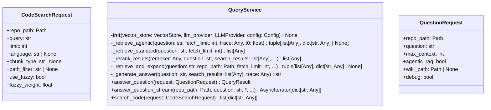

# File: `src/local_deepwiki/services/query_service.py`

## File Overview

This file implements the core query service for the local_deepwiki system, providing functionality for both question-answering using Retrieval-Augmented Generation (RAG) and code search. It encapsulates the business logic for processing user queries, retrieving relevant code chunks, reranking results, and generating responses using an LLM.

The service is designed to be used in the handler layer (`handlers/core.py`) where it receives requests and returns structured results. It abstracts away the complexity of interacting with vector stores, LLM providers, and graph expansion logic, making it suitable for integration into a web API or CLI interface.

## Key Concepts

### Retrieval-Augmented Generation (RAG) Pipeline
The service implements a full RAG pipeline that supports both standard and agentic retrieval modes:
- **Standard Retrieval**: Uses pre-processed queries (condensed and expanded) to perform vector search.
- **Agentic Retrieval**: Leverages the [`agentic_retrieve`](../core/agentic_rag.md) function to dynamically rewrite the query and perform iterative retrieval, enhancing the quality of retrieved context.

### Reranking
The system supports optional reranking using a configured reranker model to improve the relevance of search results before they are passed to the LLM. If no reranker is available, results are truncated to the requested maximum context.

### Streaming Responses
The `answer_question_stream` method provides a streaming interface for answering questions, which is useful for UIs that want to display results incrementally. It yields source information first, then tokenized LLM output, allowing for real-time updates.

### Graph Expansion
Code search and RAG retrieval can optionally include graph expansion, which enriches the initial search results by including related entities from a knowledge graph. This is implemented via the [`expand_with_graph`](graph_expansion.md) function.

### Context Building and Prompt Construction
Helper functions like `_build_context` and `_build_prompt_with_history` are responsible for formatting retrieved chunks into strings suitable for LLM input, and incorporating conversation history for follow-up questions.

## Integration

This file integrates with several key components in the local_deepwiki system:

- **[Vector Store](../core/vectorstore/store.md)**: Interacts with [`VectorStore`](../core/vectorstore/store.md) instances for performing searches and retrieving code chunks.
- **[LLM Provider](../providers/base.md)**: Uses [`LLMProvider`](../providers/base.md) to generate answers from the LLM.
- **[Rate Limiter](../core/vectorstore/utils.md)**: Applies rate limiting via `get_rate_limiter()` to prevent excessive LLM calls.
- **[Reranker](../core/reranker.md)**: Integrates with the [`get_reranker`](../core/reranker.md) function to optionally apply reranking.
- **Tracing**: Uses [`RAGTrace`](../core/tracing.md) for debugging and performance monitoring when the `debug` flag is enabled.
- **Graph Expansion**: Leverages [`expand_with_graph`](graph_expansion.md) for enriching search results.
- **Configuration**: Accesses configuration via [`Config`](../config/models.md) to determine reranker models, wiki paths, and other settings.

The `QueryService` class is used by:
- `handlers/core.py` for handling API requests ([`handle_ask_question`](../handlers/core.md), [`handle_search_code`](../handlers/core.md))
- Tests such as `test_graph_rag_query_integration`

It is also imported by:
- `handlers/core.py` (for the actual handler logic)
- `services/graph_expansion.py` (for graph expansion functionality)

## Design Notes

### Agentic vs Standard Retrieval
The system supports both modes of retrieval to balance performance and accuracy. Agentic retrieval is more computationally expensive but can yield better results for complex questions. The decision to enable agentic mode is made at the request level (`QuestionRequest.agentic_rag`).

### Reranking Strategy
When a reranker is configured, it's applied to the full set of results before truncation. If no reranker is available, the system simply truncates the results to `max_context`. This allows the system to scale gracefully without requiring reranking capabilities.

### Streaming vs Full Response
The service provides two main interfaces:
- `answer_question`: Returns a complete answer in one go.
- `answer_question_stream`: Yields tokens as they are generated, enabling real-time UI updates.

The streaming interface does not support agentic retrieval or reranking due to its simplicity and performance considerations.

### Error Handling
Error messages are sanitized using [`sanitize_error_message`](../error_factories.md) before being returned in streams to prevent leaking internal details.

### Context Formatting
The `_build_context` function formats search results into a readable string for LLM consumption, including file paths, line numbers, and code content. This ensures that the LLM has sufficient context to answer questions accurately.

### Source Entry Building
Functions like `_build_source_entries` and `_format_sources_for_stream` ensure that source references are properly formatted for both full responses and streaming outputs, including optional wiki links where applicable.

### History Handling
The `_build_prompt_with_history` function handles conversation history for follow-up questions, including only the last few exchanges to keep prompts concise while maintaining contextual relevance.

### Rate Limiting
All LLM generation calls are wrapped in a rate limiter to manage API usage and prevent overloading external services. This is crucial for maintaining system stability when using cloud LLMs.

## API Reference

### class `QuestionRequest`

Immutable parameters for the RAG question-answering pipeline.


<details>
<summary>View Source (lines 28-36) | <a href="https://github.com/UrbanDiver/local-deepwiki-mcp/blob/main/src/local_deepwiki/services/query_service.py#L28-L36">GitHub</a></summary>

```python
class QuestionRequest:
    """Immutable parameters for the RAG question-answering pipeline."""

    repo_path: Path
    question: str
    max_context: int = 10
    agentic_rag: bool = False
    wiki_path: Path | None = None
    debug: bool = False
```

</details>

### class `CodeSearchRequest`

Immutable parameters for code search.


<details>
<summary>View Source (lines 40-50) | <a href="https://github.com/UrbanDiver/local-deepwiki-mcp/blob/main/src/local_deepwiki/services/query_service.py#L40-L50">GitHub</a></summary>

```python
class CodeSearchRequest:
    """Immutable parameters for code search."""

    repo_path: Path
    query: str
    limit: int = 20
    language: str | None = None
    chunk_type: str | None = None
    path_filter: str | None = None
    use_fuzzy: bool = False
    fuzzy_weight: float = 0.3
```

</details>

### class `QueryService`

Encapsulates the RAG query pipeline and code search.  Uses dependency injection for [VectorStore](../core/vectorstore/store.md), [LLMProvider](../providers/base.md), and [Config](../config/models.md) rather than constructing them internally, making the service testable and explicit about its dependencies.

**Methods:**


<details>
<summary>View Source (lines 53-372) | <a href="https://github.com/UrbanDiver/local-deepwiki-mcp/blob/main/src/local_deepwiki/services/query_service.py#L53-L372">GitHub</a></summary>

```python
class QueryService:
    # Methods: __init__, _retrieve_agentic, _retrieve_standard, _rerank_results, _retrieve_and_expand, _generate_answer, answer_question, answer_question_stream, search_code
```

</details>

#### `__init__`

```python
def __init__(vector_store: VectorStore, llm_provider: LLMProvider, config: Config) -> None
```


| Parameter | Type | Default | Description |
|-----------|------|---------|-------------|
| `vector_store` | `VectorStore` | - | - |
| `llm_provider` | `LLMProvider` | - | - |
| `config` | `Config` | - | - |


<details>
<summary>View Source (lines 63-71) | <a href="https://github.com/UrbanDiver/local-deepwiki-mcp/blob/main/src/local_deepwiki/services/query_service.py#L63-L71">GitHub</a></summary>

```python
def __init__(
        self,
        vector_store: VectorStore,
        llm_provider: LLMProvider,
        config: Config,
    ) -> None:
        self._vector_store = vector_store
        self._llm_provider = llm_provider
        self._config = config
```

</details>

#### `answer_question`

```python
async def answer_question(request: QuestionRequest) -> QueryResult
```

Execute the full RAG pipeline: search -> [rerank] -> synthesize.


| Parameter | Type | Default | Description |
|-----------|------|---------|-------------|
| `request` | `QuestionRequest` | - | Immutable request containing repo path, question, max context, agentic RAG toggle, wiki path, and debug flag. |


<details>
<summary>View Source (lines 194-248) | <a href="https://github.com/UrbanDiver/local-deepwiki-mcp/blob/main/src/local_deepwiki/services/query_service.py#L194-L248">GitHub</a></summary>

```python
async def answer_question(
        self,
        request: QuestionRequest,
    ) -> QueryResult:
        """Execute the full RAG pipeline: search -> [rerank] -> synthesize.

        Args:
            request: Immutable request containing repo path, question,
                max context, agentic RAG toggle, wiki path, and debug flag.

        Returns:
            QueryResult with the synthesized answer and source references.
        """
        from local_deepwiki.core.reranker import get_reranker
        from local_deepwiki.core.tracing import RAGTrace

        trace = RAGTrace(query=request.question) if request.debug else None

        reranker = get_reranker(self._config.search.reranker_model)
        fetch_limit = request.max_context * 2 if reranker else request.max_context

        t0 = time.monotonic()
        search_results, agentic_metadata = await self._retrieve_and_expand(
            request.question,
            request.repo_path,
            fetch_limit,
            request.agentic_rag,
            trace,
            t0,
        )

        if not search_results:
            return QueryResult(
                answer="No relevant code found for your question.",
                sources=(),
                trace=trace.to_dict() if trace else None,
            )

        search_results = await self._rerank_results(
            reranker, request.question, search_results, request.max_context, trace
        )

        answer = await self._generate_answer(request.question, search_results, trace)

        effective_wiki_path = request.wiki_path or self._config.get_wiki_path(
            request.repo_path
        )
        sources = _build_source_entries(search_results, effective_wiki_path)

        return QueryResult(
            answer=answer,
            sources=sources,
            agentic_metadata=agentic_metadata,
            trace=trace.to_dict() if trace else None,
        )
```

</details>

#### `answer_question_stream`

```python
async def answer_question_stream(repo_path: Path, question: str, max_context: int = 15, history: list[dict[str, str]] | None = None) -> AsyncIterator[dict[str, Any]]
```

Stream RAG results: sources -> tokens -> done.  Yields dicts suitable for SSE serialization: {"type": "sources", "sources": [...]} {"type": "token", "content": "..."}  (one per LLM chunk) {"type": "done"} {"type": "error", "message": "..."}  (on failure)


| Parameter | Type | Default | Description |
|-----------|------|---------|-------------|
| `repo_path` | `Path` | - | Resolved path to the indexed repository. |
| `question` | `str` | - | The user's natural-language question. |
| `max_context` | `int` | `15` | Maximum code chunks for context. |
| `history` | `list[dict[str, str]] | None` | `None` | Optional conversation history for follow-up questions. |


<details>
<summary>View Source (lines 250-315) | <a href="https://github.com/UrbanDiver/local-deepwiki-mcp/blob/main/src/local_deepwiki/services/query_service.py#L250-L315">GitHub</a></summary>

```python
async def answer_question_stream(
        self,
        repo_path: Path,
        question: str,
        *,
        max_context: int = 15,
        history: list[dict[str, str]] | None = None,
    ) -> AsyncIterator[dict[str, Any]]:
        """Stream RAG results: sources -> tokens -> done.

        Yields dicts suitable for SSE serialization:
            {"type": "sources", "sources": [...]}
            {"type": "token", "content": "..."}  (one per LLM chunk)
            {"type": "done"}
            {"type": "error", "message": "..."}  (on failure)

        Args:
            repo_path: Resolved path to the indexed repository.
            question: The user's natural-language question.
            max_context: Maximum code chunks for context.
            history: Optional conversation history for follow-up questions.
        """
        # --- Retrieval ---
        search_results = await self._vector_store.search(
            question, limit=max_context, search_mode="hybrid"
        )

        # Yield sources first (even if empty)
        sources = _format_sources_for_stream(search_results)
        yield {"type": "sources", "sources": sources}

        if not search_results:
            yield {
                "type": "token",
                "content": "No relevant code found for your question.",
            }
            yield {"type": "done"}
            return

        # --- Context construction ---
        context = _build_context(search_results)

        # --- Prompt construction (with optional history) ---
        prompt = _build_prompt_with_history(question, history or [], context)
        system_prompt = (
            "You are a knowledgeable assistant for this codebase. "
            "Answer questions as if you have read the entire repository. "
            "Never say 'the provided code' or 'the code context' — "
            "speak as if you naturally know the codebase. "
            "Reference specific files and line numbers when relevant."
        )

        # --- LLM streaming ---
        try:
            async for text_chunk in self._llm_provider.generate_stream(
                prompt, system_prompt=system_prompt, temperature=0.3
            ):
                yield {"type": "token", "content": text_chunk}
        except Exception as e:  # noqa: BLE001 - Report LLM errors to user via stream
            logger.exception("Error during streaming generation: %s", e)
            yield {
                "type": "error",
                "message": sanitize_error_message(str(e)),
            }

        yield {"type": "done"}
```

</details>

#### `search_code`

```python
async def search_code(request: CodeSearchRequest) -> list[dict[str, Any]]
```

Search code with optional filters.


| Parameter | Type | Default | Description |
|-----------|------|---------|-------------|
| `request` | `CodeSearchRequest` | - | Immutable request containing repo path, query, limit, language, chunk type, path filter, fuzzy settings. |


<details>
<summary>View Source (lines 317-372) | <a href="https://github.com/UrbanDiver/local-deepwiki-mcp/blob/main/src/local_deepwiki/services/query_service.py#L317-L372">GitHub</a></summary>

```python
async def search_code(
        self,
        request: CodeSearchRequest,
    ) -> list[dict[str, Any]]:
        """Search code with optional filters.

        Args:
            request: Immutable request containing repo path, query,
                limit, language, chunk type, path filter, fuzzy settings.

        Returns:
            List of result dicts with file_path, name, type, language,
            lines, score, preview, docstring, and optional highlights.
        """
        results = await self._vector_store.search(
            request.query,
            limit=request.limit,
            language=request.language,
            chunk_type=request.chunk_type,
            path_pattern=request.path_filter,
            use_fuzzy=request.use_fuzzy,
            fuzzy_weight=request.fuzzy_weight,
        )

        # --- Graph expansion (optional) ---
        from local_deepwiki.services.graph_expansion import expand_with_graph

        results = await expand_with_graph(
            results, self._vector_store, self._config, request.repo_path
        )

        if not results:
            return []

        output: list[dict[str, Any]] = []
        for r in results:
            chunk = r.chunk
            entry: dict[str, Any] = {
                "file_path": chunk.file_path,
                "name": chunk.name,
                "type": chunk.chunk_type.value,
                "language": chunk.language.value,
                "lines": f"{chunk.start_line}-{chunk.end_line}",
                "score": round(r.score, 4),
                "preview": (
                    chunk.content[:300] + "..."
                    if len(chunk.content) > 300
                    else chunk.content
                ),
                "docstring": chunk.docstring,
            }
            if r.highlights:
                entry["highlights"] = r.highlights
            output.append(entry)

        return output
```

</details>

## Class Diagram



## Call Graph

```mermaid
flowchart TD
    N0[QueryService._generate_answer]
    N1[QueryService._rerank_results]
    N2[QueryService._retrieve_agentic]
    N3[QueryService._retrieve_and_...]
    N4[QueryService._retrieve_stan...]
    N5[QueryService.answer_question]
    N6[QueryService.answer_questio...]
    N7[QueryService.search_code]
    N8[RAGTrace]
    N9[SourceEntry]
    N10[_build_context]
    N11[_build_source_entries]
    N12[_retrieve_agentic]
    N13[_retrieve_standard]
    N14[agentic_retrieve]
    N15[build_wiki_resource_uri]
    N16[condense_query]
    N17[exists]
    N18[expand_project_terms]
    N19[expand_with_graph]
    N20[generate]
    N21[get_rate_limiter]
    N22[get_reranker]
    N23[monotonic]
    N24[record_context]
    N25[record_llm]
    N26[record_reranking]
    N27[record_retrieval]
    N28[rerank]
    N29[search]
    N11 --> N17
    N11 --> N15
    N11 --> N9
    N2 --> N14
    N2 --> N23
    N4 --> N16
    N4 --> N18
    N4 --> N29
    N1 --> N23
    N1 --> N28
    N1 --> N26
    N3 --> N12
    N3 --> N13
    N3 --> N19
    N3 --> N27
    N3 --> N23
    N0 --> N10
    N0 --> N24
    N0 --> N23
    N0 --> N21
    N0 --> N20
    N0 --> N25
    N5 --> N8
    N5 --> N22
    N5 --> N23
    N5 --> N11
    N6 --> N29
    N6 --> N10
    N7 --> N29
    N7 --> N19
    classDef func fill:#e1f5fe
    class N8,N9,N10,N11,N12,N13,N14,N15,N16,N17,N18,N19,N20,N21,N22,N23,N24,N25,N26,N27,N28,N29 func
    classDef method fill:#fff3e0
    class N0,N1,N2,N3,N4,N5,N6,N7 method
```



## Used By

Functions and methods in this file and their callers:

- **[`QueryResult`](models.md)**: called by `QueryService.answer_question`
- **[`RAGTrace`](../core/tracing.md)**: called by `QueryService.answer_question`
- **[`SourceEntry`](models.md)**: called by `_build_source_entries`
- **`_build_context`**: called by `QueryService._generate_answer`, `QueryService.answer_question_stream`
- **`_build_prompt_with_history`**: called by `QueryService.answer_question_stream`
- **`_build_source_entries`**: called by `QueryService.answer_question`
- **`_format_sources_for_stream`**: called by `QueryService.answer_question_stream`
- **`_generate_answer`**: called by `QueryService.answer_question`
- **`_rerank_results`**: called by `QueryService.answer_question`
- **`_retrieve_agentic`**: called by `QueryService._retrieve_and_expand`
- **`_retrieve_and_expand`**: called by `QueryService.answer_question`
- **`_retrieve_standard`**: called by `QueryService._retrieve_and_expand`
- **[`agentic_retrieve`](../core/agentic_rag.md)**: called by `QueryService._retrieve_agentic`
- **[`build_wiki_resource_uri`](../handlers/_response.md)**: called by `_build_source_entries`
- **[`condense_query`](../core/query_utils.md)**: called by `QueryService._retrieve_standard`
- **`exception`**: called by `QueryService.answer_question_stream`
- **`exists`**: called by `_build_source_entries`
- **[`expand_project_terms`](../core/query_utils.md)**: called by `QueryService._retrieve_standard`
- **[`expand_with_graph`](graph_expansion.md)**: called by `QueryService._retrieve_and_expand`, `QueryService.search_code`
- **`generate`**: called by `QueryService._generate_answer`
- **`generate_stream`**: called by `QueryService.answer_question_stream`
- **[`get_rate_limiter`](../core/rate_limiter.md)**: called by `QueryService._generate_answer`
- **[`get_reranker`](../core/reranker.md)**: called by `QueryService.answer_question`
- **[`get_wiki_path`](../web/utils.md)**: called by `QueryService.answer_question`
- **`monotonic`**: called by `QueryService._generate_answer`, `QueryService._rerank_results`, `QueryService._retrieve_agentic`, `QueryService._retrieve_and_expand`, `QueryService.answer_question`
- **`record_context`**: called by `QueryService._generate_answer`
- **`record_llm`**: called by `QueryService._generate_answer`
- **`record_reranking`**: called by `QueryService._rerank_results`
- **`record_retrieval`**: called by `QueryService._retrieve_and_expand`
- **`rerank`**: called by `QueryService._rerank_results`
- **[`sanitize_error_message`](../error_factories.md)**: called by `QueryService.answer_question_stream`
- **`search`**: called by `QueryService._retrieve_standard`, `QueryService.answer_question_stream`, `QueryService.search_code`
- **`to_dict`**: called by `QueryService.answer_question`

## Usage Examples

*Examples extracted from test files*

### Example: `QuestionRequest`

From `test_query_service.py::TestAnswerQuestion::test_no_results_returns_empty_sources`:

```python
QuestionRequest(repo_path=tmp_path, question="Nonexistent?")
)

assert isinstance(result, QueryResult)
assert "No relevant code found" in result.answer
```

### Example: `QueryService`

From `test_query_service.py::TestAnswerQuestion::test_no_results_returns_empty_sources`:

```python
svc = QueryService(vector_store, llm_provider, config)
result = await svc.answer_question(
    QuestionRequest(repo_path=tmp_path, question="Nonexistent?")
)

assert isinstance(result, QueryResult)
assert "No relevant code found" in result.answer
```

### Example: `answer_question`

From `test_query_service.py::TestAnswerQuestion::test_no_results_returns_empty_sources`:

```python
result = await svc.answer_question(
    QuestionRequest(repo_path=tmp_path, question="Nonexistent?")
)

assert isinstance(result, QueryResult)
assert "No relevant code found" in result.answer
```

### Example: `CodeSearchRequest`

From `test_query_service.py::TestSearchCode::test_returns_formatted_results`:

```python
CodeSearchRequest(repo_path=tmp_path, query="parse")
)

assert len(results) == 1
assert results[0]["file_path"] == "lib/utils.py"
```

### Example: `QueryService`

From `test_query_service.py::TestSearchCode::test_returns_formatted_results`:

```python
svc = QueryService(vector_store, llm_provider, config)
results = await svc.search_code(
    CodeSearchRequest(repo_path=tmp_path, query="parse")
)

assert len(results) == 1
assert results[0]["file_path"] == "lib/utils.py"
```


## Last Modified

| Entity | Type | Author | Date | Commit |
|--------|------|--------|------|--------|
| `QueryService` | class | Brian Breidenbach | today | `b731205` fix: use hybrid search in c... |
| `answer_question_stream` | method | Brian Breidenbach | today | `b731205` fix: use hybrid search in c... |
| `QuestionRequest` | class | Brian Breidenbach | yesterday | `1eef062` refactor: complete Grade A ... |
| `CodeSearchRequest` | class | Brian Breidenbach | yesterday | `1eef062` refactor: complete Grade A ... |
| `answer_question` | method | Brian Breidenbach | yesterday | `1eef062` refactor: complete Grade A ... |
| `search_code` | method | Brian Breidenbach | yesterday | `1eef062` refactor: complete Grade A ... |
| `_retrieve_and_expand` | method | Brian Breidenbach | yesterday | `29ae780` refactor: decompose long me... |
| `_generate_answer` | method | Brian Breidenbach | yesterday | `29ae780` refactor: decompose long me... |
| `_retrieve_agentic` | method | Brian Breidenbach | 2 days ago | `a3c09df` refactor: decompose CC > 15... |
| `_retrieve_standard` | method | Brian Breidenbach | 2 days ago | `a3c09df` refactor: decompose CC > 15... |
| `_rerank_results` | method | Brian Breidenbach | 2 days ago | `a3c09df` refactor: decompose CC > 15... |
| `_format_sources_for_stream` | function | Brian Breidenbach | 2 weeks ago | `bb3fc9a` refactor: route web chat th... |
| `_build_prompt_with_history` | function | Brian Breidenbach | 2 weeks ago | `bb3fc9a` refactor: route web chat th... |
| `__init__` | method | Brian Breidenbach | 2 weeks ago | `8203fe8` feat: add service layer, hy... |
| `_build_context` | function | Brian Breidenbach | 2 weeks ago | `8203fe8` feat: add service layer, hy... |
| `_build_source_entries` | function | Brian Breidenbach | 2 weeks ago | `8203fe8` feat: add service layer, hy... |

## Additional Source Code

Source code for functions and methods not listed in the API Reference above.

#### `_retrieve_agentic`

<details>
<summary>View Source (lines 73-96) | <a href="https://github.com/UrbanDiver/local-deepwiki-mcp/blob/main/src/local_deepwiki/services/query_service.py#L73-L96">GitHub</a></summary>

```python
async def _retrieve_agentic(
        self,
        question: str,
        fetch_limit: int,
        trace: Any,
        t0: float,
    ) -> tuple[list[Any], dict[str, Any] | None]:
        """Run agentic RAG retrieval; return (search_results, agentic_metadata)."""
        from local_deepwiki.core.agentic_rag import agentic_retrieve

        rag_result = await agentic_retrieve(
            question,
            self._vector_store,
            self._llm_provider,
            max_context=fetch_limit,
        )
        if trace:
            trace.agentic_rag_enabled = True
            trace.agentic_time_ms = (time.monotonic() - t0) * 1000
            if rag_result.metadata and rag_result.metadata.get("rewritten"):
                trace.agentic_rewritten_query = rag_result.metadata.get(
                    "rewritten_query"
                )
        return rag_result.results, rag_result.metadata
```

</details>


#### `_retrieve_standard`

<details>
<summary>View Source (lines 98-109) | <a href="https://github.com/UrbanDiver/local-deepwiki-mcp/blob/main/src/local_deepwiki/services/query_service.py#L98-L109">GitHub</a></summary>

```python
async def _retrieve_standard(self, question: str, fetch_limit: int) -> list[Any]:
        """Run standard (query-preprocessed) vector search retrieval."""
        from local_deepwiki.core.query_utils import condense_query, expand_project_terms

        search_query = condense_query(question)
        search_query = expand_project_terms(search_query)
        return await self._vector_store.search(
            search_query,
            limit=fetch_limit,
            use_fuzzy=True,
            fuzzy_weight=0.3,
        )
```

</details>


#### `_rerank_results`

<details>
<summary>View Source (lines 111-129) | <a href="https://github.com/UrbanDiver/local-deepwiki-mcp/blob/main/src/local_deepwiki/services/query_service.py#L111-L129">GitHub</a></summary>

```python
async def _rerank_results(
        self,
        reranker: Any,
        question: str,
        search_results: list[Any],
        max_context: int,
        trace: Any,
    ) -> list[Any]:
        """Apply reranking if a reranker is available; otherwise truncate."""
        if reranker and search_results:
            t1 = time.monotonic()
            reranked = await reranker.rerank(
                question, search_results, top_k=max_context
            )
            if trace:
                rerank_ms = (time.monotonic() - t1) * 1000
                trace.record_reranking(reranked, rerank_ms, reranker.model_name)
            return reranked
        return search_results[:max_context]
```

</details>


#### `_retrieve_and_expand`

<details>
<summary>View Source (lines 131-159) | <a href="https://github.com/UrbanDiver/local-deepwiki-mcp/blob/main/src/local_deepwiki/services/query_service.py#L131-L159">GitHub</a></summary>

```python
async def _retrieve_and_expand(
        self,
        question: str,
        repo_path: Path,
        fetch_limit: int,
        agentic_rag: bool,
        trace: Any,
        t0: float,
    ) -> tuple[list[Any], dict[str, Any] | None]:
        """Run retrieval (standard or agentic) then graph expansion.

        Returns (search_results, agentic_metadata).
        """
        from local_deepwiki.services.graph_expansion import expand_with_graph

        agentic_metadata: dict[str, Any] | None = None
        if agentic_rag:
            search_results, agentic_metadata = await self._retrieve_agentic(
                question, fetch_limit, trace, t0
            )
        else:
            search_results = await self._retrieve_standard(question, fetch_limit)

        search_results = await expand_with_graph(
            search_results, self._vector_store, self._config, repo_path
        )
        if trace:
            trace.record_retrieval(search_results, (time.monotonic() - t0) * 1000)
        return search_results, agentic_metadata
```

</details>


#### `_generate_answer`

<details>
<summary>View Source (lines 161-192) | <a href="https://github.com/UrbanDiver/local-deepwiki-mcp/blob/main/src/local_deepwiki/services/query_service.py#L161-L192">GitHub</a></summary>

```python
async def _generate_answer(
        self,
        question: str,
        search_results: list[Any],
        trace: Any,
    ) -> str:
        """Build context, construct prompt, and call the LLM."""
        context = _build_context(search_results)
        if trace:
            trace.record_context(len(search_results), len(context))

        prompt = (
            f"Question: {question}\n\n"
            f"Relevant source code:\n{context}\n\n"
            "Answer the question clearly and accurately. "
            "Reference specific files and line numbers when possible."
        )
        system_prompt = (
            "You are a knowledgeable assistant for this codebase. "
            "Answer questions as if you have read the entire repository. "
            "Never say 'the provided code' or 'the code context' — "
            "speak as if you naturally know the codebase."
        )
        t2 = time.monotonic()
        rate_limiter = get_rate_limiter()
        async with rate_limiter:
            answer = await self._llm_provider.generate(
                prompt, system_prompt=system_prompt
            )
        if trace:
            trace.record_llm((time.monotonic() - t2) * 1000)
        return answer
```

</details>


#### `_build_context`

<details>
<summary>View Source (lines 375-385) | <a href="https://github.com/UrbanDiver/local-deepwiki-mcp/blob/main/src/local_deepwiki/services/query_service.py#L375-L385">GitHub</a></summary>

```python
def _build_context(search_results: list[Any]) -> str:
    """Build LLM context string from search results."""
    parts: list[str] = []
    for search_result in search_results:
        chunk = search_result.chunk
        parts.append(
            f"File: {chunk.file_path} (lines {chunk.start_line}-{chunk.end_line})\n"
            f"Type: {chunk.chunk_type.value}\n"
            f"```\n{chunk.content}\n```"
        )
    return "\n\n---\n\n".join(parts)
```

</details>


#### `_build_source_entries`

<details>
<summary>View Source (lines 388-411) | <a href="https://github.com/UrbanDiver/local-deepwiki-mcp/blob/main/src/local_deepwiki/services/query_service.py#L388-L411">GitHub</a></summary>

```python
def _build_source_entries(
    search_results: list[Any],
    wiki_path: Path,
) -> tuple[SourceEntry, ...]:
    """Build immutable SourceEntry tuple from search results."""
    from local_deepwiki.handlers._response import build_wiki_resource_uri

    entries: list[SourceEntry] = []
    for r in search_results:
        wiki_resource: str | None = None
        file_wiki_page = f"files/{r.chunk.file_path}.md"
        if (wiki_path / file_wiki_page).exists():
            wiki_resource = build_wiki_resource_uri(wiki_path, file_wiki_page)

        entries.append(
            SourceEntry(
                file=r.chunk.file_path,
                lines=f"{r.chunk.start_line}-{r.chunk.end_line}",
                chunk_type=r.chunk.chunk_type.value,
                score=r.score,
                wiki_resource=wiki_resource,
            )
        )
    return tuple(entries)
```

</details>


#### `_format_sources_for_stream`

<details>
<summary>View Source (lines 414-432) | <a href="https://github.com/UrbanDiver/local-deepwiki-mcp/blob/main/src/local_deepwiki/services/query_service.py#L414-L432">GitHub</a></summary>

```python
def _format_sources_for_stream(search_results: list[Any]) -> list[dict[str, Any]]:
    """Format search results as source citations for streaming.

    Returns a JSON-serializable list (not frozen dataclasses) suitable
    for direct inclusion in SSE payloads.
    """
    sources: list[dict[str, Any]] = []
    for r in search_results:
        chunk = r.chunk
        sources.append(
            {
                "file": chunk.file_path,
                "lines": f"{chunk.start_line}-{chunk.end_line}",
                "type": chunk.chunk_type.value,
                "name": chunk.name,
                "score": round(r.score, 3),
            }
        )
    return sources
```

</details>


#### `_build_prompt_with_history`

<details>
<summary>View Source (lines 435-468) | <a href="https://github.com/UrbanDiver/local-deepwiki-mcp/blob/main/src/local_deepwiki/services/query_service.py#L435-L468">GitHub</a></summary>

```python
def _build_prompt_with_history(
    question: str, history: list[dict[str, str]], context: str
) -> str:
    """Build a prompt that includes conversation history for follow-up questions.

    Args:
        question: The current question.
        history: Previous Q&A exchanges.
        context: Code context from search results.

    Returns:
        A prompt string with history and context.
    """
    history_text = ""
    # Include last 3 exchanges for context
    for exchange in history[-3:]:
        history_text += f"User: {exchange.get('question', '')}\n"
        history_text += f"Assistant: {exchange.get('answer', '')}\n\n"

    if history_text:
        return (
            f"Previous conversation:\n{history_text}\n"
            f"Current question: {question}\n\n"
            f"Relevant source code:\n{context}\n\n"
            "Answer the current question, taking into account the "
            "conversation history if relevant.\n"
            "Reference specific files and line numbers when possible."
        )
    return (
        f"Question: {question}\n\n"
        f"Relevant source code:\n{context}\n\n"
        "Answer the question clearly and accurately.\n"
        "Reference specific files and line numbers when possible."
    )
```

</details>

## Relevant Source Files

- `src/local_deepwiki/services/query_service.py:28-36`
