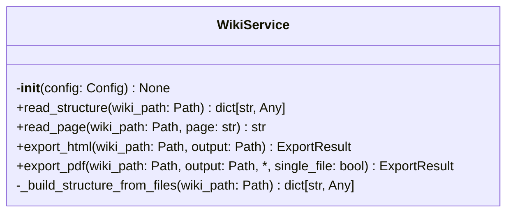

# File: `src/local_deepwiki/services/wiki_service.py`

## File Overview

This file defines the `WikiService` class, which provides core functionality for reading wiki structures and pages, as well as exporting wikis to HTML and PDF formats. It serves as a central service for handling wiki data operations in the local_deepwiki application.

The service is designed to be used by CLI handlers and other components that require access to wiki content or export capabilities. It abstracts away low-level file system operations, validation logic, and export mechanisms, providing a clean interface for these tasks.

## Key Concepts

### Wiki Structure Reading
The `read_structure` method implements a flexible approach to retrieving wiki table of contents:
- It first attempts to load a precomputed `toc.json` if present.
- If not found, it falls back to dynamically scanning markdown files to build the structure.
- For wikis without a static structure, it supports lazy generation via entity registries, enabling efficient handling of large wikis.

### Page Content Reading
The `read_page` method ensures safe access to individual wiki pages:
- It validates that the requested page is within the wiki directory.
- It enforces a maximum page size limit (`MAX_WIKI_PAGE_SIZE`) to prevent memory issues.
- It supports lazy loading of pages via entity registries when the page does not exist on disk.

### Export Capabilities
The `export_html` and `export_pdf` methods provide two primary export formats:
- Both methods utilize [`WikiPageIterator`](../export/streaming.md) to determine the number of pages in the wiki.
- They delegate actual export logic to dedicated modules ([`export_to_html`](../export/html.md), [`export_to_pdf`](../export/pdf_sync.md)).
- The `single_file` parameter in `export_pdf` allows for combined PDF output.

### Lazy Generation Support
This service integrates with `lazy_generator` to support lazy loading of wiki content. This is especially useful for large wikis where full indexing might be expensive or unnecessary.

## Integration

This module integrates deeply with the following parts of the codebase:

- **CLI Layer**: Methods like `read_structure` and `read_page` are used by CLI handlers such as those in `check_cli.py`, `main.py`, and `status_cli.py`.
- **Export Modules**: The service imports and uses modules from `local_deepwiki.export` to perform HTML and PDF exports.
- **Core Utilities**: It relies on [`path_utils.validate_sub_path`](../core/path_utils.md), [`Config`](../config/models.md), and error handling utilities from `local_deepwiki.errors`.
- **Validation Layer**: It uses `MAX_WIKI_PAGE_SIZE` from `local_deepwiki.validation` to enforce content size limits.
- **Logging**: Uses [`get_logger`](../logging.md) from `local_deepwiki.logging` for logging diagnostic messages.

## Design Notes

### Asynchronous Handling
All methods are defined as `async` to allow non-blocking I/O operations, particularly for file reading and export tasks. This is essential for performance in applications that may process many files or perform network operations during export.

### Fallback Logic for Structure
The fallback logic in `read_structure` allows the system to gracefully handle wikis that don't have a precomputed `toc.json`. This design choice supports both static and dynamic wiki structures without requiring a specific configuration.

### Lazy Loading
The use of [`get_lazy_generator`](../generators/lazy_generator.md) enables efficient handling of large wikis by deferring computation until needed. This pattern is critical for scalability and avoids loading unnecessary data upfront.

### Error Handling
- [`path_not_found_error`](../error_factories.md) is raised when paths are invalid or missing, ensuring consistent error reporting.
- [`ValidationError`](../errors.md) is used to enforce page size limits, providing clear feedback to users about content constraints.
- The service handles exceptions during JSON parsing and file reading, logging warnings but continuing to attempt fallbacks where possible.

### Page Title Extraction
In `_build_structure_from_files`, the title of each markdown file is derived from the first line if it starts with a `#`. If not, the relative file path is used. This fallback ensures that all pages are represented in the structure, even if the title is not explicitly defined.

## API Reference

### class `WikiService`

Encapsulates wiki reading and export operations.  Depends only on [Config](../config/models.md); does not interact with LLM or vector store.

**Methods:**


<details>
<summary>View Source (lines 26-227) | <a href="https://github.com/UrbanDiver/local-deepwiki-mcp/blob/main/src/local_deepwiki/services/wiki_service.py#L26-L227">GitHub</a></summary>

```python
class WikiService:
    # Methods: __init__, read_structure, read_page, export_html, export_pdf, _build_structure_from_files
```

</details>

#### `__init__`

```python
def __init__(config: Config) -> None
```


| Parameter | Type | Default | Description |
|-----------|------|---------|-------------|
| `config` | `Config` | - | - |


<details>
<summary>View Source (lines 34-35) | <a href="https://github.com/UrbanDiver/local-deepwiki-mcp/blob/main/src/local_deepwiki/services/wiki_service.py#L34-L35">GitHub</a></summary>

```python
def __init__(self, config: Config) -> None:
        self._config = config
```

</details>

#### `read_structure`

```python
async def read_structure(wiki_path: Path) -> dict[str, Any]
```

Read wiki table of contents and structure.  Checks for toc.json first, then falls back to dynamic generation by scanning markdown files. Supports lazy generation via entity registry.


| Parameter | Type | Default | Description |
|-----------|------|---------|-------------|
| `wiki_path` | `Path` | - | Resolved path to the wiki directory. |


<details>
<summary>View Source (lines 37-75) | <a href="https://github.com/UrbanDiver/local-deepwiki-mcp/blob/main/src/local_deepwiki/services/wiki_service.py#L37-L75">GitHub</a></summary>

```python
async def read_structure(self, wiki_path: Path) -> dict[str, Any]:
        """Read wiki table of contents and structure.

        Checks for toc.json first, then falls back to dynamic generation
        by scanning markdown files. Supports lazy generation via entity
        registry.

        Args:
            wiki_path: Resolved path to the wiki directory.

        Returns:
            Dict with 'pages' and optionally 'sections' keys.

        Raises:
            DeepWikiError: If wiki_path does not exist and has no
                entity registry for lazy generation.
        """
        if not wiki_path.exists():
            entity_reg = wiki_path / "entity_registry.json"
            index_status_file = wiki_path / "index_status.json"
            if entity_reg.exists() or index_status_file.exists():
                from local_deepwiki.generators.lazy_generator import (
                    get_lazy_generator,
                )

                generator = get_lazy_generator(wiki_path)
                return generator.get_virtual_structure()
            raise path_not_found_error(str(wiki_path), "wiki")

        toc_path = wiki_path / "toc.json"
        if toc_path.exists():
            try:
                toc_content = await asyncio.to_thread(toc_path.read_text)
                toc_data = json.loads(toc_content)
                return toc_data if isinstance(toc_data, dict) else {"pages": toc_data}
            except (json.JSONDecodeError, OSError) as e:
                logger.warning("toc.json could not be read, falling back: %s", e)

        return await self._build_structure_from_files(wiki_path)
```

</details>

#### `read_page`

```python
async def read_page(wiki_path: Path, page: str) -> str
```

Read a single wiki page's content.


| Parameter | Type | Default | Description |
|-----------|------|---------|-------------|
| `wiki_path` | `Path` | - | Resolved path to the wiki directory. |
| `page` | `str` | - | Relative path to the page within the wiki. |


<details>
<summary>View Source (lines 77-122) | <a href="https://github.com/UrbanDiver/local-deepwiki-mcp/blob/main/src/local_deepwiki/services/wiki_service.py#L77-L122">GitHub</a></summary>

```python
async def read_page(self, wiki_path: Path, page: str) -> str:
        """Read a single wiki page's content.

        Args:
            wiki_path: Resolved path to the wiki directory.
            page: Relative path to the page within the wiki.

        Returns:
            The page content as a string.

        Raises:
            DeepWikiError: If the page does not exist.
            ValidationError: If the page exceeds size limits.
        """
        page_path = validate_sub_path(
            wiki_path,
            page,
            field="page",
            hint="The page path must be within the wiki directory.",
        )

        if not page_path.exists():
            entity_reg = wiki_path / "entity_registry.json"
            index_status_file = wiki_path / "index_status.json"
            if entity_reg.exists() or index_status_file.exists():
                from local_deepwiki.generators.lazy_generator import (
                    get_lazy_generator,
                )

                generator = get_lazy_generator(wiki_path)
                page_relative = str(page_path.relative_to(wiki_path))
                return await generator.get_page(page_relative)
            raise path_not_found_error(page, "wiki page")

        file_size = page_path.stat().st_size
        if file_size > MAX_WIKI_PAGE_SIZE:
            raise ValidationError(
                message=f"Page too large: {file_size:,} bytes",
                hint=f"Maximum allowed size is {MAX_WIKI_PAGE_SIZE:,} bytes. "
                "Consider splitting the content.",
                field="page",
                value=page,
                context={"file_size": file_size, "max_size": MAX_WIKI_PAGE_SIZE},
            )

        return await asyncio.to_thread(page_path.read_text)
```

</details>

#### `export_html`

```python
async def export_html(wiki_path: Path, output: Path) -> ExportResult
```

Export wiki to static HTML.


| Parameter | Type | Default | Description |
|-----------|------|---------|-------------|
| `wiki_path` | `Path` | - | Resolved path to the wiki directory. |
| `output` | `Path` | - | Validated output directory path. |


<details>
<summary>View Source (lines 124-156) | <a href="https://github.com/UrbanDiver/local-deepwiki-mcp/blob/main/src/local_deepwiki/services/wiki_service.py#L124-L156">GitHub</a></summary>

```python
async def export_html(
        self,
        wiki_path: Path,
        output: Path,
    ) -> ExportResult:
        """Export wiki to static HTML.

        Args:
            wiki_path: Resolved path to the wiki directory.
            output: Validated output directory path.

        Returns:
            ExportResult with output path and page count.

        Raises:
            DeepWikiError: If wiki_path does not exist.
        """
        if not wiki_path.exists():
            raise path_not_found_error(str(wiki_path), "wiki")

        from local_deepwiki.export.html import export_to_html
        from local_deepwiki.export.streaming import WikiPageIterator

        iterator = WikiPageIterator(wiki_path)
        page_count = iterator.get_page_count()

        export_to_html(wiki_path, output)

        return ExportResult(
            output_path=str(output),
            pages_exported=page_count,
            format="html",
        )
```

</details>

#### `export_pdf`

```python
async def export_pdf(wiki_path: Path, output: Path, single_file: bool = True) -> ExportResult
```

Export wiki to PDF.


| Parameter | Type | Default | Description |
|-----------|------|---------|-------------|
| `wiki_path` | `Path` | - | Resolved path to the wiki directory. |
| `output` | `Path` | - | Validated output path. |
| `single_file` | `bool` | `True` | Combine all pages into a single PDF. |


<details>
<summary>View Source (lines 158-193) | <a href="https://github.com/UrbanDiver/local-deepwiki-mcp/blob/main/src/local_deepwiki/services/wiki_service.py#L158-L193">GitHub</a></summary>

```python
async def export_pdf(
        self,
        wiki_path: Path,
        output: Path,
        *,
        single_file: bool = True,
    ) -> ExportResult:
        """Export wiki to PDF.

        Args:
            wiki_path: Resolved path to the wiki directory.
            output: Validated output path.
            single_file: Combine all pages into a single PDF.

        Returns:
            ExportResult with output path and page count.

        Raises:
            DeepWikiError: If wiki_path does not exist.
        """
        if not wiki_path.exists():
            raise path_not_found_error(str(wiki_path), "wiki")

        from local_deepwiki.export.pdf import export_to_pdf
        from local_deepwiki.export.streaming import WikiPageIterator

        iterator = WikiPageIterator(wiki_path)
        page_count = iterator.get_page_count()

        export_to_pdf(wiki_path, output, single_file=single_file)

        return ExportResult(
            output_path=str(output),
            pages_exported=page_count,
            format="pdf",
        )
```

</details>

## Class Diagram



## Call Graph

```mermaid
flowchart TD
    N0[ExportResult]
    N1[Path]
    N2[ValidationError]
    N3[WikiPageIterator]
    N4[WikiService._build_structur...]
    N5[WikiService.export_html]
    N6[WikiService.export_pdf]
    N7[WikiService.read_page]
    N8[WikiService.read_structure]
    N9[_build_structure_from_files]
    N10[exists]
    N11[export_to_html]
    N12[export_to_pdf]
    N13[get_lazy_generator]
    N14[get_page]
    N15[get_page_count]
    N16[get_virtual_structure]
    N17[loads]
    N18[lstrip]
    N19[path_not_found_error]
    N20[relative_to]
    N21[rglob]
    N22[stat]
    N23[to_thread]
    N24[validate_sub_path]
    N8 --> N10
    N8 --> N13
    N8 --> N16
    N8 --> N19
    N8 --> N23
    N8 --> N17
    N8 --> N9
    N7 --> N24
    N7 --> N10
    N7 --> N13
    N7 --> N20
    N7 --> N14
    N7 --> N19
    N7 --> N22
    N7 --> N2
    N7 --> N23
    N5 --> N10
    N5 --> N19
    N5 --> N3
    N5 --> N15
    N5 --> N11
    N5 --> N0
    N6 --> N10
    N6 --> N19
    N6 --> N3
    N6 --> N15
    N6 --> N12
    N6 --> N0
    N4 --> N21
    N4 --> N20
    N4 --> N23
    N4 --> N18
    N4 --> N1
    classDef func fill:#e1f5fe
    class N0,N1,N2,N3,N9,N10,N11,N12,N13,N14,N15,N16,N17,N18,N19,N20,N21,N22,N23,N24 func
    classDef method fill:#fff3e0
    class N4,N5,N6,N7,N8 method
```



## Used By

Functions and methods in this file and their callers:

- **[`ExportResult`](models.md)**: called by `WikiService.export_html`, `WikiService.export_pdf`
- **`Path`**: called by `WikiService._build_structure_from_files`
- **[`ValidationError`](../errors.md)**: called by `WikiService.read_page`
- **[`WikiPageIterator`](../export/streaming.md)**: called by `WikiService.export_html`, `WikiService.export_pdf`
- **`_build_structure_from_files`**: called by `WikiService.read_structure`
- **`exists`**: called by `WikiService.export_html`, `WikiService.export_pdf`, `WikiService.read_page`, `WikiService.read_structure`
- **[`export_to_html`](../export/html.md)**: called by `WikiService.export_html`
- **[`export_to_pdf`](../export/pdf_sync.md)**: called by `WikiService.export_pdf`
- **[`get_lazy_generator`](../generators/lazy_generator.md)**: called by `WikiService.read_page`, `WikiService.read_structure`
- **`get_page`**: called by `WikiService.read_page`
- **`get_page_count`**: called by `WikiService.export_html`, `WikiService.export_pdf`
- **`get_virtual_structure`**: called by `WikiService.read_structure`
- **`loads`**: called by `WikiService.read_structure`
- **`lstrip`**: called by `WikiService._build_structure_from_files`
- **[`path_not_found_error`](../error_factories.md)**: called by `WikiService.export_html`, `WikiService.export_pdf`, `WikiService.read_page`, `WikiService.read_structure`
- **`relative_to`**: called by `WikiService._build_structure_from_files`, `WikiService.read_page`
- **`rglob`**: called by `WikiService._build_structure_from_files`
- **`stat`**: called by `WikiService.read_page`
- **`to_thread`**: called by `WikiService._build_structure_from_files`, `WikiService.read_page`, `WikiService.read_structure`
- **[`validate_sub_path`](../core/path_utils.md)**: called by `WikiService.read_page`

## Usage Examples

*Examples extracted from test files*

### Example: `WikiService`

From `test_wiki_service.py::TestReadStructure::test_reads_toc_json`:

```python
wiki_path = tmp_path / ".deepwiki"
        wiki_path.mkdir(parents=True)
        toc = {"pages": [{"path": "index.md", "title": "Overview"}], "sections": {}}
        (wiki_path / "toc.json").write_text(json.dumps(toc))

        svc = WikiService(_make_config(tmp_path))
        result = await svc.read_structure(wiki_path)

        assert result["pages"][0]["path"] == "index.md"
```

### Example: `read_structure`

From `test_wiki_service.py::TestReadStructure::test_reads_toc_json`:

```python
wiki_path = tmp_path / ".deepwiki"
        wiki_path.mkdir(parents=True)
        toc = {"pages": [{"path": "index.md", "title": "Overview"}], "sections": {}}
        (wiki_path / "toc.json").write_text(json.dumps(toc))

        svc = WikiService(_make_config(tmp_path))
        result = await svc.read_structure(wiki_path)

        assert result["pages"][0]["path"] == "index.md"
```

### Example: `WikiService`

From `test_wiki_service.py::TestReadStructure::test_toc_json_as_list`:

```python
svc = WikiService(_make_config(tmp_path))
result = await svc.read_structure(wiki_path)

assert "pages" in result
assert result["pages"][0]["path"] == "a.md"
```

### Example: `read_structure`

From `test_wiki_service.py::TestReadStructure::test_toc_json_as_list`:

```python
wiki_path = tmp_path / ".deepwiki"
        wiki_path.mkdir(parents=True)
        toc_list = [{"path": "a.md", "title": "A"}]
        (wiki_path / "toc.json").write_text(json.dumps(toc_list))

        svc = WikiService(_make_config(tmp_path))
        result = await svc.read_structure(wiki_path)

        assert "pages" in result
        assert result["pages"][0]["path"] == "a.md"
```

### Example: `read_page`

From `test_wiki_service.py::TestReadPage::test_reads_existing_page`:

```python
wiki_path = tmp_path / ".deepwiki"
        wiki_path.mkdir(parents=True)
        (wiki_path / "index.md").write_text("# Hello World")

        svc = WikiService(_make_config(tmp_path))
        content = await svc.read_page(wiki_path, "index.md")

        assert content == "# Hello World"
```


## Last Modified

| Entity | Type | Author | Date | Commit |
|--------|------|--------|------|--------|
| `WikiService` | class | Brian Breidenbach | 2 weeks ago | `8203fe8` feat: add service layer, hy... |
| `__init__` | method | Brian Breidenbach | 2 weeks ago | `8203fe8` feat: add service layer, hy... |
| `read_structure` | method | Brian Breidenbach | 2 weeks ago | `8203fe8` feat: add service layer, hy... |
| `read_page` | method | Brian Breidenbach | 2 weeks ago | `8203fe8` feat: add service layer, hy... |
| `export_html` | method | Brian Breidenbach | 2 weeks ago | `8203fe8` feat: add service layer, hy... |
| `export_pdf` | method | Brian Breidenbach | 2 weeks ago | `8203fe8` feat: add service layer, hy... |
| `_build_structure_from_files` | method | Brian Breidenbach | 2 weeks ago | `8203fe8` feat: add service layer, hy... |

## Additional Source Code

Source code for functions and methods not listed in the API Reference above.

#### `_build_structure_from_files`

<details>
<summary>View Source (lines 196-227) | <a href="https://github.com/UrbanDiver/local-deepwiki-mcp/blob/main/src/local_deepwiki/services/wiki_service.py#L196-L227">GitHub</a></summary>

```python
async def _build_structure_from_files(wiki_path: Path) -> dict[str, Any]:
        """Build wiki structure by scanning markdown files."""
        pages: list[dict[str, str]] = []
        for md_file in wiki_path.rglob("*.md"):
            rel_path = str(md_file.relative_to(wiki_path))
            try:
                file_content = await asyncio.to_thread(md_file.read_text)
                first_line = file_content.split("\n", 1)[0].strip()
                title = (
                    first_line.lstrip("#").strip()
                    if first_line.startswith("#")
                    else rel_path
                )
            except (OSError, UnicodeDecodeError) as e:
                logger.debug("Could not read title from %s: %s", md_file, e)
                title = rel_path

            pages.append({"path": rel_path, "title": title})

        structure: dict[str, Any] = {"pages": [], "sections": {}}

        for page in sorted(pages, key=lambda p: p["path"]):
            parts = Path(page["path"]).parts
            if len(parts) == 1:
                structure["pages"].append(page)
            else:
                section = parts[0]
                if section not in structure["sections"]:
                    structure["sections"][section] = []
                structure["sections"][section].append(page)

        return structure
```

</details>

## Relevant Source Files

- `src/local_deepwiki/services/wiki_service.py:26-227`
