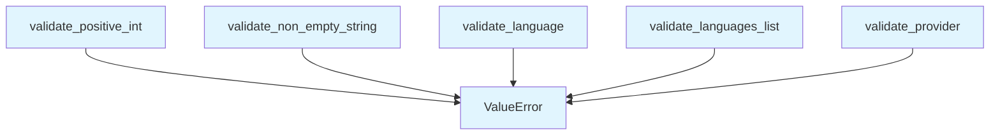

# validation.py

## File Overview

The validation module provides utility functions for validating input parameters and data types used throughout the local_deepwiki application. This module ensures data integrity by providing standardized validation functions for common data types and domain-specific values.

## Functions

Based on the code structure, this module contains the following validation functions:

### validate_positive_int
Validates that a value is a positive integer.

### validate_non_empty_string  
Validates that a value is a non-empty string.

### validate_language
Validates that a value is a valid [Language](models.md) enum value.

### validate_languages_list
Validates that a value is a list of valid [Language](models.md) enum values.

### validate_provider
Validates provider-related input values.

## Related Components

This module works with the following components:

- **[Language](models.md)**: Imports the [Language](models.md) enum from the models module for language validation
- Uses standard Python typing annotations with `Any` for flexible parameter validation

## Usage Context

The validation functions in this module are designed to be used throughout the application to ensure input parameters meet expected criteria before processing. The module focuses on validating both basic data types (positive integers, non-empty strings) and domain-specific types ([Language](models.md) enums, provider configurations).

## API Reference

### Functions

#### `validate_positive_int`

```python
def validate_positive_int(value: Any, name: str, min_val: int, max_val: int, default: int) -> int
```

Validate and bound an integer parameter.


| [Parameter](generators/api_docs.md) | Type | Default | Description |
|-----------|------|---------|-------------|
| `value` | `Any` | - | The value to validate. |
| `name` | `str` | - | [Parameter](generators/api_docs.md) name for error messages. |
| `min_val` | `int` | - | Minimum allowed value. |
| `max_val` | `int` | - | Maximum allowed value. |
| `default` | `int` | - | Default value if None. |

**Returns:** `int`


<details>
<summary>View Source (lines 22-42) | <a href="https://github.com/UrbanDiver/local-deepwiki-mcp/blob/[main](export/pdf.md)/src/local_deepwiki/validation.py#L22-L42">GitHub</a></summary>

```python
def validate_positive_int(value: Any, name: str, min_val: int, max_val: int, default: int) -> int:
    """Validate and bound an integer parameter.

    Args:
        value: The value to validate.
        name: Parameter name for error messages.
        min_val: Minimum allowed value.
        max_val: Maximum allowed value.
        default: Default value if None.

    Returns:
        Validated and bounded integer.

    Raises:
        ValueError: If value is not a valid integer.
    """
    if value is None:
        return default
    if not isinstance(value, int):
        raise ValueError(f"{name} must be an integer, got {type(value).__name__}")
    return max(min_val, min(max_val, value))
```

</details>

#### `validate_non_empty_string`

```python
def validate_non_empty_string(value: Any, name: str) -> str
```

Validate that a string is non-empty.


| [Parameter](generators/api_docs.md) | Type | Default | Description |
|-----------|------|---------|-------------|
| `value` | `Any` | - | The value to validate. |
| `name` | `str` | - | [Parameter](generators/api_docs.md) name for error messages. |

**Returns:** `str`


<details>
<summary>View Source (lines 45-62) | <a href="https://github.com/UrbanDiver/local-deepwiki-mcp/blob/[main](export/pdf.md)/src/local_deepwiki/validation.py#L45-L62">GitHub</a></summary>

```python
def validate_non_empty_string(value: Any, name: str) -> str:
    """Validate that a string is non-empty.

    Args:
        value: The value to validate.
        name: Parameter name for error messages.

    Returns:
        The validated string.

    Raises:
        ValueError: If value is not a non-empty string.
    """
    if not isinstance(value, str):
        raise ValueError(f"{name} must be a string, got {type(value).__name__}")
    if not value.strip():
        raise ValueError(f"{name} cannot be empty")
    return value
```

</details>

#### `validate_language`

```python
def validate_language(language: str | None) -> str | None
```

Validate a language filter value.


| [Parameter](generators/api_docs.md) | Type | Default | Description |
|-----------|------|---------|-------------|
| `language` | `str | None` | - | The language to validate. |

**Returns:** `str | None`


<details>
<summary>View Source (lines 65-83) | <a href="https://github.com/UrbanDiver/local-deepwiki-mcp/blob/[main](export/pdf.md)/src/local_deepwiki/validation.py#L65-L83">GitHub</a></summary>

```python
def validate_language(language: str | None) -> str | None:
    """Validate a language filter value.

    Args:
        language: The language to validate.

    Returns:
        The validated language or None.

    Raises:
        ValueError: If language is invalid.
    """
    if language is None:
        return None
    if language not in VALID_LANGUAGES:
        raise ValueError(
            f"Invalid language: '{language}'. Valid options: {sorted(VALID_LANGUAGES)}"
        )
    return language
```

</details>

#### `validate_languages_list`

```python
def validate_languages_list(languages: list[str] | None) -> list[str] | None
```

Validate a list of languages.


| [Parameter](generators/api_docs.md) | Type | Default | Description |
|-----------|------|---------|-------------|
| `languages` | `list[str] | None` | - | List of languages to validate. |

**Returns:** `list[str] | None`


<details>
<summary>View Source (lines 86-106) | <a href="https://github.com/UrbanDiver/local-deepwiki-mcp/blob/[main](export/pdf.md)/src/local_deepwiki/validation.py#L86-L106">GitHub</a></summary>

```python
def validate_languages_list(languages: list[str] | None) -> list[str] | None:
    """Validate a list of languages.

    Args:
        languages: List of languages to validate.

    Returns:
        The validated list or None.

    Raises:
        ValueError: If any language is invalid.
    """
    if languages is None:
        return None
    if not isinstance(languages, list):
        raise ValueError(f"languages must be a list, got {type(languages).__name__}")

    invalid = [lang for lang in languages if lang not in VALID_LANGUAGES]
    if invalid:
        raise ValueError(f"Invalid languages: {invalid}. Valid options: {sorted(VALID_LANGUAGES)}")
    return languages
```

</details>

#### `validate_provider`

```python
def validate_provider(provider: str | None, valid_providers: set[str], name: str) -> str | None
```

Validate a provider value.


| [Parameter](generators/api_docs.md) | Type | Default | Description |
|-----------|------|---------|-------------|
| `provider` | `str | None` | - | The provider to validate. |
| `valid_providers` | `set[str]` | - | Set of valid provider names. |
| `name` | `str` | - | [Parameter](generators/api_docs.md) name for error messages. |

**Returns:** `str | None`


<details>
<summary>View Source (lines 109-127) | <a href="https://github.com/UrbanDiver/local-deepwiki-mcp/blob/[main](export/pdf.md)/src/local_deepwiki/validation.py#L109-L127">GitHub</a></summary>

```python
def validate_provider(provider: str | None, valid_providers: set[str], name: str) -> str | None:
    """Validate a provider value.

    Args:
        provider: The provider to validate.
        valid_providers: Set of valid provider names.
        name: Parameter name for error messages.

    Returns:
        The validated provider or None.

    Raises:
        ValueError: If provider is invalid.
    """
    if provider is None:
        return None
    if provider not in valid_providers:
        raise ValueError(f"Invalid {name}: '{provider}'. Valid options: {sorted(valid_providers)}")
    return provider
```

</details>

## Call Graph



## Used By

Functions and methods in this file and their callers:

- **`ValueError`**: called by `validate_language`, `validate_languages_list`, `validate_non_empty_string`, `validate_positive_int`, `validate_provider`

## Last Modified

| Entity | Type | Author | Date | Commit |
|--------|------|--------|------|--------|
| `validate_positive_int` | function | Brian Breidenbach | yesterday | `3defaaa` Refactor: Extract validatio... |
| `validate_non_empty_string` | function | Brian Breidenbach | yesterday | `3defaaa` Refactor: Extract validatio... |
| `validate_language` | function | Brian Breidenbach | yesterday | `3defaaa` Refactor: Extract validatio... |
| `validate_languages_list` | function | Brian Breidenbach | yesterday | `3defaaa` Refactor: Extract validatio... |
| `validate_provider` | function | Brian Breidenbach | yesterday | `3defaaa` Refactor: Extract validatio... |

## Relevant Source Files

- `src/local_deepwiki/validation.py:22-42`

## See Also

- [models](models.md) - dependency
- [vectorstore](core/vectorstore.md) - shares 2 dependencies
- [chunker](core/chunker.md) - shares 2 dependencies
