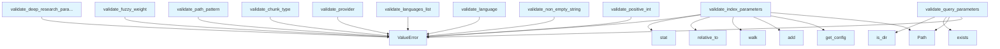

# File Overview

This file, `src/local_deepwiki/validation.py`, provides validation functions and a `ResourceLimits` class for ensuring input parameters and resource usage remain within safe bounds. It is used to prevent resource exhaustion attacks and enforce valid parameter values in various parts of the application, including query processing, repository indexing, and deep research operations.

The module imports from:
- `typing.Any`
- [`local_deepwiki.models.ChunkType`](models.md), [`Language`](models.md)
- `pathlib.Path`
- `os`
- [`local_deepwiki.config.get_config`](config.md)

It is used by:
- `test_server_validation`
- `test_fuzzy_search`
- `handlers`
- `test_resource_limits`

---

# Classes

## ResourceLimits

```python
class ResourceLimits:
    """Resource consumption limits for security (CWE-400 prevention).

    These limits prevent denial of service attacks via resource exhaustion.
    All limits are intentionally conservative to protect system resources.
    """
```

**Purpose**: Defines maximum resource limits to prevent denial-of-service attacks by constraining input parameters and system resource usage.

### Constants

- `MAX_QUERY_LENGTH`: Maximum allowed query string length (5000 characters)
- `MAX_QUESTION_LENGTH`: Maximum allowed question string length (2000 characters)
- `MAX_REPO_SIZE`: Maximum repository size (1 GB)
- `MAX_FILES_PER_REPO`: Maximum number of files per repository (50,000)
- `MAX_FILE_SIZE`: Maximum file size (50 MB)
- `MAX_SUB_QUESTIONS`: Maximum number of sub-questions during deep research (20)
- `MAX_RESEARCH_DEPTH`: Maximum depth of research (5)
- `MAX_CONTEXT_SIZE`: Maximum context size (5000 characters)

---

# Functions

## validate_positive_int

```python
def validate_positive_int(
    value: Any, name: str, min_val: int, max_val: int, default: int
) -> int:
```

**Purpose**: Validates and bounds an integer parameter.

### Parameters

- `value`: The value to validate.
- `name`: [Parameter](generators/api_docs.md) name for error messages.
- `min_val`: Minimum allowed value.
- `max_val`: Maximum allowed value.
- `default`: Default value if `None`.

### Returns

- Validated and bounded integer.

### Raises

- `ValueError`: If value is not a valid integer.

---

## validate_non_empty_string

```python
def validate_non_empty_string(value: Any, name: str) -> str:
```

**Purpose**: Validates that a string is non-empty.

### Parameters

- `value`: The value to validate.
- `name`: [Parameter](generators/api_docs.md) name for error messages.

### Returns

- The validated string.

### Raises

- `ValueError`: If value is not a non-empty string.

---

## validate_language

```python
def validate_language(language: str | None) -> str | None:
```

**Purpose**: Validates a language filter value.

### Parameters

- `language`: The language to validate.

### Returns

- The validated language or `None`.

### Raises

- `ValueError`: If language is invalid.

---

## validate_languages_list

```python
def validate_languages_list(languages: list[str] | None) -> list[str] | None:
```

**Purpose**: Validates a list of languages.

### Parameters

- `languages`: List of languages to validate.

### Returns

- The validated list or `None`.

### Raises

- `ValueError`: If any language is invalid.

---

## validate_provider

```python
def validate_provider(
    provider: str | None, valid_providers: set[str], name: str
) -> str | None:
```

**Purpose**: Validates a provider value.

### Parameters

- `provider`: The provider to validate.
- `valid_providers`: Set of valid provider names.
- `name`: [Parameter](generators/api_docs.md) name for error messages.

### Returns

- The validated provider or `None`.

### Raises

- `ValueError`: If provider is invalid.

---

## validate_chunk_type

```python
def validate_chunk_type(chunk_type: str | None) -> str | None:
```

**Purpose**: Validates a chunk type filter value.

### Parameters

- `chunk_type`: The chunk type to validate.

### Returns

- The validated chunk type or `None`.

### Raises

- `ValueError`: If chunk type is invalid.

---

## validate_path_pattern

```python
def validate_path_pattern(path_pattern: str | None) -> str | None:
```

**Purpose**: Validates a file path pattern.

### Parameters

- `path_pattern`: The path pattern to validate.

### Returns

- The validated path pattern or `None`.

### Raises

- `ValueError`: If path pattern is invalid.

---

## validate_fuzzy_weight

```python
def validate_fuzzy_weight(weight: float | None) -> float:
```

**Purpose**: Validates fuzzy weight parameter.

### Parameters

- `weight`: The fuzzy weight (0.0-1.0).

### Returns

- Validated weight, default `0.3`.

### Raises

- `ValueError`: If weight is out of range.

---

## validate_query_parameters

```python
def validate_query_parameters(
    query: str,
    repo_path: str,
    max_results: int,
) -> None:
```

**Purpose**: Validates query parameters against resource limits.

### Parameters

- `query`: The search query string.
- `repo_path`: Path to the repository.
- `max_results`: Maximum number of results to return.

### Raises

- `ValueError`: If any parameter violates resource limits.

---

## validate_index_parameters

```python
def validate_index_parameters(
    repo_path: str,
) -> tuple[int, int]:
```

**Purpose**: Validates repository indexing parameters.

### Parameters

- `repo_path`: Path to the repository to index.

### Returns

- Tuple of `(total_size, file_count)` for the repository.

### Raises

- `ValueError`: If repository exceeds any resource limits.

---

## validate_deep_research_parameters

```python
def validate_deep_research_parameters(
    question: str,
    preset: str | None,
    max_chunks: int,
) -> None:
```

**Purpose**: Validates deep research parameters.

### Parameters

- `question`: The research question.
- `preset`: Research preset (`quick`, `default`, `thorough`) or `None`.
- `max_chunks`: Maximum number of context chunks to use.

### Raises

- `ValueError`: If any parameter violates resource limits.

---

# Integration

This module integrates with the broader codebase by providing validation utilities used in:
- `test_server_validation` (via `validate_non_empty_string`, `validate_language`, `validate_languages_list`, `validate_provider`, `validate_chunk_type`)
- `test_fuzzy_search` (via `validate_chunk_type`)
- `handlers` (via `validate_deep_research_parameters`)
- `test_resource_limits` (via `validate_query_parameters`, `validate_index_parameters`, `validate_deep_research_parameters`)

It leverages [`local_deepwiki.config.get_config`](config.md) for configuration access and depends on [`local_deepwiki.models.ChunkType`](models.md) and [`Language`](models.md) for type validation.

---

# Usage Examples

## validate_positive_int

```python
validated_value = validate_positive_int(5, "max_attempts", 1, 100, 10)
```

## validate_non_empty_string

```python
query = validate_non_empty_string("hello world", "query")
```

## validate_language

```python
lang = validate_language("en")
```

## validate_provider

```python
provider = validate_provider("openai", {"openai", "anthropic"}, "model_provider")
```

## validate_query_parameters

```python
validate_query_parameters("search query", "/path/to/repo", 10)
```

## validate_deep_research_parameters

```python
validate_deep_research_parameters("What is AI?", "default", 50)
```

## API Reference

### class `ResourceLimits`

Resource consumption limits for security (CWE-400 prevention).  These limits prevent denial of service attacks via resource exhaustion. All limits are intentionally conservative to protect system resources.

---


<details>
<summary>View Source (lines 218-241) | <a href="https://github.com/UrbanDiver/local-deepwiki-mcp/blob/[main](export/pdf.md)/src/local_deepwiki/validation.py#L218-L241">GitHub</a></summary>

```python
class ResourceLimits:
    """Resource consumption limits for security (CWE-400 prevention).

    These limits prevent denial of service attacks via resource exhaustion.
    All limits are intentionally conservative to protect system resources.
    """

    # Query parameters
    MAX_QUERY_LENGTH = 5000  # Characters
    MAX_QUESTION_LENGTH = 2000  # Characters

    # Repository indexing
    MAX_REPO_SIZE = 1_000_000_000  # 1GB
    MAX_FILES_PER_REPO = 50_000
    MAX_FILE_SIZE = 50_000_000  # 50MB per file

    # Deep research
    MAX_SUB_QUESTIONS = 20
    MAX_RESEARCH_DEPTH = 5
    MAX_CONTEXT_CHUNKS = 500

    # Export operations
    MAX_PDF_PAGES = 10_000
    MAX_HTML_SIZE = 100_000_000  # 100MB
```

</details>

### Functions

#### `validate_positive_int`

```python
def validate_positive_int(value: Any, name: str, min_val: int, max_val: int, default: int) -> int
```

Validate and bound an integer parameter.


| [Parameter](generators/api_docs.md) | Type | Default | Description |
|-----------|------|---------|-------------|
| `value` | `Any` | - | The value to validate. |
| `name` | `str` | - | [Parameter](generators/api_docs.md) name for error messages. |
| `min_val` | `int` | - | Minimum allowed value. |
| `max_val` | `int` | - | Maximum allowed value. |
| `default` | `int` | - | Default value if None. |

**Returns:** `int`


<details>
<summary>View Source (lines 26-48) | <a href="https://github.com/UrbanDiver/local-deepwiki-mcp/blob/[main](export/pdf.md)/src/local_deepwiki/validation.py#L26-L48">GitHub</a></summary>

```python
def validate_positive_int(
    value: Any, name: str, min_val: int, max_val: int, default: int
) -> int:
    """Validate and bound an integer parameter.

    Args:
        value: The value to validate.
        name: Parameter name for error messages.
        min_val: Minimum allowed value.
        max_val: Maximum allowed value.
        default: Default value if None.

    Returns:
        Validated and bounded integer.

    Raises:
        ValueError: If value is not a valid integer.
    """
    if value is None:
        return default
    if not isinstance(value, int):
        raise ValueError(f"{name} must be an integer, got {type(value).__name__}")
    return max(min_val, min(max_val, value))
```

</details>

#### `validate_non_empty_string`

```python
def validate_non_empty_string(value: Any, name: str) -> str
```

Validate that a string is non-empty.


| [Parameter](generators/api_docs.md) | Type | Default | Description |
|-----------|------|---------|-------------|
| `value` | `Any` | - | The value to validate. |
| `name` | `str` | - | [Parameter](generators/api_docs.md) name for error messages. |

**Returns:** `str`


<details>
<summary>View Source (lines 51-68) | <a href="https://github.com/UrbanDiver/local-deepwiki-mcp/blob/[main](export/pdf.md)/src/local_deepwiki/validation.py#L51-L68">GitHub</a></summary>

```python
def validate_non_empty_string(value: Any, name: str) -> str:
    """Validate that a string is non-empty.

    Args:
        value: The value to validate.
        name: Parameter name for error messages.

    Returns:
        The validated string.

    Raises:
        ValueError: If value is not a non-empty string.
    """
    if not isinstance(value, str):
        raise ValueError(f"{name} must be a string, got {type(value).__name__}")
    if not value.strip():
        raise ValueError(f"{name} cannot be empty")
    return value
```

</details>

#### `validate_language`

```python
def validate_language(language: str | None) -> str | None
```

Validate a language filter value.


| [Parameter](generators/api_docs.md) | Type | Default | Description |
|-----------|------|---------|-------------|
| `language` | `str | None` | - | The language to validate. |

**Returns:** `str | None`


<details>
<summary>View Source (lines 71-89) | <a href="https://github.com/UrbanDiver/local-deepwiki-mcp/blob/[main](export/pdf.md)/src/local_deepwiki/validation.py#L71-L89">GitHub</a></summary>

```python
def validate_language(language: str | None) -> str | None:
    """Validate a language filter value.

    Args:
        language: The language to validate.

    Returns:
        The validated language or None.

    Raises:
        ValueError: If language is invalid.
    """
    if language is None:
        return None
    if language not in VALID_LANGUAGES:
        raise ValueError(
            f"Invalid language: '{language}'. Valid options: {sorted(VALID_LANGUAGES)}"
        )
    return language
```

</details>

#### `validate_languages_list`

```python
def validate_languages_list(languages: list[str] | None) -> list[str] | None
```

Validate a list of languages.


| [Parameter](generators/api_docs.md) | Type | Default | Description |
|-----------|------|---------|-------------|
| `languages` | `list[str] | None` | - | List of languages to validate. |

**Returns:** `list[str] | None`


<details>
<summary>View Source (lines 92-114) | <a href="https://github.com/UrbanDiver/local-deepwiki-mcp/blob/[main](export/pdf.md)/src/local_deepwiki/validation.py#L92-L114">GitHub</a></summary>

```python
def validate_languages_list(languages: list[str] | None) -> list[str] | None:
    """Validate a list of languages.

    Args:
        languages: List of languages to validate.

    Returns:
        The validated list or None.

    Raises:
        ValueError: If any language is invalid.
    """
    if languages is None:
        return None
    if not isinstance(languages, list):
        raise ValueError(f"languages must be a list, got {type(languages).__name__}")

    invalid = [lang for lang in languages if lang not in VALID_LANGUAGES]
    if invalid:
        raise ValueError(
            f"Invalid languages: {invalid}. Valid options: {sorted(VALID_LANGUAGES)}"
        )
    return languages
```

</details>

#### `validate_provider`

```python
def validate_provider(provider: str | None, valid_providers: set[str], name: str) -> str | None
```

Validate a provider value.


| [Parameter](generators/api_docs.md) | Type | Default | Description |
|-----------|------|---------|-------------|
| `provider` | `str | None` | - | The provider to validate. |
| `valid_providers` | `set[str]` | - | Set of valid provider names. |
| `name` | `str` | - | [Parameter](generators/api_docs.md) name for error messages. |

**Returns:** `str | None`


<details>
<summary>View Source (lines 117-139) | <a href="https://github.com/UrbanDiver/local-deepwiki-mcp/blob/[main](export/pdf.md)/src/local_deepwiki/validation.py#L117-L139">GitHub</a></summary>

```python
def validate_provider(
    provider: str | None, valid_providers: set[str], name: str
) -> str | None:
    """Validate a provider value.

    Args:
        provider: The provider to validate.
        valid_providers: Set of valid provider names.
        name: Parameter name for error messages.

    Returns:
        The validated provider or None.

    Raises:
        ValueError: If provider is invalid.
    """
    if provider is None:
        return None
    if provider not in valid_providers:
        raise ValueError(
            f"Invalid {name}: '{provider}'. Valid options: {sorted(valid_providers)}"
        )
    return provider
```

</details>

#### `validate_chunk_type`

```python
def validate_chunk_type(chunk_type: str | None) -> str | None
```

Validate a chunk type filter value.


| [Parameter](generators/api_docs.md) | Type | Default | Description |
|-----------|------|---------|-------------|
| `chunk_type` | `str | None` | - | The chunk type to validate. |

**Returns:** `str | None`


<details>
<summary>View Source (lines 142-160) | <a href="https://github.com/UrbanDiver/local-deepwiki-mcp/blob/[main](export/pdf.md)/src/local_deepwiki/validation.py#L142-L160">GitHub</a></summary>

```python
def validate_chunk_type(chunk_type: str | None) -> str | None:
    """Validate a chunk type filter value.

    Args:
        chunk_type: The chunk type to validate.

    Returns:
        The validated chunk type or None.

    Raises:
        ValueError: If chunk type is invalid.
    """
    if chunk_type is None:
        return None
    if chunk_type not in VALID_CHUNK_TYPES:
        raise ValueError(
            f"Invalid chunk_type: '{chunk_type}'. Valid options: {sorted(VALID_CHUNK_TYPES)}"
        )
    return chunk_type
```

</details>

#### `validate_path_pattern`

```python
def validate_path_pattern(path_pattern: str | None) -> str | None
```

Validate a file path pattern.  Accepts glob-like patterns for file path filtering.


| [Parameter](generators/api_docs.md) | Type | Default | Description |
|-----------|------|---------|-------------|
| `path_pattern` | `str | None` | - | The path pattern to validate. |

**Returns:** `str | None`


<details>
<summary>View Source (lines 163-187) | <a href="https://github.com/UrbanDiver/local-deepwiki-mcp/blob/[main](export/pdf.md)/src/local_deepwiki/validation.py#L163-L187">GitHub</a></summary>

```python
def validate_path_pattern(path_pattern: str | None) -> str | None:
    """Validate a file path pattern.

    Accepts glob-like patterns for file path filtering.

    Args:
        path_pattern: The path pattern to validate.

    Returns:
        The validated path pattern or None.

    Raises:
        ValueError: If path pattern is invalid.
    """
    if path_pattern is None:
        return None
    if not isinstance(path_pattern, str):
        raise ValueError(f"path must be a string, got {type(path_pattern).__name__}")
    # Basic validation - pattern should not be empty if provided
    if path_pattern.strip() == "":
        return None
    # Check for dangerous patterns
    if ".." in path_pattern:
        raise ValueError("path pattern cannot contain '..'")
    return path_pattern
```

</details>

#### `validate_fuzzy_weight`

```python
def validate_fuzzy_weight(weight: float | None) -> float
```

Validate fuzzy weight parameter.


| [Parameter](generators/api_docs.md) | Type | Default | Description |
|-----------|------|---------|-------------|
| `weight` | `float | None` | - | The fuzzy weight (0.0-1.0). |

**Returns:** `float`


<details>
<summary>View Source (lines 190-208) | <a href="https://github.com/UrbanDiver/local-deepwiki-mcp/blob/[main](export/pdf.md)/src/local_deepwiki/validation.py#L190-L208">GitHub</a></summary>

```python
def validate_fuzzy_weight(weight: float | None) -> float:
    """Validate fuzzy weight parameter.

    Args:
        weight: The fuzzy weight (0.0-1.0).

    Returns:
        Validated weight, default 0.3.

    Raises:
        ValueError: If weight is out of range.
    """
    if weight is None:
        return 0.3
    if not isinstance(weight, (int, float)):
        raise ValueError(f"fuzzy_weight must be a number, got {type(weight).__name__}")
    if weight < 0.0 or weight > 1.0:
        raise ValueError(f"fuzzy_weight must be between 0.0 and 1.0, got {weight}")
    return float(weight)
```

</details>

#### `validate_query_parameters`

```python
def validate_query_parameters(query: str, repo_path: str, max_results: int) -> None
```

Validate query parameters against resource limits.  Ensures query string length, repository path validity, and result count are within acceptable bounds to prevent resource exhaustion.


| [Parameter](generators/api_docs.md) | Type | Default | Description |
|-----------|------|---------|-------------|
| `query` | `str` | - | The search query string. |
| `repo_path` | `str` | - | Path to the repository. |
| `max_results` | `int` | - | Maximum number of results to return. |

**Returns:** `None`


<details>
<summary>View Source (lines 248-287) | <a href="https://github.com/UrbanDiver/local-deepwiki-mcp/blob/[main](export/pdf.md)/src/local_deepwiki/validation.py#L248-L287">GitHub</a></summary>

```python
def validate_query_parameters(
    query: str,
    repo_path: str,
    max_results: int,
) -> None:
    """Validate query parameters against resource limits.

    Ensures query string length, repository path validity, and result
    count are within acceptable bounds to prevent resource exhaustion.

    Args:
        query: The search query string.
        repo_path: Path to the repository.
        max_results: Maximum number of results to return.

    Raises:
        ValueError: If any parameter violates resource limits.
    """
    # Validate query length
    if len(query) > ResourceLimits.MAX_QUERY_LENGTH:
        raise ValueError(
            f"Query exceeds maximum length ({ResourceLimits.MAX_QUERY_LENGTH} characters)"
        )

    if len(query) < 1:
        raise ValueError("Query cannot be empty")

    # Validate repo_path exists and is a directory
    repo_path_obj = Path(repo_path)
    if not repo_path_obj.exists():
        raise ValueError(f"Repository path does not exist: {repo_path}")

    if not repo_path_obj.is_dir():
        raise ValueError(f"Repository path is not a directory: {repo_path}")

    # Validate max_results is in acceptable range
    if max_results < 1 or max_results > ResourceLimits.MAX_CONTEXT_CHUNKS:
        raise ValueError(
            f"max_results must be between 1 and {ResourceLimits.MAX_CONTEXT_CHUNKS}"
        )
```

</details>

#### `validate_index_parameters`

```python
def validate_index_parameters(repo_path: str) -> tuple[int, int]
```

Validate repository indexing parameters.  Scans the repository to ensure it doesn't exceed size limits. Checks total repository size, file count, and individual file sizes. Skips directories that the indexer would also skip (hidden dirs, virtual envs, node_modules, etc.) to avoid false rejections.


| [Parameter](generators/api_docs.md) | Type | Default | Description |
|-----------|------|---------|-------------|
| `repo_path` | `str` | - | Path to the repository to index. |

**Returns:** `tuple[int, int]`


<details>
<summary>View Source (lines 290-363) | <a href="https://github.com/UrbanDiver/local-deepwiki-mcp/blob/[main](export/pdf.md)/src/local_deepwiki/validation.py#L290-L363">GitHub</a></summary>

```python
def validate_index_parameters(
    repo_path: str,
) -> tuple[int, int]:
    """Validate repository indexing parameters.

    Scans the repository to ensure it doesn't exceed size limits.
    Checks total repository size, file count, and individual file sizes.
    Skips directories that the indexer would also skip (hidden dirs,
    virtual envs, node_modules, etc.) to avoid false rejections.

    Args:
        repo_path: Path to the repository to index.

    Returns:
        Tuple of (total_size, file_count) for the repository.

    Raises:
        ValueError: If repository exceeds any resource limits.
    """
    import os

    from local_deepwiki.config import get_config

    repo_path_obj = Path(repo_path)
    total_size = 0
    file_count = 0

    config = get_config()
    skip_dirs = set()
    for pattern in config.parsing.exclude_patterns:
        if pattern.endswith("/**"):
            skip_dirs.add(pattern[:-3])

    for root, dirs, filenames in os.walk(repo_path_obj):
        root_path = Path(root)
        rel_root = root_path.relative_to(repo_path_obj)

        dirs[:] = [
            d
            for d in dirs
            if d not in skip_dirs
            and str(rel_root / d) not in skip_dirs
            and not d.startswith(".")
        ]

        for filename in filenames:
            file_path = root_path / filename
            try:
                file_size = file_path.stat().st_size
            except OSError:
                continue

            if file_size > ResourceLimits.MAX_FILE_SIZE:
                raise ValueError(
                    f"File too large: {file_path} ({file_size:,} bytes, "
                    f"max {ResourceLimits.MAX_FILE_SIZE:,})"
                )

            total_size += file_size
            file_count += 1

            if total_size > ResourceLimits.MAX_REPO_SIZE:
                raise ValueError(
                    f"Repository exceeds maximum size "
                    f"({ResourceLimits.MAX_REPO_SIZE:,} bytes)"
                )

            if file_count > ResourceLimits.MAX_FILES_PER_REPO:
                raise ValueError(
                    f"Repository exceeds maximum file count "
                    f"({ResourceLimits.MAX_FILES_PER_REPO:,} files)"
                )

    return total_size, file_count
```

</details>

#### `validate_deep_research_parameters`

```python
def validate_deep_research_parameters(question: str, preset: str | None, max_chunks: int) -> None
```

Validate deep research parameters.  Ensures question length, preset validity, and chunk count are within acceptable bounds for deep research operations.


| [Parameter](generators/api_docs.md) | Type | Default | Description |
|-----------|------|---------|-------------|
| `question` | `str` | - | The research question. |
| `preset` | `str | None` | - | Research preset (quick/default/thorough) or None. |
| `max_chunks` | `int` | - | Maximum number of context chunks to use. |

**Returns:** `None`


<details>
<summary>View Source (lines 366-405) | <a href="https://github.com/UrbanDiver/local-deepwiki-mcp/blob/[main](export/pdf.md)/src/local_deepwiki/validation.py#L366-L405">GitHub</a></summary>

```python
def validate_deep_research_parameters(
    question: str,
    preset: str | None,
    max_chunks: int,
) -> None:
    """Validate deep research parameters.

    Ensures question length, preset validity, and chunk count are
    within acceptable bounds for deep research operations.

    Args:
        question: The research question.
        preset: Research preset (quick/default/thorough) or None.
        max_chunks: Maximum number of context chunks to use.

    Raises:
        ValueError: If any parameter violates resource limits.
    """
    # Validate question length
    if len(question) > ResourceLimits.MAX_QUESTION_LENGTH:
        raise ValueError(
            f"Question exceeds maximum length "
            f"({ResourceLimits.MAX_QUESTION_LENGTH} characters)"
        )

    if len(question) < 1:
        raise ValueError("Question cannot be empty")

    # Validate preset if provided
    if preset is not None and preset not in VALID_RESEARCH_PRESETS:
        raise ValueError(
            f"Invalid preset: '{preset}'. "
            f"Valid options: {sorted(VALID_RESEARCH_PRESETS)}"
        )

    # Validate max_chunks is in acceptable range
    if max_chunks < 1 or max_chunks > ResourceLimits.MAX_CONTEXT_CHUNKS:
        raise ValueError(
            f"max_chunks must be between 1 and {ResourceLimits.MAX_CONTEXT_CHUNKS}"
        )
```

</details>

## Call Graph


```mermaid
flowchart TD
    N0[Path]
    N1[ValueError]
    N2[add]
    N3[exists]
    N4[get_config]
    N5[is_dir]
    N6[relative_to]
    N7[stat]
    N8[validate_chunk_type]
    N9[validate_deep_research_para...]
    N10[validate_fuzzy_weight]
    N11[validate_index_parameters]
    N12[validate_language]
    N13[validate_languages_list]
    N14[validate_non_empty_string]
    N15[validate_path_pattern]
    N16[validate_positive_int]
    N17[validate_provider]
    N18[validate_query_parameters]
    N19[walk]
    N16 --> N1
    N14 --> N1
    N12 --> N1
    N13 --> N1
    N17 --> N1
    N8 --> N1
    N15 --> N1
    N10 --> N1
    N18 --> N1
    N18 --> N0
    N18 --> N3
    N18 --> N5
    N11 --> N0
    N11 --> N4
    N11 --> N2
    N11 --> N19
    N11 --> N6
    N11 --> N7
    N11 --> N1
    N9 --> N1
    classDef func fill:#e1f5fe
    class N0,N1,N2,N3,N4,N5,N6,N7,N8,N9,N10,N11,N12,N13,N14,N15,N16,N17,N18,N19 func
```

## Used By

Functions and methods in this file and their callers:

- **`Path`**: called by `validate_index_parameters`, `validate_query_parameters`
- **`ValueError`**: called by `validate_chunk_type`, `validate_deep_research_parameters`, `validate_fuzzy_weight`, `validate_index_parameters`, `validate_language`, `validate_languages_list`, `validate_non_empty_string`, `validate_path_pattern`, `validate_positive_int`, `validate_provider`, `validate_query_parameters`
- **`add`**: called by `validate_index_parameters`
- **`exists`**: called by `validate_query_parameters`
- **[`get_config`](config.md)**: called by `validate_index_parameters`
- **`is_dir`**: called by `validate_query_parameters`
- **`relative_to`**: called by `validate_index_parameters`
- **`stat`**: called by `validate_index_parameters`
- **[`walk`](generators/test_examples.md)**: called by `validate_index_parameters`

## Last Modified

| Entity | Type | Author | Date | Commit |
|--------|------|--------|------|--------|
| `validate_positive_int` | function | Brian Breidenbach | today | `4dbba1e` fix: Improve wiki accuracy,... |
| `validate_languages_list` | function | Brian Breidenbach | today | `4dbba1e` fix: Improve wiki accuracy,... |
| `validate_provider` | function | Brian Breidenbach | today | `4dbba1e` fix: Improve wiki accuracy,... |
| `validate_index_parameters` | function | Brian Breidenbach | today | `4dbba1e` fix: Improve wiki accuracy,... |
| `ResourceLimits` | class | Brian Breidenbach | 1 week ago | `9844731` Phase 3: Implement input va... |
| `validate_query_parameters` | function | Brian Breidenbach | 1 week ago | `9844731` Phase 3: Implement input va... |
| `validate_deep_research_parameters` | function | Brian Breidenbach | 1 week ago | `9844731` Phase 3: Implement input va... |
| `validate_chunk_type` | function | Brian Breidenbach | 1 week ago | `fa2feb8` Add CLI progress bars and f... |
| `validate_path_pattern` | function | Brian Breidenbach | 1 week ago | `fa2feb8` Add CLI progress bars and f... |
| `validate_fuzzy_weight` | function | Brian Breidenbach | 1 week ago | `fa2feb8` Add CLI progress bars and f... |
| `validate_non_empty_string` | function | Brian Breidenbach | 3 weeks ago | `3defaaa` Refactor: Extract validatio... |
| `validate_language` | function | Brian Breidenbach | 3 weeks ago | `3defaaa` Refactor: Extract validatio... |

## Relevant Source Files

- `src/local_deepwiki/validation.py:218-241`
