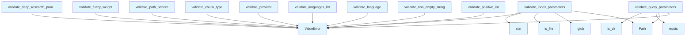

# File Overview

This file, `src/local_deepwiki/validation.py`, provides validation functions and a `ResourceLimits` class for ensuring parameter values and resource usage are within acceptable bounds. It is used to prevent resource exhaustion and enforce valid input for various operations in the local_deepwiki system.

## Dependencies

- `typing.Any`
- `local_deepwiki.models.ChunkType`
- `local_deepwiki.models.Language`
- `pathlib.Path`

## External Usage

The functions and classes in this file are called from:
- `validate_non_empty_string`: used by `test_server_validation`
- `validate_language`: used by `test_server_validation`
- `validate_languages_list`: used by `test_server_validation`
- `validate_provider`: used by `test_server_validation`
- `validate_chunk_type`: used by `test_fuzzy_search`
- `validate_query_parameters`: used by `test_resource_limits`
- `validate_deep_research_parameters`: used by `handlers`, `test_resource_limits`

## Related Files

- `src/local_deepwiki/cli/__init__.py`
- `src/local_deepwiki/core/__init__.py`
- `src/local_deepwiki/generators/source_refs.py`
- `src/local_deepwiki/generators/wiki.py`
- `tests/test_plugins.py`

# Classes

## ResourceLimits

```python
class ResourceLimits:
    """Resource consumption limits for security (CWE-400 prevention).

    These limits prevent denial of service attacks via resource exhaustion.
    All limits are intentionally conservative to protect system resources.
    """
```

A class defining resource limits for various operations to prevent resource exhaustion attacks. It includes constants for maximum query length, question length, repository size, file count, file size, sub-questions, research depth, and context size.

### Constants

- `MAX_QUERY_LENGTH`: 5000 characters
- `MAX_QUESTION_LENGTH`: 2000 characters
- `MAX_REPO_SIZE`: 1,000,000,000 bytes (1GB)
- `MAX_FILES_PER_REPO`: 50,000 files
- `MAX_FILE_SIZE`: 50,000,000 bytes (50MB)
- `MAX_SUB_QUESTIONS`: 20
- `MAX_RESEARCH_DEPTH`: 5
- `MAX_CONTEXT_SIZE`: 1000000 characters

# Functions

## validate_positive_int

```python
def validate_positive_int(value: Any, name: str, min_val: int, max_val: int, default: int) -> int
```

Validate and bound an integer parameter.

### Parameters

- `value`: The value to validate.
- `name`: Parameter name for error messages.
- `min_val`: Minimum allowed value.
- `max_val`: Maximum allowed value.
- `default`: Default value if None.

### Returns

Validated and bounded integer.

### Raises

- `ValueError`: If value is not a valid integer.

## validate_non_empty_string

```python
def validate_non_empty_string(value: Any, name: str) -> str
```

Validate that a string is non-empty.

### Parameters

- `value`: The value to validate.
- `name`: Parameter name for error messages.

### Returns

The validated string.

### Raises

- `ValueError`: If value is not a non-empty string.

## validate_language

```python
def validate_language(language: str | None) -> str | None
```

Validate a language filter value.

### Parameters

- `language`: The language to validate.

### Returns

The validated language or None.

### Raises

- `ValueError`: If language is invalid.

## validate_languages_list

```python
def validate_languages_list(languages: list[str] | None) -> list[str] | None
```

Validate a list of languages.

### Parameters

- `languages`: List of languages to validate.

### Returns

The validated list or None.

### Raises

- `ValueError`: If any language is invalid.

## validate_provider

```python
def validate_provider(provider: str | None, valid_providers: set[str], name: str) -> str | None
```

Validate a provider value.

### Parameters

- `provider`: The provider to validate.
- `valid_providers`: Set of valid provider names.
- `name`: Parameter name for error messages.

### Returns

The validated provider or None.

### Raises

- `ValueError`: If provider is invalid.

## validate_chunk_type

```python
def validate_chunk_type(chunk_type: str | None) -> str | None
```

Validate a chunk type filter value.

### Parameters

- `chunk_type`: The chunk type to validate.

### Returns

The validated chunk type or None.

### Raises

- `ValueError`: If chunk type is invalid.

## validate_path_pattern

```python
def validate_path_pattern(path_pattern: str | None) -> str | None
```

Validate a file path pattern.

Accepts glob-like patterns for file path filtering.

### Parameters

- `path_pattern`: The path pattern to validate.

### Returns

The validated path pattern or None.

### Raises

- `ValueError`: If path pattern is invalid.

## validate_fuzzy_weight

```python
def validate_fuzzy_weight(weight: float | None) -> float
```

Validate fuzzy weight parameter.

### Parameters

- `weight`: The fuzzy weight (0.0-1.0).

### Returns

Validated weight, default 0.3.

### Raises

- `ValueError`: If weight is out of range.

## validate_query_parameters

```python
def validate_query_parameters(
    query: str,
    repo_path: str,
    max_results: int,
) -> None
```

Validate query parameters against resource limits.

Ensures query string length, repository path validity, and result count are within acceptable bounds to prevent resource exhaustion.

### Parameters

- `query`: The search query string.
- `repo_path`: Path to the repository.
- `max_results`: Maximum number of results to return.

### Raises

- `ValueError`: If any parameter violates resource limits.

## validate_index_parameters

```python
def validate_index_parameters(
    repo_path: str,
) -> tuple[int, int]
```

Validate repository indexing parameters.

Scans the repository to ensure it doesn't exceed size limits. Checks total repository size, file count, and individual file sizes.

### Parameters

- `repo_path`: Path to the repository to index.

### Returns

Tuple of (total_size, file_count) for the repository.

### Raises

- `ValueError`: If repository exceeds any resource limits.

## validate_deep_research_parameters

```python
def validate_deep_research_parameters(
    question: str,
    preset: str | None,
    max_chunks: int,
) -> None
```

Validate deep research parameters.

Ensures question length, preset validity, and chunk count are within acceptable bounds for deep research operations.

### Parameters

- `question`: The research question.
- `preset`: Research preset (quick/default/thorough) or None.
- `max_chunks`: Maximum number of context chunks to use.

### Raises

- `ValueError`: If any parameter violates resource limits.

## API Reference

### class `ResourceLimits`

Resource consumption limits for security (CWE-400 prevention).  These limits prevent denial of service attacks via resource exhaustion. All limits are intentionally conservative to protect system resources.

---


<details>
<summary>View Source (lines 210-233) | <a href="https://github.com/UrbanDiver/local-deepwiki-mcp/blob/main/src/local_deepwiki/validation.py#L210-L233">GitHub</a></summary>

```python
class ResourceLimits:
    """Resource consumption limits for security (CWE-400 prevention).

    These limits prevent denial of service attacks via resource exhaustion.
    All limits are intentionally conservative to protect system resources.
    """

    # Query parameters
    MAX_QUERY_LENGTH = 5000  # Characters
    MAX_QUESTION_LENGTH = 2000  # Characters

    # Repository indexing
    MAX_REPO_SIZE = 1_000_000_000  # 1GB
    MAX_FILES_PER_REPO = 50_000
    MAX_FILE_SIZE = 50_000_000  # 50MB per file

    # Deep research
    MAX_SUB_QUESTIONS = 20
    MAX_RESEARCH_DEPTH = 5
    MAX_CONTEXT_CHUNKS = 500

    # Export operations
    MAX_PDF_PAGES = 10_000
    MAX_HTML_SIZE = 100_000_000  # 100MB
```

</details>

### Functions

#### `validate_positive_int`

```python
def validate_positive_int(value: Any, name: str, min_val: int, max_val: int, default: int) -> int
```

Validate and bound an integer parameter.


| Parameter | Type | Default | Description |
|-----------|------|---------|-------------|
| `value` | `Any` | - | The value to validate. |
| `name` | `str` | - | Parameter name for error messages. |
| `min_val` | `int` | - | Minimum allowed value. |
| `max_val` | `int` | - | Maximum allowed value. |
| `default` | `int` | - | Default value if None. |

**Returns:** `int`


<details>
<summary>View Source (lines 26-46) | <a href="https://github.com/UrbanDiver/local-deepwiki-mcp/blob/main/src/local_deepwiki/validation.py#L26-L46">GitHub</a></summary>

```python
def validate_positive_int(value: Any, name: str, min_val: int, max_val: int, default: int) -> int:
    """Validate and bound an integer parameter.

    Args:
        value: The value to validate.
        name: Parameter name for error messages.
        min_val: Minimum allowed value.
        max_val: Maximum allowed value.
        default: Default value if None.

    Returns:
        Validated and bounded integer.

    Raises:
        ValueError: If value is not a valid integer.
    """
    if value is None:
        return default
    if not isinstance(value, int):
        raise ValueError(f"{name} must be an integer, got {type(value).__name__}")
    return max(min_val, min(max_val, value))
```

</details>

#### `validate_non_empty_string`

```python
def validate_non_empty_string(value: Any, name: str) -> str
```

Validate that a string is non-empty.


| Parameter | Type | Default | Description |
|-----------|------|---------|-------------|
| `value` | `Any` | - | The value to validate. |
| `name` | `str` | - | Parameter name for error messages. |

**Returns:** `str`


<details>
<summary>View Source (lines 49-66) | <a href="https://github.com/UrbanDiver/local-deepwiki-mcp/blob/main/src/local_deepwiki/validation.py#L49-L66">GitHub</a></summary>

```python
def validate_non_empty_string(value: Any, name: str) -> str:
    """Validate that a string is non-empty.

    Args:
        value: The value to validate.
        name: Parameter name for error messages.

    Returns:
        The validated string.

    Raises:
        ValueError: If value is not a non-empty string.
    """
    if not isinstance(value, str):
        raise ValueError(f"{name} must be a string, got {type(value).__name__}")
    if not value.strip():
        raise ValueError(f"{name} cannot be empty")
    return value
```

</details>

#### `validate_language`

```python
def validate_language(language: str | None) -> str | None
```

Validate a language filter value.


| Parameter | Type | Default | Description |
|-----------|------|---------|-------------|
| `language` | `str | None` | - | The language to validate. |

**Returns:** `str | None`


<details>
<summary>View Source (lines 69-87) | <a href="https://github.com/UrbanDiver/local-deepwiki-mcp/blob/main/src/local_deepwiki/validation.py#L69-L87">GitHub</a></summary>

```python
def validate_language(language: str | None) -> str | None:
    """Validate a language filter value.

    Args:
        language: The language to validate.

    Returns:
        The validated language or None.

    Raises:
        ValueError: If language is invalid.
    """
    if language is None:
        return None
    if language not in VALID_LANGUAGES:
        raise ValueError(
            f"Invalid language: '{language}'. Valid options: {sorted(VALID_LANGUAGES)}"
        )
    return language
```

</details>

#### `validate_languages_list`

```python
def validate_languages_list(languages: list[str] | None) -> list[str] | None
```

Validate a list of languages.


| Parameter | Type | Default | Description |
|-----------|------|---------|-------------|
| `languages` | `list[str] | None` | - | List of languages to validate. |

**Returns:** `list[str] | None`


<details>
<summary>View Source (lines 90-110) | <a href="https://github.com/UrbanDiver/local-deepwiki-mcp/blob/main/src/local_deepwiki/validation.py#L90-L110">GitHub</a></summary>

```python
def validate_languages_list(languages: list[str] | None) -> list[str] | None:
    """Validate a list of languages.

    Args:
        languages: List of languages to validate.

    Returns:
        The validated list or None.

    Raises:
        ValueError: If any language is invalid.
    """
    if languages is None:
        return None
    if not isinstance(languages, list):
        raise ValueError(f"languages must be a list, got {type(languages).__name__}")

    invalid = [lang for lang in languages if lang not in VALID_LANGUAGES]
    if invalid:
        raise ValueError(f"Invalid languages: {invalid}. Valid options: {sorted(VALID_LANGUAGES)}")
    return languages
```

</details>

#### `validate_provider`

```python
def validate_provider(provider: str | None, valid_providers: set[str], name: str) -> str | None
```

Validate a provider value.


| Parameter | Type | Default | Description |
|-----------|------|---------|-------------|
| `provider` | `str | None` | - | The provider to validate. |
| `valid_providers` | `set[str]` | - | Set of valid provider names. |
| `name` | `str` | - | Parameter name for error messages. |

**Returns:** `str | None`


<details>
<summary>View Source (lines 113-131) | <a href="https://github.com/UrbanDiver/local-deepwiki-mcp/blob/main/src/local_deepwiki/validation.py#L113-L131">GitHub</a></summary>

```python
def validate_provider(provider: str | None, valid_providers: set[str], name: str) -> str | None:
    """Validate a provider value.

    Args:
        provider: The provider to validate.
        valid_providers: Set of valid provider names.
        name: Parameter name for error messages.

    Returns:
        The validated provider or None.

    Raises:
        ValueError: If provider is invalid.
    """
    if provider is None:
        return None
    if provider not in valid_providers:
        raise ValueError(f"Invalid {name}: '{provider}'. Valid options: {sorted(valid_providers)}")
    return provider
```

</details>

#### `validate_chunk_type`

```python
def validate_chunk_type(chunk_type: str | None) -> str | None
```

Validate a chunk type filter value.


| Parameter | Type | Default | Description |
|-----------|------|---------|-------------|
| `chunk_type` | `str | None` | - | The chunk type to validate. |

**Returns:** `str | None`


<details>
<summary>View Source (lines 134-152) | <a href="https://github.com/UrbanDiver/local-deepwiki-mcp/blob/main/src/local_deepwiki/validation.py#L134-L152">GitHub</a></summary>

```python
def validate_chunk_type(chunk_type: str | None) -> str | None:
    """Validate a chunk type filter value.

    Args:
        chunk_type: The chunk type to validate.

    Returns:
        The validated chunk type or None.

    Raises:
        ValueError: If chunk type is invalid.
    """
    if chunk_type is None:
        return None
    if chunk_type not in VALID_CHUNK_TYPES:
        raise ValueError(
            f"Invalid chunk_type: '{chunk_type}'. Valid options: {sorted(VALID_CHUNK_TYPES)}"
        )
    return chunk_type
```

</details>

#### `validate_path_pattern`

```python
def validate_path_pattern(path_pattern: str | None) -> str | None
```

Validate a file path pattern.  Accepts glob-like patterns for file path filtering.


| Parameter | Type | Default | Description |
|-----------|------|---------|-------------|
| `path_pattern` | `str | None` | - | The path pattern to validate. |

**Returns:** `str | None`


<details>
<summary>View Source (lines 155-179) | <a href="https://github.com/UrbanDiver/local-deepwiki-mcp/blob/main/src/local_deepwiki/validation.py#L155-L179">GitHub</a></summary>

```python
def validate_path_pattern(path_pattern: str | None) -> str | None:
    """Validate a file path pattern.

    Accepts glob-like patterns for file path filtering.

    Args:
        path_pattern: The path pattern to validate.

    Returns:
        The validated path pattern or None.

    Raises:
        ValueError: If path pattern is invalid.
    """
    if path_pattern is None:
        return None
    if not isinstance(path_pattern, str):
        raise ValueError(f"path must be a string, got {type(path_pattern).__name__}")
    # Basic validation - pattern should not be empty if provided
    if path_pattern.strip() == "":
        return None
    # Check for dangerous patterns
    if ".." in path_pattern:
        raise ValueError("path pattern cannot contain '..'")
    return path_pattern
```

</details>

#### `validate_fuzzy_weight`

```python
def validate_fuzzy_weight(weight: float | None) -> float
```

Validate fuzzy weight parameter.


| Parameter | Type | Default | Description |
|-----------|------|---------|-------------|
| `weight` | `float | None` | - | The fuzzy weight (0.0-1.0). |

**Returns:** `float`


<details>
<summary>View Source (lines 182-200) | <a href="https://github.com/UrbanDiver/local-deepwiki-mcp/blob/main/src/local_deepwiki/validation.py#L182-L200">GitHub</a></summary>

```python
def validate_fuzzy_weight(weight: float | None) -> float:
    """Validate fuzzy weight parameter.

    Args:
        weight: The fuzzy weight (0.0-1.0).

    Returns:
        Validated weight, default 0.3.

    Raises:
        ValueError: If weight is out of range.
    """
    if weight is None:
        return 0.3
    if not isinstance(weight, (int, float)):
        raise ValueError(f"fuzzy_weight must be a number, got {type(weight).__name__}")
    if weight < 0.0 or weight > 1.0:
        raise ValueError(f"fuzzy_weight must be between 0.0 and 1.0, got {weight}")
    return float(weight)
```

</details>

#### `validate_query_parameters`

```python
def validate_query_parameters(query: str, repo_path: str, max_results: int) -> None
```

Validate query parameters against resource limits.  Ensures query string length, repository path validity, and result count are within acceptable bounds to prevent resource exhaustion.


| Parameter | Type | Default | Description |
|-----------|------|---------|-------------|
| `query` | `str` | - | The search query string. |
| `repo_path` | `str` | - | Path to the repository. |
| `max_results` | `int` | - | Maximum number of results to return. |

**Returns:** `None`


<details>
<summary>View Source (lines 240-279) | <a href="https://github.com/UrbanDiver/local-deepwiki-mcp/blob/main/src/local_deepwiki/validation.py#L240-L279">GitHub</a></summary>

```python
def validate_query_parameters(
    query: str,
    repo_path: str,
    max_results: int,
) -> None:
    """Validate query parameters against resource limits.

    Ensures query string length, repository path validity, and result
    count are within acceptable bounds to prevent resource exhaustion.

    Args:
        query: The search query string.
        repo_path: Path to the repository.
        max_results: Maximum number of results to return.

    Raises:
        ValueError: If any parameter violates resource limits.
    """
    # Validate query length
    if len(query) > ResourceLimits.MAX_QUERY_LENGTH:
        raise ValueError(
            f"Query exceeds maximum length ({ResourceLimits.MAX_QUERY_LENGTH} characters)"
        )

    if len(query) < 1:
        raise ValueError("Query cannot be empty")

    # Validate repo_path exists and is a directory
    repo_path_obj = Path(repo_path)
    if not repo_path_obj.exists():
        raise ValueError(f"Repository path does not exist: {repo_path}")

    if not repo_path_obj.is_dir():
        raise ValueError(f"Repository path is not a directory: {repo_path}")

    # Validate max_results is in acceptable range
    if max_results < 1 or max_results > ResourceLimits.MAX_CONTEXT_CHUNKS:
        raise ValueError(
            f"max_results must be between 1 and {ResourceLimits.MAX_CONTEXT_CHUNKS}"
        )
```

</details>

#### `validate_index_parameters`

```python
def validate_index_parameters(repo_path: str) -> tuple[int, int]
```

Validate repository indexing parameters.  Scans the repository to ensure it doesn't exceed size limits. Checks total repository size, file count, and individual file sizes.


| Parameter | Type | Default | Description |
|-----------|------|---------|-------------|
| `repo_path` | `str` | - | Path to the repository to index. |

**Returns:** `tuple[int, int]`


<details>
<summary>View Source (lines 282-335) | <a href="https://github.com/UrbanDiver/local-deepwiki-mcp/blob/main/src/local_deepwiki/validation.py#L282-L335">GitHub</a></summary>

```python
def validate_index_parameters(
    repo_path: str,
) -> tuple[int, int]:
    """Validate repository indexing parameters.

    Scans the repository to ensure it doesn't exceed size limits.
    Checks total repository size, file count, and individual file sizes.

    Args:
        repo_path: Path to the repository to index.

    Returns:
        Tuple of (total_size, file_count) for the repository.

    Raises:
        ValueError: If repository exceeds any resource limits.
    """
    repo_path_obj = Path(repo_path)
    total_size = 0
    file_count = 0

    for file_path in repo_path_obj.rglob("*"):
        if file_path.is_file():
            try:
                file_size = file_path.stat().st_size
            except OSError:
                # Skip files that can't be stat'd (permissions, etc.)
                continue

            # Check individual file size
            if file_size > ResourceLimits.MAX_FILE_SIZE:
                raise ValueError(
                    f"File too large: {file_path} ({file_size:,} bytes, "
                    f"max {ResourceLimits.MAX_FILE_SIZE:,})"
                )

            total_size += file_size
            file_count += 1

            # Check total repository size (early exit)
            if total_size > ResourceLimits.MAX_REPO_SIZE:
                raise ValueError(
                    f"Repository exceeds maximum size "
                    f"({ResourceLimits.MAX_REPO_SIZE:,} bytes)"
                )

            # Check file count (early exit)
            if file_count > ResourceLimits.MAX_FILES_PER_REPO:
                raise ValueError(
                    f"Repository exceeds maximum file count "
                    f"({ResourceLimits.MAX_FILES_PER_REPO:,} files)"
                )

    return total_size, file_count
```

</details>

#### `validate_deep_research_parameters`

```python
def validate_deep_research_parameters(question: str, preset: str | None, max_chunks: int) -> None
```

Validate deep research parameters.  Ensures question length, preset validity, and chunk count are within acceptable bounds for deep research operations.


| Parameter | Type | Default | Description |
|-----------|------|---------|-------------|
| `question` | `str` | - | The research question. |
| `preset` | `str | None` | - | Research preset (quick/default/thorough) or None. |
| `max_chunks` | `int` | - | Maximum number of context chunks to use. |

**Returns:** `None`


<details>
<summary>View Source (lines 338-377) | <a href="https://github.com/UrbanDiver/local-deepwiki-mcp/blob/main/src/local_deepwiki/validation.py#L338-L377">GitHub</a></summary>

```python
def validate_deep_research_parameters(
    question: str,
    preset: str | None,
    max_chunks: int,
) -> None:
    """Validate deep research parameters.

    Ensures question length, preset validity, and chunk count are
    within acceptable bounds for deep research operations.

    Args:
        question: The research question.
        preset: Research preset (quick/default/thorough) or None.
        max_chunks: Maximum number of context chunks to use.

    Raises:
        ValueError: If any parameter violates resource limits.
    """
    # Validate question length
    if len(question) > ResourceLimits.MAX_QUESTION_LENGTH:
        raise ValueError(
            f"Question exceeds maximum length "
            f"({ResourceLimits.MAX_QUESTION_LENGTH} characters)"
        )

    if len(question) < 1:
        raise ValueError("Question cannot be empty")

    # Validate preset if provided
    if preset is not None and preset not in VALID_RESEARCH_PRESETS:
        raise ValueError(
            f"Invalid preset: '{preset}'. "
            f"Valid options: {sorted(VALID_RESEARCH_PRESETS)}"
        )

    # Validate max_chunks is in acceptable range
    if max_chunks < 1 or max_chunks > ResourceLimits.MAX_CONTEXT_CHUNKS:
        raise ValueError(
            f"max_chunks must be between 1 and {ResourceLimits.MAX_CONTEXT_CHUNKS}"
        )
```

</details>

## Call Graph


```mermaid
flowchart TD
    N0[Path]
    N1[ValueError]
    N2[exists]
    N3[is_dir]
    N4[is_file]
    N5[rglob]
    N6[stat]
    N7[validate_chunk_type]
    N8[validate_deep_research_para...]
    N9[validate_fuzzy_weight]
    N10[validate_index_parameters]
    N11[validate_language]
    N12[validate_languages_list]
    N13[validate_non_empty_string]
    N14[validate_path_pattern]
    N15[validate_positive_int]
    N16[validate_provider]
    N17[validate_query_parameters]
    N15 --> N1
    N13 --> N1
    N11 --> N1
    N12 --> N1
    N16 --> N1
    N7 --> N1
    N14 --> N1
    N9 --> N1
    N17 --> N1
    N17 --> N0
    N17 --> N2
    N17 --> N3
    N10 --> N0
    N10 --> N5
    N10 --> N4
    N10 --> N6
    N10 --> N1
    N8 --> N1
    classDef func fill:#e1f5fe
    class N0,N1,N2,N3,N4,N5,N6,N7,N8,N9,N10,N11,N12,N13,N14,N15,N16,N17 func
```

## Used By

Functions and methods in this file and their callers:

- **`Path`**: called by `validate_index_parameters`, `validate_query_parameters`
- **`ValueError`**: called by `validate_chunk_type`, `validate_deep_research_parameters`, `validate_fuzzy_weight`, `validate_index_parameters`, `validate_language`, `validate_languages_list`, `validate_non_empty_string`, `validate_path_pattern`, `validate_positive_int`, `validate_provider`, `validate_query_parameters`
- **`exists`**: called by `validate_query_parameters`
- **`is_dir`**: called by `validate_query_parameters`
- **`is_file`**: called by `validate_index_parameters`
- **`rglob`**: called by `validate_index_parameters`
- **`stat`**: called by `validate_index_parameters`

## Last Modified

| Entity | Type | Author | Date | Commit |
|--------|------|--------|------|--------|
| `ResourceLimits` | class | Brian Breidenbach | 1 week ago | `9844731` Phase 3: Implement input va... |
| `validate_query_parameters` | function | Brian Breidenbach | 1 week ago | `9844731` Phase 3: Implement input va... |
| `validate_index_parameters` | function | Brian Breidenbach | 1 week ago | `9844731` Phase 3: Implement input va... |
| `validate_deep_research_parameters` | function | Brian Breidenbach | 1 week ago | `9844731` Phase 3: Implement input va... |
| `validate_chunk_type` | function | Brian Breidenbach | 1 week ago | `fa2feb8` Add CLI progress bars and f... |
| `validate_path_pattern` | function | Brian Breidenbach | 1 week ago | `fa2feb8` Add CLI progress bars and f... |
| `validate_fuzzy_weight` | function | Brian Breidenbach | 1 week ago | `fa2feb8` Add CLI progress bars and f... |
| `validate_positive_int` | function | Brian Breidenbach | 3 weeks ago | `3defaaa` Refactor: Extract validatio... |
| `validate_non_empty_string` | function | Brian Breidenbach | 3 weeks ago | `3defaaa` Refactor: Extract validatio... |
| `validate_language` | function | Brian Breidenbach | 3 weeks ago | `3defaaa` Refactor: Extract validatio... |
| `validate_languages_list` | function | Brian Breidenbach | 3 weeks ago | `3defaaa` Refactor: Extract validatio... |
| `validate_provider` | function | Brian Breidenbach | 3 weeks ago | `3defaaa` Refactor: Extract validatio... |