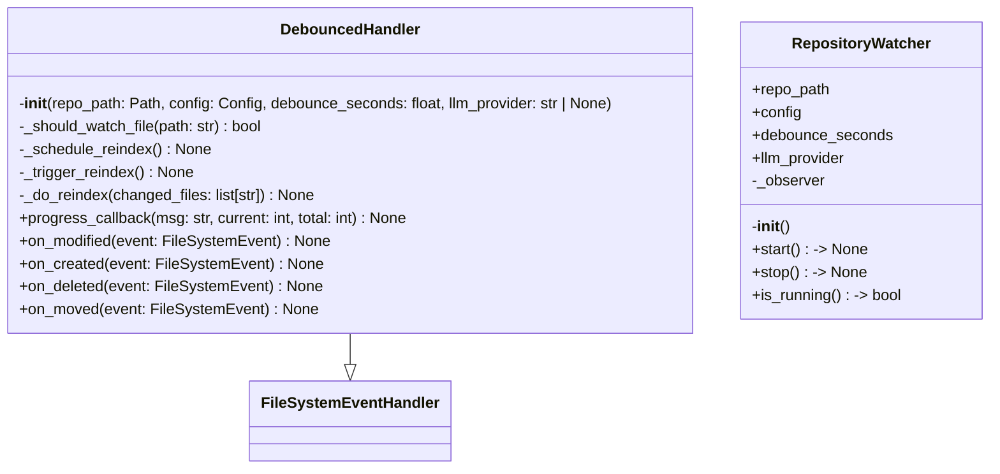

# watcher.py

## File Overview

This module provides file system watching functionality for automatically regenerating wiki documentation when repository files change. It uses the watchdog library to monitor file system events and triggers wiki regeneration with configurable debouncing.

## Functions

### main

```python
def main() -> None
```

Main entry point for the watch command. Sets up command-line argument parsing for the file watcher functionality.

**Parameters:**
- None

**Returns:**
- None

**Command-line Arguments:**
- `repo_path` (optional): Path to the repository to watch, defaults to current directory
- `--debounce`: Seconds to wait after changes before reindexing, defaults to 2.0

## Related Components

This module integrates with several other components of the local_deepwiki system:

- **[Config](config.md)**: Uses the [Config](config.md) class and [get_config](config.md) function for configuration management
- **[RepositoryIndexer](core/indexer.md)**: Works with the [RepositoryIndexer](core/indexer.md) class for processing repository changes
- **[WikiGenerator](generators/wiki.md)**: Integrates with the [generate_wiki](generators/wiki.md) function for documentation generation
- **Parser**: References EXTENSION_MAP from the parser module for file type handling

## Dependencies

The module relies on several external libraries:
- `watchdog`: For file system monitoring (FileSystemEvent, FileSystemEventHandler, Observer classes)
- `rich`: For console output formatting
- `argparse`: For command-line interface
- `asyncio`: For asynchronous operations
- `pathlib`: For path handling

## Usage Context

This module appears to be designed as a command-line tool that can be invoked to continuously monitor a repository for changes and automatically regenerate documentation when files are modified. The debouncing feature helps prevent excessive regeneration when multiple files are changed in quick succession.

## API Reference

### class `DebouncedHandler`

**Inherits from:** `FileSystemEventHandler`

File system event handler with debouncing.

**Methods:**


<details>
<summary>View Source (lines 35-235) | <a href="https://github.com/UrbanDiver/local-deepwiki-mcp/blob/main/src/local_deepwiki/watcher.py#L35-L235">GitHub</a></summary>

```python
class DebouncedHandler(FileSystemEventHandler):
    # Methods: __init__, _should_watch_file, _schedule_reindex, _trigger_reindex, _do_reindex, progress_callback, on_modified, on_created, on_deleted, on_moved
```

</details>

#### `__init__`

```python
def __init__(repo_path: Path, config: Config, debounce_seconds: float = 2.0, llm_provider: str | None = None)
```

Initialize the handler.


| [Parameter](generators/api_docs.md) | Type | Default | Description |
|-----------|------|---------|-------------|
| `repo_path` | `Path` | - | Path to the repository root. |
| `config` | [`Config`](config.md) | - | Configuration instance. |
| `debounce_seconds` | `float` | `2.0` | Seconds to wait after last change before triggering. |
| `llm_provider` | `str | None` | `None` | Optional LLM provider override. |


<details>
<summary>View Source (lines 38-59) | <a href="https://github.com/UrbanDiver/local-deepwiki-mcp/blob/main/src/local_deepwiki/watcher.py#L38-L59">GitHub</a></summary>

```python
def __init__(
        self,
        repo_path: Path,
        config: Config,
        debounce_seconds: float = 2.0,
        llm_provider: str | None = None,
    ):
        """Initialize the handler.

        Args:
            repo_path: Path to the repository root.
            config: Configuration instance.
            debounce_seconds: Seconds to wait after last change before triggering.
            llm_provider: Optional LLM provider override.
        """
        self.repo_path = repo_path
        self.config = config
        self.debounce_seconds = debounce_seconds
        self.llm_provider = llm_provider
        self._timer: Timer | None = None
        self._pending_files: set[str] = set()
        self._is_processing = False
```

</details>

#### `progress_callback`

```python
def progress_callback(msg: str, current: int, total: int) -> None
```


| [Parameter](generators/api_docs.md) | Type | Default | Description |
|-----------|------|---------|-------------|
| `msg` | `str` | - | - |
| `current` | `int` | - | - |
| `total` | `int` | - | - |


<details>
<summary>View Source (lines 141-145) | <a href="https://github.com/UrbanDiver/local-deepwiki-mcp/blob/main/src/local_deepwiki/watcher.py#L141-L145">GitHub</a></summary>

```python
def progress_callback(msg: str, current: int, total: int) -> None:
                if total > 0:
                    console.print(f"  [{current}/{total}] {msg}")
                else:
                    console.print(f"  {msg}")
```

</details>

#### `on_modified`

```python
def on_modified(event: FileSystemEvent) -> None
```

Handle file modification events.


| [Parameter](generators/api_docs.md) | Type | Default | Description |
|-----------|------|---------|-------------|
| `event` | `FileSystemEvent` | - | - |


<details>
<summary>View Source (lines 190-198) | <a href="https://github.com/UrbanDiver/local-deepwiki-mcp/blob/main/src/local_deepwiki/watcher.py#L190-L198">GitHub</a></summary>

```python
def on_modified(self, event: FileSystemEvent) -> None:
        """Handle file modification events."""
        if event.is_directory:
            return

        src_path = str(event.src_path)
        if self._should_watch_file(src_path):
            self._pending_files.add(src_path)
            self._schedule_reindex()
```

</details>

#### `on_created`

```python
def on_created(event: FileSystemEvent) -> None
```

Handle file creation events.


| [Parameter](generators/api_docs.md) | Type | Default | Description |
|-----------|------|---------|-------------|
| `event` | `FileSystemEvent` | - | - |


<details>
<summary>View Source (lines 200-208) | <a href="https://github.com/UrbanDiver/local-deepwiki-mcp/blob/main/src/local_deepwiki/watcher.py#L200-L208">GitHub</a></summary>

```python
def on_created(self, event: FileSystemEvent) -> None:
        """Handle file creation events."""
        if event.is_directory:
            return

        src_path = str(event.src_path)
        if self._should_watch_file(src_path):
            self._pending_files.add(src_path)
            self._schedule_reindex()
```

</details>

#### `on_deleted`

```python
def on_deleted(event: FileSystemEvent) -> None
```

Handle file deletion events.


| [Parameter](generators/api_docs.md) | Type | Default | Description |
|-----------|------|---------|-------------|
| `event` | `FileSystemEvent` | - | - |


<details>
<summary>View Source (lines 210-218) | <a href="https://github.com/UrbanDiver/local-deepwiki-mcp/blob/main/src/local_deepwiki/watcher.py#L210-L218">GitHub</a></summary>

```python
def on_deleted(self, event: FileSystemEvent) -> None:
        """Handle file deletion events."""
        if event.is_directory:
            return

        src_path = str(event.src_path)
        if self._should_watch_file(src_path):
            self._pending_files.add(src_path)
            self._schedule_reindex()
```

</details>

#### `on_moved`

```python
def on_moved(event: FileSystemEvent) -> None
```

Handle file move events.


| [Parameter](generators/api_docs.md) | Type | Default | Description |
|-----------|------|---------|-------------|
| `event` | `FileSystemEvent` | - | - |


<details>
<summary>View Source (lines 220-235) | <a href="https://github.com/UrbanDiver/local-deepwiki-mcp/blob/main/src/local_deepwiki/watcher.py#L220-L235">GitHub</a></summary>

```python
def on_moved(self, event: FileSystemEvent) -> None:
        """Handle file move events."""
        if event.is_directory:
            return

        # Check both source and destination
        src_path = str(event.src_path)
        if self._should_watch_file(src_path):
            self._pending_files.add(src_path)
            self._schedule_reindex()

        if hasattr(event, "dest_path"):
            dest_path = str(event.dest_path)
            if self._should_watch_file(dest_path):
                self._pending_files.add(dest_path)
                self._schedule_reindex()
```

</details>

### class `RepositoryWatcher`

Watches a repository for file changes and triggers reindexing.

**Methods:**


<details>
<summary>View Source (lines 238-290) | <a href="https://github.com/UrbanDiver/local-deepwiki-mcp/blob/main/src/local_deepwiki/watcher.py#L238-L290">GitHub</a></summary>

```python
class RepositoryWatcher:
    """Watches a repository for file changes and triggers reindexing."""

    def __init__(
        self,
        repo_path: Path,
        config: Config | None = None,
        debounce_seconds: float = 2.0,
        llm_provider: str | None = None,
    ):
        """Initialize the watcher.

        Args:
            repo_path: Path to the repository to watch.
            config: Optional configuration.
            debounce_seconds: Seconds to wait after changes before reindexing.
            llm_provider: Optional LLM provider override.
        """
        self.repo_path = repo_path.resolve()
        self.config = config or get_config()
        self.debounce_seconds = debounce_seconds
        self.llm_provider = llm_provider
        self._observer: BaseObserver | None = None

    def start(self) -> None:
        """Start watching the repository."""
        logger.info(f"Starting file watcher for {self.repo_path}")

        handler = DebouncedHandler(
            repo_path=self.repo_path,
            config=self.config,
            debounce_seconds=self.debounce_seconds,
            llm_provider=self.llm_provider,
        )

        observer = Observer()
        observer.schedule(handler, str(self.repo_path), recursive=True)
        observer.start()
        self._observer = observer
        logger.debug("File watcher started successfully")

    def stop(self) -> None:
        """Stop watching the repository."""
        logger.info("Stopping file watcher")
        if self._observer:
            self._observer.stop()
            self._observer.join()
            self._observer = None
            logger.debug("File watcher stopped")

    def is_running(self) -> bool:
        """Check if the watcher is running."""
        return self._observer is not None and self._observer.is_alive()
```

</details>

#### `__init__`

```python
def __init__(repo_path: Path, config: Config | None = None, debounce_seconds: float = 2.0, llm_provider: str | None = None)
```

Initialize the watcher.


| [Parameter](generators/api_docs.md) | Type | Default | Description |
|-----------|------|---------|-------------|
| `repo_path` | `Path` | - | Path to the repository to watch. |
| `config` | `Config | None` | `None` | Optional configuration. |
| `debounce_seconds` | `float` | `2.0` | Seconds to wait after changes before reindexing. |
| `llm_provider` | `str | None` | `None` | Optional LLM provider override. |


<details>
<summary>View Source (lines 238-290) | <a href="https://github.com/UrbanDiver/local-deepwiki-mcp/blob/main/src/local_deepwiki/watcher.py#L238-L290">GitHub</a></summary>

```python
class RepositoryWatcher:
    """Watches a repository for file changes and triggers reindexing."""

    def __init__(
        self,
        repo_path: Path,
        config: Config | None = None,
        debounce_seconds: float = 2.0,
        llm_provider: str | None = None,
    ):
        """Initialize the watcher.

        Args:
            repo_path: Path to the repository to watch.
            config: Optional configuration.
            debounce_seconds: Seconds to wait after changes before reindexing.
            llm_provider: Optional LLM provider override.
        """
        self.repo_path = repo_path.resolve()
        self.config = config or get_config()
        self.debounce_seconds = debounce_seconds
        self.llm_provider = llm_provider
        self._observer: BaseObserver | None = None

    def start(self) -> None:
        """Start watching the repository."""
        logger.info(f"Starting file watcher for {self.repo_path}")

        handler = DebouncedHandler(
            repo_path=self.repo_path,
            config=self.config,
            debounce_seconds=self.debounce_seconds,
            llm_provider=self.llm_provider,
        )

        observer = Observer()
        observer.schedule(handler, str(self.repo_path), recursive=True)
        observer.start()
        self._observer = observer
        logger.debug("File watcher started successfully")

    def stop(self) -> None:
        """Stop watching the repository."""
        logger.info("Stopping file watcher")
        if self._observer:
            self._observer.stop()
            self._observer.join()
            self._observer = None
            logger.debug("File watcher stopped")

    def is_running(self) -> bool:
        """Check if the watcher is running."""
        return self._observer is not None and self._observer.is_alive()
```

</details>

#### `start`

```python
def start() -> None
```

Start watching the repository.


<details>
<summary>View Source (lines 238-290) | <a href="https://github.com/UrbanDiver/local-deepwiki-mcp/blob/main/src/local_deepwiki/watcher.py#L238-L290">GitHub</a></summary>

```python
class RepositoryWatcher:
    """Watches a repository for file changes and triggers reindexing."""

    def __init__(
        self,
        repo_path: Path,
        config: Config | None = None,
        debounce_seconds: float = 2.0,
        llm_provider: str | None = None,
    ):
        """Initialize the watcher.

        Args:
            repo_path: Path to the repository to watch.
            config: Optional configuration.
            debounce_seconds: Seconds to wait after changes before reindexing.
            llm_provider: Optional LLM provider override.
        """
        self.repo_path = repo_path.resolve()
        self.config = config or get_config()
        self.debounce_seconds = debounce_seconds
        self.llm_provider = llm_provider
        self._observer: BaseObserver | None = None

    def start(self) -> None:
        """Start watching the repository."""
        logger.info(f"Starting file watcher for {self.repo_path}")

        handler = DebouncedHandler(
            repo_path=self.repo_path,
            config=self.config,
            debounce_seconds=self.debounce_seconds,
            llm_provider=self.llm_provider,
        )

        observer = Observer()
        observer.schedule(handler, str(self.repo_path), recursive=True)
        observer.start()
        self._observer = observer
        logger.debug("File watcher started successfully")

    def stop(self) -> None:
        """Stop watching the repository."""
        logger.info("Stopping file watcher")
        if self._observer:
            self._observer.stop()
            self._observer.join()
            self._observer = None
            logger.debug("File watcher stopped")

    def is_running(self) -> bool:
        """Check if the watcher is running."""
        return self._observer is not None and self._observer.is_alive()
```

</details>

#### `stop`

```python
def stop() -> None
```

Stop watching the repository.


<details>
<summary>View Source (lines 238-290) | <a href="https://github.com/UrbanDiver/local-deepwiki-mcp/blob/main/src/local_deepwiki/watcher.py#L238-L290">GitHub</a></summary>

```python
class RepositoryWatcher:
    """Watches a repository for file changes and triggers reindexing."""

    def __init__(
        self,
        repo_path: Path,
        config: Config | None = None,
        debounce_seconds: float = 2.0,
        llm_provider: str | None = None,
    ):
        """Initialize the watcher.

        Args:
            repo_path: Path to the repository to watch.
            config: Optional configuration.
            debounce_seconds: Seconds to wait after changes before reindexing.
            llm_provider: Optional LLM provider override.
        """
        self.repo_path = repo_path.resolve()
        self.config = config or get_config()
        self.debounce_seconds = debounce_seconds
        self.llm_provider = llm_provider
        self._observer: BaseObserver | None = None

    def start(self) -> None:
        """Start watching the repository."""
        logger.info(f"Starting file watcher for {self.repo_path}")

        handler = DebouncedHandler(
            repo_path=self.repo_path,
            config=self.config,
            debounce_seconds=self.debounce_seconds,
            llm_provider=self.llm_provider,
        )

        observer = Observer()
        observer.schedule(handler, str(self.repo_path), recursive=True)
        observer.start()
        self._observer = observer
        logger.debug("File watcher started successfully")

    def stop(self) -> None:
        """Stop watching the repository."""
        logger.info("Stopping file watcher")
        if self._observer:
            self._observer.stop()
            self._observer.join()
            self._observer = None
            logger.debug("File watcher stopped")

    def is_running(self) -> bool:
        """Check if the watcher is running."""
        return self._observer is not None and self._observer.is_alive()
```

</details>

#### `is_running`

```python
def is_running() -> bool
```

Check if the watcher is running.


---


<details>
<summary>View Source (lines 238-290) | <a href="https://github.com/UrbanDiver/local-deepwiki-mcp/blob/main/src/local_deepwiki/watcher.py#L238-L290">GitHub</a></summary>

```python
class RepositoryWatcher:
    """Watches a repository for file changes and triggers reindexing."""

    def __init__(
        self,
        repo_path: Path,
        config: Config | None = None,
        debounce_seconds: float = 2.0,
        llm_provider: str | None = None,
    ):
        """Initialize the watcher.

        Args:
            repo_path: Path to the repository to watch.
            config: Optional configuration.
            debounce_seconds: Seconds to wait after changes before reindexing.
            llm_provider: Optional LLM provider override.
        """
        self.repo_path = repo_path.resolve()
        self.config = config or get_config()
        self.debounce_seconds = debounce_seconds
        self.llm_provider = llm_provider
        self._observer: BaseObserver | None = None

    def start(self) -> None:
        """Start watching the repository."""
        logger.info(f"Starting file watcher for {self.repo_path}")

        handler = DebouncedHandler(
            repo_path=self.repo_path,
            config=self.config,
            debounce_seconds=self.debounce_seconds,
            llm_provider=self.llm_provider,
        )

        observer = Observer()
        observer.schedule(handler, str(self.repo_path), recursive=True)
        observer.start()
        self._observer = observer
        logger.debug("File watcher started successfully")

    def stop(self) -> None:
        """Stop watching the repository."""
        logger.info("Stopping file watcher")
        if self._observer:
            self._observer.stop()
            self._observer.join()
            self._observer = None
            logger.debug("File watcher stopped")

    def is_running(self) -> bool:
        """Check if the watcher is running."""
        return self._observer is not None and self._observer.is_alive()
```

</details>

### Functions

#### `initial_index`

```python
async def initial_index(repo_path: Path, config: Config, llm_provider: str | None = None, full_rebuild: bool = False) -> None
```

Perform initial indexing before starting watch mode.


| [Parameter](generators/api_docs.md) | Type | Default | Description |
|-----------|------|---------|-------------|
| `repo_path` | `Path` | - | Path to the repository. |
| `config` | [`Config`](config.md) | - | Configuration instance. |
| `llm_provider` | `str | None` | `None` | Optional LLM provider override. |
| `full_rebuild` | `bool` | `False` | Whether to do a full rebuild. |

**Returns:** `None`


<details>
<summary>View Source (lines 293-343) | <a href="https://github.com/UrbanDiver/local-deepwiki-mcp/blob/main/src/local_deepwiki/watcher.py#L293-L343">GitHub</a></summary>

```python
async def initial_index(
    repo_path: Path,
    config: Config,
    llm_provider: str | None = None,
    full_rebuild: bool = False,
) -> None:
    """Perform initial indexing before starting watch mode.

    Args:
        repo_path: Path to the repository.
        config: Configuration instance.
        llm_provider: Optional LLM provider override.
        full_rebuild: Whether to do a full rebuild.
    """
    console.print("[yellow]Running initial index...[/yellow]")

    indexer = RepositoryIndexer(repo_path=repo_path, config=config)

    def progress_callback(msg: str, current: int, total: int) -> None:
        if total > 0:
            console.print(f"  [{current}/{total}] {msg}")
        else:
            console.print(f"  {msg}")

    start_time = time.time()
    status = await indexer.index(
        full_rebuild=full_rebuild,
        progress_callback=progress_callback,
    )

    console.print(
        f"[green]Indexed {status.total_files} files, {status.total_chunks} chunks[/green]"
    )

    # Generate wiki
    console.print("[yellow]Generating wiki...[/yellow]")

    wiki_structure = await generate_wiki(
        repo_path=repo_path,
        wiki_path=indexer.wiki_path,
        vector_store=indexer.vector_store,
        index_status=status,
        config=config,
        llm_provider=llm_provider,
        progress_callback=progress_callback,
        full_rebuild=full_rebuild,
    )

    total_time = time.time() - start_time
    console.print(f"[green]Generated {len(wiki_structure.pages)} wiki pages[/green]")
    console.print(f"[bold green]Initial index complete in {total_time:.1f}s[/bold green]")
```

</details>

#### `progress_callback`

```python
def progress_callback(msg: str, current: int, total: int) -> None
```


| [Parameter](generators/api_docs.md) | Type | Default | Description |
|-----------|------|---------|-------------|
| `msg` | `str` | - | - |
| `current` | `int` | - | - |
| `total` | `int` | - | - |

**Returns:** `None`


<details>
<summary>View Source (lines 311-315) | <a href="https://github.com/UrbanDiver/local-deepwiki-mcp/blob/main/src/local_deepwiki/watcher.py#L311-L315">GitHub</a></summary>

```python
def progress_callback(msg: str, current: int, total: int) -> None:
        if total > 0:
            console.print(f"  [{current}/{total}] {msg}")
        else:
            console.print(f"  {msg}")
```

</details>

#### `main`

```python
def main() -> None
```

Main entry point for the watch command.

**Returns:** `None`


<details>
<summary>View Source (lines 346-433) | <a href="https://github.com/UrbanDiver/local-deepwiki-mcp/blob/main/src/local_deepwiki/watcher.py#L346-L433">GitHub</a></summary>

```python
def main() -> None:
    """Main entry point for the watch command."""
    parser = argparse.ArgumentParser(
        description="Watch a repository for changes and auto-regenerate wiki documentation."
    )
    parser.add_argument(
        "repo_path",
        type=str,
        nargs="?",
        default=".",
        help="Path to the repository to watch (default: current directory)",
    )
    parser.add_argument(
        "--debounce",
        type=float,
        default=2.0,
        help="Seconds to wait after changes before reindexing (default: 2.0)",
    )
    parser.add_argument(
        "--llm",
        type=str,
        choices=["ollama", "anthropic", "openai"],
        help="LLM provider for wiki generation",
    )
    parser.add_argument(
        "--full-rebuild",
        action="store_true",
        help="Perform a full rebuild on startup instead of incremental",
    )
    parser.add_argument(
        "--skip-initial",
        action="store_true",
        help="Skip initial indexing, just start watching",
    )

    args = parser.parse_args()

    repo_path = Path(args.repo_path).resolve()
    if not repo_path.exists():
        console.print(f"[red]Error: Path does not exist: {repo_path}[/red]")
        sys.exit(1)

    if not repo_path.is_dir():
        console.print(f"[red]Error: Path is not a directory: {repo_path}[/red]")
        sys.exit(1)

    config = get_config()

    console.print()
    console.print("[bold]DeepWiki Watch Mode[/bold]")
    console.print(f"Repository: [cyan]{repo_path}[/cyan]")
    console.print(f"Debounce: [cyan]{args.debounce}s[/cyan]")
    console.print(f"LLM Provider: [cyan]{args.llm or config.llm.provider}[/cyan]")
    console.print()

    # Run initial index unless skipped
    if not args.skip_initial:
        asyncio.run(
            initial_index(
                repo_path=repo_path,
                config=config,
                llm_provider=args.llm,
                full_rebuild=args.full_rebuild,
            )
        )

    # Start watching
    console.print()
    console.rule("[bold blue]Starting Watch Mode[/bold blue]")
    console.print("[dim]Watching for changes... (Ctrl+C to stop)[/dim]")
    console.print()

    watcher = RepositoryWatcher(
        repo_path=repo_path,
        config=config,
        debounce_seconds=args.debounce,
        llm_provider=args.llm,
    )

    try:
        watcher.start()
        while watcher.is_running():
            time.sleep(1)
    except KeyboardInterrupt:
        console.print()
        console.print("[yellow]Stopping watcher...[/yellow]")
        watcher.stop()
        console.print("[green]Done.[/green]")
```

</details>

## Class Diagram



## Call Graph

```mermaid
flowchart TD
    N0[ArgumentParser]
    N1[DebouncedHandler._do_reindex]
    N2[DebouncedHandler._schedule_...]
    N3[DebouncedHandler._should_wa...]
    N4[DebouncedHandler._trigger_r...]
    N5[DebouncedHandler.on_created]
    N6[DebouncedHandler.on_deleted]
    N7[DebouncedHandler.on_modified]
    N8[DebouncedHandler.on_moved]
    N9[Path]
    N10[RepositoryIndexer]
    N11[RepositoryWatcher.__init__]
    N12[RepositoryWatcher.start]
    N13[_schedule_reindex]
    N14[_should_watch_file]
    N15[add]
    N16[add_argument]
    N17[exists]
    N18[generate_wiki]
    N19[get_config]
    N20[initial_index]
    N21[main]
    N22[parse_args]
    N23[relative_to]
    N24[resolve]
    N25[rule]
    N26[run]
    N27[start]
    N28[stop]
    N29[time]
    N20 --> N10
    N20 --> N29
    N20 --> N18
    N21 --> N0
    N21 --> N16
    N21 --> N22
    N21 --> N24
    N21 --> N9
    N21 --> N17
    N21 --> N19
    N21 --> N26
    N21 --> N20
    N21 --> N25
    N21 --> N27
    N21 --> N28
    N3 --> N9
    N3 --> N23
    N2 --> N27
    N4 --> N13
    N4 --> N26
    N1 --> N25
    N1 --> N23
    N1 --> N9
    N1 --> N10
    N1 --> N29
    N1 --> N18
    N7 --> N14
    N7 --> N15
    N7 --> N13
    N5 --> N14
    N5 --> N15
    N5 --> N13
    N6 --> N14
    N6 --> N15
    N6 --> N13
    N8 --> N14
    N8 --> N15
    N8 --> N13
    N11 --> N24
    N11 --> N19
    N12 --> N27
    classDef func fill:#e1f5fe
    class N0,N9,N10,N13,N14,N15,N16,N17,N18,N19,N20,N21,N22,N23,N24,N25,N26,N27,N28,N29 func
    classDef method fill:#fff3e0
    class N1,N2,N3,N4,N5,N6,N7,N8,N11,N12 method
```



## Used By

Functions and methods in this file and their callers:

- **`ArgumentParser`**: called by `main`
- **`DebouncedHandler`**: called by `RepositoryWatcher.start`
- **`Observer`**: called by `RepositoryWatcher.start`
- **`Path`**: called by `DebouncedHandler._do_reindex`, `DebouncedHandler._should_watch_file`, `main`
- **[`RepositoryIndexer`](core/indexer.md)**: called by `DebouncedHandler._do_reindex`, `initial_index`
- **`RepositoryWatcher`**: called by `main`
- **`Timer`**: called by `DebouncedHandler._schedule_reindex`
- **`_do_reindex`**: called by `DebouncedHandler._trigger_reindex`
- **`_schedule_reindex`**: called by `DebouncedHandler._trigger_reindex`, `DebouncedHandler.on_created`, `DebouncedHandler.on_deleted`, `DebouncedHandler.on_modified`, `DebouncedHandler.on_moved`
- **`_should_watch_file`**: called by `DebouncedHandler.on_created`, `DebouncedHandler.on_deleted`, `DebouncedHandler.on_modified`, `DebouncedHandler.on_moved`
- **`add`**: called by `DebouncedHandler.on_created`, `DebouncedHandler.on_deleted`, `DebouncedHandler.on_modified`, `DebouncedHandler.on_moved`
- **`add_argument`**: called by `main`
- **`cancel`**: called by `DebouncedHandler._schedule_reindex`
- **`exception`**: called by `DebouncedHandler._do_reindex`
- **`exists`**: called by `main`
- **`exit`**: called by `main`
- **`fnmatch`**: called by `DebouncedHandler._should_watch_file`
- **[`generate_wiki`](generators/wiki.md)**: called by `DebouncedHandler._do_reindex`, `initial_index`
- **[`get_config`](config.md)**: called by `RepositoryWatcher.__init__`, `main`
- **`initial_index`**: called by `main`
- **`is_alive`**: called by `RepositoryWatcher.is_running`
- **`is_dir`**: called by `main`
- **`is_running`**: called by `main`
- **`parse_args`**: called by `main`
- **`relative_to`**: called by `DebouncedHandler._do_reindex`, `DebouncedHandler._should_watch_file`
- **`resolve`**: called by `RepositoryWatcher.__init__`, `main`
- **`rule`**: called by `DebouncedHandler._do_reindex`, `main`
- **`run`**: called by `DebouncedHandler._trigger_reindex`, `main`
- **`schedule`**: called by `RepositoryWatcher.start`
- **`sleep`**: called by `main`
- **`start`**: called by `DebouncedHandler._schedule_reindex`, `RepositoryWatcher.start`, `main`
- **`stop`**: called by `RepositoryWatcher.stop`, `main`
- **`time`**: called by `DebouncedHandler._do_reindex`, `initial_index`

## Usage Examples

*Examples extracted from test files*

### Test that Python files are watched

From `test_watcher.py::TestDebouncedHandler::test_should_watch_python_file`:

```python
test_file = tmp_path / "test.py"
test_file.touch()
assert handler._should_watch_file(str(test_file)) is True
```

### Test that TypeScript files are watched

From `test_watcher.py::TestDebouncedHandler::test_should_watch_typescript_file`:

```python
test_file = tmp_path / "test.ts"
test_file.touch()
assert handler._should_watch_file(str(test_file)) is True
```

### Test creating a watcher

From `test_watcher.py::TestRepositoryWatcher::test_create_watcher`:

```python
watcher = RepositoryWatcher(repo_path=tmp_path)
assert watcher.repo_path == tmp_path
assert watcher.debounce_seconds == 2.0
assert not watcher.is_running()
```

### Test creating a watcher

From `test_watcher.py::TestRepositoryWatcher::test_create_watcher`:

```python
watcher = RepositoryWatcher(repo_path=tmp_path)
assert watcher.repo_path == tmp_path
assert watcher.debounce_seconds == 2.0
assert not watcher.is_running()
```

### Test creating a watcher with options

From `test_watcher.py::TestRepositoryWatcher::test_create_watcher_with_options`:

```python
watcher = RepositoryWatcher(
    repo_path=tmp_path,
    config=config,
    debounce_seconds=5.0,
    llm_provider="anthropic",
)
assert watcher.debounce_seconds == 5.0
assert watcher.llm_provider == "anthropic"
```


## Last Modified

| Entity | Type | Author | Date | Commit |
|--------|------|--------|------|--------|
| `DebouncedHandler` | class | Brian Breidenbach | yesterday | `8078321` Fix ruff and pyright code q... |
| `on_modified` | method | Brian Breidenbach | yesterday | `8078321` Fix ruff and pyright code q... |
| `on_created` | method | Brian Breidenbach | yesterday | `8078321` Fix ruff and pyright code q... |
| `on_deleted` | method | Brian Breidenbach | yesterday | `8078321` Fix ruff and pyright code q... |
| `on_moved` | method | Brian Breidenbach | yesterday | `8078321` Fix ruff and pyright code q... |
| `RepositoryWatcher` | class | Brian Breidenbach | yesterday | `8078321` Fix ruff and pyright code q... |
| `_do_reindex` | method | Brian Breidenbach | yesterday | `815ed5f` Fix remaining generic excep... |
| `_should_watch_file` | method | Brian Breidenbach | 3 days ago | `c568951` Add input validation, type ... |
| `initial_index` | function | Brian Breidenbach | 3 days ago | `c568951` Add input validation, type ... |
| `main` | function | Brian Breidenbach | 3 days ago | `c568951` Add input validation, type ... |
| `__init__` | method | Brian Breidenbach | 5 days ago | `ce31583` Add watch mode for auto-rei... |
| `_schedule_reindex` | method | Brian Breidenbach | 5 days ago | `ce31583` Add watch mode for auto-rei... |
| `_trigger_reindex` | method | Brian Breidenbach | 5 days ago | `ce31583` Add watch mode for auto-rei... |
| `progress_callback` | method | Brian Breidenbach | 5 days ago | `ce31583` Add watch mode for auto-rei... |
| `progress_callback` | function | Brian Breidenbach | 5 days ago | `ce31583` Add watch mode for auto-rei... |

## Additional Source Code

Source code for functions and methods not listed in the API Reference above.

#### `_should_watch_file`

<details>
<summary>View Source (lines 61-89) | <a href="https://github.com/UrbanDiver/local-deepwiki-mcp/blob/main/src/local_deepwiki/watcher.py#L61-L89">GitHub</a></summary>

```python
def _should_watch_file(self, path: str) -> bool:
        """Check if a file should trigger reindexing.

        Args:
            path: Absolute path to the file.

        Returns:
            True if the file should be watched.
        """
        file_path = Path(path)

        # Check extension
        if file_path.suffix.lower() not in WATCHED_EXTENSIONS:
            logger.debug(f"Ignoring file with unsupported extension: {path}")
            return False

        # Check exclude patterns
        try:
            rel_path = str(file_path.relative_to(self.repo_path))
        except ValueError:
            logger.debug(f"File outside repo path: {path}")
            return False

        for pattern in self.config.parsing.exclude_patterns:
            if fnmatch.fnmatch(rel_path, pattern):
                logger.debug(f"File matches exclude pattern '{pattern}': {rel_path}")
                return False

        return True
```

</details>


#### `_schedule_reindex`

<details>
<summary>View Source (lines 91-97) | <a href="https://github.com/UrbanDiver/local-deepwiki-mcp/blob/main/src/local_deepwiki/watcher.py#L91-L97">GitHub</a></summary>

```python
def _schedule_reindex(self) -> None:
        """Schedule a reindex after debounce period."""
        if self._timer:
            self._timer.cancel()

        self._timer = Timer(self.debounce_seconds, self._trigger_reindex)
        self._timer.start()
```

</details>


#### `_trigger_reindex`

<details>
<summary>View Source (lines 99-111) | <a href="https://github.com/UrbanDiver/local-deepwiki-mcp/blob/main/src/local_deepwiki/watcher.py#L99-L111">GitHub</a></summary>

```python
def _trigger_reindex(self) -> None:
        """Trigger the actual reindex operation."""
        if self._is_processing:
            # Re-schedule if already processing
            self._schedule_reindex()
            return

        files = list(self._pending_files)
        self._pending_files.clear()

        if files:
            # Run in asyncio event loop
            asyncio.run(self._do_reindex(files))
```

</details>


#### `_do_reindex`

<details>
<summary>View Source (lines 113-188) | <a href="https://github.com/UrbanDiver/local-deepwiki-mcp/blob/main/src/local_deepwiki/watcher.py#L113-L188">GitHub</a></summary>

```python
async def _do_reindex(self, changed_files: list[str]) -> None:
        """Perform the reindex operation.

        Args:
            changed_files: List of changed file paths.
        """
        self._is_processing = True
        logger.info(f"Starting reindex for {len(changed_files)} changed files")

        try:
            console.print()
            console.rule("[bold blue]Changes Detected[/bold blue]")
            for f in changed_files[:10]:  # Show first 10
                rel_path = Path(f).relative_to(self.repo_path)
                console.print(f"  [dim]- {rel_path}[/dim]")
            if len(changed_files) > 10:
                console.print(f"  [dim]... and {len(changed_files) - 10} more[/dim]")

            console.print()
            console.print("[yellow]Starting incremental reindex...[/yellow]")

            # Create indexer
            indexer = RepositoryIndexer(
                repo_path=self.repo_path,
                config=self.config,
            )

            # Progress callback
            def progress_callback(msg: str, current: int, total: int) -> None:
                if total > 0:
                    console.print(f"  [{current}/{total}] {msg}")
                else:
                    console.print(f"  {msg}")

            # Run incremental index
            start_time = time.time()
            status = await indexer.index(
                full_rebuild=False,
                progress_callback=progress_callback,
            )

            index_time = time.time() - start_time
            console.print(f"[green]Indexed {status.total_files} files in {index_time:.1f}s[/green]")

            # Generate wiki
            console.print("[yellow]Regenerating wiki...[/yellow]")

            wiki_start = time.time()
            wiki_structure = await generate_wiki(
                repo_path=self.repo_path,
                wiki_path=indexer.wiki_path,
                vector_store=indexer.vector_store,
                index_status=status,
                config=self.config,
                llm_provider=self.llm_provider,
                progress_callback=progress_callback,
                full_rebuild=False,
            )

            wiki_time = time.time() - wiki_start
            console.print(
                f"[green]Generated {len(wiki_structure.pages)} pages in {wiki_time:.1f}s[/green]"
            )

            total_time = time.time() - start_time
            console.print()
            console.print(f"[bold green]Done in {total_time:.1f}s[/bold green]")
            console.rule()
            console.print("[dim]Watching for changes... (Ctrl+C to stop)[/dim]")

        except Exception as e:  # noqa: BLE001 - Keep watcher alive despite errors
            logger.exception(f"Error during reindex: {e}")
            console.print(f"[red]Error during reindex: {e}[/red]")

        finally:
            self._is_processing = False
```

</details>

## Relevant Source Files

- `src/local_deepwiki/watcher.py:35-235`
