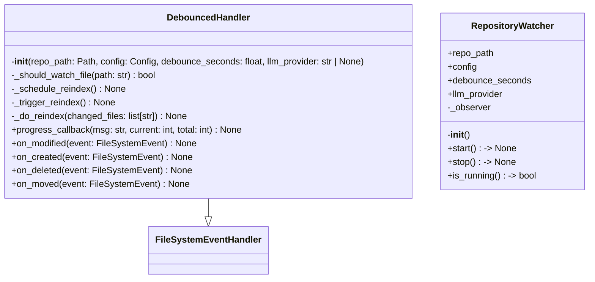

# watcher.py

## File Overview

This file implements a file system watcher that monitors repository changes and automatically regenerates wiki documentation. It uses the watchdog library to detect file system events and triggers reindexing when relevant files are modified.

## Functions

### main()

Main entry point for the watch command that sets up command-line argument parsing for the file watcher.

**Parameters:**
- None

**Returns:**
- `None`

**Command-line Arguments:**
- `repo_path` (optional): Path to the repository to watch (defaults to current directory)
- `--debounce`: Seconds to wait after changes before reindexing (default: 2.0)

## Usage Examples

The main function can be called directly to start the file watcher:

```python
from local_deepwiki.watcher import main

# Start the watcher
main()
```

## Related Components

This module integrates with several other components based on the imports:

- **[Config](config.md)**: Uses [get_config](config.md) function and [Config](config.md) class for configuration management
- **RepositoryIndexer**: Core indexing functionality from the indexer module
- **EXTENSION_MAP**: File extension mapping from the parser module
- **[generate_wiki](generators/wiki.md)**: Wiki generation functionality from the generators module
- **get_logger**: Logging utilities from the logging module

The module also uses external libraries:
- `watchdog` for file system monitoring
- `rich.console` for console output
- `argparse` for command-line interface
- `asyncio` for asynchronous operations
- `pathlib` for path handling

## API Reference

### class `DebouncedHandler`

**Inherits from:** `FileSystemEventHandler`

File system event handler with debouncing.

**Methods:**

#### `__init__`

```python
def __init__(repo_path: Path, config: Config, debounce_seconds: float = 2.0, llm_provider: str | None = None)
```

Initialize the handler.


| [Parameter](generators/api_docs.md) | Type | Default | Description |
|-----------|------|---------|-------------|
| `repo_path` | `Path` | - | Path to the repository root. |
| `config` | [`Config`](config.md) | - | Configuration instance. |
| `debounce_seconds` | `float` | `2.0` | Seconds to wait after last change before triggering. |
| `llm_provider` | `str | None` | `None` | Optional LLM provider override. |

#### `progress_callback`

```python
def progress_callback(msg: str, current: int, total: int) -> None
```


| [Parameter](generators/api_docs.md) | Type | Default | Description |
|-----------|------|---------|-------------|
| `msg` | `str` | - | - |
| `current` | `int` | - | - |
| `total` | `int` | - | - |

#### `on_modified`

```python
def on_modified(event: FileSystemEvent) -> None
```

Handle file modification events.


| [Parameter](generators/api_docs.md) | Type | Default | Description |
|-----------|------|---------|-------------|
| `event` | `FileSystemEvent` | - | - |

#### `on_created`

```python
def on_created(event: FileSystemEvent) -> None
```

Handle file creation events.


| [Parameter](generators/api_docs.md) | Type | Default | Description |
|-----------|------|---------|-------------|
| `event` | `FileSystemEvent` | - | - |

#### `on_deleted`

```python
def on_deleted(event: FileSystemEvent) -> None
```

Handle file deletion events.


| [Parameter](generators/api_docs.md) | Type | Default | Description |
|-----------|------|---------|-------------|
| `event` | `FileSystemEvent` | - | - |

#### `on_moved`

```python
def on_moved(event: FileSystemEvent) -> None
```

Handle file move events.


| [Parameter](generators/api_docs.md) | Type | Default | Description |
|-----------|------|---------|-------------|
| `event` | `FileSystemEvent` | - | - |


### class `RepositoryWatcher`

Watches a repository for file changes and triggers reindexing.

**Methods:**

#### `__init__`

```python
def __init__(repo_path: Path, config: Config | None = None, debounce_seconds: float = 2.0, llm_provider: str | None = None)
```

Initialize the watcher.


| [Parameter](generators/api_docs.md) | Type | Default | Description |
|-----------|------|---------|-------------|
| `repo_path` | `Path` | - | Path to the repository to watch. |
| `config` | `Config | None` | `None` | Optional configuration. |
| `debounce_seconds` | `float` | `2.0` | Seconds to wait after changes before reindexing. |
| `llm_provider` | `str | None` | `None` | Optional LLM provider override. |

#### `start`

```python
def start() -> None
```

Start watching the repository.

#### `stop`

```python
def stop() -> None
```

Stop watching the repository.

#### `is_running`

```python
def is_running() -> bool
```

Check if the watcher is running.


---

### Functions

#### `initial_index`

```python
async def initial_index(repo_path: Path, config: Config, llm_provider: str | None = None, full_rebuild: bool = False) -> None
```

Perform initial indexing before starting watch mode.


| [Parameter](generators/api_docs.md) | Type | Default | Description |
|-----------|------|---------|-------------|
| `repo_path` | `Path` | - | Path to the repository. |
| `config` | [`Config`](config.md) | - | Configuration instance. |
| `llm_provider` | `str | None` | `None` | Optional LLM provider override. |
| `full_rebuild` | `bool` | `False` | Whether to do a full rebuild. |

**Returns:** `None`


#### `progress_callback`

```python
def progress_callback(msg: str, current: int, total: int) -> None
```


| [Parameter](generators/api_docs.md) | Type | Default | Description |
|-----------|------|---------|-------------|
| `msg` | `str` | - | - |
| `current` | `int` | - | - |
| `total` | `int` | - | - |

**Returns:** `None`


#### `main`

```python
def main() -> None
```

Main entry point for the watch command.

**Returns:** `None`


## Class Diagram



## Call Graph

```mermaid
flowchart TD
    N0[ArgumentParser]
    N1[DebouncedHandler._do_reindex]
    N2[DebouncedHandler._schedule_...]
    N3[DebouncedHandler._should_wa...]
    N4[DebouncedHandler._trigger_r...]
    N5[DebouncedHandler.on_created]
    N6[DebouncedHandler.on_deleted]
    N7[DebouncedHandler.on_modified]
    N8[DebouncedHandler.on_moved]
    N9[Path]
    N10[RepositoryIndexer]
    N11[RepositoryWatcher.__init__]
    N12[RepositoryWatcher.start]
    N13[_schedule_reindex]
    N14[_should_watch_file]
    N15[add]
    N16[add_argument]
    N17[exists]
    N18[generate_wiki]
    N19[get_config]
    N20[initial_index]
    N21[main]
    N22[parse_args]
    N23[relative_to]
    N24[resolve]
    N25[rule]
    N26[run]
    N27[start]
    N28[stop]
    N29[time]
    N20 --> N10
    N20 --> N29
    N20 --> N18
    N21 --> N0
    N21 --> N16
    N21 --> N22
    N21 --> N24
    N21 --> N9
    N21 --> N17
    N21 --> N19
    N21 --> N26
    N21 --> N20
    N21 --> N25
    N21 --> N27
    N21 --> N28
    N3 --> N9
    N3 --> N23
    N2 --> N27
    N4 --> N13
    N4 --> N26
    N1 --> N25
    N1 --> N23
    N1 --> N9
    N1 --> N10
    N1 --> N29
    N1 --> N18
    N7 --> N14
    N7 --> N15
    N7 --> N13
    N5 --> N14
    N5 --> N15
    N5 --> N13
    N6 --> N14
    N6 --> N15
    N6 --> N13
    N8 --> N14
    N8 --> N15
    N8 --> N13
    N11 --> N24
    N11 --> N19
    N12 --> N27
    classDef func fill:#e1f5fe
    class N0,N9,N10,N13,N14,N15,N16,N17,N18,N19,N20,N21,N22,N23,N24,N25,N26,N27,N28,N29 func
    classDef method fill:#fff3e0
    class N1,N2,N3,N4,N5,N6,N7,N8,N11,N12 method
```



## Relevant Source Files

- `src/local_deepwiki/watcher.py:29-223`
