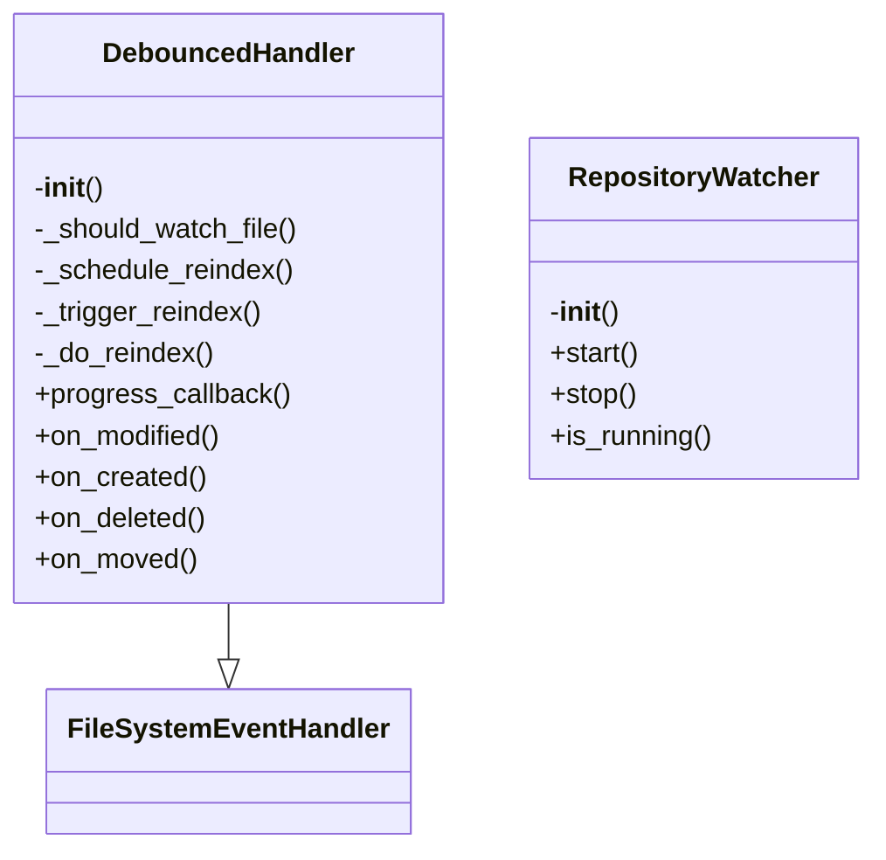

# Watcher Module Documentation

## File Overview

The watcher.py file implements a file system watcher that monitors repository changes and automatically regenerates wiki documentation. It uses the watchdog library to observe file system events and integrates with the local_deepwiki core components to index and generate documentation.

This file serves as the entry point for the watch command functionality, coordinating file monitoring with the indexing and generation processes. It works closely with the RepositoryIndexer, [WikiGenerator](generators/wiki.md), and configuration management components.

## Classes

### FileSystemEventHandler

The FileSystemEventHandler class extends watchdog's FileSystemEventHandler to provide custom behavior for handling file system events. It tracks file changes and schedules reindexing operations with debouncing to prevent excessive processing.

Key methods:
- `on_any_event`: Handles all file system events and schedules reindexing
- `schedule_reindexing`: Schedules a reindexing operation with debouncing

### RepositoryIndexer

The RepositoryIndexer class is responsible for indexing repository files and building an in-memory representation of the codebase. It processes files based on their extensions and builds a searchable index.

Key methods:
- `index_repository`: Main method to index all files in the repository
- `process_file`: Processes individual files and extracts relevant information
- `get_index`: Returns the current index data

## Functions

### main

The main function serves as the entry point for the watch command. It parses command line arguments and initializes the file system watcher.

**Parameters:**
- None

**Return value:**
- None

**Purpose:**
Configures and starts the file system watcher with specified repository path and debounce settings. It sets up argument parsing for repository path, debounce time, and other configuration options.

### create_indexer

Creates a RepositoryIndexer instance with the provided configuration.

**Parameters:**
- config: Configuration object containing indexing settings

**Return value:**
RepositoryIndexer instance

**Purpose:**
Initializes the indexer with proper configuration settings for repository processing.

### generate_wiki

Generates wiki documentation from the indexed repository data.

**Parameters:**
- indexer: RepositoryIndexer instance containing the indexed data
- config: Configuration object with generation settings

**Return value:**
None

**Purpose:**
Creates wiki documentation files based on the indexed repository information.

## Usage Examples

### Basic Usage

```bash
# Watch current directory with default debounce
python -m local_deepwiki.watcher

# Watch specific directory with custom debounce
python -m local_deepwiki.watcher /path/to/repo --debounce 3.0
```

### Programmatic Usage

```python
from local_deepwiki.watcher import main

# Run the watcher with custom configuration
if __name__ == "__main__":
    main()
```

## Related Components

This module works with the [Config](config.md) class to manage application settings, the RepositoryIndexer to process and index repository files, and the [WikiGenerator](generators/wiki.md) to create documentation from indexed data. It uses the watchdog library for file system monitoring and rich for console output formatting. The EXTENSION_MAP from the parser module determines which files to process during indexing.

## API Reference

### class `DebouncedHandler`

**Inherits from:** `FileSystemEventHandler`

File system event handler with debouncing.

**Methods:**

#### `__init__`

```python
def __init__(repo_path: Path, config: Config, debounce_seconds: float = 2.0, llm_provider: str | None = None)
```

Initialize the handler.


| [Parameter](generators/api_docs.md) | Type | Default | Description |
|-----------|------|---------|-------------|
| `repo_path` | `Path` | - | Path to the repository root. |
| `config` | [`Config`](config.md) | - | Configuration instance. |
| `debounce_seconds` | `float` | `2.0` | Seconds to wait after last change before triggering. |
| `llm_provider` | `str | None` | `None` | Optional LLM provider override. |

#### `progress_callback`

```python
def progress_callback(msg: str, current: int, total: int) -> None
```


| [Parameter](generators/api_docs.md) | Type | Default | Description |
|-----------|------|---------|-------------|
| `msg` | `str` | - | - |
| `current` | `int` | - | - |
| `total` | `int` | - | - |

#### `on_modified`

```python
def on_modified(event: FileSystemEvent) -> None
```

Handle file modification events.


| [Parameter](generators/api_docs.md) | Type | Default | Description |
|-----------|------|---------|-------------|
| `event` | `FileSystemEvent` | - | - |

#### `on_created`

```python
def on_created(event: FileSystemEvent) -> None
```

Handle file creation events.


| [Parameter](generators/api_docs.md) | Type | Default | Description |
|-----------|------|---------|-------------|
| `event` | `FileSystemEvent` | - | - |

#### `on_deleted`

```python
def on_deleted(event: FileSystemEvent) -> None
```

Handle file deletion events.


| [Parameter](generators/api_docs.md) | Type | Default | Description |
|-----------|------|---------|-------------|
| `event` | `FileSystemEvent` | - | - |

#### `on_moved`

```python
def on_moved(event: FileSystemEvent) -> None
```

Handle file move events.


| [Parameter](generators/api_docs.md) | Type | Default | Description |
|-----------|------|---------|-------------|
| `event` | `FileSystemEvent` | - | - |


### class `RepositoryWatcher`

Watches a repository for file changes and triggers reindexing.

**Methods:**

#### `__init__`

```python
def __init__(repo_path: Path, config: Config | None = None, debounce_seconds: float = 2.0, llm_provider: str | None = None)
```

Initialize the watcher.


| [Parameter](generators/api_docs.md) | Type | Default | Description |
|-----------|------|---------|-------------|
| `repo_path` | `Path` | - | Path to the repository to watch. |
| `config` | `Config | None` | `None` | Optional configuration. |
| `debounce_seconds` | `float` | `2.0` | Seconds to wait after changes before reindexing. |
| `llm_provider` | `str | None` | `None` | Optional LLM provider override. |

#### `start`

```python
def start() -> None
```

Start watching the repository.

#### `stop`

```python
def stop() -> None
```

Stop watching the repository.

#### `is_running`

```python
def is_running() -> bool
```

Check if the watcher is running.


---

### Functions

#### `initial_index`

```python
async def initial_index(repo_path: Path, config: Config, llm_provider: str | None = None, full_rebuild: bool = False) -> None
```

Perform initial indexing before starting watch mode.


| [Parameter](generators/api_docs.md) | Type | Default | Description |
|-----------|------|---------|-------------|
| `repo_path` | `Path` | - | Path to the repository. |
| `config` | [`Config`](config.md) | - | Configuration instance. |
| `llm_provider` | `str | None` | `None` | Optional LLM provider override. |
| `full_rebuild` | `bool` | `False` | Whether to do a full rebuild. |

**Returns:** `None`


#### `progress_callback`

```python
def progress_callback(msg: str, current: int, total: int) -> None
```


| [Parameter](generators/api_docs.md) | Type | Default | Description |
|-----------|------|---------|-------------|
| `msg` | `str` | - | - |
| `current` | `int` | - | - |
| `total` | `int` | - | - |

**Returns:** `None`


#### `main`

```python
def main() -> None
```

Main entry point for the watch command.

**Returns:** `None`


## Class Diagram



## Call Graph

```mermaid
flowchart TD
    N0[ArgumentParser]
    N1[DebouncedHandler._do_reindex]
    N2[DebouncedHandler._schedule_...]
    N3[DebouncedHandler._should_wa...]
    N4[DebouncedHandler._trigger_r...]
    N5[DebouncedHandler.on_created]
    N6[DebouncedHandler.on_deleted]
    N7[DebouncedHandler.on_modified]
    N8[DebouncedHandler.on_moved]
    N9[Path]
    N10[RepositoryIndexer]
    N11[RepositoryWatcher.__init__]
    N12[RepositoryWatcher.start]
    N13[_schedule_reindex]
    N14[_should_watch_file]
    N15[add]
    N16[add_argument]
    N17[exists]
    N18[generate_wiki]
    N19[get_config]
    N20[initial_index]
    N21[main]
    N22[parse_args]
    N23[relative_to]
    N24[resolve]
    N25[rule]
    N26[run]
    N27[start]
    N28[stop]
    N29[time]
    N20 --> N10
    N20 --> N29
    N20 --> N18
    N21 --> N0
    N21 --> N16
    N21 --> N22
    N21 --> N24
    N21 --> N9
    N21 --> N17
    N21 --> N19
    N21 --> N26
    N21 --> N20
    N21 --> N25
    N21 --> N27
    N21 --> N28
    N3 --> N9
    N3 --> N23
    N2 --> N27
    N4 --> N13
    N4 --> N26
    N1 --> N25
    N1 --> N23
    N1 --> N9
    N1 --> N10
    N1 --> N29
    N1 --> N18
    N7 --> N14
    N7 --> N15
    N7 --> N13
    N5 --> N14
    N5 --> N15
    N5 --> N13
    N6 --> N14
    N6 --> N15
    N6 --> N13
    N8 --> N14
    N8 --> N15
    N8 --> N13
    N11 --> N24
    N11 --> N19
    N12 --> N27
    classDef func fill:#e1f5fe
    class N0,N9,N10,N13,N14,N15,N16,N17,N18,N19,N20,N21,N22,N23,N24,N25,N26,N27,N28,N29 func
    classDef method fill:#fff3e0
    class N1,N2,N3,N4,N5,N6,N7,N8,N11,N12 method
```

