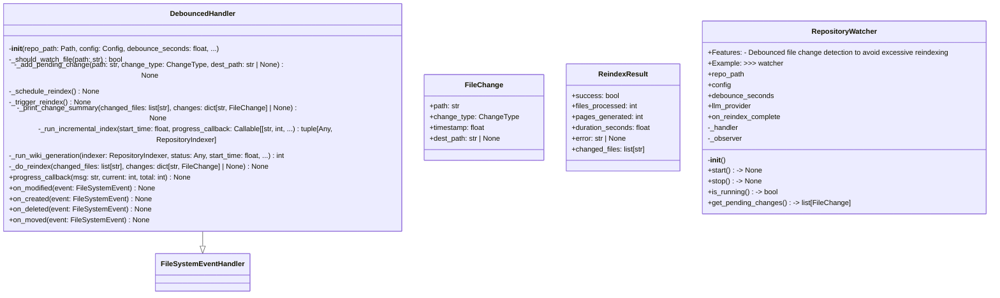

# File: `src/local_deepwiki/watcher.py`

## File Overview

This file implements a file watcher for local repositories that automatically triggers reindexing and wiki regeneration when file changes are detected. It provides a high-level interface for monitoring repository changes and updating documentation dynamically.

The core responsibility of this file is to:
- Watch a repository for file system events (created, modified, deleted, moved)
- Debounce events to avoid excessive reindexing
- Perform incremental indexing of changed files
- Regenerate wiki documentation based on updated content
- Provide a clean CLI interface for starting watch mode

The design rationale centers on minimizing resource usage and ensuring responsiveness while maintaining robustness against concurrent file operations and error conditions.

## Key Concepts

### Debounced File Change Handling
The `DebouncedHandler` class implements a debouncing mechanism to batch file changes and avoid triggering reindexing too frequently. This is crucial for performance, especially in environments with rapid file modifications (e.g., during IDE operations or build processes).

### Thread-Safe State Management
All file change handling is thread-safe using `threading.Lock` and `Timer` objects. This ensures that concurrent file system events don't lead to inconsistent state or race conditions during reindexing.

### Incremental Indexing and Wiki Generation
The system supports incremental indexing and wiki regeneration, allowing it to process only changed files rather than reindexing the entire repository. This significantly improves performance during active development.

### Callback-Based Progress Reporting
Progress reporting and completion notifications are handled via callback functions, enabling integration with CLI progress bars and external monitoring systems.

## Integration

This file integrates with several core modules in the `local_deepwiki` ecosystem:

- **Configuration System**: Uses `get_config()` and [`Config`](config/models.md) to retrieve repository-specific settings
- **Indexing Engine**: Relies on [`RepositoryIndexer`](core/indexer.md) for actual file indexing and content processing
- **Documentation Generator**: Integrates with [`generate_wiki`](generators/wiki/generator.md) to produce updated documentation
- **CLI Components**: Depends on [`MultiPhaseProgress`](cli_progress.md) and `Console` from CLI modules for user feedback
- **File System Monitoring**: Uses `watchdog` library for cross-platform file system event detection

The file is called from:
- CLI entry points (`main()` function)
- Test suite (`test_watcher_models`, `test_watcher_debounce`, etc.)

## Design Notes

### Debounce Strategy
The debounce strategy uses a `Timer` object to delay reindexing until after a quiet period. If new events occur during this delay, the timer is cancelled and reset. This prevents unnecessary reindexing during bursts of file changes.

### Error Resilience
The system is designed to remain operational even if individual reindexing operations fail. Exceptions during reindexing are caught and logged, but the watcher continues to monitor for new changes.

### File Filtering
Files are filtered based on:
1. Supported extensions defined in `EXTENSION_MAP`
2. Exclusion patterns from configuration (`parsing.exclude_patterns`)
3. Whether the file is within the monitored repository path

### Progress Reporting
Progress reporting is implemented using a callback pattern that can either integrate with [`MultiPhaseProgress`](cli_progress.md) or fall back to simple console output, allowing for both interactive and non-interactive usage.

### Memory Efficiency
The system avoids holding references to large data structures for extended periods. Changes are processed incrementally, and results are reported immediately, minimizing memory footprint during long-running operations.

### Graceful Shutdown
The `RepositoryWatcher` class provides explicit `start()` and `stop()` methods with proper cleanup of `Observer` and `Timer` resources, ensuring that the watcher can be cleanly terminated without leaving background threads running.

## API Reference

### class `ChangeType`

**Inherits from:** `Enum`

Type of file change detected.


<details>
<summary>View Source (lines 40-46) | <a href="https://github.com/UrbanDiver/local-deepwiki-mcp/blob/main/src/local_deepwiki/watcher.py#L40-L46">GitHub</a></summary>

```python
class ChangeType(Enum):
    """Type of file change detected."""

    CREATED = "created"
    MODIFIED = "modified"
    DELETED = "deleted"
    MOVED = "moved"
```

</details>

### class `FileChange`

Represents a single file change event.


<details>
<summary>View Source (lines 50-56) | <a href="https://github.com/UrbanDiver/local-deepwiki-mcp/blob/main/src/local_deepwiki/watcher.py#L50-L56">GitHub</a></summary>

```python
class FileChange:
    """Represents a single file change event."""

    path: str
    change_type: ChangeType
    timestamp: float = field(default_factory=time.time)
    dest_path: str | None = None  # For moved files
```

</details>

### class `ReindexResult`

Result of a reindex operation.


<details>
<summary>View Source (lines 60-68) | <a href="https://github.com/UrbanDiver/local-deepwiki-mcp/blob/main/src/local_deepwiki/watcher.py#L60-L68">GitHub</a></summary>

```python
class ReindexResult:
    """Result of a reindex operation."""

    success: bool
    files_processed: int
    pages_generated: int
    duration_seconds: float
    error: str | None = None
    changed_files: list[str] = field(default_factory=list)
```

</details>

### class `DebouncedHandler`

**Inherits from:** `FileSystemEventHandler`

File system event handler with debouncing.  This handler collects file change events and debounces them to avoid triggering reindexing on every keystroke. It tracks the type of change (create, modify, delete, move) for selective reindexing.  Thread Safety: All state mutations are protected by a lock to ensure thread safety since watchdog calls handlers from multiple threads.

**Methods:**


<details>
<summary>View Source (lines 75-383) | <a href="https://github.com/UrbanDiver/local-deepwiki-mcp/blob/main/src/local_deepwiki/watcher.py#L75-L383">GitHub</a></summary>

```python
class DebouncedHandler(FileSystemEventHandler):
    # Methods: __init__, _should_watch_file, _add_pending_change, _schedule_reindex, _trigger_reindex, _print_change_summary, _run_incremental_index, _run_wiki_generation, _do_reindex, progress_callback, on_modified, on_created, on_deleted, on_moved
```

</details>

#### `__init__`

```python
def __init__(repo_path: Path, config: Config, debounce_seconds: float = 2.0, llm_provider: str | None = None, on_reindex_complete: ReindexCallback | None = None)
```

Initialize the handler.


| Parameter | Type | Default | Description |
|-----------|------|---------|-------------|
| `repo_path` | `Path` | - | Path to the repository root. |
| `config` | `Config` | - | Configuration instance. |
| `debounce_seconds` | `float` | `2.0` | Seconds to wait after last change before triggering. |
| `llm_provider` | `str | None` | `None` | Optional LLM provider override. |
| `on_reindex_complete` | `ReindexCallback | None` | `None` | Optional callback invoked when reindexing completes. |


<details>
<summary>View Source (lines 87-117) | <a href="https://github.com/UrbanDiver/local-deepwiki-mcp/blob/main/src/local_deepwiki/watcher.py#L87-L117">GitHub</a></summary>

```python
def __init__(
        self,
        repo_path: Path,
        config: Config,
        debounce_seconds: float = 2.0,
        llm_provider: str | None = None,
        on_reindex_complete: ReindexCallback | None = None,
    ):
        """Initialize the handler.

        Args:
            repo_path: Path to the repository root.
            config: Configuration instance.
            debounce_seconds: Seconds to wait after last change before triggering.
            llm_provider: Optional LLM provider override.
            on_reindex_complete: Optional callback invoked when reindexing completes.
        """
        self.repo_path = repo_path
        # Store a defensive copy to prevent external mutation
        self.config = config.model_copy(deep=True)
        self.debounce_seconds = debounce_seconds
        self.llm_provider = llm_provider
        self.on_reindex_complete = on_reindex_complete

        # Thread-safe state management
        self._lock = Lock()
        self._timer: Timer | None = None
        self._pending_files: set[str] = set()
        self._pending_changes: dict[str, FileChange] = {}
        self._is_processing = False
        self._last_event_time: float = 0.0
```

</details>

#### `progress_callback`

```python
def progress_callback(msg: str, current: int, total: int) -> None
```


| Parameter | Type | Default | Description |
|-----------|------|---------|-------------|
| `msg` | `str` | - | - |
| `current` | `int` | - | - |
| `total` | `int` | - | - |


<details>
<summary>View Source (lines 299-303) | <a href="https://github.com/UrbanDiver/local-deepwiki-mcp/blob/main/src/local_deepwiki/watcher.py#L299-L303">GitHub</a></summary>

```python
def progress_callback(msg: str, current: int, total: int) -> None:
            if total > 0:
                console.print(f"  [{current}/{total}] {msg}")
            else:
                console.print(f"  {msg}")
```

</details>

#### `on_modified`

```python
def on_modified(event: FileSystemEvent) -> None
```

Handle file modification events.


| Parameter | Type | Default | Description |
|-----------|------|---------|-------------|
| `event` | `FileSystemEvent` | - | - |


<details>
<summary>View Source (lines 336-344) | <a href="https://github.com/UrbanDiver/local-deepwiki-mcp/blob/main/src/local_deepwiki/watcher.py#L336-L344">GitHub</a></summary>

```python
def on_modified(self, event: FileSystemEvent) -> None:
        """Handle file modification events."""
        if event.is_directory:
            return

        src_path = str(event.src_path)
        if self._should_watch_file(src_path):
            self._add_pending_change(src_path, ChangeType.MODIFIED)
            self._schedule_reindex()
```

</details>

#### `on_created`

```python
def on_created(event: FileSystemEvent) -> None
```

Handle file creation events.


| Parameter | Type | Default | Description |
|-----------|------|---------|-------------|
| `event` | `FileSystemEvent` | - | - |


<details>
<summary>View Source (lines 346-354) | <a href="https://github.com/UrbanDiver/local-deepwiki-mcp/blob/main/src/local_deepwiki/watcher.py#L346-L354">GitHub</a></summary>

```python
def on_created(self, event: FileSystemEvent) -> None:
        """Handle file creation events."""
        if event.is_directory:
            return

        src_path = str(event.src_path)
        if self._should_watch_file(src_path):
            self._add_pending_change(src_path, ChangeType.CREATED)
            self._schedule_reindex()
```

</details>

#### `on_deleted`

```python
def on_deleted(event: FileSystemEvent) -> None
```

Handle file deletion events.


| Parameter | Type | Default | Description |
|-----------|------|---------|-------------|
| `event` | `FileSystemEvent` | - | - |


<details>
<summary>View Source (lines 356-364) | <a href="https://github.com/UrbanDiver/local-deepwiki-mcp/blob/main/src/local_deepwiki/watcher.py#L356-L364">GitHub</a></summary>

```python
def on_deleted(self, event: FileSystemEvent) -> None:
        """Handle file deletion events."""
        if event.is_directory:
            return

        src_path = str(event.src_path)
        if self._should_watch_file(src_path):
            self._add_pending_change(src_path, ChangeType.DELETED)
            self._schedule_reindex()
```

</details>

#### `on_moved`

```python
def on_moved(event: FileSystemEvent) -> None
```

Handle file move events.


| Parameter | Type | Default | Description |
|-----------|------|---------|-------------|
| `event` | `FileSystemEvent` | - | - |


<details>
<summary>View Source (lines 366-383) | <a href="https://github.com/UrbanDiver/local-deepwiki-mcp/blob/main/src/local_deepwiki/watcher.py#L366-L383">GitHub</a></summary>

```python
def on_moved(self, event: FileSystemEvent) -> None:
        """Handle file move events."""
        if event.is_directory:
            return

        # Check both source and destination
        src_path = str(event.src_path)
        dest_path_str = str(event.dest_path) if hasattr(event, "dest_path") else None

        if self._should_watch_file(src_path):
            self._add_pending_change(
                src_path, ChangeType.MOVED, dest_path=dest_path_str
            )
            self._schedule_reindex()

        if dest_path_str and self._should_watch_file(dest_path_str):
            self._add_pending_change(dest_path_str, ChangeType.CREATED)
            self._schedule_reindex()
```

</details>

### class `RepositoryWatcher`

Watches a repository for file changes and triggers reindexing.  This class provides a high-level interface for watching a repository and automatically regenerating wiki documentation when files change.  Features: - Debounced file change detection to avoid excessive reindexing - Callback mechanism for notification when reindexing completes - Thread-safe operation with graceful shutdown

**Methods:**


<details>
<summary>View Source (lines 386-477) | <a href="https://github.com/UrbanDiver/local-deepwiki-mcp/blob/main/src/local_deepwiki/watcher.py#L386-L477">GitHub</a></summary>

```python
class RepositoryWatcher:
    """Watches a repository for file changes and triggers reindexing.

    This class provides a high-level interface for watching a repository
    and automatically regenerating wiki documentation when files change.

    Features:
        - Debounced file change detection to avoid excessive reindexing
        - Callback mechanism for notification when reindexing completes
        - Thread-safe operation with graceful shutdown

    Example:
        >>> watcher = RepositoryWatcher(
        ...     repo_path=Path("/path/to/repo"),
        ...     debounce_seconds=2.0,
        ...     on_reindex_complete=lambda result: print(f"Done: {result.success}")
        ... )
        >>> watcher.start()
        >>> # ... do work ...
        >>> watcher.stop()
    """

    def __init__(
        self,
        repo_path: Path,
        config: Config | None = None,
        debounce_seconds: float = 2.0,
        llm_provider: str | None = None,
        on_reindex_complete: ReindexCallback | None = None,
    ):
        """Initialize the watcher.

        Args:
            repo_path: Path to the repository to watch.
            config: Optional configuration.
            debounce_seconds: Seconds to wait after changes before reindexing.
            llm_provider: Optional LLM provider override.
            on_reindex_complete: Optional callback invoked when reindexing completes.
                The callback receives a ReindexResult with details about the operation.
        """
        self.repo_path = repo_path.resolve()
        base_config = config or get_config()
        # Store a defensive copy to prevent external mutation
        self.config = base_config.model_copy(deep=True)
        self.debounce_seconds = debounce_seconds
        self.llm_provider = llm_provider
        self.on_reindex_complete = on_reindex_complete
        self._observer: BaseObserver | None = None
        self._handler: DebouncedHandler | None = None

    def start(self) -> None:
        """Start watching the repository."""
        logger.info("Starting file watcher for %s", self.repo_path)

        self._handler = DebouncedHandler(
            repo_path=self.repo_path,
            config=self.config,
            debounce_seconds=self.debounce_seconds,
            llm_provider=self.llm_provider,
            on_reindex_complete=self.on_reindex_complete,
        )

        observer = Observer()
        observer.schedule(self._handler, str(self.repo_path), recursive=True)
        observer.start()
        self._observer = observer
        logger.debug("File watcher started successfully")

    def stop(self) -> None:
        """Stop watching the repository."""
        logger.info("Stopping file watcher")
        if self._observer:
            self._observer.stop()
            self._observer.join()
            self._observer = None
            self._handler = None
            logger.debug("File watcher stopped")

    def is_running(self) -> bool:
        """Check if the watcher is running."""
        return self._observer is not None and self._observer.is_alive()

    def get_pending_changes(self) -> list[FileChange]:
        """Get the list of pending file changes (for debugging/monitoring).

        Returns:
            List of FileChange objects for pending changes.
        """
        if self._handler is None:
            return []
        with self._handler._lock:
            return list(self._handler._pending_changes.values())
```

</details>

#### `__init__`

```python
def __init__(repo_path: Path, config: Config | None = None, debounce_seconds: float = 2.0, llm_provider: str | None = None, on_reindex_complete: ReindexCallback | None = None)
```

Initialize the watcher.


| Parameter | Type | Default | Description |
|-----------|------|---------|-------------|
| `repo_path` | `Path` | - | Path to the repository to watch. |
| `config` | `Config | None` | `None` | Optional configuration. |
| `debounce_seconds` | `float` | `2.0` | Seconds to wait after changes before reindexing. |
| `llm_provider` | `str | None` | `None` | Optional LLM provider override. |
| `on_reindex_complete` | `ReindexCallback | None` | `None` | Optional callback invoked when reindexing completes. The callback receives a ReindexResult with details about the operation. |


<details>
<summary>View Source (lines 386-477) | <a href="https://github.com/UrbanDiver/local-deepwiki-mcp/blob/main/src/local_deepwiki/watcher.py#L386-L477">GitHub</a></summary>

```python
class RepositoryWatcher:
    """Watches a repository for file changes and triggers reindexing.

    This class provides a high-level interface for watching a repository
    and automatically regenerating wiki documentation when files change.

    Features:
        - Debounced file change detection to avoid excessive reindexing
        - Callback mechanism for notification when reindexing completes
        - Thread-safe operation with graceful shutdown

    Example:
        >>> watcher = RepositoryWatcher(
        ...     repo_path=Path("/path/to/repo"),
        ...     debounce_seconds=2.0,
        ...     on_reindex_complete=lambda result: print(f"Done: {result.success}")
        ... )
        >>> watcher.start()
        >>> # ... do work ...
        >>> watcher.stop()
    """

    def __init__(
        self,
        repo_path: Path,
        config: Config | None = None,
        debounce_seconds: float = 2.0,
        llm_provider: str | None = None,
        on_reindex_complete: ReindexCallback | None = None,
    ):
        """Initialize the watcher.

        Args:
            repo_path: Path to the repository to watch.
            config: Optional configuration.
            debounce_seconds: Seconds to wait after changes before reindexing.
            llm_provider: Optional LLM provider override.
            on_reindex_complete: Optional callback invoked when reindexing completes.
                The callback receives a ReindexResult with details about the operation.
        """
        self.repo_path = repo_path.resolve()
        base_config = config or get_config()
        # Store a defensive copy to prevent external mutation
        self.config = base_config.model_copy(deep=True)
        self.debounce_seconds = debounce_seconds
        self.llm_provider = llm_provider
        self.on_reindex_complete = on_reindex_complete
        self._observer: BaseObserver | None = None
        self._handler: DebouncedHandler | None = None

    def start(self) -> None:
        """Start watching the repository."""
        logger.info("Starting file watcher for %s", self.repo_path)

        self._handler = DebouncedHandler(
            repo_path=self.repo_path,
            config=self.config,
            debounce_seconds=self.debounce_seconds,
            llm_provider=self.llm_provider,
            on_reindex_complete=self.on_reindex_complete,
        )

        observer = Observer()
        observer.schedule(self._handler, str(self.repo_path), recursive=True)
        observer.start()
        self._observer = observer
        logger.debug("File watcher started successfully")

    def stop(self) -> None:
        """Stop watching the repository."""
        logger.info("Stopping file watcher")
        if self._observer:
            self._observer.stop()
            self._observer.join()
            self._observer = None
            self._handler = None
            logger.debug("File watcher stopped")

    def is_running(self) -> bool:
        """Check if the watcher is running."""
        return self._observer is not None and self._observer.is_alive()

    def get_pending_changes(self) -> list[FileChange]:
        """Get the list of pending file changes (for debugging/monitoring).

        Returns:
            List of FileChange objects for pending changes.
        """
        if self._handler is None:
            return []
        with self._handler._lock:
            return list(self._handler._pending_changes.values())
```

</details>

#### `start`

```python
def start() -> None
```

Start watching the repository.


<details>
<summary>View Source (lines 386-477) | <a href="https://github.com/UrbanDiver/local-deepwiki-mcp/blob/main/src/local_deepwiki/watcher.py#L386-L477">GitHub</a></summary>

```python
class RepositoryWatcher:
    """Watches a repository for file changes and triggers reindexing.

    This class provides a high-level interface for watching a repository
    and automatically regenerating wiki documentation when files change.

    Features:
        - Debounced file change detection to avoid excessive reindexing
        - Callback mechanism for notification when reindexing completes
        - Thread-safe operation with graceful shutdown

    Example:
        >>> watcher = RepositoryWatcher(
        ...     repo_path=Path("/path/to/repo"),
        ...     debounce_seconds=2.0,
        ...     on_reindex_complete=lambda result: print(f"Done: {result.success}")
        ... )
        >>> watcher.start()
        >>> # ... do work ...
        >>> watcher.stop()
    """

    def __init__(
        self,
        repo_path: Path,
        config: Config | None = None,
        debounce_seconds: float = 2.0,
        llm_provider: str | None = None,
        on_reindex_complete: ReindexCallback | None = None,
    ):
        """Initialize the watcher.

        Args:
            repo_path: Path to the repository to watch.
            config: Optional configuration.
            debounce_seconds: Seconds to wait after changes before reindexing.
            llm_provider: Optional LLM provider override.
            on_reindex_complete: Optional callback invoked when reindexing completes.
                The callback receives a ReindexResult with details about the operation.
        """
        self.repo_path = repo_path.resolve()
        base_config = config or get_config()
        # Store a defensive copy to prevent external mutation
        self.config = base_config.model_copy(deep=True)
        self.debounce_seconds = debounce_seconds
        self.llm_provider = llm_provider
        self.on_reindex_complete = on_reindex_complete
        self._observer: BaseObserver | None = None
        self._handler: DebouncedHandler | None = None

    def start(self) -> None:
        """Start watching the repository."""
        logger.info("Starting file watcher for %s", self.repo_path)

        self._handler = DebouncedHandler(
            repo_path=self.repo_path,
            config=self.config,
            debounce_seconds=self.debounce_seconds,
            llm_provider=self.llm_provider,
            on_reindex_complete=self.on_reindex_complete,
        )

        observer = Observer()
        observer.schedule(self._handler, str(self.repo_path), recursive=True)
        observer.start()
        self._observer = observer
        logger.debug("File watcher started successfully")

    def stop(self) -> None:
        """Stop watching the repository."""
        logger.info("Stopping file watcher")
        if self._observer:
            self._observer.stop()
            self._observer.join()
            self._observer = None
            self._handler = None
            logger.debug("File watcher stopped")

    def is_running(self) -> bool:
        """Check if the watcher is running."""
        return self._observer is not None and self._observer.is_alive()

    def get_pending_changes(self) -> list[FileChange]:
        """Get the list of pending file changes (for debugging/monitoring).

        Returns:
            List of FileChange objects for pending changes.
        """
        if self._handler is None:
            return []
        with self._handler._lock:
            return list(self._handler._pending_changes.values())
```

</details>

#### `stop`

```python
def stop() -> None
```

Stop watching the repository.


<details>
<summary>View Source (lines 386-477) | <a href="https://github.com/UrbanDiver/local-deepwiki-mcp/blob/main/src/local_deepwiki/watcher.py#L386-L477">GitHub</a></summary>

```python
class RepositoryWatcher:
    """Watches a repository for file changes and triggers reindexing.

    This class provides a high-level interface for watching a repository
    and automatically regenerating wiki documentation when files change.

    Features:
        - Debounced file change detection to avoid excessive reindexing
        - Callback mechanism for notification when reindexing completes
        - Thread-safe operation with graceful shutdown

    Example:
        >>> watcher = RepositoryWatcher(
        ...     repo_path=Path("/path/to/repo"),
        ...     debounce_seconds=2.0,
        ...     on_reindex_complete=lambda result: print(f"Done: {result.success}")
        ... )
        >>> watcher.start()
        >>> # ... do work ...
        >>> watcher.stop()
    """

    def __init__(
        self,
        repo_path: Path,
        config: Config | None = None,
        debounce_seconds: float = 2.0,
        llm_provider: str | None = None,
        on_reindex_complete: ReindexCallback | None = None,
    ):
        """Initialize the watcher.

        Args:
            repo_path: Path to the repository to watch.
            config: Optional configuration.
            debounce_seconds: Seconds to wait after changes before reindexing.
            llm_provider: Optional LLM provider override.
            on_reindex_complete: Optional callback invoked when reindexing completes.
                The callback receives a ReindexResult with details about the operation.
        """
        self.repo_path = repo_path.resolve()
        base_config = config or get_config()
        # Store a defensive copy to prevent external mutation
        self.config = base_config.model_copy(deep=True)
        self.debounce_seconds = debounce_seconds
        self.llm_provider = llm_provider
        self.on_reindex_complete = on_reindex_complete
        self._observer: BaseObserver | None = None
        self._handler: DebouncedHandler | None = None

    def start(self) -> None:
        """Start watching the repository."""
        logger.info("Starting file watcher for %s", self.repo_path)

        self._handler = DebouncedHandler(
            repo_path=self.repo_path,
            config=self.config,
            debounce_seconds=self.debounce_seconds,
            llm_provider=self.llm_provider,
            on_reindex_complete=self.on_reindex_complete,
        )

        observer = Observer()
        observer.schedule(self._handler, str(self.repo_path), recursive=True)
        observer.start()
        self._observer = observer
        logger.debug("File watcher started successfully")

    def stop(self) -> None:
        """Stop watching the repository."""
        logger.info("Stopping file watcher")
        if self._observer:
            self._observer.stop()
            self._observer.join()
            self._observer = None
            self._handler = None
            logger.debug("File watcher stopped")

    def is_running(self) -> bool:
        """Check if the watcher is running."""
        return self._observer is not None and self._observer.is_alive()

    def get_pending_changes(self) -> list[FileChange]:
        """Get the list of pending file changes (for debugging/monitoring).

        Returns:
            List of FileChange objects for pending changes.
        """
        if self._handler is None:
            return []
        with self._handler._lock:
            return list(self._handler._pending_changes.values())
```

</details>

#### `is_running`

```python
def is_running() -> bool
```

Check if the watcher is running.


<details>
<summary>View Source (lines 386-477) | <a href="https://github.com/UrbanDiver/local-deepwiki-mcp/blob/main/src/local_deepwiki/watcher.py#L386-L477">GitHub</a></summary>

```python
class RepositoryWatcher:
    """Watches a repository for file changes and triggers reindexing.

    This class provides a high-level interface for watching a repository
    and automatically regenerating wiki documentation when files change.

    Features:
        - Debounced file change detection to avoid excessive reindexing
        - Callback mechanism for notification when reindexing completes
        - Thread-safe operation with graceful shutdown

    Example:
        >>> watcher = RepositoryWatcher(
        ...     repo_path=Path("/path/to/repo"),
        ...     debounce_seconds=2.0,
        ...     on_reindex_complete=lambda result: print(f"Done: {result.success}")
        ... )
        >>> watcher.start()
        >>> # ... do work ...
        >>> watcher.stop()
    """

    def __init__(
        self,
        repo_path: Path,
        config: Config | None = None,
        debounce_seconds: float = 2.0,
        llm_provider: str | None = None,
        on_reindex_complete: ReindexCallback | None = None,
    ):
        """Initialize the watcher.

        Args:
            repo_path: Path to the repository to watch.
            config: Optional configuration.
            debounce_seconds: Seconds to wait after changes before reindexing.
            llm_provider: Optional LLM provider override.
            on_reindex_complete: Optional callback invoked when reindexing completes.
                The callback receives a ReindexResult with details about the operation.
        """
        self.repo_path = repo_path.resolve()
        base_config = config or get_config()
        # Store a defensive copy to prevent external mutation
        self.config = base_config.model_copy(deep=True)
        self.debounce_seconds = debounce_seconds
        self.llm_provider = llm_provider
        self.on_reindex_complete = on_reindex_complete
        self._observer: BaseObserver | None = None
        self._handler: DebouncedHandler | None = None

    def start(self) -> None:
        """Start watching the repository."""
        logger.info("Starting file watcher for %s", self.repo_path)

        self._handler = DebouncedHandler(
            repo_path=self.repo_path,
            config=self.config,
            debounce_seconds=self.debounce_seconds,
            llm_provider=self.llm_provider,
            on_reindex_complete=self.on_reindex_complete,
        )

        observer = Observer()
        observer.schedule(self._handler, str(self.repo_path), recursive=True)
        observer.start()
        self._observer = observer
        logger.debug("File watcher started successfully")

    def stop(self) -> None:
        """Stop watching the repository."""
        logger.info("Stopping file watcher")
        if self._observer:
            self._observer.stop()
            self._observer.join()
            self._observer = None
            self._handler = None
            logger.debug("File watcher stopped")

    def is_running(self) -> bool:
        """Check if the watcher is running."""
        return self._observer is not None and self._observer.is_alive()

    def get_pending_changes(self) -> list[FileChange]:
        """Get the list of pending file changes (for debugging/monitoring).

        Returns:
            List of FileChange objects for pending changes.
        """
        if self._handler is None:
            return []
        with self._handler._lock:
            return list(self._handler._pending_changes.values())
```

</details>

#### `get_pending_changes`

```python
def get_pending_changes() -> list[FileChange]
```

Get the list of pending file changes (for debugging/monitoring).


---


<details>
<summary>View Source (lines 386-477) | <a href="https://github.com/UrbanDiver/local-deepwiki-mcp/blob/main/src/local_deepwiki/watcher.py#L386-L477">GitHub</a></summary>

```python
class RepositoryWatcher:
    """Watches a repository for file changes and triggers reindexing.

    This class provides a high-level interface for watching a repository
    and automatically regenerating wiki documentation when files change.

    Features:
        - Debounced file change detection to avoid excessive reindexing
        - Callback mechanism for notification when reindexing completes
        - Thread-safe operation with graceful shutdown

    Example:
        >>> watcher = RepositoryWatcher(
        ...     repo_path=Path("/path/to/repo"),
        ...     debounce_seconds=2.0,
        ...     on_reindex_complete=lambda result: print(f"Done: {result.success}")
        ... )
        >>> watcher.start()
        >>> # ... do work ...
        >>> watcher.stop()
    """

    def __init__(
        self,
        repo_path: Path,
        config: Config | None = None,
        debounce_seconds: float = 2.0,
        llm_provider: str | None = None,
        on_reindex_complete: ReindexCallback | None = None,
    ):
        """Initialize the watcher.

        Args:
            repo_path: Path to the repository to watch.
            config: Optional configuration.
            debounce_seconds: Seconds to wait after changes before reindexing.
            llm_provider: Optional LLM provider override.
            on_reindex_complete: Optional callback invoked when reindexing completes.
                The callback receives a ReindexResult with details about the operation.
        """
        self.repo_path = repo_path.resolve()
        base_config = config or get_config()
        # Store a defensive copy to prevent external mutation
        self.config = base_config.model_copy(deep=True)
        self.debounce_seconds = debounce_seconds
        self.llm_provider = llm_provider
        self.on_reindex_complete = on_reindex_complete
        self._observer: BaseObserver | None = None
        self._handler: DebouncedHandler | None = None

    def start(self) -> None:
        """Start watching the repository."""
        logger.info("Starting file watcher for %s", self.repo_path)

        self._handler = DebouncedHandler(
            repo_path=self.repo_path,
            config=self.config,
            debounce_seconds=self.debounce_seconds,
            llm_provider=self.llm_provider,
            on_reindex_complete=self.on_reindex_complete,
        )

        observer = Observer()
        observer.schedule(self._handler, str(self.repo_path), recursive=True)
        observer.start()
        self._observer = observer
        logger.debug("File watcher started successfully")

    def stop(self) -> None:
        """Stop watching the repository."""
        logger.info("Stopping file watcher")
        if self._observer:
            self._observer.stop()
            self._observer.join()
            self._observer = None
            self._handler = None
            logger.debug("File watcher stopped")

    def is_running(self) -> bool:
        """Check if the watcher is running."""
        return self._observer is not None and self._observer.is_alive()

    def get_pending_changes(self) -> list[FileChange]:
        """Get the list of pending file changes (for debugging/monitoring).

        Returns:
            List of FileChange objects for pending changes.
        """
        if self._handler is None:
            return []
        with self._handler._lock:
            return list(self._handler._pending_changes.values())
```

</details>

### Functions

#### `initial_index`

```python
async def initial_index(repo_path: Path, config: Config, llm_provider: str | None = None, full_rebuild: bool = False, no_progress: bool = False) -> None
```

Perform initial indexing before starting watch mode.


| Parameter | Type | Default | Description |
|-----------|------|---------|-------------|
| `repo_path` | `Path` | - | Path to the repository. |
| `config` | `Config` | - | Configuration instance. |
| `llm_provider` | `str | None` | `None` | Optional LLM provider override. |
| `full_rebuild` | `bool` | `False` | Whether to do a full rebuild. |
| `no_progress` | `bool` | `False` | If True, disable progress bars. |

**Returns:** `None`


<details>
<summary>View Source (lines 480-558) | <a href="https://github.com/UrbanDiver/local-deepwiki-mcp/blob/main/src/local_deepwiki/watcher.py#L480-L558">GitHub</a></summary>

```python
async def initial_index(
    repo_path: Path,
    config: Config,
    llm_provider: str | None = None,
    full_rebuild: bool = False,
    *,
    no_progress: bool = False,
) -> None:
    """Perform initial indexing before starting watch mode.

    Args:
        repo_path: Path to the repository.
        config: Configuration instance.
        llm_provider: Optional LLM provider override.
        full_rebuild: Whether to do a full rebuild.
        no_progress: If True, disable progress bars.
    """
    console.print("[yellow]Running initial index...[/yellow]")

    indexer = RepositoryIndexer(repo_path=repo_path, config=config)
    start_time = time.time()

    with MultiPhaseProgress(disable=no_progress) as progress:
        # Add phases
        progress.add_phase("indexing", "Indexing repository", total=0)
        progress.add_phase("wiki", "Generating wiki", total=0)

        # Create callback adapter for indexing phase
        index_callback = progress.get_callback("indexing")

        def indexing_progress(msg: str, current: int, total: int) -> None:
            if index_callback:
                index_callback(msg, current, total)
            else:
                if total > 0:
                    console.print(f"  [{current}/{total}] {msg}")
                else:
                    console.print(f"  {msg}")

        status = await indexer.index(
            full_rebuild=full_rebuild,
            progress_callback=indexing_progress,
        )

        progress.complete_phase("indexing")
        console.print(
            f"[green]Indexed {status.total_files} files, {status.total_chunks} chunks[/green]"
        )

        # Create callback adapter for wiki phase
        wiki_callback = progress.get_callback("wiki")

        def wiki_progress(msg: str, current: int, total: int) -> None:
            if wiki_callback:
                wiki_callback(msg, current, total)
            else:
                if total > 0:
                    console.print(f"  [{current}/{total}] {msg}")
                else:
                    console.print(f"  {msg}")

        wiki_structure = await generate_wiki(
            repo_path=repo_path,
            wiki_path=indexer.wiki_path,
            vector_store=indexer.vector_store,
            index_status=status,
            config=config,
            llm_provider=llm_provider,
            progress_callback=wiki_progress,
            full_rebuild=full_rebuild,
        )

        progress.complete_phase("wiki")

    total_time = time.time() - start_time
    console.print(f"[green]Generated {len(wiki_structure.pages)} wiki pages[/green]")
    console.print(
        f"[bold green]Initial index complete in {total_time:.1f}s[/bold green]"
    )
```

</details>

#### `indexing_progress`

```python
def indexing_progress(msg: str, current: int, total: int) -> None
```


| Parameter | Type | Default | Description |
|-----------|------|---------|-------------|
| `msg` | `str` | - | - |
| `current` | `int` | - | - |
| `total` | `int` | - | - |

**Returns:** `None`


<details>
<summary>View Source (lines 510-517) | <a href="https://github.com/UrbanDiver/local-deepwiki-mcp/blob/main/src/local_deepwiki/watcher.py#L510-L517">GitHub</a></summary>

```python
def indexing_progress(msg: str, current: int, total: int) -> None:
            if index_callback:
                index_callback(msg, current, total)
            else:
                if total > 0:
                    console.print(f"  [{current}/{total}] {msg}")
                else:
                    console.print(f"  {msg}")
```

</details>

#### `wiki_progress`

```python
def wiki_progress(msg: str, current: int, total: int) -> None
```


| Parameter | Type | Default | Description |
|-----------|------|---------|-------------|
| `msg` | `str` | - | - |
| `current` | `int` | - | - |
| `total` | `int` | - | - |

**Returns:** `None`


<details>
<summary>View Source (lines 532-539) | <a href="https://github.com/UrbanDiver/local-deepwiki-mcp/blob/main/src/local_deepwiki/watcher.py#L532-L539">GitHub</a></summary>

```python
def wiki_progress(msg: str, current: int, total: int) -> None:
            if wiki_callback:
                wiki_callback(msg, current, total)
            else:
                if total > 0:
                    console.print(f"  [{current}/{total}] {msg}")
                else:
                    console.print(f"  {msg}")
```

</details>

#### `main`

```python
def main() -> None
```

Main entry point for the watch command.

**Returns:** `None`


<details>
<summary>View Source (lines 616-660) | <a href="https://github.com/UrbanDiver/local-deepwiki-mcp/blob/main/src/local_deepwiki/watcher.py#L616-L660">GitHub</a></summary>

```python
def main() -> None:
    """Main entry point for the watch command."""
    args = _build_watch_arg_parser().parse_args()

    repo_path = Path(args.repo_path).resolve()
    if not repo_path.exists():
        console.print(f"[red]Error: Path does not exist: {repo_path}[/red]")
        sys.exit(1)

    if not repo_path.is_dir():
        console.print(f"[red]Error: Path is not a directory: {repo_path}[/red]")
        sys.exit(1)

    config = get_config()

    console.print()
    console.print("[bold]DeepWiki Watch Mode[/bold]")
    console.print(f"Repository: [cyan]{repo_path}[/cyan]")
    console.print(f"Debounce: [cyan]{args.debounce}s[/cyan]")
    console.print(f"LLM Provider: [cyan]{args.llm or config.llm.provider}[/cyan]")
    console.print()

    if not args.skip_initial:
        asyncio.run(
            initial_index(
                repo_path=repo_path,
                config=config,
                llm_provider=args.llm,
                full_rebuild=args.full_rebuild,
                no_progress=args.no_progress,
            )
        )

    console.print()
    console.rule("[bold blue]Starting Watch Mode[/bold blue]")
    console.print("[dim]Watching for changes... (Ctrl+C to stop)[/dim]")
    console.print()

    watcher = RepositoryWatcher(
        repo_path=repo_path,
        config=config,
        debounce_seconds=args.debounce,
        llm_provider=args.llm,
    )
    _run_watcher_loop(watcher)
```

</details>

## Class Diagram


```mermaid
classDiagram
    class DebouncedHandler {
        -__init__(repo_path: Path, config: Config, debounce_seconds: float, ...)
        -_should_watch_file(path: str) bool
        -_add_pending_change(path: str, change_type: ChangeType, dest_path: str | None) None
        -_schedule_reindex() None
        -_trigger_reindex() None
        -_print_change_summary(changed_files: list[str], changes: dict[str, FileChange] | None) None
        -_run_incremental_index(start_time: float, progress_callback: Callable[[str, int, ...) tuple[Any, RepositoryIndexer]
        -_run_wiki_generation(indexer: RepositoryIndexer, status: Any, start_time: float, ...) int
        -_do_reindex(changed_files: list[str], changes: dict[str, FileChange] | None) None
        +progress_callback(msg: str, current: int, total: int) None
        +on_modified(event: FileSystemEvent) None
        +on_created(event: FileSystemEvent) None
        +on_deleted(event: FileSystemEvent) None
        +on_moved(event: FileSystemEvent) None
    }
    class FileChange {
        +path: str
        +change_type: ChangeType
        +timestamp: float
        +dest_path: str | None
    }
    class ReindexResult {
        +success: bool
        +files_processed: int
        +pages_generated: int
        +duration_seconds: float
        +error: str | None
        +changed_files: list[str]
    }
    class RepositoryWatcher {
        +Features: - Debounced file change detection to avoid excessive reindexing
        +Example: >>> watcher
        +repo_path
        +config
        +debounce_seconds
        +llm_provider
        +on_reindex_complete
        -_handler
        -_observer
        -__init__()
        +start() -> None
        +stop() -> None
        +is_running() -> bool
        +get_pending_changes() -> list[FileChange]
    }
    DebouncedHandler --|> FileSystemEventHandler
```

## Call Graph


```mermaid
flowchart TD
    N0[DebouncedHandler._add_pendi...]
    N1[DebouncedHandler._do_reindex]
    N2[DebouncedHandler._print_cha...]
    N3[DebouncedHandler._run_wiki_...]
    N4[DebouncedHandler._schedule_...]
    N5[DebouncedHandler._should_wa...]
    N6[DebouncedHandler._trigger_r...]
    N7[DebouncedHandler.on_created]
    N8[DebouncedHandler.on_deleted]
    N9[DebouncedHandler.on_modified]
    N10[DebouncedHandler.on_moved]
    N11[Path]
    N12[RepositoryIndexer]
    N13[RepositoryWatcher.__init__]
    N14[RepositoryWatcher.start]
    N15[_add_pending_change]
    N16[_build_watch_arg_parser]
    N17[_run_watcher_loop]
    N18[_schedule_reindex]
    N19[_should_watch_file]
    N20[generate_wiki]
    N21[index_callback]
    N22[initial_index]
    N23[main]
    N24[resolve]
    N25[rule]
    N26[start]
    N27[stop]
    N28[time]
    N29[wiki_callback]
    N22 --> N12
    N22 --> N28
    N22 --> N21
    N22 --> N29
    N22 --> N20
    N17 --> N26
    N17 --> N27
    N23 --> N16
    N23 --> N24
    N23 --> N11
    N23 --> N22
    N23 --> N25
    N23 --> N17
    N5 --> N11
    N0 --> N28
    N4 --> N26
    N6 --> N18
    N2 --> N25
    N2 --> N11
    N3 --> N28
    N3 --> N20
    N3 --> N25
    N1 --> N28
    N9 --> N19
    N9 --> N15
    N9 --> N18
    N7 --> N19
    N7 --> N15
    N7 --> N18
    N8 --> N19
    N8 --> N15
    N8 --> N18
    N10 --> N19
    N10 --> N15
    N10 --> N18
    N13 --> N24
    N14 --> N26
    classDef func fill:#e1f5fe
    class N11,N12,N15,N16,N17,N18,N19,N20,N21,N22,N23,N24,N25,N26,N27,N28,N29 func
    classDef method fill:#fff3e0
    class N0,N1,N2,N3,N4,N5,N6,N7,N8,N9,N10,N13,N14 method
```

## Used By

Functions and methods in this file and their callers:

- **`ArgumentParser`**: called by `_build_watch_arg_parser`
- **`DebouncedHandler`**: called by `RepositoryWatcher.start`
- **`FileChange`**: called by `DebouncedHandler._add_pending_change`
- **`Lock`**: called by `DebouncedHandler.__init__`
- **[`MultiPhaseProgress`](cli_progress.md)**: called by `initial_index`
- **`Observer`**: called by `RepositoryWatcher.start`
- **`Path`**: called by `DebouncedHandler._print_change_summary`, `DebouncedHandler._should_watch_file`, `main`
- **`ReindexResult`**: called by `DebouncedHandler._do_reindex`
- **[`RepositoryIndexer`](core/indexer.md)**: called by `DebouncedHandler._run_incremental_index`, `initial_index`
- **`RepositoryWatcher`**: called by `main`
- **`Timer`**: called by `DebouncedHandler._schedule_reindex`
- **`_add_pending_change`**: called by `DebouncedHandler.on_created`, `DebouncedHandler.on_deleted`, `DebouncedHandler.on_modified`, `DebouncedHandler.on_moved`
- **`_build_watch_arg_parser`**: called by `main`
- **`_do_reindex`**: called by `DebouncedHandler._trigger_reindex`
- **`_print_change_summary`**: called by `DebouncedHandler._do_reindex`
- **`_run_incremental_index`**: called by `DebouncedHandler._do_reindex`
- **`_run_watcher_loop`**: called by `main`
- **`_run_wiki_generation`**: called by `DebouncedHandler._do_reindex`
- **`_schedule_reindex`**: called by `DebouncedHandler._trigger_reindex`, `DebouncedHandler.on_created`, `DebouncedHandler.on_deleted`, `DebouncedHandler.on_modified`, `DebouncedHandler.on_moved`
- **`_should_watch_file`**: called by `DebouncedHandler.on_created`, `DebouncedHandler.on_deleted`, `DebouncedHandler.on_modified`, `DebouncedHandler.on_moved`
- **`add`**: called by `DebouncedHandler._add_pending_change`
- **`add_argument`**: called by `_build_watch_arg_parser`
- **`add_phase`**: called by `initial_index`
- **`cancel`**: called by `DebouncedHandler._schedule_reindex`
- **`complete_phase`**: called by `initial_index`
- **`exception`**: called by `DebouncedHandler._do_reindex`
- **`exists`**: called by `main`
- **`exit`**: called by `main`
- **`fnmatch`**: called by `DebouncedHandler._should_watch_file`
- **[`generate_wiki`](generators/wiki/generator.md)**: called by `DebouncedHandler._run_wiki_generation`, `initial_index`
- **`get_callback`**: called by `initial_index`
- **[`get_config`](config/loader.md)**: called by `RepositoryWatcher.__init__`, `main`
- **`index_callback`**: called by `indexing_progress`, `initial_index`
- **`initial_index`**: called by `main`
- **`is_alive`**: called by `RepositoryWatcher.is_running`
- **`is_dir`**: called by `main`
- **`is_running`**: called by `_run_watcher_loop`
- **`model_copy`**: called by `DebouncedHandler.__init__`, `RepositoryWatcher.__init__`
- **`on_reindex_complete`**: called by `DebouncedHandler._do_reindex`
- **`parse_args`**: called by `main`
- **`relative_to`**: called by `DebouncedHandler._print_change_summary`, `DebouncedHandler._should_watch_file`
- **`resolve`**: called by `RepositoryWatcher.__init__`, `main`
- **`rule`**: called by `DebouncedHandler._print_change_summary`, `DebouncedHandler._run_wiki_generation`, `main`
- **`run`**: called by `DebouncedHandler._trigger_reindex`, `main`
- **`schedule`**: called by `RepositoryWatcher.start`
- **`sleep`**: called by `_run_watcher_loop`
- **`start`**: called by `DebouncedHandler._schedule_reindex`, `RepositoryWatcher.start`, `_run_watcher_loop`
- **`stop`**: called by `RepositoryWatcher.stop`, `_run_watcher_loop`
- **`time`**: called by `DebouncedHandler._add_pending_change`, `DebouncedHandler._do_reindex`, `DebouncedHandler._run_incremental_index`, `DebouncedHandler._run_wiki_generation`, `initial_index`
- **`wiki_callback`**: called by `initial_index`, `wiki_progress`

## Usage Examples

*Examples extracted from test files*

### Test creating a watcher

From `test_watcher_repository.py::TestRepositoryWatcher::test_create_watcher`:

```python
watcher = RepositoryWatcher(repo_path=tmp_path)
assert watcher.repo_path == tmp_path
assert watcher.debounce_seconds == 2.0
assert not watcher.is_running()
```

### Test creating a watcher

From `test_watcher_repository.py::TestRepositoryWatcher::test_create_watcher`:

```python
watcher = RepositoryWatcher(repo_path=tmp_path)
assert watcher.repo_path == tmp_path
assert watcher.debounce_seconds == 2.0
assert not watcher.is_running()
```

### Test creating a watcher with options

From `test_watcher_repository.py::TestRepositoryWatcher::test_create_watcher_with_options`:

```python
watcher = RepositoryWatcher(
    repo_path=tmp_path,
    config=config,
    debounce_seconds=5.0,
    llm_provider="anthropic",
)
assert watcher.debounce_seconds == 5.0
assert watcher.llm_provider == "anthropic"
```

### Test creating a watcher with a callback

From `test_watcher_repository.py::TestRepositoryWatcherCallback::test_create_watcher_with_callback`:

```python
def on_complete(result: ReindexResult) -> None:
    results.append(result)

watcher = RepositoryWatcher(
    repo_path=tmp_path,
    on_reindex_complete=on_complete,
)
assert watcher.on_reindex_complete is on_complete
```

### Test that callback is passed to handler on start

From `test_watcher_repository.py::TestRepositoryWatcherCallback::test_callback_passed_to_handler`:

```python
def on_complete(result: ReindexResult) -> None:
    results.append(result)

watcher = RepositoryWatcher(
    repo_path=tmp_path,
    on_reindex_complete=on_complete,
    debounce_seconds=0.1,
)

watcher.start()
try:
    assert watcher._handler is not None
    assert watcher._handler.on_reindex_complete is on_complete
```


## Last Modified

| Entity | Type | Author | Date | Commit |
|--------|------|--------|------|--------|
| `DebouncedHandler` | class | Brian Breidenbach | yesterday | `29ae780` refactor: decompose long me... |
| `_print_change_summary` | method | Brian Breidenbach | yesterday | `29ae780` refactor: decompose long me... |
| `_run_incremental_index` | method | Brian Breidenbach | yesterday | `29ae780` refactor: decompose long me... |
| `_run_wiki_generation` | method | Brian Breidenbach | yesterday | `29ae780` refactor: decompose long me... |
| `_do_reindex` | method | Brian Breidenbach | yesterday | `29ae780` refactor: decompose long me... |
| `progress_callback` | method | Brian Breidenbach | yesterday | `29ae780` refactor: decompose long me... |
| `_build_watch_arg_parser` | function | Brian Breidenbach | yesterday | `29ae780` refactor: decompose long me... |
| `_run_watcher_loop` | function | Brian Breidenbach | yesterday | `29ae780` refactor: decompose long me... |
| `main` | function | Brian Breidenbach | yesterday | `29ae780` refactor: decompose long me... |
| `_add_pending_change` | method | Brian Breidenbach | Feb 12, 2026 | `df695d3` feat: add MCP Resources, ag... |
| `on_moved` | method | Brian Breidenbach | Feb 12, 2026 | `df695d3` feat: add MCP Resources, ag... |
| `initial_index` | function | Brian Breidenbach | Feb 12, 2026 | `df695d3` feat: add MCP Resources, ag... |
| `_should_watch_file` | method | Brian Breidenbach | Feb 11, 2026 | `ba96da1` fix: publication plan P0-P2... |
| `_schedule_reindex` | method | Brian Breidenbach | Feb 11, 2026 | `ba96da1` fix: publication plan P0-P2... |
| `_trigger_reindex` | method | Brian Breidenbach | Feb 11, 2026 | `ba96da1` fix: publication plan P0-P2... |
| `RepositoryWatcher` | class | Brian Breidenbach | Feb 11, 2026 | `ba96da1` fix: publication plan P0-P2... |
| `indexing_progress` | function | Brian Breidenbach | Jan 24, 2026 | `fa2feb8` Add CLI progress bars and f... |
| `wiki_progress` | function | Brian Breidenbach | Jan 24, 2026 | `fa2feb8` Add CLI progress bars and f... |
| `ChangeType` | class | Brian Breidenbach | Jan 24, 2026 | `a51a32f` Add high-impact performance... |
| `FileChange` | class | Brian Breidenbach | Jan 24, 2026 | `a51a32f` Add high-impact performance... |
| `ReindexResult` | class | Brian Breidenbach | Jan 24, 2026 | `a51a32f` Add high-impact performance... |
| `__init__` | method | Brian Breidenbach | Jan 24, 2026 | `a51a32f` Add high-impact performance... |
| `on_modified` | method | Brian Breidenbach | Jan 24, 2026 | `a51a32f` Add high-impact performance... |
| `on_created` | method | Brian Breidenbach | Jan 24, 2026 | `a51a32f` Add high-impact performance... |
| `on_deleted` | method | Brian Breidenbach | Jan 24, 2026 | `a51a32f` Add high-impact performance... |

## Additional Source Code

Source code for functions and methods not listed in the API Reference above.

#### `_should_watch_file`

<details>
<summary>View Source (lines 119-147) | <a href="https://github.com/UrbanDiver/local-deepwiki-mcp/blob/main/src/local_deepwiki/watcher.py#L119-L147">GitHub</a></summary>

```python
def _should_watch_file(self, path: str) -> bool:
        """Check if a file should trigger reindexing.

        Args:
            path: Absolute path to the file.

        Returns:
            True if the file should be watched.
        """
        file_path = Path(path)

        # Check extension
        if file_path.suffix.lower() not in WATCHED_EXTENSIONS:
            logger.debug("Ignoring file with unsupported extension: %s", path)
            return False

        # Check exclude patterns
        try:
            rel_path = str(file_path.relative_to(self.repo_path))
        except ValueError:
            logger.debug("File outside repo path: %s", path)
            return False

        for pattern in self.config.parsing.exclude_patterns:
            if fnmatch.fnmatch(rel_path, pattern):
                logger.debug("File matches exclude pattern '%s': %s", pattern, rel_path)
                return False

        return True
```

</details>


#### `_add_pending_change`

<details>
<summary>View Source (lines 149-167) | <a href="https://github.com/UrbanDiver/local-deepwiki-mcp/blob/main/src/local_deepwiki/watcher.py#L149-L167">GitHub</a></summary>

```python
def _add_pending_change(
        self, path: str, change_type: ChangeType, dest_path: str | None = None
    ) -> None:
        """Add a file change to the pending set (thread-safe).

        Args:
            path: Path to the changed file.
            change_type: Type of change (created, modified, deleted, moved).
            dest_path: Destination path for moved files.
        """
        with self._lock:
            self._pending_files.add(path)
            self._pending_changes[path] = FileChange(
                path=path,
                change_type=change_type,
                dest_path=dest_path,
            )
            self._last_event_time = time.time()
            logger.debug("Added pending change: %s %s", change_type.value, path)
```

</details>


#### `_schedule_reindex`

<details>
<summary>View Source (lines 169-178) | <a href="https://github.com/UrbanDiver/local-deepwiki-mcp/blob/main/src/local_deepwiki/watcher.py#L169-L178">GitHub</a></summary>

```python
def _schedule_reindex(self) -> None:
        """Schedule a reindex after debounce period (thread-safe)."""
        with self._lock:
            if self._timer:
                self._timer.cancel()
                logger.debug("Cancelled previous debounce timer")

            self._timer = Timer(self.debounce_seconds, self._trigger_reindex)
            self._timer.start()
            logger.debug("Scheduled reindex in %ss", self.debounce_seconds)
```

</details>


#### `_trigger_reindex`

<details>
<summary>View Source (lines 180-197) | <a href="https://github.com/UrbanDiver/local-deepwiki-mcp/blob/main/src/local_deepwiki/watcher.py#L180-L197">GitHub</a></summary>

```python
def _trigger_reindex(self) -> None:
        """Trigger the actual reindex operation (thread-safe)."""
        with self._lock:
            if self._is_processing:
                # Re-schedule if already processing
                logger.info("Reindex already in progress, rescheduling")
                self._schedule_reindex()
                return

            files = list(self._pending_files)
            changes = dict(self._pending_changes)
            self._pending_files.clear()
            self._pending_changes.clear()

        if files:
            logger.info("Triggering reindex for %s files", len(files))
            # Run in asyncio event loop
            asyncio.run(self._do_reindex(files, changes))
```

</details>


#### `_print_change_summary`

<details>
<summary>View Source (lines 199-226) | <a href="https://github.com/UrbanDiver/local-deepwiki-mcp/blob/main/src/local_deepwiki/watcher.py#L199-L226">GitHub</a></summary>

```python
def _print_change_summary(
        self,
        changed_files: list[str],
        changes: dict[str, FileChange] | None,
    ) -> None:
        """Print a rich summary of detected file changes to the console."""
        console.print()
        console.rule("[bold blue]Changes Detected[/bold blue]")

        for f in changed_files[:10]:
            rel_path = Path(f).relative_to(self.repo_path)
            change_type = ""
            if changes and f in changes:
                change_type = f"[{changes[f].change_type.value}] "
            console.print(f"  [dim]- {change_type}{rel_path}[/dim]")
        if len(changed_files) > 10:
            console.print(f"  [dim]... and {len(changed_files) - 10} more[/dim]")

        if changes:
            type_counts: dict[str, int] = {}
            for change in changes.values():
                type_counts[change.change_type.value] = (
                    type_counts.get(change.change_type.value, 0) + 1
                )
            logger.info("Change types: %s", type_counts)

        console.print()
        console.print("[yellow]Starting incremental reindex...[/yellow]")
```

</details>


#### `_run_incremental_index`

<details>
<summary>View Source (lines 228-243) | <a href="https://github.com/UrbanDiver/local-deepwiki-mcp/blob/main/src/local_deepwiki/watcher.py#L228-L243">GitHub</a></summary>

```python
async def _run_incremental_index(
        self,
        start_time: float,
        progress_callback: Callable[[str, int, int], None],
    ) -> tuple[Any, RepositoryIndexer]:
        """Run incremental indexing and return (status, indexer)."""
        indexer = RepositoryIndexer(repo_path=self.repo_path, config=self.config)
        status = await indexer.index(
            full_rebuild=False,
            progress_callback=progress_callback,
        )
        index_time = time.time() - start_time
        console.print(
            f"[green]Indexed {status.total_files} files in {index_time:.1f}s[/green]"
        )
        return status, indexer
```

</details>


#### `_run_wiki_generation`

<details>
<summary>View Source (lines 245-274) | <a href="https://github.com/UrbanDiver/local-deepwiki-mcp/blob/main/src/local_deepwiki/watcher.py#L245-L274">GitHub</a></summary>

```python
async def _run_wiki_generation(
        self,
        indexer: RepositoryIndexer,
        status: Any,
        start_time: float,
        progress_callback: Callable[[str, int, int], None],
    ) -> int:
        """Generate wiki documentation and return number of pages produced."""
        console.print("[yellow]Regenerating wiki...[/yellow]")
        wiki_start = time.time()
        wiki_structure = await generate_wiki(
            repo_path=self.repo_path,
            wiki_path=indexer.wiki_path,
            vector_store=indexer.vector_store,
            index_status=status,
            config=self.config,
            llm_provider=self.llm_provider,
            progress_callback=progress_callback,
            full_rebuild=False,
        )
        wiki_time = time.time() - wiki_start
        console.print(
            f"[green]Generated {len(wiki_structure.pages)} pages in {wiki_time:.1f}s[/green]"
        )
        total_time = time.time() - start_time
        console.print()
        console.print(f"[bold green]Done in {total_time:.1f}s[/bold green]")
        console.rule()
        console.print("[dim]Watching for changes... (Ctrl+C to stop)[/dim]")
        return len(wiki_structure.pages)
```

</details>


#### `_do_reindex`

<details>
<summary>View Source (lines 276-334) | <a href="https://github.com/UrbanDiver/local-deepwiki-mcp/blob/main/src/local_deepwiki/watcher.py#L276-L334">GitHub</a></summary>

```python
async def _do_reindex(
        self,
        changed_files: list[str],
        changes: dict[str, FileChange] | None = None,
    ) -> None:
        """Perform the reindex operation.

        Args:
            changed_files: List of changed file paths.
            changes: Optional dict mapping paths to FileChange details.
        """
        self._is_processing = True
        start_time = time.time()
        result = ReindexResult(
            success=False,
            files_processed=0,
            pages_generated=0,
            duration_seconds=0.0,
            changed_files=changed_files,
        )

        logger.info("Starting reindex for %s changed files", len(changed_files))

        def progress_callback(msg: str, current: int, total: int) -> None:
            if total > 0:
                console.print(f"  [{current}/{total}] {msg}")
            else:
                console.print(f"  {msg}")

        try:
            self._print_change_summary(changed_files, changes)

            status, indexer = await self._run_incremental_index(
                start_time, progress_callback
            )
            result.files_processed = status.total_files

            result.pages_generated = await self._run_wiki_generation(
                indexer, status, start_time, progress_callback
            )

            result.success = True
            result.duration_seconds = time.time() - start_time

        except Exception as e:  # noqa: BLE001 - Keep watcher alive despite errors
            logger.exception("Error during reindex: %s", e)
            console.print(f"[red]Error during reindex: {e}[/red]")
            result.error = str(e)
            result.duration_seconds = time.time() - start_time

        finally:
            self._is_processing = False

            # Invoke completion callback if registered
            if self.on_reindex_complete:
                try:
                    self.on_reindex_complete(result)
                except Exception as callback_error:  # noqa: BLE001
                    logger.error("Error in reindex callback: %s", callback_error)
```

</details>


#### `_build_watch_arg_parser`

<details>
<summary>View Source (lines 561-600) | <a href="https://github.com/UrbanDiver/local-deepwiki-mcp/blob/main/src/local_deepwiki/watcher.py#L561-L600">GitHub</a></summary>

```python
def _build_watch_arg_parser() -> argparse.ArgumentParser:
    """Build the argument parser for the watch command."""
    parser = argparse.ArgumentParser(
        description="Watch a repository for changes and auto-regenerate wiki documentation."
    )
    parser.add_argument(
        "repo_path",
        type=str,
        nargs="?",
        default=".",
        help="Path to the repository to watch (default: current directory)",
    )
    parser.add_argument(
        "--debounce",
        type=float,
        default=2.0,
        help="Seconds to wait after changes before reindexing (default: 2.0)",
    )
    parser.add_argument(
        "--llm",
        type=str,
        choices=["ollama", "anthropic", "openai"],
        help="LLM provider for wiki generation",
    )
    parser.add_argument(
        "--full-rebuild",
        action="store_true",
        help="Perform a full rebuild on startup instead of incremental",
    )
    parser.add_argument(
        "--skip-initial",
        action="store_true",
        help="Skip initial indexing, just start watching",
    )
    parser.add_argument(
        "--no-progress",
        action="store_true",
        help="Disable progress bars (for non-interactive use)",
    )
    return parser
```

</details>


#### `_run_watcher_loop`

<details>
<summary>View Source (lines 603-613) | <a href="https://github.com/UrbanDiver/local-deepwiki-mcp/blob/main/src/local_deepwiki/watcher.py#L603-L613">GitHub</a></summary>

```python
def _run_watcher_loop(watcher: RepositoryWatcher) -> None:
    """Start the watcher and block until KeyboardInterrupt."""
    try:
        watcher.start()
        while watcher.is_running():
            time.sleep(1)
    except KeyboardInterrupt:
        console.print()
        console.print("[yellow]Stopping watcher...[/yellow]")
        watcher.stop()
        console.print("[green]Done.[/green]")
```

</details>

## Relevant Source Files

- `src/local_deepwiki/watcher.py:40-46`
