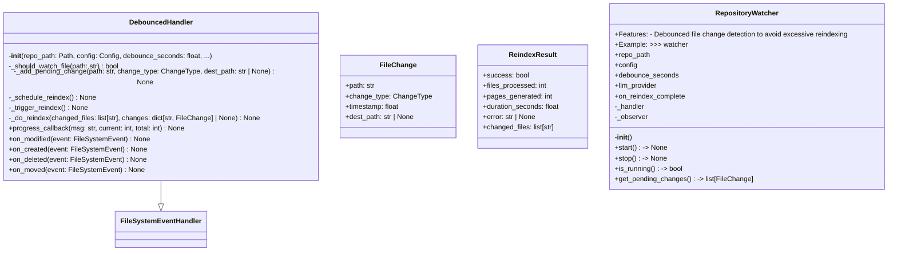

# File Overview

This file, `src/local_deepwiki/watcher.py`, implements a file system watcher for a local deepwiki application. It monitors file changes in a repository and triggers reindexing operations with debouncing to avoid excessive processing. The watcher integrates with `watchdog` for file system events and supports configuration-driven behavior.

## Dependencies

This file imports:
- Standard library modules: `argparse`, `asyncio`, `fnmatch`, `sys`, `time`, `dataclasses`, `enum`, `pathlib`, `threading`, `typing`
- External libraries: `rich.console`, `watchdog.events`, `watchdog.observers`, `watchdog.observers.api`
- Internal modules: `local_deepwiki.cli_progress`, `local_deepwiki.config`, `local_deepwiki.core.indexer`

## Integration

This file is part of the local_deepwiki project and integrates with:
- CLI components (`local_deepwiki.cli_progress`)
- Configuration management (`local_deepwiki.config`)
- Core indexing functionality (`local_deepwiki.core.indexer`)

It is used by test cases via `DebouncedHandler` and `initial_index`.

# Classes

## ChangeType

An enumeration representing the types of file changes that can be detected.

### Values
- `CREATED`: A file was created.
- `MODIFIED`: A file was modified.
- `DELETED`: A file was deleted.
- `MOVED`: A file was moved.

## FileChange

Represents a single file change event.

### Attributes
- `path`: `str` - The path to the file.
- `change_type`: `ChangeType` - The type of change.
- `timestamp`: `float` - Timestamp of the event (default: current time).
- `dest_path`: `str | None` - The destination path for moved files.

## ReindexResult

Represents the result of a reindex operation.

### Attributes
- `success`: `bool` - Whether the reindex succeeded.
- `files_processed`: `int` - Number of files processed.
- `pages_generated`: `int` - Number of pages generated.
- `duration_seconds`: `float` - Duration of the operation in seconds.
- `error`: `str | None` - Error message if the operation failed.
- `changed_files`: `list[str]` - List of files that were changed.

## DebouncedHandler

A file system event handler that debounces reindexing operations.

### Methods

#### `__init__`
Initialize the handler.

**Parameters**
- `repo_path`: `Path` - Path to the repository root.
- `config`: `Config` - Configuration instance.
- `debounce_seconds`: `float` - Seconds to wait after last change before triggering (default: 2.0).
- `llm_provider`: `str | None` - Optional LLM provider override.
- `on_reindex_complete`: `ReindexCallback | None` - Optional callback invoked when reindexing completes.

#### `_should_watch_file`
Check if a file should trigger reindexing.

**Parameters**
- `path`: `str` - Absolute path to the file.

**Returns**
- `bool` - True if the file should be watched.

#### `_add_pending_change`
Add a file change to the pending set (thread-safe).

**Parameters**
- `path`: `str` - Path to the changed file.
- `change_type`: `ChangeType` - Type of change (created, modified, deleted, moved).
- `dest_path`: `str | None` - Destination path for moved files.

#### `_schedule_reindex`
Schedule a reindex after debounce period (thread-safe).

#### `_trigger_reindex`
Trigger the actual reindex operation (thread-safe).

#### `_do_reindex`
Perform the reindex operation.

**Parameters**
- `changed_files`: `list[str]` - List of changed file paths.
- `changes`: `dict[str, FileChange] | None` - Optional dict mapping paths to FileChange details.

#### `progress_callback`
Callback function for progress reporting.

**Parameters**
- `msg`: `str` - Progress message.
- `current`: `int` - Current progress.
- `total`: `int` - Total progress.

#### `on_modified`
Handle file modification events.

**Parameters**
- `event`: `FileSystemEvent` - The file system event.

#### `on_created`
Handle file creation events.

**Parameters**
- `event`: `FileSystemEvent` - The file system event.

#### `on_deleted`
Handle file deletion events.

**Parameters**
- `event`: `FileSystemEvent` - The file system event.

#### `on_moved`
Handle file move events.

**Parameters**
- `event`: `FileSystemEvent` - The file system event.

# Functions

## initial_index

**Signature**: `initial_index(config: Config, repo_path: Path, console: Console) -> None`

Perform an initial indexing of the repository.

**Parameters**
- `config`: `Config` - Configuration instance.
- `repo_path`: `Path` - Path to the repository root.
- `console`: `Console` - Rich console for output.

## indexing_progress

**Signature**: `indexing_progress(progress: MultiPhaseProgress, phase: str, current: int, total: int) -> None`

Callback function for indexing progress reporting.

**Parameters**
- `progress`: `MultiPhaseProgress` - Progress tracking object.
- `phase`: `str` - Current phase of indexing.
- `current`: `int` - Current progress.
- `total`: `int` - Total progress.

## wiki_progress

**Signature**: `wiki_progress(progress: MultiPhaseProgress, phase: str, current: int, total: int) -> None`

Callback function for wiki generation progress reporting.

**Parameters**
- `progress`: `MultiPhaseProgress` - Progress tracking object.
- `phase`: `str` - Current phase of wiki generation.
- `current`: `int` - Current progress.
- `total`: `int` - Total progress.

## main

**Signature**: `main() -> None`

Main entry point for the watcher CLI.

# Usage Examples

The `DebouncedHandler` class is used to monitor file changes and trigger reindexing:

```python
from pathlib import Path
from local_deepwiki.config import Config
from local_deepwiki.watcher import DebouncedHandler

config = Config()
handler = DebouncedHandler(
    repo_path=Path("/path/to/repo"),
    config=config,
    debounce_seconds=2.0
)
```

The `main` function is the CLI entry point for the watcher:

```bash
python -m local_deepwiki.watcher
```

## API Reference

### class `ChangeType`

**Inherits from:** `Enum`

Type of file change detected.


<details>
<summary>View Source (lines 39-45) | <a href="https://github.com/UrbanDiver/local-deepwiki-mcp/blob/main/src/local_deepwiki/watcher.py#L39-L45">GitHub</a></summary>

```python
class ChangeType(Enum):
    """Type of file change detected."""

    CREATED = "created"
    MODIFIED = "modified"
    DELETED = "deleted"
    MOVED = "moved"
```

</details>

### class `FileChange`

Represents a single file change event.


<details>
<summary>View Source (lines 49-55) | <a href="https://github.com/UrbanDiver/local-deepwiki-mcp/blob/main/src/local_deepwiki/watcher.py#L49-L55">GitHub</a></summary>

```python
class FileChange:
    """Represents a single file change event."""

    path: str
    change_type: ChangeType
    timestamp: float = field(default_factory=time.time)
    dest_path: str | None = None  # For moved files
```

</details>

### class `ReindexResult`

Result of a reindex operation.


<details>
<summary>View Source (lines 59-67) | <a href="https://github.com/UrbanDiver/local-deepwiki-mcp/blob/main/src/local_deepwiki/watcher.py#L59-L67">GitHub</a></summary>

```python
class ReindexResult:
    """Result of a reindex operation."""

    success: bool
    files_processed: int
    pages_generated: int
    duration_seconds: float
    error: str | None = None
    changed_files: list[str] = field(default_factory=list)
```

</details>

### class `DebouncedHandler`

**Inherits from:** `FileSystemEventHandler`

File system event handler with debouncing.  This handler collects file change events and debounces them to avoid triggering reindexing on every keystroke. It tracks the type of change (create, modify, delete, move) for selective reindexing.  Thread Safety: All state mutations are protected by a lock to ensure thread safety since watchdog calls handlers from multiple threads.

**Methods:**


<details>
<summary>View Source (lines 74-359) | <a href="https://github.com/UrbanDiver/local-deepwiki-mcp/blob/main/src/local_deepwiki/watcher.py#L74-L359">GitHub</a></summary>

```python
class DebouncedHandler(FileSystemEventHandler):
    # Methods: __init__, _should_watch_file, _add_pending_change, _schedule_reindex, _trigger_reindex, _do_reindex, progress_callback, on_modified, on_created, on_deleted, on_moved
```

</details>

#### `__init__`

```python
def __init__(repo_path: Path, config: Config, debounce_seconds: float = 2.0, llm_provider: str | None = None, on_reindex_complete: ReindexCallback | None = None)
```

Initialize the handler.


| Parameter | Type | Default | Description |
|-----------|------|---------|-------------|
| `repo_path` | `Path` | - | Path to the repository root. |
| `config` | `Config` | - | Configuration instance. |
| `debounce_seconds` | `float` | `2.0` | Seconds to wait after last change before triggering. |
| `llm_provider` | `str | None` | `None` | Optional LLM provider override. |
| `on_reindex_complete` | `ReindexCallback | None` | `None` | Optional callback invoked when reindexing completes. |


<details>
<summary>View Source (lines 86-116) | <a href="https://github.com/UrbanDiver/local-deepwiki-mcp/blob/main/src/local_deepwiki/watcher.py#L86-L116">GitHub</a></summary>

```python
def __init__(
        self,
        repo_path: Path,
        config: Config,
        debounce_seconds: float = 2.0,
        llm_provider: str | None = None,
        on_reindex_complete: ReindexCallback | None = None,
    ):
        """Initialize the handler.

        Args:
            repo_path: Path to the repository root.
            config: Configuration instance.
            debounce_seconds: Seconds to wait after last change before triggering.
            llm_provider: Optional LLM provider override.
            on_reindex_complete: Optional callback invoked when reindexing completes.
        """
        self.repo_path = repo_path
        # Store a defensive copy to prevent external mutation
        self.config = config.model_copy(deep=True)
        self.debounce_seconds = debounce_seconds
        self.llm_provider = llm_provider
        self.on_reindex_complete = on_reindex_complete

        # Thread-safe state management
        self._lock = Lock()
        self._timer: Timer | None = None
        self._pending_files: set[str] = set()
        self._pending_changes: dict[str, FileChange] = {}
        self._is_processing = False
        self._last_event_time: float = 0.0
```

</details>

#### `progress_callback`

```python
def progress_callback(msg: str, current: int, total: int) -> None
```


| Parameter | Type | Default | Description |
|-----------|------|---------|-------------|
| `msg` | `str` | - | - |
| `current` | `int` | - | - |
| `total` | `int` | - | - |


<details>
<summary>View Source (lines 252-256) | <a href="https://github.com/UrbanDiver/local-deepwiki-mcp/blob/main/src/local_deepwiki/watcher.py#L252-L256">GitHub</a></summary>

```python
def progress_callback(msg: str, current: int, total: int) -> None:
                if total > 0:
                    console.print(f"  [{current}/{total}] {msg}")
                else:
                    console.print(f"  {msg}")
```

</details>

#### `on_modified`

```python
def on_modified(event: FileSystemEvent) -> None
```

Handle file modification events.


| Parameter | Type | Default | Description |
|-----------|------|---------|-------------|
| `event` | `FileSystemEvent` | - | - |


<details>
<summary>View Source (lines 314-322) | <a href="https://github.com/UrbanDiver/local-deepwiki-mcp/blob/main/src/local_deepwiki/watcher.py#L314-L322">GitHub</a></summary>

```python
def on_modified(self, event: FileSystemEvent) -> None:
        """Handle file modification events."""
        if event.is_directory:
            return

        src_path = str(event.src_path)
        if self._should_watch_file(src_path):
            self._add_pending_change(src_path, ChangeType.MODIFIED)
            self._schedule_reindex()
```

</details>

#### `on_created`

```python
def on_created(event: FileSystemEvent) -> None
```

Handle file creation events.


| Parameter | Type | Default | Description |
|-----------|------|---------|-------------|
| `event` | `FileSystemEvent` | - | - |


<details>
<summary>View Source (lines 324-332) | <a href="https://github.com/UrbanDiver/local-deepwiki-mcp/blob/main/src/local_deepwiki/watcher.py#L324-L332">GitHub</a></summary>

```python
def on_created(self, event: FileSystemEvent) -> None:
        """Handle file creation events."""
        if event.is_directory:
            return

        src_path = str(event.src_path)
        if self._should_watch_file(src_path):
            self._add_pending_change(src_path, ChangeType.CREATED)
            self._schedule_reindex()
```

</details>

#### `on_deleted`

```python
def on_deleted(event: FileSystemEvent) -> None
```

Handle file deletion events.


| Parameter | Type | Default | Description |
|-----------|------|---------|-------------|
| `event` | `FileSystemEvent` | - | - |


<details>
<summary>View Source (lines 334-342) | <a href="https://github.com/UrbanDiver/local-deepwiki-mcp/blob/main/src/local_deepwiki/watcher.py#L334-L342">GitHub</a></summary>

```python
def on_deleted(self, event: FileSystemEvent) -> None:
        """Handle file deletion events."""
        if event.is_directory:
            return

        src_path = str(event.src_path)
        if self._should_watch_file(src_path):
            self._add_pending_change(src_path, ChangeType.DELETED)
            self._schedule_reindex()
```

</details>

#### `on_moved`

```python
def on_moved(event: FileSystemEvent) -> None
```

Handle file move events.


| Parameter | Type | Default | Description |
|-----------|------|---------|-------------|
| `event` | `FileSystemEvent` | - | - |


<details>
<summary>View Source (lines 344-359) | <a href="https://github.com/UrbanDiver/local-deepwiki-mcp/blob/main/src/local_deepwiki/watcher.py#L344-L359">GitHub</a></summary>

```python
def on_moved(self, event: FileSystemEvent) -> None:
        """Handle file move events."""
        if event.is_directory:
            return

        # Check both source and destination
        src_path = str(event.src_path)
        dest_path_str = str(event.dest_path) if hasattr(event, "dest_path") else None

        if self._should_watch_file(src_path):
            self._add_pending_change(src_path, ChangeType.MOVED, dest_path=dest_path_str)
            self._schedule_reindex()

        if dest_path_str and self._should_watch_file(dest_path_str):
            self._add_pending_change(dest_path_str, ChangeType.CREATED)
            self._schedule_reindex()
```

</details>

### class `RepositoryWatcher`

Watches a repository for file changes and triggers reindexing.  This class provides a high-level interface for watching a repository and automatically regenerating wiki documentation when files change.  Features: - Debounced file change detection to avoid excessive reindexing - Callback mechanism for notification when reindexing completes - Thread-safe operation with graceful shutdown

**Methods:**


<details>
<summary>View Source (lines 362-453) | <a href="https://github.com/UrbanDiver/local-deepwiki-mcp/blob/main/src/local_deepwiki/watcher.py#L362-L453">GitHub</a></summary>

```python
class RepositoryWatcher:
    """Watches a repository for file changes and triggers reindexing.

    This class provides a high-level interface for watching a repository
    and automatically regenerating wiki documentation when files change.

    Features:
        - Debounced file change detection to avoid excessive reindexing
        - Callback mechanism for notification when reindexing completes
        - Thread-safe operation with graceful shutdown

    Example:
        >>> watcher = RepositoryWatcher(
        ...     repo_path=Path("/path/to/repo"),
        ...     debounce_seconds=2.0,
        ...     on_reindex_complete=lambda result: print(f"Done: {result.success}")
        ... )
        >>> watcher.start()
        >>> # ... do work ...
        >>> watcher.stop()
    """

    def __init__(
        self,
        repo_path: Path,
        config: Config | None = None,
        debounce_seconds: float = 2.0,
        llm_provider: str | None = None,
        on_reindex_complete: ReindexCallback | None = None,
    ):
        """Initialize the watcher.

        Args:
            repo_path: Path to the repository to watch.
            config: Optional configuration.
            debounce_seconds: Seconds to wait after changes before reindexing.
            llm_provider: Optional LLM provider override.
            on_reindex_complete: Optional callback invoked when reindexing completes.
                The callback receives a ReindexResult with details about the operation.
        """
        self.repo_path = repo_path.resolve()
        base_config = config or get_config()
        # Store a defensive copy to prevent external mutation
        self.config = base_config.model_copy(deep=True)
        self.debounce_seconds = debounce_seconds
        self.llm_provider = llm_provider
        self.on_reindex_complete = on_reindex_complete
        self._observer: BaseObserver | None = None
        self._handler: DebouncedHandler | None = None

    def start(self) -> None:
        """Start watching the repository."""
        logger.info(f"Starting file watcher for {self.repo_path}")

        self._handler = DebouncedHandler(
            repo_path=self.repo_path,
            config=self.config,
            debounce_seconds=self.debounce_seconds,
            llm_provider=self.llm_provider,
            on_reindex_complete=self.on_reindex_complete,
        )

        observer = Observer()
        observer.schedule(self._handler, str(self.repo_path), recursive=True)
        observer.start()
        self._observer = observer
        logger.debug("File watcher started successfully")

    def stop(self) -> None:
        """Stop watching the repository."""
        logger.info("Stopping file watcher")
        if self._observer:
            self._observer.stop()
            self._observer.join()
            self._observer = None
            self._handler = None
            logger.debug("File watcher stopped")

    def is_running(self) -> bool:
        """Check if the watcher is running."""
        return self._observer is not None and self._observer.is_alive()

    def get_pending_changes(self) -> list[FileChange]:
        """Get the list of pending file changes (for debugging/monitoring).

        Returns:
            List of FileChange objects for pending changes.
        """
        if self._handler is None:
            return []
        with self._handler._lock:
            return list(self._handler._pending_changes.values())
```

</details>

#### `__init__`

```python
def __init__(repo_path: Path, config: Config | None = None, debounce_seconds: float = 2.0, llm_provider: str | None = None, on_reindex_complete: ReindexCallback | None = None)
```

Initialize the watcher.


| Parameter | Type | Default | Description |
|-----------|------|---------|-------------|
| `repo_path` | `Path` | - | Path to the repository to watch. |
| `config` | `Config | None` | `None` | Optional configuration. |
| `debounce_seconds` | `float` | `2.0` | Seconds to wait after changes before reindexing. |
| `llm_provider` | `str | None` | `None` | Optional LLM provider override. |
| `on_reindex_complete` | `ReindexCallback | None` | `None` | Optional callback invoked when reindexing completes. The callback receives a ReindexResult with details about the operation. |


<details>
<summary>View Source (lines 362-453) | <a href="https://github.com/UrbanDiver/local-deepwiki-mcp/blob/main/src/local_deepwiki/watcher.py#L362-L453">GitHub</a></summary>

```python
class RepositoryWatcher:
    """Watches a repository for file changes and triggers reindexing.

    This class provides a high-level interface for watching a repository
    and automatically regenerating wiki documentation when files change.

    Features:
        - Debounced file change detection to avoid excessive reindexing
        - Callback mechanism for notification when reindexing completes
        - Thread-safe operation with graceful shutdown

    Example:
        >>> watcher = RepositoryWatcher(
        ...     repo_path=Path("/path/to/repo"),
        ...     debounce_seconds=2.0,
        ...     on_reindex_complete=lambda result: print(f"Done: {result.success}")
        ... )
        >>> watcher.start()
        >>> # ... do work ...
        >>> watcher.stop()
    """

    def __init__(
        self,
        repo_path: Path,
        config: Config | None = None,
        debounce_seconds: float = 2.0,
        llm_provider: str | None = None,
        on_reindex_complete: ReindexCallback | None = None,
    ):
        """Initialize the watcher.

        Args:
            repo_path: Path to the repository to watch.
            config: Optional configuration.
            debounce_seconds: Seconds to wait after changes before reindexing.
            llm_provider: Optional LLM provider override.
            on_reindex_complete: Optional callback invoked when reindexing completes.
                The callback receives a ReindexResult with details about the operation.
        """
        self.repo_path = repo_path.resolve()
        base_config = config or get_config()
        # Store a defensive copy to prevent external mutation
        self.config = base_config.model_copy(deep=True)
        self.debounce_seconds = debounce_seconds
        self.llm_provider = llm_provider
        self.on_reindex_complete = on_reindex_complete
        self._observer: BaseObserver | None = None
        self._handler: DebouncedHandler | None = None

    def start(self) -> None:
        """Start watching the repository."""
        logger.info(f"Starting file watcher for {self.repo_path}")

        self._handler = DebouncedHandler(
            repo_path=self.repo_path,
            config=self.config,
            debounce_seconds=self.debounce_seconds,
            llm_provider=self.llm_provider,
            on_reindex_complete=self.on_reindex_complete,
        )

        observer = Observer()
        observer.schedule(self._handler, str(self.repo_path), recursive=True)
        observer.start()
        self._observer = observer
        logger.debug("File watcher started successfully")

    def stop(self) -> None:
        """Stop watching the repository."""
        logger.info("Stopping file watcher")
        if self._observer:
            self._observer.stop()
            self._observer.join()
            self._observer = None
            self._handler = None
            logger.debug("File watcher stopped")

    def is_running(self) -> bool:
        """Check if the watcher is running."""
        return self._observer is not None and self._observer.is_alive()

    def get_pending_changes(self) -> list[FileChange]:
        """Get the list of pending file changes (for debugging/monitoring).

        Returns:
            List of FileChange objects for pending changes.
        """
        if self._handler is None:
            return []
        with self._handler._lock:
            return list(self._handler._pending_changes.values())
```

</details>

#### `start`

```python
def start() -> None
```

Start watching the repository.


<details>
<summary>View Source (lines 362-453) | <a href="https://github.com/UrbanDiver/local-deepwiki-mcp/blob/main/src/local_deepwiki/watcher.py#L362-L453">GitHub</a></summary>

```python
class RepositoryWatcher:
    """Watches a repository for file changes and triggers reindexing.

    This class provides a high-level interface for watching a repository
    and automatically regenerating wiki documentation when files change.

    Features:
        - Debounced file change detection to avoid excessive reindexing
        - Callback mechanism for notification when reindexing completes
        - Thread-safe operation with graceful shutdown

    Example:
        >>> watcher = RepositoryWatcher(
        ...     repo_path=Path("/path/to/repo"),
        ...     debounce_seconds=2.0,
        ...     on_reindex_complete=lambda result: print(f"Done: {result.success}")
        ... )
        >>> watcher.start()
        >>> # ... do work ...
        >>> watcher.stop()
    """

    def __init__(
        self,
        repo_path: Path,
        config: Config | None = None,
        debounce_seconds: float = 2.0,
        llm_provider: str | None = None,
        on_reindex_complete: ReindexCallback | None = None,
    ):
        """Initialize the watcher.

        Args:
            repo_path: Path to the repository to watch.
            config: Optional configuration.
            debounce_seconds: Seconds to wait after changes before reindexing.
            llm_provider: Optional LLM provider override.
            on_reindex_complete: Optional callback invoked when reindexing completes.
                The callback receives a ReindexResult with details about the operation.
        """
        self.repo_path = repo_path.resolve()
        base_config = config or get_config()
        # Store a defensive copy to prevent external mutation
        self.config = base_config.model_copy(deep=True)
        self.debounce_seconds = debounce_seconds
        self.llm_provider = llm_provider
        self.on_reindex_complete = on_reindex_complete
        self._observer: BaseObserver | None = None
        self._handler: DebouncedHandler | None = None

    def start(self) -> None:
        """Start watching the repository."""
        logger.info(f"Starting file watcher for {self.repo_path}")

        self._handler = DebouncedHandler(
            repo_path=self.repo_path,
            config=self.config,
            debounce_seconds=self.debounce_seconds,
            llm_provider=self.llm_provider,
            on_reindex_complete=self.on_reindex_complete,
        )

        observer = Observer()
        observer.schedule(self._handler, str(self.repo_path), recursive=True)
        observer.start()
        self._observer = observer
        logger.debug("File watcher started successfully")

    def stop(self) -> None:
        """Stop watching the repository."""
        logger.info("Stopping file watcher")
        if self._observer:
            self._observer.stop()
            self._observer.join()
            self._observer = None
            self._handler = None
            logger.debug("File watcher stopped")

    def is_running(self) -> bool:
        """Check if the watcher is running."""
        return self._observer is not None and self._observer.is_alive()

    def get_pending_changes(self) -> list[FileChange]:
        """Get the list of pending file changes (for debugging/monitoring).

        Returns:
            List of FileChange objects for pending changes.
        """
        if self._handler is None:
            return []
        with self._handler._lock:
            return list(self._handler._pending_changes.values())
```

</details>

#### `stop`

```python
def stop() -> None
```

Stop watching the repository.


<details>
<summary>View Source (lines 362-453) | <a href="https://github.com/UrbanDiver/local-deepwiki-mcp/blob/main/src/local_deepwiki/watcher.py#L362-L453">GitHub</a></summary>

```python
class RepositoryWatcher:
    """Watches a repository for file changes and triggers reindexing.

    This class provides a high-level interface for watching a repository
    and automatically regenerating wiki documentation when files change.

    Features:
        - Debounced file change detection to avoid excessive reindexing
        - Callback mechanism for notification when reindexing completes
        - Thread-safe operation with graceful shutdown

    Example:
        >>> watcher = RepositoryWatcher(
        ...     repo_path=Path("/path/to/repo"),
        ...     debounce_seconds=2.0,
        ...     on_reindex_complete=lambda result: print(f"Done: {result.success}")
        ... )
        >>> watcher.start()
        >>> # ... do work ...
        >>> watcher.stop()
    """

    def __init__(
        self,
        repo_path: Path,
        config: Config | None = None,
        debounce_seconds: float = 2.0,
        llm_provider: str | None = None,
        on_reindex_complete: ReindexCallback | None = None,
    ):
        """Initialize the watcher.

        Args:
            repo_path: Path to the repository to watch.
            config: Optional configuration.
            debounce_seconds: Seconds to wait after changes before reindexing.
            llm_provider: Optional LLM provider override.
            on_reindex_complete: Optional callback invoked when reindexing completes.
                The callback receives a ReindexResult with details about the operation.
        """
        self.repo_path = repo_path.resolve()
        base_config = config or get_config()
        # Store a defensive copy to prevent external mutation
        self.config = base_config.model_copy(deep=True)
        self.debounce_seconds = debounce_seconds
        self.llm_provider = llm_provider
        self.on_reindex_complete = on_reindex_complete
        self._observer: BaseObserver | None = None
        self._handler: DebouncedHandler | None = None

    def start(self) -> None:
        """Start watching the repository."""
        logger.info(f"Starting file watcher for {self.repo_path}")

        self._handler = DebouncedHandler(
            repo_path=self.repo_path,
            config=self.config,
            debounce_seconds=self.debounce_seconds,
            llm_provider=self.llm_provider,
            on_reindex_complete=self.on_reindex_complete,
        )

        observer = Observer()
        observer.schedule(self._handler, str(self.repo_path), recursive=True)
        observer.start()
        self._observer = observer
        logger.debug("File watcher started successfully")

    def stop(self) -> None:
        """Stop watching the repository."""
        logger.info("Stopping file watcher")
        if self._observer:
            self._observer.stop()
            self._observer.join()
            self._observer = None
            self._handler = None
            logger.debug("File watcher stopped")

    def is_running(self) -> bool:
        """Check if the watcher is running."""
        return self._observer is not None and self._observer.is_alive()

    def get_pending_changes(self) -> list[FileChange]:
        """Get the list of pending file changes (for debugging/monitoring).

        Returns:
            List of FileChange objects for pending changes.
        """
        if self._handler is None:
            return []
        with self._handler._lock:
            return list(self._handler._pending_changes.values())
```

</details>

#### `is_running`

```python
def is_running() -> bool
```

Check if the watcher is running.


<details>
<summary>View Source (lines 362-453) | <a href="https://github.com/UrbanDiver/local-deepwiki-mcp/blob/main/src/local_deepwiki/watcher.py#L362-L453">GitHub</a></summary>

```python
class RepositoryWatcher:
    """Watches a repository for file changes and triggers reindexing.

    This class provides a high-level interface for watching a repository
    and automatically regenerating wiki documentation when files change.

    Features:
        - Debounced file change detection to avoid excessive reindexing
        - Callback mechanism for notification when reindexing completes
        - Thread-safe operation with graceful shutdown

    Example:
        >>> watcher = RepositoryWatcher(
        ...     repo_path=Path("/path/to/repo"),
        ...     debounce_seconds=2.0,
        ...     on_reindex_complete=lambda result: print(f"Done: {result.success}")
        ... )
        >>> watcher.start()
        >>> # ... do work ...
        >>> watcher.stop()
    """

    def __init__(
        self,
        repo_path: Path,
        config: Config | None = None,
        debounce_seconds: float = 2.0,
        llm_provider: str | None = None,
        on_reindex_complete: ReindexCallback | None = None,
    ):
        """Initialize the watcher.

        Args:
            repo_path: Path to the repository to watch.
            config: Optional configuration.
            debounce_seconds: Seconds to wait after changes before reindexing.
            llm_provider: Optional LLM provider override.
            on_reindex_complete: Optional callback invoked when reindexing completes.
                The callback receives a ReindexResult with details about the operation.
        """
        self.repo_path = repo_path.resolve()
        base_config = config or get_config()
        # Store a defensive copy to prevent external mutation
        self.config = base_config.model_copy(deep=True)
        self.debounce_seconds = debounce_seconds
        self.llm_provider = llm_provider
        self.on_reindex_complete = on_reindex_complete
        self._observer: BaseObserver | None = None
        self._handler: DebouncedHandler | None = None

    def start(self) -> None:
        """Start watching the repository."""
        logger.info(f"Starting file watcher for {self.repo_path}")

        self._handler = DebouncedHandler(
            repo_path=self.repo_path,
            config=self.config,
            debounce_seconds=self.debounce_seconds,
            llm_provider=self.llm_provider,
            on_reindex_complete=self.on_reindex_complete,
        )

        observer = Observer()
        observer.schedule(self._handler, str(self.repo_path), recursive=True)
        observer.start()
        self._observer = observer
        logger.debug("File watcher started successfully")

    def stop(self) -> None:
        """Stop watching the repository."""
        logger.info("Stopping file watcher")
        if self._observer:
            self._observer.stop()
            self._observer.join()
            self._observer = None
            self._handler = None
            logger.debug("File watcher stopped")

    def is_running(self) -> bool:
        """Check if the watcher is running."""
        return self._observer is not None and self._observer.is_alive()

    def get_pending_changes(self) -> list[FileChange]:
        """Get the list of pending file changes (for debugging/monitoring).

        Returns:
            List of FileChange objects for pending changes.
        """
        if self._handler is None:
            return []
        with self._handler._lock:
            return list(self._handler._pending_changes.values())
```

</details>

#### `get_pending_changes`

```python
def get_pending_changes() -> list[FileChange]
```

Get the list of pending file changes (for debugging/monitoring).


---


<details>
<summary>View Source (lines 362-453) | <a href="https://github.com/UrbanDiver/local-deepwiki-mcp/blob/main/src/local_deepwiki/watcher.py#L362-L453">GitHub</a></summary>

```python
class RepositoryWatcher:
    """Watches a repository for file changes and triggers reindexing.

    This class provides a high-level interface for watching a repository
    and automatically regenerating wiki documentation when files change.

    Features:
        - Debounced file change detection to avoid excessive reindexing
        - Callback mechanism for notification when reindexing completes
        - Thread-safe operation with graceful shutdown

    Example:
        >>> watcher = RepositoryWatcher(
        ...     repo_path=Path("/path/to/repo"),
        ...     debounce_seconds=2.0,
        ...     on_reindex_complete=lambda result: print(f"Done: {result.success}")
        ... )
        >>> watcher.start()
        >>> # ... do work ...
        >>> watcher.stop()
    """

    def __init__(
        self,
        repo_path: Path,
        config: Config | None = None,
        debounce_seconds: float = 2.0,
        llm_provider: str | None = None,
        on_reindex_complete: ReindexCallback | None = None,
    ):
        """Initialize the watcher.

        Args:
            repo_path: Path to the repository to watch.
            config: Optional configuration.
            debounce_seconds: Seconds to wait after changes before reindexing.
            llm_provider: Optional LLM provider override.
            on_reindex_complete: Optional callback invoked when reindexing completes.
                The callback receives a ReindexResult with details about the operation.
        """
        self.repo_path = repo_path.resolve()
        base_config = config or get_config()
        # Store a defensive copy to prevent external mutation
        self.config = base_config.model_copy(deep=True)
        self.debounce_seconds = debounce_seconds
        self.llm_provider = llm_provider
        self.on_reindex_complete = on_reindex_complete
        self._observer: BaseObserver | None = None
        self._handler: DebouncedHandler | None = None

    def start(self) -> None:
        """Start watching the repository."""
        logger.info(f"Starting file watcher for {self.repo_path}")

        self._handler = DebouncedHandler(
            repo_path=self.repo_path,
            config=self.config,
            debounce_seconds=self.debounce_seconds,
            llm_provider=self.llm_provider,
            on_reindex_complete=self.on_reindex_complete,
        )

        observer = Observer()
        observer.schedule(self._handler, str(self.repo_path), recursive=True)
        observer.start()
        self._observer = observer
        logger.debug("File watcher started successfully")

    def stop(self) -> None:
        """Stop watching the repository."""
        logger.info("Stopping file watcher")
        if self._observer:
            self._observer.stop()
            self._observer.join()
            self._observer = None
            self._handler = None
            logger.debug("File watcher stopped")

    def is_running(self) -> bool:
        """Check if the watcher is running."""
        return self._observer is not None and self._observer.is_alive()

    def get_pending_changes(self) -> list[FileChange]:
        """Get the list of pending file changes (for debugging/monitoring).

        Returns:
            List of FileChange objects for pending changes.
        """
        if self._handler is None:
            return []
        with self._handler._lock:
            return list(self._handler._pending_changes.values())
```

</details>

### Functions

#### `initial_index`

```python
async def initial_index(repo_path: Path, config: Config, llm_provider: str | None = None, full_rebuild: bool = False, no_progress: bool = False) -> None
```

Perform initial indexing before starting watch mode.


| Parameter | Type | Default | Description |
|-----------|------|---------|-------------|
| `repo_path` | `Path` | - | Path to the repository. |
| `config` | `Config` | - | Configuration instance. |
| `llm_provider` | `str | None` | `None` | Optional LLM provider override. |
| `full_rebuild` | `bool` | `False` | Whether to do a full rebuild. |
| `no_progress` | `bool` | `False` | If True, disable progress bars. |

**Returns:** `None`


<details>
<summary>View Source (lines 456-532) | <a href="https://github.com/UrbanDiver/local-deepwiki-mcp/blob/main/src/local_deepwiki/watcher.py#L456-L532">GitHub</a></summary>

```python
async def initial_index(
    repo_path: Path,
    config: Config,
    llm_provider: str | None = None,
    full_rebuild: bool = False,
    *,
    no_progress: bool = False,
) -> None:
    """Perform initial indexing before starting watch mode.

    Args:
        repo_path: Path to the repository.
        config: Configuration instance.
        llm_provider: Optional LLM provider override.
        full_rebuild: Whether to do a full rebuild.
        no_progress: If True, disable progress bars.
    """
    console.print("[yellow]Running initial index...[/yellow]")

    indexer = RepositoryIndexer(repo_path=repo_path, config=config)
    start_time = time.time()

    with MultiPhaseProgress(disable=no_progress) as progress:
        # Add phases
        progress.add_phase("indexing", "Indexing repository", total=0)
        progress.add_phase("wiki", "Generating wiki", total=0)

        # Create callback adapter for indexing phase
        index_callback = progress.get_callback("indexing")

        def indexing_progress(msg: str, current: int, total: int) -> None:
            if index_callback:
                index_callback(msg, current, total)
            else:
                if total > 0:
                    console.print(f"  [{current}/{total}] {msg}")
                else:
                    console.print(f"  {msg}")

        status = await indexer.index(
            full_rebuild=full_rebuild,
            progress_callback=indexing_progress,
        )

        progress.complete_phase("indexing")
        console.print(
            f"[green]Indexed {status.total_files} files, {status.total_chunks} chunks[/green]"
        )

        # Create callback adapter for wiki phase
        wiki_callback = progress.get_callback("wiki")

        def wiki_progress(msg: str, current: int, total: int) -> None:
            if wiki_callback:
                wiki_callback(msg, current, total)
            else:
                if total > 0:
                    console.print(f"  [{current}/{total}] {msg}")
                else:
                    console.print(f"  {msg}")

        wiki_structure = await generate_wiki(
            repo_path=repo_path,
            wiki_path=indexer.wiki_path,
            vector_store=indexer.vector_store,
            index_status=status,
            config=config,
            llm_provider=llm_provider,
            progress_callback=wiki_progress,
            full_rebuild=full_rebuild,
        )

        progress.complete_phase("wiki")

    total_time = time.time() - start_time
    console.print(f"[green]Generated {len(wiki_structure.pages)} wiki pages[/green]")
    console.print(f"[bold green]Initial index complete in {total_time:.1f}s[/bold green]")
```

</details>

#### `indexing_progress`

```python
def indexing_progress(msg: str, current: int, total: int) -> None
```


| Parameter | Type | Default | Description |
|-----------|------|---------|-------------|
| `msg` | `str` | - | - |
| `current` | `int` | - | - |
| `total` | `int` | - | - |

**Returns:** `None`


<details>
<summary>View Source (lines 486-493) | <a href="https://github.com/UrbanDiver/local-deepwiki-mcp/blob/main/src/local_deepwiki/watcher.py#L486-L493">GitHub</a></summary>

```python
def indexing_progress(msg: str, current: int, total: int) -> None:
            if index_callback:
                index_callback(msg, current, total)
            else:
                if total > 0:
                    console.print(f"  [{current}/{total}] {msg}")
                else:
                    console.print(f"  {msg}")
```

</details>

#### `wiki_progress`

```python
def wiki_progress(msg: str, current: int, total: int) -> None
```


| Parameter | Type | Default | Description |
|-----------|------|---------|-------------|
| `msg` | `str` | - | - |
| `current` | `int` | - | - |
| `total` | `int` | - | - |

**Returns:** `None`


<details>
<summary>View Source (lines 508-515) | <a href="https://github.com/UrbanDiver/local-deepwiki-mcp/blob/main/src/local_deepwiki/watcher.py#L508-L515">GitHub</a></summary>

```python
def wiki_progress(msg: str, current: int, total: int) -> None:
            if wiki_callback:
                wiki_callback(msg, current, total)
            else:
                if total > 0:
                    console.print(f"  [{current}/{total}] {msg}")
                else:
                    console.print(f"  {msg}")
```

</details>

#### `main`

```python
def main() -> None
```

Main entry point for the watch command.

**Returns:** `None`


<details>
<summary>View Source (lines 535-628) | <a href="https://github.com/UrbanDiver/local-deepwiki-mcp/blob/main/src/local_deepwiki/watcher.py#L535-L628">GitHub</a></summary>

```python
def main() -> None:
    """Main entry point for the watch command."""
    parser = argparse.ArgumentParser(
        description="Watch a repository for changes and auto-regenerate wiki documentation."
    )
    parser.add_argument(
        "repo_path",
        type=str,
        nargs="?",
        default=".",
        help="Path to the repository to watch (default: current directory)",
    )
    parser.add_argument(
        "--debounce",
        type=float,
        default=2.0,
        help="Seconds to wait after changes before reindexing (default: 2.0)",
    )
    parser.add_argument(
        "--llm",
        type=str,
        choices=["ollama", "anthropic", "openai"],
        help="LLM provider for wiki generation",
    )
    parser.add_argument(
        "--full-rebuild",
        action="store_true",
        help="Perform a full rebuild on startup instead of incremental",
    )
    parser.add_argument(
        "--skip-initial",
        action="store_true",
        help="Skip initial indexing, just start watching",
    )
    parser.add_argument(
        "--no-progress",
        action="store_true",
        help="Disable progress bars (for non-interactive use)",
    )

    args = parser.parse_args()

    repo_path = Path(args.repo_path).resolve()
    if not repo_path.exists():
        console.print(f"[red]Error: Path does not exist: {repo_path}[/red]")
        sys.exit(1)

    if not repo_path.is_dir():
        console.print(f"[red]Error: Path is not a directory: {repo_path}[/red]")
        sys.exit(1)

    config = get_config()

    console.print()
    console.print("[bold]DeepWiki Watch Mode[/bold]")
    console.print(f"Repository: [cyan]{repo_path}[/cyan]")
    console.print(f"Debounce: [cyan]{args.debounce}s[/cyan]")
    console.print(f"LLM Provider: [cyan]{args.llm or config.llm.provider}[/cyan]")
    console.print()

    # Run initial index unless skipped
    if not args.skip_initial:
        asyncio.run(
            initial_index(
                repo_path=repo_path,
                config=config,
                llm_provider=args.llm,
                full_rebuild=args.full_rebuild,
                no_progress=args.no_progress,
            )
        )

    # Start watching
    console.print()
    console.rule("[bold blue]Starting Watch Mode[/bold blue]")
    console.print("[dim]Watching for changes... (Ctrl+C to stop)[/dim]")
    console.print()

    watcher = RepositoryWatcher(
        repo_path=repo_path,
        config=config,
        debounce_seconds=args.debounce,
        llm_provider=args.llm,
    )

    try:
        watcher.start()
        while watcher.is_running():
            time.sleep(1)
    except KeyboardInterrupt:
        console.print()
        console.print("[yellow]Stopping watcher...[/yellow]")
        watcher.stop()
        console.print("[green]Done.[/green]")
```

</details>

## Class Diagram


```mermaid
classDiagram
    class DebouncedHandler {
        -__init__(repo_path: Path, config: Config, debounce_seconds: float, ...)
        -_should_watch_file(path: str) bool
        -_add_pending_change(path: str, change_type: ChangeType, dest_path: str | None) None
        -_schedule_reindex() None
        -_trigger_reindex() None
        -_do_reindex(changed_files: list[str], changes: dict[str, FileChange] | None) None
        +progress_callback(msg: str, current: int, total: int) None
        +on_modified(event: FileSystemEvent) None
        +on_created(event: FileSystemEvent) None
        +on_deleted(event: FileSystemEvent) None
        +on_moved(event: FileSystemEvent) None
    }
    class FileChange {
        +path: str
        +change_type: ChangeType
        +timestamp: float
        +dest_path: str | None
    }
    class ReindexResult {
        +success: bool
        +files_processed: int
        +pages_generated: int
        +duration_seconds: float
        +error: str | None
        +changed_files: list[str]
    }
    class RepositoryWatcher {
        +Features: - Debounced file change detection to avoid excessive reindexing
        +Example: >>> watcher
        +repo_path
        +config
        +debounce_seconds
        +llm_provider
        +on_reindex_complete
        -_handler
        -_observer
        -__init__()
        +start() -> None
        +stop() -> None
        +is_running() -> bool
        +get_pending_changes() -> list[FileChange]
    }
    DebouncedHandler --|> FileSystemEventHandler
```

## Call Graph


```mermaid
flowchart TD
    N0[DebouncedHandler.__init__]
    N1[DebouncedHandler._add_pendi...]
    N2[DebouncedHandler._do_reindex]
    N3[DebouncedHandler._schedule_...]
    N4[DebouncedHandler._should_wa...]
    N5[DebouncedHandler._trigger_r...]
    N6[DebouncedHandler.on_created]
    N7[DebouncedHandler.on_deleted]
    N8[DebouncedHandler.on_modified]
    N9[DebouncedHandler.on_moved]
    N10[Path]
    N11[RepositoryIndexer]
    N12[RepositoryWatcher.__init__]
    N13[RepositoryWatcher.start]
    N14[_add_pending_change]
    N15[_schedule_reindex]
    N16[_should_watch_file]
    N17[generate_wiki]
    N18[get_config]
    N19[index_callback]
    N20[initial_index]
    N21[main]
    N22[model_copy]
    N23[resolve]
    N24[rule]
    N25[run]
    N26[start]
    N27[stop]
    N28[time]
    N29[wiki_callback]
    N20 --> N11
    N20 --> N28
    N20 --> N19
    N20 --> N29
    N20 --> N17
    N21 --> N23
    N21 --> N10
    N21 --> N18
    N21 --> N25
    N21 --> N20
    N21 --> N24
    N21 --> N26
    N21 --> N27
    N0 --> N22
    N4 --> N10
    N1 --> N28
    N3 --> N26
    N5 --> N15
    N5 --> N25
    N2 --> N28
    N2 --> N24
    N2 --> N10
    N2 --> N11
    N2 --> N17
    N8 --> N16
    N8 --> N14
    N8 --> N15
    N6 --> N16
    N6 --> N14
    N6 --> N15
    N7 --> N16
    N7 --> N14
    N7 --> N15
    N9 --> N16
    N9 --> N14
    N9 --> N15
    N12 --> N23
    N12 --> N18
    N12 --> N22
    N13 --> N26
    classDef func fill:#e1f5fe
    class N10,N11,N14,N15,N16,N17,N18,N19,N20,N21,N22,N23,N24,N25,N26,N27,N28,N29 func
    classDef method fill:#fff3e0
    class N0,N1,N2,N3,N4,N5,N6,N7,N8,N9,N12,N13 method
```

## Used By

Functions and methods in this file and their callers:

- **`ArgumentParser`**: called by `main`
- **`DebouncedHandler`**: called by `RepositoryWatcher.start`
- **`FileChange`**: called by `DebouncedHandler._add_pending_change`
- **`Lock`**: called by `DebouncedHandler.__init__`
- **`MultiPhaseProgress`**: called by `initial_index`
- **`Observer`**: called by `RepositoryWatcher.start`
- **`Path`**: called by `DebouncedHandler._do_reindex`, `DebouncedHandler._should_watch_file`, `main`
- **`ReindexResult`**: called by `DebouncedHandler._do_reindex`
- **`RepositoryIndexer`**: called by `DebouncedHandler._do_reindex`, `initial_index`
- **`RepositoryWatcher`**: called by `main`
- **`Timer`**: called by `DebouncedHandler._schedule_reindex`
- **`_add_pending_change`**: called by `DebouncedHandler.on_created`, `DebouncedHandler.on_deleted`, `DebouncedHandler.on_modified`, `DebouncedHandler.on_moved`
- **`_do_reindex`**: called by `DebouncedHandler._trigger_reindex`
- **`_schedule_reindex`**: called by `DebouncedHandler._trigger_reindex`, `DebouncedHandler.on_created`, `DebouncedHandler.on_deleted`, `DebouncedHandler.on_modified`, `DebouncedHandler.on_moved`
- **`_should_watch_file`**: called by `DebouncedHandler.on_created`, `DebouncedHandler.on_deleted`, `DebouncedHandler.on_modified`, `DebouncedHandler.on_moved`
- **`add`**: called by `DebouncedHandler._add_pending_change`
- **`add_argument`**: called by `main`
- **`add_phase`**: called by `initial_index`
- **`cancel`**: called by `DebouncedHandler._schedule_reindex`
- **`complete_phase`**: called by `initial_index`
- **`exception`**: called by `DebouncedHandler._do_reindex`
- **`exists`**: called by `main`
- **`exit`**: called by `main`
- **`fnmatch`**: called by `DebouncedHandler._should_watch_file`
- **`generate_wiki`**: called by `DebouncedHandler._do_reindex`, `initial_index`
- **`get_callback`**: called by `initial_index`
- **`get_config`**: called by `RepositoryWatcher.__init__`, `main`
- **`index_callback`**: called by `indexing_progress`, `initial_index`
- **`initial_index`**: called by `main`
- **`is_alive`**: called by `RepositoryWatcher.is_running`
- **`is_dir`**: called by `main`
- **`is_running`**: called by `main`
- **`model_copy`**: called by `DebouncedHandler.__init__`, `RepositoryWatcher.__init__`
- **`on_reindex_complete`**: called by `DebouncedHandler._do_reindex`
- **`parse_args`**: called by `main`
- **`relative_to`**: called by `DebouncedHandler._do_reindex`, `DebouncedHandler._should_watch_file`
- **`resolve`**: called by `RepositoryWatcher.__init__`, `main`
- **`rule`**: called by `DebouncedHandler._do_reindex`, `main`
- **`run`**: called by `DebouncedHandler._trigger_reindex`, `main`
- **`schedule`**: called by `RepositoryWatcher.start`
- **`sleep`**: called by `main`
- **`start`**: called by `DebouncedHandler._schedule_reindex`, `RepositoryWatcher.start`, `main`
- **`stop`**: called by `RepositoryWatcher.stop`, `main`
- **`time`**: called by `DebouncedHandler._add_pending_change`, `DebouncedHandler._do_reindex`, `initial_index`
- **`wiki_callback`**: called by `initial_index`, `wiki_progress`

## Usage Examples

*Examples extracted from test files*

### Test that Python files are watched

From `test_watcher.py::TestDebouncedHandler::test_should_watch_python_file`:

```python
test_file = tmp_path / "test.py"
test_file.touch()
assert handler._should_watch_file(str(test_file)) is True
```

### Test that TypeScript files are watched

From `test_watcher.py::TestDebouncedHandler::test_should_watch_typescript_file`:

```python
test_file = tmp_path / "test.ts"
test_file.touch()
assert handler._should_watch_file(str(test_file)) is True
```

### Test creating a watcher

From `test_watcher.py::TestRepositoryWatcher::test_create_watcher`:

```python
watcher = RepositoryWatcher(repo_path=tmp_path)
assert watcher.repo_path == tmp_path
assert watcher.debounce_seconds == 2.0
assert not watcher.is_running()
```

### Test creating a watcher

From `test_watcher.py::TestRepositoryWatcher::test_create_watcher`:

```python
watcher = RepositoryWatcher(repo_path=tmp_path)
assert watcher.repo_path == tmp_path
assert watcher.debounce_seconds == 2.0
assert not watcher.is_running()
```

### Test creating a watcher with options

From `test_watcher.py::TestRepositoryWatcher::test_create_watcher_with_options`:

```python
watcher = RepositoryWatcher(
    repo_path=tmp_path,
    config=config,
    debounce_seconds=5.0,
    llm_provider="anthropic",
)
assert watcher.debounce_seconds == 5.0
assert watcher.llm_provider == "anthropic"
```


## Last Modified

| Entity | Type | Author | Date | Commit |
|--------|------|--------|------|--------|
| `initial_index` | function | Brian Breidenbach | 1 week ago | `fa2feb8` Add CLI progress bars and f... |
| `indexing_progress` | function | Brian Breidenbach | 1 week ago | `fa2feb8` Add CLI progress bars and f... |
| `wiki_progress` | function | Brian Breidenbach | 1 week ago | `fa2feb8` Add CLI progress bars and f... |
| `main` | function | Brian Breidenbach | 1 week ago | `fa2feb8` Add CLI progress bars and f... |
| `ChangeType` | class | Brian Breidenbach | 1 week ago | `a51a32f` Add high-impact performance... |
| `FileChange` | class | Brian Breidenbach | 1 week ago | `a51a32f` Add high-impact performance... |
| `ReindexResult` | class | Brian Breidenbach | 1 week ago | `a51a32f` Add high-impact performance... |
| `DebouncedHandler` | class | Brian Breidenbach | 1 week ago | `a51a32f` Add high-impact performance... |
| `__init__` | method | Brian Breidenbach | 1 week ago | `a51a32f` Add high-impact performance... |
| `_add_pending_change` | method | Brian Breidenbach | 1 week ago | `a51a32f` Add high-impact performance... |
| `_schedule_reindex` | method | Brian Breidenbach | 1 week ago | `a51a32f` Add high-impact performance... |
| `_trigger_reindex` | method | Brian Breidenbach | 1 week ago | `a51a32f` Add high-impact performance... |
| `_do_reindex` | method | Brian Breidenbach | 1 week ago | `a51a32f` Add high-impact performance... |
| `on_modified` | method | Brian Breidenbach | 1 week ago | `a51a32f` Add high-impact performance... |
| `on_created` | method | Brian Breidenbach | 1 week ago | `a51a32f` Add high-impact performance... |
| `on_deleted` | method | Brian Breidenbach | 1 week ago | `a51a32f` Add high-impact performance... |
| `on_moved` | method | Brian Breidenbach | 1 week ago | `a51a32f` Add high-impact performance... |
| `RepositoryWatcher` | class | Brian Breidenbach | 1 week ago | `a51a32f` Add high-impact performance... |
| `_should_watch_file` | method | Brian Breidenbach | 3 weeks ago | `c568951` Add input validation, type ... |
| `progress_callback` | method | Brian Breidenbach | 3 weeks ago | `ce31583` Add watch mode for auto-rei... |

## Additional Source Code

Source code for functions and methods not listed in the API Reference above.

#### `_should_watch_file`

<details>
<summary>View Source (lines 118-146) | <a href="https://github.com/UrbanDiver/local-deepwiki-mcp/blob/main/src/local_deepwiki/watcher.py#L118-L146">GitHub</a></summary>

```python
def _should_watch_file(self, path: str) -> bool:
        """Check if a file should trigger reindexing.

        Args:
            path: Absolute path to the file.

        Returns:
            True if the file should be watched.
        """
        file_path = Path(path)

        # Check extension
        if file_path.suffix.lower() not in WATCHED_EXTENSIONS:
            logger.debug(f"Ignoring file with unsupported extension: {path}")
            return False

        # Check exclude patterns
        try:
            rel_path = str(file_path.relative_to(self.repo_path))
        except ValueError:
            logger.debug(f"File outside repo path: {path}")
            return False

        for pattern in self.config.parsing.exclude_patterns:
            if fnmatch.fnmatch(rel_path, pattern):
                logger.debug(f"File matches exclude pattern '{pattern}': {rel_path}")
                return False

        return True
```

</details>


#### `_add_pending_change`

<details>
<summary>View Source (lines 148-164) | <a href="https://github.com/UrbanDiver/local-deepwiki-mcp/blob/main/src/local_deepwiki/watcher.py#L148-L164">GitHub</a></summary>

```python
def _add_pending_change(self, path: str, change_type: ChangeType, dest_path: str | None = None) -> None:
        """Add a file change to the pending set (thread-safe).

        Args:
            path: Path to the changed file.
            change_type: Type of change (created, modified, deleted, moved).
            dest_path: Destination path for moved files.
        """
        with self._lock:
            self._pending_files.add(path)
            self._pending_changes[path] = FileChange(
                path=path,
                change_type=change_type,
                dest_path=dest_path,
            )
            self._last_event_time = time.time()
            logger.debug(f"Added pending change: {change_type.value} {path}")
```

</details>


#### `_schedule_reindex`

<details>
<summary>View Source (lines 166-175) | <a href="https://github.com/UrbanDiver/local-deepwiki-mcp/blob/main/src/local_deepwiki/watcher.py#L166-L175">GitHub</a></summary>

```python
def _schedule_reindex(self) -> None:
        """Schedule a reindex after debounce period (thread-safe)."""
        with self._lock:
            if self._timer:
                self._timer.cancel()
                logger.debug("Cancelled previous debounce timer")

            self._timer = Timer(self.debounce_seconds, self._trigger_reindex)
            self._timer.start()
            logger.debug(f"Scheduled reindex in {self.debounce_seconds}s")
```

</details>


#### `_trigger_reindex`

<details>
<summary>View Source (lines 177-194) | <a href="https://github.com/UrbanDiver/local-deepwiki-mcp/blob/main/src/local_deepwiki/watcher.py#L177-L194">GitHub</a></summary>

```python
def _trigger_reindex(self) -> None:
        """Trigger the actual reindex operation (thread-safe)."""
        with self._lock:
            if self._is_processing:
                # Re-schedule if already processing
                logger.info("Reindex already in progress, rescheduling")
                self._schedule_reindex()
                return

            files = list(self._pending_files)
            changes = dict(self._pending_changes)
            self._pending_files.clear()
            self._pending_changes.clear()

        if files:
            logger.info(f"Triggering reindex for {len(files)} files")
            # Run in asyncio event loop
            asyncio.run(self._do_reindex(files, changes))
```

</details>


#### `_do_reindex`

<details>
<summary>View Source (lines 196-312) | <a href="https://github.com/UrbanDiver/local-deepwiki-mcp/blob/main/src/local_deepwiki/watcher.py#L196-L312">GitHub</a></summary>

```python
async def _do_reindex(
        self,
        changed_files: list[str],
        changes: dict[str, FileChange] | None = None,
    ) -> None:
        """Perform the reindex operation.

        Args:
            changed_files: List of changed file paths.
            changes: Optional dict mapping paths to FileChange details.
        """
        self._is_processing = True
        start_time = time.time()
        result = ReindexResult(
            success=False,
            files_processed=0,
            pages_generated=0,
            duration_seconds=0.0,
            changed_files=changed_files,
        )

        logger.info(f"Starting reindex for {len(changed_files)} changed files")

        try:
            console.print()
            console.rule("[bold blue]Changes Detected[/bold blue]")

            # Show changes with their types
            for f in changed_files[:10]:  # Show first 10
                rel_path = Path(f).relative_to(self.repo_path)
                change_type = ""
                if changes and f in changes:
                    change_type = f"[{changes[f].change_type.value}] "
                console.print(f"  [dim]- {change_type}{rel_path}[/dim]")
            if len(changed_files) > 10:
                console.print(f"  [dim]... and {len(changed_files) - 10} more[/dim]")

            # Log change type summary
            if changes:
                type_counts: dict[str, int] = {}
                for change in changes.values():
                    type_counts[change.change_type.value] = type_counts.get(
                        change.change_type.value, 0
                    ) + 1
                logger.info(f"Change types: {type_counts}")

            console.print()
            console.print("[yellow]Starting incremental reindex...[/yellow]")

            # Create indexer
            indexer = RepositoryIndexer(
                repo_path=self.repo_path,
                config=self.config,
            )

            # Progress callback
            def progress_callback(msg: str, current: int, total: int) -> None:
                if total > 0:
                    console.print(f"  [{current}/{total}] {msg}")
                else:
                    console.print(f"  {msg}")

            # Run incremental index
            status = await indexer.index(
                full_rebuild=False,
                progress_callback=progress_callback,
            )

            index_time = time.time() - start_time
            console.print(f"[green]Indexed {status.total_files} files in {index_time:.1f}s[/green]")
            result.files_processed = status.total_files

            # Generate wiki
            console.print("[yellow]Regenerating wiki...[/yellow]")

            wiki_start = time.time()
            wiki_structure = await generate_wiki(
                repo_path=self.repo_path,
                wiki_path=indexer.wiki_path,
                vector_store=indexer.vector_store,
                index_status=status,
                config=self.config,
                llm_provider=self.llm_provider,
                progress_callback=progress_callback,
                full_rebuild=False,
            )

            wiki_time = time.time() - wiki_start
            console.print(
                f"[green]Generated {len(wiki_structure.pages)} pages in {wiki_time:.1f}s[/green]"
            )
            result.pages_generated = len(wiki_structure.pages)

            total_time = time.time() - start_time
            console.print()
            console.print(f"[bold green]Done in {total_time:.1f}s[/bold green]")
            console.rule()
            console.print("[dim]Watching for changes... (Ctrl+C to stop)[/dim]")

            result.success = True
            result.duration_seconds = total_time

        except Exception as e:  # noqa: BLE001 - Keep watcher alive despite errors
            logger.exception(f"Error during reindex: {e}")
            console.print(f"[red]Error during reindex: {e}[/red]")
            result.error = str(e)
            result.duration_seconds = time.time() - start_time

        finally:
            self._is_processing = False

            # Invoke completion callback if registered
            if self.on_reindex_complete:
                try:
                    self.on_reindex_complete(result)
                except Exception as callback_error:  # noqa: BLE001
                    logger.error(f"Error in reindex callback: {callback_error}")
```

</details>

