# app.py

## File Overview

This file implements the main Flask web application for DeepWiki, providing a web interface for browsing and interacting with wiki content. It serves as the entry point for the web server functionality, handling page rendering, search capabilities, and chat interactions.

## Functions

### run_server

```python
def run_server(
    wiki_path: str | Path, 
    host: str = "127.0.0.1", 
    port: int = 8080, 
    debug: bool = False
)
```

Starts the DeepWiki web server with the specified configuration.

**Parameters:**
- `wiki_path`: Path to the wiki directory to serve
- `host`: Host address to bind the server to (defaults to "127.0.0.1")
- `port`: Port number to listen on (defaults to 8080)
- `debug`: Enable Flask debug mode (defaults to False)

**Behavior:**
- Creates a Flask application instance using `create_app`
- Logs server startup information
- Prints startup messages to console
- Starts the Flask development server

### Additional Functions

The module contains several other functions that handle various aspects of the web application:

- `get_wiki_structure`: Manages wiki content structure
- `extract_title`: Processes page titles
- `render_markdown`: Converts markdown content to HTML
- `build_breadcrumb`: Creates navigation breadcrumbs
- `index`: Handles the main index page
- `search_json`: Provides search functionality via JSON API
- `view_page`: Renders individual wiki pages
- `stream_async_generator`: Handles asynchronous content streaming
- `run_async`: Manages asynchronous operations
- `collect`: Processes data collection
- `format_sources`: Formats source references
- `build_prompt_with_history`: Constructs chat prompts with conversation history
- `chat_page`: Handles chat interface rendering
- `api_chat`: Provides chat API endpoints

## Dependencies

The application relies on several key dependencies:

- **Flask**: Web framework for handling HTTP requests and responses
- **markdown**: Markdown processing for wiki content
- **asyncio**: Asynchronous programming support
- **threading**: Multi-threading capabilities
- **queue**: Thread-safe data structures

## Related Components

This file integrates with other components of the DeepWiki system:

- Uses logging utilities from `local_deepwiki.logging`
- Leverages configuration management from `local_deepwiki.config`
- Works with additional modules imported from the local_deepwiki package

## Usage Example

```python
from local_deepwiki.web.app import run_server

# Start the wiki server
run_server(
    wiki_path="/path/to/wiki",
    host="0.0.0.0",
    port=8080,
    debug=True
)
```

This will start the DeepWiki web server, making it accessible at the specified host and port, serving content from the provided wiki directory.

## API Reference

### Functions

#### `get_wiki_structure`

```python
def get_wiki_structure(wiki_path: Path) -> tuple[list, dict, list | None]
```

Get wiki pages and sections, with optional hierarchical TOC.


| [Parameter](../generators/api_docs.md) | Type | Default | Description |
|-----------|------|---------|-------------|
| `wiki_path` | `Path` | - | - |

**Returns:** `tuple[list, dict, list | None]`


<details>
<summary>View Source (lines 32-67) | <a href="https://github.com/UrbanDiver/local-deepwiki-mcp/blob/feature/wiki-enhancements/src/local_deepwiki/web/app.py#L32-L67">GitHub</a></summary>

```python
def get_wiki_structure(wiki_path: Path) -> tuple[list, dict, list | None]:
    """Get wiki pages and sections, with optional hierarchical TOC.

    Returns:
        Tuple of (pages, sections, toc_entries) where toc_entries is the
        hierarchical numbered TOC if toc.json exists, None otherwise.
    """
    pages = []
    sections = {}
    toc_entries = None

    # Try to load toc.json for hierarchical numbered structure
    toc_path = wiki_path / "toc.json"
    if toc_path.exists():
        try:
            toc_data = json.loads(toc_path.read_text())
            toc_entries = toc_data.get("entries", [])
        except (json.JSONDecodeError, OSError):
            pass  # Fall back to flat structure

    # Get root pages
    for md_file in sorted(wiki_path.glob("*.md")):
        title = extract_title(md_file)
        pages.append({"path": md_file.name, "title": title})

    # Get section pages (used as fallback if no toc.json)
    for section_dir in sorted(wiki_path.iterdir()):
        if section_dir.is_dir() and not section_dir.name.startswith("."):
            section_pages = []
            for md_file in sorted(section_dir.glob("*.md")):
                title = extract_title(md_file)
                section_pages.append({"path": f"{section_dir.name}/{md_file.name}", "title": title})
            if section_pages:
                sections[section_dir.name.replace("_", " ").title()] = section_pages

    return pages, sections, toc_entries
```

</details>

#### `extract_title`

```python
def extract_title(md_file: Path) -> str
```

Extract title from markdown file.


| [Parameter](../generators/api_docs.md) | Type | Default | Description |
|-----------|------|---------|-------------|
| `md_file` | `Path` | - | - |

**Returns:** `str`


<details>
<summary>View Source (lines 70-82) | <a href="https://github.com/UrbanDiver/local-deepwiki-mcp/blob/feature/wiki-enhancements/src/local_deepwiki/web/app.py#L70-L82">GitHub</a></summary>

```python
def extract_title(md_file: Path) -> str:
    """Extract title from markdown file."""
    try:
        content = md_file.read_text()
        for line in content.split("\n"):
            line = line.strip()
            if line.startswith("# "):
                return line[2:].strip()
            if line.startswith("**") and line.endswith("**"):
                return line[2:-2].strip()
    except (OSError, UnicodeDecodeError) as e:
        logger.debug(f"Could not extract title from {md_file}: {e}")
    return md_file.stem.replace("_", " ").replace("-", " ").title()
```

</details>

#### `render_markdown`

```python
def render_markdown(content: str) -> str
```

Render markdown to HTML.


| [Parameter](../generators/api_docs.md) | Type | Default | Description |
|-----------|------|---------|-------------|
| `content` | `str` | - | - |

**Returns:** `str`


<details>
<summary>View Source (lines 85-95) | <a href="https://github.com/UrbanDiver/local-deepwiki-mcp/blob/feature/wiki-enhancements/src/local_deepwiki/web/app.py#L85-L95">GitHub</a></summary>

```python
def render_markdown(content: str) -> str:
    """Render markdown to HTML."""
    md = markdown.Markdown(
        extensions=[
            "fenced_code",
            "tables",
            "toc",
            "nl2br",
        ]
    )
    return md.convert(content)
```

</details>

#### `build_breadcrumb`

```python
def build_breadcrumb(wiki_path: Path, current_path: str) -> str
```

Build breadcrumb navigation HTML with clickable links.  For a path like 'files/src/local_deepwiki/core/chunker.md', generates: Home > Files > src > local_deepwiki > core > chunker  Each segment links to its index.md if one exists in that folder.


| [Parameter](../generators/api_docs.md) | Type | Default | Description |
|-----------|------|---------|-------------|
| `wiki_path` | `Path` | - | - |
| `current_path` | `str` | - | - |

**Returns:** `str`


<details>
<summary>View Source (lines 98-143) | <a href="https://github.com/UrbanDiver/local-deepwiki-mcp/blob/feature/wiki-enhancements/src/local_deepwiki/web/app.py#L98-L143">GitHub</a></summary>

```python
def build_breadcrumb(wiki_path: Path, current_path: str) -> str:
    """Build breadcrumb navigation HTML with clickable links.

    For a path like 'files/src/local_deepwiki/core/chunker.md', generates:
    Home > Files > src > local_deepwiki > core > chunker

    Each segment links to its index.md if one exists in that folder.
    """
    parts = current_path.split("/")

    # Root pages don't need breadcrumbs (or just show Home)
    if len(parts) == 1:
        return ""

    breadcrumb_items = []

    # Always start with Home
    breadcrumb_items.append('<a href="/">Home</a>')

    # Build path progressively and check for index.md at each level
    cumulative_path = ""
    for part in parts[:-1]:  # Exclude the current page
        if cumulative_path:
            cumulative_path = f"{cumulative_path}/{part}"
        else:
            cumulative_path = part

        # Check if there's an index.md in this folder
        index_path = wiki_path / cumulative_path / "index.md"
        display_name = part.replace("_", " ").replace("-", " ").title()

        if index_path.exists():
            link_path = f"{cumulative_path}/index.md"
            breadcrumb_items.append(f'<a href="/wiki/{link_path}">{display_name}</a>')
        else:
            # No index.md, just show as text
            breadcrumb_items.append(f"<span>{display_name}</span>")

    # Add current page name (no link, it's the current page)
    current_page = parts[-1]
    if current_page.endswith(".md"):
        current_page = current_page[:-3]
    current_page = current_page.replace("_", " ").replace("-", " ").title()
    breadcrumb_items.append(f'<span class="current">{current_page}</span>')

    return ' <span class="separator">›</span> '.join(breadcrumb_items)
```

</details>

#### `index`

`@app.route("/")`

```python
def index()
```

Redirect to index.md.


<details>
<summary>View Source (lines 147-150) | <a href="https://github.com/UrbanDiver/local-deepwiki-mcp/blob/feature/wiki-enhancements/src/local_deepwiki/web/app.py#L147-L150">GitHub</a></summary>

```python
def index():
    """Redirect to index.md."""
    logger.debug("Redirecting / to index.md")
    return redirect(url_for("view_page", path="index.md"))
```

</details>

#### `search_json`

`@app.route("/search.json")`

```python
def search_json()
```

Serve the search index JSON file.


<details>
<summary>View Source (lines 154-168) | <a href="https://github.com/UrbanDiver/local-deepwiki-mcp/blob/feature/wiki-enhancements/src/local_deepwiki/web/app.py#L154-L168">GitHub</a></summary>

```python
def search_json():
    """Serve the search index JSON file."""
    if WIKI_PATH is None:
        abort(500, "Wiki path not configured")

    search_path = WIKI_PATH / "search.json"
    if not search_path.exists():
        # Return empty index if not generated yet
        return jsonify([])

    try:
        data = json.loads(search_path.read_text())
        return jsonify(data)
    except (json.JSONDecodeError, OSError) as e:
        abort(500, f"Error reading search index: {e}")
```

</details>

#### `view_page`

`@app.route("/wiki/<path:path>")`

```python
def view_page(path: str)
```

View a wiki page.


| [Parameter](../generators/api_docs.md) | Type | Default | Description |
|-----------|------|---------|-------------|
| `path` | `str` | - | - |


<details>
<summary>View Source (lines 172-206) | <a href="https://github.com/UrbanDiver/local-deepwiki-mcp/blob/feature/wiki-enhancements/src/local_deepwiki/web/app.py#L172-L206">GitHub</a></summary>

```python
def view_page(path: str):
    """View a wiki page."""
    logger.debug(f"Viewing page: {path}")

    if WIKI_PATH is None:
        logger.error("Wiki path not configured")
        abort(500, "Wiki path not configured")

    file_path = WIKI_PATH / path
    if not file_path.exists() or not file_path.is_file():
        logger.warning(f"Page not found: {path}")
        abort(404, f"Page not found: {path}")

    try:
        content = file_path.read_text()
        html_content = render_markdown(content)
    except (OSError, UnicodeDecodeError) as e:
        abort(500, f"Error reading page: {e}")

    pages, sections, toc_entries = get_wiki_structure(WIKI_PATH)
    title = extract_title(file_path)

    # Build breadcrumb navigation
    breadcrumb = build_breadcrumb(WIKI_PATH, path)

    return render_template(
        "page.html",
        content=html_content,
        title=title,
        pages=pages,
        sections=sections,
        toc_entries=toc_entries,
        current_path=path,
        breadcrumb=breadcrumb,
    )
```

</details>

#### `stream_async_generator`

```python
def stream_async_generator(async_gen_factory: Callable[[], AsyncIterator[str]]) -> Iterator[str]
```

Bridge an async generator to a sync generator using a queue.  This allows streaming async results through Flask's synchronous response handling.


| [Parameter](../generators/api_docs.md) | Type | Default | Description |
|-----------|------|---------|-------------|
| `async_gen_factory` | `Callable[[], AsyncIterator[str]]` | - | A callable that returns an async iterator. |

**Returns:** `Iterator[str]`


<details>
<summary>View Source (lines 209-253) | <a href="https://github.com/UrbanDiver/local-deepwiki-mcp/blob/feature/wiki-enhancements/src/local_deepwiki/web/app.py#L209-L253">GitHub</a></summary>

```python
def stream_async_generator(async_gen_factory: Callable[[], AsyncIterator[str]]) -> Iterator[str]:
    """Bridge an async generator to a sync generator using a queue.

    This allows streaming async results through Flask's synchronous response handling.

    Args:
        async_gen_factory: A callable that returns an async iterator.

    Yields:
        Items from the async generator.
    """
    result_queue: queue.Queue[str | None | Exception] = queue.Queue()

    def run_async() -> None:
        loop = asyncio.new_event_loop()
        asyncio.set_event_loop(loop)
        try:

            async def collect() -> None:
                try:
                    async for item in async_gen_factory():
                        result_queue.put(item)
                except Exception as e:  # noqa: BLE001 - Bridge arbitrary async errors to sync queue
                    result_queue.put(e)
                finally:
                    result_queue.put(None)  # Sentinel to signal completion

            loop.run_until_complete(collect())
        finally:
            loop.close()

    thread = threading.Thread(target=run_async)
    thread.start()

    while True:
        item = result_queue.get()
        if item is None:
            break
        if isinstance(item, Exception):
            logger.error(f"Error in async generator: {item}")
            yield f"data: {json.dumps({'type': 'error', 'message': str(item)})}\n\n"
            break
        yield item

    thread.join()
```

</details>

#### `run_async`

```python
def run_async() -> None
```

**Returns:** `None`


<details>
<summary>View Source (lines 222-238) | <a href="https://github.com/UrbanDiver/local-deepwiki-mcp/blob/feature/wiki-enhancements/src/local_deepwiki/web/app.py#L222-L238">GitHub</a></summary>

```python
def run_async() -> None:
        loop = asyncio.new_event_loop()
        asyncio.set_event_loop(loop)
        try:

            async def collect() -> None:
                try:
                    async for item in async_gen_factory():
                        result_queue.put(item)
                except Exception as e:  # noqa: BLE001 - Bridge arbitrary async errors to sync queue
                    result_queue.put(e)
                finally:
                    result_queue.put(None)  # Sentinel to signal completion

            loop.run_until_complete(collect())
        finally:
            loop.close()
```

</details>

#### `collect`

```python
async def collect() -> None
```

**Returns:** `None`


<details>
<summary>View Source (lines 227-234) | <a href="https://github.com/UrbanDiver/local-deepwiki-mcp/blob/feature/wiki-enhancements/src/local_deepwiki/web/app.py#L227-L234">GitHub</a></summary>

```python
async def collect() -> None:
                try:
                    async for item in async_gen_factory():
                        result_queue.put(item)
                except Exception as e:  # noqa: BLE001 - Bridge arbitrary async errors to sync queue
                    result_queue.put(e)
                finally:
                    result_queue.put(None)  # Sentinel to signal completion
```

</details>

#### `format_sources`

```python
def format_sources(search_results: list[Any]) -> list[dict[str, Any]]
```

Format search results as source citations.


| [Parameter](../generators/api_docs.md) | Type | Default | Description |
|-----------|------|---------|-------------|
| `search_results` | `list[Any]` | - | List of [SearchResult](../models.md) objects. |

**Returns:** `list[dict[str, Any]]`


<details>
<summary>View Source (lines 256-277) | <a href="https://github.com/UrbanDiver/local-deepwiki-mcp/blob/feature/wiki-enhancements/src/local_deepwiki/web/app.py#L256-L277">GitHub</a></summary>

```python
def format_sources(search_results: list[Any]) -> list[dict[str, Any]]:
    """Format search results as source citations.

    Args:
        search_results: List of SearchResult objects.

    Returns:
        List of source dictionaries with file, lines, type, and score.
    """
    sources = []
    for r in search_results:
        chunk = r.chunk
        sources.append(
            {
                "file": chunk.file_path,
                "lines": f"{chunk.start_line}-{chunk.end_line}",
                "type": chunk.chunk_type.value,
                "name": chunk.name,
                "score": round(r.score, 3),
            }
        )
    return sources
```

</details>

#### `build_prompt_with_history`

```python
def build_prompt_with_history(question: str, history: list[dict[str, str]], context: str) -> str
```

Build a prompt that includes conversation history for follow-up questions.


| [Parameter](../generators/api_docs.md) | Type | Default | Description |
|-----------|------|---------|-------------|
| `question` | `str` | - | The current question. |
| `history` | `list[dict[str, str]]` | - | Previous Q&A exchanges. |
| `context` | `str` | - | Code context from search results. |

**Returns:** `str`


<details>
<summary>View Source (lines 280-313) | <a href="https://github.com/UrbanDiver/local-deepwiki-mcp/blob/feature/wiki-enhancements/src/local_deepwiki/web/app.py#L280-L313">GitHub</a></summary>

```python
def build_prompt_with_history(question: str, history: list[dict[str, str]], context: str) -> str:
    """Build a prompt that includes conversation history for follow-up questions.

    Args:
        question: The current question.
        history: Previous Q&A exchanges.
        context: Code context from search results.

    Returns:
        A prompt string with history and context.
    """
    history_text = ""
    # Include last 3 exchanges for context
    for exchange in history[-3:]:
        history_text += f"User: {exchange.get('question', '')}\n"
        history_text += f"Assistant: {exchange.get('answer', '')}\n\n"

    if history_text:
        return f"""Previous conversation:
{history_text}
Current question: {question}

Code context:
{context}

Answer the current question, taking into account the conversation history if relevant.
Provide a clear, accurate answer based on the code provided."""
    else:
        return f"""Question: {question}

Code context:
{context}

Provide a clear, accurate answer based on the code provided."""
```

</details>

#### `chat_page`

`@app.route("/chat")`

```python
def chat_page()
```

Render the chat interface.


<details>
<summary>View Source (lines 317-321) | <a href="https://github.com/UrbanDiver/local-deepwiki-mcp/blob/feature/wiki-enhancements/src/local_deepwiki/web/app.py#L317-L321">GitHub</a></summary>

```python
def chat_page():
    """Render the chat interface."""
    if WIKI_PATH is None:
        abort(500, "Wiki path not configured")
    return render_template("chat.html", wiki_path=str(WIKI_PATH))
```

</details>

#### `api_chat`

`@app.route("/api/chat", methods=["POST"])`

```python
def api_chat()
```

Handle chat Q&A with streaming response.  Expects JSON body with: - question: The user's question - history: Optional list of previous Q&A exchanges


<details>
<summary>View Source (lines 325-433) | <a href="https://github.com/UrbanDiver/local-deepwiki-mcp/blob/feature/wiki-enhancements/src/local_deepwiki/web/app.py#L325-L433">GitHub</a></summary>

```python
def api_chat():
    """Handle chat Q&A with streaming response.

    Expects JSON body with:
        - question: The user's question
        - history: Optional list of previous Q&A exchanges

    Returns:
        Server-Sent Events stream with tokens and sources.
    """
    if WIKI_PATH is None:
        return jsonify({"error": "Wiki path not configured"}), 500

    data = request.get_json() or {}
    question = data.get("question", "").strip()
    history = data.get("history", [])

    if not question:
        return jsonify({"error": "Question is required"}), 400

    # Determine the repository path from wiki path
    repo_path = WIKI_PATH.parent
    if WIKI_PATH.name == ".deepwiki":
        repo_path = WIKI_PATH.parent

    async def generate_response() -> AsyncIterator[str]:
        """Async generator that streams the chat response."""
        from local_deepwiki.config import get_config
        from local_deepwiki.core.vectorstore import VectorStore
        from local_deepwiki.providers.embeddings import get_embedding_provider
        from local_deepwiki.providers.llm import get_cached_llm_provider

        config = get_config()
        vector_db_path = config.get_vector_db_path(repo_path)

        if not vector_db_path.exists():
            yield f"data: {json.dumps({'type': 'error', 'message': 'Repository not indexed. Please run index_repository first.'})}\n\n"
            return

        # Setup providers
        embedding_provider = get_embedding_provider(config.embedding)
        vector_store = VectorStore(vector_db_path, embedding_provider)
        cache_path = config.get_wiki_path(repo_path) / "llm_cache.lance"

        # Determine LLM config for chat - use chat_llm_provider if set
        llm_config = config.llm
        chat_provider = config.wiki.chat_llm_provider
        if chat_provider != "default":
            # Override provider for chat
            llm_config = llm_config.model_copy(update={"provider": chat_provider})
            logger.info(f"Using {chat_provider} provider for chat")

        llm = get_cached_llm_provider(
            cache_path=cache_path,
            embedding_provider=embedding_provider,
            cache_config=config.llm_cache,
            llm_config=llm_config,
        )

        # Search for relevant context
        search_results = await vector_store.search(question, limit=5)

        # Send sources first
        sources = format_sources(search_results)
        yield f"data: {json.dumps({'type': 'sources', 'sources': sources})}\n\n"

        if not search_results:
            yield f"data: {json.dumps({'type': 'token', 'content': 'No relevant code found for your question.'})}\n\n"
            yield f"data: {json.dumps({'type': 'done'})}\n\n"
            return

        # Build context from search results
        context_parts = []
        for result in search_results:
            chunk = result.chunk
            context_parts.append(
                f"File: {chunk.file_path} (lines {chunk.start_line}-{chunk.end_line})\n"
                f"Type: {chunk.chunk_type.value}\n"
                f"```\n{chunk.content}\n```"
            )
        context = "\n\n---\n\n".join(context_parts)

        # Build prompt with history
        prompt = build_prompt_with_history(question, history, context)
        system_prompt = (
            "You are a helpful code assistant. Answer questions about code clearly and accurately. "
            "Reference specific files and line numbers when relevant."
        )

        # Stream the response
        try:
            async for text_chunk in llm.generate_stream(
                prompt, system_prompt=system_prompt, temperature=0.3
            ):
                yield f"data: {json.dumps({'type': 'token', 'content': text_chunk})}\n\n"
        except Exception as e:  # noqa: BLE001 - Report LLM errors to user via SSE
            logger.exception(f"Error generating response: {e}")
            yield f"data: {json.dumps({'type': 'error', 'message': str(e)})}\n\n"

        yield f"data: {json.dumps({'type': 'done'})}\n\n"

    return Response(
        stream_async_generator(generate_response),
        mimetype="text/event-stream",
        headers={
            "Cache-Control": "no-cache",
            "X-Accel-Buffering": "no",
        },
    )
```

</details>

#### `generate_response`

```python
async def generate_response() -> AsyncIterator[str]
```

Async generator that streams the chat response.

**Returns:** `AsyncIterator[str]`


<details>
<summary>View Source (lines 350-424) | <a href="https://github.com/UrbanDiver/local-deepwiki-mcp/blob/feature/wiki-enhancements/src/local_deepwiki/web/app.py#L350-L424">GitHub</a></summary>

```python
async def generate_response() -> AsyncIterator[str]:
        """Async generator that streams the chat response."""
        from local_deepwiki.config import get_config
        from local_deepwiki.core.vectorstore import VectorStore
        from local_deepwiki.providers.embeddings import get_embedding_provider
        from local_deepwiki.providers.llm import get_cached_llm_provider

        config = get_config()
        vector_db_path = config.get_vector_db_path(repo_path)

        if not vector_db_path.exists():
            yield f"data: {json.dumps({'type': 'error', 'message': 'Repository not indexed. Please run index_repository first.'})}\n\n"
            return

        # Setup providers
        embedding_provider = get_embedding_provider(config.embedding)
        vector_store = VectorStore(vector_db_path, embedding_provider)
        cache_path = config.get_wiki_path(repo_path) / "llm_cache.lance"

        # Determine LLM config for chat - use chat_llm_provider if set
        llm_config = config.llm
        chat_provider = config.wiki.chat_llm_provider
        if chat_provider != "default":
            # Override provider for chat
            llm_config = llm_config.model_copy(update={"provider": chat_provider})
            logger.info(f"Using {chat_provider} provider for chat")

        llm = get_cached_llm_provider(
            cache_path=cache_path,
            embedding_provider=embedding_provider,
            cache_config=config.llm_cache,
            llm_config=llm_config,
        )

        # Search for relevant context
        search_results = await vector_store.search(question, limit=5)

        # Send sources first
        sources = format_sources(search_results)
        yield f"data: {json.dumps({'type': 'sources', 'sources': sources})}\n\n"

        if not search_results:
            yield f"data: {json.dumps({'type': 'token', 'content': 'No relevant code found for your question.'})}\n\n"
            yield f"data: {json.dumps({'type': 'done'})}\n\n"
            return

        # Build context from search results
        context_parts = []
        for result in search_results:
            chunk = result.chunk
            context_parts.append(
                f"File: {chunk.file_path} (lines {chunk.start_line}-{chunk.end_line})\n"
                f"Type: {chunk.chunk_type.value}\n"
                f"```\n{chunk.content}\n```"
            )
        context = "\n\n---\n\n".join(context_parts)

        # Build prompt with history
        prompt = build_prompt_with_history(question, history, context)
        system_prompt = (
            "You are a helpful code assistant. Answer questions about code clearly and accurately. "
            "Reference specific files and line numbers when relevant."
        )

        # Stream the response
        try:
            async for text_chunk in llm.generate_stream(
                prompt, system_prompt=system_prompt, temperature=0.3
            ):
                yield f"data: {json.dumps({'type': 'token', 'content': text_chunk})}\n\n"
        except Exception as e:  # noqa: BLE001 - Report LLM errors to user via SSE
            logger.exception(f"Error generating response: {e}")
            yield f"data: {json.dumps({'type': 'error', 'message': str(e)})}\n\n"

        yield f"data: {json.dumps({'type': 'done'})}\n\n"
```

</details>

#### `api_research`

`@app.route("/api/research", methods=["POST"])`

```python
def api_research()
```

Handle deep research with streaming progress updates.  Expects JSON body with: - question: The user's question


<details>
<summary>View Source (lines 437-604) | <a href="https://github.com/UrbanDiver/local-deepwiki-mcp/blob/feature/wiki-enhancements/src/local_deepwiki/web/app.py#L437-L604">GitHub</a></summary>

```python
def api_research():
    """Handle deep research with streaming progress updates.

    Expects JSON body with:
        - question: The user's question

    Returns:
        Server-Sent Events stream with progress updates and final result.
    """
    if WIKI_PATH is None:
        return jsonify({"error": "Wiki path not configured"}), 500

    data = request.get_json() or {}
    question = data.get("question", "").strip()

    if not question:
        return jsonify({"error": "Question is required"}), 400

    # Determine the repository path from wiki path
    repo_path = WIKI_PATH.parent
    if WIKI_PATH.name == ".deepwiki":
        repo_path = WIKI_PATH.parent

    # Queue for progress updates from async callback
    progress_queue: queue.Queue[dict[str, Any] | None] = queue.Queue()

    async def run_research() -> AsyncIterator[str]:
        """Async generator that runs deep research with progress updates."""
        from local_deepwiki.config import get_config
        from local_deepwiki.core.deep_research import DeepResearchPipeline
        from local_deepwiki.core.vectorstore import VectorStore
        from local_deepwiki.models import ResearchProgress
        from local_deepwiki.providers.embeddings import get_embedding_provider
        from local_deepwiki.providers.llm import get_cached_llm_provider

        config = get_config()
        vector_db_path = config.get_vector_db_path(repo_path)

        if not vector_db_path.exists():
            yield f"data: {json.dumps({'type': 'error', 'message': 'Repository not indexed. Please run index_repository first.'})}\n\n"
            return

        # Setup providers
        embedding_provider = get_embedding_provider(config.embedding)
        vector_store = VectorStore(vector_db_path, embedding_provider)
        cache_path = config.get_wiki_path(repo_path) / "llm_cache.lance"

        # Determine LLM config for research - use chat_llm_provider if set
        llm_config = config.llm
        chat_provider = config.wiki.chat_llm_provider
        if chat_provider != "default":
            # Override provider for research
            llm_config = llm_config.model_copy(update={"provider": chat_provider})
            logger.info(f"Using {chat_provider} provider for deep research")

        llm = get_cached_llm_provider(
            cache_path=cache_path,
            embedding_provider=embedding_provider,
            cache_config=config.llm_cache,
            llm_config=llm_config,
        )

        # Progress callback
        async def on_progress(progress: ResearchProgress) -> None:
            progress_data = {
                "type": "progress",
                "step": progress.step,
                "total_steps": progress.total_steps,
                "step_type": progress.step_type.value,
                "message": progress.message,
            }
            if progress.sub_questions:
                progress_data["sub_questions"] = [
                    {"question": sq.question, "category": sq.category}
                    for sq in progress.sub_questions
                ]
            if progress.chunks_retrieved is not None:
                progress_data["chunks_retrieved"] = progress.chunks_retrieved
            if progress.follow_up_queries:
                progress_data["follow_up_queries"] = progress.follow_up_queries
            if progress.duration_ms is not None:
                progress_data["duration_ms"] = progress.duration_ms

            # Put in queue for the main generator to pick up
            progress_queue.put(progress_data)

        # Create pipeline with config parameters
        dr_config = config.deep_research
        pipeline = DeepResearchPipeline(
            vector_store=vector_store,
            llm_provider=llm,
            max_sub_questions=dr_config.max_sub_questions,
            chunks_per_subquestion=dr_config.chunks_per_subquestion,
            max_total_chunks=dr_config.max_total_chunks,
            max_follow_up_queries=dr_config.max_follow_up_queries,
            synthesis_temperature=dr_config.synthesis_temperature,
            synthesis_max_tokens=dr_config.synthesis_max_tokens,
        )

        # Run research in background, yielding progress as it comes
        research_task = asyncio.create_task(
            pipeline.research(question, progress_callback=on_progress)
        )

        # Yield progress updates as they come in
        while not research_task.done():
            try:
                progress_data = progress_queue.get(timeout=0.1)
                if progress_data is not None:
                    yield f"data: {json.dumps(progress_data)}\n\n"
            except queue.Empty:
                await asyncio.sleep(0.05)

        # Drain any remaining progress updates
        while not progress_queue.empty():
            progress_data = progress_queue.get_nowait()
            if progress_data is not None:
                yield f"data: {json.dumps(progress_data)}\n\n"

        try:
            result = await research_task

            # Format the result
            response = {
                "type": "result",
                "answer": result.answer,
                "sub_questions": [
                    {"question": sq.question, "category": sq.category}
                    for sq in result.sub_questions
                ],
                "sources": [
                    {
                        "file": src.file_path,
                        "lines": f"{src.start_line}-{src.end_line}",
                        "type": src.chunk_type,
                        "name": src.name,
                        "relevance": round(src.relevance_score, 3),
                    }
                    for src in result.sources
                ],
                "reasoning_trace": [
                    {
                        "step": step.step_type.value,
                        "description": step.description,
                        "duration_ms": step.duration_ms,
                    }
                    for step in result.reasoning_trace
                ],
                "stats": {
                    "chunks_analyzed": result.total_chunks_analyzed,
                    "llm_calls": result.total_llm_calls,
                },
            }
            yield f"data: {json.dumps(response)}\n\n"
        except Exception as e:  # noqa: BLE001 - Report research errors to user via SSE
            logger.exception(f"Error in deep research: {e}")
            yield f"data: {json.dumps({'type': 'error', 'message': str(e)})}\n\n"

        yield f"data: {json.dumps({'type': 'done'})}\n\n"

    return Response(
        stream_async_generator(run_research),
        mimetype="text/event-stream",
        headers={
            "Cache-Control": "no-cache",
            "X-Accel-Buffering": "no",
        },
    )
```

</details>

#### `run_research`

```python
async def run_research() -> AsyncIterator[str]
```

Async generator that runs deep research with progress updates.

**Returns:** `AsyncIterator[str]`


<details>
<summary>View Source (lines 463-595) | <a href="https://github.com/UrbanDiver/local-deepwiki-mcp/blob/feature/wiki-enhancements/src/local_deepwiki/web/app.py#L463-L595">GitHub</a></summary>

```python
async def run_research() -> AsyncIterator[str]:
        """Async generator that runs deep research with progress updates."""
        from local_deepwiki.config import get_config
        from local_deepwiki.core.deep_research import DeepResearchPipeline
        from local_deepwiki.core.vectorstore import VectorStore
        from local_deepwiki.models import ResearchProgress
        from local_deepwiki.providers.embeddings import get_embedding_provider
        from local_deepwiki.providers.llm import get_cached_llm_provider

        config = get_config()
        vector_db_path = config.get_vector_db_path(repo_path)

        if not vector_db_path.exists():
            yield f"data: {json.dumps({'type': 'error', 'message': 'Repository not indexed. Please run index_repository first.'})}\n\n"
            return

        # Setup providers
        embedding_provider = get_embedding_provider(config.embedding)
        vector_store = VectorStore(vector_db_path, embedding_provider)
        cache_path = config.get_wiki_path(repo_path) / "llm_cache.lance"

        # Determine LLM config for research - use chat_llm_provider if set
        llm_config = config.llm
        chat_provider = config.wiki.chat_llm_provider
        if chat_provider != "default":
            # Override provider for research
            llm_config = llm_config.model_copy(update={"provider": chat_provider})
            logger.info(f"Using {chat_provider} provider for deep research")

        llm = get_cached_llm_provider(
            cache_path=cache_path,
            embedding_provider=embedding_provider,
            cache_config=config.llm_cache,
            llm_config=llm_config,
        )

        # Progress callback
        async def on_progress(progress: ResearchProgress) -> None:
            progress_data = {
                "type": "progress",
                "step": progress.step,
                "total_steps": progress.total_steps,
                "step_type": progress.step_type.value,
                "message": progress.message,
            }
            if progress.sub_questions:
                progress_data["sub_questions"] = [
                    {"question": sq.question, "category": sq.category}
                    for sq in progress.sub_questions
                ]
            if progress.chunks_retrieved is not None:
                progress_data["chunks_retrieved"] = progress.chunks_retrieved
            if progress.follow_up_queries:
                progress_data["follow_up_queries"] = progress.follow_up_queries
            if progress.duration_ms is not None:
                progress_data["duration_ms"] = progress.duration_ms

            # Put in queue for the main generator to pick up
            progress_queue.put(progress_data)

        # Create pipeline with config parameters
        dr_config = config.deep_research
        pipeline = DeepResearchPipeline(
            vector_store=vector_store,
            llm_provider=llm,
            max_sub_questions=dr_config.max_sub_questions,
            chunks_per_subquestion=dr_config.chunks_per_subquestion,
            max_total_chunks=dr_config.max_total_chunks,
            max_follow_up_queries=dr_config.max_follow_up_queries,
            synthesis_temperature=dr_config.synthesis_temperature,
            synthesis_max_tokens=dr_config.synthesis_max_tokens,
        )

        # Run research in background, yielding progress as it comes
        research_task = asyncio.create_task(
            pipeline.research(question, progress_callback=on_progress)
        )

        # Yield progress updates as they come in
        while not research_task.done():
            try:
                progress_data = progress_queue.get(timeout=0.1)
                if progress_data is not None:
                    yield f"data: {json.dumps(progress_data)}\n\n"
            except queue.Empty:
                await asyncio.sleep(0.05)

        # Drain any remaining progress updates
        while not progress_queue.empty():
            progress_data = progress_queue.get_nowait()
            if progress_data is not None:
                yield f"data: {json.dumps(progress_data)}\n\n"

        try:
            result = await research_task

            # Format the result
            response = {
                "type": "result",
                "answer": result.answer,
                "sub_questions": [
                    {"question": sq.question, "category": sq.category}
                    for sq in result.sub_questions
                ],
                "sources": [
                    {
                        "file": src.file_path,
                        "lines": f"{src.start_line}-{src.end_line}",
                        "type": src.chunk_type,
                        "name": src.name,
                        "relevance": round(src.relevance_score, 3),
                    }
                    for src in result.sources
                ],
                "reasoning_trace": [
                    {
                        "step": step.step_type.value,
                        "description": step.description,
                        "duration_ms": step.duration_ms,
                    }
                    for step in result.reasoning_trace
                ],
                "stats": {
                    "chunks_analyzed": result.total_chunks_analyzed,
                    "llm_calls": result.total_llm_calls,
                },
            }
            yield f"data: {json.dumps(response)}\n\n"
        except Exception as e:  # noqa: BLE001 - Report research errors to user via SSE
            logger.exception(f"Error in deep research: {e}")
            yield f"data: {json.dumps({'type': 'error', 'message': str(e)})}\n\n"

        yield f"data: {json.dumps({'type': 'done'})}\n\n"
```

</details>

#### `on_progress`

```python
async def on_progress(progress: ResearchProgress) -> None
```


| [Parameter](../generators/api_docs.md) | Type | Default | Description |
|-----------|------|---------|-------------|
| `progress` | [`ResearchProgress`](../models.md) | - | - |

**Returns:** `None`


<details>
<summary>View Source (lines 500-521) | <a href="https://github.com/UrbanDiver/local-deepwiki-mcp/blob/feature/wiki-enhancements/src/local_deepwiki/web/app.py#L500-L521">GitHub</a></summary>

```python
async def on_progress(progress: ResearchProgress) -> None:
            progress_data = {
                "type": "progress",
                "step": progress.step,
                "total_steps": progress.total_steps,
                "step_type": progress.step_type.value,
                "message": progress.message,
            }
            if progress.sub_questions:
                progress_data["sub_questions"] = [
                    {"question": sq.question, "category": sq.category}
                    for sq in progress.sub_questions
                ]
            if progress.chunks_retrieved is not None:
                progress_data["chunks_retrieved"] = progress.chunks_retrieved
            if progress.follow_up_queries:
                progress_data["follow_up_queries"] = progress.follow_up_queries
            if progress.duration_ms is not None:
                progress_data["duration_ms"] = progress.duration_ms

            # Put in queue for the main generator to pick up
            progress_queue.put(progress_data)
```

</details>

#### `create_app`

```python
def create_app(wiki_path: str | Path) -> Flask
```

Create Flask app with wiki path configured.


| [Parameter](../generators/api_docs.md) | Type | Default | Description |
|-----------|------|---------|-------------|
| `wiki_path` | `str | Path` | - | - |

**Returns:** `Flask`


<details>
<summary>View Source (lines 607-615) | <a href="https://github.com/UrbanDiver/local-deepwiki-mcp/blob/feature/wiki-enhancements/src/local_deepwiki/web/app.py#L607-L615">GitHub</a></summary>

```python
def create_app(wiki_path: str | Path) -> Flask:
    """Create Flask app with wiki path configured."""
    global WIKI_PATH
    WIKI_PATH = Path(wiki_path)
    if not WIKI_PATH.exists():
        logger.error(f"Wiki path does not exist: {wiki_path}")
        raise ValueError(f"Wiki path does not exist: {wiki_path}")
    logger.info(f"Configured wiki path: {WIKI_PATH}")
    return app
```

</details>

#### `run_server`

```python
def run_server(wiki_path: str | Path, host: str = "127.0.0.1", port: int = 8080, debug: bool = False)
```

Run the wiki web server.


| [Parameter](../generators/api_docs.md) | Type | Default | Description |
|-----------|------|---------|-------------|
| `wiki_path` | `str | Path` | - | - |
| `host` | `str` | `"127.0.0.1"` | - |
| `port` | `int` | `8080` | - |
| `debug` | `bool` | `False` | - |


<details>
<summary>View Source (lines 618-627) | <a href="https://github.com/UrbanDiver/local-deepwiki-mcp/blob/feature/wiki-enhancements/src/local_deepwiki/web/app.py#L618-L627">GitHub</a></summary>

```python
def run_server(
    wiki_path: str | Path, host: str = "127.0.0.1", port: int = 8080, debug: bool = False
):
    """Run the wiki web server."""
    app = create_app(wiki_path)
    logger.info(f"Starting DeepWiki server at http://{host}:{port}")
    logger.info(f"Serving wiki from: {wiki_path}")
    print(f"Starting DeepWiki server at http://{host}:{port}")
    print(f"Serving wiki from: {wiki_path}")
    app.run(host=host, port=port, debug=debug)
```

</details>

#### `main`

```python
def main()
```

CLI entry point.


<details>
<summary>View Source (lines 630-644) | <a href="https://github.com/UrbanDiver/local-deepwiki-mcp/blob/feature/wiki-enhancements/src/local_deepwiki/web/app.py#L630-L644">GitHub</a></summary>

```python
def main():
    """CLI entry point."""
    import argparse

    parser = argparse.ArgumentParser(description="Serve DeepWiki documentation")
    parser.add_argument(
        "wiki_path", nargs="?", default=".deepwiki", help="Path to the .deepwiki directory"
    )
    parser.add_argument("--host", default="127.0.0.1", help="Host to bind to")
    parser.add_argument("--port", "-p", type=int, default=8080, help="Port to bind to")
    parser.add_argument("--debug", action="store_true", help="Enable debug mode")
    args = parser.parse_args()

    wiki_path = Path(args.wiki_path).resolve()
    run_server(wiki_path, args.host, args.port, args.debug)
```

</details>

## Call Graph

```mermaid
flowchart TD
    N0[VectorStore]
    N1[abort]
    N2[api_chat]
    N3[api_research]
    N4[build_breadcrumb]
    N5[collect]
    N6[create_app]
    N7[dumps]
    N8[exception]
    N9[exists]
    N10[extract_title]
    N11[generate_response]
    N12[get_cached_llm_provider]
    N13[get_config]
    N14[get_embedding_provider]
    N15[get_vector_db_path]
    N16[get_wiki_path]
    N17[get_wiki_structure]
    N18[jsonify]
    N19[main]
    N20[model_copy]
    N21[put]
    N22[read_text]
    N23[render_markdown]
    N24[run_async]
    N25[run_research]
    N26[search_json]
    N27[stream_async_generator]
    N28[title]
    N29[view_page]
    N17 --> N9
    N17 --> N22
    N17 --> N10
    N17 --> N28
    N10 --> N22
    N10 --> N28
    N4 --> N28
    N4 --> N9
    N26 --> N1
    N26 --> N9
    N26 --> N18
    N26 --> N22
    N29 --> N1
    N29 --> N9
    N29 --> N22
    N29 --> N23
    N29 --> N17
    N29 --> N10
    N29 --> N4
    N27 --> N21
    N27 --> N5
    N27 --> N7
    N24 --> N21
    N24 --> N5
    N5 --> N21
    N2 --> N18
    N2 --> N13
    N2 --> N15
    N2 --> N9
    N2 --> N7
    N2 --> N14
    N2 --> N0
    N2 --> N16
    N2 --> N20
    N2 --> N12
    N2 --> N8
    N2 --> N27
    N11 --> N13
    N11 --> N15
    N11 --> N9
    N11 --> N7
    N11 --> N14
    N11 --> N0
    N11 --> N16
    N11 --> N20
    N11 --> N12
    N11 --> N8
    N3 --> N18
    N3 --> N13
    N3 --> N15
    N3 --> N9
    N3 --> N7
    N3 --> N14
    N3 --> N0
    N3 --> N16
    N3 --> N20
    N3 --> N12
    N3 --> N21
    N3 --> N8
    N3 --> N27
    N25 --> N13
    N25 --> N15
    N25 --> N9
    N25 --> N7
    N25 --> N14
    N25 --> N0
    N25 --> N16
    N25 --> N20
    N25 --> N12
    N25 --> N21
    N25 --> N8
    N6 --> N9
    classDef func fill:#e1f5fe
    class N0,N1,N2,N3,N4,N5,N6,N7,N8,N9,N10,N11,N12,N13,N14,N15,N16,N17,N18,N19,N20,N21,N22,N23,N24,N25,N26,N27,N28,N29 func
```



## Used By

Functions and methods in this file and their callers:

- **`ArgumentParser`**: called by `main`
- **[`DeepResearchPipeline`](../core/deep_research.md)**: called by `api_research`, `run_research`
- **`Markdown`**: called by `render_markdown`
- **`Path`**: called by `create_app`, `main`
- **`Queue`**: called by `api_research`, `stream_async_generator`
- **`Response`**: called by `api_chat`, `api_research`
- **`Thread`**: called by `stream_async_generator`
- **`ValueError`**: called by `create_app`
- **[`VectorStore`](../core/vectorstore.md)**: called by `api_chat`, `api_research`, `generate_response`, `run_research`
- **`abort`**: called by `chat_page`, `search_json`, `view_page`
- **`add_argument`**: called by `main`
- **`async_gen_factory`**: called by `collect`, `run_async`, `stream_async_generator`
- **`build_breadcrumb`**: called by `view_page`
- **`build_prompt_with_history`**: called by `api_chat`, `generate_response`
- **`collect`**: called by `run_async`, `stream_async_generator`
- **`convert`**: called by `render_markdown`
- **`create_app`**: called by `run_server`
- **`create_task`**: called by `api_research`, `run_research`
- **`done`**: called by `api_research`, `run_research`
- **`dumps`**: called by `api_chat`, `api_research`, `generate_response`, `run_research`, `stream_async_generator`
- **`empty`**: called by `api_research`, `run_research`
- **`exception`**: called by `api_chat`, `api_research`, `generate_response`, `run_research`
- **`exists`**: called by `api_chat`, `api_research`, `build_breadcrumb`, `create_app`, `generate_response`, `get_wiki_structure`, `run_research`, `search_json`, `view_page`
- **`extract_title`**: called by `get_wiki_structure`, `view_page`
- **`format_sources`**: called by `api_chat`, `generate_response`
- **`generate_stream`**: called by `api_chat`, `generate_response`
- **`get_cached_llm_provider`**: called by `api_chat`, `api_research`, `generate_response`, `run_research`
- **[`get_config`](../config.md)**: called by `api_chat`, `api_research`, `generate_response`, `run_research`
- **`get_embedding_provider`**: called by `api_chat`, `api_research`, `generate_response`, `run_research`
- **`get_json`**: called by `api_chat`, `api_research`
- **`get_nowait`**: called by `api_research`, `run_research`
- **`get_vector_db_path`**: called by `api_chat`, `api_research`, `generate_response`, `run_research`
- **`get_wiki_path`**: called by `api_chat`, `api_research`, `generate_response`, `run_research`
- **`get_wiki_structure`**: called by `view_page`
- **`glob`**: called by `get_wiki_structure`
- **`is_dir`**: called by `get_wiki_structure`
- **`is_file`**: called by `view_page`
- **`iterdir`**: called by `get_wiki_structure`
- **`jsonify`**: called by `api_chat`, `api_research`, `search_json`
- **`loads`**: called by `get_wiki_structure`, `search_json`
- **`model_copy`**: called by `api_chat`, `api_research`, `generate_response`, `run_research`
- **`new_event_loop`**: called by `run_async`, `stream_async_generator`
- **`parse_args`**: called by `main`
- **`put`**: called by `api_research`, `collect`, `on_progress`, `run_async`, `run_research`, `stream_async_generator`
- **`read_text`**: called by `extract_title`, `get_wiki_structure`, `search_json`, `view_page`
- **`redirect`**: called by `index`
- **`render_markdown`**: called by `view_page`
- **`render_template`**: called by `chat_page`, `view_page`
- **`research`**: called by `api_research`, `run_research`
- **`resolve`**: called by `main`
- **`run`**: called by `run_server`
- **`run_server`**: called by `main`
- **`run_until_complete`**: called by `run_async`, `stream_async_generator`
- **`search`**: called by `api_chat`, `generate_response`
- **`set_event_loop`**: called by `run_async`, `stream_async_generator`
- **`sleep`**: called by `api_research`, `run_research`
- **`start`**: called by `stream_async_generator`
- **`stream_async_generator`**: called by `api_chat`, `api_research`
- **`title`**: called by `build_breadcrumb`, `extract_title`, `get_wiki_structure`
- **`url_for`**: called by `index`

## Relevant Source Files

- `src/local_deepwiki/web/app.py:32-67`
