# app.py

## File Overview

The `app.py` file implements a Flask web application for serving a DeepWiki server. It provides functionality to create and run a web server that serves wiki content from a specified path, with features for viewing pages, searching, and chat functionality.

## Functions

### create_app

```python
def create_app(wiki_path: str | Path) -> Flask:
```

Creates a Flask application instance configured with the specified wiki path.

**Parameters:**
- `wiki_path` (str | Path): Path to the wiki directory to serve

**Returns:**
- Flask: Configured Flask application instance

**Behavior:**
- Sets the global `WIKI_PATH` variable to the provided path
- Validates that the wiki path exists, raising a `ValueError` if not found
- Logs the configured wiki path
- Returns the Flask app instance

### run_server

```python
def run_server(
    wiki_path: str | Path, 
    host: str = "127.0.0.1", 
    port: int = 8080, 
    debug: bool = False
):
```

Runs the wiki web server with the specified configuration.

**Parameters:**
- `wiki_path` (str | Path): Path to the wiki directory to serve
- `host` (str): Host address to bind to (defaults to "127.0.0.1")
- `port` (int): Port number to listen on (defaults to 8080)
- `debug` (bool): Whether to run in debug mode (defaults to False)

**Behavior:**
- Creates a Flask app using create_app
- Logs and prints server startup information including host, port, and wiki path
- Starts the Flask development server

## Usage Examples

### Basic Server Setup

```python
# Create and configure a Flask app
app = create_app("/path/to/wiki")

# Run the server with default settings
run_server("/path/to/wiki")

# Run with custom host and port
run_server("/path/to/wiki", host="0.0.0.0", port=9000, debug=True)
```

## Related Components

This file integrates with several other components based on the visible imports:

- **[VectorStore](../core/vectorstore.md)**: Used for vector-based search functionality
- **Embedding providers**: Through `get_embedding_provider` for text embeddings
- **LLM providers**: Through `get_cached_llm_provider` for language model functionality
- **Configuration system**: Through [`get_config`](../config.md) for application settings
- **Logging system**: Through [`get_logger`](../logging.md) for application logging

The application uses Flask for the web framework and Markdown for content rendering, supporting both synchronous and asynchronous operations through asyncio integration.

## API Reference

### Functions

#### `get_wiki_structure`

```python
def get_wiki_structure(wiki_path: Path) -> tuple[list, dict, list | None]
```

Get wiki pages and sections, with optional hierarchical TOC.


| [Parameter](../generators/api_docs.md) | Type | Default | Description |
|-----------|------|---------|-------------|
| `wiki_path` | `Path` | - | - |

**Returns:** `tuple[list, dict, list | None]`


#### `extract_title`

```python
def extract_title(md_file: Path) -> str
```

Extract title from markdown file.


| [Parameter](../generators/api_docs.md) | Type | Default | Description |
|-----------|------|---------|-------------|
| `md_file` | `Path` | - | - |

**Returns:** `str`


#### `render_markdown`

```python
def render_markdown(content: str) -> str
```

Render markdown to HTML.


| [Parameter](../generators/api_docs.md) | Type | Default | Description |
|-----------|------|---------|-------------|
| `content` | `str` | - | - |

**Returns:** `str`


#### `build_breadcrumb`

```python
def build_breadcrumb(wiki_path: Path, current_path: str) -> str
```

Build breadcrumb navigation HTML with clickable links.  For a path like 'files/src/local_deepwiki/core/chunker.md', generates: Home > Files > src > local_deepwiki > core > chunker  Each segment links to its index.md if one exists in that folder.


| [Parameter](../generators/api_docs.md) | Type | Default | Description |
|-----------|------|---------|-------------|
| `wiki_path` | `Path` | - | - |
| `current_path` | `str` | - | - |

**Returns:** `str`


#### `index`

`@app.route("/")`

```python
def index()
```

Redirect to index.md.


#### `search_json`

`@app.route("/search.json")`

```python
def search_json()
```

Serve the search index JSON file.


#### `view_page`

`@app.route("/wiki/<path:path>")`

```python
def view_page(path: str)
```

View a wiki page.


| [Parameter](../generators/api_docs.md) | Type | Default | Description |
|-----------|------|---------|-------------|
| `path` | `str` | - | - |


#### `stream_async_generator`

```python
def stream_async_generator(async_gen_factory: Callable[[], AsyncIterator[str]]) -> Iterator[str]
```

Bridge an async generator to a sync generator using a queue.  This allows streaming async results through Flask's synchronous response handling.


| [Parameter](../generators/api_docs.md) | Type | Default | Description |
|-----------|------|---------|-------------|
| `async_gen_factory` | `Callable[[], AsyncIterator[str]]` | - | A callable that returns an async iterator. |

**Returns:** `Iterator[str]`


#### `run_async`

```python
def run_async() -> None
```

**Returns:** `None`


#### `collect`

```python
async def collect() -> None
```

**Returns:** `None`


#### `format_sources`

```python
def format_sources(search_results: list[Any]) -> list[dict[str, Any]]
```

Format search results as source citations.


| [Parameter](../generators/api_docs.md) | Type | Default | Description |
|-----------|------|---------|-------------|
| `search_results` | `list[Any]` | - | List of [SearchResult](../models.md) objects. |

**Returns:** `list[dict[str, Any]]`


#### `build_prompt_with_history`

```python
def build_prompt_with_history(question: str, history: list[dict[str, str]], context: str) -> str
```

Build a prompt that includes conversation history for follow-up questions.


| [Parameter](../generators/api_docs.md) | Type | Default | Description |
|-----------|------|---------|-------------|
| `question` | `str` | - | The current question. |
| `history` | `list[dict[str, str]]` | - | Previous Q&A exchanges. |
| `context` | `str` | - | Code context from search results. |

**Returns:** `str`


#### `chat_page`

`@app.route("/chat")`

```python
def chat_page()
```

Render the chat interface.


#### `api_chat`

`@app.route("/api/chat", methods=["POST"])`

```python
def api_chat()
```

Handle chat Q&A with streaming response.  Expects JSON body with: - question: The user's question - history: Optional list of previous Q&A exchanges


#### `generate_response`

```python
async def generate_response() -> AsyncIterator[str]
```

Async generator that streams the chat response.

**Returns:** `AsyncIterator[str]`


#### `api_research`

`@app.route("/api/research", methods=["POST"])`

```python
def api_research()
```

Handle deep research with streaming progress updates.  Expects JSON body with: - question: The user's question


#### `run_research`

```python
async def run_research() -> AsyncIterator[str]
```

Async generator that runs deep research with progress updates.

**Returns:** `AsyncIterator[str]`


#### `on_progress`

```python
async def on_progress(progress: ResearchProgress) -> None
```


| [Parameter](../generators/api_docs.md) | Type | Default | Description |
|-----------|------|---------|-------------|
| `progress` | [`ResearchProgress`](../models.md) | - | - |

**Returns:** `None`


#### `create_app`

```python
def create_app(wiki_path: str | Path) -> Flask
```

Create Flask app with wiki path configured.


| [Parameter](../generators/api_docs.md) | Type | Default | Description |
|-----------|------|---------|-------------|
| `wiki_path` | `str | Path` | - | - |

**Returns:** `Flask`


#### `run_server`

```python
def run_server(wiki_path: str | Path, host: str = "127.0.0.1", port: int = 8080, debug: bool = False)
```

Run the wiki web server.


| [Parameter](../generators/api_docs.md) | Type | Default | Description |
|-----------|------|---------|-------------|
| `wiki_path` | `str | Path` | - | - |
| `host` | `str` | `"127.0.0.1"` | - |
| `port` | `int` | `8080` | - |
| `debug` | `bool` | `False` | - |


#### `main`

```python
def main()
```

CLI entry point.


## Call Graph

```mermaid
flowchart TD
    N0[VectorStore]
    N1[abort]
    N2[api_chat]
    N3[api_research]
    N4[build_breadcrumb]
    N5[collect]
    N6[create_app]
    N7[dumps]
    N8[exception]
    N9[exists]
    N10[extract_title]
    N11[generate_response]
    N12[get_cached_llm_provider]
    N13[get_config]
    N14[get_embedding_provider]
    N15[get_vector_db_path]
    N16[get_wiki_path]
    N17[get_wiki_structure]
    N18[jsonify]
    N19[main]
    N20[model_copy]
    N21[put]
    N22[read_text]
    N23[render_markdown]
    N24[run_async]
    N25[run_research]
    N26[search_json]
    N27[stream_async_generator]
    N28[title]
    N29[view_page]
    N17 --> N9
    N17 --> N22
    N17 --> N10
    N17 --> N28
    N10 --> N22
    N10 --> N28
    N4 --> N28
    N4 --> N9
    N26 --> N1
    N26 --> N9
    N26 --> N18
    N26 --> N22
    N29 --> N1
    N29 --> N9
    N29 --> N22
    N29 --> N23
    N29 --> N17
    N29 --> N10
    N29 --> N4
    N27 --> N21
    N27 --> N5
    N27 --> N7
    N24 --> N21
    N24 --> N5
    N5 --> N21
    N2 --> N18
    N2 --> N13
    N2 --> N15
    N2 --> N9
    N2 --> N7
    N2 --> N14
    N2 --> N0
    N2 --> N16
    N2 --> N20
    N2 --> N12
    N2 --> N8
    N2 --> N27
    N11 --> N13
    N11 --> N15
    N11 --> N9
    N11 --> N7
    N11 --> N14
    N11 --> N0
    N11 --> N16
    N11 --> N20
    N11 --> N12
    N11 --> N8
    N3 --> N18
    N3 --> N13
    N3 --> N15
    N3 --> N9
    N3 --> N7
    N3 --> N14
    N3 --> N0
    N3 --> N16
    N3 --> N20
    N3 --> N12
    N3 --> N21
    N3 --> N8
    N3 --> N27
    N25 --> N13
    N25 --> N15
    N25 --> N9
    N25 --> N7
    N25 --> N14
    N25 --> N0
    N25 --> N16
    N25 --> N20
    N25 --> N12
    N25 --> N21
    N25 --> N8
    N6 --> N9
    classDef func fill:#e1f5fe
    class N0,N1,N2,N3,N4,N5,N6,N7,N8,N9,N10,N11,N12,N13,N14,N15,N16,N17,N18,N19,N20,N21,N22,N23,N24,N25,N26,N27,N28,N29 func
```



## Relevant Source Files

- `src/local_deepwiki/web/app.py:32-67`
