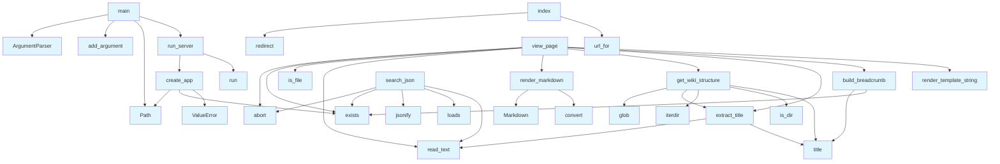

# DeepWiki Web Application

## File Overview

This file implements the web server for DeepWiki, a documentation system that serves wiki content from a local directory structure. The application is built using Flask and provides functionality to browse, search, and view markdown-based wiki pages.

The web application works with the local file system to serve documentation content stored in markdown files, building navigation structures and providing search capabilities. It integrates with the core DeepWiki functionality to provide a user-friendly interface for accessing documentation.

## Functions

### run_server
```python
def run_server(wiki_path: str | Path, host: str = "127.0.0.1", port: int = 8080, debug: bool = False):
    """Run the wiki web server."""
```

Starts the Flask web server for the DeepWiki application.

**Parameters:**
- `wiki_path` (str | Path): Path to the wiki directory containing markdown files
- `host` (str): Host address to bind to (default: "127.0.0.1")
- `port` (int): Port number to bind to (default: 8080)
- `debug` (bool): Enable debug mode (default: False)

**Usage:**
```python
run_server("/path/to/wiki", host="0.0.0.0", port=8080, debug=True)
```

### create_app
```python
def create_app(wiki_path: str | Path) -> Flask:
    """Create Flask app with wiki path configured."""
```

Creates and configures a Flask application instance with the specified wiki path.

**Parameters:**
- `wiki_path` (str | Path): Path to the wiki directory containing markdown files

**Returns:**
- Flask: Configured Flask application instance

**Usage:**
```python
app = create_app("/path/to/wiki")
```

### main
```python
def main():
    """CLI entry point."""
```

Command-line interface entry point that parses arguments and starts the web server.

**Usage:**
```bash
python app.py /path/to/wiki --host 0.0.0.0 --port 8080 --debug
```

### view_page
```python
def view_page(path: str):
    """View a wiki page."""
```

Handles requests to view individual wiki pages by rendering markdown content.

**Parameters:**
- `path` (str): Path to the wiki page relative to the wiki directory

**Returns:**
- Rendered HTML content of the wiki page

**Usage:**
This function is used internally by the Flask routes to display wiki pages.

## Usage Examples

### Starting the Web Server
```python
# Using the CLI
python app.py /path/to/wiki --host 0.0.0.0 --port 8080 --debug

# Programmatically
from src.local_deepwiki.web.app import run_server
run_server("/path/to/wiki", host="0.0.0.0", port=8080, debug=True)
```

### Creating an Application Instance
```python
from src.local_deepwiki.web.app import create_app
app = create_app("/path/to/wiki")
```

## Related Components

This web application works with the core DeepWiki functionality to provide a user interface for accessing documentation stored in markdown files. It uses the [WikiGenerator](../generators/wiki.md) class to build navigation structures and the [CodeChunker](../core/chunker.md) to process documentation content. The application integrates with the [VectorStore](../core/vectorstore.md) to provide search capabilities for the documentation content.

The application relies on the markdown module for rendering markdown content to HTML, and uses Flask for the web framework and routing. It expects wiki content to be organized in a specific directory structure with markdown files as the primary content format.

## API Reference

### Functions

#### `get_wiki_structure`

```python
def get_wiki_structure(wiki_path: Path) -> tuple[list, dict]
```

Get wiki pages and sections.


| [Parameter](../generators/api_docs.md) | Type | Default | Description |
|-----------|------|---------|-------------|
| `wiki_path` | `Path` | - | - |

**Returns:** `tuple[list, dict]`


#### `extract_title`

```python
def extract_title(md_file: Path) -> str
```

Extract title from markdown file.


| [Parameter](../generators/api_docs.md) | Type | Default | Description |
|-----------|------|---------|-------------|
| `md_file` | `Path` | - | - |

**Returns:** `str`


#### `render_markdown`

```python
def render_markdown(content: str) -> str
```

Render markdown to HTML.


| [Parameter](../generators/api_docs.md) | Type | Default | Description |
|-----------|------|---------|-------------|
| `content` | `str` | - | - |

**Returns:** `str`


#### `build_breadcrumb`

```python
def build_breadcrumb(wiki_path: Path, current_path: str) -> str
```

Build breadcrumb navigation HTML with clickable links.  For a path like 'files/src/local_deepwiki/core/chunker.md', generates: Home > Files > src > local_deepwiki > core > chunker  Each segment links to its index.md if one exists in that folder.


| [Parameter](../generators/api_docs.md) | Type | Default | Description |
|-----------|------|---------|-------------|
| `wiki_path` | `Path` | - | - |
| `current_path` | `str` | - | - |

**Returns:** `str`


#### `index`

`@app.route('/')`

```python
def index()
```

Redirect to index.md.


#### `search_json`

`@app.route('/search.json')`

```python
def search_json()
```

Serve the search index JSON file.


#### `view_page`

`@app.route('/wiki/<path:path>')`

```python
def view_page(path: str)
```

View a wiki page.


| [Parameter](../generators/api_docs.md) | Type | Default | Description |
|-----------|------|---------|-------------|
| `path` | `str` | - | - |


#### `create_app`

```python
def create_app(wiki_path: str | Path) -> Flask
```

Create Flask app with wiki path configured.


| [Parameter](../generators/api_docs.md) | Type | Default | Description |
|-----------|------|---------|-------------|
| `wiki_path` | `str | Path` | - | - |

**Returns:** `Flask`


#### `run_server`

```python
def run_server(wiki_path: str | Path, host: str = "127.0.0.1", port: int = 8080, debug: bool = False)
```

Run the wiki web server.


| [Parameter](../generators/api_docs.md) | Type | Default | Description |
|-----------|------|---------|-------------|
| `wiki_path` | `str | Path` | - | - |
| `host` | `str` | `"127.0.0.1"` | - |
| `port` | `int` | `8080` | - |
| `debug` | `bool` | `False` | - |


#### `main`

```python
def main()
```

CLI entry point.


## Call Graph



## See Also

- [test_search](../../../tests/test_search.md) - uses this
- [vectorstore](../core/vectorstore.md) - shares 2 dependencies
- [indexer](../core/indexer.md) - shares 2 dependencies
