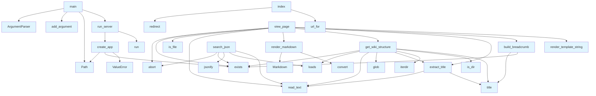

# File Overview

This file, `src/local_deepwiki/web/app.py`, serves as the main entry point for the DeepWiki web server. It provides functionality to create and run a Flask-based web application that serves documentation from a specified wiki directory. The application supports rendering markdown files as HTML, building navigation breadcrumbs, and searching through wiki content.

# Functions

## `run_server`

```python
def run_server(wiki_path: str | Path, host: str = "127.0.0.1", port: int = 8080, debug: bool = False):
```

Run the wiki web server.

**Parameters:**
- `wiki_path` (str | Path): Path to the wiki directory.
- `host` (str): Host address to bind the server to. Defaults to `"127.0.0.1"`.
- `port` (int): Port number to bind the server to. Defaults to `8080`.
- `debug` (bool): Enable debug mode. Defaults to `False`.

## `create_app`

```python
def create_app(wiki_path: str | Path) -> Flask:
```

Create Flask app with wiki path configured.

**Parameters:**
- `wiki_path` (str | Path): Path to the wiki directory.

**Returns:**
- `Flask`: A configured Flask application instance.

## `main`

```python
def main():
```

CLI entry point.

Parses command-line arguments and starts the web server using the provided arguments.

# Usage Examples

To start the DeepWiki server from the command line:

```bash
python src/local_deepwiki/web/app.py /path/to/wiki --host 0.0.0.0 --port 8080 --debug
```

Or with default settings (serving from `.deepwiki` directory):

```bash
python src/local_deepwiki/web/app.py
```

# Related Components

This file imports and uses components from the following modules:
- `flask`: For creating the web application and handling HTTP requests.
- `markdown`: For rendering markdown content into HTML.
- `argparse`: For parsing command-line arguments.
- `pathlib.Path`: For handling file paths.

The file also references the global variable `WIKI_PATH`, which is set during the `create_app` function call. It depends on the structure of a wiki directory that contains markdown files to be rendered.

## API Reference

### Functions

#### `get_wiki_structure`

```python
def get_wiki_structure(wiki_path: Path) -> tuple[list, dict, list | None]
```

Get wiki pages and sections, with optional hierarchical TOC.


| [Parameter](../generators/api_docs.md) | Type | Default | Description |
|-----------|------|---------|-------------|
| `wiki_path` | `Path` | - | - |

**Returns:** `tuple[list, dict, list | None]`


#### `extract_title`

```python
def extract_title(md_file: Path) -> str
```

Extract title from markdown file.


| [Parameter](../generators/api_docs.md) | Type | Default | Description |
|-----------|------|---------|-------------|
| `md_file` | `Path` | - | - |

**Returns:** `str`


#### `render_markdown`

```python
def render_markdown(content: str) -> str
```

Render markdown to HTML.


| [Parameter](../generators/api_docs.md) | Type | Default | Description |
|-----------|------|---------|-------------|
| `content` | `str` | - | - |

**Returns:** `str`


#### `build_breadcrumb`

```python
def build_breadcrumb(wiki_path: Path, current_path: str) -> str
```

Build breadcrumb navigation HTML with clickable links.  For a path like 'files/src/local_deepwiki/core/chunker.md', generates: Home > Files > src > local_deepwiki > core > chunker  Each segment links to its index.md if one exists in that folder.


| [Parameter](../generators/api_docs.md) | Type | Default | Description |
|-----------|------|---------|-------------|
| `wiki_path` | `Path` | - | - |
| `current_path` | `str` | - | - |

**Returns:** `str`


#### `index`

`@app.route('/')`

```python
def index()
```

Redirect to index.md.


#### `search_json`

`@app.route('/search.json')`

```python
def search_json()
```

Serve the search index JSON file.


#### `view_page`

`@app.route('/wiki/<path:path>')`

```python
def view_page(path: str)
```

View a wiki page.


| [Parameter](../generators/api_docs.md) | Type | Default | Description |
|-----------|------|---------|-------------|
| `path` | `str` | - | - |


#### `create_app`

```python
def create_app(wiki_path: str | Path) -> Flask
```

Create Flask app with wiki path configured.


| [Parameter](../generators/api_docs.md) | Type | Default | Description |
|-----------|------|---------|-------------|
| `wiki_path` | `str | Path` | - | - |

**Returns:** `Flask`


#### `run_server`

```python
def run_server(wiki_path: str | Path, host: str = "127.0.0.1", port: int = 8080, debug: bool = False)
```

Run the wiki web server.


| [Parameter](../generators/api_docs.md) | Type | Default | Description |
|-----------|------|---------|-------------|
| `wiki_path` | `str | Path` | - | - |
| `host` | `str` | `"127.0.0.1"` | - |
| `port` | `int` | `8080` | - |
| `debug` | `bool` | `False` | - |


#### `main`

```python
def main()
```

CLI entry point.


## Call Graph



## Relevant Source Files

- `src/local_deepwiki/web/app.py`
