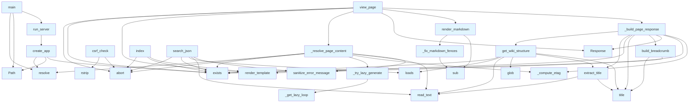

# File: `src/local_deepwiki/web/app.py`

## File Overview

This file implements a Flask-based web application for browsing DeepWiki documentation. It serves as the core web UI that renders markdown pages, manages navigation, and provides API endpoints for chat, research, code mapping, and architecture visualization.

The application is designed to be lightweight and focused, delegating content generation to background processes and lazy loaders while providing a secure, performant interface for users to explore documentation. It integrates with other CLI modules and internal generators to provide a complete documentation experience.

## Key Concepts

### Markdown Rendering and Sanitization

The application uses `markdown` to convert markdown files into HTML, and `nh3` for HTML sanitization to prevent XSS vulnerabilities. This approach ensures that user-generated or LLM-generated content is rendered safely while preserving the rich formatting capabilities of markdown.

### Lazy Page Generation

To reduce initial build times, the application supports lazy generation of wiki pages. When a user requests a page that doesn't exist on disk, the system attempts to generate it on-demand using the `lazy_generator`. This pattern allows for dynamic documentation creation without requiring pre-generation of all content.

### Security Headers and CSRF Protection

Security is a core concern. The application adds several security headers to all responses and implements CSRF protection for mutating requests. These measures help protect against common web vulnerabilities like MIME sniffing, clickjacking, XSS, and cross-origin attacks.

### Breadcrumb Navigation

The `build_breadcrumb` function constructs navigation paths that are clickable and context-aware. It supports hierarchical navigation by checking for `index.md` files at each level, making it easier for users to navigate complex directory structures.

### Caching with ETags

The application implements ETag-based caching for static content. ETags are computed from file modification times and sizes, allowing browsers to cache pages efficiently and reducing server load.

## Integration

### External Dependencies

- **Flask**: The primary web framework used for routing, request handling, and templating.
- **Jinja2 Templates**: Used for rendering HTML pages with dynamic content.
- **Markdown and nh3**: For safe rendering of markdown content.
- **local_deepwiki modules**: The application imports and integrates with core components like `lazy_generator`, `errors`, and `logging`.

### Usage within the Codebase

- **CLI Entry Points**: The `main` function is the CLI entry point, integrating with `argparse` and `run_server` to launch the web server.
- **Route Modules**: The application integrates with several route modules (`routes_chat`, `routes_research`, `routes_codemap`, `routes_architecture`) that register additional endpoints.
- **Content Generation**: The `_try_lazy_generate` function is used by `view_page` to dynamically generate missing pages, and [`get_lazy_generator`](../generators/lazy_generator.md) is imported from `local_deepwiki.generators.lazy_generator`.

### Callers

- `extract_title` is used by `html`, `pdf`, `shared`, and other modules to extract titles from markdown files.
- `render_markdown` is used by `html`, `pdf`, `test_html_export`, and other modules to render markdown content.
- `build_breadcrumb` is used by `html`, `shared`, and `test_export_shared` to build navigation elements.
- `index` is used by `indexes`, `maintenance`, `test_llms_txt`, and other modules to access the root page.
- `search_json` is used by `analysis_entity`, `analysis_service`, and `test_explain_entity` to fetch search indices.
- `_try_lazy_generate` is used by `resources` to handle dynamic page generation.
- `view_page` is used by `test_web` and `test_web_onboarding` for testing web functionality.
- `main` is used by `test_pdf_streaming` to test PDF streaming capabilities.

## Design Notes

### ETag Computation

The ETag computation uses a combination of file modification time and size. This approach is chosen to be lightweight and effective for detecting file changes without requiring expensive hash computations. It's a balance between performance and accuracy.

### Path Traversal Protection

The `_resolve_page_content` function includes strict path traversal checks to prevent malicious users from accessing files outside the configured wiki directory. This is critical for security and is enforced by resolving the path and checking if it's still within the allowed directory.

### Lazy Generation Fallback

When lazy generation fails (e.g., due to missing source files), the system gracefully returns `None` and falls back to a 404 error. This design choice ensures that the application doesn't crash on generation failures and provides clear feedback to the user.

### Debug Mode Safety

The `run_server` function includes a safety check for debug mode when running on non-localhost hosts. This prevents accidental exposure of debugging information in production environments, demonstrating a thoughtful approach to developer convenience vs. security.

### Template Context Injection

The `inject_active_page` function ensures that navigation highlighting works correctly across all templates by injecting the current page context. This simplifies template logic and centralizes navigation behavior.

## API Reference

### Functions

#### `csrf_check`

`@app.before_request`

```python
def csrf_check() -> Response | None
```

Block cross-origin mutating requests without a matching Origin header.

**Returns:** `Response | None`


<details>
<summary>View Source (lines 87-96) | <a href="https://github.com/UrbanDiver/local-deepwiki-mcp/blob/main/src/local_deepwiki/web/app.py#L87-L96">GitHub</a></summary>

```python
def csrf_check() -> Response | None:
    """Block cross-origin mutating requests without a matching Origin header."""
    if request.method in ("POST", "PUT", "DELETE", "PATCH"):
        origin = request.headers.get("Origin")
        if origin:
            host = request.host_url.rstrip("/")
            if not origin.startswith(host):
                logger.warning("CSRF blocked: Origin=%s Host=%s", origin, host)
                abort(403, "Cross-origin request blocked")
    return None
```

</details>

#### `add_security_headers`

`@app.after_request`

```python
def add_security_headers(response: Response) -> Response
```

Add security headers to all responses.  These headers protect against common web vulnerabilities: - X-Content-Type-Options: Prevents MIME type sniffing - X-Frame-Options: Prevents clickjacking attacks - X-XSS-Protection: Enables browser XSS filtering (legacy but still useful) - Content-Security-Policy: Controls allowed content sources - Referrer-Policy: Controls referrer information leakage


| Parameter | Type | Default | Description |
|-----------|------|---------|-------------|
| `response` | `Response` | - | - |

**Returns:** `Response`


<details>
<summary>View Source (lines 103-132) | <a href="https://github.com/UrbanDiver/local-deepwiki-mcp/blob/main/src/local_deepwiki/web/app.py#L103-L132">GitHub</a></summary>

```python
def add_security_headers(response: Response) -> Response:
    """Add security headers to all responses.

    These headers protect against common web vulnerabilities:
    - X-Content-Type-Options: Prevents MIME type sniffing
    - X-Frame-Options: Prevents clickjacking attacks
    - X-XSS-Protection: Enables browser XSS filtering (legacy but still useful)
    - Content-Security-Policy: Controls allowed content sources
    - Referrer-Policy: Controls referrer information leakage
    """
    response.headers["X-Content-Type-Options"] = "nosniff"
    response.headers["X-Frame-Options"] = "DENY"
    response.headers["X-XSS-Protection"] = "1; mode=block"
    response.headers["Content-Security-Policy"] = (
        "default-src 'self'; "
        "script-src 'self' 'unsafe-inline' https://cdn.jsdelivr.net; "
        "style-src 'self' 'unsafe-inline' https://cdn.jsdelivr.net; "
        "img-src 'self' data:; "
        "font-src 'self'; "
        "connect-src 'self'; "
        "object-src 'none'; "
        "base-uri 'self'; "
        "form-action 'self'; "
        "frame-ancestors 'none'"
    )
    response.headers["Referrer-Policy"] = "strict-origin-when-cross-origin"
    response.headers["Permissions-Policy"] = (
        "camera=(), microphone=(), geolocation=(), payment=()"
    )
    return response
```

</details>

#### `get_wiki_structure`

```python
def get_wiki_structure(wiki_path: Path) -> tuple[list, dict, list | None]
```

Get wiki pages and sections, with optional hierarchical TOC.


| Parameter | Type | Default | Description |
|-----------|------|---------|-------------|
| `wiki_path` | `Path` | - | - |

**Returns:** `tuple[list, dict, list | None]`


<details>
<summary>View Source (lines 138-175) | <a href="https://github.com/UrbanDiver/local-deepwiki-mcp/blob/main/src/local_deepwiki/web/app.py#L138-L175">GitHub</a></summary>

```python
def get_wiki_structure(wiki_path: Path) -> tuple[list, dict, list | None]:
    """Get wiki pages and sections, with optional hierarchical TOC.

    Returns:
        Tuple of (pages, sections, toc_entries) where toc_entries is the
        hierarchical numbered TOC if toc.json exists, None otherwise.
    """
    pages = []
    sections = {}
    toc_entries = None

    # Try to load toc.json for hierarchical numbered structure
    toc_path = wiki_path / "toc.json"
    if toc_path.exists():
        try:
            toc_data = json.loads(toc_path.read_text())
            toc_entries = toc_data.get("entries", [])
        except (json.JSONDecodeError, OSError):
            pass  # Fall back to flat structure

    # Get root pages
    for md_file in sorted(wiki_path.glob("*.md")):
        title = extract_title(md_file)
        pages.append({"path": md_file.name, "title": title})

    # Get section pages (used as fallback if no toc.json)
    for section_dir in sorted(wiki_path.iterdir()):
        if section_dir.is_dir() and not section_dir.name.startswith("."):
            section_pages = []
            for md_file in sorted(section_dir.glob("*.md")):
                title = extract_title(md_file)
                section_pages.append(
                    {"path": f"{section_dir.name}/{md_file.name}", "title": title}
                )
            if section_pages:
                sections[section_dir.name.replace("_", " ").title()] = section_pages

    return pages, sections, toc_entries
```

</details>

#### `extract_title`

```python
def extract_title(md_file: Path) -> str
```

Extract title from markdown file.


| Parameter | Type | Default | Description |
|-----------|------|---------|-------------|
| `md_file` | `Path` | - | - |

**Returns:** `str`


<details>
<summary>View Source (lines 178-190) | <a href="https://github.com/UrbanDiver/local-deepwiki-mcp/blob/main/src/local_deepwiki/web/app.py#L178-L190">GitHub</a></summary>

```python
def extract_title(md_file: Path) -> str:
    """Extract title from markdown file."""
    try:
        content = md_file.read_text()
        for line in content.split("\n"):
            line = line.strip()
            if line.startswith("# "):
                return line[2:].strip()
            if line.startswith("**") and line.endswith("**"):
                return line[2:-2].strip()
    except (OSError, UnicodeDecodeError) as e:
        logger.debug("Could not extract title from %s: %s", md_file, e)
    return md_file.stem.replace("_", " ").replace("-", " ").title()
```

</details>

#### `render_markdown`

```python
def render_markdown(content: str) -> str
```

Render markdown to HTML with sanitization.  Uses nh3 (if available) to strip dangerous tags like <script> while preserving safe HTML produced by the markdown renderer.


| Parameter | Type | Default | Description |
|-----------|------|---------|-------------|
| `content` | `str` | - | - |

**Returns:** `str`


<details>
<summary>View Source (lines 212-241) | <a href="https://github.com/UrbanDiver/local-deepwiki-mcp/blob/main/src/local_deepwiki/web/app.py#L212-L241">GitHub</a></summary>

```python
def render_markdown(content: str) -> str:
    """Render markdown to HTML with sanitization.

    Uses nh3 (if available) to strip dangerous tags like <script> while
    preserving safe HTML produced by the markdown renderer.
    """
    content = _fix_markdown_fences(content)
    md = markdown.Markdown(
        extensions=[
            "fenced_code",
            "tables",
            "toc",
            "nl2br",
            "md_in_html",
        ]
    )
    raw_html = md.convert(content)
    if _HAS_NH3:
        return _nh3.clean(
            raw_html,
            attributes={
                "code": {"class"},
                "a": {"href"},
                "img": {"src", "alt"},
                "details": {"id"},
                "summary": set(),
            },
        )
    # nh3 unavailable: strip HTML tags as a safety fallback
    return _re.sub(r"<[^>]+>", "", raw_html)
```

</details>

#### `build_breadcrumb`

```python
def build_breadcrumb(wiki_path: Path, current_path: str) -> Markup
```

Build breadcrumb navigation HTML with clickable links.  For a path like 'files/src/local_deepwiki/core/chunker.md', generates: Home > Files > src > local_deepwiki > core > chunker  Each segment links to its index.md if one exists in that folder.  Returns a ``Markup`` object so Jinja2 auto-escaping tracks safety. User-derived strings are passed through ``markupsafe.escape()`` automatically via ``Markup.format()``, making XSS impossible by construction.


| Parameter | Type | Default | Description |
|-----------|------|---------|-------------|
| `wiki_path` | `Path` | - | - |
| `current_path` | `str` | - | - |

**Returns:** `Markup`


<details>
<summary>View Source (lines 244-300) | <a href="https://github.com/UrbanDiver/local-deepwiki-mcp/blob/main/src/local_deepwiki/web/app.py#L244-L300">GitHub</a></summary>

```python
def build_breadcrumb(wiki_path: Path, current_path: str) -> Markup:
    """Build breadcrumb navigation HTML with clickable links.

    For a path like 'files/src/local_deepwiki/core/chunker.md', generates:
    Home > Files > src > local_deepwiki > core > chunker

    Each segment links to its index.md if one exists in that folder.

    Returns a ``Markup`` object so Jinja2 auto-escaping tracks safety.
    User-derived strings are passed through ``markupsafe.escape()``
    automatically via ``Markup.format()``, making XSS impossible by
    construction.
    """
    parts = current_path.split("/")

    # Root pages don't need breadcrumbs (or just show Home)
    if len(parts) == 1:
        return Markup("")

    breadcrumb_items: list[Markup] = []

    # Always start with Home
    breadcrumb_items.append(Markup('<a href="/">Home</a>'))

    # Build path progressively and check for index.md at each level
    cumulative_path = ""
    for part in parts[:-1]:  # Exclude the current page
        if cumulative_path:
            cumulative_path = f"{cumulative_path}/{part}"
        else:
            cumulative_path = part

        # Check if there's an index.md in this folder
        index_path = wiki_path / cumulative_path / "index.md"
        display_name = part.replace("_", " ").replace("-", " ").title()

        if index_path.exists():
            link_path = f"{cumulative_path}/index.md"
            # Markup.format() auto-escapes non-Markup arguments
            breadcrumb_items.append(
                Markup('<a href="/wiki/{}">{}</a>').format(link_path, display_name)
            )
        else:
            # No index.md, just show as text
            breadcrumb_items.append(Markup("<span>{}</span>").format(display_name))

    # Add current page name (no link, it's the current page)
    current_page = parts[-1]
    if current_page.endswith(".md"):
        current_page = current_page[:-3]
    current_page = current_page.replace("_", " ").replace("-", " ").title()
    breadcrumb_items.append(
        Markup('<span class="current">{}</span>').format(current_page)
    )

    separator = Markup(' <span class="separator">\u203a</span> ')
    return separator.join(breadcrumb_items)
```

</details>

#### `inject_active_page`

`@app.context_processor`

```python
def inject_active_page() -> dict[str, str]
```

Make active_page available to all templates for nav highlighting.

**Returns:** `dict[str, str]`


<details>
<summary>View Source (lines 307-320) | <a href="https://github.com/UrbanDiver/local-deepwiki-mcp/blob/main/src/local_deepwiki/web/app.py#L307-L320">GitHub</a></summary>

```python
def inject_active_page() -> dict[str, str]:
    """Make active_page available to all templates for nav highlighting."""
    from flask import request as _req

    path = _req.path
    if path.startswith("/architecture"):
        page = "architecture"
    elif path.startswith("/codemap"):
        page = "codemap"
    elif path.startswith("/chat"):
        page = "chat"
    else:
        page = "wiki"
    return {"active_page": page}
```

</details>

#### `index`

`@app.route("/")`

```python
def index() -> Response | str
```

Redirect to index.md or show onboarding if wiki doesn't exist.

**Returns:** `Response | str`


<details>
<summary>View Source (lines 327-342) | <a href="https://github.com/UrbanDiver/local-deepwiki-mcp/blob/main/src/local_deepwiki/web/app.py#L327-L342">GitHub</a></summary>

```python
def index() -> Response | str:
    """Redirect to index.md or show onboarding if wiki doesn't exist."""
    logger.debug("Accessing root route")

    if WIKI_PATH is None:
        logger.error("Wiki path not configured")
        abort(500, "Wiki path not configured")

    # Check if wiki directory has content
    index_md = WIKI_PATH / "index.md"
    if not index_md.exists():
        logger.info("Wiki not indexed yet, showing onboarding page")
        return render_template("onboarding.html", wiki_path=str(WIKI_PATH.parent))

    logger.debug("Redirecting / to index.md")
    return make_response(redirect(url_for("view_page", path="index.md")))
```

</details>

#### `search_json`

`@app.route("/search.json")`

```python
def search_json() -> Response
```

Serve the search index JSON file.

**Returns:** `Response`


<details>
<summary>View Source (lines 346-362) | <a href="https://github.com/UrbanDiver/local-deepwiki-mcp/blob/main/src/local_deepwiki/web/app.py#L346-L362">GitHub</a></summary>

```python
def search_json() -> Response:
    """Serve the search index JSON file."""
    if WIKI_PATH is None:
        abort(500, "Wiki path not configured")

    search_path = WIKI_PATH / "search.json"
    if not search_path.exists():
        # Return empty index if not generated yet
        return jsonify([])

    try:
        data = json.loads(search_path.read_text())
        return jsonify(data)
    except (json.JSONDecodeError, OSError) as e:
        from local_deepwiki.errors import sanitize_error_message

        abort(500, sanitize_error_message(str(e)))
```

</details>

#### `view_page`

`@app.route("/wiki/<path:path>")`

```python
def view_page(path: str) -> Response | str
```

View a wiki page.


| Parameter | Type | Default | Description |
|-----------|------|---------|-------------|
| `path` | `str` | - | - |

**Returns:** `Response | str`


<details>
<summary>View Source (lines 516-537) | <a href="https://github.com/UrbanDiver/local-deepwiki-mcp/blob/main/src/local_deepwiki/web/app.py#L516-L537">GitHub</a></summary>

```python
def view_page(path: str) -> Response | str:
    """View a wiki page."""
    logger.debug("Viewing page: %s", path)

    if WIKI_PATH is None:
        logger.error("Wiki path not configured")
        abort(500, "Wiki path not configured")

    # Check if wiki directory exists and is indexed
    index_md = WIKI_PATH / "index.md"
    if not index_md.exists():
        logger.info("Wiki not indexed yet, showing onboarding page")
        return render_template("onboarding.html", wiki_path=str(WIKI_PATH.parent))

    content, file_path, etag = _resolve_page_content(WIKI_PATH, path)

    # Conditional request: return 304 if client has current version
    if etag is not None and request.if_none_match and etag in request.if_none_match:
        return Response(status=304)

    html_content = render_markdown(content)
    return _build_page_response(WIKI_PATH, path, html_content, file_path)
```

</details>

#### `create_app`

```python
def create_app(wiki_path: str | Path) -> Flask
```

Create Flask app with wiki path configured.


| Parameter | Type | Default | Description |
|-----------|------|---------|-------------|
| `wiki_path` | `str | Path` | - | - |

**Returns:** `Flask`


<details>
<summary>View Source (lines 543-555) | <a href="https://github.com/UrbanDiver/local-deepwiki-mcp/blob/main/src/local_deepwiki/web/app.py#L543-L555">GitHub</a></summary>

```python
def create_app(wiki_path: str | Path) -> Flask:
    """Create Flask app with wiki path configured."""
    global WIKI_PATH
    WIKI_PATH = Path(wiki_path).resolve()
    if not WIKI_PATH.exists():
        logger.error("Wiki path does not exist: %s", wiki_path)
        raise ValueError(f"Wiki path does not exist: {wiki_path}")
    # Store on app.config so blueprints can access via current_app.config
    # even when the server is launched via `python -m` (where __main__ and
    # local_deepwiki.web.app are separate module objects).
    app.config["WIKI_PATH"] = WIKI_PATH
    logger.info("Configured wiki path: %s", WIKI_PATH)
    return app
```

</details>

#### `run_server`

```python
def run_server(wiki_path: str | Path, host: str = "127.0.0.1", port: int = 8080, debug: bool = False) -> None
```

Run the wiki web server.


| Parameter | Type | Default | Description |
|-----------|------|---------|-------------|
| `wiki_path` | `str | Path` | - | - |
| `host` | `str` | `"127.0.0.1"` | - |
| `port` | `int` | `8080` | - |
| `debug` | `bool` | `False` | - |

**Returns:** `None`


<details>
<summary>View Source (lines 558-575) | <a href="https://github.com/UrbanDiver/local-deepwiki-mcp/blob/main/src/local_deepwiki/web/app.py#L558-L575">GitHub</a></summary>

```python
def run_server(
    wiki_path: str | Path,
    host: str = "127.0.0.1",
    port: int = 8080,
    debug: bool = False,
) -> None:
    """Run the wiki web server."""
    if debug and host not in ("127.0.0.1", "localhost", "::1"):
        logger.warning(
            "Debug mode is not recommended on non-localhost host %s. "
            "Forcing debug=False for safety.",
            host,
        )
        debug = False
    flask_app = create_app(wiki_path)
    logger.info("Starting DeepWiki server at http://%s:%s", host, port)
    logger.info("Serving wiki from: %s", wiki_path)
    flask_app.run(host=host, port=port, debug=debug)
```

</details>

#### `main`

```python
def main() -> None
```

CLI entry point.

**Returns:** `None`


<details>
<summary>View Source (lines 578-603) | <a href="https://github.com/UrbanDiver/local-deepwiki-mcp/blob/main/src/local_deepwiki/web/app.py#L578-L603">GitHub</a></summary>

```python
def main() -> None:
    """CLI entry point."""
    if not _HAS_FLASK:
        print(
            "Error: Flask is required for the web UI but is not installed.\n"
            "Install with: uv pip install flask",
            file=sys.stderr,
        )
        sys.exit(1)

    import argparse

    parser = argparse.ArgumentParser(description="Serve DeepWiki documentation")
    parser.add_argument(
        "wiki_path",
        nargs="?",
        default=".deepwiki",
        help="Path to the .deepwiki directory",
    )
    parser.add_argument("--host", default="127.0.0.1", help="Host to bind to")
    parser.add_argument("--port", "-p", type=int, default=8080, help="Port to bind to")
    parser.add_argument("--debug", action="store_true", help="Enable debug mode")
    args = parser.parse_args()

    wiki_path = Path(args.wiki_path).resolve()
    run_server(wiki_path, args.host, args.port, args.debug)
```

</details>

## Call Graph


```mermaid
flowchart TD
    N0[Path]
    N1[Response]
    N2[_build_page_response]
    N3[_compute_etag]
    N4[_fix_markdown_fences]
    N5[_get_lazy_loop]
    N6[_resolve_page_content]
    N7[_try_lazy_generate]
    N8[abort]
    N9[build_breadcrumb]
    N10[create_app]
    N11[csrf_check]
    N12[exists]
    N13[extract_title]
    N14[get_wiki_structure]
    N15[glob]
    N16[index]
    N17[loads]
    N18[main]
    N19[read_text]
    N20[render_markdown]
    N21[render_template]
    N22[resolve]
    N23[rstrip]
    N24[run_server]
    N25[sanitize_error_message]
    N26[search_json]
    N27[sub]
    N28[title]
    N29[view_page]
    N11 --> N23
    N11 --> N8
    N14 --> N12
    N14 --> N17
    N14 --> N19
    N14 --> N15
    N14 --> N13
    N14 --> N28
    N13 --> N19
    N13 --> N28
    N4 --> N27
    N20 --> N4
    N20 --> N27
    N9 --> N28
    N9 --> N12
    N16 --> N8
    N16 --> N12
    N16 --> N21
    N26 --> N8
    N26 --> N12
    N26 --> N17
    N26 --> N19
    N26 --> N25
    N7 --> N5
    N6 --> N22
    N6 --> N8
    N6 --> N12
    N6 --> N7
    N6 --> N3
    N6 --> N19
    N6 --> N25
    N2 --> N14
    N2 --> N13
    N2 --> N12
    N2 --> N28
    N2 --> N9
    N2 --> N1
    N2 --> N21
    N2 --> N3
    N29 --> N8
    N29 --> N12
    N29 --> N21
    N29 --> N6
    N29 --> N1
    N29 --> N20
    N29 --> N2
    N10 --> N22
    N10 --> N0
    N10 --> N12
    N24 --> N10
    N18 --> N22
    N18 --> N0
    N18 --> N24
    classDef func fill:#e1f5fe
    class N0,N1,N2,N3,N4,N5,N6,N7,N8,N9,N10,N11,N12,N13,N14,N15,N16,N17,N18,N19,N20,N21,N22,N23,N24,N25,N26,N27,N28,N29 func
```

## Used By

Functions and methods in this file and their callers:

- **`ArgumentParser`**: called by `main`
- **`Markdown`**: called by `render_markdown`
- **`Markup`**: called by `build_breadcrumb`
- **`Path`**: called by `create_app`, `main`
- **`Response`**: called by `_build_page_response`, `view_page`
- **`Thread`**: called by `_get_lazy_loop`
- **`ValueError`**: called by `create_app`
- **`_build_page_response`**: called by `view_page`
- **`_compute_etag`**: called by `_build_page_response`, `_resolve_page_content`
- **`_fix_markdown_fences`**: called by `render_markdown`
- **`_get_lazy_loop`**: called by `_try_lazy_generate`
- **`_resolve_page_content`**: called by `view_page`
- **`_try_lazy_generate`**: called by `_resolve_page_content`
- **`abort`**: called by `_resolve_page_content`, `csrf_check`, `index`, `search_json`, `view_page`
- **`add_argument`**: called by `main`
- **`build_breadcrumb`**: called by `_build_page_response`
- **`clean`**: called by `render_markdown`
- **`convert`**: called by `render_markdown`
- **`create_app`**: called by `run_server`
- **`encode`**: called by `_compute_etag`
- **`exception`**: called by `_try_lazy_generate`
- **`exists`**: called by `_build_page_response`, `_resolve_page_content`, `build_breadcrumb`, `create_app`, `get_wiki_structure`, `index`, `search_json`, `view_page`
- **`exit`**: called by `main`
- **`extract_title`**: called by `_build_page_response`, `get_wiki_structure`
- **[`get_lazy_generator`](../generators/lazy_generator.md)**: called by `_try_lazy_generate`
- **`get_page`**: called by `_try_lazy_generate`
- **`get_wiki_structure`**: called by `_build_page_response`
- **`glob`**: called by `get_wiki_structure`
- **`hexdigest`**: called by `_compute_etag`
- **`is_closed`**: called by `_get_lazy_loop`
- **`is_dir`**: called by `get_wiki_structure`
- **`is_file`**: called by `_resolve_page_content`
- **`is_relative_to`**: called by `_resolve_page_content`
- **`iterdir`**: called by `get_wiki_structure`
- **`jsonify`**: called by `search_json`
- **`loads`**: called by `get_wiki_structure`, `search_json`
- **`make_response`**: called by `index`
- **`md5`**: called by `_compute_etag`
- **`new_event_loop`**: called by `_get_lazy_loop`
- **`parse_args`**: called by `main`
- **`read_text`**: called by `_resolve_page_content`, `extract_title`, `get_wiki_structure`, `search_json`
- **`redirect`**: called by `index`
- **`render_markdown`**: called by `view_page`
- **`render_template`**: called by `_build_page_response`, `index`, `view_page`
- **`resolve`**: called by `_resolve_page_content`, `create_app`, `main`
- **`result`**: called by `_try_lazy_generate`
- **`rstrip`**: called by `csrf_check`
- **`run`**: called by `run_server`
- **`run_coroutine_threadsafe`**: called by `_try_lazy_generate`
- **`run_server`**: called by `main`
- **[`sanitize_error_message`](../error_factories.md)**: called by `_resolve_page_content`, `search_json`
- **`start`**: called by `_get_lazy_loop`
- **`stat`**: called by `_compute_etag`
- **`sub`**: called by `_fix_markdown_fences`, `render_markdown`
- **`title`**: called by `_build_page_response`, `build_breadcrumb`, `extract_title`, `get_wiki_structure`
- **`url_for`**: called by `index`

## Last Modified

| Entity | Type | Author | Date | Commit |
|--------|------|--------|------|--------|
| `inject_active_page` | function | Brian Breidenbach | 4 days ago | `3f5135c` feat: add architecture dash... |
| `_fix_markdown_fences` | function | Brian Breidenbach | 1 week ago | `a43be7f` fix: crosslinks blank-line ... |
| `render_markdown` | function | Brian Breidenbach | 1 week ago | `a43be7f` fix: crosslinks blank-line ... |
| `csrf_check` | function | Brian Breidenbach | 1 week ago | `456a5ca` fix: harden web security — ... |
| `add_security_headers` | function | Brian Breidenbach | 1 week ago | `456a5ca` fix: harden web security — ... |
| `build_breadcrumb` | function | Brian Breidenbach | 1 week ago | `456a5ca` fix: harden web security — ... |
| `run_server` | function | Brian Breidenbach | 1 week ago | `456a5ca` fix: harden web security — ... |
| `_compute_etag` | function | Brian Breidenbach | 2 weeks ago | `9178f9b` refactor: decompose view_pa... |
| `_resolve_page_content` | function | Brian Breidenbach | 2 weeks ago | `9178f9b` refactor: decompose view_pa... |
| `_build_page_response` | function | Brian Breidenbach | 2 weeks ago | `9178f9b` refactor: decompose view_pa... |
| `view_page` | function | Brian Breidenbach | 2 weeks ago | `9178f9b` refactor: decompose view_pa... |
| `index` | function | Brian Breidenbach | Feb 23, 2026 | `c6fe2bd` refactor: split oversized m... |
| `search_json` | function | Brian Breidenbach | Feb 23, 2026 | `c6fe2bd` refactor: split oversized m... |
| `_try_lazy_generate` | function | Brian Breidenbach | Feb 23, 2026 | `c6fe2bd` refactor: split oversized m... |
| `main` | function | Brian Breidenbach | Feb 23, 2026 | `c6fe2bd` refactor: split oversized m... |
| `_get_lazy_loop` | function | Brian Breidenbach | Feb 18, 2026 | `fa90221` feat: lazy-generate missing... |
| `create_app` | function | Brian Breidenbach | Feb 18, 2026 | `0e9d678` fix: blueprint routes resol... |
| `extract_title` | function | Brian Breidenbach | Feb 11, 2026 | `ba96da1` fix: publication plan P0-P2... |
| `get_wiki_structure` | function | Brian Breidenbach | Feb 08, 2026 | `72b2ed3` feat: Add interactive codem... |

## Additional Source Code

Source code for functions and methods not listed in the API Reference above.

#### `_fix_markdown_fences`

<details>
<summary>View Source (lines 193-209) | <a href="https://github.com/UrbanDiver/local-deepwiki-mcp/blob/main/src/local_deepwiki/web/app.py#L193-L209">GitHub</a></summary>

```python
def _fix_markdown_fences(content: str) -> str:
    """Fix malformed markdown where headings and code fences are on the same line.

    LLM-generated wiki pages sometimes produce patterns like:
    - ``## Class Diagram```mermaid`` (heading glued to opening fence)
    - ``````## Call Graph```mermaid`` (closing fence + heading + opening fence)
    - ``````## Used By`` (closing fence glued to heading)
    """
    # Split closing fence glued to a heading: ```## Heading → ```\n\n## Heading
    content = _re.sub(
        r"^(```)(\s*)(#{1,6} )", r"\1\n\n\3", content, flags=_re.MULTILINE
    )
    # Split heading glued to opening fence: ## Heading```lang → ## Heading\n\n```lang
    content = _re.sub(
        r"^(#{1,6} [^\n`]*?)(```\w*)$", r"\1\n\n\2", content, flags=_re.MULTILINE
    )
    return content
```

</details>


#### `_get_lazy_loop`

<details>
<summary>View Source (lines 373-382) | <a href="https://github.com/UrbanDiver/local-deepwiki-mcp/blob/main/src/local_deepwiki/web/app.py#L373-L382">GitHub</a></summary>

```python
def _get_lazy_loop() -> asyncio.AbstractEventLoop:
    """Return a persistent background event loop for lazy page generation."""
    global _lazy_loop
    if _lazy_loop is None or _lazy_loop.is_closed():
        with _lazy_loop_lock:
            if _lazy_loop is None or _lazy_loop.is_closed():
                _lazy_loop = asyncio.new_event_loop()
                t = threading.Thread(target=_lazy_loop.run_forever, daemon=True)
                t.start()
    return _lazy_loop
```

</details>


#### `_try_lazy_generate`

<details>
<summary>View Source (lines 385-413) | <a href="https://github.com/UrbanDiver/local-deepwiki-mcp/blob/main/src/local_deepwiki/web/app.py#L385-L413">GitHub</a></summary>

```python
def _try_lazy_generate(page_path: str, wiki_path: Path) -> str | None:
    """Attempt to generate a missing wiki page on demand.

    Uses the lazy page generator to create pages for files, modules,
    and other known page types when they haven't been eagerly generated.

    Args:
        page_path: Relative wiki page path (e.g. 'files/utils.md').
        wiki_path: Resolved path to the .deepwiki directory.

    Returns:
        Markdown content string if generation succeeded, None otherwise.
    """
    try:
        from local_deepwiki.generators.lazy_generator import get_lazy_generator

        generator = get_lazy_generator(wiki_path)
        loop = _get_lazy_loop()
        future = asyncio.run_coroutine_threadsafe(generator.get_page(page_path), loop)
        content = future.result(timeout=120)

        logger.info("Lazy-generated page: %s", page_path)
        return content
    except FileNotFoundError:
        logger.debug("Lazy generation has no source for: %s", page_path)
        return None
    except Exception:  # noqa: BLE001 — web handler boundary: lazy generation failure returns None gracefully
        logger.exception("Lazy generation failed for: %s", page_path)
        return None
```

</details>


#### `_compute_etag`

<details>
<summary>View Source (lines 416-422) | <a href="https://github.com/UrbanDiver/local-deepwiki-mcp/blob/main/src/local_deepwiki/web/app.py#L416-L422">GitHub</a></summary>

```python
def _compute_etag(file_path: Path) -> str | None:
    """Compute an ETag from file mtime and size, or None on error."""
    try:
        stat = file_path.stat()
        return hashlib.md5(f"{stat.st_mtime_ns}:{stat.st_size}".encode()).hexdigest()
    except OSError:
        return None
```

</details>


#### `_resolve_page_content`

<details>
<summary>View Source (lines 425-466) | <a href="https://github.com/UrbanDiver/local-deepwiki-mcp/blob/main/src/local_deepwiki/web/app.py#L425-L466">GitHub</a></summary>

```python
def _resolve_page_content(wiki_path: Path, path: str) -> tuple[str, Path, str | None]:
    """Resolve wiki page path, read or lazily generate content.

    Handles path validation, traversal prevention, lazy generation for
    missing pages, and file reading.

    Args:
        wiki_path: Resolved .deepwiki directory path.
        path: Relative wiki page path (e.g. 'modules/src.md').

    Returns:
        Tuple of (markdown_content, resolved_file_path, etag_or_none).
        etag is None when content was freshly generated rather than read
        from disk.

    Raises:
        Werkzeug abort(403) on path traversal attempts.
        Werkzeug abort(404) when the page cannot be found or generated.
        Werkzeug abort(500) on file read errors.
    """
    file_path = (wiki_path / path).resolve()
    if not file_path.is_relative_to(wiki_path):
        logger.warning("Path traversal attempt blocked: %s", path)
        abort(403, "Invalid path")

    # If the page doesn't exist on disk, attempt lazy generation
    if not file_path.exists() or not file_path.is_file():
        content = _try_lazy_generate(path, wiki_path)
        if content is None:
            logger.warning("Page not found: %s", path)
            abort(404, f"Page not found: {path}")
        return content, file_path, None

    # Read existing file
    try:
        etag = _compute_etag(file_path)
        content = file_path.read_text()
        return content, file_path, etag
    except (OSError, UnicodeDecodeError) as e:
        from local_deepwiki.errors import sanitize_error_message

        abort(500, sanitize_error_message(str(e)))
```

</details>


#### `_build_page_response`

<details>
<summary>View Source (lines 469-512) | <a href="https://github.com/UrbanDiver/local-deepwiki-mcp/blob/main/src/local_deepwiki/web/app.py#L469-L512">GitHub</a></summary>

```python
def _build_page_response(
    wiki_path: Path, path: str, html_content: str, file_path: Path
) -> Response:
    """Build the full page response with sidebar, breadcrumb, and cache headers.

    Args:
        wiki_path: Resolved .deepwiki directory path.
        path: Relative wiki page path.
        html_content: Already-rendered HTML content.
        file_path: Resolved file path (may not exist for freshly generated pages).

    Returns:
        Flask Response with rendered template and cache headers.
    """
    pages, sections, toc_entries = get_wiki_structure(wiki_path)

    # After lazy generation the file now exists on disk
    title = (
        extract_title(file_path)
        if file_path.exists()
        else path.split("/")[-1].replace(".md", "").replace("_", " ").title()
    )

    breadcrumb = build_breadcrumb(wiki_path, path)

    response = Response(
        render_template(
            "page.html",
            content=html_content,
            title=title,
            pages=pages,
            sections=sections,
            toc_entries=toc_entries,
            current_path=path,
            breadcrumb=breadcrumb,
        )
    )

    # Set caching headers — use ETag if file exists on disk
    etag = _compute_etag(file_path) if file_path.exists() else None
    if etag is not None:
        response.headers["ETag"] = etag
    response.headers["Cache-Control"] = "private, max-age=60"
    return response
```

</details>

## Relevant Source Files

- `src/local_deepwiki/web/app.py:87-96`
