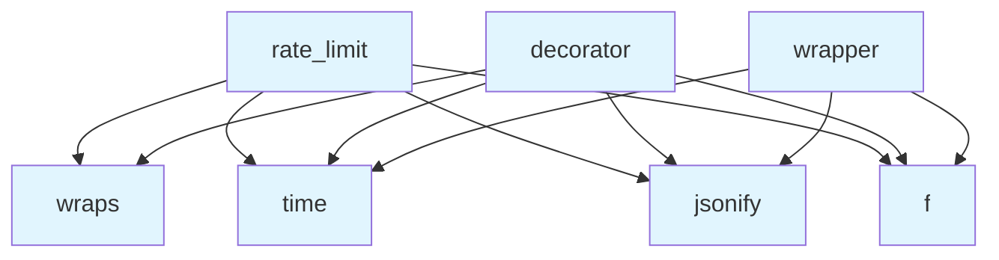

# File: `src/local_deepwiki/web/rate_limit.py`

## File Overview

This file provides a Flask-based rate limiting mechanism for web API endpoints. It is designed to prevent abuse by limiting the number of requests that can be made from a single IP address within a one-minute window. This is a common anti-abuse technique to protect services from being overwhelmed by excessive traffic, aligning with security best practices for CWE-770 (Resource Exhaustion).

The implementation is simple and effective, using an in-memory approach to track request times per IP address. It is intended to be used as a decorator on Flask route functions to apply rate limits at the endpoint level.

## Key Concepts

The rate limiting logic is based on a **time-window sliding approach**, where each IP address maintains a list of timestamps for recent requests. The system cleans up old entries (older than 60 seconds) and checks whether the number of recent requests exceeds the configured limit.

### Why This Approach Was Chosen

- **Simplicity**: The approach is straightforward to implement and understand.
- **Efficiency**: Uses a time-based sliding window that avoids complex state tracking or external dependencies.
- **Flask Integration**: Designed to be used as a decorator, making it easy to apply to any Flask route function.
- **Memory Efficiency**: The use of `defaultdict` and list slicing ensures that only necessary data is retained.

## Integration

This module is part of the web layer of the `local_deepwiki` application and is used to protect API endpoints from being overwhelmed by excessive requests. It is imported and used by:

- `rate_limit`: Used by `rate_limiter`, `test_rate_limiter`, and `test_vectorstore_batching`.
- `decorator`: Used by `events`, `api_docs`, `retry`, and four other functions.
- `wrapper`: Used by `retry` and `test_complexity`.

It is not directly imported by other modules in the project beyond its own internal usage. It is intended to be used as a utility for applying rate limits to Flask routes, and its core functionality (`rate_limit`) is the main interface for this.

## Design Notes

- **Thread Safety**: The rate limiting logic uses a `threading.Lock` (`_rate_limit_lock`) to ensure that concurrent access to the shared `_request_times` dictionary is safe. This is critical in a multi-threaded web environment like Flask.
- **In-Memory Storage**: The implementation uses in-memory storage for request times, meaning rate limits are not persisted across application restarts. This is suitable for the intended use case where limits are temporary and per-instance.
- **IP Address Tracking**: Requests are tracked by `request.remote_addr`. If the IP address is not available, it defaults to `"unknown"`. This could be a limitation in some proxy or load-balanced environments.
- **Automatic Cleanup**: Old timestamps are automatically removed from the list when a new request is processed, ensuring the list doesn't grow indefinitely.
- **HTTP 429 Response**: When the rate limit is exceeded, the system returns a JSON response with an error message and a 429 status code, which is the standard response for rate limiting in HTTP.

### Trade-offs and Edge Cases

- **No Persistence**: Since rate limits are in-memory, they are lost on restarts. This is acceptable for the intended use case but not suitable for long-term or distributed rate limiting.
- **IP Address Spoofing**: If `request.remote_addr` is spoofed or unreliable (e.g., in proxy setups), the rate limiting may not behave as expected.
- **Granularity**: The implementation is per-IP and per-minute, which may not be granular enough for more complex use cases or fine-grained control.
- **No Configuration for Different Routes**: The `rate_limit` function currently applies a single limit to all routes it decorates. A more advanced version might support per-route configurations.

## API Reference

### Functions

#### `rate_limit`

```python
def rate_limit(requests_per_minute: int = DEFAULT_REQUESTS_PER_MINUTE) -> Any
```

Rate limit decorator for Flask routes.


| Parameter | Type | Default | Description |
|-----------|------|---------|-------------|
| `requests_per_minute` | `int` | `DEFAULT_REQUESTS_PER_MINUTE` | Maximum requests allowed per IP per minute. |

**Returns:** `Any`


<details>
<summary>View Source (lines 25-53) | <a href="https://github.com/UrbanDiver/local-deepwiki-mcp/blob/main/src/local_deepwiki/web/rate_limit.py#L25-L53">GitHub</a></summary>

```python
def rate_limit(
    requests_per_minute: int = DEFAULT_REQUESTS_PER_MINUTE,
) -> Any:
    """Rate limit decorator for Flask routes.

    Args:
        requests_per_minute: Maximum requests allowed per IP per minute.

    Returns:
        Decorator function.
    """

    def decorator(f: Any) -> Any:
        @wraps(f)
        def wrapper(*args: Any, **kwargs: Any) -> Response | tuple[Response, int]:
            key = request.remote_addr or "unknown"
            now = time()
            with _rate_limit_lock:
                times = _request_times[key]
                # Remove entries older than 1 minute
                times[:] = [t for t in times if now - t < 60]
                if len(times) >= requests_per_minute:
                    return jsonify({"error": "Rate limit exceeded"}), 429
                times.append(now)
            return f(*args, **kwargs)

        return wrapper

    return decorator
```

</details>

#### `decorator`

```python
def decorator(f: Any) -> Any
```


| Parameter | Type | Default | Description |
|-----------|------|---------|-------------|
| `f` | `Any` | - | - |

**Returns:** `Any`


<details>
<summary>View Source (lines 37-51) | <a href="https://github.com/UrbanDiver/local-deepwiki-mcp/blob/main/src/local_deepwiki/web/rate_limit.py#L37-L51">GitHub</a></summary>

```python
def decorator(f: Any) -> Any:
        @wraps(f)
        def wrapper(*args: Any, **kwargs: Any) -> Response | tuple[Response, int]:
            key = request.remote_addr or "unknown"
            now = time()
            with _rate_limit_lock:
                times = _request_times[key]
                # Remove entries older than 1 minute
                times[:] = [t for t in times if now - t < 60]
                if len(times) >= requests_per_minute:
                    return jsonify({"error": "Rate limit exceeded"}), 429
                times.append(now)
            return f(*args, **kwargs)

        return wrapper
```

</details>

#### `wrapper`

`@wraps(f)`

```python
def wrapper() -> Response | tuple[Response, int]
```

**Returns:** `Response | tuple[Response, int]`


<details>
<summary>View Source (lines 39-49) | <a href="https://github.com/UrbanDiver/local-deepwiki-mcp/blob/main/src/local_deepwiki/web/rate_limit.py#L39-L49">GitHub</a></summary>

```python
def wrapper(*args: Any, **kwargs: Any) -> Response | tuple[Response, int]:
            key = request.remote_addr or "unknown"
            now = time()
            with _rate_limit_lock:
                times = _request_times[key]
                # Remove entries older than 1 minute
                times[:] = [t for t in times if now - t < 60]
                if len(times) >= requests_per_minute:
                    return jsonify({"error": "Rate limit exceeded"}), 429
                times.append(now)
            return f(*args, **kwargs)
```

</details>

#### `reset_rate_limits`

```python
def reset_rate_limits() -> None
```

Clear all rate limit state. Used in tests.

**Returns:** `None`


<details>
<summary>View Source (lines 56-59) | <a href="https://github.com/UrbanDiver/local-deepwiki-mcp/blob/main/src/local_deepwiki/web/rate_limit.py#L56-L59">GitHub</a></summary>

```python
def reset_rate_limits() -> None:
    """Clear all rate limit state. Used in tests."""
    with _rate_limit_lock:
        _request_times.clear()
```

</details>

## Call Graph



## Used By

Functions and methods in this file and their callers:

- **`f`**: called by `decorator`, `rate_limit`, `wrapper`
- **`jsonify`**: called by `decorator`, `rate_limit`, `wrapper`
- **`time`**: called by `decorator`, `rate_limit`, `wrapper`
- **`wraps`**: called by `decorator`, `rate_limit`

## Last Modified

| Entity | Type | Author | Date | Commit |
|--------|------|--------|------|--------|
| `rate_limit` | function | Brian Breidenbach | 1 week ago | `456a5ca` fix: harden web security — ... |
| `decorator` | function | Brian Breidenbach | 1 week ago | `456a5ca` fix: harden web security — ... |
| `wrapper` | function | Brian Breidenbach | 1 week ago | `456a5ca` fix: harden web security — ... |
| `reset_rate_limits` | function | Brian Breidenbach | 1 week ago | `456a5ca` fix: harden web security — ... |

## Relevant Source Files

- `src/local_deepwiki/web/rate_limit.py:25-53`

## See Also

- [access_control](../security/access_control.md) - shares 2 dependencies