# File: `src/local_deepwiki/web/routes_architecture.py`

## File Overview

This file defines the Flask web routes for the architecture dashboard and related API endpoints used in the DeepWiki web UI. It serves as the interface between the frontend and backend analysis logic, providing endpoints for visualizing module dependencies, assessing architecture health, and delivering guided tours.

The module is responsible for:
- Rendering the architecture dashboard page (`architecture_page`)
- Providing JSON APIs for interactive graph data (`graph_api`)
- Delivering architecture health scores and trends (`health_api`)
- Offering detailed module health information (`module_api`)
- Supporting guided tours for specific topics (`tour_api`)

These routes are integrated into the main web server through the `handlers/web_server.py` module, which registers them under a Blueprint.

## Key Concepts

### Architecture Visualization
The file implements a dual-purpose system for visualizing architecture:
1. **Module [Dependency Graph](../generators/analysis/dependency_graph_data.md)**: Using [`analyze_cross_module_dependencies`](../generators/analysis/module_dependencies.md) to extract dependencies between modules.
2. **Coupling Metrics for Node Coloring**: [`analyze_coupling_metrics`](../generators/analysis/coupling.md) provides coupling distances, which are mapped to color codes using `_node_color` to indicate health status visually.

### Health Assessment
Architecture health is computed using:
- [`analyze_architecture_health`](../generators/analysis/architecture_health.md) to calculate overall and dimension-specific scores.
- [`load_snapshots`](../core/health_history.md) to retrieve historical health data for trend visualization.
- A threshold-based system to classify modules as "high coupling" for quick identification of architectural issues.

### API Design Patterns
- **Consistent Error Handling**: All API endpoints use `_get_repo_path` to validate inputs and return consistent error responses.
- **Modular Composition**: Each endpoint aggregates data from different analysis modules (`module_dependencies`, `coupling`, `architecture_health`, etc.) to build a comprehensive view.
- **JSON Response Format**: All APIs return structured JSON, making integration with frontend components straightforward.

## Integration

This file is part of the `local_deepwiki.web` package and is imported and registered by the main web server handler (`handlers/web_server.py`). The functions defined here are used by:
- `architecture_page` — rendered by test modules like `test_source_refs`, `test_wiki_context`, and `test_wiki_pages_coverage`.
- `graph_api`, `health_api`, `module_api`, and `tour_api` — used by tests in `test_routes_architecture`.

It relies heavily on:
- `local_deepwiki.generators.analysis.*` modules for computation.
- `local_deepwiki.core.health_history` for historical data.
- `local_deepwiki.generators.manifest` for project metadata.
- [`local_deepwiki.errors.sanitize_error_message`](../error_factories.md) to ensure error messages are safe for display.

## Design Notes

### Input Validation
The `_get_repo_path` function centralizes input validation for `repo_path` to avoid repeated checks in each API endpoint. It ensures the path is a valid directory and returns appropriate HTTP status codes and error messages.

### Node Coloring Strategy
The `_node_color` function maps coupling distance to a visual color to quickly communicate health status. It uses thresholds (`_HIGH_DISTANCE`, `_WARNING_DISTANCE`) to categorize modules into danger, warning, or healthy states. This design choice prioritizes quick visual interpretation over granular numerical precision.

### Modular Data Aggregation
Each API endpoint aggregates data from multiple analysis modules. For example, `graph_api` uses both dependency and coupling data to enrich node information, while `health_api` combines architecture health, stats, and historical trend data to provide a holistic view.

### Error Handling and Logging
All APIs wrap their logic in `try-except` blocks to catch and sanitize exceptions. Errors are logged using the [`get_logger`](../logging.md) utility and returned as JSON responses with appropriate HTTP status codes, ensuring robustness and traceability.

### Historical Data Handling
The `health_api` endpoint fetches up to 30 recent snapshots from the `.deepwiki` directory to display trends. This approach allows for lightweight trend visualization without overloading the API with large datasets.

### Reusability and Performance
Several analysis functions are imported locally within each endpoint to reduce global import overhead and allow for future modularization or conditional loading. This also supports easier testing and mocking.

## API Reference

### Functions

#### `architecture_page`

`@architecture_bp.route("/architecture")`

```python
def architecture_page()
```

Render the architecture dashboard page.


<details>
<summary>View Source (lines 54-56) | <a href="https://github.com/UrbanDiver/local-deepwiki-mcp/blob/main/src/local_deepwiki/web/routes_architecture.py#L54-L56">GitHub</a></summary>

```python
def architecture_page():
    """Render the architecture dashboard page."""
    return render_template("architecture.html")
```

</details>

#### `graph_api`

`@architecture_bp.route("/architecture/api/graph")`

```python
def graph_api()
```

Return module dependency graph formatted for vis.js.


<details>
<summary>View Source (lines 60-118) | <a href="https://github.com/UrbanDiver/local-deepwiki-mcp/blob/main/src/local_deepwiki/web/routes_architecture.py#L60-L118">GitHub</a></summary>

```python
def graph_api():
    """Return module dependency graph formatted for vis.js."""
    repo_path, error, status = _get_repo_path()
    if error:
        return error, status

    from local_deepwiki.generators.analysis.module_dependencies import (
        analyze_cross_module_dependencies,
    )

    try:
        result = analyze_cross_module_dependencies(repo_path=repo_path)
    except Exception as e:
        logger.error("Graph API error: %s", e)
        from local_deepwiki.errors import sanitize_error_message

        return jsonify({"error": sanitize_error_message(str(e))}), 500

    # Also get coupling metrics for node coloring
    distances = {}
    try:
        from local_deepwiki.generators.analysis.coupling import (
            analyze_coupling_metrics,
        )

        coupling = analyze_coupling_metrics(repo_path=repo_path)
        distances = {
            m["module"]: m.get("distance", 0) for m in coupling.get("metrics", [])
        }
    except Exception:
        logger.debug("Coupling metrics unavailable for node coloring")

    nodes = []
    for mod in result.get("modules", []):
        name = mod.get("name", "")
        dist = distances.get(name, 0)
        nodes.append(
            {
                "id": name,
                "label": name,
                "file_count": mod.get("file_count", 0),
                "line_count": mod.get("line_count", 0),
                "distance": round(dist, 2),
                "color": _node_color(dist),
            }
        )

    edges = []
    for edge in result.get("edges", []):
        edges.append(
            {
                "from": edge.get("source", ""),
                "to": edge.get("target", ""),
                "weight": edge.get("weight", 1),
                "label": str(edge.get("weight", "")),
            }
        )

    return jsonify({"nodes": nodes, "edges": edges})
```

</details>

#### `health_api`

`@architecture_bp.route("/architecture/api/health")`

```python
def health_api()
```

Return current architecture health scores and trend data.


<details>
<summary>View Source (lines 122-177) | <a href="https://github.com/UrbanDiver/local-deepwiki-mcp/blob/main/src/local_deepwiki/web/routes_architecture.py#L122-L177">GitHub</a></summary>

```python
def health_api():
    """Return current architecture health scores and trend data."""
    repo_path, error, status = _get_repo_path()
    if error:
        return error, status

    from local_deepwiki.core.health_history import load_snapshots
    from local_deepwiki.generators.analysis.architecture_health import (
        analyze_architecture_health,
    )
    from local_deepwiki.generators.manifest import get_cached_manifest

    try:
        manifest = get_cached_manifest(repo_path)
        project_name = manifest.name or repo_path.name
        health = analyze_architecture_health(repo_path, project_name)
    except Exception as e:
        logger.error("Health API error: %s", e)
        from local_deepwiki.errors import sanitize_error_message

        return jsonify({"error": sanitize_error_message(str(e))}), 500

    overall = health.get("overall", {})
    dims = overall.get("dimensions", {})
    stats = health.get("stats", {})

    # Load trend data
    wiki_path = repo_path / ".deepwiki"
    snapshots = load_snapshots(wiki_path)
    trend = [
        {"timestamp": s.get("timestamp", ""), "score": s.get("score", 0)}
        for s in snapshots[-30:]  # last 30 snapshots
    ]

    # Count high-coupling modules
    high_coupling = sum(
        1
        for d in dims.get("coupling", {}).get("factors", {}).values()
        if isinstance(d, (int, float)) and d > _HIGH_DISTANCE
    )

    return jsonify(
        {
            "overall": {"score": overall.get("score"), "grade": overall.get("grade")},
            "dimensions": {
                name: {"score": d.get("score"), "grade": d.get("grade")}
                for name, d in dims.items()
            },
            "stats": {
                "total_modules": stats.get("total_modules", 0),
                "high_coupling": high_coupling,
                "total_smells": stats.get("total_smells", 0),
            },
            "trend": trend,
        }
    )
```

</details>

#### `module_api`

`@architecture_bp.route("/architecture/api/module/<name>")`

```python
def module_api(name)
```

Return health details for a specific module.


| Parameter | Type | Default | Description |
|-----------|------|---------|-------------|
| `name` | - | - | - |


<details>
<summary>View Source (lines 181-199) | <a href="https://github.com/UrbanDiver/local-deepwiki-mcp/blob/main/src/local_deepwiki/web/routes_architecture.py#L181-L199">GitHub</a></summary>

```python
def module_api(name):
    """Return health details for a specific module."""
    repo_path, error, status = _get_repo_path()
    if error:
        return error, status

    from local_deepwiki.generators.analysis.module_health import (
        analyze_module_health,
    )

    try:
        result = analyze_module_health(repo_path, name)
    except Exception as e:
        logger.error("Module API error for %s: %s", name, e)
        from local_deepwiki.errors import sanitize_error_message

        return jsonify({"error": sanitize_error_message(str(e))}), 500

    return jsonify(result)
```

</details>

#### `tour_api`

`@architecture_bp.route("/architecture/api/tour/<topic>")`

```python
def tour_api(topic)
```

Return guided tour stops for a topic.


| Parameter | Type | Default | Description |
|-----------|------|---------|-------------|
| `topic` | - | - | - |


<details>
<summary>View Source (lines 203-219) | <a href="https://github.com/UrbanDiver/local-deepwiki-mcp/blob/main/src/local_deepwiki/web/routes_architecture.py#L203-L219">GitHub</a></summary>

```python
def tour_api(topic):
    """Return guided tour stops for a topic."""
    repo_path, error, status = _get_repo_path()
    if error:
        return error, status

    from local_deepwiki.generators.analysis.tours import generate_tour

    try:
        result = generate_tour(repo_path, topic=topic)
    except Exception as e:
        logger.error("Tour API error for %s: %s", topic, e)
        from local_deepwiki.errors import sanitize_error_message

        return jsonify({"error": sanitize_error_message(str(e))}), 500

    return jsonify(result)
```

</details>

## Call Graph

```mermaid
flowchart TD
    N0[Path]
    N1[_get_repo_path]
    N2[_node_color]
    N3[analyze_architecture_health]
    N4[analyze_coupling_metrics]
    N5[analyze_cross_module_depend...]
    N6[analyze_module_health]
    N7[architecture_page]
    N8[generate_tour]
    N9[get_cached_manifest]
    N10[graph_api]
    N11[health_api]
    N12[is_dir]
    N13[jsonify]
    N14[load_snapshots]
    N15[module_api]
    N16[render_template]
    N17[resolve]
    N18[sanitize_error_message]
    N19[tour_api]
    N1 --> N13
    N1 --> N17
    N1 --> N0
    N1 --> N12
    N7 --> N16
    N10 --> N1
    N10 --> N5
    N10 --> N13
    N10 --> N18
    N10 --> N4
    N10 --> N2
    N11 --> N1
    N11 --> N9
    N11 --> N3
    N11 --> N13
    N11 --> N18
    N11 --> N14
    N15 --> N1
    N15 --> N6
    N15 --> N13
    N15 --> N18
    N19 --> N1
    N19 --> N8
    N19 --> N13
    N19 --> N18
    classDef func fill:#e1f5fe
    class N0,N1,N2,N3,N4,N5,N6,N7,N8,N9,N10,N11,N12,N13,N14,N15,N16,N17,N18,N19 func
```



## Used By

Functions and methods in this file and their callers:

- **`Path`**: called by `_get_repo_path`
- **`_get_repo_path`**: called by `graph_api`, `health_api`, `module_api`, `tour_api`
- **`_node_color`**: called by `graph_api`
- **[`analyze_architecture_health`](../generators/analysis/architecture_health.md)**: called by `health_api`
- **[`analyze_coupling_metrics`](../generators/analysis/coupling.md)**: called by `graph_api`
- **[`analyze_cross_module_dependencies`](../generators/analysis/module_dependencies.md)**: called by `graph_api`
- **[`analyze_module_health`](../generators/analysis/module_health.md)**: called by `module_api`
- **[`generate_tour`](../generators/analysis/tours.md)**: called by `tour_api`
- **[`get_cached_manifest`](../generators/manifest.md)**: called by `health_api`
- **`is_dir`**: called by `_get_repo_path`
- **`jsonify`**: called by `_get_repo_path`, `graph_api`, `health_api`, `module_api`, `tour_api`
- **[`load_snapshots`](../core/health_history.md)**: called by `health_api`
- **`render_template`**: called by `architecture_page`
- **`resolve`**: called by `_get_repo_path`
- **[`sanitize_error_message`](../error_factories.md)**: called by `graph_api`, `health_api`, `module_api`, `tour_api`

## Last Modified

| Entity | Type | Author | Date | Commit |
|--------|------|--------|------|--------|
| `_get_repo_path` | function | Brian Breidenbach | 3 days ago | `3f5135c` feat: add architecture dash... |
| `_node_color` | function | Brian Breidenbach | 3 days ago | `3f5135c` feat: add architecture dash... |
| `architecture_page` | function | Brian Breidenbach | 3 days ago | `3f5135c` feat: add architecture dash... |
| `graph_api` | function | Brian Breidenbach | 3 days ago | `3f5135c` feat: add architecture dash... |
| `health_api` | function | Brian Breidenbach | 3 days ago | `3f5135c` feat: add architecture dash... |
| `module_api` | function | Brian Breidenbach | 3 days ago | `3f5135c` feat: add architecture dash... |
| `tour_api` | function | Brian Breidenbach | 3 days ago | `3f5135c` feat: add architecture dash... |

## Additional Source Code

Source code for functions and methods not listed in the API Reference above.

#### `_get_repo_path`

<details>
<summary>View Source (lines 29-41) | <a href="https://github.com/UrbanDiver/local-deepwiki-mcp/blob/main/src/local_deepwiki/web/routes_architecture.py#L29-L41">GitHub</a></summary>

```python
def _get_repo_path() -> tuple[Path, None, None] | tuple[None, Response, int]:
    """Extract and validate repo_path from query params.

    Returns a tuple of (path, error_response, status_code). On success,
    error_response and status_code are None. On failure, path is None.
    """
    repo_path = request.args.get("repo_path")
    if not repo_path:
        return None, jsonify({"error": "repo_path query parameter required"}), 400
    path = Path(repo_path).resolve()
    if not path.is_dir():
        return None, jsonify({"error": f"Not a directory: {repo_path}"}), 400
    return path, None, None
```

</details>


#### `_node_color`

<details>
<summary>View Source (lines 44-50) | <a href="https://github.com/UrbanDiver/local-deepwiki-mcp/blob/main/src/local_deepwiki/web/routes_architecture.py#L44-L50">GitHub</a></summary>

```python
def _node_color(distance: float) -> str:
    """Map coupling distance to a color."""
    if distance > _HIGH_DISTANCE:
        return _DISTANCE_COLORS["danger"]
    if distance > _WARNING_DISTANCE:
        return _DISTANCE_COLORS["warning"]
    return _DISTANCE_COLORS["healthy"]
```

</details>

## Relevant Source Files

- `src/local_deepwiki/web/routes_architecture.py:29-41`
