# File: `src/local_deepwiki/web/routes_chat.py`

## File Overview

This file implements the chat-related web routes for the DeepWiki web UI. It provides both a user-facing chat interface (`/chat`) and an API endpoint (`/api/chat`) that supports streaming responses using Server-Sent Events (SSE). The functionality is built around a Retrieval-Augmented Generation (RAG) system that allows users to ask questions about an indexed codebase and receive contextual answers with source citations.

The file is responsible for:
- Rendering the chat page and onboarding page
- Handling chat requests with streaming responses
- Validating chat history
- Providing supporting API endpoints for entity indexing and code snippet retrieval

## Key Concepts

### Streaming Async Generators with Sync Bridge
The core challenge in integrating asynchronous operations (like streaming chat responses from a query service) into Flask's synchronous request handling is solved using a bridge pattern. The `stream_async_generator` function uses a `queue.Queue` and a background `threading.Thread` to run an async event loop and bridge async results to a synchronous iterator.

This pattern is chosen for its simplicity and reliability in a Flask context, avoiding the complexity of full async Flask support while maintaining the ability to stream large responses.

### Prompt Engineering with History
The `build_prompt_with_history` function demonstrates a key design choice in RAG systems: managing conversation context. It includes the last few Q&A exchanges in the prompt to enable follow-up questions to be understood in context. This helps maintain coherence in multi-turn conversations.

### Chat History Validation
Input validation for chat history is implemented in `_validate_chat_history` and `_validate_history_exchange`. This ensures that the chat system is resilient against malformed or malicious input by enforcing:
- History is a list
- Maximum length (50 exchanges)
- Each exchange is a dict with string question and answer fields
- Maximum field lengths

This prevents issues like excessive memory use or injection attacks.

### Entity Index API
The `api_entity_index` function provides a lightweight map of entity names to wiki pages. This is used for inline code reference linking and is cached for 5 minutes to reduce I/O overhead. It filters out dunder names (`__init__`, etc.) to reduce false positives.

### Code Snippet Retrieval
The `api_code_snippet` function serves code content from files in the repository. It ensures path safety by resolving paths relative to the repository root and rejects traversal attempts. It supports line-range queries for focused code snippets.

## Integration

This file integrates deeply with:
- **Flask Blueprint**: It defines routes (`chat_page`, `api_chat`, `api_entity_index`, `api_code_snippet`) using Flask's routing system, making them available under the `/` URL prefix.
- **[Query Service](../services/query_service.md)**: The [`create_query_service`](utils.md) utility function is used to instantiate the service that powers the RAG chat functionality.
- **Configuration System**: The [`get_config`](../config/loader.md) function provides access to system configuration, including vector database paths.
- **Wiki Path Handling**: The `_get_wiki_path` utility provides access to the configured wiki path, which is critical for determining where to look for index files and repositories.
- **Error Handling**: The [`sanitize_error_message`](../error_factories.md) function is used to ensure that errors sent to the client are safe and not overly verbose.

It is called by:
- `test_web` (via `stream_async_generator`)
- `test_web_onboarding` (via `chat_page`)

## Design Notes

### Thread Safety and Async Loop Management
The `stream_async_generator` function carefully manages the lifecycle of the async event loop and the background thread. It ensures that the loop is closed properly and that the thread is joined with a timeout to prevent hanging, which is critical for maintaining server stability.

### SSE Response Handling
The `/api/chat` endpoint returns a `Response` with `mimetype="text/event-stream"`, which is the standard for Server-Sent Events. The `Cache-Control` and `X-Accel-Buffering` headers are set to ensure that the response is not cached and is streamed immediately, which is essential for real-time chat interactions.

### Input Sanitization and Validation
All user inputs are validated, including:
- Chat history structure and content
- Question length
- File paths for code snippets
This prevents both runtime errors and security issues like path traversal.

### Caching Strategy
The `api_entity_index` endpoint uses HTTP caching (`Cache-Control: public, max-age=300`) to reduce load on the file system and improve response times for repeated requests.

### Error Handling in Async Contexts
When errors occur in the async generator (`_chat_stream_generator`), they are caught and re-raised as JSON-formatted errors sent via SSE, ensuring that client-side code can gracefully handle failures.

### Path Security
The `api_code_snippet` function implements strict path validation to prevent directory traversal attacks, ensuring that only files within the repository can be accessed. It also resolves paths to ensure they are within the expected bounds.

### Prompt Construction
The `build_prompt_with_history` function dynamically constructs prompts based on whether there is conversation history. This is a common pattern in RAG systems to maintain contextual relevance. The limit of 3 exchanges ensures that prompts don't become unwieldy.

## API Reference

### Functions

#### `stream_async_generator`

```python
def stream_async_generator(async_gen_factory: Callable[[], AsyncIterator[str]]) -> Iterator[str]
```

Bridge an async generator to a sync generator using a queue.  This allows streaming async results through Flask's synchronous response handling.


| Parameter | Type | Default | Description |
|-----------|------|---------|-------------|
| `async_gen_factory` | `Callable[[], AsyncIterator[str]]` | - | A callable that returns an async iterator. |

**Returns:** `Iterator[str]`


<details>
<summary>View Source (lines 29-78) | <a href="https://github.com/UrbanDiver/local-deepwiki-mcp/blob/main/src/local_deepwiki/web/routes_chat.py#L29-L78">GitHub</a></summary>

```python
def stream_async_generator(
    async_gen_factory: Callable[[], AsyncIterator[str]],
) -> Iterator[str]:
    """Bridge an async generator to a sync generator using a queue.

    This allows streaming async results through Flask's synchronous response handling.

    Args:
        async_gen_factory: A callable that returns an async iterator.

    Yields:
        Items from the async generator.
    """
    result_queue: queue.Queue[str | None | Exception] = queue.Queue()

    def run_async() -> None:
        loop = asyncio.new_event_loop()
        asyncio.set_event_loop(loop)
        try:

            async def collect() -> None:
                try:
                    async for item in async_gen_factory():
                        result_queue.put(item)
                except Exception as e:  # noqa: BLE001 - Bridge arbitrary async errors to sync queue
                    result_queue.put(e)
                finally:
                    result_queue.put(None)  # Sentinel to signal completion

            loop.run_until_complete(collect())
        finally:
            loop.close()

    thread = threading.Thread(target=run_async)
    thread.start()

    while True:
        item = result_queue.get()
        if item is None:
            break
        if isinstance(item, Exception):
            logger.error("Error in async generator: %s", item)
            yield f"data: {json.dumps({'type': 'error', 'message': sanitize_error_message(str(item))})}\n\n"
            break
        yield item

    # Wait for thread to finish with timeout to avoid hanging
    thread.join(timeout=30.0)
    if thread.is_alive():
        logger.warning("Async generator thread did not finish within 30 seconds")
```

</details>

#### `run_async`

```python
def run_async() -> None
```

**Returns:** `None`


<details>
<summary>View Source (lines 44-60) | <a href="https://github.com/UrbanDiver/local-deepwiki-mcp/blob/main/src/local_deepwiki/web/routes_chat.py#L44-L60">GitHub</a></summary>

```python
def run_async() -> None:
        loop = asyncio.new_event_loop()
        asyncio.set_event_loop(loop)
        try:

            async def collect() -> None:
                try:
                    async for item in async_gen_factory():
                        result_queue.put(item)
                except Exception as e:  # noqa: BLE001 - Bridge arbitrary async errors to sync queue
                    result_queue.put(e)
                finally:
                    result_queue.put(None)  # Sentinel to signal completion

            loop.run_until_complete(collect())
        finally:
            loop.close()
```

</details>

#### `collect`

```python
async def collect() -> None
```

**Returns:** `None`


<details>
<summary>View Source (lines 49-56) | <a href="https://github.com/UrbanDiver/local-deepwiki-mcp/blob/main/src/local_deepwiki/web/routes_chat.py#L49-L56">GitHub</a></summary>

```python
async def collect() -> None:
                try:
                    async for item in async_gen_factory():
                        result_queue.put(item)
                except Exception as e:  # noqa: BLE001 - Bridge arbitrary async errors to sync queue
                    result_queue.put(e)
                finally:
                    result_queue.put(None)  # Sentinel to signal completion
```

</details>

#### `format_sources`

```python
def format_sources(search_results: list[Any]) -> list[dict[str, Any]]
```

Format search results as source citations.


| Parameter | Type | Default | Description |
|-----------|------|---------|-------------|
| `search_results` | `list[Any]` | - | List of SearchResult objects. |

**Returns:** `list[dict[str, Any]]`


<details>
<summary>View Source (lines 81-102) | <a href="https://github.com/UrbanDiver/local-deepwiki-mcp/blob/main/src/local_deepwiki/web/routes_chat.py#L81-L102">GitHub</a></summary>

```python
def format_sources(search_results: list[Any]) -> list[dict[str, Any]]:
    """Format search results as source citations.

    Args:
        search_results: List of SearchResult objects.

    Returns:
        List of source dictionaries with file, lines, type, and score.
    """
    sources = []
    for r in search_results:
        chunk = r.chunk
        sources.append(
            {
                "file": chunk.file_path,
                "lines": f"{chunk.start_line}-{chunk.end_line}",
                "type": chunk.chunk_type.value,
                "name": chunk.name,
                "score": round(r.score, 3),
            }
        )
    return sources
```

</details>

#### `build_prompt_with_history`

```python
def build_prompt_with_history(question: str, history: list[dict[str, str]], context: str) -> str
```

Build a prompt that includes conversation history for follow-up questions.


| Parameter | Type | Default | Description |
|-----------|------|---------|-------------|
| `question` | `str` | - | The current question. |
| `history` | `list[dict[str, str]]` | - | Previous Q&A exchanges. |
| `context` | `str` | - | Code context from search results. |

**Returns:** `str`


<details>
<summary>View Source (lines 105-141) | <a href="https://github.com/UrbanDiver/local-deepwiki-mcp/blob/main/src/local_deepwiki/web/routes_chat.py#L105-L141">GitHub</a></summary>

```python
def build_prompt_with_history(
    question: str, history: list[dict[str, str]], context: str
) -> str:
    """Build a prompt that includes conversation history for follow-up questions.

    Args:
        question: The current question.
        history: Previous Q&A exchanges.
        context: Code context from search results.

    Returns:
        A prompt string with history and context.
    """
    history_text = ""
    # Include last 3 exchanges for context
    for exchange in history[-3:]:
        history_text += f"User: {exchange.get('question', '')}\n"
        history_text += f"Assistant: {exchange.get('answer', '')}\n\n"

    if history_text:
        return f"""Previous conversation:
{history_text}
Current question: {question}

Relevant source code:
{context}

Answer the current question, taking into account the conversation history if relevant.
Reference specific files and line numbers when possible."""
    else:
        return f"""Question: {question}

Relevant source code:
{context}

Answer the question clearly and accurately.
Reference specific files and line numbers when possible."""
```

</details>

#### `chat_page`

`@chat_bp.route("/chat")`

```python
def chat_page() -> Response | str
```

Render the chat interface.

**Returns:** `Response | str`


<details>
<summary>View Source (lines 145-157) | <a href="https://github.com/UrbanDiver/local-deepwiki-mcp/blob/main/src/local_deepwiki/web/routes_chat.py#L145-L157">GitHub</a></summary>

```python
def chat_page() -> Response | str:
    """Render the chat interface."""
    wiki_path = _get_wiki_path()
    if wiki_path is None:
        abort(500, "Wiki path not configured")

    # Check if wiki is indexed
    index_md = wiki_path / "index.md"
    if not index_md.exists():
        logger.info("Wiki not indexed yet, showing onboarding page")
        return render_template("onboarding.html", wiki_path=str(wiki_path.parent))

    return render_template("chat.html", wiki_path=str(wiki_path))
```

</details>

#### `api_chat`

`@chat_bp.route("/api/chat", methods=["POST"])`

```python
def api_chat() -> Response | tuple[Response, int]
```

Handle chat Q&A with streaming response.  Expects JSON body with: - question: The user's question - history: Optional list of previous Q&A exchanges

**Returns:** `Response | tuple[Response, int]`


<details>
<summary>View Source (lines 219-261) | <a href="https://github.com/UrbanDiver/local-deepwiki-mcp/blob/main/src/local_deepwiki/web/routes_chat.py#L219-L261">GitHub</a></summary>

```python
def api_chat() -> Response | tuple[Response, int]:
    """Handle chat Q&A with streaming response.

    Expects JSON body with:
        - question: The user's question
        - history: Optional list of previous Q&A exchanges

    Returns:
        Server-Sent Events stream with tokens and sources.
    """
    wiki_path = _get_wiki_path()
    if wiki_path is None:
        return jsonify({"error": "Wiki path not configured"}), 500

    data = request.get_json() or {}
    question = data.get("question", "").strip()
    history = data.get("history", [])

    history_error = _validate_chat_history(history)
    if history_error is not None:
        return history_error

    if not question:
        return jsonify({"error": "Question is required"}), 400

    if len(question) > 5000:
        return jsonify(
            {"error": "Question exceeds maximum length (5000 characters)"}
        ), 400

    repo_path = wiki_path.parent

    def generate_response() -> AsyncIterator[str]:
        return _chat_stream_generator(repo_path, question, history)

    return Response(
        stream_async_generator(generate_response),
        mimetype="text/event-stream",
        headers={
            "Cache-Control": "no-cache",
            "X-Accel-Buffering": "no",
        },
    )
```

</details>

#### `generate_response`

```python
def generate_response() -> AsyncIterator[str]
```

**Returns:** `AsyncIterator[str]`


<details>
<summary>View Source (lines 251-252) | <a href="https://github.com/UrbanDiver/local-deepwiki-mcp/blob/main/src/local_deepwiki/web/routes_chat.py#L251-L252">GitHub</a></summary>

```python
def generate_response() -> AsyncIterator[str]:
        return _chat_stream_generator(repo_path, question, history)
```

</details>

#### `api_entity_index`

`@chat_bp.route("/api/entity-index")`

```python
def api_entity_index() -> Response | tuple[Response, int]
```

Return a lightweight entity name to wiki page map.  Built from the existing search.json file. Cached for 5 minutes. Excludes dunder names (__init__, __getattr__, etc.) to reduce false positives in inline code reference linking.

**Returns:** `Response | tuple[Response, int]`


<details>
<summary>View Source (lines 265-300) | <a href="https://github.com/UrbanDiver/local-deepwiki-mcp/blob/main/src/local_deepwiki/web/routes_chat.py#L265-L300">GitHub</a></summary>

```python
def api_entity_index() -> Response | tuple[Response, int]:
    """Return a lightweight entity name to wiki page map.

    Built from the existing search.json file. Cached for 5 minutes.
    Excludes dunder names (__init__, __getattr__, etc.) to reduce
    false positives in inline code reference linking.
    """
    wiki_path = _get_wiki_path()
    if wiki_path is None:
        return jsonify({"entities": {}})

    search_json_path = wiki_path / "search.json"
    if not search_json_path.exists():
        return jsonify({"entities": {}})

    try:
        search_data = json.loads(search_json_path.read_text(encoding="utf-8"))
    except (json.JSONDecodeError, OSError):
        return jsonify({"entities": {}})

    entities: dict[str, dict[str, str]] = {}
    for entry in search_data.get("entities", []):
        name = entry.get("name", "")
        if name.startswith("__") and name.endswith("__"):
            continue
        if len(name) <= 2:
            continue
        if name not in entities:
            entities[name] = {
                "page": entry.get("path", ""),
                "type": entry.get("entity_type", ""),
            }

    resp = jsonify({"entities": entities})
    resp.headers["Cache-Control"] = "public, max-age=300"
    return resp
```

</details>

#### `api_code_snippet`

`@chat_bp.route("/api/code-snippet")`

```python
def api_code_snippet() -> Response | tuple[Response, int]
```

Return source code for a file:line range.  Query parameters: file: Relative file path (required) start: Start line number (optional, 1-based) end: End line number (optional, 1-based)  Reads the file from the repository on disk. Returns 400 for invalid/traversal paths, 404 for missing files.

**Returns:** `Response | tuple[Response, int]`


<details>
<summary>View Source (lines 322-384) | <a href="https://github.com/UrbanDiver/local-deepwiki-mcp/blob/main/src/local_deepwiki/web/routes_chat.py#L322-L384">GitHub</a></summary>

```python
def api_code_snippet() -> Response | tuple[Response, int]:
    """Return source code for a file:line range.

    Query parameters:
        file: Relative file path (required)
        start: Start line number (optional, 1-based)
        end: End line number (optional, 1-based)

    Reads the file from the repository on disk.
    Returns 400 for invalid/traversal paths, 404 for missing files.
    """
    wiki_path = _get_wiki_path()
    if wiki_path is None:
        return jsonify({"error": "Wiki path not configured"}), 500

    file_path = request.args.get("file", "").strip()
    if not file_path:
        return jsonify({"error": "file parameter is required"}), 400

    if ".." in file_path or file_path.startswith("/"):
        return jsonify({"error": "Invalid file path"}), 400

    repo_path = wiki_path.parent
    abs_path = (repo_path / file_path).resolve()

    if not abs_path.is_relative_to(repo_path.resolve()):
        return jsonify({"error": "Invalid file path"}), 400

    if not abs_path.exists():
        return jsonify({"error": f"File not found: {file_path}"}), 404

    start = request.args.get("start", type=int)
    end = request.args.get("end", type=int)

    try:
        all_lines = abs_path.read_text(encoding="utf-8", errors="replace").splitlines()
    except OSError:
        return jsonify({"error": "Could not read file"}), 500

    if start is not None and end is not None:
        selected = all_lines[max(0, start - 1) : end]
        content = "\n".join(selected)
    elif start is not None:
        selected = all_lines[max(0, start - 1) : start + 29]
        end = start + len(selected) - 1
        content = "\n".join(selected)
    else:
        content = "\n".join(all_lines)
        start = 1
        end = len(all_lines)

    language = _EXT_TO_LANG.get(abs_path.suffix, "")

    return jsonify(
        {
            "file": file_path,
            "start": start,
            "end": end,
            "language": language,
            "content": content,
            "source": "file",
        }
    )
```

</details>

## Call Graph

```mermaid
flowchart TD
    N0[Queue]
    N1[Thread]
    N2[_chat_stream_generator]
    N3[_get_wiki_path]
    N4[_validate_chat_history]
    N5[_validate_history_exchange]
    N6[abort]
    N7[api_chat]
    N8[api_code_snippet]
    N9[api_entity_index]
    N10[async_gen_factory]
    N11[chat_page]
    N12[collect]
    N13[create_query_service]
    N14[dumps]
    N15[exists]
    N16[get_config]
    N17[get_vector_db_path]
    N18[is_alive]
    N19[jsonify]
    N20[new_event_loop]
    N21[put]
    N22[read_text]
    N23[render_template]
    N24[run_async]
    N25[run_until_complete]
    N26[sanitize_error_message]
    N27[set_event_loop]
    N28[start]
    N29[stream_async_generator]
    N29 --> N0
    N29 --> N20
    N29 --> N27
    N29 --> N10
    N29 --> N21
    N29 --> N25
    N29 --> N12
    N29 --> N1
    N29 --> N28
    N29 --> N14
    N29 --> N26
    N29 --> N18
    N24 --> N20
    N24 --> N27
    N24 --> N10
    N24 --> N21
    N24 --> N25
    N24 --> N12
    N12 --> N10
    N12 --> N21
    N11 --> N3
    N11 --> N6
    N11 --> N15
    N11 --> N23
    N4 --> N19
    N4 --> N5
    N5 --> N19
    N2 --> N16
    N2 --> N17
    N2 --> N15
    N2 --> N14
    N2 --> N13
    N7 --> N3
    N7 --> N19
    N7 --> N4
    N7 --> N2
    N7 --> N29
    N9 --> N3
    N9 --> N19
    N9 --> N15
    N9 --> N22
    N8 --> N3
    N8 --> N19
    N8 --> N15
    N8 --> N22
    classDef func fill:#e1f5fe
    class N0,N1,N2,N3,N4,N5,N6,N7,N8,N9,N10,N11,N12,N13,N14,N15,N16,N17,N18,N19,N20,N21,N22,N23,N24,N25,N26,N27,N28,N29 func
```



## Used By

Functions and methods in this file and their callers:

- **`Queue`**: called by `stream_async_generator`
- **`Response`**: called by `api_chat`
- **`Thread`**: called by `stream_async_generator`
- **`_chat_stream_generator`**: called by `api_chat`, `generate_response`
- **`_get_wiki_path`**: called by `api_chat`, `api_code_snippet`, `api_entity_index`, `chat_page`
- **`_validate_chat_history`**: called by `api_chat`
- **`_validate_history_exchange`**: called by `_validate_chat_history`
- **`abort`**: called by `chat_page`
- **`answer_question_stream`**: called by `_chat_stream_generator`
- **`async_gen_factory`**: called by `collect`, `run_async`, `stream_async_generator`
- **`collect`**: called by `run_async`, `stream_async_generator`
- **[`create_query_service`](utils.md)**: called by `_chat_stream_generator`
- **`dumps`**: called by `_chat_stream_generator`, `stream_async_generator`
- **`exists`**: called by `_chat_stream_generator`, `api_code_snippet`, `api_entity_index`, `chat_page`
- **[`get_config`](../config/loader.md)**: called by `_chat_stream_generator`
- **`get_json`**: called by `api_chat`
- **`get_vector_db_path`**: called by `_chat_stream_generator`
- **`is_alive`**: called by `stream_async_generator`
- **`is_relative_to`**: called by `api_code_snippet`
- **`jsonify`**: called by `_validate_chat_history`, `_validate_history_exchange`, `api_chat`, `api_code_snippet`, `api_entity_index`
- **`loads`**: called by `api_entity_index`
- **`new_event_loop`**: called by `run_async`, `stream_async_generator`
- **`put`**: called by `collect`, `run_async`, `stream_async_generator`
- **`read_text`**: called by `api_code_snippet`, `api_entity_index`
- **`render_template`**: called by `chat_page`
- **`resolve`**: called by `api_code_snippet`
- **`run_until_complete`**: called by `run_async`, `stream_async_generator`
- **[`sanitize_error_message`](../error_factories.md)**: called by `stream_async_generator`
- **`set_event_loop`**: called by `run_async`, `stream_async_generator`
- **`splitlines`**: called by `api_code_snippet`
- **`start`**: called by `stream_async_generator`
- **`stream_async_generator`**: called by `api_chat`

## Last Modified

| Entity | Type | Author | Date | Commit |
|--------|------|--------|------|--------|
| `api_entity_index` | function | Brian Breidenbach | today | `6087eaa` feat: add /api/code-snippet... |
| `api_code_snippet` | function | Brian Breidenbach | today | `6087eaa` feat: add /api/code-snippet... |
| `_validate_chat_history` | function | Brian Breidenbach | 2 days ago | `3e353f8` refactor: decompose CC > 15... |
| `_validate_history_exchange` | function | Brian Breidenbach | 2 days ago | `3e353f8` refactor: decompose CC > 15... |
| `_chat_stream_generator` | function | Brian Breidenbach | 2 days ago | `3e353f8` refactor: decompose CC > 15... |
| `api_chat` | function | Brian Breidenbach | 2 days ago | `3e353f8` refactor: decompose CC > 15... |
| `generate_response` | function | Brian Breidenbach | 2 days ago | `3e353f8` refactor: decompose CC > 15... |
| `build_prompt_with_history` | function | Brian Breidenbach | 2 weeks ago | `3fd8dc6` fix: reframe RAG prompts to... |
| `chat_page` | function | Brian Breidenbach | Feb 23, 2026 | `c6fe2bd` refactor: split oversized m... |
| `stream_async_generator` | function | Brian Breidenbach | Feb 11, 2026 | `ba96da1` fix: publication plan P0-P2... |
| `run_async` | function | Brian Breidenbach | Feb 09, 2026 | `99410a9` refactor: split 4 large fil... |
| `collect` | function | Brian Breidenbach | Feb 09, 2026 | `99410a9` refactor: split 4 large fil... |
| `format_sources` | function | Brian Breidenbach | Feb 09, 2026 | `99410a9` refactor: split 4 large fil... |

## Additional Source Code

Source code for functions and methods not listed in the API Reference above.

#### `_validate_chat_history`

<details>
<summary>View Source (lines 160-172) | <a href="https://github.com/UrbanDiver/local-deepwiki-mcp/blob/main/src/local_deepwiki/web/routes_chat.py#L160-L172">GitHub</a></summary>

```python
def _validate_chat_history(
    history: Any,
) -> tuple[Response, int] | None:
    """Validate the chat history field; return an error response or None."""
    if not isinstance(history, list):
        return jsonify({"error": "history must be a list"}), 400
    if len(history) > 50:
        return jsonify({"error": "history exceeds maximum length (50 exchanges)"}), 400
    for exchange in history:
        err = _validate_history_exchange(exchange)
        if err is not None:
            return err
    return None
```

</details>


#### `_validate_history_exchange`

<details>
<summary>View Source (lines 175-189) | <a href="https://github.com/UrbanDiver/local-deepwiki-mcp/blob/main/src/local_deepwiki/web/routes_chat.py#L175-L189">GitHub</a></summary>

```python
def _validate_history_exchange(
    exchange: Any,
) -> tuple[Response, int] | None:
    """Validate a single history exchange dict; return an error response or None."""
    if not isinstance(exchange, dict):
        return jsonify({"error": "Each history entry must be an object"}), 400
    q_val = exchange.get("question", "")
    a_val = exchange.get("answer", "")
    if not isinstance(q_val, str) or not isinstance(a_val, str):
        return jsonify(
            {"error": "History entries must have string question and answer fields"}
        ), 400
    if len(q_val) > 5000 or len(a_val) > 50000:
        return jsonify({"error": "History entry exceeds maximum field length"}), 400
    return None
```

</details>


#### `_chat_stream_generator`

<details>
<summary>View Source (lines 192-215) | <a href="https://github.com/UrbanDiver/local-deepwiki-mcp/blob/main/src/local_deepwiki/web/routes_chat.py#L192-L215">GitHub</a></summary>

```python
async def _chat_stream_generator(
    repo_path: Any,
    question: str,
    history: list[dict[str, str]],
) -> AsyncIterator[str]:
    """Async generator that streams the chat response via QueryService."""
    from local_deepwiki.config import get_config

    config = get_config()
    vector_db_path = config.get_vector_db_path(repo_path)

    if not vector_db_path.exists():
        yield f"data: {json.dumps({'type': 'error', 'message': 'Repository not indexed. Please run index_repository first.'})}\n\n"
        return

    from local_deepwiki.web.utils import create_query_service

    service = create_query_service(repo_path)
    async for chunk in service.answer_question_stream(
        repo_path=repo_path,
        question=question,
        history=history,
    ):
        yield f"data: {json.dumps(chunk)}\n\n"
```

</details>

## Relevant Source Files

- `src/local_deepwiki/web/routes_chat.py:29-78`
