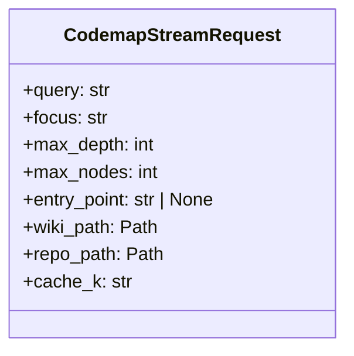

# File: `src/local_deepwiki/web/routes_codemap.py`

## File Overview

This file implements the web routes for the codemap feature in the DeepWiki web UI. It provides functionality for rendering interactive codemap visualizations, generating codemaps via API endpoints, and supporting related operations such as caching, topic suggestions, and git diff overlays.

The primary responsibility of this module is to bridge the frontend UI with the backend codemap generation logic, handling user requests for codemap data, streaming results via Server-Sent Events (SSE), and managing cached results for performance.

## Key Concepts

### Codemap Generation and Streaming

The core of this module is the codemap generation pipeline, which is exposed through the `api_codemap` endpoint. This endpoint supports streaming results using Server-Sent Events (SSE), allowing the UI to progressively display progress messages, intermediate results, and the final codemap. This design choice improves user experience by providing real-time feedback during potentially long-running operations.

### Caching Strategy

Codemap results are cached to avoid recomputation. The caching system uses a hash key derived from the request parameters ([`cache_key`](../generators/codemap/cache.md)) and stores results in a persistent location. The `_codemap_sse_stream` function first attempts to retrieve a cached result before invoking the full codemap generation logic. This caching strategy significantly improves performance for repeated queries with identical parameters.

### Input Validation

A robust validation system is implemented for API requests to ensure data integrity and prevent errors. The `_validate_codemap_request` function validates all parameters including query length, focus mode, depth and node limits, and entry point format. This prevents malformed or malicious input from causing downstream failures.

### Git Diff Integration

The `api_codemap_diff` endpoint provides integration with Git to show which files have changed between two revisions. This is useful for context-aware codemap generation or highlighting recent changes in the visualization. It uses subprocess to run `git diff` and parses the output to return a structured list of changed files.

## Integration

### External Dependencies

This module integrates deeply with several components:

- **Flask**: Used for defining routes and handling HTTP requests.
- **Codemap Generators**: Core logic for generating codemaps is imported from `local_deepwiki.generators.codemap`, including [`generate_codemap`](../generators/codemap/generator.md), [`suggest_topics`](../generators/codemap/generator.md), and [`build_overview`](../generators/codemap/overview.md).
- **Providers System**: The [`create_providers`](utils.md) utility from `local_deepwiki.web.utils` is used to set up necessary components like vector stores and LLMs for codemap generation.
- **Caching System**: The caching logic is imported from `local_deepwiki.generators.codemap.cache`, enabling persistent storage and retrieval of codemap results.
- **Streaming Utility**: The [`stream_async_generator`](routes_chat.md) function from `local_deepwiki.web.routes_chat` is used to convert async generators into Flask response streams.

### Callers and Usage

The functions defined in this file are used by:

- `codemap_page`: Renders the main codemap visualization page.
- `api_codemap`: Handles streaming codemap generation requests.
- `_stream`: Internal helper for creating the streaming generator.
- `api_codemap_overview`, `api_codemap_topics`: Serve overview and topic suggestion data.
- `api_codemap_cache`, `api_codemap_diff`: Provide cache browsing and git diff functionality.
- `codemap_compare_page`: Renders the side-by-side comparison view.

These routes are part of the main web application and are integrated into the Flask blueprint, forming part of the broader web interface for DeepWiki.

## Design Notes

### Streaming with SSE

The decision to use Server-Sent Events for streaming codemap generation was made to support progressive rendering of results. This allows the UI to update in real-time with progress messages and partial data, enhancing user experience without requiring polling or more complex WebSocket implementations.

### Error Handling and Graceful Degradation

Error handling throughout this module is designed to be graceful. For example, when fetching architecture overview or topic suggestions fails, it returns empty or default values rather than crashing the API. This prevents the entire system from failing due to transient issues in the underlying data or model.

### Cache Key Derivation

The cache key is derived from the query, focus mode, max depth, and max nodes, ensuring that different parameter combinations result in distinct cache entries. This prevents incorrect results from being served due to parameter mismatches.

### Git Command Safety

The `api_codemap_diff` endpoint includes validation of git references to prevent command injection. It uses a regex pattern to sanitize inputs before passing them to `subprocess.run`, ensuring that only safe references are used in Git commands.

## API Reference

### class `CodemapStreamRequest`

Immutable parameters for a codemap SSE stream request.

---


<details>
<summary>View Source (lines 251-261) | <a href="https://github.com/UrbanDiver/local-deepwiki-mcp/blob/main/src/local_deepwiki/web/routes_codemap.py#L251-L261">GitHub</a></summary>

```python
class CodemapStreamRequest:
    """Immutable parameters for a codemap SSE stream request."""

    query: str
    focus: str
    max_depth: int
    max_nodes: int
    entry_point: str | None
    wiki_path: Path
    repo_path: Path
    cache_k: str
```

</details>

### Functions

#### `codemap_page`

`@codemap_bp.route("/codemap")`

```python
def codemap_page() -> Response | str
```

Render the interactive codemap visualization page.

**Returns:** `Response | str`


<details>
<summary>View Source (lines 39-51) | <a href="https://github.com/UrbanDiver/local-deepwiki-mcp/blob/main/src/local_deepwiki/web/routes_codemap.py#L39-L51">GitHub</a></summary>

```python
def codemap_page() -> Response | str:
    """Render the interactive codemap visualization page."""
    wiki_path = _get_wiki_path()
    if wiki_path is None:
        abort(500, "Wiki path not configured")

    # Check if wiki is indexed
    index_md = wiki_path / "index.md"
    if not index_md.exists():
        logger.info("Wiki not indexed yet, showing onboarding page")
        return render_template("onboarding.html", wiki_path=str(wiki_path.parent))

    return render_template("codemap.html", wiki_path=str(wiki_path))
```

</details>

#### `api_codemap_overview`

`@codemap_bp.route("/api/codemap/overview")`

```python
def api_codemap_overview() -> Response | tuple[Response, int]
```

Return module-level architecture overview as JSON.

**Returns:** `Response | tuple[Response, int]`


<details>
<summary>View Source (lines 55-115) | <a href="https://github.com/UrbanDiver/local-deepwiki-mcp/blob/main/src/local_deepwiki/web/routes_codemap.py#L55-L115">GitHub</a></summary>

```python
def api_codemap_overview() -> Response | tuple[Response, int]:
    """Return module-level architecture overview as JSON.

    Returns:
        JSON with modules, edges, and summary keys.
    """
    wiki_path = _get_wiki_path()
    if wiki_path is None:
        return jsonify({"error": "Wiki path not configured"}), 500

    repo_path = wiki_path.parent
    if wiki_path.name == ".deepwiki":
        repo_path = wiki_path.parent

    async def _fetch_overview() -> dict:
        from local_deepwiki.generators.codemap.overview import build_overview
        from local_deepwiki.web.utils import create_providers

        providers = create_providers(repo_path)
        vector_db_path = providers.config.get_vector_db_path(repo_path)

        if not vector_db_path.exists():
            return {"modules": [], "edges": [], "summary": ""}

        result = await build_overview(
            providers.vector_store, str(repo_path), providers.llm
        )
        return {
            "modules": [
                {
                    "id": m.id,
                    "label": m.label,
                    "description": m.description,
                    "files": list(m.files),
                    "function_count": m.function_count,
                    "hub_functions": list(m.hub_functions),
                }
                for m in result.modules
            ],
            "edges": [
                {
                    "source": e.source,
                    "target": e.target,
                    "weight": e.weight,
                    "description": e.description,
                }
                for e in result.edges
            ],
            "summary": result.summary,
        }

    loop = asyncio.new_event_loop()
    try:
        overview = loop.run_until_complete(_fetch_overview())
    except Exception:  # noqa: BLE001 - Graceful degradation for overview
        logger.exception("Failed to generate architecture overview")
        overview = {"modules": [], "edges": [], "summary": ""}
    finally:
        loop.close()

    return jsonify(overview)
```

</details>

#### `api_codemap_topics`

`@codemap_bp.route("/api/codemap/topics")`

```python
def api_codemap_topics() -> Response | tuple[Response, int]
```

Return suggested codemap topics as JSON.  Calls [suggest_topics](../generators/codemap/generator.md)() from the codemap generator using the indexed repository's call graph hubs.

**Returns:** `Response | tuple[Response, int]`


<details>
<summary>View Source (lines 119-158) | <a href="https://github.com/UrbanDiver/local-deepwiki-mcp/blob/main/src/local_deepwiki/web/routes_codemap.py#L119-L158">GitHub</a></summary>

```python
def api_codemap_topics() -> Response | tuple[Response, int]:
    """Return suggested codemap topics as JSON.

    Calls suggest_topics() from the codemap generator using the indexed
    repository's call graph hubs.

    Returns:
        JSON array of topic suggestions, or empty array on error.
    """
    wiki_path = _get_wiki_path()
    if wiki_path is None:
        return jsonify({"error": "Wiki path not configured"}), 500

    repo_path = wiki_path.parent
    if wiki_path.name == ".deepwiki":
        repo_path = wiki_path.parent

    async def _fetch_topics() -> list[dict]:
        from local_deepwiki.generators.codemap import suggest_topics
        from local_deepwiki.web.utils import create_providers

        providers = create_providers(repo_path)
        vector_db_path = providers.config.get_vector_db_path(repo_path)

        if not vector_db_path.exists():
            return []

        try:
            return await suggest_topics(providers.vector_store, repo_path)
        except Exception:  # noqa: BLE001 - Graceful degradation for topic suggestions
            logger.exception("Failed to generate codemap topics")
            return []

    loop = asyncio.new_event_loop()
    try:
        topics = loop.run_until_complete(_fetch_topics())
    finally:
        loop.close()

    return jsonify(topics)
```

</details>

#### `api_codemap`

`@codemap_bp.route("/api/codemap", methods=["POST"])`

```python
def api_codemap() -> Response | tuple[Response, int]
```

Handle codemap generation with streaming response.  Expects JSON body with: - query: The codemap query (required) - focus: Focus mode - execution_flow, data_flow, dependency_chain (default: execution_flow) - entry_point: Optional specific entry point function name - max_depth: Max traversal depth 1-10 (default: 5) - max_nodes: Max nodes 5-60 (default: 30)

**Returns:** `Response | tuple[Response, int]`


<details>
<summary>View Source (lines 337-394) | <a href="https://github.com/UrbanDiver/local-deepwiki-mcp/blob/main/src/local_deepwiki/web/routes_codemap.py#L337-L394">GitHub</a></summary>

```python
def api_codemap() -> Response | tuple[Response, int]:
    """Handle codemap generation with streaming response.

    Expects JSON body with:
        - query: The codemap query (required)
        - focus: Focus mode - execution_flow, data_flow, dependency_chain (default: execution_flow)
        - entry_point: Optional specific entry point function name
        - max_depth: Max traversal depth 1-10 (default: 5)
        - max_nodes: Max nodes 5-60 (default: 30)

    Returns:
        Server-Sent Events stream with progress, result, and done events.
    """
    wiki_path = _get_wiki_path()
    if wiki_path is None:
        return jsonify({"error": "Wiki path not configured"}), 500

    data = request.get_json() or {}
    validated = _validate_codemap_request(data)

    # If validation returned an error tuple, propagate it
    if (
        isinstance(validated, tuple)
        and len(validated) == 2
        and isinstance(validated[1], int)
    ):
        return validated  # type: ignore[return-value]

    query, focus, max_depth, max_nodes, entry_point = validated  # type: ignore[misc]

    repo_path = wiki_path.parent
    if wiki_path.name == ".deepwiki":
        repo_path = wiki_path.parent

    cache_k = cache_key(query, focus, max_depth, max_nodes)

    def _stream() -> AsyncIterator[str]:
        return _codemap_sse_stream(
            CodemapStreamRequest(
                query=query,
                focus=focus,
                max_depth=max_depth,
                max_nodes=max_nodes,
                entry_point=entry_point,
                wiki_path=wiki_path,
                repo_path=repo_path,
                cache_k=cache_k,
            )
        )

    return Response(
        stream_async_generator(_stream),
        mimetype="text/event-stream",
        headers={
            "Cache-Control": "no-cache",
            "X-Accel-Buffering": "no",
        },
    )
```

</details>

#### `api_codemap_cache`

`@codemap_bp.route("/api/codemap/cache")`

```python
def api_codemap_cache() -> Response | tuple[Response, int]
```

List cached codemaps or retrieve a specific cached result.  Query params: - key: If provided, return the full cached result for that key.

**Returns:** `Response | tuple[Response, int]`


<details>
<summary>View Source (lines 398-421) | <a href="https://github.com/UrbanDiver/local-deepwiki-mcp/blob/main/src/local_deepwiki/web/routes_codemap.py#L398-L421">GitHub</a></summary>

```python
def api_codemap_cache() -> Response | tuple[Response, int]:
    """List cached codemaps or retrieve a specific cached result.

    Query params:
        - key: If provided, return the full cached result for that key.

    Returns:
        JSON list of cached codemaps, or a single cached result.
    """
    wiki_path = _get_wiki_path()
    if wiki_path is None:
        return jsonify({"error": "Wiki path not configured"}), 500

    key = request.args.get("key")
    if key:
        # Validate key format (hex chars only)
        if not re.match(r"^[a-f0-9]{1,16}$", key):
            return jsonify({"error": "Invalid cache key"}), 400
        cached = read_cache(wiki_path, key)
        if cached is None:
            return jsonify({"error": "Cache entry not found or expired"}), 404
        return jsonify(cached)

    return jsonify(list_cached_codemaps(wiki_path))
```

</details>

#### `api_codemap_diff`

`@codemap_bp.route("/api/codemap/diff")`

```python
def api_codemap_diff() -> Response | tuple[Response, int]
```

Return list of files changed in recent git commits.  Query params: - base_ref: Git ref to diff from (default: HEAD~1) - head_ref: Git ref to diff to (default: HEAD)

**Returns:** `Response | tuple[Response, int]`


<details>
<summary>View Source (lines 425-476) | <a href="https://github.com/UrbanDiver/local-deepwiki-mcp/blob/main/src/local_deepwiki/web/routes_codemap.py#L425-L476">GitHub</a></summary>

```python
def api_codemap_diff() -> Response | tuple[Response, int]:
    """Return list of files changed in recent git commits.

    Query params:
        - base_ref: Git ref to diff from (default: HEAD~1)
        - head_ref: Git ref to diff to (default: HEAD)

    Returns:
        JSON with changed_files list of {file, status}.
    """
    wiki_path = _get_wiki_path()
    if wiki_path is None:
        return jsonify({"error": "Wiki path not configured"}), 500

    repo_path = wiki_path.parent
    if wiki_path.name == ".deepwiki":
        repo_path = wiki_path.parent

    base_ref = request.args.get("base_ref", "HEAD~1")
    head_ref = request.args.get("head_ref", "HEAD")

    # Validate git refs to prevent injection
    ref_pattern = re.compile(r"^[a-zA-Z0-9_.\/\-~^]+$")
    for ref_value in [base_ref, head_ref]:
        if not ref_pattern.match(ref_value):
            return jsonify({"error": f"Invalid git ref: {ref_value}"}), 400

    try:
        diff_result = subprocess.run(
            ["git", "diff", "--name-status", base_ref, head_ref],
            cwd=str(repo_path),
            capture_output=True,
            text=True,
            timeout=15,
        )
        if diff_result.returncode != 0:
            return jsonify({"error": "git diff failed", "changed_files": []}), 200
    except (subprocess.TimeoutExpired, FileNotFoundError):
        return jsonify({"error": "git not available", "changed_files": []}), 200

    status_map = {"A": "added", "M": "modified", "D": "deleted", "R": "renamed"}
    changed_files = []
    for line in diff_result.stdout.strip().splitlines():
        if not line.strip():
            continue
        parts = line.split("\t", 1)
        if len(parts) == 2:
            status_code, file_name = parts
            status = status_map.get(status_code[0], "modified")
            changed_files.append({"file": file_name, "status": status})

    return jsonify({"changed_files": changed_files})
```

</details>

#### `codemap_compare_page`

`@codemap_bp.route("/codemap/compare")`

```python
def codemap_compare_page() -> Response | str
```

Render the side-by-side codemap comparison page.

**Returns:** `Response | str`


<details>
<summary>View Source (lines 480-492) | <a href="https://github.com/UrbanDiver/local-deepwiki-mcp/blob/main/src/local_deepwiki/web/routes_codemap.py#L480-L492">GitHub</a></summary>

```python
def codemap_compare_page() -> Response | str:
    """Render the side-by-side codemap comparison page."""
    wiki_path = _get_wiki_path()
    if wiki_path is None:
        abort(500, "Wiki path not configured")

    # Check if wiki is indexed
    index_md = wiki_path / "index.md"
    if not index_md.exists():
        logger.info("Wiki not indexed yet, showing onboarding page")
        return render_template("onboarding.html", wiki_path=str(wiki_path.parent))

    return render_template("codemap_compare.html", wiki_path=str(wiki_path))
```

</details>

## Class Diagram



## Call Graph

```mermaid
flowchart TD
    N0[CodemapFocus]
    N1[CodemapStreamRequest]
    N2[_codemap_sse_stream]
    N3[_fetch_overview]
    N4[_fetch_topics]
    N5[_get_wiki_path]
    N6[_stream]
    N7[_validate_codemap_request]
    N8[_validate_entry_point]
    N9[abort]
    N10[api_codemap]
    N11[api_codemap_cache]
    N12[api_codemap_diff]
    N13[api_codemap_overview]
    N14[api_codemap_topics]
    N15[build_overview]
    N16[codemap_compare_page]
    N17[codemap_page]
    N18[create_providers]
    N19[dumps]
    N20[exception]
    N21[exists]
    N22[get_vector_db_path]
    N23[jsonify]
    N24[match]
    N25[new_event_loop]
    N26[read_cache]
    N27[render_template]
    N28[run_until_complete]
    N29[suggest_topics]
    N17 --> N5
    N17 --> N9
    N17 --> N21
    N17 --> N27
    N13 --> N5
    N13 --> N23
    N13 --> N18
    N13 --> N22
    N13 --> N21
    N13 --> N15
    N13 --> N25
    N13 --> N28
    N13 --> N3
    N13 --> N20
    N3 --> N18
    N3 --> N22
    N3 --> N21
    N3 --> N15
    N14 --> N5
    N14 --> N23
    N14 --> N18
    N14 --> N22
    N14 --> N21
    N14 --> N29
    N14 --> N20
    N14 --> N25
    N14 --> N28
    N14 --> N4
    N4 --> N18
    N4 --> N22
    N4 --> N21
    N4 --> N29
    N4 --> N20
    N8 --> N23
    N8 --> N24
    N7 --> N23
    N7 --> N8
    N2 --> N26
    N2 --> N19
    N2 --> N18
    N2 --> N22
    N2 --> N21
    N2 --> N0
    N2 --> N20
    N10 --> N5
    N10 --> N23
    N10 --> N7
    N10 --> N2
    N10 --> N1
    N6 --> N2
    N6 --> N1
    N11 --> N5
    N11 --> N23
    N11 --> N24
    N11 --> N26
    N12 --> N5
    N12 --> N23
    N12 --> N24
    N16 --> N5
    N16 --> N9
    N16 --> N21
    N16 --> N27
    classDef func fill:#e1f5fe
    class N0,N1,N2,N3,N4,N5,N6,N7,N8,N9,N10,N11,N12,N13,N14,N15,N16,N17,N18,N19,N20,N21,N22,N23,N24,N25,N26,N27,N28,N29 func
```



## Used By

Functions and methods in this file and their callers:

- **[`CodemapFocus`](../generators/codemap/models.md)**: called by `_codemap_sse_stream`
- **`CodemapStreamRequest`**: called by `_stream`, `api_codemap`
- **`Response`**: called by `api_codemap`
- **`_build_codemap_response`**: called by `_codemap_sse_stream`
- **`_codemap_sse_stream`**: called by `_stream`, `api_codemap`
- **`_fetch_overview`**: called by `api_codemap_overview`
- **`_fetch_topics`**: called by `api_codemap_topics`
- **`_get_wiki_path`**: called by `api_codemap`, `api_codemap_cache`, `api_codemap_diff`, `api_codemap_overview`, `api_codemap_topics`, `codemap_compare_page`, `codemap_page`
- **`_validate_codemap_request`**: called by `api_codemap`
- **`_validate_entry_point`**: called by `_validate_codemap_request`
- **`abort`**: called by `codemap_compare_page`, `codemap_page`
- **[`build_overview`](../generators/codemap/overview.md)**: called by `_fetch_overview`, `api_codemap_overview`
- **[`cache_key`](../generators/codemap/cache.md)**: called by `api_codemap`
- **`compile`**: called by `api_codemap_diff`
- **[`create_providers`](utils.md)**: called by `_codemap_sse_stream`, `_fetch_overview`, `_fetch_topics`, `api_codemap_overview`, `api_codemap_topics`
- **`dumps`**: called by `_codemap_sse_stream`
- **`exception`**: called by `_codemap_sse_stream`, `_fetch_topics`, `api_codemap_overview`, `api_codemap_topics`
- **`exists`**: called by `_codemap_sse_stream`, `_fetch_overview`, `_fetch_topics`, `api_codemap_overview`, `api_codemap_topics`, `codemap_compare_page`, `codemap_page`
- **[`generate_codemap`](../generators/codemap/generator.md)**: called by `_codemap_sse_stream`
- **`get_json`**: called by `api_codemap`
- **`get_vector_db_path`**: called by `_codemap_sse_stream`, `_fetch_overview`, `_fetch_topics`, `api_codemap_overview`, `api_codemap_topics`
- **`jsonify`**: called by `_validate_codemap_request`, `_validate_entry_point`, `api_codemap`, `api_codemap_cache`, `api_codemap_diff`, `api_codemap_overview`, `api_codemap_topics`
- **[`list_cached_codemaps`](../generators/codemap/cache.md)**: called by `api_codemap_cache`
- **`match`**: called by `_validate_entry_point`, `api_codemap_cache`, `api_codemap_diff`
- **`new_event_loop`**: called by `api_codemap_overview`, `api_codemap_topics`
- **[`read_cache`](../generators/codemap/cache.md)**: called by `_codemap_sse_stream`, `api_codemap_cache`
- **`render_template`**: called by `codemap_compare_page`, `codemap_page`
- **`run`**: called by `api_codemap_diff`
- **`run_until_complete`**: called by `api_codemap_overview`, `api_codemap_topics`
- **[`sanitize_error_message`](../error_factories.md)**: called by `_codemap_sse_stream`
- **`splitlines`**: called by `api_codemap_diff`
- **[`stream_async_generator`](routes_chat.md)**: called by `api_codemap`
- **[`suggest_topics`](../generators/codemap/generator.md)**: called by `_fetch_topics`, `api_codemap_topics`
- **[`write_cache`](../generators/codemap/cache.md)**: called by `_codemap_sse_stream`

## Last Modified

| Entity | Type | Author | Date | Commit |
|--------|------|--------|------|--------|
| `CodemapStreamRequest` | class | Brian Breidenbach | yesterday | `1eef062` refactor: complete Grade A ... |
| `_codemap_sse_stream` | function | Brian Breidenbach | yesterday | `1eef062` refactor: complete Grade A ... |
| `api_codemap` | function | Brian Breidenbach | yesterday | `1eef062` refactor: complete Grade A ... |
| `_stream` | function | Brian Breidenbach | yesterday | `1eef062` refactor: complete Grade A ... |
| `_validate_entry_point` | function | Brian Breidenbach | 2 days ago | `3e353f8` refactor: decompose CC > 15... |
| `_validate_codemap_request` | function | Brian Breidenbach | 2 days ago | `3e353f8` refactor: decompose CC > 15... |
| `_build_codemap_response` | function | Brian Breidenbach | 1 week ago | `ed42442` refactor: split 10+ long me... |
| `api_codemap_overview` | function | Brian Breidenbach | 2 weeks ago | `acf9b4f` refactor: extract create_pr... |
| `_fetch_overview` | function | Brian Breidenbach | 2 weeks ago | `acf9b4f` refactor: extract create_pr... |
| `api_codemap_topics` | function | Brian Breidenbach | 2 weeks ago | `acf9b4f` refactor: extract create_pr... |
| `_fetch_topics` | function | Brian Breidenbach | 2 weeks ago | `acf9b4f` refactor: extract create_pr... |
| `codemap_page` | function | Brian Breidenbach | Feb 23, 2026 | `c6fe2bd` refactor: split oversized m... |
| `api_codemap_cache` | function | Brian Breidenbach | Feb 23, 2026 | `c6fe2bd` refactor: split oversized m... |
| `api_codemap_diff` | function | Brian Breidenbach | Feb 23, 2026 | `c6fe2bd` refactor: split oversized m... |
| `codemap_compare_page` | function | Brian Breidenbach | Feb 23, 2026 | `c6fe2bd` refactor: split oversized m... |

## Additional Source Code

Source code for functions and methods not listed in the API Reference above.

#### `_fetch_overview`

<details>
<summary>View Source (lines 69-104) | <a href="https://github.com/UrbanDiver/local-deepwiki-mcp/blob/main/src/local_deepwiki/web/routes_codemap.py#L69-L104">GitHub</a></summary>

```python
async def _fetch_overview() -> dict:
        from local_deepwiki.generators.codemap.overview import build_overview
        from local_deepwiki.web.utils import create_providers

        providers = create_providers(repo_path)
        vector_db_path = providers.config.get_vector_db_path(repo_path)

        if not vector_db_path.exists():
            return {"modules": [], "edges": [], "summary": ""}

        result = await build_overview(
            providers.vector_store, str(repo_path), providers.llm
        )
        return {
            "modules": [
                {
                    "id": m.id,
                    "label": m.label,
                    "description": m.description,
                    "files": list(m.files),
                    "function_count": m.function_count,
                    "hub_functions": list(m.hub_functions),
                }
                for m in result.modules
            ],
            "edges": [
                {
                    "source": e.source,
                    "target": e.target,
                    "weight": e.weight,
                    "description": e.description,
                }
                for e in result.edges
            ],
            "summary": result.summary,
        }
```

</details>


#### `_fetch_topics`

<details>
<summary>View Source (lines 136-150) | <a href="https://github.com/UrbanDiver/local-deepwiki-mcp/blob/main/src/local_deepwiki/web/routes_codemap.py#L136-L150">GitHub</a></summary>

```python
async def _fetch_topics() -> list[dict]:
        from local_deepwiki.generators.codemap import suggest_topics
        from local_deepwiki.web.utils import create_providers

        providers = create_providers(repo_path)
        vector_db_path = providers.config.get_vector_db_path(repo_path)

        if not vector_db_path.exists():
            return []

        try:
            return await suggest_topics(providers.vector_store, repo_path)
        except Exception:  # noqa: BLE001 - Graceful degradation for topic suggestions
            logger.exception("Failed to generate codemap topics")
            return []
```

</details>


#### `_validate_entry_point`

<details>
<summary>View Source (lines 164-178) | <a href="https://github.com/UrbanDiver/local-deepwiki-mcp/blob/main/src/local_deepwiki/web/routes_codemap.py#L164-L178">GitHub</a></summary>

```python
def _validate_entry_point(
    entry_point: object,
) -> tuple[Response, int] | None:
    """Validate the entry_point parameter; return an error response or None."""
    if entry_point is None:
        return None
    if not isinstance(entry_point, str):
        return jsonify({"error": "entry_point must be a string"}), 400
    if len(entry_point) > 500:
        return jsonify(
            {"error": "entry_point exceeds maximum length (500 characters)"}
        ), 400
    if not re.match(r"^[\w.:/ -]+$", entry_point):
        return jsonify({"error": "entry_point contains invalid characters"}), 400
    return None
```

</details>


#### `_validate_codemap_request`

<details>
<summary>View Source (lines 181-222) | <a href="https://github.com/UrbanDiver/local-deepwiki-mcp/blob/main/src/local_deepwiki/web/routes_codemap.py#L181-L222">GitHub</a></summary>

```python
def _validate_codemap_request(
    data: dict,
) -> tuple[str, str, int, int, str | None] | tuple[Response, int]:
    """Validate and extract codemap request parameters from the JSON body.

    Args:
        data: Parsed JSON request body.

    Returns:
        On success: (query, focus, max_depth, max_nodes, entry_point).
        On failure: a (Response, status_code) error tuple.
    """
    query = data.get("query", "").strip()
    if not query:
        return jsonify({"error": "Query is required"}), 400
    if len(query) > 5000:
        return jsonify({"error": "Query exceeds maximum length (5000 characters)"}), 400

    focus = data.get("focus", "execution_flow")
    if focus not in _VALID_FOCUS:
        return jsonify(
            {
                "error": (
                    f"Invalid focus mode. Must be one of: {', '.join(sorted(_VALID_FOCUS))}"
                )
            }
        ), 400

    max_depth = data.get("max_depth", 5)
    if not isinstance(max_depth, int) or max_depth < 1 or max_depth > 10:
        return jsonify({"error": "max_depth must be an integer between 1 and 10"}), 400

    max_nodes = data.get("max_nodes", 30)
    if not isinstance(max_nodes, int) or max_nodes < 5 or max_nodes > 60:
        return jsonify({"error": "max_nodes must be an integer between 5 and 60"}), 400

    entry_point = data.get("entry_point")
    entry_error = _validate_entry_point(entry_point)
    if entry_error is not None:
        return entry_error

    return query, focus, max_depth, max_nodes, entry_point
```

</details>


#### `_build_codemap_response`

<details>
<summary>View Source (lines 225-247) | <a href="https://github.com/UrbanDiver/local-deepwiki-mcp/blob/main/src/local_deepwiki/web/routes_codemap.py#L225-L247">GitHub</a></summary>

```python
def _build_codemap_response(result: object) -> dict:
    """Build the SSE result payload from a CodemapResult object.

    Args:
        result: The CodemapResult returned by generate_codemap.

    Returns:
        Dictionary ready for JSON serialisation as an SSE ``result`` event.
    """
    return {
        "type": "result",
        "query": result.query,  # type: ignore[attr-defined]
        "focus": result.focus,  # type: ignore[attr-defined]
        "entry_point": result.entry_point,  # type: ignore[attr-defined]
        "mermaid_diagram": result.mermaid_diagram,  # type: ignore[attr-defined]
        "narrative": result.narrative,  # type: ignore[attr-defined]
        "nodes": result.nodes,  # type: ignore[attr-defined]
        "edges": result.edges,  # type: ignore[attr-defined]
        "files_involved": result.files_involved,  # type: ignore[attr-defined]
        "total_nodes": result.total_nodes,  # type: ignore[attr-defined]
        "total_edges": result.total_edges,  # type: ignore[attr-defined]
        "cross_file_edges": result.cross_file_edges,  # type: ignore[attr-defined]
    }
```

</details>


#### `_codemap_sse_stream`

<details>
<summary>View Source (lines 264-333) | <a href="https://github.com/UrbanDiver/local-deepwiki-mcp/blob/main/src/local_deepwiki/web/routes_codemap.py#L264-L333">GitHub</a></summary>

```python
async def _codemap_sse_stream(
    req: CodemapStreamRequest,
) -> AsyncIterator[str]:
    """Async generator that streams codemap generation progress and result via SSE."""
    # Try cache hit
    cached = read_cache(req.wiki_path, req.cache_k)
    if cached is not None:
        yield f"data: {json.dumps({'type': 'progress', 'message': 'Loading from cache...'})}\n\n"
        response = {
            "type": "result",
            "query": cached.get("query", req.query),
            "focus": cached.get("focus", req.focus),
            "entry_point": cached.get("entry_point"),
            "mermaid_diagram": cached.get("mermaid_diagram", ""),
            "narrative": cached.get("narrative", ""),
            "nodes": cached.get("nodes", []),
            "edges": cached.get("edges", []),
            "files_involved": cached.get("files_involved", []),
            "total_nodes": cached.get("total_nodes", 0),
            "total_edges": cached.get("total_edges", 0),
            "cross_file_edges": cached.get("cross_file_edges", 0),
            "from_cache": True,
        }
        yield f"data: {json.dumps(response)}\n\n"
        yield f"data: {json.dumps({'type': 'done'})}\n\n"
        return

    from local_deepwiki.generators.codemap import CodemapFocus, generate_codemap
    from local_deepwiki.web.utils import create_providers

    providers = create_providers(req.repo_path)
    vector_db_path = providers.config.get_vector_db_path(req.repo_path)

    if not vector_db_path.exists():
        yield f"data: {json.dumps({'type': 'error', 'message': 'Repository not indexed. Please run index_repository first.'})}\n\n"
        return

    yield f"data: {json.dumps({'type': 'progress', 'message': 'Initializing providers...'})}\n\n"

    vector_store = providers.vector_store
    llm = providers.llm

    yield f"data: {json.dumps({'type': 'progress', 'message': 'Building codemap graph...'})}\n\n"

    try:
        focus_enum = CodemapFocus(req.focus)
        result = await generate_codemap(
            query=req.query,
            vector_store=vector_store,
            llm=llm,
            repo_path=req.repo_path,
            focus=focus_enum,
            entry_point=req.entry_point,
            max_depth=req.max_depth,
            max_nodes=req.max_nodes,
        )

        yield f"data: {json.dumps({'type': 'progress', 'message': 'Codemap ready.'})}\n\n"

        response = _build_codemap_response(result)
        yield f"data: {json.dumps(response)}\n\n"

        # Write to cache
        write_cache(req.wiki_path, req.cache_k, response)

    except Exception as e:  # noqa: BLE001 - Report codemap errors to user via SSE
        logger.exception("Error generating codemap: %s", e)
        yield f"data: {json.dumps({'type': 'error', 'message': sanitize_error_message(str(e))})}\n\n"

    yield f"data: {json.dumps({'type': 'done'})}\n\n"
```

</details>


#### `_stream`

<details>
<summary>View Source (lines 373-385) | <a href="https://github.com/UrbanDiver/local-deepwiki-mcp/blob/main/src/local_deepwiki/web/routes_codemap.py#L373-L385">GitHub</a></summary>

```python
def _stream() -> AsyncIterator[str]:
        return _codemap_sse_stream(
            CodemapStreamRequest(
                query=query,
                focus=focus,
                max_depth=max_depth,
                max_nodes=max_nodes,
                entry_point=entry_point,
                wiki_path=wiki_path,
                repo_path=repo_path,
                cache_k=cache_k,
            )
        )
```

</details>

## Relevant Source Files

- `src/local_deepwiki/web/routes_codemap.py:251-261`
