# File: `src/local_deepwiki/web/routes_research.py`

## File Overview

This file implements the web API endpoint for performing deep, multi-step research queries over an indexed codebase. It provides the `/api/research` endpoint that accepts a user's question and streams progress updates and the final result using Server-Sent Events (SSE).

The file is responsible for handling the HTTP request, managing the research pipeline, and streaming structured progress and result data back to the client. It integrates with the core deep research logic, vector store, and LLM providers to execute complex research tasks and communicate them via a streaming interface.

## Key Concepts

### Server-Sent Events (SSE) Streaming
The core design choice is to use SSE for streaming progress updates and the final result. This allows the UI to display real-time feedback as the research pipeline progresses through steps like sub-question decomposition, chunk retrieval, and synthesis.

### Asynchronous Execution with Task Management
The research process is run asynchronously using `asyncio.create_task`. Progress updates are collected into a `queue.Queue` and yielded as SSE events. The implementation handles task completion and exceptions gracefully, ensuring the stream ends properly with either a result or an error message.

### Modular Progress Data Building
The functions `_build_progress_data` and `_build_research_result` abstract the serialization of internal research objects into structured dictionaries suitable for SSE payloads. This separation improves maintainability and makes it easier to evolve the data format without affecting the core logic.

### Configuration and Provider Abstraction
The pipeline uses [`create_providers`](utils.md) to abstract the instantiation of vector stores and LLMs, and [`ResearchConfig`](../core/deep_research/config.md) to encapsulate configuration parameters. This makes the research pipeline flexible and configurable, supporting different backends and settings.

## Integration

This file is part of the web UI layer and integrates with:
- Core research pipeline ([`DeepResearchPipeline`](../core/deep_research/pipeline.md))
- Vector store and LLM providers via [`create_providers`](utils.md)
- Configuration management ([`ResearchConfig`](../core/deep_research/config.md))
- Logging ([`get_logger`](../logging.md))
- Error sanitization ([`sanitize_error_message`](../error_factories.md))
- Utility functions like `_get_wiki_path`

It is called by:
- `on_progress` (used by `progress` and `test_indexing_service`)
- `api_research` (used by `test_web`)

The file exports the `api_research` function as part of a Flask blueprint, which is wired into the main web application.

## Design Notes

### Progress Queue and Streaming
The implementation uses a `queue.Queue` to [collect](routes_chat.md) progress updates from the research pipeline. This is a synchronous queue, but it is accessed in an async context via `get_nowait()` and `put()` calls. The design choice to use a queue avoids race conditions in the async loop and ensures that progress updates are reliably buffered and streamed.

### Error Handling
Errors during the research process are caught and reported via SSE as JSON objects with a `type: "error"` field. This ensures that clients receive structured error messages, and [`sanitize_error_message`](../error_factories.md) is used to prevent leaking internal implementation details.

### Resource Validation
Before initiating research, the code checks whether the vector database path exists. If not, it sends an error via SSE to inform the user that the repository must be indexed first.

### SSE Payload Format
All SSE payloads are formatted as JSON strings with a `data:` prefix, as required by the SSE specification. The payloads are built using helper functions to ensure consistency and reduce duplication.

### Async Iterator Pattern
The `_research_stream_generator` function implements an async generator that yields SSE-formatted strings. This pattern allows for a clean separation of concerns and makes the streaming logic reusable and testable. It also ensures that the generator can yield both progress and final results in a single stream.

## API Reference

### Functions

#### `on_progress`

```python
async def on_progress(progress: Any) -> None
```


| Parameter | Type | Default | Description |
|-----------|------|---------|-------------|
| `progress` | `Any` | - | - |

**Returns:** `None`


<details>
<summary>View Source (lines 112-113) | <a href="https://github.com/UrbanDiver/local-deepwiki-mcp/blob/main/src/local_deepwiki/web/routes_research.py#L112-L113">GitHub</a></summary>

```python
async def on_progress(progress: Any) -> None:
        progress_queue.put(_build_progress_data(progress))
```

</details>

#### `api_research`

`@research_bp.route("/api/research", methods=["POST"])`

```python
def api_research() -> Response | tuple[Response, int]
```

Handle deep research with streaming progress updates.  Expects JSON body with: - question: The user's question

**Returns:** `Response | tuple[Response, int]`


<details>
<summary>View Source (lines 157-195) | <a href="https://github.com/UrbanDiver/local-deepwiki-mcp/blob/main/src/local_deepwiki/web/routes_research.py#L157-L195">GitHub</a></summary>

```python
def api_research() -> Response | tuple[Response, int]:
    """Handle deep research with streaming progress updates.

    Expects JSON body with:
        - question: The user's question

    Returns:
        Server-Sent Events stream with progress updates and final result.
    """
    wiki_path = _get_wiki_path()
    if wiki_path is None:
        return jsonify({"error": "Wiki path not configured"}), 500

    data = request.get_json() or {}
    question = data.get("question", "").strip()

    if not question:
        return jsonify({"error": "Question is required"}), 400

    if len(question) > 5000:
        return jsonify(
            {"error": "Question exceeds maximum length (5000 characters)"}
        ), 400

    repo_path = wiki_path.parent

    progress_queue: queue.Queue[dict[str, Any] | None] = queue.Queue()

    def run_research() -> AsyncIterator[str]:
        return _research_stream_generator(repo_path, question, progress_queue)

    return Response(
        stream_async_generator(run_research),
        mimetype="text/event-stream",
        headers={
            "Cache-Control": "no-cache",
            "X-Accel-Buffering": "no",
        },
    )
```

</details>

#### `run_research`

```python
def run_research() -> AsyncIterator[str]
```

**Returns:** `AsyncIterator[str]`


<details>
<summary>View Source (lines 185-186) | <a href="https://github.com/UrbanDiver/local-deepwiki-mcp/blob/main/src/local_deepwiki/web/routes_research.py#L185-L186">GitHub</a></summary>

```python
def run_research() -> AsyncIterator[str]:
        return _research_stream_generator(repo_path, question, progress_queue)
```

</details>

## Call Graph

```mermaid
flowchart TD
    N0[DeepResearchPipeline]
    N1[Queue]
    N2[ResearchConfig]
    N3[Response]
    N4[_build_progress_data]
    N5[_build_research_result]
    N6[_drain_progress_queue]
    N7[_get_wiki_path]
    N8[_research_stream_generator]
    N9[api_research]
    N10[create_providers]
    N11[create_task]
    N12[done]
    N13[dumps]
    N14[empty]
    N15[exception]
    N16[exists]
    N17[get_json]
    N18[get_nowait]
    N19[get_vector_db_path]
    N20[jsonify]
    N21[on_progress]
    N22[put]
    N23[research]
    N24[run_research]
    N25[sanitize_error_message]
    N26[sleep]
    N27[stream_async_generator]
    N6 --> N14
    N6 --> N18
    N6 --> N13
    N8 --> N10
    N8 --> N19
    N8 --> N16
    N8 --> N13
    N8 --> N22
    N8 --> N4
    N8 --> N0
    N8 --> N2
    N8 --> N11
    N8 --> N23
    N8 --> N12
    N8 --> N26
    N8 --> N6
    N8 --> N5
    N8 --> N15
    N8 --> N25
    N21 --> N22
    N21 --> N4
    N9 --> N7
    N9 --> N20
    N9 --> N17
    N9 --> N1
    N9 --> N8
    N9 --> N3
    N9 --> N27
    N24 --> N8
    classDef func fill:#e1f5fe
    class N0,N1,N2,N3,N4,N5,N6,N7,N8,N9,N10,N11,N12,N13,N14,N15,N16,N17,N18,N19,N20,N21,N22,N23,N24,N25,N26,N27 func
```



## Used By

Functions and methods in this file and their callers:

- **[`DeepResearchPipeline`](../core/deep_research/pipeline.md)**: called by `_research_stream_generator`
- **`Queue`**: called by `api_research`
- **[`ResearchConfig`](../core/deep_research/config.md)**: called by `_research_stream_generator`
- **`Response`**: called by `api_research`
- **`_build_progress_data`**: called by `_research_stream_generator`, `on_progress`
- **`_build_research_result`**: called by `_research_stream_generator`
- **`_drain_progress_queue`**: called by `_research_stream_generator`
- **`_get_wiki_path`**: called by `api_research`
- **`_research_stream_generator`**: called by `api_research`, `run_research`
- **[`create_providers`](utils.md)**: called by `_research_stream_generator`
- **`create_task`**: called by `_research_stream_generator`
- **`done`**: called by `_research_stream_generator`
- **`dumps`**: called by `_drain_progress_queue`, `_research_stream_generator`
- **`empty`**: called by `_drain_progress_queue`
- **`exception`**: called by `_research_stream_generator`
- **`exists`**: called by `_research_stream_generator`
- **`get_json`**: called by `api_research`
- **`get_nowait`**: called by `_drain_progress_queue`
- **`get_vector_db_path`**: called by `_research_stream_generator`
- **`jsonify`**: called by `api_research`
- **`put`**: called by `_research_stream_generator`, `on_progress`
- **`research`**: called by `_research_stream_generator`
- **[`sanitize_error_message`](../error_factories.md)**: called by `_research_stream_generator`
- **`sleep`**: called by `_research_stream_generator`
- **[`stream_async_generator`](routes_chat.md)**: called by `api_research`

## Last Modified

| Entity | Type | Author | Date | Commit |
|--------|------|--------|------|--------|
| `_research_stream_generator` | function | Brian Breidenbach | yesterday | `1eef062` refactor: complete Grade A ... |
| `_build_progress_data` | function | Brian Breidenbach | 2 days ago | `3e353f8` refactor: decompose CC > 15... |
| `_build_research_result` | function | Brian Breidenbach | 2 days ago | `3e353f8` refactor: decompose CC > 15... |
| `_drain_progress_queue` | function | Brian Breidenbach | 2 days ago | `3e353f8` refactor: decompose CC > 15... |
| `on_progress` | function | Brian Breidenbach | 2 days ago | `3e353f8` refactor: decompose CC > 15... |
| `api_research` | function | Brian Breidenbach | 2 days ago | `3e353f8` refactor: decompose CC > 15... |
| `run_research` | function | Brian Breidenbach | 2 days ago | `3e353f8` refactor: decompose CC > 15... |

## Additional Source Code

Source code for functions and methods not listed in the API Reference above.

#### `_build_progress_data`

<details>
<summary>View Source (lines 29-49) | <a href="https://github.com/UrbanDiver/local-deepwiki-mcp/blob/main/src/local_deepwiki/web/routes_research.py#L29-L49">GitHub</a></summary>

```python
def _build_progress_data(progress: Any) -> dict[str, Any]:
    """Build the SSE progress payload from a ResearchProgress object."""
    data: dict[str, Any] = {
        "type": "progress",
        "step": progress.step,
        "total_steps": progress.total_steps,
        "step_type": progress.step_type.value,
        "message": progress.message,
    }
    if progress.sub_questions:
        data["sub_questions"] = [
            {"question": sq.question, "category": sq.category}
            for sq in progress.sub_questions
        ]
    if progress.chunks_retrieved is not None:
        data["chunks_retrieved"] = progress.chunks_retrieved
    if progress.follow_up_queries:
        data["follow_up_queries"] = progress.follow_up_queries
    if progress.duration_ms is not None:
        data["duration_ms"] = progress.duration_ms
    return data
```

</details>


#### `_build_research_result`

<details>
<summary>View Source (lines 52-83) | <a href="https://github.com/UrbanDiver/local-deepwiki-mcp/blob/main/src/local_deepwiki/web/routes_research.py#L52-L83">GitHub</a></summary>

```python
def _build_research_result(result: Any) -> dict[str, Any]:
    """Build the SSE result payload from a completed research result."""
    return {
        "type": "result",
        "answer": result.answer,
        "sub_questions": [
            {"question": sq.question, "category": sq.category}
            for sq in result.sub_questions
        ],
        "sources": [
            {
                "file": src.file_path,
                "lines": f"{src.start_line}-{src.end_line}",
                "type": src.chunk_type,
                "name": src.name,
                "relevance": round(src.relevance_score, 3),
            }
            for src in result.sources
        ],
        "reasoning_trace": [
            {
                "step": step.step_type.value,
                "description": step.description,
                "duration_ms": step.duration_ms,
            }
            for step in result.reasoning_trace
        ],
        "stats": {
            "chunks_analyzed": result.total_chunks_analyzed,
            "llm_calls": result.total_llm_calls,
        },
    }
```

</details>


#### `_drain_progress_queue`

<details>
<summary>View Source (lines 86-93) | <a href="https://github.com/UrbanDiver/local-deepwiki-mcp/blob/main/src/local_deepwiki/web/routes_research.py#L86-L93">GitHub</a></summary>

```python
async def _drain_progress_queue(
    progress_queue: "queue.Queue[dict[str, Any] | None]",
) -> AsyncIterator[str]:
    """Yield SSE strings for all items remaining in the progress queue."""
    while not progress_queue.empty():
        item = progress_queue.get_nowait()
        if item is not None:
            yield f"data: {json.dumps(item)}\n\n"
```

</details>


#### `_research_stream_generator`

<details>
<summary>View Source (lines 96-153) | <a href="https://github.com/UrbanDiver/local-deepwiki-mcp/blob/main/src/local_deepwiki/web/routes_research.py#L96-L153">GitHub</a></summary>

```python
async def _research_stream_generator(
    repo_path: Any,
    question: str,
    progress_queue: "queue.Queue[dict[str, Any] | None]",
) -> AsyncIterator[str]:
    """Async generator that runs deep research with SSE progress updates."""
    from local_deepwiki.core.deep_research import DeepResearchPipeline
    from local_deepwiki.web.utils import create_providers

    providers = create_providers(repo_path)
    vector_db_path = providers.config.get_vector_db_path(repo_path)

    if not vector_db_path.exists():
        yield f"data: {json.dumps({'type': 'error', 'message': 'Repository not indexed. Please run index_repository first.'})}\n\n"
        return

    async def on_progress(progress: Any) -> None:
        progress_queue.put(_build_progress_data(progress))

    from local_deepwiki.core.deep_research.config import ResearchConfig

    dr_config = providers.config.deep_research
    pipeline = DeepResearchPipeline(
        vector_store=providers.vector_store,
        llm_provider=providers.llm,
        config=ResearchConfig(
            max_sub_questions=dr_config.max_sub_questions,
            chunks_per_subquestion=dr_config.chunks_per_subquestion,
            max_total_chunks=dr_config.max_total_chunks,
            max_follow_up_queries=dr_config.max_follow_up_queries,
            synthesis_temperature=dr_config.synthesis_temperature,
            synthesis_max_tokens=dr_config.synthesis_max_tokens,
        ),
    )

    research_task = asyncio.create_task(
        pipeline.research(question, progress_callback=on_progress)
    )

    while not research_task.done():
        try:
            item = progress_queue.get(timeout=0.1)
            if item is not None:
                yield f"data: {json.dumps(item)}\n\n"
        except queue.Empty:
            await asyncio.sleep(0.05)

    async for sse in _drain_progress_queue(progress_queue):
        yield sse

    try:
        result = await research_task
        yield f"data: {json.dumps(_build_research_result(result))}\n\n"
    except Exception as e:  # noqa: BLE001 - Report research errors to user via SSE
        logger.exception("Error in deep research: %s", e)
        yield f"data: {json.dumps({'type': 'error', 'message': sanitize_error_message(str(e))})}\n\n"

    yield f"data: {json.dumps({'type': 'done'})}\n\n"
```

</details>

## Relevant Source Files

- `src/local_deepwiki/web/routes_research.py:29-49`
