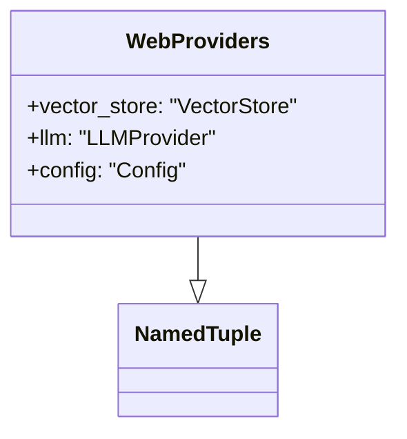
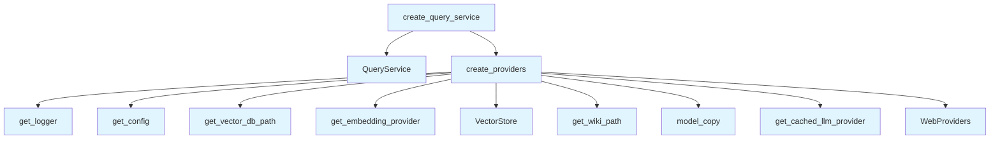

# File: `src/local_deepwiki/web/utils.py`

## File Overview

This file provides shared utilities for web route handlers in the `local_deepwiki` application. It encapsulates common logic for initializing and managing core components such as vector stores, LLM providers, and configuration objects that are used across multiple web routes.

The main purpose of this file is to reduce code duplication and centralize the setup of shared providers used by different parts of the web interface — such as chat, codemap, and research routes.

## Key Concepts

### Provider Initialization Pattern

The `create_providers` function implements a consistent pattern for initializing core components:
1. Retrieve configuration via [`get_config`](../config/loader.md)
2. Create an embedding provider
3. Initialize a [`VectorStore`](../core/vectorstore/store.md) using the embedding provider
4. Set up an LLM provider with caching

This pattern is encapsulated in a `WebProviders` named tuple to ensure a consistent interface for accessing these components across different web routes.

### Configuration Flexibility

The `get_wiki_path` function supports both Flask-based configuration and direct module-level fallbacks. This design choice allows for flexibility in how the application is launched (e.g., via `flask run` vs. `python -m`) while maintaining backward compatibility with tests that directly patch the module-level path.

### Caching and Performance

LLM providers are wrapped with caching via `get_cached_llm_provider`. This ensures that repeated queries do not re-execute expensive LLM calls, improving performance and reducing API costs. The cache path is derived from the wiki path and configured via `config.llm_cache`.

## Integration

This file is used by:
- `get_wiki_path`: Called by `models`, `test_config`, `test_indexing_service`, and one more unspecified module.
- `create_providers`: Used by `provider_factory`.
- `create_query_service`: Used by `routes_chat`.

The file integrates closely with:
- `local_deepwiki.config` for configuration retrieval
- `local_deepwiki.core.vectorstore` for vector database interactions
- `local_deepwiki.providers.embeddings` and `local_deepwiki.providers.llm` for embedding and LLM initialization
- `local_deepwiki.services.query_service` for query execution logic

It is part of the `local_deepwiki.web` package and relies on Flask's `current_app` for runtime configuration.

## Design Notes

### Why NamedTuple for WebProviders?

The `WebProviders` class uses a `NamedTuple` to provide an immutable, structured way to pass around shared dependencies. This choice ensures that the components are clearly defined and reduces the risk of accidentally modifying state in a multi-threaded web environment.

### Handling Multiple LLM Providers

The `create_providers` function supports switching between default and custom LLM providers via the `wiki.chat_llm_provider` configuration. This allows flexibility in choosing different LLMs for chat functionality without changing code, and logs a message when a non-default provider is used.

### Path Resolution

The `get_wiki_path` function prefers `current_app.config.get("WIKI_PATH")` to ensure that Flask-based deployments correctly resolve the wiki path. It falls back to a module-level global for backward compatibility with test environments that directly patch `WIKI_PATH`.

### Caching Strategy

The caching strategy for LLMs is implemented using a dedicated cache path (`llm_cache.lance`) that is derived from the wiki path. This ensures that each wiki instance has its own isolated cache, which is critical for multi-user or multi-wiki deployments.

## API Reference

### class `WebProviders`

**Inherits from:** `NamedTuple`

Shared providers for web route handlers.

---


<details>
<summary>View Source (lines 15-20) | <a href="https://github.com/UrbanDiver/local-deepwiki-mcp/blob/main/src/local_deepwiki/web/utils.py#L15-L20">GitHub</a></summary>

```python
class WebProviders(NamedTuple):
    """Shared providers for web route handlers."""

    vector_store: "VectorStore"
    llm: "LLMProvider"
    config: "Config"
```

</details>

### Functions

#### `get_wiki_path`

```python
def get_wiki_path() -> Path | None
```

Retrieve the current WIKI_PATH, preferring Flask app config.  Checks current_app.config first (set by [create_app](app.md)), which works even when the server is launched via ``python -m`` where __main__ and the importable module are separate objects.  Falls back to the module-level global for backward compatibility with tests that monkeypatch it directly.

**Returns:** `Path | None`


<details>
<summary>View Source (lines 23-39) | <a href="https://github.com/UrbanDiver/local-deepwiki-mcp/blob/main/src/local_deepwiki/web/utils.py#L23-L39">GitHub</a></summary>

```python
def get_wiki_path() -> Path | None:
    """Retrieve the current WIKI_PATH, preferring Flask app config.

    Checks current_app.config first (set by create_app), which works even
    when the server is launched via ``python -m`` where __main__ and the
    importable module are separate objects.  Falls back to the module-level
    global for backward compatibility with tests that monkeypatch it directly.
    """
    from flask import current_app

    path = current_app.config.get("WIKI_PATH")
    if path is not None:
        return path

    from local_deepwiki.web import app as _app_module

    return _app_module.WIKI_PATH
```

</details>

#### `create_providers`

```python
def create_providers(repo_path: Path) -> WebProviders
```

Create shared providers from config.  Encapsulates the repeated provider setup: [get_config](../config/loader.md) -> embedding provider -> vector store -> LLM provider. Used by codemap, research, and chat routes.


| Parameter | Type | Default | Description |
|-----------|------|---------|-------------|
| `repo_path` | `Path` | - | Path to the repository root. |

**Returns:** `WebProviders`


<details>
<summary>View Source (lines 42-81) | <a href="https://github.com/UrbanDiver/local-deepwiki-mcp/blob/main/src/local_deepwiki/web/utils.py#L42-L81">GitHub</a></summary>

```python
def create_providers(repo_path: Path) -> WebProviders:
    """Create shared providers from config.

    Encapsulates the repeated provider setup: get_config -> embedding provider ->
    vector store -> LLM provider. Used by codemap, research, and chat routes.

    Args:
        repo_path: Path to the repository root.

    Returns:
        A WebProviders named tuple with vector_store, llm, and config.
    """
    from local_deepwiki.config import get_config
    from local_deepwiki.core.vectorstore import VectorStore
    from local_deepwiki.logging import get_logger
    from local_deepwiki.providers.embeddings import get_embedding_provider
    from local_deepwiki.providers.llm import get_cached_llm_provider

    logger = get_logger(__name__)
    config = get_config()
    vector_db_path = config.get_vector_db_path(repo_path)

    embedding_provider = get_embedding_provider(config.embedding)
    vector_store = VectorStore(vector_db_path, embedding_provider)
    cache_path = config.get_wiki_path(repo_path) / "llm_cache.lance"

    llm_config = config.llm
    chat_provider = config.wiki.chat_llm_provider
    if chat_provider != "default":
        llm_config = llm_config.model_copy(update={"provider": chat_provider})
        logger.info("Using %s provider", chat_provider)

    llm = get_cached_llm_provider(
        cache_path=cache_path,
        embedding_provider=embedding_provider,
        cache_config=config.llm_cache,
        llm_config=llm_config,
    )

    return WebProviders(vector_store, llm, config)
```

</details>

#### `create_query_service`

```python
def create_query_service(repo_path: Path) -> "QueryService"
```

Create a [QueryService](../services/query_service.md) with providers from config.  Delegates to :func:`create_providers` for the shared provider setup, then wraps the result in a [QueryService](../services/query_service.md).


| Parameter | Type | Default | Description |
|-----------|------|---------|-------------|
| `repo_path` | `Path` | - | Path to the repository root. |

**Returns:** `"QueryService"`


<details>
<summary>View Source (lines 84-99) | <a href="https://github.com/UrbanDiver/local-deepwiki-mcp/blob/main/src/local_deepwiki/web/utils.py#L84-L99">GitHub</a></summary>

```python
def create_query_service(repo_path: Path) -> "QueryService":
    """Create a QueryService with providers from config.

    Delegates to :func:`create_providers` for the shared provider setup,
    then wraps the result in a QueryService.

    Args:
        repo_path: Path to the repository root.

    Returns:
        A configured QueryService instance.
    """
    from local_deepwiki.services.query_service import QueryService

    providers = create_providers(repo_path)
    return QueryService(providers.vector_store, providers.llm, providers.config)
```

</details>

## Class Diagram



## Call Graph



## Used By

Functions and methods in this file and their callers:

- **[`QueryService`](../services/query_service.md)**: called by `create_query_service`
- **[`VectorStore`](../core/vectorstore/store.md)**: called by `create_providers`
- **`WebProviders`**: called by `create_providers`
- **`create_providers`**: called by `create_query_service`
- **`get_cached_llm_provider`**: called by `create_providers`
- **[`get_config`](../config/loader.md)**: called by `create_providers`
- **`get_embedding_provider`**: called by `create_providers`
- **[`get_logger`](../logging.md)**: called by `create_providers`
- **`get_vector_db_path`**: called by `create_providers`
- **`get_wiki_path`**: called by `create_providers`
- **`model_copy`**: called by `create_providers`

## Last Modified

| Entity | Type | Author | Date | Commit |
|--------|------|--------|------|--------|
| `WebProviders` | class | Brian Breidenbach | 2 weeks ago | `acf9b4f` refactor: extract create_pr... |
| `create_providers` | function | Brian Breidenbach | 2 weeks ago | `acf9b4f` refactor: extract create_pr... |
| `create_query_service` | function | Brian Breidenbach | 2 weeks ago | `acf9b4f` refactor: extract create_pr... |
| `get_wiki_path` | function | Brian Breidenbach | Feb 20, 2026 | `fdff11b` refactor: apply Pythonic id... |

## Relevant Source Files

- `src/local_deepwiki/web/utils.py:15-20`
