# API Documentation Tests

This file contains tests for the API documentation generation functionality in the local_deepwiki.generators.api_docs module. It verifies that the system correctly extracts and formats documentation from Python source code, including function signatures, docstrings, and class information.

## File Overview

The test file validates the core functionality of API documentation extraction and generation. It ensures that the system properly parses Python code to extract function signatures, parameter information, docstrings, and generates formatted API reference documentation in Markdown format. The tests cover various docstring styles (Google and NumPy), parameter extraction, and complete API reference generation.

## Classes

### TestGetFileApiDocs

Test the convenience function for extracting API documentation from a file.

**Key Methods:**
- `test_file_with_content`: Tests getting API docs for a file with content

### TestAPIDocExtractor

Test [APIDocExtractor](../src/local_deepwiki/generators/api_docs.md) class functionality for extracting documentation from Python files.

**Key Methods:**
- `test_extract_from_file`: Tests extracting docs from a Python file
- `extractor` fixture: Provides an [APIDocExtractor](../src/local_deepwiki/generators/api_docs.md) instance for tests

### TestGenerateApiReferenceMarkdown

Test API reference markdown generation functionality.

**Key Methods:**
- `test_empty_input`: Tests generating documentation with no functions or classes
- `test_function_documentation`: Tests generating function documentation
- `test_class_documentation`: Tests generating class documentation
- `test_combined_documentation`: Tests generating documentation for both functions and classes

### TestParseNumpyDocstring

Test NumPy-style docstring parsing functionality.

**Key Methods:**
- `test_simple_description`: Tests parsing simple description
- `test_parameters_section`: Tests parsing Parameters section

### TestParseGoogleDocstring

Test Google-style docstring parsing functionality.

**Key Methods:**
- `test_simple_description`: Tests parsing simple description
- `test_args_section`: Tests parsing Args section
- `test_returns_section`: Tests parsing Returns section

## Functions

### get_file_api_docs

Extracts API documentation from a Python file.

**Parameters:**
- `file_path` (Path): Path to the Python file to extract documentation from

**Returns:**
- [`APIDocExtractor`](../src/local_deepwiki/generators/api_docs.md): Extractor instance with parsed documentation

### extract_python_parameters

Extracts parameter information from a Python function signature.

**Parameters:**
- `func` (callable): Python function to extract parameters from

**Returns:**
- `list[Parameter]`: List of parameter objects with name, type hint, and description

### extract_python_return_type

Extracts return type information from a Python function signature.

**Parameters:**
- `func` (callable): Python function to extract return type from

**Returns:**
- `str`: Return type hint or empty string

### extract_python_decorators

Extracts decorators from a Python function or class.

**Parameters:**
- `func` (callable): Python function or class to extract decorators from

**Returns:**
- `list[str]`: List of decorator names

### extract_python_docstring

Extracts docstring from a Python function or class.

**Parameters:**
- `func` (callable): Python function or class to extract docstring from

**Returns:**
- `str`: Docstring content or empty string

### parse_google_docstring

Parses Google-style docstrings into structured format.

**Parameters:**
- `docstring` (str): Google-style docstring to parse

**Returns:**
- `dict`: Parsed docstring components including description, args, returns, etc.

### parse_numpy_docstring

Parses NumPy-style docstrings into structured format.

**Parameters:**
- `docstring` (str): NumPy-style docstring to parse

**Returns:**
- `dict`: Parsed docstring components including description, parameters, etc.

### parse_docstring

Parses docstrings using the appropriate parser based on style.

**Parameters:**
- `docstring` (str): Docstring to parse

**Returns:**
- `dict`: Parsed docstring components

### extract_function_signature

Extracts function signature information.

**Parameters:**
- `func` (callable): Python function to extract signature from

**Returns:**
- [`FunctionSignature`](../src/local_deepwiki/generators/api_docs.md): Function signature object with name, parameters, and return type

### extract_class_signature

Extracts class signature information.

**Parameters:**
- `cls` (type): Python class to extract signature from

**Returns:**
- [`ClassSignature`](../src/local_deepwiki/generators/api_docs.md): Class signature object with name, parameters, and decorators

### format_parameter

Formats parameter information for documentation.

**Parameters:**
- `param` ([Parameter](../src/local_deepwiki/generators/api_docs.md)): [Parameter](../src/local_deepwiki/generators/api_docs.md) object to format

**Returns:**
- `str`: Formatted parameter string

### format_function_signature_line

Formats function signature line for documentation.

**Parameters:**
- `func_sig` ([FunctionSignature](../src/local_deepwiki/generators/api_docs.md)): Function signature to format

**Returns:**
- `str`: Formatted function signature line

### generate_api_reference_markdown

Generates Markdown API reference documentation.

**Parameters:**
- `functions` (list[[FunctionSignature](../src/local_deepwiki/generators/api_docs.md)]): List of function signatures
- `classes` (list[[ClassSignature](../src/local_deepwiki/generators/api_docs.md)]): List of class signatures

**Returns:**
- `str`: Formatted Markdown documentation

## Usage Examples

### Extracting API docs from a file

```python
from pathlib import Path
from local_deepwiki.generators.api_docs import get_file_api_docs

# Extract documentation from a Python file
docs = get_file_api_docs(Path("path/to/your/file.py"))
```

### Generating API reference documentation

```python
from local_deepwiki.generators.api_docs import (
    FunctionSignature,
    ClassSignature,
    generate_api_reference_markdown
)

# Create function signatures
functions = [
    FunctionSignature(
        name="process_data",
        parameters=[
            Parameter(name="data", type_hint="str", description="Input data to process."),
        ],
        return_type="str"
    )
]

# Generate Markdown documentation
markdown = generate_api_reference_markdown(functions, [])
print(markdown)
```

### Parsing docstrings

```python
from local_deepwiki.generators.api_docs import parse_google_docstring

docstring = """
Process input data.

Args:
    input_data: The data to process.
    multiplier: A multiplier value.

Returns:
    The processed result.
"""

parsed = parse_google_docstring(docstring)
print(parsed["description"])  # "Process input data."
print(parsed["args"])         # List of argument information
```

## Related Components

This module works with the core document processing components to extract and format API documentation. It integrates with the code analysis tools to parse Python source files and extract meaningful information for generating comprehensive API references. The extracted documentation is used by other system components to create user-facing documentation and help systems.

## API Reference

### class `TestParameter`

Test [Parameter](../src/local_deepwiki/generators/api_docs.md) dataclass.

**Methods:**

#### `test_basic_parameter`

```python
def test_basic_parameter()
```

Test creating a basic parameter.

#### `test_full_parameter`

```python
def test_full_parameter()
```

Test creating a parameter with all fields.


### class `TestExtractPythonParameters`

Test Python parameter extraction.

**Methods:**

#### `parser`

```python
def parser()
```

#### `test_simple_parameters`

```python
def test_simple_parameters(parser)
```

Test extracting simple parameters without types.


| [Parameter](../src/local_deepwiki/generators/api_docs.md) | Type | Default | Description |
|-----------|------|---------|-------------|
| `parser` | - | - | - |

#### `test_typed_parameters`

```python
def test_typed_parameters(parser)
```

Test extracting parameters with type hints.


| [Parameter](../src/local_deepwiki/generators/api_docs.md) | Type | Default | Description |
|-----------|------|---------|-------------|
| `parser` | - | - | - |

#### `test_default_parameters`

```python
def test_default_parameters(parser)
```

Test extracting parameters with default values.


| [Parameter](../src/local_deepwiki/generators/api_docs.md) | Type | Default | Description |
|-----------|------|---------|-------------|
| `parser` | - | - | - |

#### `test_typed_default_parameters`

```python
def test_typed_default_parameters(parser)
```

Test extracting parameters with types and defaults.


| [Parameter](../src/local_deepwiki/generators/api_docs.md) | Type | Default | Description |
|-----------|------|---------|-------------|
| `parser` | - | - | - |

#### `test_excludes_self`

```python
def test_excludes_self(parser)
```

Test that self is excluded from method parameters.


| [Parameter](../src/local_deepwiki/generators/api_docs.md) | Type | Default | Description |
|-----------|------|---------|-------------|
| `parser` | - | - | - |

#### `test_excludes_cls`

```python
def test_excludes_cls(parser)
```

Test that cls is excluded from classmethod parameters.


| [Parameter](../src/local_deepwiki/generators/api_docs.md) | Type | Default | Description |
|-----------|------|---------|-------------|
| `parser` | - | - | - |


### class `TestExtractPythonReturnType`

Test Python return type extraction.

**Methods:**

#### `parser`

```python
def parser()
```

#### `test_simple_return_type`

```python
def test_simple_return_type(parser)
```

Test extracting a simple return type.


| [Parameter](../src/local_deepwiki/generators/api_docs.md) | Type | Default | Description |
|-----------|------|---------|-------------|
| `parser` | - | - | - |

#### `test_complex_return_type`

```python
def test_complex_return_type(parser)
```

Test extracting a complex return type.


| [Parameter](../src/local_deepwiki/generators/api_docs.md) | Type | Default | Description |
|-----------|------|---------|-------------|
| `parser` | - | - | - |

#### `test_no_return_type`

```python
def test_no_return_type(parser)
```

Test function with no return type.


| [Parameter](../src/local_deepwiki/generators/api_docs.md) | Type | Default | Description |
|-----------|------|---------|-------------|
| `parser` | - | - | - |


### class `TestExtractPythonDocstring`

Test Python docstring extraction.

**Methods:**

#### `parser`

```python
def parser()
```

#### `test_triple_quote_docstring`

```python
def test_triple_quote_docstring(parser)
```

Test extracting triple-quoted docstring.


| [Parameter](../src/local_deepwiki/generators/api_docs.md) | Type | Default | Description |
|-----------|------|---------|-------------|
| `parser` | - | - | - |

#### `test_multiline_docstring`

```python
def test_multiline_docstring(parser)
```

Test extracting multiline docstring.


| [Parameter](../src/local_deepwiki/generators/api_docs.md) | Type | Default | Description |
|-----------|------|---------|-------------|
| `parser` | - | - | - |

#### `test_no_docstring`

```python
def test_no_docstring(parser)
```

Test function with no docstring.


| [Parameter](../src/local_deepwiki/generators/api_docs.md) | Type | Default | Description |
|-----------|------|---------|-------------|
| `parser` | - | - | - |


### class `TestParseGoogleDocstring`

Test Google-style docstring parsing.

**Methods:**

#### `test_simple_description`

```python
def test_simple_description()
```

Test parsing simple description.

#### `test_args_section`

```python
def test_args_section()
```

Test parsing Args section.

#### `test_args_with_types`

```python
def test_args_with_types()
```

Test parsing Args with type annotations.

#### `test_returns_section`

```python
def test_returns_section()
```

Test parsing Returns section.


### class `TestParseNumpyDocstring`

Test NumPy-style docstring parsing.

**Methods:**

#### `test_simple_description`

```python
def test_simple_description()
```

Test parsing simple description.

#### `test_parameters_section`

```python
def test_parameters_section()
```

Test parsing Parameters section.


### class `TestExtractFunctionSignature`

Test function signature extraction.

**Methods:**

#### `parser`

```python
def parser()
```

#### `test_simple_function`

```python
def test_simple_function(parser)
```

Test extracting simple function signature.


| [Parameter](../src/local_deepwiki/generators/api_docs.md) | Type | Default | Description |
|-----------|------|---------|-------------|
| `parser` | - | - | - |

#### `test_async_function`

```python
def test_async_function(parser)
```

Test extracting async function signature.


| [Parameter](../src/local_deepwiki/generators/api_docs.md) | Type | Default | Description |
|-----------|------|---------|-------------|
| `parser` | - | - | - |


### class `TestExtractClassSignature`

Test class signature extraction.

**Methods:**

#### `parser`

```python
def parser()
```

#### `test_simple_class`

```python
def test_simple_class(parser)
```

Test extracting simple class signature.


| [Parameter](../src/local_deepwiki/generators/api_docs.md) | Type | Default | Description |
|-----------|------|---------|-------------|
| `parser` | - | - | - |

#### `test_class_with_inheritance`

```python
def test_class_with_inheritance(parser)
```

Test extracting class with base classes.


| [Parameter](../src/local_deepwiki/generators/api_docs.md) | Type | Default | Description |
|-----------|------|---------|-------------|
| `parser` | - | - | - |


### class `TestFormatParameter`

Test parameter formatting.

**Methods:**

#### `test_simple_param`

```python
def test_simple_param()
```

Test formatting simple parameter.

#### `test_typed_param`

```python
def test_typed_param()
```

Test formatting typed parameter.

#### `test_default_param`

```python
def test_default_param()
```

Test formatting parameter with default.

#### `test_full_param`

```python
def test_full_param()
```

Test formatting parameter with type and default.


### class `TestFormatFunctionSignatureLine`

Test function signature line formatting.

**Methods:**

#### `test_simple_function`

```python
def test_simple_function()
```

Test formatting simple function.

#### `test_function_with_params`

```python
def test_function_with_params()
```

Test formatting function with parameters.

#### `test_function_with_return_type`

```python
def test_function_with_return_type()
```

Test formatting function with return type.

#### `test_async_function`

```python
def test_async_function()
```

Test formatting async function.


### class `TestGenerateApiReferenceMarkdown`

Test API reference markdown generation.

**Methods:**

#### `test_empty_input`

```python
def test_empty_input()
```

Test with no functions or classes.

#### `test_function_documentation`

```python
def test_function_documentation()
```

Test generating function documentation.

#### `test_class_documentation`

```python
def test_class_documentation()
```

Test generating class documentation.

#### `test_filters_private_items`

```python
def test_filters_private_items()
```

Test that private items are filtered by default.

#### `test_includes_private_when_requested`

```python
def test_includes_private_when_requested()
```

Test including private items when specified.


### class `TestAPIDocExtractor`

Test [APIDocExtractor](../src/local_deepwiki/generators/api_docs.md) class.

**Methods:**

#### `extractor`

```python
def extractor()
```

#### `test_extract_from_file`

```python
def test_extract_from_file(tmp_path, extractor)
```

Test extracting docs from a Python file.


| [Parameter](../src/local_deepwiki/generators/api_docs.md) | Type | Default | Description |
|-----------|------|---------|-------------|
| `tmp_path` | - | - | - |
| `extractor` | - | - | - |

#### `test_extract_unsupported_file`

```python
def test_extract_unsupported_file(tmp_path, extractor)
```

Test extracting from unsupported file type.


| [Parameter](../src/local_deepwiki/generators/api_docs.md) | Type | Default | Description |
|-----------|------|---------|-------------|
| `tmp_path` | - | - | - |
| `extractor` | - | - | - |


### class `TestGetFileApiDocs`

Test the convenience function.

**Methods:**

#### `test_file_with_content`

```python
def test_file_with_content(tmp_path)
```

Test getting API docs for a file with content.


| [Parameter](../src/local_deepwiki/generators/api_docs.md) | Type | Default | Description |
|-----------|------|---------|-------------|
| `tmp_path` | - | - | - |

#### `test_file_without_functions`

```python
def test_file_without_functions(tmp_path)
```

Test getting API docs for file without functions.


| [Parameter](../src/local_deepwiki/generators/api_docs.md) | Type | Default | Description |
|-----------|------|---------|-------------|
| `tmp_path` | - | - | - |


## Class Diagram

```mermaid
classDiagram
    class TestAPIDocExtractor {
        +extractor()
        +test_extract_from_file()
        +helper()
        -__init__()
        +process()
        +test_extract_unsupported_file()
    }
    class TestExtractClassSignature {
        +parser()
        +test_simple_class()
        +method()
        +test_class_with_inheritance()
    }
    class TestExtractFunctionSignature {
        +parser()
        +test_simple_function()
        +greet()
        +test_async_function()
        +fetch_data()
    }
    class TestExtractPythonDocstring {
        +parser()
        +test_triple_quote_docstring()
        +func()
        +test_multiline_docstring()
        +test_no_docstring()
    }
    class TestExtractPythonParameters {
        +parser()
        +test_simple_parameters()
        +func()
        +test_typed_parameters()
        +test_default_parameters()
        +test_typed_default_parameters()
        +test_excludes_self()
        +method()
        +test_excludes_cls()
        +classmethod_func()
    }
    class TestExtractPythonReturnType {
        +parser()
        +test_simple_return_type()
        +func()
        +test_complex_return_type()
        +test_no_return_type()
    }
    class TestFormatFunctionSignatureLine {
        +test_simple_function()
        +func()
        +test_function_with_params()
        +test_function_with_return_type()
        +test_async_function()
    }
    class TestFormatParameter {
        +test_simple_param()
        +test_typed_param()
        +test_default_param()
        +test_full_param()
    }
    class TestGenerateApiReferenceMarkdown {
        +test_empty_input()
        +test_function_documentation()
        +process()
        +test_class_documentation()
        +test_filters_private_items()
        +test_includes_private_when_requested()
    }
    class TestGetFileApiDocs {
        +test_file_with_content()
        +process()
        +test_file_without_functions()
    }
    class TestParameter {
        +test_basic_parameter()
        +test_full_parameter()
    }
    class TestParseGoogleDocstring {
        +test_simple_description()
        +test_args_section()
        +test_args_with_types()
        +test_returns_section()
    }
    class TestParseNumpyDocstring {
        +test_simple_description()
        +test_parameters_section()
    }
```



## Call Graph

```mermaid
flowchart TD
    N0[CodeParser]
    N1[FunctionSignature]
    N2[Parameter]
    N3[TestExtractClassSignature.t...]
    N4[TestExtractClassSignature.t...]
    N5[TestExtractFunctionSignatur...]
    N6[TestExtractFunctionSignatur...]
    N7[TestExtractPythonDocstring....]
    N8[TestExtractPythonDocstring....]
    N9[TestExtractPythonDocstring....]
    N10[TestExtractPythonParameters...]
    N11[TestExtractPythonParameters...]
    N12[TestExtractPythonParameters...]
    N13[TestExtractPythonParameters...]
    N14[TestExtractPythonParameters...]
    N15[TestExtractPythonParameters...]
    N16[TestExtractPythonReturnType...]
    N17[TestExtractPythonReturnType...]
    N18[TestExtractPythonReturnType...]
    N19[TestGenerateApiReferenceMar...]
    N20[dedent]
    N21[encode]
    N22[extract_python_parameters]
    N23[extract_python_return_type]
    N24[format_function_signature_line]
    N25[format_parameter]
    N26[generate_api_reference_mark...]
    N27[parse_google_docstring]
    N28[parse_source]
    N29[write_text]
    N13 --> N20
    N13 --> N28
    N13 --> N22
    N13 --> N21
    N15 --> N20
    N15 --> N28
    N15 --> N22
    N15 --> N21
    N10 --> N20
    N10 --> N28
    N10 --> N22
    N10 --> N21
    N14 --> N20
    N14 --> N28
    N14 --> N22
    N14 --> N21
    N12 --> N20
    N12 --> N28
    N12 --> N22
    N12 --> N21
    N11 --> N20
    N11 --> N28
    N11 --> N22
    N11 --> N21
    N18 --> N20
    N18 --> N28
    N18 --> N23
    N18 --> N21
    N16 --> N20
    N16 --> N28
    N16 --> N23
    N16 --> N21
    N17 --> N20
    N17 --> N28
    N17 --> N23
    N17 --> N21
    N9 --> N20
    N9 --> N28
    N9 --> N21
    N7 --> N20
    N7 --> N28
    N7 --> N21
    N8 --> N20
    N8 --> N28
    N8 --> N21
    N6 --> N20
    N6 --> N28
    N6 --> N21
    N5 --> N20
    N5 --> N28
    N5 --> N21
    N4 --> N20
    N4 --> N28
    N4 --> N21
    N3 --> N20
    N3 --> N28
    N3 --> N21
    N19 --> N1
    N19 --> N2
    N19 --> N26
    classDef func fill:#e1f5fe
    class N0,N1,N2,N20,N21,N22,N23,N24,N25,N26,N27,N28,N29 func
    classDef method fill:#fff3e0
    class N3,N4,N5,N6,N7,N8,N9,N10,N11,N12,N13,N14,N15,N16,N17,N18,N19 method
```



## See Also

- [models](../src/local_deepwiki/models.md) - dependency
- [parser](../src/local_deepwiki/core/parser.md) - dependency
- [api_docs](../src/local_deepwiki/generators/api_docs.md) - dependency
- [test_chunker](test_chunker.md) - shares 3 dependencies
