# test_api_docs.py

## File Overview

This test file contains comprehensive test cases for the API documentation generation functionality in the local_deepwiki project. It tests various components that extract, parse, and format API documentation from Python source code, including docstring parsing, signature extraction, and markdown generation.

## Classes

### TestAPIDocExtractor

Test class for the APIDocExtractor functionality.

**Methods:**
- `extractor()`: Pytest fixture that returns an APIDocExtractor instance
- `test_extract_from_file()`: Tests extracting API documentation from a Python file by creating a temporary file with sample code including a helper function and a class with an `__init__` method

### TestGetFileApiDocs

Test class for the convenience function that gets API documentation for files.

**Methods:**
- `test_file_with_content()`: Tests getting API docs for a file with content by creating a temporary Python file with a `process` function that has type hints, docstring with Args and Returns sections, and tests the file processing functionality

## Test Coverage

The test file covers the following API documentation components based on the imports:

### Core Functions Tested
- `extract_class_signature`: Extracts class signatures from Python code
- `extract_function_signature`: Extracts function signatures from Python code  
- `extract_python_decorators`: Extracts decorators from Python functions/classes
- `extract_python_docstring`: Extracts docstrings from Python code elements
- `extract_python_parameters`: Extracts parameter information from functions
- `extract_python_return_type`: Extracts return type annotations
- `format_function_signature_line`: Formats function signatures for documentation
- `format_parameter`: Formats parameter information for display
- `generate_api_reference_markdown`: Generates markdown API reference documentation
- `get_file_api_docs`: Convenience function for getting file API documentation
- `parse_docstring`: Parses docstrings into structured format
- `parse_google_docstring`: Parses Google-style docstrings

### Data Classes Tested
- `ClassSignature`: Represents class signature information
- `FunctionSignature`: Represents function signature information  
- `Parameter`: Represents function parameter information

## Usage Examples

### Testing API Documentation Extraction

```python
# Create an APIDocExtractor instance (via fixture)
extractor = APIDocExtractor()

# Test extracting docs from a file
source_code = '''
def helper(value: int) -> bool:
    """A helper function."""
    return value > 0

class MyClass:
    """A sample class."""
    
    def __init__(self, name: str):
        """Initialize the class."""
        pass
'''

# Write to temporary file and test extraction
test_file = tmp_path / "test_module.py"
test_file.write_text(source_code)
```

### Testing File API Documentation

```python
# Test processing a file with documented functions
source = '''
def process(value: int = 10) -> str:
    """Process a value.

    Args:
        value: The value to process.

    Returns:
        The processed string.
    """
    return str(value)
'''

test_file = tmp_path / "processor.py"
test_file.write_text(source)
```

## Related Components

This test file works with several core components of the local_deepwiki system:

- **[CodeParser](../src/local_deepwiki/core/parser.md)**: Used for parsing Python source code (from `local_deepwiki.core.parser`)
- **APIDocExtractor**: Main class for extracting API documentation
- **Path**: For file system operations with temporary test files
- **pytest**: Testing framework with fixtures and test organization

The tests verify the integration between code parsing, docstring extraction, signature analysis, and markdown generation components that make up the API documentation system.

## API Reference

### class `TestParameter`

Test Parameter dataclass.

**Methods:**

#### `test_basic_parameter`

```python
def test_basic_parameter()
```

Test creating a basic parameter.

#### `test_full_parameter`

```python
def test_full_parameter()
```

Test creating a parameter with all fields.


### class `TestExtractPythonParameters`

Test Python parameter extraction.

**Methods:**

#### `parser`

```python
def parser()
```

#### `test_simple_parameters`

```python
def test_simple_parameters(parser)
```

Test extracting simple parameters without types.


| Parameter | Type | Default | Description |
|-----------|------|---------|-------------|
| `parser` | - | - | - |

#### `test_typed_parameters`

```python
def test_typed_parameters(parser)
```

Test extracting parameters with type hints.


| Parameter | Type | Default | Description |
|-----------|------|---------|-------------|
| `parser` | - | - | - |

#### `test_default_parameters`

```python
def test_default_parameters(parser)
```

Test extracting parameters with default values.


| Parameter | Type | Default | Description |
|-----------|------|---------|-------------|
| `parser` | - | - | - |

#### `test_typed_default_parameters`

```python
def test_typed_default_parameters(parser)
```

Test extracting parameters with types and defaults.


| Parameter | Type | Default | Description |
|-----------|------|---------|-------------|
| `parser` | - | - | - |

#### `test_excludes_self`

```python
def test_excludes_self(parser)
```

Test that self is excluded from method parameters.


| Parameter | Type | Default | Description |
|-----------|------|---------|-------------|
| `parser` | - | - | - |

#### `test_excludes_cls`

```python
def test_excludes_cls(parser)
```

Test that cls is excluded from classmethod parameters.


| Parameter | Type | Default | Description |
|-----------|------|---------|-------------|
| `parser` | - | - | - |


### class `TestExtractPythonReturnType`

Test Python return type extraction.

**Methods:**

#### `parser`

```python
def parser()
```

#### `test_simple_return_type`

```python
def test_simple_return_type(parser)
```

Test extracting a simple return type.


| Parameter | Type | Default | Description |
|-----------|------|---------|-------------|
| `parser` | - | - | - |

#### `test_complex_return_type`

```python
def test_complex_return_type(parser)
```

Test extracting a complex return type.


| Parameter | Type | Default | Description |
|-----------|------|---------|-------------|
| `parser` | - | - | - |

#### `test_no_return_type`

```python
def test_no_return_type(parser)
```

Test function with no return type.


| Parameter | Type | Default | Description |
|-----------|------|---------|-------------|
| `parser` | - | - | - |


### class `TestExtractPythonDocstring`

Test Python docstring extraction.

**Methods:**

#### `parser`

```python
def parser()
```

#### `test_triple_quote_docstring`

```python
def test_triple_quote_docstring(parser)
```

Test extracting triple-quoted docstring.


| Parameter | Type | Default | Description |
|-----------|------|---------|-------------|
| `parser` | - | - | - |

#### `test_multiline_docstring`

```python
def test_multiline_docstring(parser)
```

Test extracting multiline docstring.


| Parameter | Type | Default | Description |
|-----------|------|---------|-------------|
| `parser` | - | - | - |

#### `test_no_docstring`

```python
def test_no_docstring(parser)
```

Test function with no docstring.


| Parameter | Type | Default | Description |
|-----------|------|---------|-------------|
| `parser` | - | - | - |


### class `TestParseGoogleDocstring`

Test Google-style docstring parsing.

**Methods:**

#### `test_simple_description`

```python
def test_simple_description()
```

Test parsing simple description.

#### `test_args_section`

```python
def test_args_section()
```

Test parsing Args section.

#### `test_args_with_types`

```python
def test_args_with_types()
```

Test parsing Args with type annotations.

#### `test_returns_section`

```python
def test_returns_section()
```

Test parsing Returns section.


### class `TestParseNumpyDocstring`

Test NumPy-style docstring parsing.

**Methods:**

#### `test_simple_description`

```python
def test_simple_description()
```

Test parsing simple description.

#### `test_parameters_section`

```python
def test_parameters_section()
```

Test parsing Parameters section.


### class `TestExtractFunctionSignature`

Test function signature extraction.

**Methods:**

#### `parser`

```python
def parser()
```

#### `test_simple_function`

```python
def test_simple_function(parser)
```

Test extracting simple function signature.


| Parameter | Type | Default | Description |
|-----------|------|---------|-------------|
| `parser` | - | - | - |

#### `test_async_function`

```python
def test_async_function(parser)
```

Test extracting async function signature.


| Parameter | Type | Default | Description |
|-----------|------|---------|-------------|
| `parser` | - | - | - |


### class `TestExtractClassSignature`

Test class signature extraction.

**Methods:**

#### `parser`

```python
def parser()
```

#### `test_simple_class`

```python
def test_simple_class(parser)
```

Test extracting simple class signature.


| Parameter | Type | Default | Description |
|-----------|------|---------|-------------|
| `parser` | - | - | - |

#### `test_class_with_inheritance`

```python
def test_class_with_inheritance(parser)
```

Test extracting class with base classes.


| Parameter | Type | Default | Description |
|-----------|------|---------|-------------|
| `parser` | - | - | - |


### class `TestFormatParameter`

Test parameter formatting.

**Methods:**

#### `test_simple_param`

```python
def test_simple_param()
```

Test formatting simple parameter.

#### `test_typed_param`

```python
def test_typed_param()
```

Test formatting typed parameter.

#### `test_default_param`

```python
def test_default_param()
```

Test formatting parameter with default.

#### `test_full_param`

```python
def test_full_param()
```

Test formatting parameter with type and default.


### class `TestFormatFunctionSignatureLine`

Test function signature line formatting.

**Methods:**

#### `test_simple_function`

```python
def test_simple_function()
```

Test formatting simple function.

#### `test_function_with_params`

```python
def test_function_with_params()
```

Test formatting function with parameters.

#### `test_function_with_return_type`

```python
def test_function_with_return_type()
```

Test formatting function with return type.

#### `test_async_function`

```python
def test_async_function()
```

Test formatting async function.


### class `TestGenerateApiReferenceMarkdown`

Test API reference markdown generation.

**Methods:**

#### `test_empty_input`

```python
def test_empty_input()
```

Test with no functions or classes.

#### `test_function_documentation`

```python
def test_function_documentation()
```

Test generating function documentation.

#### `test_class_documentation`

```python
def test_class_documentation()
```

Test generating class documentation.

#### `test_filters_private_items`

```python
def test_filters_private_items()
```

Test that private items are filtered by default.

#### `test_includes_private_when_requested`

```python
def test_includes_private_when_requested()
```

Test including private items when specified.


### class `TestAPIDocExtractor`

Test APIDocExtractor class.

**Methods:**

#### `extractor`

```python
def extractor()
```

#### `test_extract_from_file`

```python
def test_extract_from_file(tmp_path, extractor)
```

Test extracting docs from a Python file.


| Parameter | Type | Default | Description |
|-----------|------|---------|-------------|
| `tmp_path` | - | - | - |
| `extractor` | - | - | - |

#### `test_extract_unsupported_file`

```python
def test_extract_unsupported_file(tmp_path, extractor)
```

Test extracting from unsupported file type.


| Parameter | Type | Default | Description |
|-----------|------|---------|-------------|
| `tmp_path` | - | - | - |
| `extractor` | - | - | - |


### class `TestGetFileApiDocs`

Test the convenience function.

**Methods:**

#### `test_file_with_content`

```python
def test_file_with_content(tmp_path)
```

Test getting API docs for a file with content.


| Parameter | Type | Default | Description |
|-----------|------|---------|-------------|
| `tmp_path` | - | - | - |

#### `test_file_without_functions`

```python
def test_file_without_functions(tmp_path)
```

Test getting API docs for file without functions.


| Parameter | Type | Default | Description |
|-----------|------|---------|-------------|
| `tmp_path` | - | - | - |


## Class Diagram

```mermaid
classDiagram
    class TestAPIDocExtractor {
        +name
        +extractor()
        +test_extract_from_file()
        +helper() -> bool
        -__init__()
        +process() -> dict
        +test_extract_unsupported_file()
    }
    class TestExtractClassSignature {
        +parser()
        +test_simple_class()
        +method() -> bool
        +test_class_with_inheritance()
    }
    class TestExtractFunctionSignature {
        +parser()
        +test_simple_function()
        +greet() -> str
        +test_async_function()
        +fetch_data() -> bytes
    }
    class TestExtractPythonDocstring {
        +parser()
        +test_triple_quote_docstring()
        +func()
        +test_multiline_docstring()
        +test_no_docstring()
    }
    class TestExtractPythonParameters {
        +parser()
        +test_simple_parameters(parser)
        +test_typed_parameters(parser)
        +test_default_parameters(parser)
        +test_typed_default_parameters(parser)
        +test_excludes_self(parser)
        +test_excludes_cls(parser)
    }
    class TestExtractPythonReturnType {
        +parser()
        +test_simple_return_type()
        +func() -> str
        +test_complex_return_type()
        +test_no_return_type()
    }
    class TestFormatFunctionSignatureLine {
        +test_simple_function()
        +test_function_with_params()
        +test_function_with_return_type()
        +func() -> bool"

    def test_async_function(self)
    }
    class TestFormatParameter {
        +test_simple_param()
        +test_typed_param()
        +test_default_param()
        +test_full_param()
    }
    class TestGenerateApiReferenceMarkdown {
        +test_empty_input()
        +test_function_documentation()
        +process() -> bool" in result
        assert "Process the input data." in result
        assert "| `data` |" in result
        assert "**Returns
        +test_class_documentation()
        +test_filters_private_items()
        +test_includes_private_when_requested()
    }
    class TestGetFileApiDocs {
        +test_file_with_content()
        +process() -> str
        +test_file_without_functions()
    }
    class TestParameter {
        +test_basic_parameter()
        +test_full_parameter()
    }
    class TestParseGoogleDocstring {
        +test_simple_description()
        +test_args_section()
        +test_args_with_types()
        +test_returns_section()
    }
    class TestParseNumpyDocstring {
        +test_simple_description()
        +test_parameters_section()
    }
```



## Call Graph

```mermaid
flowchart TD
    N0[CodeParser]
    N1[FunctionSignature]
    N2[Parameter]
    N3[TestExtractClassSignature.t...]
    N4[TestExtractClassSignature.t...]
    N5[TestExtractFunctionSignatur...]
    N6[TestExtractFunctionSignatur...]
    N7[TestExtractPythonDocstring....]
    N8[TestExtractPythonDocstring....]
    N9[TestExtractPythonDocstring....]
    N10[TestExtractPythonParameters...]
    N11[TestExtractPythonParameters...]
    N12[TestExtractPythonParameters...]
    N13[TestExtractPythonParameters...]
    N14[TestExtractPythonParameters...]
    N15[TestExtractPythonParameters...]
    N16[TestExtractPythonReturnType...]
    N17[TestExtractPythonReturnType...]
    N18[TestExtractPythonReturnType...]
    N19[TestGenerateApiReferenceMar...]
    N20[dedent]
    N21[encode]
    N22[extract_python_parameters]
    N23[extract_python_return_type]
    N24[format_function_signature_line]
    N25[format_parameter]
    N26[generate_api_reference_mark...]
    N27[parse_google_docstring]
    N28[parse_source]
    N29[write_text]
    N13 --> N20
    N13 --> N28
    N13 --> N22
    N13 --> N21
    N15 --> N20
    N15 --> N28
    N15 --> N22
    N15 --> N21
    N10 --> N20
    N10 --> N28
    N10 --> N22
    N10 --> N21
    N14 --> N20
    N14 --> N28
    N14 --> N22
    N14 --> N21
    N12 --> N20
    N12 --> N28
    N12 --> N22
    N12 --> N21
    N11 --> N20
    N11 --> N28
    N11 --> N22
    N11 --> N21
    N18 --> N20
    N18 --> N28
    N18 --> N23
    N18 --> N21
    N16 --> N20
    N16 --> N28
    N16 --> N23
    N16 --> N21
    N17 --> N20
    N17 --> N28
    N17 --> N23
    N17 --> N21
    N9 --> N20
    N9 --> N28
    N9 --> N21
    N7 --> N20
    N7 --> N28
    N7 --> N21
    N8 --> N20
    N8 --> N28
    N8 --> N21
    N6 --> N20
    N6 --> N28
    N6 --> N21
    N5 --> N20
    N5 --> N28
    N5 --> N21
    N4 --> N20
    N4 --> N28
    N4 --> N21
    N3 --> N20
    N3 --> N28
    N3 --> N21
    N19 --> N1
    N19 --> N2
    N19 --> N26
    classDef func fill:#e1f5fe
    class N0,N1,N2,N20,N21,N22,N23,N24,N25,N26,N27,N28,N29 func
    classDef method fill:#fff3e0
    class N3,N4,N5,N6,N7,N8,N9,N10,N11,N12,N13,N14,N15,N16,N17,N18,N19 method
```



## Relevant Source Files

- [`tests/test_api_docs.py:31-53`](https://github.com/UrbanDiver/local-deepwiki-mcp/blob/main/tests/test_api_docs.py#L31-L53)

## See Also

- [test_parser](test_parser.md) - shares 4 dependencies
