# API Documentation Tests

This file contains tests for the API documentation generation functionality. It validates the extraction and formatting of Python function and class documentation, including parsing different docstring styles (Google and NumPy) and generating markdown references.

## Classes

### TestGetFileApiDocs

Test the convenience function for extracting API documentation from a file.

#### Methods

- **test_file_with_content**: Tests getting API docs for a file with content.
  - Parameters:
    - tmp_path: Temporary path fixture for test file creation
  - Purpose: Validates that API documentation can be extracted from a Python file containing a function with a docstring

### TestAPIDocExtractor

Test [APIDocExtractor](../src/local_deepwiki/generators/api_docs.md) class for extracting documentation from Python files.

#### Methods

- **test_extract_from_file**: Tests extracting docs from a Python file.
  - Parameters:
    - tmp_path: Temporary path fixture for test file creation
    - extractor: [APIDocExtractor](../src/local_deepwiki/generators/api_docs.md) instance from fixture
  - Purpose: Validates that the extractor correctly parses module docstrings, function docstrings, and class docstrings from Python source code

### TestGenerateApiReferenceMarkdown

Test API reference markdown generation functionality.

#### Methods

- **test_empty_input**: Tests generating markdown with no functions or classes.
  - Purpose: Validates that empty input produces empty output
- **test_function_documentation**: Tests generating function documentation.
  - Purpose: Validates that function signatures are properly formatted in markdown
- **test_class_documentation**: Tests generating class documentation.
  - Purpose: Validates that class signatures and their methods are properly formatted in markdown

### TestParseNumpyDocstring

Test NumPy-style docstring parsing functionality.

#### Methods

- **test_simple_description**: Tests parsing simple description.
  - Purpose: Validates that basic docstring descriptions are correctly extracted
- **test_parameters_section**: Tests parsing Parameters section.
  - Purpose: Validates that parameters from NumPy-style docstrings are correctly parsed
- **test_returns_section**: Tests parsing Returns section.
  - Purpose: Validates that return value descriptions from NumPy-style docstrings are correctly parsed

## Functions

### get_file_api_docs

Extracts API documentation from a Python file.

- Parameters:
  - file_path: Path to the Python file
- Returns: List of documentation objects ([FunctionSignature](../src/local_deepwiki/generators/api_docs.md), [ClassSignature](../src/local_deepwiki/generators/api_docs.md))

### extract_python_parameters

Extracts parameter information from a Python function signature.

- Parameters:
  - func: Python function object
- Returns: List of [Parameter](../src/local_deepwiki/generators/api_docs.md) objects

### extract_python_return_type

Extracts return type annotation from a Python function.

- Parameters:
  - func: Python function object
- Returns: Return type annotation as string

### extract_python_decorators

Extracts decorators from a Python function or class.

- Parameters:
  - obj: Python function or class object
- Returns: List of decorator names

### extract_python_docstring

Extracts docstring from a Python function or class.

- Parameters:
  - obj: Python function or class object
- Returns: Docstring as string

### parse_google_docstring

Parses Google-style docstrings.

- Parameters:
  - docstring: Google-style docstring
- Returns: Dictionary with parsed sections (description, args, returns, etc.)

### parse_numpy_docstring

Parses NumPy-style docstrings.

- Parameters:
  - docstring: NumPy-style docstring
- Returns: Dictionary with parsed sections (description, parameters, returns, etc.)

### parse_docstring

Generic docstring parser that detects style and delegates to appropriate parser.

- Parameters:
  - docstring: Docstring to parse
- Returns: Dictionary with parsed sections

### extract_function_signature

Extracts function signature information.

- Parameters:
  - func: Python function object
- Returns: [FunctionSignature](../src/local_deepwiki/generators/api_docs.md) object

### extract_class_signature

Extracts class signature information.

- Parameters:
  - cls: Python class object
- Returns: [ClassSignature](../src/local_deepwiki/generators/api_docs.md) object

### format_parameter

Formats parameter information for documentation.

- Parameters:
  - parameter: [Parameter](../src/local_deepwiki/generators/api_docs.md) object
- Returns: Formatted parameter string

### format_function_signature_line

Formats function signature line for documentation.

- Parameters:
  - signature: [FunctionSignature](../src/local_deepwiki/generators/api_docs.md) object
- Returns: Formatted signature line

### generate_api_reference_markdown

Generates markdown documentation for API reference.

- Parameters:
  - functions: List of [FunctionSignature](../src/local_deepwiki/generators/api_docs.md) objects
  - classes: List of [ClassSignature](../src/local_deepwiki/generators/api_docs.md) objects
- Returns: Markdown-formatted API reference string

## Usage Examples

### Extracting API documentation from a file

```python
from local_deepwiki.generators.api_docs import get_file_api_docs

docs = get_file_api_docs("path/to/module.py")
```

### Generating API reference markdown

```python
from local_deepwiki.generators.api_docs import generate_api_reference_markdown

markdown = generate_api_reference_markdown(functions, classes)
```

### Parsing docstrings

```python
from local_deepwiki.generators.api_docs import parse_google_docstring, parse_numpy_docstring

google_docstring = """
    Process data.

    Args:
        data: Input data to process.
        multiplier: Multiplier value.

    Returns:
        Processed result.
"""

parsed = parse_google_docstring(google_docstring)
```

## Related Components

This module works with the core documentation generation components to provide comprehensive API documentation extraction and formatting. It integrates with the [main](../src/local_deepwiki/web/app.md) generator classes to support automatic documentation generation for Python projects. The test file validates that all the extraction and formatting logic works correctly with various Python constructs and docstring styles.

## API Reference

### class `TestParameter`

Test [Parameter](../src/local_deepwiki/generators/api_docs.md) dataclass.

**Methods:**

#### `test_basic_parameter`

```python
def test_basic_parameter()
```

Test creating a basic parameter.

#### `test_full_parameter`

```python
def test_full_parameter()
```

Test creating a parameter with all fields.


### class `TestExtractPythonParameters`

Test Python parameter extraction.

**Methods:**

#### `parser`

```python
def parser()
```

#### `test_simple_parameters`

```python
def test_simple_parameters(parser)
```

Test extracting simple parameters without types.


| [Parameter](../src/local_deepwiki/generators/api_docs.md) | Type | Default | Description |
|-----------|------|---------|-------------|
| `parser` | - | - | - |

#### `test_typed_parameters`

```python
def test_typed_parameters(parser)
```

Test extracting parameters with type hints.


| [Parameter](../src/local_deepwiki/generators/api_docs.md) | Type | Default | Description |
|-----------|------|---------|-------------|
| `parser` | - | - | - |

#### `test_default_parameters`

```python
def test_default_parameters(parser)
```

Test extracting parameters with default values.


| [Parameter](../src/local_deepwiki/generators/api_docs.md) | Type | Default | Description |
|-----------|------|---------|-------------|
| `parser` | - | - | - |

#### `test_typed_default_parameters`

```python
def test_typed_default_parameters(parser)
```

Test extracting parameters with types and defaults.


| [Parameter](../src/local_deepwiki/generators/api_docs.md) | Type | Default | Description |
|-----------|------|---------|-------------|
| `parser` | - | - | - |

#### `test_excludes_self`

```python
def test_excludes_self(parser)
```

Test that self is excluded from method parameters.


| [Parameter](../src/local_deepwiki/generators/api_docs.md) | Type | Default | Description |
|-----------|------|---------|-------------|
| `parser` | - | - | - |

#### `test_excludes_cls`

```python
def test_excludes_cls(parser)
```

Test that cls is excluded from classmethod parameters.


| [Parameter](../src/local_deepwiki/generators/api_docs.md) | Type | Default | Description |
|-----------|------|---------|-------------|
| `parser` | - | - | - |


### class `TestExtractPythonReturnType`

Test Python return type extraction.

**Methods:**

#### `parser`

```python
def parser()
```

#### `test_simple_return_type`

```python
def test_simple_return_type(parser)
```

Test extracting a simple return type.


| [Parameter](../src/local_deepwiki/generators/api_docs.md) | Type | Default | Description |
|-----------|------|---------|-------------|
| `parser` | - | - | - |

#### `test_complex_return_type`

```python
def test_complex_return_type(parser)
```

Test extracting a complex return type.


| [Parameter](../src/local_deepwiki/generators/api_docs.md) | Type | Default | Description |
|-----------|------|---------|-------------|
| `parser` | - | - | - |

#### `test_no_return_type`

```python
def test_no_return_type(parser)
```

Test function with no return type.


| [Parameter](../src/local_deepwiki/generators/api_docs.md) | Type | Default | Description |
|-----------|------|---------|-------------|
| `parser` | - | - | - |


### class `TestExtractPythonDocstring`

Test Python docstring extraction.

**Methods:**

#### `parser`

```python
def parser()
```

#### `test_triple_quote_docstring`

```python
def test_triple_quote_docstring(parser)
```

Test extracting triple-quoted docstring.


| [Parameter](../src/local_deepwiki/generators/api_docs.md) | Type | Default | Description |
|-----------|------|---------|-------------|
| `parser` | - | - | - |

#### `test_multiline_docstring`

```python
def test_multiline_docstring(parser)
```

Test extracting multiline docstring.


| [Parameter](../src/local_deepwiki/generators/api_docs.md) | Type | Default | Description |
|-----------|------|---------|-------------|
| `parser` | - | - | - |

#### `test_no_docstring`

```python
def test_no_docstring(parser)
```

Test function with no docstring.


| [Parameter](../src/local_deepwiki/generators/api_docs.md) | Type | Default | Description |
|-----------|------|---------|-------------|
| `parser` | - | - | - |


### class `TestParseGoogleDocstring`

Test Google-style docstring parsing.

**Methods:**

#### `test_simple_description`

```python
def test_simple_description()
```

Test parsing simple description.

#### `test_args_section`

```python
def test_args_section()
```

Test parsing Args section.

#### `test_args_with_types`

```python
def test_args_with_types()
```

Test parsing Args with type annotations.

#### `test_returns_section`

```python
def test_returns_section()
```

Test parsing Returns section.


### class `TestParseNumpyDocstring`

Test NumPy-style docstring parsing.

**Methods:**

#### `test_simple_description`

```python
def test_simple_description()
```

Test parsing simple description.

#### `test_parameters_section`

```python
def test_parameters_section()
```

Test parsing Parameters section.


### class `TestExtractFunctionSignature`

Test function signature extraction.

**Methods:**

#### `parser`

```python
def parser()
```

#### `test_simple_function`

```python
def test_simple_function(parser)
```

Test extracting simple function signature.


| [Parameter](../src/local_deepwiki/generators/api_docs.md) | Type | Default | Description |
|-----------|------|---------|-------------|
| `parser` | - | - | - |

#### `test_async_function`

```python
def test_async_function(parser)
```

Test extracting async function signature.


| [Parameter](../src/local_deepwiki/generators/api_docs.md) | Type | Default | Description |
|-----------|------|---------|-------------|
| `parser` | - | - | - |


### class `TestExtractClassSignature`

Test class signature extraction.

**Methods:**

#### `parser`

```python
def parser()
```

#### `test_simple_class`

```python
def test_simple_class(parser)
```

Test extracting simple class signature.


| [Parameter](../src/local_deepwiki/generators/api_docs.md) | Type | Default | Description |
|-----------|------|---------|-------------|
| `parser` | - | - | - |

#### `test_class_with_inheritance`

```python
def test_class_with_inheritance(parser)
```

Test extracting class with base classes.


| [Parameter](../src/local_deepwiki/generators/api_docs.md) | Type | Default | Description |
|-----------|------|---------|-------------|
| `parser` | - | - | - |


### class `TestFormatParameter`

Test parameter formatting.

**Methods:**

#### `test_simple_param`

```python
def test_simple_param()
```

Test formatting simple parameter.

#### `test_typed_param`

```python
def test_typed_param()
```

Test formatting typed parameter.

#### `test_default_param`

```python
def test_default_param()
```

Test formatting parameter with default.

#### `test_full_param`

```python
def test_full_param()
```

Test formatting parameter with type and default.


### class `TestFormatFunctionSignatureLine`

Test function signature line formatting.

**Methods:**

#### `test_simple_function`

```python
def test_simple_function()
```

Test formatting simple function.

#### `test_function_with_params`

```python
def test_function_with_params()
```

Test formatting function with parameters.

#### `test_function_with_return_type`

```python
def test_function_with_return_type()
```

Test formatting function with return type.

#### `test_async_function`

```python
def test_async_function()
```

Test formatting async function.


### class `TestGenerateApiReferenceMarkdown`

Test API reference markdown generation.

**Methods:**

#### `test_empty_input`

```python
def test_empty_input()
```

Test with no functions or classes.

#### `test_function_documentation`

```python
def test_function_documentation()
```

Test generating function documentation.

#### `test_class_documentation`

```python
def test_class_documentation()
```

Test generating class documentation.

#### `test_filters_private_items`

```python
def test_filters_private_items()
```

Test that private items are filtered by default.

#### `test_includes_private_when_requested`

```python
def test_includes_private_when_requested()
```

Test including private items when specified.


### class `TestAPIDocExtractor`

Test [APIDocExtractor](../src/local_deepwiki/generators/api_docs.md) class.

**Methods:**

#### `extractor`

```python
def extractor()
```

#### `test_extract_from_file`

```python
def test_extract_from_file(tmp_path, extractor)
```

Test extracting docs from a Python file.


| [Parameter](../src/local_deepwiki/generators/api_docs.md) | Type | Default | Description |
|-----------|------|---------|-------------|
| `tmp_path` | - | - | - |
| `extractor` | - | - | - |

#### `test_extract_unsupported_file`

```python
def test_extract_unsupported_file(tmp_path, extractor)
```

Test extracting from unsupported file type.


| [Parameter](../src/local_deepwiki/generators/api_docs.md) | Type | Default | Description |
|-----------|------|---------|-------------|
| `tmp_path` | - | - | - |
| `extractor` | - | - | - |


### class `TestGetFileApiDocs`

Test the convenience function.

**Methods:**

#### `test_file_with_content`

```python
def test_file_with_content(tmp_path)
```

Test getting API docs for a file with content.


| [Parameter](../src/local_deepwiki/generators/api_docs.md) | Type | Default | Description |
|-----------|------|---------|-------------|
| `tmp_path` | - | - | - |

#### `test_file_without_functions`

```python
def test_file_without_functions(tmp_path)
```

Test getting API docs for file without functions.


| [Parameter](../src/local_deepwiki/generators/api_docs.md) | Type | Default | Description |
|-----------|------|---------|-------------|
| `tmp_path` | - | - | - |


## Class Diagram

```mermaid
classDiagram
    class TestAPIDocExtractor {
        +extractor()
        +test_extract_from_file()
        +helper()
        -__init__()
        +process()
        +test_extract_unsupported_file()
    }
    class TestExtractClassSignature {
        +parser()
        +test_simple_class()
        +method()
        +test_class_with_inheritance()
    }
    class TestExtractFunctionSignature {
        +parser()
        +test_simple_function()
        +greet()
        +test_async_function()
        +fetch_data()
    }
    class TestExtractPythonDocstring {
        +parser()
        +test_triple_quote_docstring()
        +func()
        +test_multiline_docstring()
        +test_no_docstring()
    }
    class TestExtractPythonParameters {
        +parser()
        +test_simple_parameters()
        +func()
        +test_typed_parameters()
        +test_default_parameters()
        +test_typed_default_parameters()
        +test_excludes_self()
        +method()
        +test_excludes_cls()
        +classmethod_func()
    }
    class TestExtractPythonReturnType {
        +parser()
        +test_simple_return_type()
        +func()
        +test_complex_return_type()
        +test_no_return_type()
    }
    class TestFormatFunctionSignatureLine {
        +test_simple_function()
        +func()
        +test_function_with_params()
        +test_function_with_return_type()
        +test_async_function()
    }
    class TestFormatParameter {
        +test_simple_param()
        +test_typed_param()
        +test_default_param()
        +test_full_param()
    }
    class TestGenerateApiReferenceMarkdown {
        +test_empty_input()
        +test_function_documentation()
        +process()
        +test_class_documentation()
        +test_filters_private_items()
        +test_includes_private_when_requested()
    }
    class TestGetFileApiDocs {
        +test_file_with_content()
        +process()
        +test_file_without_functions()
    }
    class TestParameter {
        +test_basic_parameter()
        +test_full_parameter()
    }
    class TestParseGoogleDocstring {
        +test_simple_description()
        +test_args_section()
        +test_args_with_types()
        +test_returns_section()
    }
    class TestParseNumpyDocstring {
        +test_simple_description()
        +test_parameters_section()
    }
```



## Call Graph


## See Also

- [models](../src/local_deepwiki/models.md) - dependency
- [parser](../src/local_deepwiki/core/parser.md) - dependency
- [api_docs](../src/local_deepwiki/generators/api_docs.md) - dependency
- [test_chunker](test_chunker.md) - shares 3 dependencies
