# File Overview

This file contains test cases for the call graph extraction functionality in the `local_deepwiki` library. It tests various aspects of extracting function calls from code and generating call graphs, including support for Python, JavaScript, and Go languages.

# Classes

## TestCallGraphExtractor

Test the CallGraphExtractor class.

### Methods

- `extractor` (fixture): Returns a new instance of CallGraphExtractor
- `test_extract_from_simple_file`: Test extracting call graph from a simple Python file

## TestGetFileCallGraph

Test the convenience function for getting file call graph.

### Methods

- `test_returns_diagram_for_file_with_calls`: Test that diagram is returned for file with function calls

## TestGenerateCallGraphDiagram

Test Mermaid diagram generation.

### Methods

- `test_empty_graph_returns_none`: Test that empty call graph returns None
- `test_simple_diagram`: Test generating a simple diagram

## TestExtractCallsPython

Test extraction of function calls from Python code.

### Methods

- `parser` (fixture): Returns a new instance of [CodeParser](../src/local_deepwiki/core/parser.md)
- `test_simple_function_call`: Test extracting a simple function call
- `test_multiple_function_calls`: Test extracting multiple function calls
- `test_method_call`: Test extracting method calls
- `test_nested_calls`: Test extracting nested function calls
- `test_filters_builtins`: Test that built-ins are filtered out
- `test_deduplicates_calls`: Test that duplicate calls are removed

## TestGoCallExtraction

Test call extraction for Go code.

### Methods

- `parser` (fixture): Returns a new instance of [CodeParser](../src/local_deepwiki/core/parser.md)
- `test_simple_go_call`: Test extracting calls from Go function

## TestJavaScriptCallExtraction

Test call extraction for JavaScript code.

### Methods

- `parser` (fixture): Returns a new instance of [CodeParser](../src/local_deepwiki/core/parser.md)
- `test_simple_js_call`: Test extracting calls from JavaScript function

# Functions

## _is_builtin_or_noise

Filters out built-in functions and noise from call graphs.

## extract_call_name

Extracts the name of a function call from an AST node.

## extract_calls_from_function

Extracts all function calls from a function definition.

### Parameters

- `func_node`: The AST node representing the function definition
- `source_bytes`: The source code as bytes
- `language`: The programming language (e.g., Language.PYTHON)

### Returns

A list of function call names

## generate_call_graph_diagram

Generates a Mermaid flowchart diagram from a call graph.

### Parameters

- `call_graph`: A dictionary mapping function names to lists of called functions

### Returns

A string containing the Mermaid diagram or None if the graph is empty

## get_file_call_graph

Gets the call graph diagram for a given file.

### Parameters

- `file_path`: Path to the source file
- `output_dir`: Directory to store the output

### Returns

The generated call graph diagram as a string

# Usage Examples

## Extracting Calls from Python Code

```python
from local_deepwiki.generators.callgraph import extract_calls_from_function
from local_deepwiki.core.parser import CodeParser
from local_deepwiki.models import Language

parser = CodeParser()
source = """
def main():
    process_data()
"""

root = parser.parse_source(source, Language.PYTHON)
func_node = root.children[0]

calls = extract_calls_from_function(func_node, source.encode(), Language.PYTHON)
# Returns ['process_data']
```

## Generating a Call Graph Diagram

```python
from local_deepwiki.generators.callgraph import generate_call_graph_diagram

call_graph = {
    "main": ["helper", "process"],
}

diagram = generate_call_graph_diagram(call_graph)
# Returns a Mermaid diagram string
```

## Getting File Call Graph

```python
from local_deepwiki.generators.callgraph import get_file_call_graph

diagram = get_file_call_graph("path/to/file.py", "output_dir")
# Returns the generated diagram as a string
```

# Related Components

This file works with the following components:

- [`CodeParser`](../src/local_deepwiki/core/parser.md) from `local_deepwiki.core.parser`: Used for parsing source code into ASTs
- `Language` from `local_deepwiki.models`: Enum representing supported programming languages
- [`find_nodes_by_type`](../src/local_deepwiki/core/parser.md) from `local_deepwiki.core.parser`: Helper function for finding AST nodes by type
- `CallGraphExtractor` from `local_deepwiki.generators.callgraph`: Main class for extracting call graphs
- `extract_call_name` from `local_deepwiki.generators.callgraph`: Helper for extracting function call names
- `generate_call_graph_diagram` from `local_deepwiki.generators.callgraph`: Function for creating Mermaid diagrams
- `get_file_call_graph` from `local_deepwiki.generators.callgraph`: Convenience function for getting file call graphs

## API Reference

### class `TestIsBuiltinOrNoise`

Test filtering of built-in functions.

**Methods:**

#### `test_common_builtins_filtered`

```python
def test_common_builtins_filtered()
```

Test that common built-ins are filtered.

#### `test_python_specific_builtins`

```python
def test_python_specific_builtins()
```

Test Python-specific built-ins are filtered.

#### `test_custom_functions_not_filtered`

```python
def test_custom_functions_not_filtered()
```

Test that custom function names are not filtered.


### class `TestExtractCallsPython`

Test call extraction for Python code.

**Methods:**

#### `parser`

```python
def parser()
```

#### `test_simple_function_call`

```python
def test_simple_function_call(parser)
```

Test extracting a simple function call.


| [Parameter](../src/local_deepwiki/generators/api_docs.md) | Type | Default | Description |
|-----------|------|---------|-------------|
| `parser` | - | - | - |

#### `test_multiple_function_calls`

```python
def test_multiple_function_calls(parser)
```

Test extracting multiple function calls.


| [Parameter](../src/local_deepwiki/generators/api_docs.md) | Type | Default | Description |
|-----------|------|---------|-------------|
| `parser` | - | - | - |

#### `test_method_call`

```python
def test_method_call(parser)
```

Test extracting method calls.


| [Parameter](../src/local_deepwiki/generators/api_docs.md) | Type | Default | Description |
|-----------|------|---------|-------------|
| `parser` | - | - | - |

#### `test_nested_calls`

```python
def test_nested_calls(parser)
```

Test extracting nested function calls.


| [Parameter](../src/local_deepwiki/generators/api_docs.md) | Type | Default | Description |
|-----------|------|---------|-------------|
| `parser` | - | - | - |

#### `test_filters_builtins`

```python
def test_filters_builtins(parser)
```

Test that built-ins are filtered out.


| [Parameter](../src/local_deepwiki/generators/api_docs.md) | Type | Default | Description |
|-----------|------|---------|-------------|
| `parser` | - | - | - |

#### `test_deduplicates_calls`

```python
def test_deduplicates_calls(parser)
```

Test that duplicate calls are removed.


| [Parameter](../src/local_deepwiki/generators/api_docs.md) | Type | Default | Description |
|-----------|------|---------|-------------|
| `parser` | - | - | - |


### class `TestCallGraphExtractor`

Test the CallGraphExtractor class.

**Methods:**

#### `extractor`

```python
def extractor()
```

#### `test_extract_from_simple_file`

```python
def test_extract_from_simple_file(tmp_path, extractor)
```

Test extracting call graph from a simple Python file.


| [Parameter](../src/local_deepwiki/generators/api_docs.md) | Type | Default | Description |
|-----------|------|---------|-------------|
| `tmp_path` | - | - | - |
| `extractor` | - | - | - |

#### `test_extract_class_methods`

```python
def test_extract_class_methods(tmp_path, extractor)
```

Test extracting call graph with class methods.


| [Parameter](../src/local_deepwiki/generators/api_docs.md) | Type | Default | Description |
|-----------|------|---------|-------------|
| `tmp_path` | - | - | - |
| `extractor` | - | - | - |

#### `test_extract_mixed_functions_and_methods`

```python
def test_extract_mixed_functions_and_methods(tmp_path, extractor)
```

Test extracting from file with both functions and class methods.


| [Parameter](../src/local_deepwiki/generators/api_docs.md) | Type | Default | Description |
|-----------|------|---------|-------------|
| `tmp_path` | - | - | - |
| `extractor` | - | - | - |


### class `TestGenerateCallGraphDiagram`

Test Mermaid diagram generation.

**Methods:**

#### `test_empty_graph_returns_none`

```python
def test_empty_graph_returns_none()
```

Test that empty call graph returns None.

#### `test_simple_diagram`

```python
def test_simple_diagram()
```

Test generating a simple diagram.

#### `test_diagram_with_methods`

```python
def test_diagram_with_methods()
```

Test diagram distinguishes functions from methods.

#### `test_limits_nodes`

```python
def test_limits_nodes()
```

Test that diagram limits number of nodes.

#### `test_sanitizes_long_names`

```python
def test_sanitizes_long_names()
```

Test that long names are truncated.


### class `TestGetFileCallGraph`

Test the convenience function for getting file call graph.

**Methods:**

#### `test_returns_diagram_for_file_with_calls`

```python
def test_returns_diagram_for_file_with_calls(tmp_path)
```

Test that diagram is returned for file with function calls.


| [Parameter](../src/local_deepwiki/generators/api_docs.md) | Type | Default | Description |
|-----------|------|---------|-------------|
| `tmp_path` | - | - | - |

#### `test_returns_none_for_file_without_calls`

```python
def test_returns_none_for_file_without_calls(tmp_path)
```

Test that None is returned for file without function calls.


| [Parameter](../src/local_deepwiki/generators/api_docs.md) | Type | Default | Description |
|-----------|------|---------|-------------|
| `tmp_path` | - | - | - |

#### `test_returns_none_for_unsupported_file`

```python
def test_returns_none_for_unsupported_file(tmp_path)
```

Test that None is returned for unsupported file types.


| [Parameter](../src/local_deepwiki/generators/api_docs.md) | Type | Default | Description |
|-----------|------|---------|-------------|
| `tmp_path` | - | - | - |


### class `TestJavaScriptCallExtraction`

Test call extraction for JavaScript code.

**Methods:**

#### `parser`

```python
def parser()
```

#### `test_simple_js_call`

```python
def test_simple_js_call(parser)
```

Test extracting calls from JavaScript function.


| [Parameter](../src/local_deepwiki/generators/api_docs.md) | Type | Default | Description |
|-----------|------|---------|-------------|
| `parser` | - | - | - |

#### `test_js_method_call`

```python
def test_js_method_call(parser)
```

Test extracting method calls in JavaScript.


| [Parameter](../src/local_deepwiki/generators/api_docs.md) | Type | Default | Description |
|-----------|------|---------|-------------|
| `parser` | - | - | - |


### class `TestGoCallExtraction`

Test call extraction for Go code.

**Methods:**

#### `parser`

```python
def parser()
```

#### `test_simple_go_call`

```python
def test_simple_go_call(parser)
```

Test extracting calls from Go function.


| [Parameter](../src/local_deepwiki/generators/api_docs.md) | Type | Default | Description |
|-----------|------|---------|-------------|
| `parser` | - | - | - |


## Class Diagram

```mermaid
classDiagram
    class TestCallGraphExtractor {
        +extractor()
        +test_extract_from_simple_file()
        +helper()
        +main()
        +test_extract_class_methods()
        +process()
        +validate()
        +transform()
        +test_extract_mixed_functions_and_methods()
        +standalone()
        +method()
    }
    class TestExtractCallsPython {
        +parser()
        +test_simple_function_call()
        +test_multiple_function_calls()
        +test_method_call()
        +test_nested_calls()
        +test_filters_builtins()
        +test_deduplicates_calls()
    }
    class TestGenerateCallGraphDiagram {
        +test_empty_graph_returns_none()
        +test_simple_diagram()
        +test_diagram_with_methods()
        +test_limits_nodes()
        +test_sanitizes_long_names()
    }
    class TestGetFileCallGraph {
        +test_returns_diagram_for_file_with_calls()
        +main()
        +helper()
        +test_returns_none_for_file_without_calls()
        +test_returns_none_for_unsupported_file()
    }
    class TestGoCallExtraction {
        +parser()
        +test_simple_go_call()
    }
    class TestIsBuiltinOrNoise {
        +test_common_builtins_filtered()
        +test_python_specific_builtins()
        +test_custom_functions_not_filtered()
    }
    class TestJavaScriptCallExtraction {
        +parser()
        +test_simple_js_call()
        +test_js_method_call()
    }
```



## Call Graph

```mermaid
flowchart TD
    N0[CodeParser]
    N1[TestCallGraphExtractor.extr...]
    N2[TestCallGraphExtractor.test...]
    N3[TestCallGraphExtractor.test...]
    N4[TestCallGraphExtractor.test...]
    N5[TestExtractCallsPython.parser]
    N6[TestExtractCallsPython.test...]
    N7[TestExtractCallsPython.test...]
    N8[TestExtractCallsPython.test...]
    N9[TestExtractCallsPython.test...]
    N10[TestExtractCallsPython.test...]
    N11[TestExtractCallsPython.test...]
    N12[TestGetFileCallGraph.test_r...]
    N13[TestGetFileCallGraph.test_r...]
    N14[TestGetFileCallGraph.test_r...]
    N15[TestGoCallExtraction.test_s...]
    N16[TestIsBuiltinOrNoise.test_c...]
    N17[TestIsBuiltinOrNoise.test_c...]
    N18[TestIsBuiltinOrNoise.test_p...]
    N19[TestJavaScriptCallExtractio...]
    N20[TestJavaScriptCallExtractio...]
    N21[_is_builtin_or_noise]
    N22[dedent]
    N23[encode]
    N24[extract_calls_from_function]
    N25[extract_from_file]
    N26[generate_call_graph_diagram]
    N27[get_file_call_graph]
    N28[parse_source]
    N29[write_text]
    N16 --> N21
    N18 --> N21
    N17 --> N21
    N5 --> N0
    N11 --> N22
    N11 --> N28
    N11 --> N24
    N11 --> N23
    N9 --> N22
    N9 --> N28
    N9 --> N24
    N9 --> N23
    N8 --> N22
    N8 --> N28
    N8 --> N24
    N8 --> N23
    N10 --> N22
    N10 --> N28
    N10 --> N24
    N10 --> N23
    N7 --> N22
    N7 --> N28
    N7 --> N24
    N7 --> N23
    N6 --> N22
    N6 --> N28
    N6 --> N24
    N6 --> N23
    N3 --> N22
    N3 --> N29
    N3 --> N25
    N2 --> N22
    N2 --> N29
    N2 --> N25
    N4 --> N22
    N4 --> N29
    N4 --> N25
    N12 --> N22
    N12 --> N29
    N12 --> N27
    N13 --> N22
    N13 --> N29
    N13 --> N27
    N14 --> N29
    N14 --> N27
    N20 --> N22
    N20 --> N28
    N20 --> N24
    N20 --> N23
    N19 --> N22
    N19 --> N28
    N19 --> N24
    N19 --> N23
    N15 --> N22
    N15 --> N28
    N15 --> N24
    N15 --> N23
    classDef func fill:#e1f5fe
    class N0,N21,N22,N23,N24,N25,N26,N27,N28,N29 func
    classDef method fill:#fff3e0
    class N1,N2,N3,N4,N5,N6,N7,N8,N9,N10,N11,N12,N13,N14,N15,N16,N17,N18,N19,N20 method
```



## Relevant Source Files

- `tests/test_callgraph.py:20-39`

## See Also

- [test_api_docs](test_api_docs.md) - shares 5 dependencies
- [test_parser](test_parser.md) - shares 4 dependencies
