# test_callgraph.py

## File Overview

This test file provides comprehensive test coverage for the call graph extraction functionality in the local_deepwiki system. It tests the ability to extract function call relationships from source code in multiple programming languages (Python, JavaScript, and Go) and generate Mermaid flowchart diagrams from the extracted call graphs.

## Classes

### TestIsBuiltinOrNoise

Tests the filtering functionality for built-in functions and noise in call graphs.

### TestExtractCallsPython

Tests call extraction functionality specifically for Python code.

**Key Methods:**
- `parser()` - Pytest fixture that returns a [CodeParser](../src/local_deepwiki/core/parser.md) instance
- `test_simple_function_call()` - Verifies extraction of a single function call
- `test_multiple_function_calls()` - Tests extraction of multiple function calls from one function
- `test_method_call()` - Tests extraction of method calls on objects
- `test_nested_calls()` - Tests extraction of nested function calls
- `test_filters_builtins()` - Verifies that built-in functions are filtered out
- `test_deduplicates_calls()` - Ensures duplicate calls are removed

### TestCallGraphExtractor

Tests the [main](../src/local_deepwiki/export/html.md) [CallGraphExtractor](../src/local_deepwiki/generators/callgraph.md) class functionality.

**Key Methods:**
- `extractor()` - Pytest fixture that returns a [CallGraphExtractor](../src/local_deepwiki/generators/callgraph.md) instance
- `test_extract_from_simple_file()` - Tests extracting call graph from a simple Python file

### TestGenerateCallGraphDiagram

Tests the Mermaid diagram generation functionality.

**Key Methods:**
- `test_empty_graph_returns_none()` - Verifies that empty call graphs return None
- `test_simple_diagram()` - Tests generation of a basic Mermaid flowchart

### TestGetFileCallGraph

Tests the convenience function for getting file call graphs.

**Key Methods:**
- `test_returns_diagram_for_file_with_calls()` - Verifies that a diagram is returned for files containing function calls

### TestJavaScriptCallExtraction

Tests call extraction functionality for JavaScript code.

**Key Methods:**
- `parser()` - Pytest fixture that returns a [CodeParser](../src/local_deepwiki/core/parser.md) instance
- `test_simple_js_call()` - Tests extracting calls from JavaScript functions

### TestGoCallExtraction

Tests call extraction functionality for Go code.

**Key Methods:**
- `parser()` - Pytest fixture that returns a [CodeParser](../src/local_deepwiki/core/parser.md) instance
- `test_simple_go_call()` - Tests extracting calls from Go functions

## Usage Examples

### Testing Call Extraction

```python
# Create a parser and extract calls from Python code
parser = CodeParser()
source = """
def main():
    process_data()
"""
root = parser.parse_source(source, Language.PYTHON)
func_node = root.children[0]
calls = extract_calls_from_function(func_node, source.encode(), Language.PYTHON)
```

### Testing Diagram Generation

```python
# Generate a Mermaid diagram from call graph
call_graph = {
    "main": ["helper", "process"],
}
result = generate_call_graph_diagram(call_graph)
```

### Testing File Call Graph

```python
# Get call graph for a file
test_file = tmp_path / "test.py"
test_file.write_text(source)
result = get_file_call_graph(test_file, tmp_path)
```

## Related Components

This test file works with several core components:

- **[CodeParser](../src/local_deepwiki/core/parser.md)** - Used for parsing source code across different languages
- **[CallGraphExtractor](../src/local_deepwiki/generators/callgraph.md)** - The [main](../src/local_deepwiki/export/html.md) class being tested for call graph extraction
- **[Language](../src/local_deepwiki/models.md)** - Enum for specifying programming languages
- Various utility functions from the callgraph module:
  - `_is_builtin_or_noise()`
  - `extract_call_name()`
  - `extract_calls_from_function()`
  - `generate_call_graph_diagram()`
  - `get_file_call_graph()`
- **[find_nodes_by_type](../src/local_deepwiki/core/parser.md)()** - Helper function for finding specific AST nodes

The tests validate multi-language support (Python, JavaScript, Go) and ensure proper filtering of built-in functions while maintaining accurate call relationship extraction.

## API Reference

### class `TestIsBuiltinOrNoise`

Test filtering of built-in functions.

**Methods:**

#### `test_common_builtins_filtered`

```python
def test_common_builtins_filtered()
```

Test that common built-ins are filtered.

#### `test_python_specific_builtins`

```python
def test_python_specific_builtins()
```

Test Python-specific built-ins are filtered.

#### `test_custom_functions_not_filtered`

```python
def test_custom_functions_not_filtered()
```

Test that custom function names are not filtered.


### class `TestExtractCallsPython`

Test call extraction for Python code.

**Methods:**

#### `parser`

```python
def parser()
```

#### `test_simple_function_call`

```python
def test_simple_function_call(parser)
```

Test extracting a simple function call.


| [Parameter](../src/local_deepwiki/generators/api_docs.md) | Type | Default | Description |
|-----------|------|---------|-------------|
| `parser` | - | - | - |

#### `test_multiple_function_calls`

```python
def test_multiple_function_calls(parser)
```

Test extracting multiple function calls.


| [Parameter](../src/local_deepwiki/generators/api_docs.md) | Type | Default | Description |
|-----------|------|---------|-------------|
| `parser` | - | - | - |

#### `test_method_call`

```python
def test_method_call(parser)
```

Test extracting method calls.


| [Parameter](../src/local_deepwiki/generators/api_docs.md) | Type | Default | Description |
|-----------|------|---------|-------------|
| `parser` | - | - | - |

#### `test_nested_calls`

```python
def test_nested_calls(parser)
```

Test extracting nested function calls.


| [Parameter](../src/local_deepwiki/generators/api_docs.md) | Type | Default | Description |
|-----------|------|---------|-------------|
| `parser` | - | - | - |

#### `test_filters_builtins`

```python
def test_filters_builtins(parser)
```

Test that built-ins are filtered out.


| [Parameter](../src/local_deepwiki/generators/api_docs.md) | Type | Default | Description |
|-----------|------|---------|-------------|
| `parser` | - | - | - |

#### `test_deduplicates_calls`

```python
def test_deduplicates_calls(parser)
```

Test that duplicate calls are removed.


| [Parameter](../src/local_deepwiki/generators/api_docs.md) | Type | Default | Description |
|-----------|------|---------|-------------|
| `parser` | - | - | - |


### class `TestCallGraphExtractor`

Test the [CallGraphExtractor](../src/local_deepwiki/generators/callgraph.md) class.

**Methods:**

#### `extractor`

```python
def extractor()
```

#### `test_extract_from_simple_file`

```python
def test_extract_from_simple_file(tmp_path, extractor)
```

Test extracting call graph from a simple Python file.


| [Parameter](../src/local_deepwiki/generators/api_docs.md) | Type | Default | Description |
|-----------|------|---------|-------------|
| `tmp_path` | - | - | - |
| `extractor` | - | - | - |

#### `test_extract_class_methods`

```python
def test_extract_class_methods(tmp_path, extractor)
```

Test extracting call graph with class methods.


| [Parameter](../src/local_deepwiki/generators/api_docs.md) | Type | Default | Description |
|-----------|------|---------|-------------|
| `tmp_path` | - | - | - |
| `extractor` | - | - | - |

#### `test_extract_mixed_functions_and_methods`

```python
def test_extract_mixed_functions_and_methods(tmp_path, extractor)
```

Test extracting from file with both functions and class methods.


| [Parameter](../src/local_deepwiki/generators/api_docs.md) | Type | Default | Description |
|-----------|------|---------|-------------|
| `tmp_path` | - | - | - |
| `extractor` | - | - | - |


### class `TestGenerateCallGraphDiagram`

Test Mermaid diagram generation.

**Methods:**

#### `test_empty_graph_returns_none`

```python
def test_empty_graph_returns_none()
```

Test that empty call graph returns None.

#### `test_simple_diagram`

```python
def test_simple_diagram()
```

Test generating a simple diagram.

#### `test_diagram_with_methods`

```python
def test_diagram_with_methods()
```

Test diagram distinguishes functions from methods.

#### `test_limits_nodes`

```python
def test_limits_nodes()
```

Test that diagram limits number of nodes.

#### `test_sanitizes_long_names`

```python
def test_sanitizes_long_names()
```

Test that long names are truncated.


### class `TestGetFileCallGraph`

Test the convenience function for getting file call graph.

**Methods:**

#### `test_returns_diagram_for_file_with_calls`

```python
def test_returns_diagram_for_file_with_calls(tmp_path)
```

Test that diagram is returned for file with function calls.


| [Parameter](../src/local_deepwiki/generators/api_docs.md) | Type | Default | Description |
|-----------|------|---------|-------------|
| `tmp_path` | - | - | - |

#### `test_returns_none_for_file_without_calls`

```python
def test_returns_none_for_file_without_calls(tmp_path)
```

Test that None is returned for file without function calls.


| [Parameter](../src/local_deepwiki/generators/api_docs.md) | Type | Default | Description |
|-----------|------|---------|-------------|
| `tmp_path` | - | - | - |

#### `test_returns_none_for_unsupported_file`

```python
def test_returns_none_for_unsupported_file(tmp_path)
```

Test that None is returned for unsupported file types.


| [Parameter](../src/local_deepwiki/generators/api_docs.md) | Type | Default | Description |
|-----------|------|---------|-------------|
| `tmp_path` | - | - | - |


### class `TestJavaScriptCallExtraction`

Test call extraction for JavaScript code.

**Methods:**

#### `parser`

```python
def parser()
```

#### `test_simple_js_call`

```python
def test_simple_js_call(parser)
```

Test extracting calls from JavaScript function.


| [Parameter](../src/local_deepwiki/generators/api_docs.md) | Type | Default | Description |
|-----------|------|---------|-------------|
| `parser` | - | - | - |

#### `test_js_method_call`

```python
def test_js_method_call(parser)
```

Test extracting method calls in JavaScript.


| [Parameter](../src/local_deepwiki/generators/api_docs.md) | Type | Default | Description |
|-----------|------|---------|-------------|
| `parser` | - | - | - |


### class `TestGoCallExtraction`

Test call extraction for Go code.

**Methods:**

#### `parser`

```python
def parser()
```

#### `test_simple_go_call`

```python
def test_simple_go_call(parser)
```

Test extracting calls from Go function.


| [Parameter](../src/local_deepwiki/generators/api_docs.md) | Type | Default | Description |
|-----------|------|---------|-------------|
| `parser` | - | - | - |


## Class Diagram

```mermaid
classDiagram
    class TestCallGraphExtractor {
        +extractor()
        +test_extract_from_simple_file()
        +helper()
        +main()
        +test_extract_class_methods()
        +process()
        +validate()
        +transform()
        +test_extract_mixed_functions_and_methods()
        +standalone()
        +method()
    }
    class TestExtractCallsPython {
        +parser()
        +test_simple_function_call(parser)
        +test_multiple_function_calls(parser)
        +test_method_call(parser)
        +test_nested_calls(parser)
        +test_filters_builtins(parser)
        +test_deduplicates_calls(parser)
    }
    class TestGenerateCallGraphDiagram {
        +test_empty_graph_returns_none()
        +test_simple_diagram()
        +test_diagram_with_methods()
        +test_limits_nodes()
        +test_sanitizes_long_names()
    }
    class TestGetFileCallGraph {
        +test_returns_diagram_for_file_with_calls()
        +main()
        +helper()
        +test_returns_none_for_file_without_calls()
        +test_returns_none_for_unsupported_file()
    }
    class TestGoCallExtraction {
        +parser()
        +test_simple_go_call()
    }
    class TestIsBuiltinOrNoise {
        +test_common_builtins_filtered()
        +test_python_specific_builtins()
        +test_custom_functions_not_filtered()
    }
    class TestJavaScriptCallExtraction {
        +parser()
        +test_simple_js_call()
        +test_js_method_call()
    }
```



## Call Graph

```mermaid
flowchart TD
    N0[CodeParser]
    N1[TestCallGraphExtractor.extr...]
    N2[TestCallGraphExtractor.test...]
    N3[TestCallGraphExtractor.test...]
    N4[TestCallGraphExtractor.test...]
    N5[TestExtractCallsPython.parser]
    N6[TestExtractCallsPython.test...]
    N7[TestExtractCallsPython.test...]
    N8[TestExtractCallsPython.test...]
    N9[TestExtractCallsPython.test...]
    N10[TestExtractCallsPython.test...]
    N11[TestExtractCallsPython.test...]
    N12[TestGetFileCallGraph.test_r...]
    N13[TestGetFileCallGraph.test_r...]
    N14[TestGetFileCallGraph.test_r...]
    N15[TestGoCallExtraction.test_s...]
    N16[TestIsBuiltinOrNoise.test_c...]
    N17[TestIsBuiltinOrNoise.test_c...]
    N18[TestIsBuiltinOrNoise.test_p...]
    N19[TestJavaScriptCallExtractio...]
    N20[TestJavaScriptCallExtractio...]
    N21[_is_builtin_or_noise]
    N22[dedent]
    N23[encode]
    N24[extract_calls_from_function]
    N25[extract_from_file]
    N26[generate_call_graph_diagram]
    N27[get_file_call_graph]
    N28[parse_source]
    N29[write_text]
    N16 --> N21
    N18 --> N21
    N17 --> N21
    N5 --> N0
    N11 --> N22
    N11 --> N28
    N11 --> N24
    N11 --> N23
    N9 --> N22
    N9 --> N28
    N9 --> N24
    N9 --> N23
    N8 --> N22
    N8 --> N28
    N8 --> N24
    N8 --> N23
    N10 --> N22
    N10 --> N28
    N10 --> N24
    N10 --> N23
    N7 --> N22
    N7 --> N28
    N7 --> N24
    N7 --> N23
    N6 --> N22
    N6 --> N28
    N6 --> N24
    N6 --> N23
    N3 --> N22
    N3 --> N29
    N3 --> N25
    N2 --> N22
    N2 --> N29
    N2 --> N25
    N4 --> N22
    N4 --> N29
    N4 --> N25
    N12 --> N22
    N12 --> N29
    N12 --> N27
    N13 --> N22
    N13 --> N29
    N13 --> N27
    N14 --> N29
    N14 --> N27
    N20 --> N22
    N20 --> N28
    N20 --> N24
    N20 --> N23
    N19 --> N22
    N19 --> N28
    N19 --> N24
    N19 --> N23
    N15 --> N22
    N15 --> N28
    N15 --> N24
    N15 --> N23
    classDef func fill:#e1f5fe
    class N0,N21,N22,N23,N24,N25,N26,N27,N28,N29 func
    classDef method fill:#fff3e0
    class N1,N2,N3,N4,N5,N6,N7,N8,N9,N10,N11,N12,N13,N14,N15,N16,N17,N18,N19,N20 method
```



## Relevant Source Files

- `tests/test_callgraph.py:20-39`

## See Also

- [models](../src/local_deepwiki/models.md) - dependency
- [callgraph](../src/local_deepwiki/generators/callgraph.md) - dependency
- [test_api_docs](test_api_docs.md) - shares 5 dependencies
- [test_parser](test_parser.md) - shares 4 dependencies
- [test_examples](../src/local_deepwiki/generators/test_examples.md) - shares 4 dependencies
