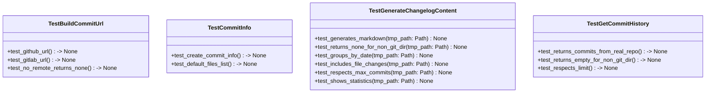

# test_changelog.py

## File Overview

This test file contains comprehensive unit tests for the changelog generation functionality. It tests the ability to extract Git commit history, format changelog content, and handle various Git repository scenarios including non-Git directories and repositories with different commit patterns.

## Classes

### TestGetCommitHistory

Tests for the [get_commit_history](../src/local_deepwiki/generators/changelog.md) function that extracts commit information from Git repositories.

**Key Methods:**
- `test_returns_commits_from_real_repo()` - Verifies that commit history can be extracted from a real Git repository

### TestBuildCommitUrl

Tests for the [build_commit_url](../src/local_deepwiki/generators/changelog.md) function that generates URLs for commits (methods not shown in provided code).

### TestGenerateChangelogContent

Tests for the [generate_changelog_content](../src/local_deepwiki/generators/changelog.md) function that creates formatted changelog output.

**Key Methods:**
- `test_generates_markdown()` - Tests markdown format generation
- `test_returns_none_for_non_git_dir()` - Verifies proper handling of non-Git directories
- `test_groups_by_date()` - Tests that commits are organized by date
- `test_includes_file_changes()` - Verifies that changed files are included in output
- `test_respects_max_commits()` - Tests commit limit functionality
- `test_shows_statistics()` - Tests inclusion of repository statistics

### TestCommitInfo

Tests for the [CommitInfo](../src/local_deepwiki/generators/changelog.md) dataclass that represents individual commit information.

**Key Methods:**
- `test_create_commit_info()` - Tests creation and properties of [CommitInfo](../src/local_deepwiki/generators/changelog.md) objects

## Functions

### test_returns_none_for_non_git_dir

```python
def test_returns_none_for_non_git_dir(self, tmp_path: Path) -> None
```

Tests that the [generate_changelog_content](../src/local_deepwiki/generators/changelog.md) function returns `None` when called on a directory that is not a Git repository.

**Parameters:**
- `tmp_path` (Path) - Temporary directory path for testing

### test_groups_by_date

```python
def test_groups_by_date(self, tmp_path: Path) -> None
```

Verifies that commits are properly grouped by date in the changelog output.

**Parameters:**
- `tmp_path` (Path) - Temporary directory path for testing

### test_includes_file_changes

```python
def test_includes_file_changes(self, tmp_path: Path) -> None
```

Tests that changed files are included in the changelog output for each commit.

**Parameters:**
- `tmp_path` (Path) - Temporary directory path for testing

### test_shows_statistics

```python
def test_shows_statistics(self, tmp_path: Path) -> None
```

Verifies that repository statistics are included in the generated changelog.

**Parameters:**
- `tmp_path` (Path) - Temporary directory path for testing

### test_create_commit_info

```python
def test_create_commit_info(self) -> None
```

Tests the creation and property access of [CommitInfo](../src/local_deepwiki/generators/changelog.md) objects with sample data including hash, author, date, message, and files.

## Usage Examples

### Testing CommitInfo Creation

```python
commit = CommitInfo(
    hash="abc1234",
    full_hash="abc1234567890",
    author="Test Author",
    date=datetime(2026, 1, 13, 10, 30, 0),
    message="Test commit",
    files=["file1.py", "file2.py"],
)

assert commit.hash == "abc1234"
assert commit.author == "Test Author"
assert len(commit.files) == 2
```

### Testing Non-Git Directory Handling

```python
content = generate_changelog_content(tmp_path)
assert content is None
```

## Related Components

This test file works with several components from the [main](../src/local_deepwiki/export/html.md) codebase:

- **[GitRepoInfo](../src/local_deepwiki/core/git_utils.md)** - Git repository information handling
- **[CommitInfo](../src/local_deepwiki/generators/changelog.md)** - Dataclass representing commit data
- **[build_commit_url](../src/local_deepwiki/generators/changelog.md)** - Function for generating commit URLs
- **[generate_changelog_content](../src/local_deepwiki/generators/changelog.md)** - Main changelog generation function
- **[get_commit_history](../src/local_deepwiki/generators/changelog.md)** - Function for extracting Git commit history

The tests use `subprocess` to interact with Git commands and `pytest` for test framework functionality, creating temporary Git repositories to test various scenarios.

## API Reference

### class `TestGetCommitHistory`

Tests for [get_commit_history](../src/local_deepwiki/generators/changelog.md) function.

**Methods:**

#### `test_returns_commits_from_real_repo`

```python
def test_returns_commits_from_real_repo(tmp_path: Path) -> None
```

Test getting commit history from a real git repo.


| [Parameter](../src/local_deepwiki/generators/api_docs.md) | Type | Default | Description |
|-----------|------|---------|-------------|
| `tmp_path` | `Path` | - | - |

#### `test_returns_empty_for_non_git_dir`

```python
def test_returns_empty_for_non_git_dir(tmp_path: Path) -> None
```

Test returns empty list for non-git directory.


| [Parameter](../src/local_deepwiki/generators/api_docs.md) | Type | Default | Description |
|-----------|------|---------|-------------|
| `tmp_path` | `Path` | - | - |

#### `test_respects_limit`

```python
def test_respects_limit(tmp_path: Path) -> None
```

Test that limit parameter is respected.


| [Parameter](../src/local_deepwiki/generators/api_docs.md) | Type | Default | Description |
|-----------|------|---------|-------------|
| `tmp_path` | `Path` | - | - |


### class `TestBuildCommitUrl`

Tests for [build_commit_url](../src/local_deepwiki/generators/changelog.md) function.

**Methods:**

#### `test_github_url`

```python
def test_github_url() -> None
```

Test building GitHub commit URL.

#### `test_gitlab_url`

```python
def test_gitlab_url() -> None
```

Test building GitLab commit URL.

#### `test_no_remote_returns_none`

```python
def test_no_remote_returns_none() -> None
```

Test returns None when no remote configured.


### class `TestGenerateChangelogContent`

Tests for [generate_changelog_content](../src/local_deepwiki/generators/changelog.md) function.

**Methods:**

#### `test_generates_markdown`

```python
def test_generates_markdown(tmp_path: Path) -> None
```

Test generates valid markdown content.


| [Parameter](../src/local_deepwiki/generators/api_docs.md) | Type | Default | Description |
|-----------|------|---------|-------------|
| `tmp_path` | `Path` | - | - |

#### `test_returns_none_for_non_git_dir`

```python
def test_returns_none_for_non_git_dir(tmp_path: Path) -> None
```

Test returns None for non-git directory.


| [Parameter](../src/local_deepwiki/generators/api_docs.md) | Type | Default | Description |
|-----------|------|---------|-------------|
| `tmp_path` | `Path` | - | - |

#### `test_groups_by_date`

```python
def test_groups_by_date(tmp_path: Path) -> None
```

Test commits are grouped by date.


| [Parameter](../src/local_deepwiki/generators/api_docs.md) | Type | Default | Description |
|-----------|------|---------|-------------|
| `tmp_path` | `Path` | - | - |

#### `test_includes_file_changes`

```python
def test_includes_file_changes(tmp_path: Path) -> None
```

Test includes changed files in output.


| [Parameter](../src/local_deepwiki/generators/api_docs.md) | Type | Default | Description |
|-----------|------|---------|-------------|
| `tmp_path` | `Path` | - | - |

#### `test_respects_max_commits`

```python
def test_respects_max_commits(tmp_path: Path) -> None
```

Test max_commits parameter limits output.


| [Parameter](../src/local_deepwiki/generators/api_docs.md) | Type | Default | Description |
|-----------|------|---------|-------------|
| `tmp_path` | `Path` | - | - |

#### `test_shows_statistics`

```python
def test_shows_statistics(tmp_path: Path) -> None
```

Test includes statistics section.


| [Parameter](../src/local_deepwiki/generators/api_docs.md) | Type | Default | Description |
|-----------|------|---------|-------------|
| `tmp_path` | `Path` | - | - |


### class `TestCommitInfo`

Tests for [CommitInfo](../src/local_deepwiki/generators/changelog.md) dataclass.

**Methods:**

#### `test_create_commit_info`

```python
def test_create_commit_info() -> None
```

Test creating [CommitInfo](../src/local_deepwiki/generators/changelog.md) object.

#### `test_default_files_list`

```python
def test_default_files_list() -> None
```

Test that files defaults to empty list.


## Class Diagram



## Call Graph

```mermaid
flowchart TD
    N0[CommitInfo]
    N1[GitRepoInfo]
    N2[TestBuildCommitUrl.test_git...]
    N3[TestBuildCommitUrl.test_git...]
    N4[TestBuildCommitUrl.test_no_...]
    N5[TestCommitInfo.test_create_...]
    N6[TestCommitInfo.test_default...]
    N7[TestGenerateChangelogConten...]
    N8[TestGenerateChangelogConten...]
    N9[TestGenerateChangelogConten...]
    N10[TestGenerateChangelogConten...]
    N11[TestGenerateChangelogConten...]
    N12[TestGenerateChangelogConten...]
    N13[TestGetCommitHistory.test_r...]
    N14[TestGetCommitHistory.test_r...]
    N15[TestGetCommitHistory.test_r...]
    N16[build_commit_url]
    N17[datetime]
    N18[generate_changelog_content]
    N19[get_commit_history]
    N20[now]
    N21[run]
    N22[write_text]
    N14 --> N21
    N14 --> N22
    N14 --> N19
    N15 --> N19
    N13 --> N21
    N13 --> N22
    N13 --> N19
    N2 --> N1
    N2 --> N16
    N3 --> N1
    N3 --> N16
    N4 --> N1
    N4 --> N16
    N7 --> N21
    N7 --> N22
    N7 --> N18
    N11 --> N18
    N8 --> N21
    N8 --> N22
    N8 --> N18
    N9 --> N21
    N9 --> N22
    N9 --> N18
    N10 --> N21
    N10 --> N22
    N10 --> N18
    N12 --> N21
    N12 --> N22
    N12 --> N18
    N5 --> N0
    N5 --> N17
    N6 --> N0
    N6 --> N20
    classDef func fill:#e1f5fe
    class N0,N1,N16,N17,N18,N19,N20,N21,N22 func
    classDef method fill:#fff3e0
    class N2,N3,N4,N5,N6,N7,N8,N9,N10,N11,N12,N13,N14,N15 method
```



## Relevant Source Files

- `tests/test_changelog.py:18-96`
