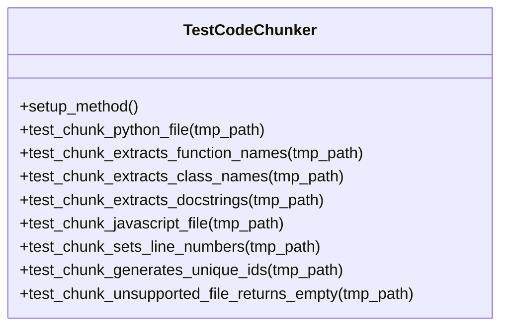

# test_chunker.py

## File Overview

This file contains comprehensive unit tests for the [CodeChunker](../src/local_deepwiki/core/chunker.md) class, testing its ability to parse and chunk various types of code files into structured components. The tests verify functionality for Python and JavaScript files, ensuring proper extraction of functions, classes, docstrings, and metadata.

## Classes

### TestCodeChunker

A test class that contains all unit tests for the [CodeChunker](../src/local_deepwiki/core/chunker.md) functionality. This class uses pytest fixtures and temporary file handling to test code chunking operations in isolation.

**Methods:**
- `setup_method()` - Initializes a fresh [CodeChunker](../src/local_deepwiki/core/chunker.md) instance for each test
- `test_chunk_python_file()` - Tests basic Python file chunking functionality
- `test_chunk_extracts_function_names()` - Verifies function name extraction from Python code
- `test_chunk_extracts_class_names()` - Verifies class name extraction from Python code
- `test_chunk_extracts_docstrings()` - Tests docstring extraction from functions
- `test_chunk_javascript_file()` - Tests JavaScript file chunking capabilities
- `test_chunk_sets_line_numbers()` - Verifies correct line number tracking
- `test_chunk_generates_unique_ids()` - Tests unique ID generation for chunks
- `test_chunk_unsupported_file_returns_empty()` - Tests handling of unsupported file types

## Key Test Methods

### setup_method

```python
def setup_method(self):
    """Set up test fixtures."""
    self.chunker = CodeChunker()
```

Initializes a new [CodeChunker](../src/local_deepwiki/core/chunker.md) instance before each test method runs.

### test_chunk_python_file

Tests the core functionality of chunking Python files. Creates a temporary Python file with various code elements (imports, functions, classes, docstrings) and verifies that the chunker can process it correctly.

### test_chunk_extracts_function_names

Verifies that the chunker correctly identifies and extracts function names from Python code. Tests with multiple functions and checks that all function names are captured in the resulting chunks.

### test_chunk_extracts_class_names

Tests class name extraction by creating Python code with multiple class definitions and verifying that all class names are properly identified and stored in the chunks.

### test_chunk_extracts_docstrings

Ensures that docstrings are properly extracted and associated with their corresponding functions. Tests that docstring content is preserved and accessible in the chunk data.

### test_chunk_javascript_file

Tests the chunker's ability to process JavaScript files, including functions, classes, and imports. Verifies that the chunker can handle different language syntaxes.

### test_chunk_sets_line_numbers

Validates that line numbers are correctly tracked and assigned to chunks, ensuring proper source code location tracking.

### test_chunk_unsupported_file_returns_empty

Tests the chunker's behavior when processing unsupported file types (like plain text files), ensuring it returns empty results rather than failing.

## Usage Examples

### Basic Test Setup

```python
# Each test method automatically gets a fresh chunker instance
def test_example(self, tmp_path):
    # Create test file
    test_file = tmp_path / "example.py"
    test_file.write_text("def hello(): pass")
    
    # Chunk the file
    chunks = list(self.chunker.chunk_file(test_file, tmp_path))
```

### Testing Function Extraction

```python
# Verify function chunks are created
function_chunks = [c for c in chunks if c.chunk_type == ChunkType.FUNCTION]
function_names = {c.name for c in function_chunks}
assert "function_name" in function_names
```

### Testing Class Extraction

```python
# Verify class chunks are created
class_chunks = [c for c in chunks if c.chunk_type == ChunkType.CLASS]
class_names = {c.name for c in class_chunks}
assert "ClassName" in class_names
```

## Related Components

- **[CodeChunker](../src/local_deepwiki/core/chunker.md)**: The [main](../src/local_deepwiki/export/html.md) class being tested, imported from `local_deepwiki.core.chunker`
- **[ChunkType](../src/local_deepwiki/models.md)**: Enumeration used to categorize different types of code chunks
- **[Language](../src/local_deepwiki/models.md)**: Enumeration for supported programming languages
- **Path**: Used for file path handling in tests
- **pytest**: Testing framework providing fixtures and assertions

## Test Dependencies

The tests rely on:
- `pathlib.Path` for file system operations
- `pytest` for test framework functionality and the `tmp_path` fixture
- The chunker module and its associated models for the actual functionality being tested

## API Reference

### class `TestCodeChunker`

Test suite for [CodeChunker](../src/local_deepwiki/core/chunker.md).

**Methods:**

#### `setup_method`

```python
def setup_method()
```

Set up test fixtures.

#### `test_chunk_python_file`

```python
def test_chunk_python_file(tmp_path)
```

Test chunking a Python file.


| [Parameter](../src/local_deepwiki/generators/api_docs.md) | Type | Default | Description |
|-----------|------|---------|-------------|
| `tmp_path` | - | - | - |

#### `test_chunk_extracts_function_names`

```python
def test_chunk_extracts_function_names(tmp_path)
```

Test that function names are extracted.


| [Parameter](../src/local_deepwiki/generators/api_docs.md) | Type | Default | Description |
|-----------|------|---------|-------------|
| `tmp_path` | - | - | - |

#### `test_chunk_extracts_class_names`

```python
def test_chunk_extracts_class_names(tmp_path)
```

Test that class names are extracted.


| [Parameter](../src/local_deepwiki/generators/api_docs.md) | Type | Default | Description |
|-----------|------|---------|-------------|
| `tmp_path` | - | - | - |

#### `test_chunk_extracts_docstrings`

```python
def test_chunk_extracts_docstrings(tmp_path)
```

Test that docstrings are extracted.


| [Parameter](../src/local_deepwiki/generators/api_docs.md) | Type | Default | Description |
|-----------|------|---------|-------------|
| `tmp_path` | - | - | - |

#### `test_chunk_javascript_file`

```python
def test_chunk_javascript_file(tmp_path)
```

Test chunking a JavaScript file.


| [Parameter](../src/local_deepwiki/generators/api_docs.md) | Type | Default | Description |
|-----------|------|---------|-------------|
| `tmp_path` | - | - | - |

#### `test_chunk_sets_line_numbers`

```python
def test_chunk_sets_line_numbers(tmp_path)
```

Test that line numbers are set correctly.


| [Parameter](../src/local_deepwiki/generators/api_docs.md) | Type | Default | Description |
|-----------|------|---------|-------------|
| `tmp_path` | - | - | - |

#### `test_chunk_generates_unique_ids`

```python
def test_chunk_generates_unique_ids(tmp_path)
```

Test that chunk IDs are unique.


| [Parameter](../src/local_deepwiki/generators/api_docs.md) | Type | Default | Description |
|-----------|------|---------|-------------|
| `tmp_path` | - | - | - |

#### `test_chunk_unsupported_file_returns_empty`

```python
def test_chunk_unsupported_file_returns_empty(tmp_path)
```

Test that unsupported files return no chunks.


| [Parameter](../src/local_deepwiki/generators/api_docs.md) | Type | Default | Description |
|-----------|------|---------|-------------|
| `tmp_path` | - | - | - |


## Class Diagram



## Call Graph

```mermaid
flowchart TD
    N0[CodeChunker]
    N1[TestCodeChunker.setup_method]
    N2[TestCodeChunker.test_chunk_...]
    N3[TestCodeChunker.test_chunk_...]
    N4[TestCodeChunker.test_chunk_...]
    N5[TestCodeChunker.test_chunk_...]
    N6[TestCodeChunker.test_chunk_...]
    N7[TestCodeChunker.test_chunk_...]
    N8[TestCodeChunker.test_chunk_...]
    N9[TestCodeChunker.test_chunk_...]
    N10[chunk_file]
    N11[write_text]
    N1 --> N0
    N7 --> N11
    N7 --> N10
    N4 --> N11
    N4 --> N10
    N2 --> N11
    N2 --> N10
    N3 --> N11
    N3 --> N10
    N6 --> N11
    N6 --> N10
    N8 --> N11
    N8 --> N10
    N5 --> N11
    N5 --> N10
    N9 --> N11
    N9 --> N10
    classDef func fill:#e1f5fe
    class N0,N10,N11 func
    classDef method fill:#fff3e0
    class N1,N2,N3,N4,N5,N6,N7,N8,N9 method
```



## Relevant Source Files

- `tests/test_chunker.py:11-182`

## See Also

- [chunker](../src/local_deepwiki/core/chunker.md) - dependency
- [models](../src/local_deepwiki/models.md) - dependency
- [test_api_docs](test_api_docs.md) - shares 3 dependencies
- [test_parser](test_parser.md) - shares 3 dependencies
- [callgraph](../src/local_deepwiki/generators/callgraph.md) - shares 3 dependencies
