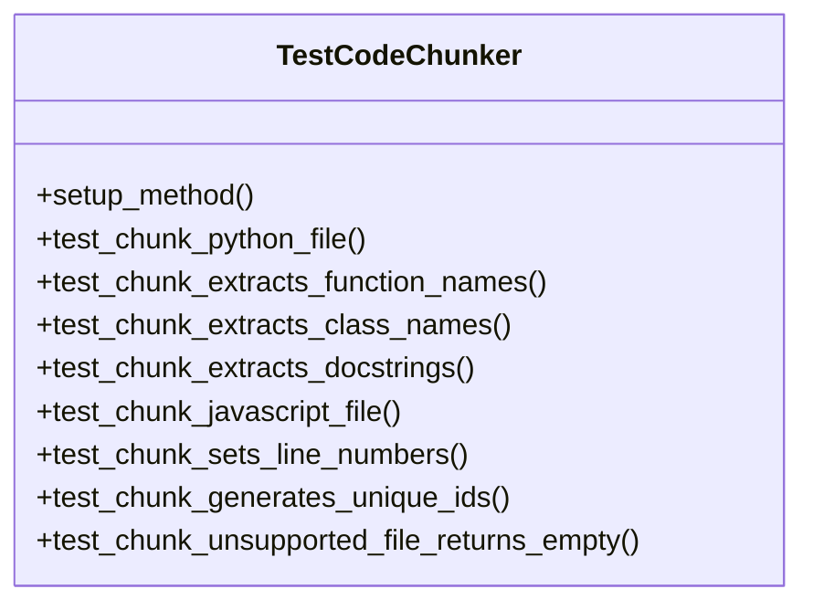

# File Overview

This file contains tests for the [`CodeChunker`](../src/local_deepwiki/core/chunker.md) class, which is responsible for breaking down code files into logical chunks such as functions, classes, and modules. The tests cover various scenarios including chunking Python and JavaScript files, extracting names and docstrings, setting line numbers, and ensuring unique IDs for chunks.

# Classes

## TestCodeChunker

The TestCodeChunker class contains a suite of tests to verify the functionality of the [CodeChunker](../src/local_deepwiki/core/chunker.md) class. It includes methods to test different aspects of code chunking, such as handling different file types, extracting metadata like function and class names, and ensuring correct line number assignments.

### Methods

- **setup_method**: Initializes a [CodeChunker](../src/local_deepwiki/core/chunker.md) instance for each test.
- **test_chunk_python_file**: Tests chunking a Python file and verifies that the resulting chunks are correctly formed.
- **test_chunk_extracts_function_names**: Tests that function names are correctly extracted from a Python file.
- **test_chunk_extracts_class_names**: Tests that class names are correctly extracted from a Python file.
- **test_chunk_extracts_docstrings**: Tests that docstrings are correctly extracted from functions.
- **test_chunk_javascript_file**: Tests chunking a JavaScript file and verifies the resulting chunks.
- **test_chunk_sets_line_numbers**: Tests that line numbers are correctly assigned to chunks.
- **test_chunk_generates_unique_ids**: Tests that each chunk is assigned a unique ID.
- **test_chunk_unsupported_file_returns_empty**: Tests that unsupported file types return no chunks.

# Functions

## setup_method

Initializes a [`CodeChunker`](../src/local_deepwiki/core/chunker.md) instance for each test method in the class.

**Parameters**: None

**Returns**: None

## test_chunk_python_file

Tests chunking a Python file and verifies that the resulting chunks are correctly formed.

**Parameters**: 
- `tmp_path`: A temporary directory path provided by pytest for test file creation.

**Returns**: None

## test_chunk_extracts_function_names

Tests that function names are correctly extracted from a Python file.

**Parameters**: 
- `tmp_path`: A temporary directory path provided by pytest for test file creation.

**Returns**: None

## test_chunk_extracts_class_names

Tests that class names are correctly extracted from a Python file.

**Parameters**: 
- `tmp_path`: A temporary directory path provided by pytest for test file creation.

**Returns**: None

## test_chunk_extracts_docstrings

Tests that docstrings are correctly extracted from functions in a Python file.

**Parameters**: 
- `tmp_path`: A temporary directory path provided by pytest for test file creation.

**Returns**: None

## test_chunk_javascript_file

Tests chunking a JavaScript file and verifies the resulting chunks.

**Parameters**: 
- `tmp_path`: A temporary directory path provided by pytest for test file creation.

**Returns**: None

## test_chunk_sets_line_numbers

Tests that line numbers are correctly assigned to chunks in a Python file.

**Parameters**: 
- `tmp_path`: A temporary directory path provided by pytest for test file creation.

**Returns**: None

## test_chunk_generates_unique_ids

Tests that each chunk is assigned a unique ID.

**Parameters**: 
- `tmp_path`: A temporary directory path provided by pytest for test file creation.

**Returns**: None

## test_chunk_unsupported_file_returns_empty

Tests that unsupported file types return no chunks.

**Parameters**: 
- `tmp_path`: A temporary directory path provided by pytest for test file creation.

**Returns**: None

# Usage Examples

To run the tests in this file, use pytest:

```bash
pytest tests/test_chunker.py
```

Each test method creates a temporary file with specific code content and then calls the `chunk_file` method of the [`CodeChunker`](../src/local_deepwiki/core/chunker.md) instance to generate chunks. The tests assert various properties of the resulting chunks, such as their type, name, docstring, line numbers, and uniqueness of IDs.

# Related Components

This file works with the following components:

- **[CodeChunker](../src/local_deepwiki/core/chunker.md)**: The [main](../src/local_deepwiki/web/app.md) class being tested, which performs the actual chunking of code files.
- **[ChunkType](../src/local_deepwiki/models.md)**: An enum that defines the types of chunks that can be generated (e.g., FUNCTION, CLASS).
- **[Language](../src/local_deepwiki/models.md)**: An enum that specifies the programming language of the code being chunked.

## API Reference

### class `TestCodeChunker`

Test suite for [CodeChunker](../src/local_deepwiki/core/chunker.md).

**Methods:**

#### `setup_method`

```python
def setup_method()
```

Set up test fixtures.

#### `test_chunk_python_file`

```python
def test_chunk_python_file(tmp_path)
```

Test chunking a Python file.


| [Parameter](../src/local_deepwiki/generators/api_docs.md) | Type | Default | Description |
|-----------|------|---------|-------------|
| `tmp_path` | - | - | - |

#### `test_chunk_extracts_function_names`

```python
def test_chunk_extracts_function_names(tmp_path)
```

Test that function names are extracted.


| [Parameter](../src/local_deepwiki/generators/api_docs.md) | Type | Default | Description |
|-----------|------|---------|-------------|
| `tmp_path` | - | - | - |

#### `test_chunk_extracts_class_names`

```python
def test_chunk_extracts_class_names(tmp_path)
```

Test that class names are extracted.


| [Parameter](../src/local_deepwiki/generators/api_docs.md) | Type | Default | Description |
|-----------|------|---------|-------------|
| `tmp_path` | - | - | - |

#### `test_chunk_extracts_docstrings`

```python
def test_chunk_extracts_docstrings(tmp_path)
```

Test that docstrings are extracted.


| [Parameter](../src/local_deepwiki/generators/api_docs.md) | Type | Default | Description |
|-----------|------|---------|-------------|
| `tmp_path` | - | - | - |

#### `test_chunk_javascript_file`

```python
def test_chunk_javascript_file(tmp_path)
```

Test chunking a JavaScript file.


| [Parameter](../src/local_deepwiki/generators/api_docs.md) | Type | Default | Description |
|-----------|------|---------|-------------|
| `tmp_path` | - | - | - |

#### `test_chunk_sets_line_numbers`

```python
def test_chunk_sets_line_numbers(tmp_path)
```

Test that line numbers are set correctly.


| [Parameter](../src/local_deepwiki/generators/api_docs.md) | Type | Default | Description |
|-----------|------|---------|-------------|
| `tmp_path` | - | - | - |

#### `test_chunk_generates_unique_ids`

```python
def test_chunk_generates_unique_ids(tmp_path)
```

Test that chunk IDs are unique.


| [Parameter](../src/local_deepwiki/generators/api_docs.md) | Type | Default | Description |
|-----------|------|---------|-------------|
| `tmp_path` | - | - | - |

#### `test_chunk_unsupported_file_returns_empty`

```python
def test_chunk_unsupported_file_returns_empty(tmp_path)
```

Test that unsupported files return no chunks.


| [Parameter](../src/local_deepwiki/generators/api_docs.md) | Type | Default | Description |
|-----------|------|---------|-------------|
| `tmp_path` | - | - | - |


## Class Diagram



## Call Graph

```mermaid
flowchart TD
    N0[CodeChunker]
    N1[TestCodeChunker.setup_method]
    N2[TestCodeChunker.test_chunk_...]
    N3[TestCodeChunker.test_chunk_...]
    N4[TestCodeChunker.test_chunk_...]
    N5[TestCodeChunker.test_chunk_...]
    N6[TestCodeChunker.test_chunk_...]
    N7[TestCodeChunker.test_chunk_...]
    N8[TestCodeChunker.test_chunk_...]
    N9[TestCodeChunker.test_chunk_...]
    N10[chunk_file]
    N11[write_text]
    N1 --> N0
    N7 --> N11
    N7 --> N10
    N4 --> N11
    N4 --> N10
    N2 --> N11
    N2 --> N10
    N3 --> N11
    N3 --> N10
    N6 --> N11
    N6 --> N10
    N8 --> N11
    N8 --> N10
    N5 --> N11
    N5 --> N10
    N9 --> N11
    N9 --> N10
    classDef func fill:#e1f5fe
    class N0,N10,N11 func
    classDef method fill:#fff3e0
    class N1,N2,N3,N4,N5,N6,N7,N8,N9 method
```



## Relevant Source Files

- `tests/test_chunker.py`

## See Also

- [models](../src/local_deepwiki/models.md) - dependency
- [chunker](../src/local_deepwiki/core/chunker.md) - dependency
- [api_docs](../src/local_deepwiki/generators/api_docs.md) - shares 3 dependencies
- [test_api_docs](test_api_docs.md) - shares 3 dependencies
