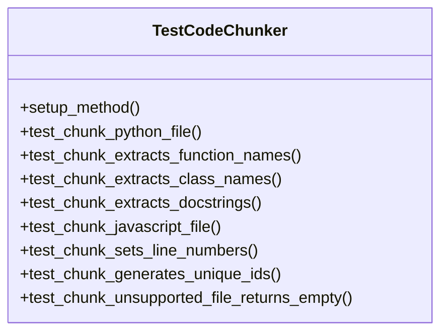

# File Overview

This file, `tests/test_chunker.py`, contains unit tests for the [CodeChunker](../src/local_deepwiki/core/chunker.md) class. It verifies that the chunker correctly identifies and extracts code elements such as functions, classes, and docstrings from source files, while also ensuring that unsupported file types return empty results.

The tests cover various programming languages including Python and JavaScript, confirming that the chunker properly handles different syntax and structures. This file ensures the reliability and correctness of the chunking functionality in the local_deepwiki.core.chunker module.

## Related Components

This test file works with the [CodeChunker](../src/local_deepwiki/core/chunker.md) class to validate its behavior, and relies on [ChunkType](../src/local_deepwiki/models.md) and [Language](../src/local_deepwiki/models.md) enums from the local_deepwiki.models module. It also uses pytest for testing infrastructure and pathlib for file path handling.

# Classes

## TestCodeChunker

The TestCodeChunker class contains a suite of unit tests that validate the functionality of the [CodeChunker](../src/local_deepwiki/core/chunker.md) class. These tests ensure that code elements are properly identified, named, and structured when processing source files.

### Key Methods

- `setup_method`: Initializes a [CodeChunker](../src/local_deepwiki/core/chunker.md) instance for each test
- `test_chunk_python_file`: Tests chunking of Python source files
- `test_chunk_extracts_function_names`: Verifies function names are correctly extracted
- `test_chunk_extracts_class_names`: Verifies class names are correctly extracted
- `test_chunk_extracts_docstrings`: Ensures docstrings are properly captured
- `test_chunk_javascript_file`: Tests chunking of JavaScript source files
- `test_chunk_sets_line_numbers`: Validates line number assignment
- `test_chunk_generates_unique_ids`: Confirms unique chunk IDs are generated
- `test_chunk_unsupported_file_returns_empty`: Tests handling of unsupported file types

# Functions

## setup_method

Initializes a [CodeChunker](../src/local_deepwiki/core/chunker.md) instance for each test in the TestCodeChunker class.

Parameters:
- None

Returns:
- None

## test_chunk_python_file

Tests the chunking of Python source files, verifying that functions, classes, and docstrings are properly extracted.

Parameters:
- tmp_path: pytest fixture providing a temporary directory path

Returns:
- None

## test_chunk_extracts_function_names

Tests that function names are correctly extracted from source code.

Parameters:
- tmp_path: pytest fixture providing a temporary directory path

Returns:
- None

## test_chunk_extracts_class_names

Tests that class names are correctly extracted from source code.

Parameters:
- tmp_path: pytest fixture providing a temporary directory path

Returns:
- None

## test_chunk_extracts_docstrings

Tests that docstrings are properly extracted and preserved.

Parameters:
- tmp_path: pytest fixture providing a temporary directory path

Returns:
- None

## test_chunk_javascript_file

Tests the chunking of JavaScript source files, verifying that functions and classes are properly extracted.

Parameters:
- tmp_path: pytest fixture providing a temporary directory path

Returns:
- None

## test_chunk_sets_line_numbers

Tests that line numbers are correctly assigned to chunked code elements.

Parameters:
- tmp_path: pytest fixture providing a temporary directory path

Returns:
- None

## test_chunk_generates_unique_ids

Tests that each chunk receives a unique identifier.

Parameters:
- tmp_path: pytest fixture providing a temporary directory path

Returns:
- None

## test_chunk_unsupported_file_returns_empty

Tests that unsupported file types return no chunks.

Parameters:
- tmp_path: pytest fixture providing a temporary directory path

Returns:
- None

# Usage Examples

To run the tests in this file, use pytest:

```bash
pytest tests/test_chunker.py
```

Example of testing a Python file chunking:

```python
def test_chunk_python_file(self, tmp_path):
    code = '''def hello(name: str) -> str:
    """Say hello to someone."""
    return f"Hello, {name}!"
'''
    test_file = tmp_path / "test.py"
    test_file.write_text(code)

    chunks = list(self.chunker.chunk_file(test_file, tmp_path))
    # Verify that chunks were created and contain expected elements
    assert len(chunks) > 0
    assert chunks[0].chunk_type == ChunkType.FUNCTION
    assert chunks[0].name == "hello"
    assert chunks[0].docstring == "Say hello to someone."
```

Example of testing JavaScript chunking:

```python
def test_chunk_javascript_file(self, tmp_path):
    code = '''
function processData(data) {
    return data.map(x => x * 2);
}
'''
    test_file = tmp_path / "test.js"
    test_file.write_text(code)

    chunks = list(self.chunker.chunk_file(test_file, tmp_path))
    # Verify that at least module and function chunks are created
    assert len(chunks) >= 2
```

Example of testing unsupported file type handling:

```python
def test_chunk_unsupported_file_returns_empty(self, tmp_path):
    test_file = tmp_path / "test.txt"
    test_file.write_text("Just some text")

    chunks = list(self.chunker.chunk_file(test_file, tmp_path))
    assert len(chunks) == 0
```

## API Reference

### class `TestCodeChunker`

Test suite for [CodeChunker](../src/local_deepwiki/core/chunker.md).

**Methods:**

#### `setup_method`

```python
def setup_method()
```

Set up test fixtures.

#### `test_chunk_python_file`

```python
def test_chunk_python_file(tmp_path)
```

Test chunking a Python file.


| [Parameter](../src/local_deepwiki/generators/api_docs.md) | Type | Default | Description |
|-----------|------|---------|-------------|
| `tmp_path` | - | - | - |

#### `test_chunk_extracts_function_names`

```python
def test_chunk_extracts_function_names(tmp_path)
```

Test that function names are extracted.


| [Parameter](../src/local_deepwiki/generators/api_docs.md) | Type | Default | Description |
|-----------|------|---------|-------------|
| `tmp_path` | - | - | - |

#### `test_chunk_extracts_class_names`

```python
def test_chunk_extracts_class_names(tmp_path)
```

Test that class names are extracted.


| [Parameter](../src/local_deepwiki/generators/api_docs.md) | Type | Default | Description |
|-----------|------|---------|-------------|
| `tmp_path` | - | - | - |

#### `test_chunk_extracts_docstrings`

```python
def test_chunk_extracts_docstrings(tmp_path)
```

Test that docstrings are extracted.


| [Parameter](../src/local_deepwiki/generators/api_docs.md) | Type | Default | Description |
|-----------|------|---------|-------------|
| `tmp_path` | - | - | - |

#### `test_chunk_javascript_file`

```python
def test_chunk_javascript_file(tmp_path)
```

Test chunking a JavaScript file.


| [Parameter](../src/local_deepwiki/generators/api_docs.md) | Type | Default | Description |
|-----------|------|---------|-------------|
| `tmp_path` | - | - | - |

#### `test_chunk_sets_line_numbers`

```python
def test_chunk_sets_line_numbers(tmp_path)
```

Test that line numbers are set correctly.


| [Parameter](../src/local_deepwiki/generators/api_docs.md) | Type | Default | Description |
|-----------|------|---------|-------------|
| `tmp_path` | - | - | - |

#### `test_chunk_generates_unique_ids`

```python
def test_chunk_generates_unique_ids(tmp_path)
```

Test that chunk IDs are unique.


| [Parameter](../src/local_deepwiki/generators/api_docs.md) | Type | Default | Description |
|-----------|------|---------|-------------|
| `tmp_path` | - | - | - |

#### `test_chunk_unsupported_file_returns_empty`

```python
def test_chunk_unsupported_file_returns_empty(tmp_path)
```

Test that unsupported files return no chunks.


| [Parameter](../src/local_deepwiki/generators/api_docs.md) | Type | Default | Description |
|-----------|------|---------|-------------|
| `tmp_path` | - | - | - |


## Class Diagram



## Call Graph

```mermaid
flowchart TD
    N0[CodeChunker]
    N1[TestCodeChunker.setup_method]
    N2[TestCodeChunker.test_chunk_...]
    N3[TestCodeChunker.test_chunk_...]
    N4[TestCodeChunker.test_chunk_...]
    N5[TestCodeChunker.test_chunk_...]
    N6[TestCodeChunker.test_chunk_...]
    N7[TestCodeChunker.test_chunk_...]
    N8[TestCodeChunker.test_chunk_...]
    N9[TestCodeChunker.test_chunk_...]
    N10[chunk_file]
    N11[write_text]
    N1 --> N0
    N7 --> N11
    N7 --> N10
    N4 --> N11
    N4 --> N10
    N2 --> N11
    N2 --> N10
    N3 --> N11
    N3 --> N10
    N6 --> N11
    N6 --> N10
    N8 --> N11
    N8 --> N10
    N5 --> N11
    N5 --> N10
    N9 --> N11
    N9 --> N10
    classDef func fill:#e1f5fe
    class N0,N10,N11 func
    classDef method fill:#fff3e0
    class N1,N2,N3,N4,N5,N6,N7,N8,N9 method
```



## See Also

- [chunker](../src/local_deepwiki/core/chunker.md) - dependency
- [models](../src/local_deepwiki/models.md) - dependency
- [api_docs](../src/local_deepwiki/generators/api_docs.md) - shares 3 dependencies
- [test_api_docs](test_api_docs.md) - shares 3 dependencies
