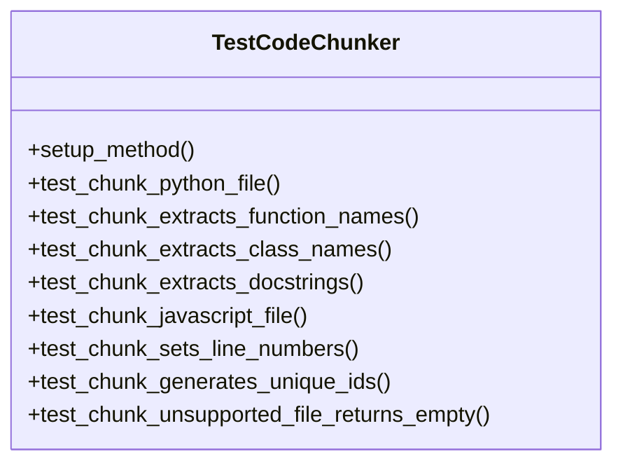

# File: `tests/test_chunker.py`

## File Overview

This file contains unit tests for the `CodeChunker` class, which is responsible for breaking down code files into logical chunks (e.g., functions, classes, modules) for further processing. The tests ensure that the chunker correctly identifies and extracts different elements from code files, supports multiple programming languages, and handles edge cases such as unsupported file types.

## Dependencies

This file imports the following modules:

```python
from pathlib import Path
import pytest
from local_deepwiki.core.chunker import CodeChunker
from local_deepwiki.models import ChunkType, Language
```

## Classes

### `TestCodeChunker`

A test class that groups all unit tests related to the `CodeChunker` functionality.

#### Methods

- **`setup_method(self)`**
  - **Purpose**: Initializes the `CodeChunker` instance before each test method.
  - **Usage**: Automatically called by pytest before each test method.

- **`test_chunk_python_file(self, tmp_path)`**
  - **Purpose**: Tests that a Python file is correctly chunked into functions, classes, and modules.
  - **Parameters**:
    - `tmp_path`: A pytest fixture providing a temporary directory path.
  - **Usage**:
    ```python
    def test_chunk_python_file(self, tmp_path):
        # Creates a Python file with functions and classes, then checks that chunks are generated.
    ```

- **`test_chunk_extracts_function_names(self, tmp_path)`**
  - **Purpose**: Verifies that function names are correctly extracted from Python code.
  - **Parameters**:
    - `tmp_path`: A pytest fixture providing a temporary directory path.
  - **Usage**:
    ```python
    def test_chunk_extracts_function_names(self, tmp_path):
        # Creates a Python file with functions, then checks that function names are in the chunks.
    ```

- **`test_chunk_extracts_class_names(self, tmp_path)`**
  - **Purpose**: Verifies that class names are correctly extracted from Python code.
  - **Parameters**:
    - `tmp_path`: A pytest fixture providing a temporary directory path.
  - **Usage**:
    ```python
    def test_chunk_extracts_class_names(self, tmp_path):
        # Creates a Python file with classes, then checks that class names are in the chunks.
    ```

- **`test_chunk_extracts_docstrings(self, tmp_path)`**
  - **Purpose**: Ensures that docstrings are correctly extracted from functions.
  - **Parameters**:
    - `tmp_path`: A pytest fixture providing a temporary directory path.
  - **Usage**:
    ```python
    def test_chunk_extracts_docstrings(self, tmp_path):
        # Creates a Python file with a function containing a docstring, then checks that the docstring is extracted.
    ```

- **`test_chunk_javascript_file(self, tmp_path)`**
  - **Purpose**: Tests that JavaScript files are correctly chunked.
  - **Parameters**:
    - `tmp_path`: A pytest fixture providing a temporary directory path.
  - **Usage**:
    ```python
    def test_chunk_javascript_file(self, tmp_path):
        # Creates a JavaScript file with functions and classes, then checks that chunks are generated.
    ```

- **`test_chunk_sets_line_numbers(self, tmp_path)`**
  - **Purpose**: Verifies that line numbers are correctly set for chunks.
  - **Parameters**:
    - `tmp_path`: A pytest fixture providing a temporary directory path.
  - **Usage**:
    ```python
    def test_chunk_sets_line_numbers(self, tmp_path):
        # Creates a Python file with known line numbers, then checks that start and end lines are set correctly.
    ```

- **`test_chunk_generates_unique_ids(self, tmp_path)`**
  - **Purpose**: Ensures that each chunk has a unique ID.
  - **Parameters**:
    - `tmp_path`: A pytest fixture providing a temporary directory path.
  - **Usage**:
    ```python
    def test_chunk_generates_unique_ids(self, tmp_path):
        # Creates a Python file with multiple functions, then checks that all chunk IDs are unique.
    ```

- **`test_chunk_unsupported_file_returns_empty(self, tmp_path)`**
  - **Purpose**: Ensures that unsupported file types (e.g., `.txt`) return no chunks.
  - **Parameters**:
    - `tmp_path`: A pytest fixture providing a temporary directory path.
  - **Usage**:
    ```python
    def test_chunk_unsupported_file_returns_empty(self, tmp_path):
        # Creates a `.txt` file, then checks that no chunks are generated.
    ```

## Usage Examples

### Running the Tests

To run all tests in this file, use the following command:

```bash
pytest tests/test_chunker.py
```

### Example Test Run

```python
def test_chunk_python_file(self, tmp_path):
    code = '''def hello():
    """Say hello."""
    return "Hello, world!"
'''
    test_file = tmp_path / "test.py"
    test_file.write_text(code)

    chunks = list(self.chunker.chunk_file(test_file, tmp_path))
    assert len(chunks) > 0
    assert chunks[0].chunk_type == ChunkType.FUNCTION
    assert chunks[0].name == "hello"
    assert chunks[0].docstring == "Say hello."
```

This example creates a Python file with a function, then asserts that the chunker correctly identifies and extracts the function with its docstring.

## Notes

- All tests use the `tmp_path` pytest fixture to create temporary files.
- The `CodeChunker` class is expected to support Python and JavaScript files.
- Tests validate both the content of chunks (names, docstrings) and metadata (line numbers, IDs).
- Unsupported file types (e.g., `.txt`) should return no chunks.

## Class Diagram



## See Also

- [models](../src/local_deepwiki/models.md) - dependency
- [chunker](../src/local_deepwiki/core/chunker.md) - dependency
- [test_parser](test_parser.md) - shares 3 dependencies
- [indexer](../src/local_deepwiki/core/indexer.md) - shares 3 dependencies
- [test_search](test_search.md) - shares 3 dependencies
