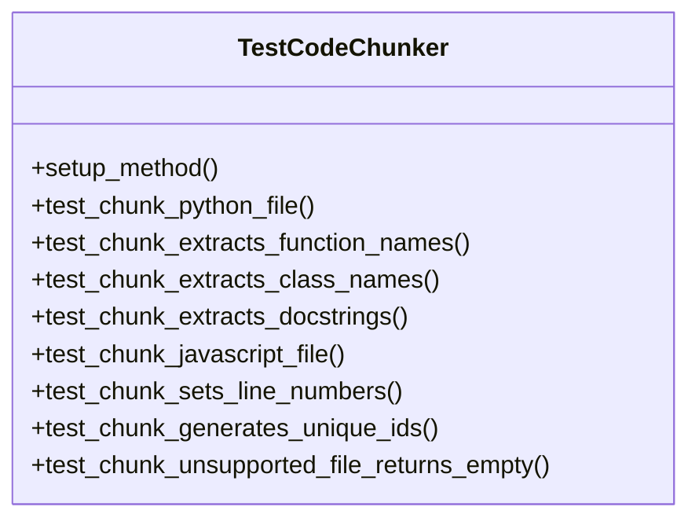

# File Overview

This file, `tests/test_chunker.py`, contains unit tests for the [CodeChunker](../src/local_deepwiki/core/chunker.md) class. It verifies that the chunker correctly identifies and extracts code elements (functions, classes, modules) from source files, including their names, docstrings, line numbers, and unique identifiers. The tests cover various programming languages and edge cases to ensure the chunker behaves as expected.

The tests in this file are designed to validate the functionality of the [CodeChunker](../src/local_deepwiki/core/chunker.md) class, which is responsible for breaking down source code files into logical chunks for further processing. This file is part of the local_deepwiki core testing suite and ensures that code chunking logic works correctly across different file types and code structures.

# Classes

## TestCodeChunker

The TestCodeChunker class contains a suite of unit tests for the [CodeChunker](../src/local_deepwiki/core/chunker.md) class. It uses pytest fixtures and methods to set up test environments and validate chunker behavior.

### Key Methods

- **setup_method**: Initializes a [CodeChunker](../src/local_deepwiki/core/chunker.md) instance for each test method
- **test_chunk_python_file**: Tests chunking of Python files
- **test_chunk_extracts_function_names**: Verifies function name extraction
- **test_chunk_extracts_class_names**: Verifies class name extraction
- **test_chunk_extracts_docstrings**: Tests docstring extraction
- **test_chunk_javascript_file**: Tests chunking of JavaScript files
- **test_chunk_sets_line_numbers**: Validates line number assignment
- **test_chunk_generates_unique_ids**: Ensures chunk IDs are unique
- **test_chunk_unsupported_file_returns_empty**: Tests behavior with unsupported file types

# Functions

## setup_method

Initializes the [CodeChunker](../src/local_deepwiki/core/chunker.md) instance used by all test methods in the class.

**Parameters**: None

**Returns**: None

## test_chunk_python_file

Tests that a Python file is correctly chunked into modules, functions, and classes.

**Parameters**:
- tmp_path: pytest fixture providing a temporary directory

**Returns**: None

**Example**:
```python
# This test creates a Python file with a module docstring, imports, a function, and a class
# and verifies that the chunker correctly identifies each component.
```

## test_chunk_extracts_function_names

Verifies that function names are correctly extracted from code chunks.

**Parameters**:
- tmp_path: pytest fixture providing a temporary directory

**Returns**: None

## test_chunk_extracts_class_names

Verifies that class names are correctly extracted from code chunks.

**Parameters**:
- tmp_path: pytest fixture providing a temporary directory

**Returns**: None

## test_chunk_extracts_docstrings

Tests that docstrings are correctly extracted from functions and classes.

**Parameters**:
- tmp_path: pytest fixture providing a temporary directory

**Returns**: None

## test_chunk_javascript_file

Tests chunking of JavaScript files.

**Parameters**:
- tmp_path: pytest fixture providing a temporary directory

**Returns**: None

## test_chunk_sets_line_numbers

Verifies that line numbers are correctly assigned to code chunks.

**Parameters**:
- tmp_path: pytest fixture providing a temporary directory

**Returns**: None

## test_chunk_generates_unique_ids

Ensures that each chunk generated has a unique identifier.

**Parameters**:
- tmp_path: pytest fixture providing a temporary directory

**Returns**: None

## test_chunk_unsupported_file_returns_empty

Tests that unsupported file types return no chunks.

**Parameters**:
- tmp_path: pytest fixture providing a temporary directory

**Returns**: None

# Usage Examples

To run the tests in this file, use pytest:

```bash
pytest tests/test_chunker.py
```

Example of a typical test structure:

```python
def test_chunk_python_file(self, tmp_path):
    code = '''def hello():
    """Say hello."""
    return "Hello"
'''
    test_file = tmp_path / "test.py"
    test_file.write_text(code)
    
    chunks = list(self.chunker.chunk_file(test_file, tmp_path))
    # Assertions would verify chunk properties
```

# Related Components

This test file works with the [CodeChunker](../src/local_deepwiki/core/chunker.md) class, which is responsible for breaking down source code files into logical chunks. The tests validate that [CodeChunker](../src/local_deepwiki/core/chunker.md) correctly handles different programming languages and code structures. The chunker uses [ChunkType](../src/local_deepwiki/models.md) and [Language](../src/local_deepwiki/models.md) enums from the models module to categorize and identify code elements. The tests ensure that the chunker integrates properly with the rest of the local_deepwiki system for processing source code.

## API Reference

### class `TestCodeChunker`

Test suite for [CodeChunker](../src/local_deepwiki/core/chunker.md).

**Methods:**

#### `setup_method`

```python
def setup_method()
```

Set up test fixtures.

#### `test_chunk_python_file`

```python
def test_chunk_python_file(tmp_path)
```

Test chunking a Python file.


| [Parameter](../src/local_deepwiki/generators/api_docs.md) | Type | Default | Description |
|-----------|------|---------|-------------|
| `tmp_path` | - | - | - |

#### `test_chunk_extracts_function_names`

```python
def test_chunk_extracts_function_names(tmp_path)
```

Test that function names are extracted.


| [Parameter](../src/local_deepwiki/generators/api_docs.md) | Type | Default | Description |
|-----------|------|---------|-------------|
| `tmp_path` | - | - | - |

#### `test_chunk_extracts_class_names`

```python
def test_chunk_extracts_class_names(tmp_path)
```

Test that class names are extracted.


| [Parameter](../src/local_deepwiki/generators/api_docs.md) | Type | Default | Description |
|-----------|------|---------|-------------|
| `tmp_path` | - | - | - |

#### `test_chunk_extracts_docstrings`

```python
def test_chunk_extracts_docstrings(tmp_path)
```

Test that docstrings are extracted.


| [Parameter](../src/local_deepwiki/generators/api_docs.md) | Type | Default | Description |
|-----------|------|---------|-------------|
| `tmp_path` | - | - | - |

#### `test_chunk_javascript_file`

```python
def test_chunk_javascript_file(tmp_path)
```

Test chunking a JavaScript file.


| [Parameter](../src/local_deepwiki/generators/api_docs.md) | Type | Default | Description |
|-----------|------|---------|-------------|
| `tmp_path` | - | - | - |

#### `test_chunk_sets_line_numbers`

```python
def test_chunk_sets_line_numbers(tmp_path)
```

Test that line numbers are set correctly.


| [Parameter](../src/local_deepwiki/generators/api_docs.md) | Type | Default | Description |
|-----------|------|---------|-------------|
| `tmp_path` | - | - | - |

#### `test_chunk_generates_unique_ids`

```python
def test_chunk_generates_unique_ids(tmp_path)
```

Test that chunk IDs are unique.


| [Parameter](../src/local_deepwiki/generators/api_docs.md) | Type | Default | Description |
|-----------|------|---------|-------------|
| `tmp_path` | - | - | - |

#### `test_chunk_unsupported_file_returns_empty`

```python
def test_chunk_unsupported_file_returns_empty(tmp_path)
```

Test that unsupported files return no chunks.


| [Parameter](../src/local_deepwiki/generators/api_docs.md) | Type | Default | Description |
|-----------|------|---------|-------------|
| `tmp_path` | - | - | - |


## Class Diagram



## Call Graph

```mermaid
flowchart TD
    N0[CodeChunker]
    N1[TestCodeChunker.setup_method]
    N2[TestCodeChunker.test_chunk_...]
    N3[TestCodeChunker.test_chunk_...]
    N4[TestCodeChunker.test_chunk_...]
    N5[TestCodeChunker.test_chunk_...]
    N6[TestCodeChunker.test_chunk_...]
    N7[TestCodeChunker.test_chunk_...]
    N8[TestCodeChunker.test_chunk_...]
    N9[TestCodeChunker.test_chunk_...]
    N10[chunk_file]
    N11[write_text]
    N1 --> N0
    N7 --> N11
    N7 --> N10
    N4 --> N11
    N4 --> N10
    N2 --> N11
    N2 --> N10
    N3 --> N11
    N3 --> N10
    N6 --> N11
    N6 --> N10
    N8 --> N11
    N8 --> N10
    N5 --> N11
    N5 --> N10
    N9 --> N11
    N9 --> N10
    classDef func fill:#e1f5fe
    class N0,N10,N11 func
    classDef method fill:#fff3e0
    class N1,N2,N3,N4,N5,N6,N7,N8,N9 method
```



## See Also

- [chunker](../src/local_deepwiki/core/chunker.md) - dependency
- [models](../src/local_deepwiki/models.md) - dependency
- [api_docs](../src/local_deepwiki/generators/api_docs.md) - shares 3 dependencies
- [test_api_docs](test_api_docs.md) - shares 3 dependencies
