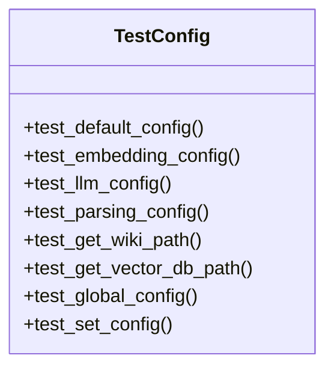

# Test Configuration File Documentation

## File Overview

This file contains the test suite for the configuration system of the local_deepwiki application. It verifies that the `Config` class and related functions behave correctly with default values and specific configurations.

## Classes

### `TestConfig`

**Purpose**:
Test suite for validating the `Config` class functionality and default configuration values.

**Key Methods**:
- `test_default_config()`: Validates default configuration values
- `test_embedding_config()`: Tests embedding-specific configuration settings

## Functions

### `get_config()`
**Parameters**: None
**Return Value**: Current configuration instance
**Purpose**: Retrieves the current configuration instance

### `set_config()`
**Parameters**: `config` (Config instance)
**Return Value**: None
**Purpose**: Sets the global configuration instance

## Usage Examples

### Basic Configuration Testing
```python
# Test default configuration
def test_default_config(self):
    config = Config()
    assert config.embedding.provider == "local"
    assert config.llm.provider == "ollama"
    assert "python" in config.parsing.languages
    assert config.chunking.max_chunk_tokens == 512
```

### Embedding Configuration Testing
```python
# Test embedding-specific settings
def test_embedding_config(self):
    config = Config()
    assert config.embedding.local.model == "all-MiniLM-L6-v2"
    assert config.embedding.openai.model == "text-embedding-3-small"
```

## Dependencies

This file imports:
- `pathlib.Path` - For path manipulation
- `pytest` - Testing framework
- `local_deepwiki.config.Config` - Main configuration class
- `local_deepwiki.config.get_config` - Function to retrieve config
- `local_deepwiki.config.set_config` - Function to set config

The tests validate the configuration system's default values and ensure proper initialization of various configuration components including embedding providers, LLM providers, parsing languages, and chunking settings.

## Class Diagram



## See Also

- [config](../src/local_deepwiki/config.md) - dependency
- [test_chunker](test_chunker.md) - shares 2 dependencies
- [chunker](../src/local_deepwiki/core/chunker.md) - shares 2 dependencies
- [test_parser](test_parser.md) - shares 2 dependencies
