# test_config.py

## File Overview

This file contains comprehensive test suites for the configuration system of the local_deepwiki package. It validates default configuration values, provider-specific settings, global configuration management, thread safety, and prompt configurations across different LLM providers.

## Classes

### TestConfig

The [main](../src/local_deepwiki/web/app.md) test class that validates core configuration functionality and default values.

**Key Methods:**
- `test_default_config` - Verifies default configuration values including embedding provider, LLM provider, parsing languages, and chunking settings
- `test_embedding_config` - Tests embedding configuration settings
- `test_llm_config` - Validates LLM provider configurations for Ollama, Anthropic, and OpenAI
- `test_parsing_config` - Tests parsing configuration including exclude patterns and file size limits
- `test_chunking_config` - Validates chunking configuration parameters
- `test_wiki_config` - Tests wiki-specific configuration settings
- `test_deep_research_config` - Validates deep research configuration parameters like max sub-questions and chunk limits
- `test_deep_research_config_validation` - Tests validation rules for deep research settings
- `test_get_wiki_path` - Tests wiki path generation functionality
- `test_get_vector_db_path` - Tests vector database path generation
- `test_global_config` - Validates global configuration singleton behavior
- `test_set_config` - Tests setting and retrieving global configuration

### TestThreadSafeConfig

Tests thread safety of the configuration system to ensure proper behavior in concurrent environments.

### TestConfigContext

Tests configuration context management functionality for scoped configuration changes.

### TestResearchPresets

Validates research preset functionality and configuration inheritance.

**Key Methods:**
- `test_with_preset_does_not_modify_original` - Ensures that applying presets creates new instances without modifying the original configuration

### TestProviderPrompts

Comprehensive test suite for provider-specific prompt configurations across different LLM providers.

**Key Methods:**
- `test_provider_prompts_config_has_all_fields` - Validates that provider prompt configurations contain all required fields
- `test_prompts_config_has_all_providers` - Ensures [PromptsConfig](../src/local_deepwiki/config.md) supports all LLM providers (Ollama, Anthropic, OpenAI)
- `test_default_prompts_are_different_per_provider` - Verifies that each provider has distinct default prompts
- `test_get_for_provider_ollama` - Tests prompt retrieval for Ollama provider
- `test_get_for_provider_anthropic` - Tests prompt retrieval for Anthropic provider
- `test_get_for_provider_openai` - Tests prompt retrieval for OpenAI provider
- `test_get_for_provider_unknown_defaults_to_anthropic` - Validates fallback behavior for unknown providers
- `test_config_get_prompts_uses_current_provider` - Tests that [Config](../src/local_deepwiki/config.md).get_prompts() uses the current provider setting
- `test_config_get_prompts_changes_with_provider` - Validates that prompts change when the provider is switched
- `test_wiki_system_prompts_dict_has_all_providers` - Ensures system prompts are available for all providers
- `test_research_prompts_dicts_have_all_providers` - Validates research-specific prompts for all providers
- `test_prompts_contain_essential_instructions` - Tests that prompts contain necessary instructions
- `test_custom_prompts_can_override_defaults` - Validates custom prompt override functionality

## Functions

### reset_global_config

```python
def reset_global_config():
```

A pytest fixture that resets the global configuration before and after each test to ensure test isolation.

## Usage Examples

### Testing Default Configuration

```python
def test_default_config(self):
    config = Config()
    
    assert config.embedding.provider == "local"
    assert config.llm.provider == "ollama"
    assert "python" in config.parsing.languages
    assert config.chunking.max_chunk_tokens == 512
```

### Testing LLM Provider Configuration

```python
def test_llm_config(self):
    config = Config()
    
    assert config.llm.ollama.model == "qwen3-coder:30b"
    assert config.llm.ollama.base_url == "http://localhost:11434"
    assert config.llm.anthropic.model == "claude-sonnet-4-20250514"
    assert config.llm.openai.model == "gpt-4o"
```

### Testing Global Configuration Management

```python
def test_set_config(self):
    new_config = Config()
    new_config.chunking.max_chunk_tokens = 1024
    
    set_config(new_config)
    retrieved = get_config()
    
    assert retrieved.chunking.max_chunk_tokens == 1024
```

### Testing Path Generation

```python
def test_get_wiki_path(self, tmp_path):
    config = Config()
    wiki_path = config.get_wiki_path(tmp_path)
    
    assert wiki_path == tmp_path / ".deepwiki"
```

## Related Components

This test file works with several configuration-related components:

- **[Config](../src/local_deepwiki/config.md)** - Main configuration class being tested
- **[DeepResearchConfig](../src/local_deepwiki/config.md)** - Deep research specific configuration settings
- **[ProviderPromptsConfig](../src/local_deepwiki/config.md)** - Provider-specific prompt configurations
- **[PromptsConfig](../src/local_deepwiki/config.md)** - Main prompts configuration class
- **[ResearchPreset](../src/local_deepwiki/config.md)** - Research preset definitions
- **[config_context](../src/local_deepwiki/config.md)** - Configuration context manager
- **[get_config](../src/local_deepwiki/config.md), [set_config](../src/local_deepwiki/config.md), [reset_config](../src/local_deepwiki/config.md)** - Global configuration management functions

The tests also reference various configuration constants:
- `RESEARCH_PRESETS` - Available research preset configurations
- `WIKI_SYSTEM_PROMPTS` - System prompts for wiki generation
- `RESEARCH_DECOMPOSITION_PROMPTS` - Prompts for research decomposition
- `RESEARCH_GAP_ANALYSIS_PROMPTS` - Prompts for gap analysis
- `RESEARCH_SYNTHESIS_PROMPTS` - Prompts for research synthesis

## API Reference

### class `TestConfig`

Test suite for [Config](../src/local_deepwiki/config.md).

**Methods:**

#### `test_default_config`

```python
def test_default_config()
```

Test default configuration values.

#### `test_embedding_config`

```python
def test_embedding_config()
```

Test embedding configuration.

#### `test_llm_config`

```python
def test_llm_config()
```

Test LLM configuration.

#### `test_parsing_config`

```python
def test_parsing_config()
```

Test parsing configuration.

#### `test_chunking_config`

```python
def test_chunking_config()
```

Test chunking configuration.

#### `test_wiki_config`

```python
def test_wiki_config()
```

Test wiki generation configuration.

#### `test_deep_research_config`

```python
def test_deep_research_config()
```

Test deep research configuration.

#### `test_deep_research_config_validation`

```python
def test_deep_research_config_validation()
```

Test deep research config validation bounds.

#### `test_get_wiki_path`

```python
def test_get_wiki_path(tmp_path)
```

Test wiki path generation.


| Parameter | Type | Default | Description |
|-----------|------|---------|-------------|
| `tmp_path` | - | - | - |

#### `test_get_vector_db_path`

```python
def test_get_vector_db_path(tmp_path)
```

Test vector database path generation.


| Parameter | Type | Default | Description |
|-----------|------|---------|-------------|
| `tmp_path` | - | - | - |

#### `test_global_config`

```python
def test_global_config()
```

Test global config singleton.

#### `test_set_config`

```python
def test_set_config()
```

Test setting global config.


### class `TestThreadSafeConfig`

Tests for thread-safe config access.

**Methods:**

#### `test_reset_config`

```python
def test_reset_config()
```

Test that [reset_config](../src/local_deepwiki/config.md) clears the global config.

#### `test_concurrent_get_config`

```python
def test_concurrent_get_config()
```

Test thread-safe concurrent access to [get_config](../src/local_deepwiki/config.md).

#### `get_config_thread`

```python
def get_config_thread()
```

#### `test_concurrent_set_and_get_config`

```python
def test_concurrent_set_and_get_config()
```

Test thread-safe concurrent set and get operations.

#### `modify_config`

```python
def modify_config(value: int)
```


| Parameter | Type | Default | Description |
|-----------|------|---------|-------------|
| `value` | `int` | - | - |


### class `TestConfigContext`

Tests for [config_context](../src/local_deepwiki/config.md) context manager.

**Methods:**

#### `test_config_context_overrides_global`

```python
def test_config_context_overrides_global()
```

Test that [config_context](../src/local_deepwiki/config.md) overrides global config.

#### `test_config_context_restores_on_exception`

```python
def test_config_context_restores_on_exception()
```

Test that [config_context](../src/local_deepwiki/config.md) restores config even on exception.

#### `test_nested_config_context`

```python
def test_nested_config_context()
```

Test nested [config_context](../src/local_deepwiki/config.md) calls.

#### `test_config_context_yields_config`

```python
def test_config_context_yields_config()
```

Test that [config_context](../src/local_deepwiki/config.md) yields the provided config.


### class `TestResearchPresets`

Tests for research preset functionality.

**Methods:**

#### `test_research_preset_enum_values`

```python
def test_research_preset_enum_values()
```

Test [ResearchPreset](../src/local_deepwiki/config.md) enum has expected values.

#### `test_research_presets_dict_has_all_presets`

```python
def test_research_presets_dict_has_all_presets()
```

Test RESEARCH_PRESETS has all preset configurations.

#### `test_quick_preset_values`

```python
def test_quick_preset_values()
```

Test quick preset has fewer resources.

#### `test_thorough_preset_values`

```python
def test_thorough_preset_values()
```

Test thorough preset uses more resources.

#### `test_with_preset_none_returns_copy`

```python
def test_with_preset_none_returns_copy()
```

Test with_preset(None) returns unchanged copy.

#### `test_with_preset_default_returns_copy`

```python
def test_with_preset_default_returns_copy()
```

Test with_preset('default') returns unchanged copy.

#### `test_with_preset_quick_applies_values`

```python
def test_with_preset_quick_applies_values()
```

Test with_preset('quick') applies quick preset values.

#### `test_with_preset_thorough_applies_values`

```python
def test_with_preset_thorough_applies_values()
```

Test with_preset('thorough') applies thorough preset values.

#### `test_with_preset_accepts_enum`

```python
def test_with_preset_accepts_enum()
```

Test with_preset accepts [ResearchPreset](../src/local_deepwiki/config.md) enum.

#### `test_with_preset_case_insensitive`

```python
def test_with_preset_case_insensitive()
```

Test with_preset is case-insensitive for string input.

#### `test_with_preset_invalid_returns_copy`

```python
def test_with_preset_invalid_returns_copy()
```

Test with_preset with invalid string returns unchanged copy.

#### `test_with_preset_does_not_modify_original`

```python
def test_with_preset_does_not_modify_original()
```

Test with_preset does not modify the original config.


### class `TestProviderPrompts`

Tests for provider-specific prompts configuration.

**Methods:**

#### `test_provider_prompts_config_has_all_fields`

```python
def test_provider_prompts_config_has_all_fields()
```

Test [ProviderPromptsConfig](../src/local_deepwiki/config.md) has all required prompt fields.

#### `test_prompts_config_has_all_providers`

```python
def test_prompts_config_has_all_providers()
```

Test [PromptsConfig](../src/local_deepwiki/config.md) has configurations for all providers.

#### `test_default_prompts_are_different_per_provider`

```python
def test_default_prompts_are_different_per_provider()
```

Test that default prompts are optimized differently per provider.

#### `test_get_for_provider_ollama`

```python
def test_get_for_provider_ollama()
```

Test get_for_provider returns ollama prompts.

#### `test_get_for_provider_anthropic`

```python
def test_get_for_provider_anthropic()
```

Test get_for_provider returns anthropic prompts.

#### `test_get_for_provider_openai`

```python
def test_get_for_provider_openai()
```

Test get_for_provider returns openai prompts.

#### `test_get_for_provider_unknown_defaults_to_anthropic`

```python
def test_get_for_provider_unknown_defaults_to_anthropic()
```

Test get_for_provider defaults to anthropic for unknown providers.

#### `test_config_get_prompts_uses_current_provider`

```python
def test_config_get_prompts_uses_current_provider()
```

Test [Config](../src/local_deepwiki/config.md).get_prompts() returns prompts for current LLM provider.

#### `test_config_get_prompts_changes_with_provider`

```python
def test_config_get_prompts_changes_with_provider()
```

Test [Config](../src/local_deepwiki/config.md).get_prompts() changes when provider changes.

#### `test_wiki_system_prompts_dict_has_all_providers`

```python
def test_wiki_system_prompts_dict_has_all_providers()
```

Test WIKI_SYSTEM_PROMPTS has entries for all providers.

#### `test_research_prompts_dicts_have_all_providers`

```python
def test_research_prompts_dicts_have_all_providers()
```

Test all research prompt dicts have entries for all providers.

#### `test_prompts_contain_essential_instructions`

```python
def test_prompts_contain_essential_instructions()
```

Test that prompts contain essential instructions.

#### `test_custom_prompts_can_override_defaults`

```python
def test_custom_prompts_can_override_defaults()
```

Test that custom prompts can be provided via config.


---

### Functions

#### `reset_global_config`

`@pytest.fixture(autouse=True)`

```python
def reset_global_config()
```

Reset global config before and after each test.


## Class Diagram

```mermaid
classDiagram
    class TestConfig {
        +test_default_config()
        +test_embedding_config()
        +test_llm_config()
        +test_parsing_config()
        +test_chunking_config()
        +test_wiki_config()
        +test_deep_research_config()
        +test_deep_research_config_validation()
        +test_get_wiki_path(tmp_path)
        +test_get_vector_db_path(tmp_path)
        +test_global_config()
        +test_set_config()
    }
    class TestConfigContext {
        +test_config_context_overrides_global()
        +test_config_context_restores_on_exception()
        +test_nested_config_context()
        +test_config_context_yields_config()
    }
    class TestProviderPrompts {
        +test_provider_prompts_config_has_all_fields()
        +test_prompts_config_has_all_providers()
        +test_default_prompts_are_different_per_provider()
        +test_get_for_provider_ollama()
        +test_get_for_provider_anthropic()
        +test_get_for_provider_openai()
        +test_get_for_provider_unknown_defaults_to_anthropic()
        +test_config_get_prompts_uses_current_provider()
        +test_config_get_prompts_changes_with_provider()
        +test_wiki_system_prompts_dict_has_all_providers()
        +test_research_prompts_dicts_have_all_providers()
        +test_prompts_contain_essential_instructions()
        +test_custom_prompts_can_override_defaults()
    }
    class TestResearchPresets {
        +test_research_preset_enum_values()
        +test_research_presets_dict_has_all_presets()
        +test_quick_preset_values()
        +test_thorough_preset_values()
        +test_with_preset_none_returns_copy()
        +test_with_preset_default_returns_copy()
        +test_with_preset_quick_applies_values()
        +test_with_preset_thorough_applies_values()
        +test_with_preset_accepts_enum()
        +test_with_preset_case_insensitive()
        +test_with_preset_invalid_returns_copy()
        +test_with_preset_does_not_modify_original()
    }
    class TestThreadSafeConfig {
        +test_reset_config()
        +test_concurrent_get_config()
        +get_config_thread()
        +test_concurrent_set_and_get_config()
        +modify_config()
    }
```



## Call Graph


## Relevant Source Files

- [`tests/test_config.py:35-151`](https://github.com/UrbanDiver/local-deepwiki-mcp/blob/main/tests/test_config.py#L35-L151)

## See Also

- [test_indexer](test_indexer.md) - shares 3 dependencies
- [test_api_docs](test_api_docs.md) - shares 2 dependencies
