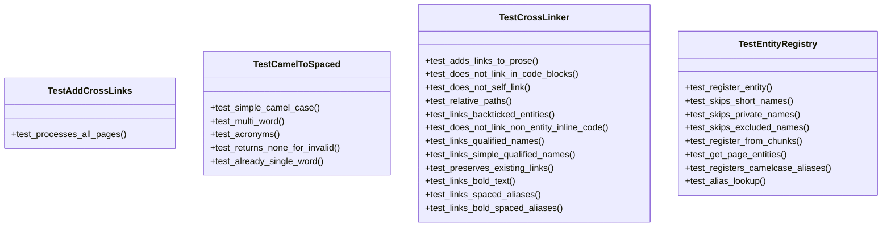

# Test Cross Links Module

## Overview

This module contains comprehensive tests for the cross-linking functionality in the local_deepwiki system. It tests the [CrossLinker](../src/local_deepwiki/generators/crosslinks.md) class and related components that automatically add links between wiki pages when entity names are mentioned.

## Test Classes

### TestCrossLinker

The primary test class that validates the [CrossLinker](../src/local_deepwiki/generators/crosslinks.md) functionality across various scenarios:

#### Key Test Methods

**test_adds_links_to_prose**
- Tests that entity names mentioned in prose text are automatically converted to links
- Verifies basic cross-linking functionality between wiki pages

**test_does_not_link_in_code_blocks**
- Ensures that entity names within code blocks (triple backtick blocks) are not converted to links
- Preserves code integrity by avoiding unwanted link insertion

**test_does_not_self_link**
- Verifies that entities are not linked when mentioned on their own wiki page
- Prevents circular self-references in documentation

**test_relative_paths**
- Tests the calculation of relative paths between different wiki pages
- Ensures proper navigation links between documentation files

**test_links_backticked_entities**
- Tests that entity names enclosed in backticks are converted to links
- Handles inline code mentions of entities

**test_does_not_link_non_entity_inline_code**
- Ensures that inline code that doesn't reference registered entities remains unchanged
- Preserves non-entity code snippets

**test_links_qualified_names**
- Tests linking of fully qualified names like `module.ClassName`
- Handles complex entity references with module prefixes

**test_links_simple_qualified_names**
- Tests linking of simple qualified names like [`generators.WikiGenerator`](../src/local_deepwiki/generators/wiki.md)
- Handles shorter qualified entity references

**test_preserves_existing_links**
- Ensures that existing markdown links are not modified or replaced
- Maintains manual link formatting when present

**test_links_bold_text**
- Tests that bold entity names (using `**text**`) are converted to links
- Handles emphasized entity mentions

**test_links_spaced_aliases**
- Tests linking of spaced versions of camelCase entity names
- Converts names like "Vector Store" to link to VectorStore entity

**test_links_bold_spaced_aliases**
- Tests that bold, spaced aliases are properly linked
- Combines bold formatting with spaced alias recognition

### TestAddCrossLinks

Tests the top-level [add_cross_links](../src/local_deepwiki/generators/crosslinks.md) function that processes multiple wiki pages.

**test_processes_all_pages**
- Verifies that the cross-linking process handles multiple pages correctly
- Tests batch processing of wiki page collections

## Usage Example

```python
from local_deepwiki.generators.crosslinks import CrossLinker, EntityRegistry
from local_deepwiki.models import ChunkType, WikiPage

# Create entity registry
registry = EntityRegistry()
registry.register_entity(
    name="VectorStore",
    entity_type=ChunkType.CLASS,
    wiki_path="files/vectorstore.md",
    file_path="vectorstore.py",
)

# Create cross-linker
linker = CrossLinker(registry)

# Process a wiki page
page = WikiPage(
    path="files/indexer.md",
    title="Indexer",
    content="The indexer uses VectorStore to store embeddings.",
    generated_at=0,
)

# Add cross-links
result = linker.add_links(page)
```

## Related Components

This test module works with several core components:

- **[CrossLinker](../src/local_deepwiki/generators/crosslinks.md)**: The [main](../src/local_deepwiki/web/app.md) class responsible for adding cross-links to wiki pages
- **[EntityRegistry](../src/local_deepwiki/generators/crosslinks.md)**: Maintains a registry of code entities that can be linked
- **[WikiPage](../src/local_deepwiki/models.md)**: Represents individual wiki pages in the documentation system
- **[ChunkType](../src/local_deepwiki/models.md)**: Enumeration of different code entity types (CLASS, FUNCTION, etc.)
- **[add_cross_links](../src/local_deepwiki/generators/crosslinks.md)**: Top-level function for batch processing multiple pages
- **[camel_to_spaced](../src/local_deepwiki/generators/crosslinks.md)**: Utility function for converting camelCase names to spaced versions

The tests verify that the cross-linking system correctly identifies entity mentions across different contexts while preserving code blocks, existing links, and other markdown formatting.

## API Reference

### class `TestCamelToSpaced`

Tests for [camel_to_spaced](../src/local_deepwiki/generators/crosslinks.md) function.

**Methods:**

#### `test_simple_camel_case`

```python
def test_simple_camel_case()
```

Test simple CamelCase conversion.

#### `test_multi_word`

```python
def test_multi_word()
```

Test multi-word CamelCase.

#### `test_acronyms`

```python
def test_acronyms()
```

Test CamelCase with acronyms.

#### `test_returns_none_for_invalid`

```python
def test_returns_none_for_invalid()
```

Test that None is returned for non-CamelCase names.

#### `test_already_single_word`

```python
def test_already_single_word()
```

Test single capitalized word returns None.


### class `TestEntityRegistry`

Tests for [EntityRegistry](../src/local_deepwiki/generators/crosslinks.md) class.

**Methods:**

#### `test_register_entity`

```python
def test_register_entity()
```

Test registering an entity.

#### `test_skips_short_names`

```python
def test_skips_short_names()
```

Test that short names are not registered.

#### `test_skips_private_names`

```python
def test_skips_private_names()
```

Test that private names are not registered.

#### `test_skips_excluded_names`

```python
def test_skips_excluded_names()
```

Test that excluded common names are not registered.

#### `test_register_from_chunks`

```python
def test_register_from_chunks()
```

Test registering entities from code chunks.

#### `test_get_page_entities`

```python
def test_get_page_entities()
```

Test getting entities defined in a page.

#### `test_registers_camelcase_aliases`

```python
def test_registers_camelcase_aliases()
```

Test that CamelCase names get spaced aliases registered.

#### `test_alias_lookup`

```python
def test_alias_lookup()
```

Test looking up entities by alias.


### class `TestCrossLinker`

Tests for [CrossLinker](../src/local_deepwiki/generators/crosslinks.md) class.

**Methods:**

#### `test_adds_links_to_prose`

```python
def test_adds_links_to_prose()
```

Test that links are added to prose text.

#### `test_does_not_link_in_code_blocks`

```python
def test_does_not_link_in_code_blocks()
```

Test that links are not added inside code blocks.

#### `test_does_not_self_link`

```python
def test_does_not_self_link()
```

Test that entities are not linked on their own page.

#### `test_relative_paths`

```python
def test_relative_paths()
```

Test relative path calculation between pages.

#### `test_links_backticked_entities`

```python
def test_links_backticked_entities()
```

Test that backticked entity names get linked.

#### `test_does_not_link_non_entity_inline_code`

```python
def test_does_not_link_non_entity_inline_code()
```

Test that non-entity inline code is preserved unchanged.

#### `test_links_qualified_names`

```python
def test_links_qualified_names()
```

Test that qualified names like module.ClassName get linked.

#### `test_links_simple_qualified_names`

```python
def test_links_simple_qualified_names()
```

Test that simple qualified names like module.Class get linked.

#### `test_preserves_existing_links`

```python
def test_preserves_existing_links()
```

Test that existing markdown links are preserved.

#### `test_links_bold_text`

```python
def test_links_bold_text()
```

Test that bold entity names get linked.

#### `test_links_spaced_aliases`

```python
def test_links_spaced_aliases()
```

Test that spaced aliases like 'Vector Store' get linked.

#### `test_links_bold_spaced_aliases`

```python
def test_links_bold_spaced_aliases()
```

Test that bold spaced aliases get linked.


### class `TestAddCrossLinks`

Tests for [add_cross_links](../src/local_deepwiki/generators/crosslinks.md) function.

**Methods:**

#### `test_processes_all_pages`

```python
def test_processes_all_pages()
```

Test that all pages are processed.


## Class Diagram



## Call Graph


## Relevant Source Files

- `tests/test_crosslinks.py:12-42`

## See Also

- [models](../src/local_deepwiki/models.md) - dependency
- [crosslinks](../src/local_deepwiki/generators/crosslinks.md) - dependency
- [wiki](../src/local_deepwiki/generators/wiki.md) - shares 2 dependencies
