# test_deep_research.py

## File Overview

This file contains comprehensive test suites for the deep research functionality in the local_deepwiki system. It tests the DeepResearchPipeline class, related model classes, and the MCP server handler for deep research operations. The tests use pytest and mock objects to verify behavior without requiring actual dependencies.

## Classes

### TestDeepResearchResult

Tests for the [DeepResearchResult](../src/local_deepwiki/models.md) model class.

**Purpose**: Validates the creation and properties of deep research result objects.

**Key Methods**:
- `test_create_result()`: Tests creating a [DeepResearchResult](../src/local_deepwiki/models.md) instance with all required parameters and verifies the properties are set correctly.

### TestHandleDeepResearch

Tests for the MCP server handler functionality.

**Purpose**: Validates the [handle_deep_research](../src/local_deepwiki/server.md) server function behavior under various conditions.

**Key Methods**:
- `test_returns_error_for_empty_question()`: Tests that an error is returned when an empty question is provided to the handler.
- `test_returns_error_for_unindexed_repo()`: Tests error handling for repositories that haven't been indexed (implementation details not fully visible in provided code).

## Functions

Based on the code provided, the [main](../src/local_deepwiki/web/app.md) functions being tested are:

### handle_deep_research

**Parameters** (as shown in tests):
- Dictionary with keys:
  - `repo_path`: String path to the repository
  - `question`: String containing the research question

**Returns**: List of result objects with text attributes

**Usage Example**:
```python
result = await handle_deep_research({
    "repo_path": "/some/path",
    "question": "Your research question here",
})
```

## Related Components

This test file works with several components from the local_deepwiki system:

**Core Classes**:
- DeepResearchPipeline: The [main](../src/local_deepwiki/web/app.md) pipeline for conducting deep research
- ResearchCancelledError: Exception for cancelled research operations

**Model Classes**:
- [ChunkType](../src/local_deepwiki/models.md): Enumeration for different types of code chunks
- [CodeChunk](../src/local_deepwiki/models.md): Represents a chunk of code
- [DeepResearchResult](../src/local_deepwiki/models.md): Contains the results of a deep research operation
- [Language](../src/local_deepwiki/models.md): [Language](../src/local_deepwiki/models.md) enumeration
- [ResearchProgress](../src/local_deepwiki/models.md): Progress tracking for research operations
- [ResearchProgressType](../src/local_deepwiki/models.md): Types of research progress
- [ResearchStepType](../src/local_deepwiki/models.md): Types of research steps
- [SearchResult](../src/local_deepwiki/models.md): Search result objects
- [SubQuestion](../src/local_deepwiki/models.md): Sub-questions generated during research

**Provider Interfaces**:
- EmbeddingProvider: Base class for embedding providers
- LLMProvider: Base class for language model providers

**Server Components**:
- [handle_deep_research](../src/local_deepwiki/server.md): Server handler function for deep research requests

## Test Structure

The tests use standard pytest patterns with:
- Mock objects (AsyncMock, MagicMock) for isolating components
- Async test methods for testing asynchronous functionality
- Fixture-based setup (tmp_path fixture visible in one test)
- Assertion-based validation of results and error conditions

The test file focuses on both successful operations and error handling scenarios, ensuring robust behavior across different input conditions.

## API Reference

### class `MockEmbeddingProvider`

**Inherits from:** `EmbeddingProvider`

Mock embedding provider for testing.

**Methods:**

#### `__init__`

```python
def __init__(dimension: int = 384)
```


| Parameter | Type | Default | Description |
|-----------|------|---------|-------------|
| `dimension` | `int` | `384` | - |

#### `name`

```python
def name() -> str
```

#### `get_dimension`

```python
def get_dimension() -> int
```

#### `embed`

```python
async def embed(texts: list[str]) -> list[list[float]]
```


| Parameter | Type | Default | Description |
|-----------|------|---------|-------------|
| `texts` | `list[str]` | - | - |


### class `MockLLMProvider`

**Inherits from:** `LLMProvider`

Mock LLM provider for testing.

**Methods:**

#### `__init__`

```python
def __init__(responses: list[str] | None = None)
```


| Parameter | Type | Default | Description |
|-----------|------|---------|-------------|
| `responses` | `list[str] | None` | `None` | - |

#### `name`

```python
def name() -> str
```

#### `generate`

```python
async def generate(prompt: str, system_prompt: str | None = None, max_tokens: int = 4096, temperature: float = 0.7) -> str
```


| Parameter | Type | Default | Description |
|-----------|------|---------|-------------|
| `prompt` | `str` | - | - |
| `system_prompt` | `str | None` | `None` | - |
| `max_tokens` | `int` | `4096` | - |
| `temperature` | `float` | `0.7` | - |

#### `generate_stream`

```python
async def generate_stream(prompt: str, system_prompt: str | None = None, max_tokens: int = 4096, temperature: float = 0.7) -> AsyncIterator[str]
```


| Parameter | Type | Default | Description |
|-----------|------|---------|-------------|
| `prompt` | `str` | - | - |
| `system_prompt` | `str | None` | `None` | - |
| `max_tokens` | `int` | `4096` | - |
| `temperature` | `float` | `0.7` | - |


### class `TestSubQuestion`

Tests for [SubQuestion](../src/local_deepwiki/models.md) model.

**Methods:**

#### `test_create_sub_question`

```python
def test_create_sub_question()
```

Test creating a sub-question.

#### `test_repr`

```python
def test_repr()
```

Test string representation.


### class `TestDeepResearchResult`

Tests for [DeepResearchResult](../src/local_deepwiki/models.md) model.

**Methods:**

#### `test_create_result`

```python
def test_create_result()
```

Test creating a deep research result.


### class `TestDeepResearchPipelineDecomposition`

Tests for query decomposition.

**Methods:**

#### `mock_vector_store`

```python
def mock_vector_store()
```

Create a mock vector store.

#### `test_decompose_simple_question`

```python
async def test_decompose_simple_question(mock_vector_store)
```

Test decomposition of a simple question.


| Parameter | Type | Default | Description |
|-----------|------|---------|-------------|
| `mock_vector_store` | - | - | - |

#### `test_decompose_limits_sub_questions`

```python
async def test_decompose_limits_sub_questions(mock_vector_store)
```

Test that decomposition limits sub-questions to max.


| Parameter | Type | Default | Description |
|-----------|------|---------|-------------|
| `mock_vector_store` | - | - | - |

#### `test_decompose_handles_invalid_json`

```python
async def test_decompose_handles_invalid_json(mock_vector_store)
```

Test graceful handling of invalid JSON response.


| Parameter | Type | Default | Description |
|-----------|------|---------|-------------|
| `mock_vector_store` | - | - | - |

#### `test_decompose_validates_categories`

```python
async def test_decompose_validates_categories(mock_vector_store)
```

Test that invalid categories are replaced with default.


| Parameter | Type | Default | Description |
|-----------|------|---------|-------------|
| `mock_vector_store` | - | - | - |


### class `TestDeepResearchPipelineRetrieval`

Tests for parallel retrieval.

**Methods:**

#### `mock_llm`

```python
def mock_llm()
```

Create mock LLM that returns valid responses.

#### `test_parallel_retrieval_calls_search`

```python
async def test_parallel_retrieval_calls_search(mock_llm)
```

Test that parallel retrieval calls search for each sub-question.


| Parameter | Type | Default | Description |
|-----------|------|---------|-------------|
| `mock_llm` | - | - | - |

#### `test_retrieval_deduplicates_results`

```python
async def test_retrieval_deduplicates_results(mock_llm)
```

Test that duplicate chunks are deduplicated.


| Parameter | Type | Default | Description |
|-----------|------|---------|-------------|
| `mock_llm` | - | - | - |


### class `TestDeepResearchPipelineGapAnalysis`

Tests for gap analysis.

**Methods:**

#### `mock_vector_store`

```python
def mock_vector_store()
```

Create mock vector store with results.

#### `test_gap_analysis_generates_follow_ups`

```python
async def test_gap_analysis_generates_follow_ups(mock_vector_store)
```

Test that gap analysis can generate follow-up queries.


| Parameter | Type | Default | Description |
|-----------|------|---------|-------------|
| `mock_vector_store` | - | - | - |

#### `test_gap_analysis_limits_follow_ups`

```python
async def test_gap_analysis_limits_follow_ups(mock_vector_store)
```

Test that follow-up queries are limited.


| Parameter | Type | Default | Description |
|-----------|------|---------|-------------|
| `mock_vector_store` | - | - | - |


### class `TestDeepResearchPipelineSynthesis`

Tests for answer synthesis.

**Methods:**

#### `mock_vector_store`

```python
def mock_vector_store()
```

Create mock vector store.

#### `test_synthesis_includes_context`

```python
async def test_synthesis_includes_context(mock_vector_store)
```

Test that synthesis prompt includes code context.


| Parameter | Type | Default | Description |
|-----------|------|---------|-------------|
| `mock_vector_store` | - | - | - |

#### `test_synthesis_handles_no_results`

```python
async def test_synthesis_handles_no_results()
```

Test synthesis when no code is found.


### class `TestDeepResearchPipelineTracing`

Tests for reasoning trace.

**Methods:**

#### `mock_vector_store`

```python
def mock_vector_store()
```

#### `test_trace_includes_all_steps`

```python
async def test_trace_includes_all_steps(mock_vector_store)
```

Test that reasoning trace includes all steps.


| Parameter | Type | Default | Description |
|-----------|------|---------|-------------|
| `mock_vector_store` | - | - | - |

#### `test_trace_records_duration`

```python
async def test_trace_records_duration(mock_vector_store)
```

Test that each step has duration recorded.


| Parameter | Type | Default | Description |
|-----------|------|---------|-------------|
| `mock_vector_store` | - | - | - |


### class `TestDeepResearchPipelineIntegration`

Integration tests for the full pipeline.

**Methods:**

#### `test_full_pipeline_flow`

```python
async def test_full_pipeline_flow()
```

Test complete pipeline with mocked dependencies.

#### `test_pipeline_counts_llm_calls`

```python
async def test_pipeline_counts_llm_calls()
```

Test that LLM calls are counted correctly.


### class `TestHandleDeepResearch`

Tests for the MCP server handler.

**Methods:**

#### `test_returns_error_for_empty_question`

```python
async def test_returns_error_for_empty_question()
```

Test error returned for empty question.

#### `test_returns_error_for_unindexed_repo`

```python
async def test_returns_error_for_unindexed_repo(tmp_path)
```

Test error returned when repository is not indexed.


| Parameter | Type | Default | Description |
|-----------|------|---------|-------------|
| `tmp_path` | - | - | - |

#### `test_validates_max_chunks`

```python
async def test_validates_max_chunks()
```

Test that max_chunks is validated.


### class `TestDeepResearchProgress`

Tests for progress callback functionality.

**Methods:**

#### `mock_vector_store`

```python
def mock_vector_store()
```

Create a mock vector store.

#### `test_progress_callback_receives_all_steps`

```python
async def test_progress_callback_receives_all_steps(mock_vector_store)
```

Test that progress callback receives expected events.


| Parameter | Type | Default | Description |
|-----------|------|---------|-------------|
| `mock_vector_store` | - | - | - |

#### `capture`

```python
async def capture(p: ResearchProgress) -> None
```


| Parameter | Type | Default | Description |
|-----------|------|---------|-------------|
| `p` | [`ResearchProgress`](../src/local_deepwiki/models.md) | - | - |

#### `test_progress_callback_includes_sub_questions`

```python
async def test_progress_callback_includes_sub_questions(mock_vector_store)
```

Test that decomposition progress includes sub-questions.


| Parameter | Type | Default | Description |
|-----------|------|---------|-------------|
| `mock_vector_store` | - | - | - |

#### `capture`

```python
async def capture(p: ResearchProgress) -> None
```


| Parameter | Type | Default | Description |
|-----------|------|---------|-------------|
| `p` | [`ResearchProgress`](../src/local_deepwiki/models.md) | - | - |

#### `test_progress_callback_includes_chunk_counts`

```python
async def test_progress_callback_includes_chunk_counts(mock_vector_store)
```

Test that retrieval progress includes chunk counts.


| Parameter | Type | Default | Description |
|-----------|------|---------|-------------|
| `mock_vector_store` | - | - | - |

#### `capture`

```python
async def capture(p: ResearchProgress) -> None
```


| Parameter | Type | Default | Description |
|-----------|------|---------|-------------|
| `p` | [`ResearchProgress`](../src/local_deepwiki/models.md) | - | - |

#### `test_progress_callback_includes_follow_up_queries`

```python
async def test_progress_callback_includes_follow_up_queries(mock_vector_store)
```

Test that gap analysis progress includes follow-up queries.


| Parameter | Type | Default | Description |
|-----------|------|---------|-------------|
| `mock_vector_store` | - | - | - |

#### `capture`

```python
async def capture(p: ResearchProgress) -> None
```


| Parameter | Type | Default | Description |
|-----------|------|---------|-------------|
| `p` | [`ResearchProgress`](../src/local_deepwiki/models.md) | - | - |

#### `test_progress_callback_none_works`

```python
async def test_progress_callback_none_works(mock_vector_store)
```

Test that pipeline works without progress callback.


| Parameter | Type | Default | Description |
|-----------|------|---------|-------------|
| `mock_vector_store` | - | - | - |

#### `test_progress_callback_includes_duration`

```python
async def test_progress_callback_includes_duration(mock_vector_store)
```

Test that progress events include duration.


| Parameter | Type | Default | Description |
|-----------|------|---------|-------------|
| `mock_vector_store` | - | - | - |

#### `capture`

```python
async def capture(p: ResearchProgress) -> None
```


| Parameter | Type | Default | Description |
|-----------|------|---------|-------------|
| `p` | [`ResearchProgress`](../src/local_deepwiki/models.md) | - | - |

#### `test_progress_step_numbers_increase`

```python
async def test_progress_step_numbers_increase(mock_vector_store)
```

Test that step numbers increase monotonically.


| Parameter | Type | Default | Description |
|-----------|------|---------|-------------|
| `mock_vector_store` | - | - | - |

#### `capture`

```python
async def capture(p: ResearchProgress) -> None
```


| Parameter | Type | Default | Description |
|-----------|------|---------|-------------|
| `p` | [`ResearchProgress`](../src/local_deepwiki/models.md) | - | - |


### class `TestResearchCancellation`

Tests for research cancellation functionality.

**Methods:**

#### `mock_vector_store`

```python
def mock_vector_store()
```

Create a mock vector store.

#### `test_research_cancelled_error_creation`

```python
def test_research_cancelled_error_creation()
```

Test ResearchCancelledError can be created with step info.

#### `test_research_cancelled_error_default_step`

```python
def test_research_cancelled_error_default_step()
```

Test ResearchCancelledError with default step.

#### `test_cancellation_before_decomposition`

```python
async def test_cancellation_before_decomposition(mock_vector_store)
```

Test cancellation before decomposition starts.


| Parameter | Type | Default | Description |
|-----------|------|---------|-------------|
| `mock_vector_store` | - | - | - |

#### `always_cancelled`

```python
def always_cancelled() -> bool
```

#### `test_cancellation_after_decomposition`

```python
async def test_cancellation_after_decomposition(mock_vector_store)
```

Test cancellation after decomposition completes.


| Parameter | Type | Default | Description |
|-----------|------|---------|-------------|
| `mock_vector_store` | - | - | - |

#### `cancel_after_first_step`

```python
def cancel_after_first_step() -> bool
```

#### `test_cancellation_before_gap_analysis`

```python
async def test_cancellation_before_gap_analysis(mock_vector_store)
```

Test cancellation before gap analysis.


| Parameter | Type | Default | Description |
|-----------|------|---------|-------------|
| `mock_vector_store` | - | - | - |

#### `cancel_before_gap_analysis`

```python
def cancel_before_gap_analysis() -> bool
```

#### `test_cancellation_before_synthesis`

```python
async def test_cancellation_before_synthesis(mock_vector_store)
```

Test cancellation before synthesis.


| Parameter | Type | Default | Description |
|-----------|------|---------|-------------|
| `mock_vector_store` | - | - | - |

#### `cancel_before_synthesis`

```python
def cancel_before_synthesis() -> bool
```

#### `test_no_cancellation_when_check_is_none`

```python
async def test_no_cancellation_when_check_is_none(mock_vector_store)
```

Test that pipeline completes when cancellation_check is None.


| Parameter | Type | Default | Description |
|-----------|------|---------|-------------|
| `mock_vector_store` | - | - | - |

#### `test_no_cancellation_when_check_returns_false`

```python
async def test_no_cancellation_when_check_returns_false(mock_vector_store)
```

Test that pipeline completes when cancellation check returns False.


| Parameter | Type | Default | Description |
|-----------|------|---------|-------------|
| `mock_vector_store` | - | - | - |

#### `never_cancelled`

```python
def never_cancelled() -> bool
```

#### `test_cancellation_stops_llm_calls`

```python
async def test_cancellation_stops_llm_calls(mock_vector_store)
```

Test that cancellation prevents further LLM calls.


| Parameter | Type | Default | Description |
|-----------|------|---------|-------------|
| `mock_vector_store` | - | - | - |

#### `cancel_after_decomposition`

```python
def cancel_after_decomposition() -> bool
```

#### `test_cancelled_progress_type_exists`

```python
async def test_cancelled_progress_type_exists()
```

Test that CANCELLED progress type exists.


---

### Functions

#### `make_chunk`

```python
def make_chunk(id: str, file_path: str = "test.py", content: str = "test code", name: str = "test_func") -> CodeChunk
```

Create a test code chunk.


| Parameter | Type | Default | Description |
|-----------|------|---------|-------------|
| `id` | `str` | - | - |
| `file_path` | `str` | `"test.py"` | - |
| `content` | `str` | `"test code"` | - |
| `name` | `str` | `"test_func"` | - |

**Returns:** [`CodeChunk`](../src/local_deepwiki/models.md)


#### `make_search_result`

```python
def make_search_result(chunk: CodeChunk, score: float = 0.8) -> SearchResult
```

Create a test search result.


| Parameter | Type | Default | Description |
|-----------|------|---------|-------------|
| `chunk` | [`CodeChunk`](../src/local_deepwiki/models.md) | - | - |
| `score` | `float` | `0.8` | - |

**Returns:** [`SearchResult`](../src/local_deepwiki/models.md)


## Class Diagram

```mermaid
classDiagram
    class MockEmbeddingProvider {
        -_dimension
        -__init__()
        +name() -> str
        +get_dimension() -> int
        +embed() -> list[list[float]]
    }
    class MockLLMProvider {
        +responses
        +call_count
        +prompts: list[str]
        -__init__()
        +name() -> str
        +generate() -> str
        +generate_stream() -> AsyncIterator[str]
        -_stream() -> AsyncIterator[str]
    }
    class TestDeepResearchPipelineDecomposition {
        +mock_vector_store()
        +test_decompose_simple_question()
        +test_decompose_limits_sub_questions()
        +test_decompose_handles_invalid_json()
        +test_decompose_validates_categories()
    }
    class TestDeepResearchPipelineGapAnalysis {
        +mock_vector_store()
        +test_gap_analysis_generates_follow_ups()
        +test_gap_analysis_limits_follow_ups()
    }
    class TestDeepResearchPipelineIntegration {
        +test_full_pipeline_flow()
        +login()
        +connect()
        +test_pipeline_counts_llm_calls()
    }
    class TestDeepResearchPipelineRetrieval {
        +mock_llm()
        +test_parallel_retrieval_calls_search()
        +test_retrieval_deduplicates_results()
    }
    class TestDeepResearchPipelineSynthesis {
        +mock_vector_store()
        +auth()
        +test_synthesis_includes_context()
        +test_synthesis_handles_no_results()
    }
    class TestDeepResearchPipelineTracing {
        +mock_vector_store()
        +test_trace_includes_all_steps()
        +test_trace_records_duration()
    }
    class TestDeepResearchProgress {
        +mock_vector_store()
        +test_progress_callback_receives_all_steps(mock_vector_store)
        +capture(p: ResearchProgress) None
        +test_progress_callback_includes_sub_questions(mock_vector_store)
        +test_progress_callback_includes_chunk_counts(mock_vector_store)
        +test_progress_callback_includes_follow_up_queries(mock_vector_store)
        +test_progress_callback_none_works(mock_vector_store)
        +test_progress_callback_includes_duration(mock_vector_store)
        +test_progress_step_numbers_increase(mock_vector_store)
    }
    class TestDeepResearchResult {
        +test_create_result()
    }
    class TestHandleDeepResearch {
        +test_returns_error_for_empty_question()
        +test_returns_error_for_unindexed_repo()
        +test_validates_max_chunks()
    }
    class TestResearchCancellation {
        +mock_vector_store()
        +test_research_cancelled_error_creation()
        +test_research_cancelled_error_default_step()
        +test_cancellation_before_decomposition(mock_vector_store)
        +always_cancelled() bool
        +test_cancellation_after_decomposition(mock_vector_store)
        +cancel_after_first_step() bool
        +test_cancellation_before_gap_analysis(mock_vector_store)
        +cancel_before_gap_analysis() bool
        +test_cancellation_before_synthesis(mock_vector_store)
        +cancel_before_synthesis() bool
        +test_no_cancellation_when_check_is_none(mock_vector_store)
        +test_no_cancellation_when_check_returns_false(mock_vector_store)
        +never_cancelled() bool
        +test_cancellation_stops_llm_calls(mock_vector_store)
    }
    class TestSubQuestion {
        +test_create_sub_question()
        +test_repr()
    }
    MockEmbeddingProvider --|> EmbeddingProvider
    MockLLMProvider --|> LLMProvider
```



## Call Graph


## Relevant Source Files

- `tests/test_deep_research.py:27-41`
