# test_diagrams.py

## File Overview

This file contains comprehensive unit tests for the diagram generation functionality in the local_deepwiki project. It tests various diagram types including class diagrams, dependency graphs, sequence diagrams, and module overviews using pytest as the testing framework.

## Test Classes

### TestGenerateModuleOverview

Tests the [generate_module_overview](../src/local_deepwiki/generators/diagrams.md) function which creates visual representations of module structures.

**Key Test Methods:**
- `test_generates_diagram()` - Verifies that module overview diagrams are properly generated using IndexStatus data containing repository information, file counts, and language statistics

### TestGenerateClassDiagram  

Tests the [generate_class_diagram](../src/local_deepwiki/generators/diagrams.md) function for creating UML-style class diagrams from code chunks.

**Key Test Methods:**
- `test_generates_diagram_with_class()` - Tests diagram generation with a single class, using CodeChunk objects containing class definitions with methods

### TestPathToModule

Tests the _path_to_module utility function that converts file paths to module names.

**Key Test Methods:**
- `test_converts_simple_path()` - Verifies conversion of file paths like "src/mypackage/core/parser.py" to module names
- `test_skips_init_files()` - Ensures `__init__.py` files return None as expected
- `test_skips_non_python()` - Confirms non-Python files are properly filtered out

### TestGenerateSequenceDiagram

Tests the [generate_sequence_diagram](../src/local_deepwiki/generators/diagrams.md) function for creating sequence diagrams from call graphs.

**Key Test Methods:**
- `test_generates_sequence()` - Tests sequence diagram generation using call graph dictionaries that map function names to their called functions
- `test_returns_none_for_empty()` - Verifies handling of empty or invalid inputs

## Test Methods

### test_external_dependencies_shown

Tests that external dependencies are properly displayed in dependency graphs when the `show_external=True` parameter is used. Uses CodeChunk objects with import statements to verify external library visualization.

### test_external_dependencies_hidden

Tests that external dependencies are filtered out when `show_external=False` is specified, ensuring only internal project dependencies appear in the generated diagrams.

## Tested Components

The test file validates the following diagram generation functions:

- **[generate_class_diagram](../src/local_deepwiki/generators/diagrams.md)** - Creates class relationship diagrams
- **[generate_dependency_graph](../src/local_deepwiki/generators/diagrams.md)** - Generates module dependency visualizations  
- **[generate_module_overview](../src/local_deepwiki/generators/diagrams.md)** - Produces high-level module structure diagrams
- **[generate_sequence_diagram](../src/local_deepwiki/generators/diagrams.md)** - Creates sequence diagrams from call graphs
- **[generate_deep_research_sequence](../src/local_deepwiki/generators/diagrams.md)** - Generates research workflow sequences
- **[generate_indexing_sequence](../src/local_deepwiki/generators/diagrams.md)** - Creates indexing process diagrams
- **[generate_wiki_generation_sequence](../src/local_deepwiki/generators/diagrams.md)** - Visualizes wiki generation workflows
- **[generate_workflow_sequences](../src/local_deepwiki/generators/diagrams.md)** - Produces various workflow diagrams
- **[generate_language_pie_chart](../src/local_deepwiki/generators/diagrams.md)** - Creates language distribution charts

## Utility Functions Tested

- **_path_to_module** - Converts file paths to Python module names
- **_extract_class_attributes** - Extracts class attribute information
- **_extract_method_signature** - Parses method signatures from code
- **_find_circular_dependencies** - Detects circular import dependencies
- **_module_to_wiki_path** - Converts module names to wiki paths
- **_parse_external_import** - Parses external import statements
- **_parse_import_line** - Processes individual import lines
- **[sanitize_mermaid_name](../src/local_deepwiki/generators/diagrams.md)** - Sanitizes names for Mermaid diagram compatibility

## Usage Example

```python
# Example of how the tested functions work based on the test code
chunks = [
    CodeChunk(
        id="1",
        file_path="test.py", 
        content="class MyClass:\n    def method(self): pass",
        chunk_type=ChunkType.CLASS,
        language=Language.PYTHON,
        start_line=1,
        end_line=2,
        name="MyClass",
        metadata={}
    )
]

# Generate class diagram
diagram = generate_class_diagram(chunks)

# Generate dependency graph with external dependencies
dependency_diagram = generate_dependency_graph(chunks, "myproject", show_external=True)
```

## Related Components

The tests work with several data structures and enums from the local_deepwiki project:

- **CodeChunk** - Represents parsed code segments
- **ChunkType** - Enum for different code chunk types (CLASS, IMPORT, etc.)
- **Language** - Enum for programming languages  
- **IndexStatus** - Contains repository indexing information
- **FileInfo** - Represents individual file metadata
- **[ClassInfo](../src/local_deepwiki/generators/diagrams.md)** - Stores class structure information

## API Reference

### class `TestSanitizeMermaidName`

Tests for [sanitize_mermaid_name](../src/local_deepwiki/generators/diagrams.md) function.

**Methods:**

#### `test_basic_name`

```python
def test_basic_name()
```

Test basic name passes through.

#### `test_replaces_brackets`

```python
def test_replaces_brackets()
```

Test angle brackets are replaced.

#### `test_replaces_square_brackets`

```python
def test_replaces_square_brackets()
```

Test square brackets are replaced.

#### `test_replaces_dots`

```python
def test_replaces_dots()
```

Test dots are replaced.

#### `test_replaces_hyphens`

```python
def test_replaces_hyphens()
```

Test hyphens are replaced.

#### `test_replaces_colons`

```python
def test_replaces_colons()
```

Test colons are replaced.

#### `test_prefixes_digit`

```python
def test_prefixes_digit()
```

Test names starting with digits get prefixed.


### class `TestExtractClassAttributes`

Tests for _extract_class_attributes function.

**Methods:**

#### `test_extracts_type_annotations`

```python
def test_extracts_type_annotations()
```

Test extraction of class-level type annotations.

#### `test_extracts_init_assignments`

```python
def test_extracts_init_assignments()
```

Test extraction from __init__ assignments.

#### `test_marks_private_attributes`

```python
def test_marks_private_attributes()
```

Test private attributes get - prefix.


### class `TestExtractMethodSignature`

Tests for _extract_method_signature function.

**Methods:**

#### `test_extracts_return_type`

```python
def test_extracts_return_type()
```

Test extraction of return type.

#### `test_extracts_parameters`

```python
def test_extracts_parameters()
```

Test extraction of parameters.

#### `test_excludes_self`

```python
def test_excludes_self()
```

Test self parameter is excluded.

#### `test_limits_parameters`

```python
def test_limits_parameters()
```

Test long parameter lists are truncated.

#### `test_returns_none_for_invalid`

```python
def test_returns_none_for_invalid()
```

Test returns None for non-def content.


### class `TestClassInfo`

Tests for [ClassInfo](../src/local_deepwiki/generators/diagrams.md) dataclass.

**Methods:**

#### `test_basic_class_info`

```python
def test_basic_class_info()
```

Test basic [ClassInfo](../src/local_deepwiki/generators/diagrams.md) creation.

#### `test_abstract_class`

```python
def test_abstract_class()
```

Test abstract class flag.


### class `TestGenerateClassDiagram`

Tests for [generate_class_diagram](../src/local_deepwiki/generators/diagrams.md) function.

**Methods:**

#### `test_generates_diagram_with_class`

```python
def test_generates_diagram_with_class()
```

Test diagram generation with a single class.

#### `test_returns_none_for_empty_classes`

```python
def test_returns_none_for_empty_classes()
```

Test returns None when classes have no content.

#### `test_shows_inheritance`

```python
def test_shows_inheritance()
```

Test inheritance relationships are shown.

#### `test_marks_dataclass`

```python
def test_marks_dataclass()
```

Test dataclass annotation is shown.

#### `test_shows_method_visibility`

```python
def test_shows_method_visibility()
```

Test private methods are marked with -.


### class `TestGenerateDependencyGraph`

Tests for [generate_dependency_graph](../src/local_deepwiki/generators/diagrams.md) function.

**Methods:**

#### `test_generates_flowchart`

```python
def test_generates_flowchart()
```

Test basic flowchart generation.

#### `test_returns_none_for_no_imports`

```python
def test_returns_none_for_no_imports()
```

Test returns None when no imports.


### class `TestFindCircularDependencies`

Tests for _find_circular_dependencies function.

**Methods:**

#### `test_finds_direct_cycle`

```python
def test_finds_direct_cycle()
```

Test detection of A -> B -> A cycle.

#### `test_finds_longer_cycle`

```python
def test_finds_longer_cycle()
```

Test detection of A -> B -> C -> A cycle.

#### `test_no_cycle`

```python
def test_no_cycle()
```

Test no false positives for acyclic graph.


### class `TestPathToModule`

Tests for _path_to_module function.

**Methods:**

#### `test_converts_simple_path`

```python
def test_converts_simple_path()
```

Test basic path conversion.

#### `test_skips_init_files`

```python
def test_skips_init_files()
```

Test __init__.py files return None.

#### `test_skips_non_python`

```python
def test_skips_non_python()
```

Test non-Python files return None.


### class `TestParseImportLine`

Tests for _parse_import_line function.

**Methods:**

#### `test_parses_from_import`

```python
def test_parses_from_import()
```

Test from X import Y parsing.

#### `test_ignores_external`

```python
def test_ignores_external()
```

Test external imports return None.

#### `test_parses_import_statement`

```python
def test_parses_import_statement()
```

Test import X parsing.


### class `TestGenerateModuleOverview`

Tests for [generate_module_overview](../src/local_deepwiki/generators/diagrams.md) function.

**Methods:**

#### `test_generates_diagram`

```python
def test_generates_diagram()
```

Test module overview generation.

#### `test_returns_none_for_empty`

```python
def test_returns_none_for_empty()
```

Test returns None when no files.


### class `TestGenerateLanguagePieChart`

Tests for [generate_language_pie_chart](../src/local_deepwiki/generators/diagrams.md) function.

**Methods:**

#### `test_generates_pie_chart`

```python
def test_generates_pie_chart()
```

Test pie chart generation.

#### `test_returns_none_for_no_languages`

```python
def test_returns_none_for_no_languages()
```

Test returns None when no languages.


### class `TestGenerateSequenceDiagram`

Tests for [generate_sequence_diagram](../src/local_deepwiki/generators/diagrams.md) function.

**Methods:**

#### `test_generates_sequence`

```python
def test_generates_sequence()
```

Test sequence diagram generation.

#### `test_returns_none_for_empty`

```python
def test_returns_none_for_empty()
```

Test returns None for empty call graph.

#### `test_auto_selects_entry_point`

```python
def test_auto_selects_entry_point()
```

Test auto-selects entry point when not specified.


### class `TestWorkflowSequenceDiagrams`

Tests for workflow-specific sequence diagram generators.

**Methods:**

#### `test_indexing_sequence_valid_mermaid`

```python
def test_indexing_sequence_valid_mermaid()
```

Test indexing sequence generates valid Mermaid.

#### `test_indexing_sequence_shows_loop`

```python
def test_indexing_sequence_shows_loop()
```

Test indexing sequence contains loop for file batches.

#### `test_wiki_generation_sequence_valid_mermaid`

```python
def test_wiki_generation_sequence_valid_mermaid()
```

Test wiki generation sequence is valid Mermaid.

#### `test_wiki_generation_sequence_has_parallel`

```python
def test_wiki_generation_sequence_has_parallel()
```

Test wiki generation sequence contains parallel operations.

#### `test_wiki_generation_sequence_shows_phases`

```python
def test_wiki_generation_sequence_shows_phases()
```

Test wiki generation shows all generation phases.

#### `test_deep_research_sequence_valid_mermaid`

```python
def test_deep_research_sequence_valid_mermaid()
```

Test deep research sequence is valid Mermaid.

#### `test_deep_research_sequence_shows_all_steps`

```python
def test_deep_research_sequence_shows_all_steps()
```

Test deep research shows all 5 steps.

#### `test_deep_research_sequence_has_parallel`

```python
def test_deep_research_sequence_has_parallel()
```

Test deep research contains parallel operations.

#### `test_workflow_sequences_contains_all`

```python
def test_workflow_sequences_contains_all()
```

Test combined workflow has all three sequences.

#### `test_workflow_sequences_contains_all_diagrams`

```python
def test_workflow_sequences_contains_all_diagrams()
```

Test combined workflow includes all diagram content.

#### `test_all_sequences_close_mermaid_blocks`

```python
def test_all_sequences_close_mermaid_blocks()
```

Test all sequences properly close mermaid code blocks.


### class `TestEnhancedDependencyGraph`

Tests for enhanced dependency graph features.

**Methods:**

#### `test_subgraph_grouping`

```python
def test_subgraph_grouping()
```

Test modules are grouped by directory in subgraphs.

#### `test_clickable_links`

```python
def test_clickable_links()
```

Test click handlers are added when wiki_base_path provided.

#### `test_no_clickable_links_without_base_path`

```python
def test_no_clickable_links_without_base_path()
```

Test click handlers are not added when wiki_base_path is empty.

#### `test_external_dependencies_shown`

```python
def test_external_dependencies_shown()
```

Test external deps shown with different styling when enabled.

#### `test_external_dependencies_hidden`

```python
def test_external_dependencies_hidden()
```

Test external deps hidden when show_external=False.

#### `test_max_external_limit`

```python
def test_max_external_limit()
```

Test max_external limits number of external deps shown.


### class `TestParseExternalImport`

Tests for _parse_external_import function.

**Methods:**

#### `test_parses_from_import`

```python
def test_parses_from_import()
```

Test parsing 'from X import Y' style.

#### `test_parses_import_statement`

```python
def test_parses_import_statement()
```

Test parsing 'import X' style.

#### `test_parses_nested_import`

```python
def test_parses_nested_import()
```

Test parsing nested module imports.

#### `test_returns_none_for_invalid`

```python
def test_returns_none_for_invalid()
```

Test returns None for non-import lines.


### class `TestModuleToWikiPath`

Tests for _module_to_wiki_path function.

**Methods:**

#### `test_simple_module`

```python
def test_simple_module()
```

Test simple module path conversion.

#### `test_nested_module`

```python
def test_nested_module()
```

Test nested module path conversion.

#### `test_single_level_module`

```python
def test_single_level_module()
```

Test single-level module path conversion.


## Class Diagram

```mermaid
classDiagram
    class TestClassInfo {
        <<abstract>>
        +test_basic_class_info()
        +test_abstract_class()
    }
    class TestEnhancedDependencyGraph {
        +test_subgraph_grouping()
        +test_clickable_links()
        +test_no_clickable_links_without_base_path()
        +test_external_dependencies_shown()
        +test_external_dependencies_hidden()
        +test_max_external_limit()
    }
    class TestExtractClassAttributes {
        +name: str
        +count: int
        -_hidden: str
        +value
        -_private
        +test_extracts_type_annotations()
        +test_extracts_init_assignments()
        -__init__()
        +test_marks_private_attributes()
    }
    class TestExtractMethodSignature {
        +test_extracts_return_type()
        +process() -> bool
        +test_extracts_parameters()
        +test_excludes_self()
        +test_limits_parameters()
        +test_returns_none_for_invalid()
    }
    class TestFindCircularDependencies {
        +test_finds_direct_cycle()
        +test_finds_longer_cycle()
        +test_no_cycle()
    }
    class TestGenerateClassDiagram {
        <<dataclass>>
        +test_generates_diagram_with_class()
        +method()
        +test_returns_none_for_empty_classes()
        +test_shows_inheritance()
        +test_marks_dataclass()
        +test_shows_method_visibility()
        +public()
        -_private()
    }
    class TestGenerateDependencyGraph {
        +test_generates_flowchart()
        +test_returns_none_for_no_imports()
        +func()
    }
    class TestGenerateLanguagePieChart {
        +test_generates_pie_chart()
        +test_returns_none_for_no_languages()
    }
    class TestGenerateModuleOverview {
        +test_generates_diagram()
        +test_returns_none_for_empty()
    }
    class TestGenerateSequenceDiagram {
        +test_generates_sequence()
        +test_returns_none_for_empty()
        +test_auto_selects_entry_point()
    }
    class TestModuleToWikiPath {
        +test_simple_module()
        +test_nested_module()
        +test_single_level_module()
    }
    class TestParseExternalImport {
        +test_parses_from_import()
        +test_parses_import_statement()
        +test_parses_nested_import()
        +test_returns_none_for_invalid()
        +func()
    }
    class TestParseImportLine {
        +test_parses_from_import()
        +test_ignores_external()
        +test_parses_import_statement()
    }
    class TestPathToModule {
        +test_converts_simple_path()
        +test_skips_init_files()
        +test_skips_non_python()
    }
    class TestSanitizeMermaidName {
        +test_basic_name()
        +test_replaces_brackets()
        +test_replaces_square_brackets()
        +test_replaces_dots()
        +test_replaces_hyphens()
        +test_replaces_colons()
        +test_prefixes_digit()
    }
    class TestWorkflowSequenceDiagrams {
        +test_indexing_sequence_valid_mermaid()
        +test_indexing_sequence_shows_loop()
        +test_wiki_generation_sequence_valid_mermaid()
        +test_wiki_generation_sequence_has_parallel()
        +test_wiki_generation_sequence_shows_phases()
        +test_deep_research_sequence_valid_mermaid()
        +test_deep_research_sequence_shows_all_steps()
        +test_deep_research_sequence_has_parallel()
        +test_workflow_sequences_contains_all()
        +test_workflow_sequences_contains_all_diagrams()
        +test_all_sequences_close_mermaid_blocks()
    }
```



## Call Graph


## Relevant Source Files

- [`tests/test_diagrams.py:28-57`](https://github.com/UrbanDiver/local-deepwiki-mcp/blob/main/tests/test_diagrams.py#L28-L57)

## See Also

- [diagrams](../src/local_deepwiki/generators/diagrams.md) - dependency
- [crosslinks](../src/local_deepwiki/generators/crosslinks.md) - shares 2 dependencies
