# File Overview

This file contains tests for various diagram generation functions within the `local_deepwiki.generators.diagrams` module. It uses the `pytest` framework to test functionality related to generating class diagrams, dependency graphs, module overviews, language pie charts, and sequence diagrams from code chunks and import structures.

# Classes

## TestSanitizeMermaidName

Tests for the [`sanitize_mermaid_name`](../src/local_deepwiki/generators/diagrams.md) function, which ensures names used in Mermaid diagrams are valid.

## TestExtractClassAttributes

Tests for the `_extract_class_attributes` function, which extracts attributes from class definitions.

## TestExtractMethodSignature

Tests for the `_extract_method_signature` function, which extracts method signatures from code.

## TestGenerateClassDiagram

Tests for the [`generate_class_diagram`](../src/local_deepwiki/generators/diagrams.md) function, which generates a Mermaid class diagram from code chunks.

### Methods

- `test_generates_diagram_with_class`: Tests that a class diagram is generated for a single class.
- `test_generates_diagram_with_multiple_classes`: Tests that a class diagram is generated for multiple classes.
- `test_handles_inheritance`: Tests that class diagrams handle inheritance correctly.

## TestGenerateDependencyGraph

Tests for the [`generate_dependency_graph`](../src/local_deepwiki/generators/diagrams.md) function, which generates a Mermaid flowchart showing dependencies between modules.

### Methods

- `test_generates_flowchart`: Tests that a basic flowchart is generated from import chunks.
- `test_handles_circular_dependencies`: Tests that circular dependencies are handled correctly in the graph.

## TestGenerateModuleOverview

Tests for the [`generate_module_overview`](../src/local_deepwiki/generators/diagrams.md) function, which generates a Mermaid diagram summarizing the repository structure.

### Methods

- `test_generates_diagram`: Tests that a module overview diagram is generated from index status data.

## TestPathToModule

Tests for the `_path_to_module` function, which converts file paths to module names.

### Methods

- `test_converts_simple_path`: Tests basic path conversion.
- `test_skips_init_files`: Tests that `__init__.py` files return `None`.
- `test_skips_non_python`: Tests that non-Python files return `None`.

## TestGenerateSequenceDiagram

Tests for the [`generate_sequence_diagram`](../src/local_deepwiki/generators/diagrams.md) function, which generates a Mermaid sequence diagram from a call graph.

### Methods

- `test_generates_sequence`: Tests that a sequence diagram is generated from a call graph.
- `test_returns_none_for_empty_call_graph`: Tests that `None` is returned for an empty call graph.

# Functions

## sanitize_mermaid_name

Sanitizes a name to make it valid for use in Mermaid diagrams.

- **Parameters**: 
  - `name` (str): The name to sanitize.
- **Returns**: 
  - `str`: A sanitized version of the name.

## generate_class_diagram

Generates a Mermaid class diagram from a list of code chunks.

- **Parameters**: 
  - `chunks` (list[CodeChunk]): List of code chunks to process.
- **Returns**: 
  - `str`: The Mermaid diagram string.

## generate_dependency_graph

Generates a Mermaid flowchart showing dependencies between modules.

- **Parameters**: 
  - `chunks` (list[CodeChunk]): List of code chunks to analyze.
- **Returns**: 
  - `str`: The Mermaid flowchart string.

## generate_module_overview

Generates a Mermaid diagram showing an overview of the repository structure.

- **Parameters**: 
  - `status` (IndexStatus): The index status containing repository information.
- **Returns**: 
  - `str`: The Mermaid diagram string.

## generate_language_pie_chart

Generates a Mermaid pie chart showing the distribution of languages in the repository.

- **Parameters**: 
  - `languages` (dict): A dictionary mapping language names to counts.
- **Returns**: 
  - `str`: The Mermaid pie chart string.

## generate_sequence_diagram

Generates a Mermaid sequence diagram from a call graph.

- **Parameters**: 
  - `call_graph` (dict): A dictionary mapping function names to lists of called functions.
  - `main_function` (str): The [main](../src/local_deepwiki/export/html.md) function to start the sequence.
- **Returns**: 
  - `str`: The Mermaid sequence diagram string or `None` if empty.

## _extract_class_attributes

Extracts class attributes from a class definition.

- **Parameters**: 
  - `class_def` (str): The class definition string.
- **Returns**: 
  - `list[str]`: A list of attribute names.

## _extract_method_signature

Extracts the signature of a method from a method definition.

- **Parameters**: 
  - `method_def` (str): The method definition string.
- **Returns**: 
  - `str`: The method signature.

## _find_circular_dependencies

Finds circular dependencies in a list of module dependencies.

- **Parameters**: 
  - `dependencies` (list[tuple[str, str]]): List of dependency tuples.
- **Returns**: 
  - `list[tuple[str, str]]`: List of circular dependency tuples.

## _path_to_module

Converts a file path to a module name.

- **Parameters**: 
  - `path` (str): The file path.
- **Returns**: 
  - `str | None`: The module name or `None` if the path is invalid.

## _parse_import_line

Parses an import line to extract module names.

- **Parameters**: 
  - `line` (str): The import line.
- **Returns**: 
  - `list[str]`: List of imported module names.

# Usage Examples

## Generating a Class Diagram

```python
chunks = [
    CodeChunk(
        id="1",
        file_path="test.py",
        content="class MyClass:\n    def method(self): pass",
        chunk_type=ChunkType.CLASS,
        language=Language.PYTHON,
        start_line=1,
        end_line=2,
        name="MyClass",
        metadata={},
    )
]
diagram = generate_class_diagram(chunks)
```

## Generating a Dependency Graph

```python
chunks = [
    CodeChunk(
        id="1",
        file_path="src/local_deepwiki/core/parser.py",
        content="from local_deepwiki.models import ChunkType",
        chunk_type=ChunkType.IMPORT,
        language=Language.PYTHON,
        start_line=1,
        end_line=1,
    ),
]
graph = generate_dependency_graph(chunks)
```

## Generating a Module Overview

```python
status = IndexStatus(
    repo_path="/test",
    indexed_at=1234567890.0,
    total_files=3,
    total_chunks=10,
    languages={"python": 3},
    files=[
        FileInfo(path="src/core/parser.py", language="python", hash="a", chunk_count=5, size_bytes=100, last_modified=1234567890.0),
        FileInfo(path="src/core/chunker.py", language="python", hash="b", chunk_count=3, size_bytes=150, last_modified=1234567890.0),
    ],
)
overview = generate_module_overview(status)
```

# Related Components

This file works with the following components:

- `local_deepwiki.generators.diagrams`: Contains the actual diagram generation functions being tested.
- `local_deepwiki.models`: Provides data models such as `ChunkType`, `CodeChunk`, `Language`, `IndexStatus`, and `FileInfo` used in the tests.
- `pytest`: The testing framework used for writing and running the tests.

## API Reference

### class `TestSanitizeMermaidName`

Tests for [sanitize_mermaid_name](../src/local_deepwiki/generators/diagrams.md) function.

**Methods:**

#### `test_basic_name`

```python
def test_basic_name()
```

Test basic name passes through.

#### `test_replaces_brackets`

```python
def test_replaces_brackets()
```

Test angle brackets are replaced.

#### `test_replaces_square_brackets`

```python
def test_replaces_square_brackets()
```

Test square brackets are replaced.

#### `test_replaces_dots`

```python
def test_replaces_dots()
```

Test dots are replaced.

#### `test_replaces_hyphens`

```python
def test_replaces_hyphens()
```

Test hyphens are replaced.

#### `test_replaces_colons`

```python
def test_replaces_colons()
```

Test colons are replaced.

#### `test_prefixes_digit`

```python
def test_prefixes_digit()
```

Test names starting with digits get prefixed.


### class `TestExtractClassAttributes`

Tests for _extract_class_attributes function.

**Methods:**

#### `test_extracts_type_annotations`

```python
def test_extracts_type_annotations()
```

Test extraction of class-level type annotations.

#### `test_extracts_init_assignments`

```python
def test_extracts_init_assignments()
```

Test extraction from __init__ assignments.

#### `test_marks_private_attributes`

```python
def test_marks_private_attributes()
```

Test private attributes get - prefix.


### class `TestExtractMethodSignature`

Tests for _extract_method_signature function.

**Methods:**

#### `test_extracts_return_type`

```python
def test_extracts_return_type()
```

Test extraction of return type.

#### `test_extracts_parameters`

```python
def test_extracts_parameters()
```

Test extraction of parameters.

#### `test_excludes_self`

```python
def test_excludes_self()
```

Test self parameter is excluded.

#### `test_limits_parameters`

```python
def test_limits_parameters()
```

Test long parameter lists are truncated.

#### `test_returns_none_for_invalid`

```python
def test_returns_none_for_invalid()
```

Test returns None for non-def content.


### class `TestClassInfo`

Tests for [ClassInfo](../src/local_deepwiki/generators/diagrams.md) dataclass.

**Methods:**

#### `test_basic_class_info`

```python
def test_basic_class_info()
```

Test basic [ClassInfo](../src/local_deepwiki/generators/diagrams.md) creation.

#### `test_abstract_class`

```python
def test_abstract_class()
```

Test abstract class flag.


### class `TestGenerateClassDiagram`

Tests for [generate_class_diagram](../src/local_deepwiki/generators/diagrams.md) function.

**Methods:**

#### `test_generates_diagram_with_class`

```python
def test_generates_diagram_with_class()
```

Test diagram generation with a single class.

#### `test_returns_none_for_empty_classes`

```python
def test_returns_none_for_empty_classes()
```

Test returns None when classes have no content.

#### `test_shows_inheritance`

```python
def test_shows_inheritance()
```

Test inheritance relationships are shown.

#### `test_marks_dataclass`

```python
def test_marks_dataclass()
```

Test dataclass annotation is shown.

#### `test_shows_method_visibility`

```python
def test_shows_method_visibility()
```

Test private methods are marked with -.


### class `TestGenerateDependencyGraph`

Tests for [generate_dependency_graph](../src/local_deepwiki/generators/diagrams.md) function.

**Methods:**

#### `test_generates_flowchart`

```python
def test_generates_flowchart()
```

Test basic flowchart generation.

#### `test_returns_none_for_no_imports`

```python
def test_returns_none_for_no_imports()
```

Test returns None when no imports.


### class `TestFindCircularDependencies`

Tests for _find_circular_dependencies function.

**Methods:**

#### `test_finds_direct_cycle`

```python
def test_finds_direct_cycle()
```

Test detection of A -> B -> A cycle.

#### `test_finds_longer_cycle`

```python
def test_finds_longer_cycle()
```

Test detection of A -> B -> C -> A cycle.

#### `test_no_cycle`

```python
def test_no_cycle()
```

Test no false positives for acyclic graph.


### class `TestPathToModule`

Tests for _path_to_module function.

**Methods:**

#### `test_converts_simple_path`

```python
def test_converts_simple_path()
```

Test basic path conversion.

#### `test_skips_init_files`

```python
def test_skips_init_files()
```

Test __init__.py files return None.

#### `test_skips_non_python`

```python
def test_skips_non_python()
```

Test non-Python files return None.


### class `TestParseImportLine`

Tests for _parse_import_line function.

**Methods:**

#### `test_parses_from_import`

```python
def test_parses_from_import()
```

Test from X import Y parsing.

#### `test_ignores_external`

```python
def test_ignores_external()
```

Test external imports return None.

#### `test_parses_import_statement`

```python
def test_parses_import_statement()
```

Test import X parsing.


### class `TestGenerateModuleOverview`

Tests for [generate_module_overview](../src/local_deepwiki/generators/diagrams.md) function.

**Methods:**

#### `test_generates_diagram`

```python
def test_generates_diagram()
```

Test module overview generation.

#### `test_returns_none_for_empty`

```python
def test_returns_none_for_empty()
```

Test returns None when no files.


### class `TestGenerateLanguagePieChart`

Tests for [generate_language_pie_chart](../src/local_deepwiki/generators/diagrams.md) function.

**Methods:**

#### `test_generates_pie_chart`

```python
def test_generates_pie_chart()
```

Test pie chart generation.

#### `test_returns_none_for_no_languages`

```python
def test_returns_none_for_no_languages()
```

Test returns None when no languages.


### class `TestGenerateSequenceDiagram`

Tests for [generate_sequence_diagram](../src/local_deepwiki/generators/diagrams.md) function.

**Methods:**

#### `test_generates_sequence`

```python
def test_generates_sequence()
```

Test sequence diagram generation.

#### `test_returns_none_for_empty`

```python
def test_returns_none_for_empty()
```

Test returns None for empty call graph.

#### `test_auto_selects_entry_point`

```python
def test_auto_selects_entry_point()
```

Test auto-selects entry point when not specified.


## Class Diagram

```mermaid
classDiagram
    class TestClassInfo {
        +test_basic_class_info()
        +test_abstract_class()
    }
    class TestExtractClassAttributes {
        +test_extracts_type_annotations()
        +test_extracts_init_assignments()
        -__init__()
        +test_marks_private_attributes()
    }
    class TestExtractMethodSignature {
        +test_extracts_return_type()
        +process()
        +test_extracts_parameters()
        +test_excludes_self()
        +test_limits_parameters()
        +test_returns_none_for_invalid()
    }
    class TestFindCircularDependencies {
        +test_finds_direct_cycle()
        +test_finds_longer_cycle()
        +test_no_cycle()
    }
    class TestGenerateClassDiagram {
        +test_generates_diagram_with_class()
        +method()
        +test_returns_none_for_empty_classes()
        +test_shows_inheritance()
        +test_marks_dataclass()
        +test_shows_method_visibility()
        +public()
        -_private()
    }
    class TestGenerateDependencyGraph {
        +test_generates_flowchart()
        +test_returns_none_for_no_imports()
        +func()
    }
    class TestGenerateLanguagePieChart {
        +test_generates_pie_chart()
        +test_returns_none_for_no_languages()
    }
    class TestGenerateModuleOverview {
        +test_generates_diagram()
        +test_returns_none_for_empty()
    }
    class TestGenerateSequenceDiagram {
        +test_generates_sequence()
        +test_returns_none_for_empty()
        +test_auto_selects_entry_point()
    }
    class TestParseImportLine {
        +test_parses_from_import()
        +test_ignores_external()
        +test_parses_import_statement()
    }
    class TestPathToModule {
        +test_converts_simple_path()
        +test_skips_init_files()
        +test_skips_non_python()
    }
    class TestSanitizeMermaidName {
        +test_basic_name()
        +test_replaces_brackets()
        +test_replaces_square_brackets()
        +test_replaces_dots()
        +test_replaces_hyphens()
        +test_replaces_colons()
        +test_prefixes_digit()
    }
```



## Call Graph

```mermaid
flowchart TD
    N0[ClassInfo]
    N1[CodeChunk]
    N2[IndexStatus]
    N3[TestGenerateClassDiagram.te...]
    N4[TestGenerateClassDiagram.te...]
    N5[TestGenerateClassDiagram.te...]
    N6[TestGenerateClassDiagram.te...]
    N7[TestGenerateClassDiagram.te...]
    N8[TestGenerateDependencyGraph...]
    N9[TestGenerateDependencyGraph...]
    N10[TestGenerateLanguagePieChar...]
    N11[TestGenerateLanguagePieChar...]
    N12[TestGenerateModuleOverview....]
    N13[TestGenerateModuleOverview....]
    N14[TestSanitizeMermaidName.tes...]
    N15[TestSanitizeMermaidName.tes...]
    N16[TestSanitizeMermaidName.tes...]
    N17[TestSanitizeMermaidName.tes...]
    N18[TestSanitizeMermaidName.tes...]
    N19[_extract_class_attributes]
    N20[_extract_method_signature]
    N21[_find_circular_dependencies]
    N22[_parse_import_line]
    N23[_path_to_module]
    N24[generate_class_diagram]
    N25[generate_dependency_graph]
    N26[generate_language_pie_chart]
    N27[generate_module_overview]
    N28[generate_sequence_diagram]
    N29[sanitize_mermaid_name]
    N14 --> N29
    N15 --> N29
    N18 --> N29
    N16 --> N29
    N17 --> N29
    N3 --> N1
    N3 --> N24
    N5 --> N1
    N5 --> N24
    N6 --> N1
    N6 --> N24
    N4 --> N1
    N4 --> N24
    N7 --> N1
    N7 --> N24
    N8 --> N1
    N8 --> N25
    N9 --> N1
    N9 --> N25
    N12 --> N2
    N12 --> N27
    N13 --> N2
    N13 --> N27
    N10 --> N2
    N10 --> N26
    N11 --> N2
    N11 --> N26
    classDef func fill:#e1f5fe
    class N0,N1,N2,N19,N20,N21,N22,N23,N24,N25,N26,N27,N28,N29 func
    classDef method fill:#fff3e0
    class N3,N4,N5,N6,N7,N8,N9,N10,N11,N12,N13,N14,N15,N16,N17,N18 method
```



## Relevant Source Files

- `tests/test_diagrams.py:22-51`

## See Also

- [diagrams](../src/local_deepwiki/generators/diagrams.md) - dependency
- [test_api_docs](test_api_docs.md) - shares 2 dependencies
