# File Overview

This file contains unit tests for the diagram generation functions in the `local_deepwiki.generators.diagrams` module. It tests various aspects of diagram generation including class diagrams, dependency graphs, module overviews, language pie charts, and sequence diagrams. The tests use the `pytest` framework and rely on mock data structures from `local_deepwiki.models`.

# Classes

## TestGenerateModuleOverview

Tests for [`generate_module_overview`](../src/local_deepwiki/generators/diagrams.md) function.

### Methods

- **test_generates_diagram**: Test module overview generation with mock data.

## TestGenerateClassDiagram

Tests for [`generate_class_diagram`](../src/local_deepwiki/generators/diagrams.md) function.

### Methods

- **test_generates_diagram_with_class**: Test diagram generation with a single class.

## TestPathToModule

Tests for `_path_to_module` function.

### Methods

- **test_converts_simple_path**: Test basic path conversion.
- **test_skips_init_files**: Test __init__.py files return None.
- **test_skips_non_python**: Test non-Python files return None.

## TestGenerateSequenceDiagram

Tests for [`generate_sequence_diagram`](../src/local_deepwiki/generators/diagrams.md) function.

### Methods

- **test_generates_sequence**: Test sequence diagram generation.
- **test_returns_none_for_empty**: Test that None is returned for empty call graphs.

## TestGenerateDependencyGraph

Tests for [`generate_dependency_graph`](../src/local_deepwiki/generators/diagrams.md) function.

### Methods

- **test_generates_flowchart**: Test basic flowchart generation.

## TestSanitizeMermaidName

Tests for [`sanitize_mermaid_name`](../src/local_deepwiki/generators/diagrams.md) function.

### Methods

- **test_sanitizes_name**: Test that names are sanitized for Mermaid compatibility.

## TestExtractClassAttributes

Tests for `_extract_class_attributes` function.

### Methods

- **test_extracts_attributes**: Test that class attributes are extracted correctly.

## TestExtractMethodSignature

Tests for `_extract_method_signature` function.

### Methods

- **test_extracts_signature**: Test that method signatures are extracted correctly.

## TestClassInfo

Tests for [`ClassInfo`](../src/local_deepwiki/generators/diagrams.md) class.

### Methods

- **test_class_info_initialization**: Test initialization of [ClassInfo](../src/local_deepwiki/generators/diagrams.md).
- **test_class_info_repr**: Test string representation of [ClassInfo](../src/local_deepwiki/generators/diagrams.md).

## TestFindCircularDependencies

Tests for `_find_circular_dependencies` function.

### Methods

- **test_finds_circular**: Test detection of circular dependencies.

## TestParseImportLine

Tests for `_parse_import_line` function.

### Methods

- **test_parses_import**: Test parsing of import lines.

# Functions

## sanitize_mermaid_name

Sanitizes names for use in Mermaid diagrams.

### Parameters

- **name** (str): The name to sanitize.

### Returns

- **str**: Sanitized name.

## generate_class_diagram

Generates a class diagram from code chunks.

### Parameters

- **chunks** (list[CodeChunk]): List of code chunks to analyze.

### Returns

- **str**: Mermaid class diagram string.

## generate_dependency_graph

Generates a dependency graph from code chunks.

### Parameters

- **chunks** (list[CodeChunk]): List of code chunks to analyze.

### Returns

- **str**: Mermaid flowchart string.

## generate_module_overview

Generates a module overview diagram from index status.

### Parameters

- **status** (IndexStatus): Index status data.

### Returns

- **str**: Mermaid diagram string.

## generate_language_pie_chart

Generates a pie chart showing language distribution.

### Parameters

- **status** (IndexStatus): Index status data.

### Returns

- **str**: Mermaid pie chart string.

## generate_sequence_diagram

Generates a sequence diagram from a call graph.

### Parameters

- **call_graph** (dict): Dictionary mapping function names to their callers.
- **main_function** (str): Name of the [main](../src/local_deepwiki/export/html.md) function.

### Returns

- **str**: Mermaid sequence diagram string.

## _extract_class_attributes

Extracts class attributes from a class definition.

### Parameters

- **class_def** (str): Class definition string.

### Returns

- **list[str]**: List of attribute names.

## _extract_method_signature

Extracts method signature from a method definition.

### Parameters

- **method_def** (str): Method definition string.

### Returns

- **str**: Method signature.

## _find_circular_dependencies

Finds circular dependencies in a dependency graph.

### Parameters

- **dependencies** (dict): Dictionary mapping modules to their dependencies.

### Returns

- **list[list[str]]**: List of circular dependency paths.

## _path_to_module

Converts a file path to a module name.

### Parameters

- **path** (str): File path.

### Returns

- **str or None**: Module name or None if path is invalid.

## _parse_import_line

Parses an import line to extract module information.

### Parameters

- **line** (str): Import line string.

### Returns

- **str or None**: Module name or None if line is invalid.

# Usage Examples

## Example: Testing Class Diagram Generation

```python
def test_generates_diagram_with_class():
    chunks = [
        CodeChunk(
            id="1",
            file_path="test.py",
            content="class MyClass:\n    def method(self): pass",
            chunk_type=ChunkType.CLASS,
            language=Language.PYTHON,
            start_line=1,
            end_line=2,
            name="MyClass",
            metadata={},
        )
    ]
    diagram = generate_class_diagram(chunks)
    assert diagram is not None
```

## Example: Testing Dependency Graph Generation

```python
def test_generates_flowchart():
    chunks = [
        CodeChunk(
            id="1",
            file_path="src/local_deepwiki/core/parser.py",
            content="from local_deepwiki.models import ChunkType",
            chunk_type=ChunkType.IMPORT,
            language=Language.PYTHON,
            start_line=1,
            end_line=1,
        )
    ]
    diagram = generate_dependency_graph(chunks)
    assert diagram is not None
```

# Related Components

This file works with:

- `local_deepwiki.generators.diagrams`: Contains the diagram generation functions being tested
- `local_deepwiki.models`: Provides data models including `ChunkType`, `CodeChunk`, `Language`, `IndexStatus`, and `FileInfo`
- `pytest`: Testing framework used for running the tests

## API Reference

### class `TestSanitizeMermaidName`

Tests for [sanitize_mermaid_name](../src/local_deepwiki/generators/diagrams.md) function.

**Methods:**

#### `test_basic_name`

```python
def test_basic_name()
```

Test basic name passes through.

#### `test_replaces_brackets`

```python
def test_replaces_brackets()
```

Test angle brackets are replaced.

#### `test_replaces_square_brackets`

```python
def test_replaces_square_brackets()
```

Test square brackets are replaced.

#### `test_replaces_dots`

```python
def test_replaces_dots()
```

Test dots are replaced.

#### `test_replaces_hyphens`

```python
def test_replaces_hyphens()
```

Test hyphens are replaced.

#### `test_replaces_colons`

```python
def test_replaces_colons()
```

Test colons are replaced.

#### `test_prefixes_digit`

```python
def test_prefixes_digit()
```

Test names starting with digits get prefixed.


### class `TestExtractClassAttributes`

Tests for _extract_class_attributes function.

**Methods:**

#### `test_extracts_type_annotations`

```python
def test_extracts_type_annotations()
```

Test extraction of class-level type annotations.

#### `test_extracts_init_assignments`

```python
def test_extracts_init_assignments()
```

Test extraction from __init__ assignments.

#### `test_marks_private_attributes`

```python
def test_marks_private_attributes()
```

Test private attributes get - prefix.


### class `TestExtractMethodSignature`

Tests for _extract_method_signature function.

**Methods:**

#### `test_extracts_return_type`

```python
def test_extracts_return_type()
```

Test extraction of return type.

#### `test_extracts_parameters`

```python
def test_extracts_parameters()
```

Test extraction of parameters.

#### `test_excludes_self`

```python
def test_excludes_self()
```

Test self parameter is excluded.

#### `test_limits_parameters`

```python
def test_limits_parameters()
```

Test long parameter lists are truncated.

#### `test_returns_none_for_invalid`

```python
def test_returns_none_for_invalid()
```

Test returns None for non-def content.


### class `TestClassInfo`

Tests for [ClassInfo](../src/local_deepwiki/generators/diagrams.md) dataclass.

**Methods:**

#### `test_basic_class_info`

```python
def test_basic_class_info()
```

Test basic [ClassInfo](../src/local_deepwiki/generators/diagrams.md) creation.

#### `test_abstract_class`

```python
def test_abstract_class()
```

Test abstract class flag.


### class `TestGenerateClassDiagram`

Tests for [generate_class_diagram](../src/local_deepwiki/generators/diagrams.md) function.

**Methods:**

#### `test_generates_diagram_with_class`

```python
def test_generates_diagram_with_class()
```

Test diagram generation with a single class.

#### `test_returns_none_for_empty_classes`

```python
def test_returns_none_for_empty_classes()
```

Test returns None when classes have no content.

#### `test_shows_inheritance`

```python
def test_shows_inheritance()
```

Test inheritance relationships are shown.

#### `test_marks_dataclass`

```python
def test_marks_dataclass()
```

Test dataclass annotation is shown.

#### `test_shows_method_visibility`

```python
def test_shows_method_visibility()
```

Test private methods are marked with -.


### class `TestGenerateDependencyGraph`

Tests for [generate_dependency_graph](../src/local_deepwiki/generators/diagrams.md) function.

**Methods:**

#### `test_generates_flowchart`

```python
def test_generates_flowchart()
```

Test basic flowchart generation.

#### `test_returns_none_for_no_imports`

```python
def test_returns_none_for_no_imports()
```

Test returns None when no imports.


### class `TestFindCircularDependencies`

Tests for _find_circular_dependencies function.

**Methods:**

#### `test_finds_direct_cycle`

```python
def test_finds_direct_cycle()
```

Test detection of A -> B -> A cycle.

#### `test_finds_longer_cycle`

```python
def test_finds_longer_cycle()
```

Test detection of A -> B -> C -> A cycle.

#### `test_no_cycle`

```python
def test_no_cycle()
```

Test no false positives for acyclic graph.


### class `TestPathToModule`

Tests for _path_to_module function.

**Methods:**

#### `test_converts_simple_path`

```python
def test_converts_simple_path()
```

Test basic path conversion.

#### `test_skips_init_files`

```python
def test_skips_init_files()
```

Test __init__.py files return None.

#### `test_skips_non_python`

```python
def test_skips_non_python()
```

Test non-Python files return None.


### class `TestParseImportLine`

Tests for _parse_import_line function.

**Methods:**

#### `test_parses_from_import`

```python
def test_parses_from_import()
```

Test from X import Y parsing.

#### `test_ignores_external`

```python
def test_ignores_external()
```

Test external imports return None.

#### `test_parses_import_statement`

```python
def test_parses_import_statement()
```

Test import X parsing.


### class `TestGenerateModuleOverview`

Tests for [generate_module_overview](../src/local_deepwiki/generators/diagrams.md) function.

**Methods:**

#### `test_generates_diagram`

```python
def test_generates_diagram()
```

Test module overview generation.

#### `test_returns_none_for_empty`

```python
def test_returns_none_for_empty()
```

Test returns None when no files.


### class `TestGenerateLanguagePieChart`

Tests for [generate_language_pie_chart](../src/local_deepwiki/generators/diagrams.md) function.

**Methods:**

#### `test_generates_pie_chart`

```python
def test_generates_pie_chart()
```

Test pie chart generation.

#### `test_returns_none_for_no_languages`

```python
def test_returns_none_for_no_languages()
```

Test returns None when no languages.


### class `TestGenerateSequenceDiagram`

Tests for [generate_sequence_diagram](../src/local_deepwiki/generators/diagrams.md) function.

**Methods:**

#### `test_generates_sequence`

```python
def test_generates_sequence()
```

Test sequence diagram generation.

#### `test_returns_none_for_empty`

```python
def test_returns_none_for_empty()
```

Test returns None for empty call graph.

#### `test_auto_selects_entry_point`

```python
def test_auto_selects_entry_point()
```

Test auto-selects entry point when not specified.


## Class Diagram

```mermaid
classDiagram
    class TestClassInfo {
        +test_basic_class_info()
        +test_abstract_class()
    }
    class TestExtractClassAttributes {
        +test_extracts_type_annotations()
        +test_extracts_init_assignments()
        -__init__()
        +test_marks_private_attributes()
    }
    class TestExtractMethodSignature {
        +test_extracts_return_type()
        +process()
        +test_extracts_parameters()
        +test_excludes_self()
        +test_limits_parameters()
        +test_returns_none_for_invalid()
    }
    class TestFindCircularDependencies {
        +test_finds_direct_cycle()
        +test_finds_longer_cycle()
        +test_no_cycle()
    }
    class TestGenerateClassDiagram {
        +test_generates_diagram_with_class()
        +method()
        +test_returns_none_for_empty_classes()
        +test_shows_inheritance()
        +test_marks_dataclass()
        +test_shows_method_visibility()
        +public()
        -_private()
    }
    class TestGenerateDependencyGraph {
        +test_generates_flowchart()
        +test_returns_none_for_no_imports()
        +func()
    }
    class TestGenerateLanguagePieChart {
        +test_generates_pie_chart()
        +test_returns_none_for_no_languages()
    }
    class TestGenerateModuleOverview {
        +test_generates_diagram()
        +test_returns_none_for_empty()
    }
    class TestGenerateSequenceDiagram {
        +test_generates_sequence()
        +test_returns_none_for_empty()
        +test_auto_selects_entry_point()
    }
    class TestParseImportLine {
        +test_parses_from_import()
        +test_ignores_external()
        +test_parses_import_statement()
    }
    class TestPathToModule {
        +test_converts_simple_path()
        +test_skips_init_files()
        +test_skips_non_python()
    }
    class TestSanitizeMermaidName {
        +test_basic_name()
        +test_replaces_brackets()
        +test_replaces_square_brackets()
        +test_replaces_dots()
        +test_replaces_hyphens()
        +test_replaces_colons()
        +test_prefixes_digit()
    }
```



## Call Graph


## Relevant Source Files

- `tests/test_diagrams.py:22-51`

## See Also

- [diagrams](../src/local_deepwiki/generators/diagrams.md) - dependency
- [test_api_docs](test_api_docs.md) - shares 2 dependencies
