# test_git_utils.py

## File Overview

This file contains comprehensive unit tests for the git utility functions in the `local_deepwiki.core.git_utils` module. The tests verify functionality for parsing Git remote URLs, building source URLs, retrieving Git repository information, and checking repository types.

## Test Classes

### TestParseRemoteUrl

Tests for the [`parse_remote_url`](../src/local_deepwiki/core/git_utils.md) function that parses Git remote URLs to extract repository information.

**Key Test Methods:**
- `test_github_https()` - Tests parsing GitHub HTTPS URLs
- `test_github_https_with_git_suffix()` - Tests parsing GitHub HTTPS URLs with `.git` suffix  
- `test_github_ssh()` - Tests parsing GitHub SSH URLs

### TestBuildSourceUrl

Tests for the [`build_source_url`](../src/local_deepwiki/core/git_utils.md) function that constructs URLs to source files in repositories.

**Key Test Methods:**
- `test_github_url_without_lines()` - Tests building GitHub URLs without line numbers
- `test_github_url_with_single_line()` - Tests building GitHub URLs with single line numbers

### TestGetGitRemoteUrl

Tests for the [`get_git_remote_url`](../src/local_deepwiki/core/git_utils.md) function that retrieves the remote URL from a Git repository.

**Key Test Methods:**
- `test_returns_remote_url()` - Tests retrieving remote URL from a Git repository using temporary directories and subprocess calls to initialize Git repos

### TestGetDefaultBranch

Tests for the [`get_default_branch`](../src/local_deepwiki/core/git_utils.md) function that determines the default branch of a Git repository.

**Key Test Methods:**
- `test_returns_current_branch()` - Tests returning the current branch name using Git initialization with specific branch names

### TestGetRepoInfo

Tests for the [`get_repo_info`](../src/local_deepwiki/core/git_utils.md) function that gathers comprehensive repository information.

**Key Test Methods:**
- `test_returns_complete_info()` - Tests returning complete [GitRepoInfo](../src/local_deepwiki/core/git_utils.md) objects for valid repositories

### TestIsGithubRepo

Tests for the [`is_github_repo`](../src/local_deepwiki/core/git_utils.md) function that determines if a repository is hosted on GitHub.

**Key Test Methods:**
- `test_github_https_returns_true()` - Tests returning True for GitHub HTTPS remotes
- `test_github_ssh_returns_true()` - Tests returning True for GitHub SSH remotes

## Testing Approach

The tests use pytest fixtures and temporary directories (`tmp_path`) to create isolated Git repositories for testing. Git operations are performed using subprocess calls to simulate real Git environments.

## Related Components

This test file works with the following components from `local_deepwiki.core.git_utils`:

- **[GitRepoInfo](../src/local_deepwiki/core/git_utils.md)** - Data class for storing repository information
- **[parse_remote_url](../src/local_deepwiki/core/git_utils.md)** - Function for parsing Git remote URLs
- **[build_source_url](../src/local_deepwiki/core/git_utils.md)** - Function for constructing source file URLs
- **[get_git_remote_url](../src/local_deepwiki/core/git_utils.md)** - Function for retrieving Git remote URLs
- **[get_default_branch](../src/local_deepwiki/core/git_utils.md)** - Function for getting repository default branch
- **[get_repo_info](../src/local_deepwiki/core/git_utils.md)** - Function for gathering complete repository information
- **[is_github_repo](../src/local_deepwiki/core/git_utils.md)** - Function for checking if repository is on GitHub

## Usage Example

```python
# Run the tests using pytest
pytest tests/test_git_utils.py

# Run specific test class
pytest tests/test_git_utils.py::TestParseRemoteUrl

# Run specific test method
pytest tests/test_git_utils.py::TestBuildSourceUrl::test_github_url_without_lines
```

## API Reference

### class `TestParseRemoteUrl`

Tests for [parse_remote_url](../src/local_deepwiki/core/git_utils.md) function.

**Methods:**

#### `test_github_https`

```python
def test_github_https() -> None
```

Test parsing GitHub HTTPS URL.

#### `test_github_https_with_git_suffix`

```python
def test_github_https_with_git_suffix() -> None
```

Test parsing GitHub HTTPS URL with .git suffix.

#### `test_github_ssh`

```python
def test_github_ssh() -> None
```

Test parsing GitHub SSH URL.

#### `test_github_ssh_without_suffix`

```python
def test_github_ssh_without_suffix() -> None
```

Test parsing GitHub SSH URL without .git suffix.

#### `test_gitlab_https`

```python
def test_gitlab_https() -> None
```

Test parsing GitLab HTTPS URL.

#### `test_gitlab_ssh`

```python
def test_gitlab_ssh() -> None
```

Test parsing GitLab SSH URL.

#### `test_self_hosted_gitlab`

```python
def test_self_hosted_gitlab() -> None
```

Test parsing self-hosted GitLab URL.

#### `test_ssh_url_format`

```python
def test_ssh_url_format() -> None
```

Test parsing ssh:// URL format.

#### `test_nested_path`

```python
def test_nested_path() -> None
```

Test parsing URL with nested group/project paths.

#### `test_invalid_url_returns_none`

```python
def test_invalid_url_returns_none() -> None
```

Test that invalid URLs return None.


### class `TestBuildSourceUrl`

Tests for [build_source_url](../src/local_deepwiki/core/git_utils.md) function.

**Methods:**

#### `test_github_url_without_lines`

```python
def test_github_url_without_lines() -> None
```

Test building GitHub URL without line numbers.

#### `test_github_url_with_single_line`

```python
def test_github_url_with_single_line() -> None
```

Test building GitHub URL with single line number.

#### `test_github_url_with_line_range`

```python
def test_github_url_with_line_range() -> None
```

Test building GitHub URL with line range.

#### `test_gitlab_url_with_line_range`

```python
def test_gitlab_url_with_line_range() -> None
```

Test building GitLab URL with line range (different format).

#### `test_gitlab_url_without_lines`

```python
def test_gitlab_url_without_lines() -> None
```

Test building GitLab URL without line numbers.

#### `test_no_remote_returns_none`

```python
def test_no_remote_returns_none() -> None
```

Test that missing remote info returns None.

#### `test_same_start_end_line`

```python
def test_same_start_end_line() -> None
```

Test that same start and end line shows single line.


### class `TestGetGitRemoteUrl`

Tests for [get_git_remote_url](../src/local_deepwiki/core/git_utils.md) function.

**Methods:**

#### `test_returns_remote_url`

```python
def test_returns_remote_url(tmp_path: Path) -> None
```

Test getting remote URL from a git repo.


| [Parameter](../src/local_deepwiki/generators/api_docs.md) | Type | Default | Description |
|-----------|------|---------|-------------|
| `tmp_path` | `Path` | - | - |

#### `test_returns_none_for_non_git_dir`

```python
def test_returns_none_for_non_git_dir(tmp_path: Path) -> None
```

Test returns None for non-git directory.


| [Parameter](../src/local_deepwiki/generators/api_docs.md) | Type | Default | Description |
|-----------|------|---------|-------------|
| `tmp_path` | `Path` | - | - |

#### `test_returns_none_for_repo_without_remote`

```python
def test_returns_none_for_repo_without_remote(tmp_path: Path) -> None
```

Test returns None for repo without remote.


| [Parameter](../src/local_deepwiki/generators/api_docs.md) | Type | Default | Description |
|-----------|------|---------|-------------|
| `tmp_path` | `Path` | - | - |


### class `TestGetDefaultBranch`

Tests for [get_default_branch](../src/local_deepwiki/core/git_utils.md) function.

**Methods:**

#### `test_returns_current_branch`

```python
def test_returns_current_branch(tmp_path: Path) -> None
```

Test returns current branch name.


| [Parameter](../src/local_deepwiki/generators/api_docs.md) | Type | Default | Description |
|-----------|------|---------|-------------|
| `tmp_path` | `Path` | - | - |

#### `test_returns_fallback_for_non_git_dir`

```python
def test_returns_fallback_for_non_git_dir(tmp_path: Path) -> None
```

Test returns '[main](../src/local_deepwiki/export/html.md)' fallback for non-git directory.


| [Parameter](../src/local_deepwiki/generators/api_docs.md) | Type | Default | Description |
|-----------|------|---------|-------------|
| `tmp_path` | `Path` | - | - |


### class `TestGetRepoInfo`

Tests for [get_repo_info](../src/local_deepwiki/core/git_utils.md) function.

**Methods:**

#### `test_returns_complete_info`

```python
def test_returns_complete_info(tmp_path: Path) -> None
```

Test returns complete [GitRepoInfo](../src/local_deepwiki/core/git_utils.md) for valid repo.


| [Parameter](../src/local_deepwiki/generators/api_docs.md) | Type | Default | Description |
|-----------|------|---------|-------------|
| `tmp_path` | `Path` | - | - |

#### `test_returns_partial_info_without_remote`

```python
def test_returns_partial_info_without_remote(tmp_path: Path) -> None
```

Test returns partial info for repo without remote.


| [Parameter](../src/local_deepwiki/generators/api_docs.md) | Type | Default | Description |
|-----------|------|---------|-------------|
| `tmp_path` | `Path` | - | - |

#### `test_returns_empty_info_for_non_git_dir`

```python
def test_returns_empty_info_for_non_git_dir(tmp_path: Path) -> None
```

Test returns empty info for non-git directory.


| [Parameter](../src/local_deepwiki/generators/api_docs.md) | Type | Default | Description |
|-----------|------|---------|-------------|
| `tmp_path` | `Path` | - | - |


### class `TestIsGithubRepo`

Tests for [is_github_repo](../src/local_deepwiki/core/git_utils.md) function.

**Methods:**

#### `test_github_https_returns_true`

```python
def test_github_https_returns_true(tmp_path: Path) -> None
```

Test returns True for GitHub HTTPS remote.


| [Parameter](../src/local_deepwiki/generators/api_docs.md) | Type | Default | Description |
|-----------|------|---------|-------------|
| `tmp_path` | `Path` | - | - |

#### `test_github_ssh_returns_true`

```python
def test_github_ssh_returns_true(tmp_path: Path) -> None
```

Test returns True for GitHub SSH remote.


| [Parameter](../src/local_deepwiki/generators/api_docs.md) | Type | Default | Description |
|-----------|------|---------|-------------|
| `tmp_path` | `Path` | - | - |

#### `test_gitlab_returns_false`

```python
def test_gitlab_returns_false(tmp_path: Path) -> None
```

Test returns False for GitLab remote.


| [Parameter](../src/local_deepwiki/generators/api_docs.md) | Type | Default | Description |
|-----------|------|---------|-------------|
| `tmp_path` | `Path` | - | - |

#### `test_no_remote_returns_false`

```python
def test_no_remote_returns_false(tmp_path: Path) -> None
```

Test returns False for repo without remote.


| [Parameter](../src/local_deepwiki/generators/api_docs.md) | Type | Default | Description |
|-----------|------|---------|-------------|
| `tmp_path` | `Path` | - | - |

#### `test_non_git_dir_returns_false`

```python
def test_non_git_dir_returns_false(tmp_path: Path) -> None
```

Test returns False for non-git directory.


| [Parameter](../src/local_deepwiki/generators/api_docs.md) | Type | Default | Description |
|-----------|------|---------|-------------|
| `tmp_path` | `Path` | - | - |


## Class Diagram

```mermaid
classDiagram
    class TestBuildSourceUrl {
        +test_github_url_without_lines() -> None
        +test_github_url_with_single_line() -> None
        +test_github_url_with_line_range() -> None
        +test_gitlab_url_with_line_range() -> None
        +test_gitlab_url_without_lines() -> None
        +test_no_remote_returns_none() -> None
        +test_same_start_end_line() -> None
    }
    class TestGetDefaultBranch {
        +test_returns_current_branch() -> None
        +test_returns_fallback_for_non_git_dir() -> None
    }
    class TestGetGitRemoteUrl {
        +test_returns_remote_url() -> None
        +test_returns_none_for_non_git_dir() -> None
        +test_returns_none_for_repo_without_remote() -> None
    }
    class TestGetRepoInfo {
        +test_returns_complete_info() -> None
        +test_returns_partial_info_without_remote() -> None
        +test_returns_empty_info_for_non_git_dir() -> None
    }
    class TestIsGithubRepo {
        +test_github_https_returns_true() -> None
        +test_github_ssh_returns_true() -> None
        +test_gitlab_returns_false() -> None
        +test_no_remote_returns_false() -> None
        +test_non_git_dir_returns_false() -> None
    }
    class TestParseRemoteUrl {
        +test_github_https() -> None
        +test_github_https_with_git_suffix() -> None
        +test_github_ssh() -> None
        +test_github_ssh_without_suffix() -> None
        +test_gitlab_https() -> None
        +test_gitlab_ssh() -> None
        +test_self_hosted_gitlab() -> None
        +test_ssh_url_format() -> None
        +test_nested_path() -> None
        +test_invalid_url_returns_none() -> None
    }
```



## Call Graph


## Relevant Source Files

- `tests/test_git_utils.py:19-71`
