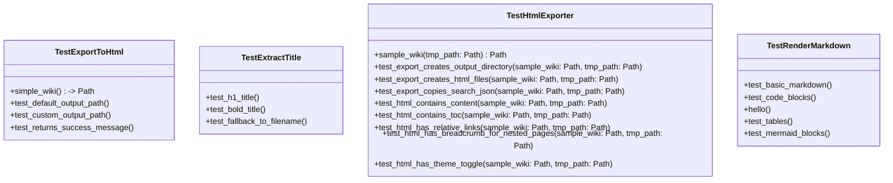

# test_html_export.py

## File Overview

This test module contains comprehensive unit tests for the HTML export functionality of the local_deepwiki system. It tests the [HtmlExporter](../src/local_deepwiki/export/html.md) class and related functions to ensure proper conversion of markdown wiki content to HTML format with navigation, theming, and search capabilities.

## Classes

### TestRenderMarkdown

Tests the markdown rendering functionality to ensure proper conversion of markdown syntax to HTML.

**Key Methods:**
- `test_basic_markdown` - Verifies conversion of basic markdown elements like headers and paragraphs
- `test_code_blocks` - Tests rendering of fenced code blocks with syntax highlighting
- `test_tables` - Tests table rendering (method signature visible but implementation not shown)

### TestExtractTitle

Tests the title extraction functionality from markdown content (class mentioned in imports but implementation not shown in provided code).

### TestHtmlExporter

The [main](../src/local_deepwiki/export/html.md) test class for the [HtmlExporter](../src/local_deepwiki/export/html.md) functionality, containing comprehensive tests for HTML export operations.

**Key Methods:**
- `sample_wiki` - Creates a sample wiki structure for testing with index, architecture, and modules directories
- `test_export_creates_output_directory` - Verifies that the export process creates the specified output directory
- `test_export_creates_html_files` - Tests that HTML files are generated for each markdown file (expects 4 files total)
- `test_export_copies_search_json` - Ensures the search.json file is copied to the output directory
- `test_html_contains_content` - Verifies HTML files contain properly converted markdown content
- `test_html_contains_toc` - Tests that table of contents is included in HTML output
- `test_html_has_relative_links` - Ensures proper relative linking between pages
- `test_html_has_breadcrumb_for_nested_pages` - Tests breadcrumb navigation for nested pages
- `test_html_has_theme_toggle` - Verifies theme toggle functionality is included

### TestExportToHtml

Tests for the [export_to_html](../src/local_deepwiki/export/html.md) convenience function.

**Key Methods:**
- `simple_wiki` - Creates a minimal wiki structure for testing
- `test_default_output_path` - Tests that the default output path follows the pattern `{wiki_path}_html`

## Functions

The module tests several functions imported from `local_deepwiki.export.html`:

- [`export_to_html`](../src/local_deepwiki/export/html.md) - Convenience function for exporting wiki content to HTML
- [`extract_title`](../src/local_deepwiki/export/html.md) - Extracts titles from markdown content
- [`render_markdown`](../src/local_deepwiki/export/html.md) - Converts markdown text to HTML

## Usage Examples

### Testing HTML Export

```python
# Create an HtmlExporter instance
exporter = HtmlExporter(wiki_path, output_path)

# Export the wiki
count = exporter.export()

# Verify output
assert output_path.exists()
assert count == 4  # Expected number of files
```

### Testing Markdown Rendering

```python
# Test basic markdown conversion
md = "# Hello\n\nThis is a paragraph."
html = render_markdown(md)
assert "<h1" in html
assert "<p>" in html
```

## Test Structure

The tests use pytest fixtures to create temporary wiki structures:

- `sample_wiki` - Creates a complete wiki with nested directories and multiple markdown files
- `simple_wiki` - Creates a minimal wiki for basic testing scenarios

All tests use temporary directories (`tmp_path`) to ensure isolation and cleanup.

## Related Components

This test module works with the following components from `local_deepwiki.export.html`:

- [HtmlExporter](../src/local_deepwiki/export/html.md) class - Main export functionality
- [export_to_html](../src/local_deepwiki/export/html.md) function - Convenience [wrapper](../src/local_deepwiki/providers/base.md)
- [extract_title](../src/local_deepwiki/export/html.md) function - Title extraction utility  
- [render_markdown](../src/local_deepwiki/export/html.md) function - Markdown to HTML conversion

The tests verify integration with the wiki structure including `toc.json` files and proper handling of nested directory structures.

## API Reference

### class `TestRenderMarkdown`

Tests for markdown rendering.

**Methods:**

#### `test_basic_markdown`

```python
def test_basic_markdown()
```

Test basic markdown conversion.

#### `test_code_blocks`

```python
def test_code_blocks()
```

Test fenced code blocks.

#### `test_tables`

```python
def test_tables()
```

Test markdown tables.

#### `test_mermaid_blocks`

```python
def test_mermaid_blocks()
```

Test mermaid code blocks are preserved.


### class `TestExtractTitle`

Tests for title extraction.

**Methods:**

#### `test_h1_title`

```python
def test_h1_title(tmp_path: Path)
```

Test extracting H1 title.


| [Parameter](../src/local_deepwiki/generators/api_docs.md) | Type | Default | Description |
|-----------|------|---------|-------------|
| `tmp_path` | `Path` | - | - |

#### `test_bold_title`

```python
def test_bold_title(tmp_path: Path)
```

Test extracting bold title.


| [Parameter](../src/local_deepwiki/generators/api_docs.md) | Type | Default | Description |
|-----------|------|---------|-------------|
| `tmp_path` | `Path` | - | - |

#### `test_fallback_to_filename`

```python
def test_fallback_to_filename(tmp_path: Path)
```

Test fallback to filename when no title found.


| [Parameter](../src/local_deepwiki/generators/api_docs.md) | Type | Default | Description |
|-----------|------|---------|-------------|
| `tmp_path` | `Path` | - | - |


### class `TestHtmlExporter`

Tests for [HtmlExporter](../src/local_deepwiki/export/html.md) class.

**Methods:**

#### `sample_wiki`

```python
def sample_wiki(tmp_path: Path) -> Path
```

Create a sample wiki structure for testing.


| [Parameter](../src/local_deepwiki/generators/api_docs.md) | Type | Default | Description |
|-----------|------|---------|-------------|
| `tmp_path` | `Path` | - | - |

#### `test_export_creates_output_directory`

```python
def test_export_creates_output_directory(sample_wiki: Path, tmp_path: Path)
```

Test that export creates the output directory.


| [Parameter](../src/local_deepwiki/generators/api_docs.md) | Type | Default | Description |
|-----------|------|---------|-------------|
| `sample_wiki` | `Path` | - | - |
| `tmp_path` | `Path` | - | - |

#### `test_export_creates_html_files`

```python
def test_export_creates_html_files(sample_wiki: Path, tmp_path: Path)
```

Test that export creates HTML files for each markdown file.


| [Parameter](../src/local_deepwiki/generators/api_docs.md) | Type | Default | Description |
|-----------|------|---------|-------------|
| `sample_wiki` | `Path` | - | - |
| `tmp_path` | `Path` | - | - |

#### `test_export_copies_search_json`

```python
def test_export_copies_search_json(sample_wiki: Path, tmp_path: Path)
```

Test that export copies search.json.


| [Parameter](../src/local_deepwiki/generators/api_docs.md) | Type | Default | Description |
|-----------|------|---------|-------------|
| `sample_wiki` | `Path` | - | - |
| `tmp_path` | `Path` | - | - |

#### `test_html_contains_content`

```python
def test_html_contains_content(sample_wiki: Path, tmp_path: Path)
```

Test that HTML files contain the converted content.


| [Parameter](../src/local_deepwiki/generators/api_docs.md) | Type | Default | Description |
|-----------|------|---------|-------------|
| `sample_wiki` | `Path` | - | - |
| `tmp_path` | `Path` | - | - |

#### `test_html_contains_toc`

```python
def test_html_contains_toc(sample_wiki: Path, tmp_path: Path)
```

Test that HTML files contain the TOC.


| [Parameter](../src/local_deepwiki/generators/api_docs.md) | Type | Default | Description |
|-----------|------|---------|-------------|
| `sample_wiki` | `Path` | - | - |
| `tmp_path` | `Path` | - | - |

#### `test_html_has_relative_links`

```python
def test_html_has_relative_links(sample_wiki: Path, tmp_path: Path)
```

Test that HTML files use relative links.


| [Parameter](../src/local_deepwiki/generators/api_docs.md) | Type | Default | Description |
|-----------|------|---------|-------------|
| `sample_wiki` | `Path` | - | - |
| `tmp_path` | `Path` | - | - |

#### `test_html_has_breadcrumb_for_nested_pages`

```python
def test_html_has_breadcrumb_for_nested_pages(sample_wiki: Path, tmp_path: Path)
```

Test that nested pages have breadcrumb navigation.


| [Parameter](../src/local_deepwiki/generators/api_docs.md) | Type | Default | Description |
|-----------|------|---------|-------------|
| `sample_wiki` | `Path` | - | - |
| `tmp_path` | `Path` | - | - |

#### `test_html_has_theme_toggle`

```python
def test_html_has_theme_toggle(sample_wiki: Path, tmp_path: Path)
```

Test that HTML files have theme toggle functionality.


| [Parameter](../src/local_deepwiki/generators/api_docs.md) | Type | Default | Description |
|-----------|------|---------|-------------|
| `sample_wiki` | `Path` | - | - |
| `tmp_path` | `Path` | - | - |


### class `TestExportToHtml`

Tests for the [export_to_html](../src/local_deepwiki/export/html.md) convenience function.

**Methods:**

#### `simple_wiki`

```python
def simple_wiki(tmp_path: Path) -> Path
```

Create a simple wiki for testing.


| [Parameter](../src/local_deepwiki/generators/api_docs.md) | Type | Default | Description |
|-----------|------|---------|-------------|
| `tmp_path` | `Path` | - | - |

#### `test_default_output_path`

```python
def test_default_output_path(simple_wiki: Path)
```

Test that default output path is {wiki_path}_html.


| [Parameter](../src/local_deepwiki/generators/api_docs.md) | Type | Default | Description |
|-----------|------|---------|-------------|
| `simple_wiki` | `Path` | - | - |

#### `test_custom_output_path`

```python
def test_custom_output_path(simple_wiki: Path, tmp_path: Path)
```

Test that custom output path is used.


| [Parameter](../src/local_deepwiki/generators/api_docs.md) | Type | Default | Description |
|-----------|------|---------|-------------|
| `simple_wiki` | `Path` | - | - |
| `tmp_path` | `Path` | - | - |

#### `test_returns_success_message`

```python
def test_returns_success_message(simple_wiki: Path, tmp_path: Path)
```

Test that export returns a success message.


| [Parameter](../src/local_deepwiki/generators/api_docs.md) | Type | Default | Description |
|-----------|------|---------|-------------|
| `simple_wiki` | `Path` | - | - |
| `tmp_path` | `Path` | - | - |


## Class Diagram



## Call Graph

```mermaid
flowchart TD
    N0[HtmlExporter]
    N1[TestExportToHtml.simple_wiki]
    N2[TestExportToHtml.test_custo...]
    N3[TestExportToHtml.test_defau...]
    N4[TestExtractTitle.test_bold_...]
    N5[TestExtractTitle.test_fallb...]
    N6[TestExtractTitle.test_h1_title]
    N7[TestHtmlExporter.sample_wiki]
    N8[TestHtmlExporter.test_expor...]
    N9[TestHtmlExporter.test_expor...]
    N10[TestHtmlExporter.test_expor...]
    N11[TestHtmlExporter.test_html_...]
    N12[TestHtmlExporter.test_html_...]
    N13[TestHtmlExporter.test_html_...]
    N14[TestHtmlExporter.test_html_...]
    N15[TestHtmlExporter.test_html_...]
    N16[TestRenderMarkdown.test_bas...]
    N17[TestRenderMarkdown.test_cod...]
    N18[TestRenderMarkdown.test_mer...]
    N19[TestRenderMarkdown.test_tables]
    N20[dumps]
    N21[exists]
    N22[export]
    N23[export_to_html]
    N24[extract_title]
    N25[is_dir]
    N26[mkdir]
    N27[read_text]
    N28[render_markdown]
    N29[write_text]
    N16 --> N28
    N17 --> N28
    N19 --> N28
    N18 --> N28
    N6 --> N29
    N6 --> N24
    N4 --> N29
    N4 --> N24
    N5 --> N29
    N5 --> N24
    N7 --> N26
    N7 --> N29
    N7 --> N20
    N10 --> N0
    N10 --> N22
    N10 --> N21
    N10 --> N25
    N9 --> N0
    N9 --> N22
    N9 --> N21
    N8 --> N0
    N8 --> N22
    N8 --> N21
    N11 --> N0
    N11 --> N22
    N11 --> N27
    N12 --> N0
    N12 --> N22
    N12 --> N27
    N14 --> N0
    N14 --> N22
    N14 --> N27
    N13 --> N0
    N13 --> N22
    N13 --> N27
    N15 --> N0
    N15 --> N22
    N15 --> N27
    N1 --> N26
    N1 --> N29
    N3 --> N23
    N3 --> N21
    N2 --> N23
    N2 --> N21
    classDef func fill:#e1f5fe
    class N0,N20,N21,N22,N23,N24,N25,N26,N27,N28,N29 func
    classDef method fill:#fff3e0
    class N1,N2,N3,N4,N5,N6,N7,N8,N9,N10,N11,N12,N13,N14,N15,N16,N17,N18,N19 method
```



## Relevant Source Files

- `tests/test_html_export.py:11-42`

## See Also

- [test_indexer](test_indexer.md) - shares 3 dependencies
- [test_toc](test_toc.md) - shares 3 dependencies
- [test_pdf_export](test_pdf_export.md) - shares 3 dependencies
