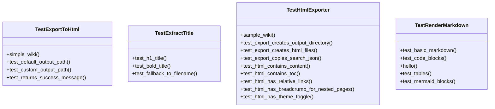

# File Overview

This file contains test cases for the HTML export functionality of the deepwiki tool. It tests the [`HtmlExporter`](../src/local_deepwiki/export/html.md) class and related functions that convert markdown files into HTML, including rendering markdown, extracting titles, and handling navigation elements like breadcrumbs and theme toggles.

# Classes

## TestRenderMarkdown

Tests for markdown rendering functionality.

### Methods

- `test_basic_markdown`: Tests basic markdown conversion to HTML.
- `test_code_blocks`: Tests fenced code block rendering.
- `test_tables`: Tests table rendering.

## TestExtractTitle

Tests for title extraction functionality.

### Methods

- `test_h1_title`: Tests extracting title from H1 markdown header.
- `test_bold_title`: Tests extracting title from bold markdown text.
- `test_fallback_to_filename`: Tests fallback to filename when no title is found.

## TestHtmlExporter

Tests for the [HtmlExporter](../src/local_deepwiki/export/html.md) class that handles conversion of markdown files to HTML.

### Methods

- `sample_wiki`: Creates a sample wiki structure for testing.
- `test_export_creates_output_directory`: Tests that export creates the output directory.
- `test_export_creates_html_files`: Tests that export creates HTML files for each markdown file.
- `test_export_copies_search_json`: Tests that export copies search.json.
- `test_html_contains_content`: Tests that HTML files contain the converted content.
- `test_html_contains_toc`: Tests that HTML files contain the table of contents.
- `test_html_has_relative_links`: Tests that HTML files use relative links.
- `test_html_has_breadcrumb_for_nested_pages`: Tests that nested pages have breadcrumb navigation.
- `test_html_has_theme_toggle`: Tests that HTML files have theme toggle functionality.

## TestExportToHtml

Tests for the [`export_to_html`](../src/local_deepwiki/export/html.md) convenience function.

### Methods

- `test_default_output_path`: Tests that default output path is `{wiki_path}_html`.

# Functions

## export_to_html

Convenience function for exporting a wiki to HTML.

### Parameters

- `wiki_path` (Path): Path to the wiki directory.
- `output_path` (Path, optional): Path to output directory. If not provided, defaults to `{wiki_path}_html`.

### Return Value

- `int`: Number of files exported.

# Usage Examples

## Testing HTML Export

```python
def test_export_creates_output_directory(self, sample_wiki: Path, tmp_path: Path):
    output_path = tmp_path / "html_output"
    exporter = HtmlExporter(sample_wiki, output_path)
    exporter.export()

    assert output_path.exists()
    assert output_path.is_dir()
```

## Testing Markdown Rendering

```python
def test_basic_markdown(self):
    md = "# Hello\n\nThis is a paragraph."
    html = render_markdown(md)
    assert "<h1" in html
    assert "Hello" in html
    assert "<p>" in html
```

## Testing Title Extraction

```python
def test_h1_title(self, tmp_path: Path):
    md_file = tmp_path / "test.md"
    md_file.write_text("# My Title\n\nContent here.")
    assert extract_title(md_file) == "My Title"
```

# Related Components

This file works with the following components from `local_deepwiki.export.html`:

- [`HtmlExporter`](../src/local_deepwiki/export/html.md): Main class for exporting wiki to HTML.
- [`export_to_html`](../src/local_deepwiki/export/html.md): Convenience function for exporting wiki to HTML.
- [`render_markdown`](../src/local_deepwiki/export/html.md): Function for converting markdown to HTML.
- [`extract_title`](../src/local_deepwiki/export/html.md): Function for extracting titles from markdown files.

## API Reference

### class `TestRenderMarkdown`

Tests for markdown rendering.

**Methods:**

#### `test_basic_markdown`

```python
def test_basic_markdown()
```

Test basic markdown conversion.

#### `test_code_blocks`

```python
def test_code_blocks()
```

Test fenced code blocks.

#### `test_tables`

```python
def test_tables()
```

Test markdown tables.

#### `test_mermaid_blocks`

```python
def test_mermaid_blocks()
```

Test mermaid code blocks are preserved.


### class `TestExtractTitle`

Tests for title extraction.

**Methods:**

#### `test_h1_title`

```python
def test_h1_title(tmp_path: Path)
```

Test extracting H1 title.


| [Parameter](../src/local_deepwiki/generators/api_docs.md) | Type | Default | Description |
|-----------|------|---------|-------------|
| `tmp_path` | `Path` | - | - |

#### `test_bold_title`

```python
def test_bold_title(tmp_path: Path)
```

Test extracting bold title.


| [Parameter](../src/local_deepwiki/generators/api_docs.md) | Type | Default | Description |
|-----------|------|---------|-------------|
| `tmp_path` | `Path` | - | - |

#### `test_fallback_to_filename`

```python
def test_fallback_to_filename(tmp_path: Path)
```

Test fallback to filename when no title found.


| [Parameter](../src/local_deepwiki/generators/api_docs.md) | Type | Default | Description |
|-----------|------|---------|-------------|
| `tmp_path` | `Path` | - | - |


### class `TestHtmlExporter`

Tests for [HtmlExporter](../src/local_deepwiki/export/html.md) class.

**Methods:**

#### `sample_wiki`

```python
def sample_wiki(tmp_path: Path) -> Path
```

Create a sample wiki structure for testing.


| [Parameter](../src/local_deepwiki/generators/api_docs.md) | Type | Default | Description |
|-----------|------|---------|-------------|
| `tmp_path` | `Path` | - | - |

#### `test_export_creates_output_directory`

```python
def test_export_creates_output_directory(sample_wiki: Path, tmp_path: Path)
```

Test that export creates the output directory.


| [Parameter](../src/local_deepwiki/generators/api_docs.md) | Type | Default | Description |
|-----------|------|---------|-------------|
| `sample_wiki` | `Path` | - | - |
| `tmp_path` | `Path` | - | - |

#### `test_export_creates_html_files`

```python
def test_export_creates_html_files(sample_wiki: Path, tmp_path: Path)
```

Test that export creates HTML files for each markdown file.


| [Parameter](../src/local_deepwiki/generators/api_docs.md) | Type | Default | Description |
|-----------|------|---------|-------------|
| `sample_wiki` | `Path` | - | - |
| `tmp_path` | `Path` | - | - |

#### `test_export_copies_search_json`

```python
def test_export_copies_search_json(sample_wiki: Path, tmp_path: Path)
```

Test that export copies search.json.


| [Parameter](../src/local_deepwiki/generators/api_docs.md) | Type | Default | Description |
|-----------|------|---------|-------------|
| `sample_wiki` | `Path` | - | - |
| `tmp_path` | `Path` | - | - |

#### `test_html_contains_content`

```python
def test_html_contains_content(sample_wiki: Path, tmp_path: Path)
```

Test that HTML files contain the converted content.


| [Parameter](../src/local_deepwiki/generators/api_docs.md) | Type | Default | Description |
|-----------|------|---------|-------------|
| `sample_wiki` | `Path` | - | - |
| `tmp_path` | `Path` | - | - |

#### `test_html_contains_toc`

```python
def test_html_contains_toc(sample_wiki: Path, tmp_path: Path)
```

Test that HTML files contain the TOC.


| [Parameter](../src/local_deepwiki/generators/api_docs.md) | Type | Default | Description |
|-----------|------|---------|-------------|
| `sample_wiki` | `Path` | - | - |
| `tmp_path` | `Path` | - | - |

#### `test_html_has_relative_links`

```python
def test_html_has_relative_links(sample_wiki: Path, tmp_path: Path)
```

Test that HTML files use relative links.


| [Parameter](../src/local_deepwiki/generators/api_docs.md) | Type | Default | Description |
|-----------|------|---------|-------------|
| `sample_wiki` | `Path` | - | - |
| `tmp_path` | `Path` | - | - |

#### `test_html_has_breadcrumb_for_nested_pages`

```python
def test_html_has_breadcrumb_for_nested_pages(sample_wiki: Path, tmp_path: Path)
```

Test that nested pages have breadcrumb navigation.


| [Parameter](../src/local_deepwiki/generators/api_docs.md) | Type | Default | Description |
|-----------|------|---------|-------------|
| `sample_wiki` | `Path` | - | - |
| `tmp_path` | `Path` | - | - |

#### `test_html_has_theme_toggle`

```python
def test_html_has_theme_toggle(sample_wiki: Path, tmp_path: Path)
```

Test that HTML files have theme toggle functionality.


| [Parameter](../src/local_deepwiki/generators/api_docs.md) | Type | Default | Description |
|-----------|------|---------|-------------|
| `sample_wiki` | `Path` | - | - |
| `tmp_path` | `Path` | - | - |


### class `TestExportToHtml`

Tests for the [export_to_html](../src/local_deepwiki/export/html.md) convenience function.

**Methods:**

#### `simple_wiki`

```python
def simple_wiki(tmp_path: Path) -> Path
```

Create a simple wiki for testing.


| [Parameter](../src/local_deepwiki/generators/api_docs.md) | Type | Default | Description |
|-----------|------|---------|-------------|
| `tmp_path` | `Path` | - | - |

#### `test_default_output_path`

```python
def test_default_output_path(simple_wiki: Path)
```

Test that default output path is {wiki_path}_html.


| [Parameter](../src/local_deepwiki/generators/api_docs.md) | Type | Default | Description |
|-----------|------|---------|-------------|
| `simple_wiki` | `Path` | - | - |

#### `test_custom_output_path`

```python
def test_custom_output_path(simple_wiki: Path, tmp_path: Path)
```

Test that custom output path is used.


| [Parameter](../src/local_deepwiki/generators/api_docs.md) | Type | Default | Description |
|-----------|------|---------|-------------|
| `simple_wiki` | `Path` | - | - |
| `tmp_path` | `Path` | - | - |

#### `test_returns_success_message`

```python
def test_returns_success_message(simple_wiki: Path, tmp_path: Path)
```

Test that export returns a success message.


| [Parameter](../src/local_deepwiki/generators/api_docs.md) | Type | Default | Description |
|-----------|------|---------|-------------|
| `simple_wiki` | `Path` | - | - |
| `tmp_path` | `Path` | - | - |


## Class Diagram



## Call Graph

```mermaid
flowchart TD
    N0[HtmlExporter]
    N1[TestExportToHtml.simple_wiki]
    N2[TestExportToHtml.test_custo...]
    N3[TestExportToHtml.test_defau...]
    N4[TestExtractTitle.test_bold_...]
    N5[TestExtractTitle.test_fallb...]
    N6[TestExtractTitle.test_h1_title]
    N7[TestHtmlExporter.sample_wiki]
    N8[TestHtmlExporter.test_expor...]
    N9[TestHtmlExporter.test_expor...]
    N10[TestHtmlExporter.test_expor...]
    N11[TestHtmlExporter.test_html_...]
    N12[TestHtmlExporter.test_html_...]
    N13[TestHtmlExporter.test_html_...]
    N14[TestHtmlExporter.test_html_...]
    N15[TestHtmlExporter.test_html_...]
    N16[TestRenderMarkdown.test_bas...]
    N17[TestRenderMarkdown.test_cod...]
    N18[TestRenderMarkdown.test_mer...]
    N19[TestRenderMarkdown.test_tables]
    N20[dumps]
    N21[exists]
    N22[export]
    N23[export_to_html]
    N24[extract_title]
    N25[is_dir]
    N26[mkdir]
    N27[read_text]
    N28[render_markdown]
    N29[write_text]
    N16 --> N28
    N17 --> N28
    N19 --> N28
    N18 --> N28
    N6 --> N29
    N6 --> N24
    N4 --> N29
    N4 --> N24
    N5 --> N29
    N5 --> N24
    N7 --> N26
    N7 --> N29
    N7 --> N20
    N10 --> N0
    N10 --> N22
    N10 --> N21
    N10 --> N25
    N9 --> N0
    N9 --> N22
    N9 --> N21
    N8 --> N0
    N8 --> N22
    N8 --> N21
    N11 --> N0
    N11 --> N22
    N11 --> N27
    N12 --> N0
    N12 --> N22
    N12 --> N27
    N14 --> N0
    N14 --> N22
    N14 --> N27
    N13 --> N0
    N13 --> N22
    N13 --> N27
    N15 --> N0
    N15 --> N22
    N15 --> N27
    N1 --> N26
    N1 --> N29
    N3 --> N23
    N3 --> N21
    N2 --> N23
    N2 --> N21
    classDef func fill:#e1f5fe
    class N0,N20,N21,N22,N23,N24,N25,N26,N27,N28,N29 func
    classDef method fill:#fff3e0
    class N1,N2,N3,N4,N5,N6,N7,N8,N9,N10,N11,N12,N13,N14,N15,N16,N17,N18,N19 method
```



## Relevant Source Files

- `tests/test_html_export.py:16-47`

## See Also

- [html](../src/local_deepwiki/export/html.md) - dependency
- [test_incremental_wiki](test_incremental_wiki.md) - shares 3 dependencies
